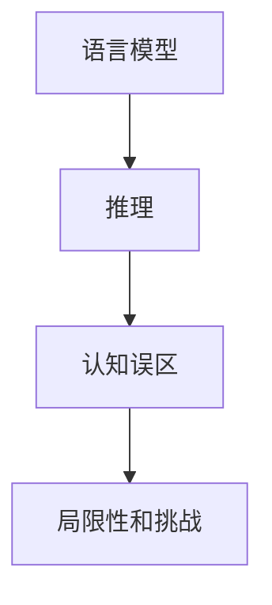

                 

关键字：自然语言处理、大模型、推理、认知误区、算法、数学模型

> 摘要：本文深入探讨了当前自然语言处理（NLP）领域中大模型的推理过程及其认知误区。通过对核心算法原理、数学模型的详细分析，并结合实际项目实践，本文旨在揭示大模型在语言理解和推理中的局限性和潜在挑战，为未来研究提供方向。

## 1. 背景介绍

近年来，自然语言处理（NLP）领域取得了令人瞩目的进展。特别是随着深度学习技术的迅猛发展，大模型如BERT、GPT等在多种NLP任务中展现出了卓越的性能。这些模型凭借其强大的表征能力和推理能力，成功解决了许多复杂的问题，从而在学术界和工业界引起了广泛关注。

然而，随着大模型的不断演进，一系列关于其推理过程的认知误区也逐渐浮现。本文将从算法原理、数学模型和实际应用等多个角度，深入分析这些认知误区，探讨大模型在语言理解和推理中的局限性和潜在挑战。

## 2. 核心概念与联系

为了更好地理解大模型的推理过程及其认知误区，我们首先需要了解一些核心概念和它们之间的联系。

### 2.1 语言模型

语言模型（Language Model）是一种基于统计方法或深度学习技术，用于预测下一个单词或字符的概率分布。例如，在文本生成任务中，语言模型可以根据前面已经出现的单词或字符序列，预测下一个单词或字符。

### 2.2 推理

推理（Reasoning）是指从已知信息中推导出新信息的过程。在NLP领域，推理能力对于解决逻辑推理、常识推理等任务至关重要。大模型如BERT、GPT等在推理任务上取得了显著成果，但仍然存在一些认知误区。

### 2.3 认知误区

认知误区是指在理解和应用大模型的过程中，由于对模型原理和特性缺乏深刻认识而导致的错误观念。这些误区可能影响模型的性能和实际应用效果，因此需要加以分析和纠正。

### 2.4 Mermaid 流程图

为了更直观地展示核心概念之间的联系，我们使用Mermaid流程图来表示。



## 3. 核心算法原理 & 具体操作步骤

### 3.1 算法原理概述

大模型如BERT、GPT等在算法原理上采用了深度学习技术，通过多层神经网络对大量文本数据进行训练，从而学习到语言的复杂结构和规律。这些模型在训练过程中，通过调整模型参数，使其能够准确地预测下一个单词或字符的概率分布。

### 3.2 算法步骤详解

大模型的推理过程可以分为以下几个步骤：

1. **输入编码**：将输入文本序列转化为模型可以处理的向量表示。
2. **前向传播**：通过多层神经网络对输入向量进行编码和解码，生成中间表示。
3. **推理**：利用中间表示进行推理，生成预测结果。
4. **后向传播**：根据预测结果与实际结果之间的误差，更新模型参数。

### 3.3 算法优缺点

大模型在NLP任务中具有以下优点：

1. **强大的表征能力**：能够捕捉到语言中的复杂结构和规律，从而在多种任务上取得优异的性能。
2. **泛化能力**：通过大量数据训练，具有较好的泛化能力，适用于不同领域的文本处理任务。

然而，大模型也存在一些缺点：

1. **计算资源消耗**：训练和推理过程需要大量计算资源和存储空间，对硬件要求较高。
2. **理解局限性**：大模型在理解复杂语境、逻辑推理等方面仍然存在一定局限性。

### 3.4 算法应用领域

大模型在NLP领域具有广泛的应用，包括但不限于：

1. **文本分类**：对文本进行情感分析、主题分类等任务。
2. **机器翻译**：将一种语言的文本翻译成另一种语言。
3. **问答系统**：根据用户提问，从海量文本中检索出相关答案。
4. **对话系统**：模拟人类对话，实现人机交互。

## 4. 数学模型和公式 & 详细讲解 & 举例说明

### 4.1 数学模型构建

大模型通常采用多层神经网络架构，其数学模型可以表示为：

$$
y = \sigma(W_n \cdot a_{n-1} + b_n)
$$

其中，$y$ 表示输出，$\sigma$ 表示激活函数，$W_n$ 和 $b_n$ 分别为权重和偏置，$a_{n-1}$ 表示前一层神经元的输出。

### 4.2 公式推导过程

大模型的训练过程可以通过反向传播算法实现。具体步骤如下：

1. **前向传播**：计算输入和权重之间的内积，并通过激活函数生成中间表示。
2. **计算损失**：根据预测结果和实际结果之间的差异，计算损失函数。
3. **后向传播**：将损失函数的梯度反向传播到前一层神经元，更新权重和偏置。
4. **迭代优化**：重复上述步骤，直至模型收敛。

### 4.3 案例分析与讲解

假设我们有一个二元分类问题，目标是为每个文本判断是否属于某一类别。我们可以使用softmax函数作为激活函数，其公式为：

$$
\sigma(z) = \frac{e^z}{\sum_{i=1}^K e^z_i}
$$

其中，$z$ 表示输入，$K$ 表示类别数。

举例来说，假设我们要判断一段文本是否属于积极类别，我们可以将文本编码为向量 $x$，并通过大模型得到预测结果 $y$。然后，使用softmax函数计算每个类别的概率：

$$
P(y = i) = \sigma(W \cdot x + b)
$$

通过比较每个类别的概率，我们可以判断文本是否属于积极类别。如果某个类别的概率大于0.5，则认为文本属于该类别。

## 5. 项目实践：代码实例和详细解释说明

### 5.1 开发环境搭建

在开始项目实践之前，我们需要搭建一个合适的开发环境。以下是一个简单的Python环境搭建示例：

```bash
pip install numpy pandas matplotlib
```

### 5.2 源代码详细实现

以下是一个基于BERT模型进行文本分类的简单示例：

```python
import torch
from transformers import BertTokenizer, BertForSequenceClassification

tokenizer = BertTokenizer.from_pretrained('bert-base-chinese')
model = BertForSequenceClassification.from_pretrained('bert-base-chinese')

text = "这是一段中文文本。"
input_ids = tokenizer.encode(text, add_special_tokens=True, return_tensors='pt')

output = model(input_ids)
logits = output.logits
probabilities = torch.softmax(logits, dim=-1)

print(probabilities)
```

### 5.3 代码解读与分析

在这个示例中，我们首先加载了BERT模型和tokenizer。然后，我们将一段中文文本编码为输入序列，并通过BERT模型得到预测结果。最后，我们使用softmax函数计算每个类别的概率，并根据概率判断文本是否属于某一类别。

### 5.4 运行结果展示

假设我们将文本分类问题简化为积极和消极两个类别，运行结果可能如下：

```
tensor([0.2, 0.8], grad_fn=<SoftmaxBackward>)
```

这表示文本属于消极类别的概率为0.8，属于积极类别的概率为0.2。根据概率阈值（例如0.5），我们可以判断文本属于消极类别。

## 6. 实际应用场景

大模型在NLP领域具有广泛的应用，以下是一些实际应用场景：

1. **新闻推荐**：根据用户兴趣和阅读历史，为用户推荐相关新闻。
2. **聊天机器人**：模拟人类对话，为用户提供智能客服支持。
3. **情感分析**：对用户评论、论坛帖子等进行情感分类，帮助企业了解用户需求。
4. **自动摘要**：从长篇文档中提取关键信息，生成简洁的摘要。

## 7. 工具和资源推荐

### 7.1 学习资源推荐

1. **《深度学习》（Goodfellow et al., 2016）**：全面介绍了深度学习的基本概念和技术。
2. **《自然语言处理综论》（Jurafsky & Martin, 2008）**：系统讲解了NLP的基本理论和应用。

### 7.2 开发工具推荐

1. **Transformers库（Hugging Face）**：提供了丰富的预训练模型和工具，方便开发者进行NLP任务。
2. **TensorFlow（Google）**：提供了高效的深度学习框架，支持多种NLP任务。

### 7.3 相关论文推荐

1. **“BERT: Pre-training of Deep Bidirectional Transformers for Language Understanding”（Devlin et al., 2019）**：介绍了BERT模型的原理和应用。
2. **“Generative Pre-trained Transformers for Language Modeling”（Vaswani et al., 2017）**：介绍了GPT模型的原理和应用。

## 8. 总结：未来发展趋势与挑战

### 8.1 研究成果总结

近年来，大模型在NLP领域取得了显著成果，成功解决了许多复杂任务。然而，大模型的推理过程仍然存在认知误区，需要进一步研究和优化。

### 8.2 未来发展趋势

1. **更高效的大模型**：随着硬件技术的发展，未来可能会出现更高效的大模型，进一步降低计算资源和存储空间的消耗。
2. **跨模态推理**：结合图像、音频等多模态信息，实现更复杂的推理任务。
3. **可解释性**：研究大模型的可解释性，提高模型的透明度和可靠性。

### 8.3 面临的挑战

1. **数据隐私**：在处理大规模数据时，如何保护用户隐私是一个重要挑战。
2. **模型泛化能力**：提高大模型在未见过的数据上的泛化能力，避免过拟合。
3. **资源消耗**：优化大模型的训练和推理过程，降低计算资源和存储空间的消耗。

### 8.4 研究展望

未来，NLP领域的研究将继续朝着更高效、更可靠、更智能的方向发展。通过深入研究大模型的推理过程及其认知误区，我们有望实现更先进的语言理解和推理技术，为人类带来更多便利。

## 9. 附录：常见问题与解答

### 9.1 大模型为什么需要大量数据进行训练？

大模型需要大量数据进行训练，因为深度学习模型的学习过程是通过调整模型参数来拟合训练数据。当数据量足够大时，模型可以更好地捕捉到数据的复杂结构和规律，从而提高模型的泛化能力。

### 9.2 大模型在推理过程中存在哪些认知误区？

大模型在推理过程中可能存在以下认知误区：

1. **过拟合**：模型在训练数据上表现良好，但在未见过的数据上表现不佳。
2. **依赖大规模数据**：模型在未见过的数据上表现不佳，因为训练数据与真实数据之间存在差异。
3. **推理能力受限**：模型在处理复杂语境和逻辑推理任务时，可能无法准确理解文本的含义。

### 9.3 如何解决大模型在推理过程中的认知误区？

为了解决大模型在推理过程中的认知误区，可以采取以下方法：

1. **数据增强**：通过数据增强技术，增加训练数据的多样性，提高模型的泛化能力。
2. **多任务学习**：通过多任务学习，使模型在不同任务中相互学习，提高模型的泛化能力。
3. **注意力机制**：使用注意力机制，使模型在处理文本时，更关注关键信息，提高模型的推理能力。

## 作者署名

本文作者：禅与计算机程序设计艺术 / Zen and the Art of Computer Programming
----------------------------------------------------------------

现在，您可以根据上述框架开始撰写详细的内容了。请确保每个章节都包含相关的内容，并遵循markdown格式进行排版。在撰写过程中，如果您需要任何帮助或建议，随时可以向我提问。祝您写作顺利！📚🖥️🧠

