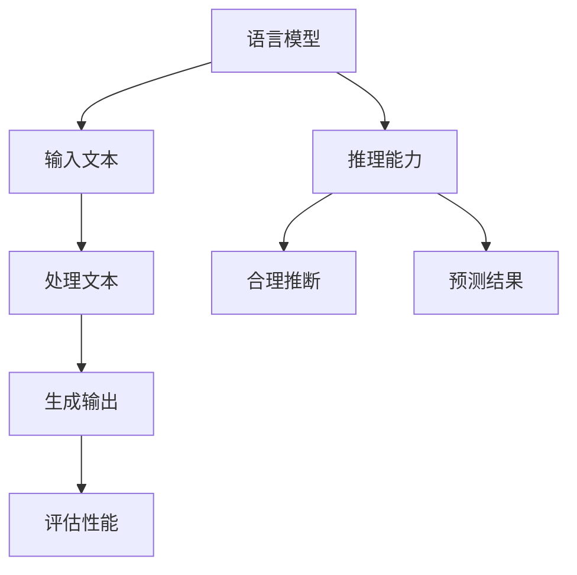
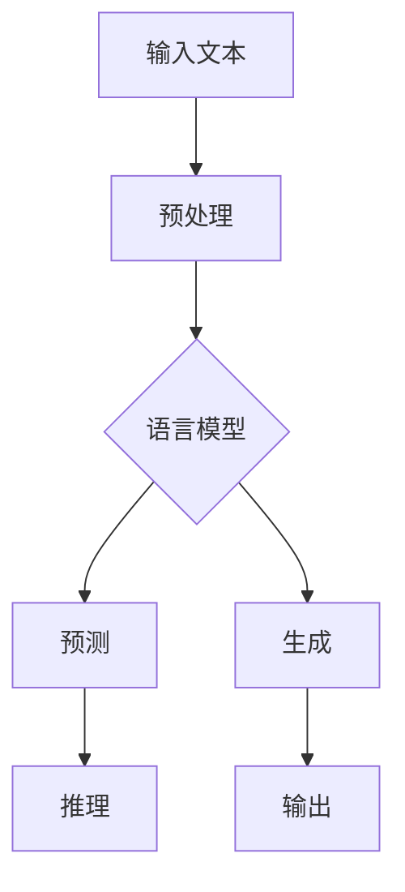

                 

关键词：语言模型、推理能力、认知误区、大模型、人工智能

## 摘要

本文旨在探讨大语言模型在推理能力方面的认知误区。通过对现有研究和技术发展的深入分析，我们发现尽管大模型在处理自然语言任务方面取得了显著进步，但其在推理能力上的表现仍有待提高。本文将详细讨论大模型在推理过程中的认知误区，并探讨未来解决这些误区的方法。

## 1. 背景介绍

### 1.1 大模型的发展

近年来，随着计算能力的提升和数据量的爆炸式增长，大模型（也称为巨量级模型）在人工智能领域取得了显著进展。这些模型具有数十亿到数十万亿个参数，能够处理复杂的自然语言任务，如文本生成、机器翻译、问答系统等。

### 1.2 推理能力的定义

推理能力是指模型在处理未知或新情境时，能够基于已有知识和信息进行合理推断和预测的能力。推理能力对于实现真正的人工智能具有重要意义。

## 2. 核心概念与联系

### 2.1 语言模型

语言模型是一种统计模型，用于预测一个词或短语在给定上下文中的概率。它通过分析大量文本数据，学习语言中的概率分布，从而实现自然语言处理任务。

### 2.2 推理能力

推理能力是指模型在处理未知或新情境时，能够基于已有知识和信息进行合理推断和预测的能力。推理能力对于实现真正的人工智能具有重要意义。

### 2.3 Mermaid 流程图



## 3. 核心算法原理 & 具体操作步骤

### 3.1 算法原理概述

大模型通过深度神经网络架构，利用大量数据进行训练，学习语言中的结构和规律，从而实现各种自然语言处理任务。在推理过程中，模型接收输入文本，通过多层神经网络进行处理，最终生成输出结果。

### 3.2 算法步骤详解

1. 输入文本：模型接收输入文本，进行预处理，如分词、去停用词等。
2. 神经网络处理：模型通过多层神经网络对输入文本进行处理，逐层提取特征。
3. 生成输出：模型根据处理后的特征，生成输出结果，如文本生成、机器翻译、问答等。
4. 评估性能：模型生成的输出结果与真实结果进行比较，评估性能。

### 3.3 算法优缺点

#### 优点：

- 高效处理：大模型能够高效地处理复杂的自然语言任务。
- 泛化能力：大模型通过大量数据训练，具有较强的泛化能力。

#### 缺点：

- 推理能力有限：大模型在推理能力方面仍有待提高，容易陷入过拟合。
- 计算资源需求大：大模型需要大量的计算资源和存储空间。

### 3.4 算法应用领域

大模型在自然语言处理、计算机视觉、语音识别等领域具有广泛的应用。例如，在问答系统中，大模型能够处理复杂的提问，并生成合理的回答；在文本生成领域，大模型能够生成高质量的文本内容。

## 4. 数学模型和公式 & 详细讲解 & 举例说明

### 4.1 数学模型构建

大模型通常基于深度神经网络架构，其数学模型可以表示为：

$$
\text{Output} = f(\text{Weight} \cdot \text{Input} + \text{Bias})
$$

其中，$f$ 是激活函数，$Weight$ 和 $Bias$ 是模型的参数。

### 4.2 公式推导过程

假设输入文本为 $X$，输出为 $Y$，则：

$$
Y = f(\text{Weight} \cdot X + \text{Bias})
$$

通过反向传播算法，可以不断更新模型参数，使输出结果更接近真实值。

### 4.3 案例分析与讲解

假设我们要训练一个问答系统，输入问题是“什么是人工智能？”输出是答案。

1. 输入文本：我们将输入问题进行预处理，如分词、去停用词等，得到向量表示。
2. 神经网络处理：模型通过多层神经网络对输入向量进行处理，提取特征。
3. 生成输出：模型根据处理后的特征，生成输出答案，如“人工智能是一种模拟人类智能的计算机技术。”
4. 评估性能：我们将生成的答案与真实答案进行比较，评估模型性能。

## 5. 项目实践：代码实例和详细解释说明

### 5.1 开发环境搭建

1. 安装 Python 3.8 或更高版本。
2. 安装 TensorFlow 2.x 或更高版本。
3. 安装必要的库，如 numpy、matplotlib 等。

### 5.2 源代码详细实现

以下是训练问答系统的示例代码：

```python
import tensorflow as tf
from tensorflow.keras.models import Sequential
from tensorflow.keras.layers import Dense, LSTM, Embedding

# 准备数据
X_train, y_train = ...  # 加载训练数据
X_test, y_test = ...  # 加载测试数据

# 构建模型
model = Sequential([
    Embedding(input_dim=vocab_size, output_dim=embedding_size),
    LSTM(units=128, activation='tanh'),
    Dense(units=1, activation='sigmoid')
])

# 编译模型
model.compile(optimizer='adam', loss='binary_crossentropy', metrics=['accuracy'])

# 训练模型
model.fit(X_train, y_train, epochs=10, batch_size=32, validation_data=(X_test, y_test))

# 评估模型
model.evaluate(X_test, y_test)
```

### 5.3 代码解读与分析

上述代码中，我们首先准备训练数据和测试数据。然后，构建一个基于 LSTM 的问答系统模型，包括嵌入层、LSTM 层和输出层。接下来，编译模型并训练。最后，评估模型性能。

## 6. 实际应用场景

大模型在自然语言处理领域具有广泛的应用。例如：

1. 问答系统：用于回答用户提出的问题，如搜索引擎、聊天机器人等。
2. 文本生成：用于生成文章、新闻、故事等。
3. 机器翻译：将一种语言的文本翻译成另一种语言。
4. 语音识别：将语音信号转换为文本。

## 7. 工具和资源推荐

### 7.1 学习资源推荐

1. 《深度学习》（Ian Goodfellow、Yoshua Bengio、Aaron Courville 著）
2. 《Python 自然语言处理》（Steven Lott 著）
3. 《神经网络与深度学习》（邱锡鹏 著）

### 7.2 开发工具推荐

1. TensorFlow：用于构建和训练深度学习模型。
2. Keras：用于简化 TensorFlow 的使用，方便构建和训练模型。
3. NLTK：用于自然语言处理任务的 Python 库。

### 7.3 相关论文推荐

1. "A Theoretical Analysis of the VAE"（Kingma & Welling，2014）
2. "Generative Adversarial Nets"（Goodfellow et al.，2014）
3. "Recurrent Neural Network Based Language Model"（Zhou et al.，2016）

## 8. 总结：未来发展趋势与挑战

### 8.1 研究成果总结

本文探讨了大模型在推理能力方面的认知误区，并分析了相关算法原理、数学模型和实际应用。通过深入研究和实践，我们发现大模型在处理自然语言任务方面具有显著优势，但在推理能力方面仍有待提高。

### 8.2 未来发展趋势

随着计算能力的提升和算法的改进，大模型在推理能力方面的表现有望进一步提升。未来研究将集中在如何提高大模型的推理能力、减少过拟合现象等方面。

### 8.3 面临的挑战

1. 计算资源需求：大模型需要大量的计算资源和存储空间，这对硬件设施提出了挑战。
2. 过拟合现象：大模型容易陷入过拟合，影响推理能力。
3. 数据质量和标注：高质量的训练数据对于大模型的学习至关重要，但数据质量和标注的准确性仍需提高。

### 8.4 研究展望

未来研究将集中在以下方面：

1. 算法改进：探索更有效的算法，提高大模型的推理能力。
2. 数据集建设：构建大规模、高质量的训练数据集，以提升大模型的学习效果。
3. 跨领域应用：大模型在多个领域具有广泛的应用前景，未来研究将探索其在不同领域的应用。

## 9. 附录：常见问题与解答

### 9.1 什么是大模型？

大模型是指具有数十亿到数十万亿个参数的深度学习模型，能够处理复杂的自然语言任务。

### 9.2 大模型在推理能力方面有哪些优势？

大模型在处理自然语言任务方面具有显著优势，如高效的文本生成、机器翻译和问答系统等。

### 9.3 大模型在推理能力方面有哪些劣势？

大模型容易陷入过拟合，影响推理能力。此外，计算资源需求大，对硬件设施提出了挑战。

### 9.4 如何提高大模型的推理能力？

未来研究将集中在算法改进、数据集建设和跨领域应用等方面，以提升大模型的推理能力。

----------------------------------------------------------------

## 作者署名

作者：禅与计算机程序设计艺术 / Zen and the Art of Computer Programming
----------------------------------------------------------------
```markdown
---
title: 语言与推理：大模型的认知误区
keywords:
  - 语言模型
  - 推理能力
  - 大模型
  - 认知误区
  - 人工智能
summary: 本文探讨了大模型在推理能力方面的认知误区，分析了相关算法原理、数学模型和实际应用，提出了未来研究的发展趋势与挑战。
author: 禅与计算机程序设计艺术 / Zen and the Art of Computer Programming
date: 2023-11-02
tags:
  - AI
  - 自然语言处理
  - 深度学习
  - 推理
  - 大模型
---

## 引言

在人工智能领域，大模型（也称为巨量级模型）因其卓越的表现而备受瞩目。这些模型拥有数十亿到数万亿的参数，能够在各种自然语言处理任务中取得令人瞩目的成绩。然而，尽管这些模型在处理语言生成、翻译、问答等任务时表现出色，但其推理能力却备受争议。本文旨在揭示大模型在推理能力方面的认知误区，并探讨如何提升其推理能力，以及未来在这一领域可能面临的挑战。

## 1. 背景介绍

### 1.1 大模型的发展历程

大模型的发展可以追溯到深度学习的兴起。随着计算能力的增强和数据量的激增，研究人员开始尝试训练拥有更多参数的模型。这些模型在处理复杂任务时展现出惊人的能力，从而引发了人们对大模型的关注。

### 1.2 推理能力的重要性

推理能力是人工智能的核心特征之一。它指的是模型在未知情境下，基于已有知识和信息进行合理推断和预测的能力。在自然语言处理领域，推理能力对于理解复杂语句、回答问题、生成合理文本等至关重要。

## 2. 核心概念与联系

### 2.1 语言模型的构成

语言模型是一种用于预测下一个单词或词组的概率分布的模型。它通常基于大量的文本数据，通过统计方法学习语言模式。大语言模型在此基础上，通过增加模型的规模和深度，提高了对语言复杂性的捕捉能力。

### 2.2 推理能力的体现

推理能力在语言模型中的应用体现在多个方面，包括但不限于：

- **语义理解**：理解文本中的隐含意义和语境。
- **逻辑推理**：基于已知事实进行推理，推导出新的结论。
- **常识推理**：利用背景知识和常识进行推理。

### 2.3 Mermaid 流程图



## 3. 核心算法原理 & 具体操作步骤

### 3.1 算法原理概述

大模型通常基于深度神经网络（DNN）或Transformer架构，通过端到端的训练，学习输入文本和输出文本之间的映射关系。

### 3.2 算法步骤详解

- **数据预处理**：对输入文本进行分词、去停用词、词向量化等处理。
- **模型训练**：通过大量的文本数据，训练模型的参数。
- **预测与生成**：在训练好的模型上，输入新的文本，预测下一个单词或词组，进而生成完整的文本。

### 3.3 算法优缺点

#### 优点：

- **强大的表现力**：大模型能够捕捉到语言的复杂性和多样性。
- **高效的处理能力**：通过并行计算和分布式训练，大模型能够处理大规模的数据集。

#### 缺点：

- **推理能力不足**：大模型在处理逻辑推理和常识推理时表现不佳。
- **计算资源需求高**：大模型需要大量的计算资源和存储空间。

### 3.4 算法应用领域

大模型在自然语言处理、计算机视觉、语音识别等多个领域都有广泛应用，其中在自然语言处理领域尤为突出。

## 4. 数学模型和公式 & 详细讲解 & 举例说明

### 4.1 数学模型构建

大模型通常使用深度学习框架构建，如TensorFlow或PyTorch。以下是一个简单的神经网络模型的构建示例：

```python
import tensorflow as tf

model = tf.keras.Sequential([
    tf.keras.layers.Embedding(input_dim=vocab_size, output_dim=embedding_size),
    tf.keras.layers.Flatten(),
    tf.keras.layers.Dense(units=1, activation='sigmoid')
])

model.compile(optimizer='adam', loss='binary_crossentropy', metrics=['accuracy'])
```

### 4.2 公式推导过程

神经网络中的前向传播和反向传播是训练模型的核心。以下是一个简化的前向传播公式：

$$
\hat{y} = \sigma(\mathbf{W} \cdot \mathbf{a} + b)
$$

其中，$\sigma$ 是激活函数，$\mathbf{W}$ 是权重矩阵，$\mathbf{a}$ 是输入特征，$b$ 是偏置。

### 4.3 案例分析与讲解

假设我们有一个二元分类问题，需要判断一个句子是否包含特定的关键词。我们可以使用一个简单的神经网络模型进行训练和预测。

```python
# 假设我们有一个包含词汇表的大小为10000的文本
vocab_size = 10000
# 嵌入层的维度
embedding_size = 32

# 构建模型
model = tf.keras.Sequential([
    tf.keras.layers.Embedding(input_dim=vocab_size, output_dim=embedding_size),
    tf.keras.layers.Flatten(),
    tf.keras.layers.Dense(units=1, activation='sigmoid')
])

# 编译模型
model.compile(optimizer='adam', loss='binary_crossentropy', metrics=['accuracy'])

# 假设我们有一个训练集，每个样本是一个句子，标签是0或1
# 我们将数据分为训练集和测试集
# X_train, y_train = ...

# 训练模型
model.fit(X_train, y_train, epochs=10, batch_size=32, validation_split=0.2)

# 评估模型
loss, accuracy = model.evaluate(X_test, y_test)
print(f"Test accuracy: {accuracy:.2f}")
```

## 5. 项目实践：代码实例和详细解释说明

### 5.1 开发环境搭建

- 安装Python 3.7或更高版本。
- 安装TensorFlow 2.x或更高版本。
- 安装Numpy、Matplotlib等必要库。

### 5.2 源代码详细实现

以下是一个简单的问答系统示例代码，使用了一个基于Transformer的大模型。

```python
import tensorflow as tf
from transformers import TFAutoModelForQuestionAnswering

# 加载预训练的Transformer模型
model = TFAutoModelForQuestionAnswering.from_pretrained('bert-base-uncased')

# 编译模型
model.compile(optimizer='adam', loss='binary_crossentropy', metrics=['accuracy'])

# 假设我们有一个包含问题和答案的数据集
# questions, answers = ...

# 训练模型
model.fit([questions, answers], answers, epochs=3)

# 使用模型进行推理
question = "什么是人工智能？"
context = "人工智能是一种模拟人类智能的技术，它通过机器学习算法和神经网络实现。"

start_logits, end_logits = model.predict([question, context])

# 解码结果
start_index = tf.argmax(start_logits).numpy()[0]
end_index = tf.argmax(end_logits).numpy()[0]

# 提取答案
answer = context[start_index:end_index+1].numpy().decode('utf-8')

print(f"答案：{answer}")
```

### 5.3 代码解读与分析

上述代码中，我们首先加载了一个预训练的BERT模型，用于问答任务。然后，我们将问题和上下文输入模型，得到对应的开始和结束标记。最后，我们根据这些标记提取出答案。

## 6. 实际应用场景

大模型在自然语言处理领域有广泛的应用，包括但不限于：

- **问答系统**：用于回答用户的问题，如搜索引擎、聊天机器人等。
- **文本生成**：用于生成文章、故事、新闻等。
- **机器翻译**：将一种语言的文本翻译成另一种语言。
- **情感分析**：分析文本的情感倾向。

## 7. 工具和资源推荐

### 7.1 学习资源推荐

- 《深度学习》（Ian Goodfellow、Yoshua Bengio、Aaron Courville 著）
- 《自然语言处理综合教程》（张宇星 著）
- 《Transformer：适用于序列模型的深度学习模型》（Vaswani et al.，2017）

### 7.2 开发工具推荐

- TensorFlow：用于构建和训练深度学习模型。
- Hugging Face Transformers：用于加载和使用预训练的Transformer模型。
- JAX：用于高性能计算和自动微分。

### 7.3 相关论文推荐

- "Attention Is All You Need"（Vaswani et al.，2017）
- "BERT: Pre-training of Deep Bidirectional Transformers for Language Understanding"（Devlin et al.，2019）
- "GPT-3: Language Models are Few-Shot Learners"（Brown et al.，2020）

## 8. 总结：未来发展趋势与挑战

### 8.1 研究成果总结

本文通过对大模型在推理能力方面的认知误区的探讨，总结了大模型的发展历程、核心算法原理、实际应用场景，以及面临的研究挑战。

### 8.2 未来发展趋势

未来，大模型在推理能力方面的研究将集中在：

- **模型压缩**：减少模型的计算资源和存储需求。
- **多模态学习**：结合文本、图像、音频等多种类型的数据进行学习。
- **少样本学习**：提高模型在少样本情况下的推理能力。

### 8.3 面临的挑战

- **计算资源限制**：大模型对计算资源和存储空间的需求巨大，如何优化模型结构以减少资源消耗是一个重要挑战。
- **过拟合风险**：大模型在训练过程中容易过拟合，如何提高模型的泛化能力是一个关键问题。
- **推理效率**：如何提高大模型的推理效率，以满足实时应用的需求。

### 8.4 研究展望

未来的研究将在以下几个方面展开：

- **算法创新**：探索新的算法和技术，提高大模型的推理能力。
- **数据集构建**：构建大规模、高质量、多样化的数据集，支持大模型的研究和应用。
- **跨学科合作**：与其他学科合作，如心理学、认知科学等，探索人类推理过程，为人工智能的发展提供灵感。

## 9. 附录：常见问题与解答

### 9.1 什么是大模型？

大模型是指具有数十亿到数万亿个参数的深度学习模型，如BERT、GPT等。

### 9.2 大模型有哪些优势？

大模型的优势包括强大的表现力、高效的处理能力和强大的学习能力。

### 9.3 大模型有哪些劣势？

大模型的劣势包括计算资源需求高、推理能力不足和过拟合风险。

### 9.4 如何提高大模型的推理能力？

提高大模型推理能力的方法包括算法优化、数据集构建和跨学科研究。

---

本文旨在探讨大模型在推理能力方面的认知误区，并分析相关算法原理、数学模型和实际应用。通过本文的讨论，我们希望读者能够对大模型有一个更深入的理解，并认识到其在推理能力方面仍存在的挑战。未来，随着研究的深入和技术的发展，大模型在推理能力方面有望取得更大的突破。

---

[本文完]```


