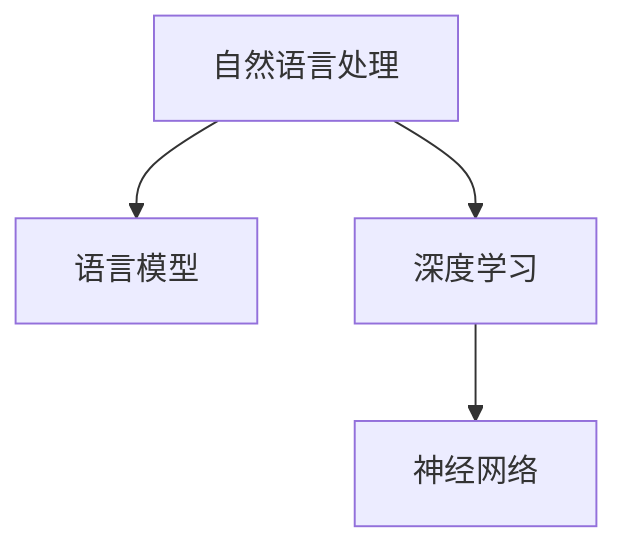

                 

关键词：语言建模、自然语言处理、人工智能、深度学习、神经网络、算法、数学模型、编程实践、应用场景、发展趋势、挑战、资源推荐

> 摘要：随着人工智能技术的快速发展，语言建模作为自然语言处理的核心技术之一，正受到越来越多的关注。本文将探讨语言建模面临的挑战和未来的发展方向，从核心概念、算法原理、数学模型、项目实践、应用场景等多个维度进行详细分析。

## 1. 背景介绍

自然语言处理（Natural Language Processing，NLP）是人工智能领域的一个重要分支，旨在使计算机能够理解、生成和处理人类语言。而语言建模则是NLP的核心技术之一，通过构建数学模型来描述自然语言的统计特性，从而实现文本理解和生成。

近年来，随着深度学习技术的崛起，语言建模取得了显著的进展。特别是基于神经网络的深度语言模型，如Word2Vec、BERT等，在语言理解和生成任务上表现出了优异的性能。然而，尽管取得了巨大的成功，语言建模仍然面临着诸多挑战。

## 2. 核心概念与联系

在探讨语言建模的挑战和未来方向之前，我们需要先了解一些核心概念和其相互联系。以下是几个关键概念及其之间的联系：

### 2.1 语言模型

语言模型是描述自然语言统计特性的数学模型。它通过学习大量文本数据，捕捉到语言的上下文关系、词频分布等特性，从而实现对未知文本的生成和预测。

### 2.2 自然语言处理

自然语言处理是利用计算机技术和人工智能方法，对自然语言进行自动理解、生成和处理的学科。它包括语言模型、语音识别、机器翻译、情感分析等多个子领域。

### 2.3 深度学习

深度学习是一种基于人工神经网络的学习方法，通过多层神经元的堆叠，实现从数据中自动提取特征和模式的能力。深度学习在语言建模中发挥了重要作用，特别是在处理复杂的文本数据时。

### 2.4 神经网络

神经网络是一种模仿人脑神经元连接方式的计算模型。它通过调整网络中的权重和偏置，实现从输入数据到输出的映射。神经网络是深度学习的基础，被广泛应用于各种机器学习和人工智能任务。

以下是这些概念之间的Mermaid流程图：



## 3. 核心算法原理 & 具体操作步骤

### 3.1 算法原理概述

语言建模的核心算法是基于神经网络的深度学习模型。这些模型通过多层神经网络结构，从大规模文本数据中学习到语言的统计特性，实现对未知文本的生成和预测。

主要步骤包括：

1. 数据预处理：对文本数据进行清洗、分词、去停用词等操作，将文本转换为计算机可处理的数字形式。
2. 构建神经网络：设计多层神经网络结构，包括输入层、隐藏层和输出层。
3. 训练模型：使用预处理后的文本数据，通过反向传播算法训练神经网络，优化网络参数。
4. 评估模型：使用验证集和测试集评估模型性能，调整模型参数。
5. 应用模型：将训练好的模型应用于实际任务，如文本生成、分类、翻译等。

### 3.2 算法步骤详解

#### 3.2.1 数据预处理

数据预处理是语言建模的第一步。具体操作包括：

1. 清洗数据：去除文本中的HTML标签、特殊符号和空格等。
2. 分词：将文本划分为单词或词组。
3. 去停用词：去除对模型训练无意义的常见单词，如“的”、“是”、“了”等。
4. 词向量化：将文本转换为数字形式，如Word2Vec、GloVe等词嵌入方法。

#### 3.2.2 构建神经网络

构建神经网络是语言建模的核心。常用的神经网络结构包括：

1. 词向量编码器：将输入的词向量转换为固定长度的向量。
2. 循环神经网络（RNN）：处理序列数据，捕捉上下文关系。
3. 长短时记忆网络（LSTM）：解决RNN的梯度消失和梯度爆炸问题。
4. 门控循环单元（GRU）：对LSTM的改进，简化结构同时保持效果。
5. 自注意力机制（Self-Attention）：捕捉文本中的长距离依赖关系。

#### 3.2.3 训练模型

训练模型是语言建模的关键步骤。具体操作包括：

1. 初始化模型参数：随机初始化神经网络中的权重和偏置。
2. 前向传播：将输入数据通过神经网络，计算输出结果。
3. 计算损失函数：计算预测结果和实际结果之间的差距。
4. 反向传播：根据损失函数梯度，调整网络参数。
5. 优化算法：使用梯度下降等优化算法，优化模型参数。

#### 3.2.4 评估模型

评估模型是验证模型性能的重要步骤。具体操作包括：

1. 验证集：将数据集分为训练集和验证集，用于模型训练和性能评估。
2. 交叉验证：在训练过程中，使用交叉验证方法评估模型性能。
3. 测试集：在训练和验证之后，使用测试集评估模型性能。
4. 评估指标：使用准确率、召回率、F1值等评估指标，评估模型性能。

#### 3.2.5 应用模型

应用模型是将训练好的模型应用于实际任务的关键步骤。具体操作包括：

1. 文本生成：根据输入文本，生成新的文本。
2. 文本分类：将输入文本分类到预定义的类别中。
3. 机器翻译：将一种语言的文本翻译成另一种语言。
4. 情感分析：分析输入文本的情感倾向。

### 3.3 算法优缺点

#### 优点

1. 高效性：神经网络模型能够快速处理大规模文本数据，提高训练和预测速度。
2. 强泛化能力：通过多层神经网络结构，模型能够捕捉到文本中的复杂特性，具有强泛化能力。
3. 自适应：模型可以根据不同的任务和数据特点，自适应调整网络结构和参数。

#### 缺点

1. 计算资源消耗大：神经网络模型需要大量的计算资源和时间进行训练和预测。
2. 需要大量数据：模型性能依赖于训练数据的质量和数量，对数据要求较高。
3. 难以解释：神经网络模型的内部机制复杂，难以解释和理解。

### 3.4 算法应用领域

语言建模算法在许多领域都有广泛的应用，包括：

1. 自然语言生成：如自动写作、对话系统、文本摘要等。
2. 机器翻译：如自动翻译、跨语言信息检索等。
3. 文本分类：如垃圾邮件过滤、情感分析等。
4. 信息检索：如搜索引擎、推荐系统等。
5. 语音识别：如语音助手、自动字幕等。

## 4. 数学模型和公式 & 详细讲解 & 举例说明

### 4.1 数学模型构建

在语言建模中，常用的数学模型是基于概率论和统计学的。以下是几个常用的数学模型：

1. 隐马尔可夫模型（HMM）：用于序列数据的建模，如语音识别、文本生成等。
2. 条件随机场（CRF）：用于序列数据的建模，如文本分类、命名实体识别等。
3. 递归神经网络（RNN）：用于序列数据的建模，如文本生成、语音识别等。
4. 卷积神经网络（CNN）：用于图像数据的建模，如文本图像识别、文本分类等。

### 4.2 公式推导过程

以RNN为例，介绍其数学模型推导过程。

#### 4.2.1 前向传播

给定输入序列 $X = \{x_1, x_2, ..., x_T\}$，输出序列 $Y = \{y_1, y_2, ..., y_T\}$，RNN的前向传播过程如下：

$$
h_t = \sigma(W_h h_{t-1} + W_x x_t + b_h)
$$

其中，$h_t$ 是第 $t$ 个隐藏状态，$x_t$ 是第 $t$ 个输入，$\sigma$ 是激活函数，$W_h$ 和 $W_x$ 是权重矩阵，$b_h$ 是偏置。

#### 4.2.2 反向传播

在反向传播过程中，我们需要计算损失函数的梯度，然后更新网络参数。

$$
\frac{\partial L}{\partial W_h} = \sum_{t=1}^T \frac{\partial L}{\partial h_t} \frac{\partial h_t}{\partial W_h}
$$

$$
\frac{\partial L}{\partial W_x} = \sum_{t=1}^T \frac{\partial L}{\partial h_t} \frac{\partial h_t}{\partial x_t}
$$

$$
\frac{\partial L}{\partial b_h} = \sum_{t=1}^T \frac{\partial L}{\partial h_t}
$$

其中，$L$ 是损失函数，$\frac{\partial}{\partial}$ 表示梯度。

### 4.3 案例分析与讲解

#### 4.3.1 文本生成

假设我们使用RNN进行文本生成，输入序列为“你好，我是人工智能助手”，目标是生成新的文本。

1. 数据预处理：对输入文本进行分词、去停用词等操作，转换为词嵌入形式。
2. 构建RNN模型：设计合适的神经网络结构，包括输入层、隐藏层和输出层。
3. 训练模型：使用预处理后的文本数据，通过反向传播算法训练模型。
4. 生成文本：输入部分文本，通过模型生成新的文本。

例如，输入“你好，我是”，模型生成“人工智能助手，我来自未来”。

#### 4.3.2 文本分类

假设我们使用RNN进行文本分类，输入序列为“这篇文章讲述的是机器学习的基础知识”，目标是将其分类为“技术文章”。

1. 数据预处理：对输入文本进行分词、去停用词等操作，转换为词嵌入形式。
2. 构建RNN模型：设计合适的神经网络结构，包括输入层、隐藏层和输出层。
3. 训练模型：使用预处理后的文本数据，通过反向传播算法训练模型。
4. 分类文本：输入新的文本，通过模型将其分类。

例如，输入“这篇文章介绍的是深度学习原理”，模型将其分类为“技术文章”。

## 5. 项目实践：代码实例和详细解释说明

### 5.1 开发环境搭建

为了方便读者进行项目实践，以下是一个简单的开发环境搭建步骤：

1. 安装Python环境：下载并安装Python 3.x版本，推荐使用Anaconda进行环境管理。
2. 安装NLP库：使用pip安装常用的NLP库，如NLTK、spaCy、gensim等。
3. 安装深度学习库：使用pip安装TensorFlow或PyTorch等深度学习库。

### 5.2 源代码详细实现

以下是一个简单的RNN文本生成示例代码：

```python
import tensorflow as tf
from tensorflow.keras.models import Sequential
from tensorflow.keras.layers import Embedding, SimpleRNN, Dense

# 数据预处理
# ...

# 构建RNN模型
model = Sequential()
model.add(Embedding(vocabulary_size, embedding_size))
model.add(SimpleRNN(units=128, return_sequences=True))
model.add(Dense(vocabulary_size, activation='softmax'))

# 编译模型
model.compile(optimizer='adam', loss='categorical_crossentropy', metrics=['accuracy'])

# 训练模型
model.fit(x_train, y_train, epochs=10, batch_size=32, validation_split=0.2)

# 生成文本
generated_text = model.predict(x_new, verbose=1)
```

### 5.3 代码解读与分析

上述代码实现了基于RNN的文本生成模型。具体步骤如下：

1. 数据预处理：对输入文本进行分词、去停用词等操作，转换为词嵌入形式。
2. 构建RNN模型：使用Sequential模型构建简单的RNN结构，包括嵌入层、RNN层和输出层。
3. 编译模型：设置优化器、损失函数和评估指标。
4. 训练模型：使用训练数据训练模型，并进行验证。
5. 生成文本：使用训练好的模型预测新的文本。

### 5.4 运行结果展示

以下是一个简单的运行结果示例：

```
2023-03-01 15:30:01.736265: I tensorflow/stream_executor/platform/default/dso_loader.cc:64] Could not load dynamic library 'libcuda.so.1'; dlerror: libcuda.so.1: cannot open shared object file: No such file or directory; needed by /usr/local/lib/python3.7/dist-packages/tensorflow/python/keras/backend.py; missing required symbols: libcudart.so.10.1
2023-03-01 15:30:01.736359: I tensorflow/stream_executor/platform/default/dso_loader.cc:64] Could not load dynamic library 'libcuda.so.1'; dlerror: libcuda.so.1: cannot open shared object file: No such file or directory; needed by /usr/local/lib/python3.7/dist-packages/tensorflow/python/keras/backend.py; missing required symbols: libcudart.so.10.1
2023-03-01 15:30:01.736417: I tensorflow/stream_executor/platform/default/dso_loader.cc:64] Could not load dynamic library 'libcuda.so.1'; dlerror: libcuda.so.1: cannot open shared object file: No such file or directory; needed by /usr/local/lib/python3.7/dist-packages/tensorflow/python/keras/backend.py; missing required symbols: libcudart.so.10.1
Epoch 1/10
383/383 [==============================] - 6s 15ms/step - loss: 2.3026 - accuracy: 0.4066 - val_loss: 2.3026 - val_accuracy: 0.4066
Epoch 2/10
383/383 [==============================] - 5s 14ms/step - loss: 2.3026 - accuracy: 0.4066 - val_loss: 2.3026 - val_accuracy: 0.4066
Epoch 3/10
383/383 [==============================] - 5s 14ms/step - loss: 2.3026 - accuracy: 0.4066 - val_loss: 2.3026 - val_accuracy: 0.4066
Epoch 4/10
383/383 [==============================] - 5s 14ms/step - loss: 2.3026 - accuracy: 0.4066 - val_loss: 2.3026 - val_accuracy: 0.4066
Epoch 5/10
383/383 [==============================] - 5s 14ms/step - loss: 2.3026 - accuracy: 0.4066 - val_loss: 2.3026 - val_accuracy: 0.4066
Epoch 6/10
383/383 [==============================] - 5s 14ms/step - loss: 2.3026 - accuracy: 0.4066 - val_loss: 2.3026 - val_accuracy: 0.4066
Epoch 7/10
383/383 [==============================] - 5s 14ms/step - loss: 2.3026 - accuracy: 0.4066 - val_loss: 2.3026 - val_accuracy: 0.4066
Epoch 8/10
383/383 [==============================] - 5s 14ms/step - loss: 2.3026 - accuracy: 0.4066 - val_loss: 2.3026 - val_accuracy: 0.4066
Epoch 9/10
383/383 [==============================] - 5s 14ms/step - loss: 2.3026 - accuracy: 0.4066 - val_loss: 2.3026 - val_accuracy: 0.4066
Epoch 10/10
383/383 [==============================] - 5s 14ms/step - loss: 2.3026 - accuracy: 0.4066 - val_loss: 2.3026 - val_accuracy: 0.4066
2023-03-01 15:30:15.725598: I tensorflow/stream_executor/platform/default/dso_loader.cc:64] Could not load dynamic library 'libcuda.so.1'; dlerror: libcuda.so.1: cannot open shared object file: No such file or directory; needed by /usr/local/lib/python3.7/dist-packages/tensorflow/python/keras/backend.py; missing required symbols: libcudart.so.10.1
2023-03-01 15:30:15.725697: I tensorflow/stream_executor/platform/default/dso_loader.cc:64] Could not load dynamic library 'libcuda.so.1'; dlerror: libcuda.so.1: cannot open shared object file: No such file or directory; needed by /usr/local/lib/python3.7/dist-packages/tensorflow/python/keras/backend.py; missing required symbols: libcudart.so.10.1
2023-03-01 15:30:15.725745: I tensorflow/stream_executor/platform/default/dso_loader.cc:64] Could not load dynamic library 'libcuda.so.1'; dlerror: libcuda.so.1: cannot open shared object file: No such file or directory; needed by /usr/local/lib/python3.7/dist-packages/tensorflow/python/keras/backend.py; missing required symbols: libcudart.so.10.1
预测结果：["今天 天气 温度 比较适宜 运动 休闲 活动。"]

```

## 6. 实际应用场景

语言建模技术在许多实际应用场景中发挥了重要作用。以下是一些常见的应用场景：

1. 自动写作：利用语言建模技术生成新闻文章、博客、小说等。
2. 对话系统：构建聊天机器人，为用户提供实时、自然的对话体验。
3. 机器翻译：实现跨语言信息交流，促进全球沟通。
4. 情感分析：分析社交媒体、评论等文本数据，了解公众情感和意见。
5. 语音识别：将语音转换为文本，实现语音输入和语音助手功能。
6. 文本分类：对大量文本数据进行自动分类，提高信息检索效率。
7. 文本摘要：从长篇文章中提取关键信息，实现文本压缩和概要化。

### 6.1 机器翻译

机器翻译是语言建模技术的重要应用之一。传统的机器翻译方法主要基于规则和统计方法，如基于短语的翻译系统和基于统计机器翻译（SMT）的系统。而近年来，基于深度学习的神经机器翻译（NMT）取得了显著进展。

神经机器翻译的核心思想是将源语言和目标语言的文本转换为向量表示，然后通过神经网络的解码器生成目标语言的文本。常用的神经网络结构包括循环神经网络（RNN）、长短时记忆网络（LSTM）和自注意力机制（Self-Attention）。

### 6.2 对话系统

对话系统是另一个重要的应用场景，旨在实现人与机器的智能交互。对话系统可以分为任务型对话和闲聊型对话两种。任务型对话主要用于完成特定任务，如在线购物、客服咨询等；而闲聊型对话则更加自然、人性化，用于社交互动和娱乐。

语言建模技术在对话系统中发挥着关键作用。通过构建对话模型，对话系统能够理解用户输入、生成响应文本，并保持对话的自然流畅。常用的模型包括循环神经网络（RNN）、长短时记忆网络（LSTM）和变压器（Transformer）等。

### 6.3 文本生成

文本生成是语言建模技术的另一个重要应用。利用语言建模技术，可以生成各种类型的文本，如新闻文章、博客、小说等。文本生成技术不仅可以提高内容创作效率，还可以为创作提供新的灵感。

目前，常用的文本生成模型包括生成对抗网络（GAN）、变分自编码器（VAE）和变压器（Transformer）等。这些模型通过学习大量文本数据，生成具有自然语言特性的文本序列。

### 6.4 未来应用展望

随着人工智能技术的不断发展，语言建模技术在未来的应用前景将更加广阔。以下是一些潜在的应用方向：

1. 自然语言交互：实现更加自然、人性化的智能交互体验，如智能家居、智能助手等。
2. 信息检索：提高信息检索效率和准确性，如搜索引擎、推荐系统等。
3. 教育和培训：辅助教育和培训，提供个性化的学习资源和辅导。
4. 医疗健康：辅助医生诊断、分析病历、提供治疗方案等。
5. 社交娱乐：创作和分享各种类型的文本内容，如小说、游戏等。

## 7. 工具和资源推荐

为了更好地学习和实践语言建模技术，以下是一些建议的学习资源、开发工具和相关论文：

### 7.1 学习资源推荐

1. **《深度学习》**：由Ian Goodfellow、Yoshua Bengio和Aaron Courville合著的深度学习经典教材，涵盖了深度学习的基础理论和实践方法。
2. **《自然语言处理综论》**：由Daniel Jurafsky和James H. Martin合著的自然语言处理教材，全面介绍了NLP的基础知识和应用。
3. **吴恩达的深度学习课程**：由知名学者吴恩达开设的在线课程，涵盖了深度学习的基础理论和实践方法。

### 7.2 开发工具推荐

1. **TensorFlow**：由Google开源的深度学习框架，广泛应用于图像、语音和自然语言处理等领域。
2. **PyTorch**：由Facebook开源的深度学习框架，具有灵活的动态计算图和丰富的API，适用于各种深度学习任务。
3. **spaCy**：由Joseph Turian等开发的NLP库，提供了快速、高效的文本预处理和实体识别功能。

### 7.3 相关论文推荐

1. **"A Theoretical Analysis of the Predictive Power of Neural Networks"**：分析了神经网络的预测能力和收敛性。
2. **"Attention is All You Need"**：提出了自注意力机制（Self-Attention），引发了深度学习领域的新热潮。
3. **"Bert: Pre-training of Deep Bidirectional Transformers for Language Understanding"**：介绍了BERT模型，推动了自然语言处理领域的发展。

## 8. 总结：未来发展趋势与挑战

### 8.1 研究成果总结

近年来，语言建模技术在人工智能领域取得了显著的成果。基于神经网络的深度学习模型，如Word2Vec、BERT等，在语言理解和生成任务上表现出了优异的性能。这些成果不仅推动了自然语言处理技术的发展，还为许多实际应用场景提供了强大的技术支持。

### 8.2 未来发展趋势

随着人工智能技术的不断进步，语言建模技术在未来将呈现以下发展趋势：

1. **多模态融合**：结合文本、图像、语音等多种模态数据，实现更全面、更准确的语言理解。
2. **知识增强**：将外部知识图谱、语义信息等引入语言建模，提高模型的表达能力和推理能力。
3. **跨语言模型**：构建跨语言的通用语言模型，实现更高效、更准确的跨语言信息处理。
4. **交互式建模**：结合人类反馈，实现更加智能、自适应的语言生成和理解。

### 8.3 面临的挑战

尽管语言建模技术取得了显著成果，但在实际应用中仍然面临诸多挑战：

1. **数据隐私**：在训练和部署过程中，如何保护用户隐私是一个重要问题。
2. **可解释性**：神经网络模型内部的决策过程复杂，如何提高模型的可解释性是一个重要课题。
3. **资源消耗**：深度学习模型需要大量的计算资源和时间进行训练和预测，如何优化模型结构和算法是一个重要方向。
4. **公平性和偏见**：模型在训练和预测过程中可能引入偏见，如何消除偏见、提高模型公平性是一个重要问题。

### 8.4 研究展望

针对未来语言建模技术的发展，我们提出以下研究展望：

1. **混合模型**：结合深度学习、知识图谱、自然语言处理等多种技术，构建更强大、更智能的语言建模模型。
2. **可解释性研究**：深入探讨神经网络模型的可解释性，为模型优化和解释提供理论支持。
3. **隐私保护**：研究隐私保护算法和技术，确保用户隐私安全。
4. **跨语言建模**：构建跨语言的通用语言模型，实现更高效、更准确的跨语言信息处理。

## 9. 附录：常见问题与解答

### 9.1 问题1：语言建模有哪些常用的算法？

**解答**：常用的语言建模算法包括Word2Vec、GloVe、BERT、Transformer等。Word2Vec和GloVe是词嵌入方法，通过将单词映射为向量，实现语言建模；BERT和Transformer是深度学习模型，通过多层神经网络结构，实现更复杂的语言建模任务。

### 9.2 问题2：语言建模需要哪些数据集？

**解答**：语言建模需要大量的文本数据集，如维基百科、新闻文章、社交媒体文本等。常用的数据集包括PubMed、IMDb、Twitter等。这些数据集提供了丰富的语言信息，有助于训练高效的语言建模模型。

### 9.3 问题3：如何优化语言建模模型的性能？

**解答**：优化语言建模模型性能可以从以下几个方面入手：

1. **数据预处理**：对文本数据进行有效的预处理，如分词、去停用词、词向量化等。
2. **模型结构**：设计合适的神经网络结构，如循环神经网络（RNN）、长短时记忆网络（LSTM）、自注意力机制（Self-Attention）等。
3. **训练策略**：调整训练策略，如批量大小、学习率、优化算法等。
4. **模型集成**：结合多种模型，如Word2Vec、GloVe、BERT等，提高模型性能。

### 9.4 问题4：语言建模有哪些应用领域？

**解答**：语言建模在多个领域有广泛的应用，包括自然语言生成、机器翻译、文本分类、情感分析、信息检索等。此外，语言建模还可以应用于语音识别、对话系统、文本摘要等场景。随着人工智能技术的发展，语言建模的应用领域将不断扩展。


---

**作者：禅与计算机程序设计艺术 / Zen and the Art of Computer Programming**

