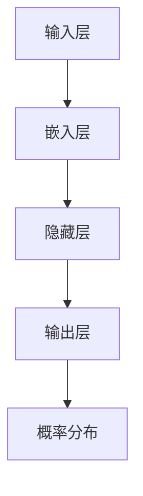

                 

关键词：语言模型，原理，神经网络，代码实例，自然语言处理，深度学习

> 摘要：本文将深入探讨语言模型的原理，包括其核心概念、构建方法和具体实现步骤。我们将通过详细的代码实例，帮助读者更好地理解语言模型的工作机制，并了解其在自然语言处理领域的重要性。文章还将在最后讨论语言模型的应用场景和未来发展趋势。

## 1. 背景介绍

语言模型（Language Model）是自然语言处理（Natural Language Processing, NLP）和机器学习（Machine Learning）领域中的一个核心组件。它的主要目的是为计算机提供一种理解和生成自然语言的能力。随着深度学习技术的不断发展，语言模型在许多应用领域都取得了显著的成功，如机器翻译、语音识别、自动问答和文本生成等。

### 语言模型的重要性

语言模型的重要性体现在以下几个方面：

1. **信息检索与推荐系统**：语言模型可以用于改善搜索引擎的结果排序，提高推荐系统的准确性。
2. **文本生成与编辑**：通过语言模型，我们可以自动生成文章、故事、新闻报道等，还可以对现有文本进行自动纠错和优化。
3. **人机交互**：语言模型可以帮助开发更加自然、流畅的聊天机器人和语音助手。
4. **教育**：语言模型可以用于自动评估学生的写作，提供个性化的学习建议。

### 语言模型的历史与发展

语言模型的研究始于20世纪50年代，最早的模型是基于规则的方法，如正则表达式和上下文无关文法。随着计算能力的提升和算法的改进，概率模型和统计模型逐渐成为主流。例如，N元语法（N-gram）模型通过统计文本中连续单词或字符的出现频率来预测下一个词或字符。

近年来，深度学习技术的兴起，特别是循环神经网络（Recurrent Neural Network, RNN）和变换器模型（Transformer）的提出，使得语言模型的性能有了质的飞跃。这些模型利用神经网络来学习复杂的语言规律，并在各种NLP任务中取得了优异的性能。

## 2. 核心概念与联系

为了深入理解语言模型，我们需要先了解一些核心概念和它们之间的关系。

### 2.1 语言模型的基本概念

1. **词汇表**（Vocabulary）：词汇表是语言模型的基础，它包含模型中所有单词或字符的集合。
2. **词向量**（Word Vector）：词向量是将单词或字符映射到高维向量空间的一种表示方法，常见的词向量模型有Word2Vec、GloVe等。
3. **概率分布**（Probability Distribution）：语言模型的目标是预测给定输入序列后，下一个单词或字符的概率分布。
4. **损失函数**（Loss Function）：在训练语言模型时，常用的损失函数有交叉熵损失（Cross-Entropy Loss）和负对数损失（Negative Log-Likelihood Loss）。

### 2.2 语言模型的架构

语言模型的架构可以分为以下几个部分：

1. **输入层**（Input Layer）：输入层接收文本序列，将其转换为向量表示。
2. **嵌入层**（Embedding Layer）：嵌入层将单词或字符映射为词向量。
3. **隐藏层**（Hidden Layer）：隐藏层由神经网络组成，负责学习输入和输出之间的复杂关系。
4. **输出层**（Output Layer）：输出层生成概率分布，用于预测下一个单词或字符。

### 2.3 语言模型的 Mermaid 流程图



在上面的流程图中，输入层接收文本序列，经过嵌入层转换为词向量，然后通过隐藏层学习输入和输出之间的映射关系，最终输出层的概率分布用于预测下一个单词或字符。

## 3. 核心算法原理 & 具体操作步骤

### 3.1 算法原理概述

语言模型的算法核心是神经网络，特别是循环神经网络（RNN）和变换器模型（Transformer）。这些模型通过学习输入和输出之间的映射关系，能够预测下一个单词或字符。

### 3.2 算法步骤详解

1. **数据预处理**：首先对文本进行分词，将文本转换为单词或字符序列。然后对词汇表进行编码，将单词或字符映射为整数。

2. **构建神经网络**：构建神经网络模型，包括输入层、嵌入层、隐藏层和输出层。输入层接收编码后的文本序列，嵌入层将文本序列转换为词向量，隐藏层通过反向传播算法学习输入和输出之间的映射关系，输出层生成概率分布。

3. **训练模型**：使用大量文本数据对模型进行训练，通过优化损失函数（如交叉熵损失）来调整模型参数。

4. **评估模型**：使用测试数据集评估模型性能，计算预测准确率等指标。

5. **应用模型**：将训练好的模型应用于实际任务，如文本生成、机器翻译等。

### 3.3 算法优缺点

1. **优点**：
   - 语言模型能够处理变长的文本序列，适用于多种NLP任务。
   - 深度学习模型可以自动学习语言中的复杂结构，提高预测准确性。

2. **缺点**：
   - 语言模型的训练过程需要大量计算资源和时间。
   - 模型的解释性较差，难以理解其预测结果。

### 3.4 算法应用领域

语言模型在自然语言处理领域有广泛的应用，如：

1. **文本生成**：用于生成文章、故事、新闻报道等。
2. **机器翻译**：将一种语言的文本翻译为另一种语言。
3. **语音识别**：将语音信号转换为文本。
4. **自动问答**：根据用户输入的提问，自动生成回答。

## 4. 数学模型和公式 & 详细讲解 & 举例说明

### 4.1 数学模型构建

语言模型的核心是神经网络，因此我们可以使用神经网络中的数学模型来构建语言模型。以下是语言模型中常用的数学模型：

1. **输入层**：输入层的数学模型可以表示为：
   \[ x_t = [x_{t-1}, x_{t-2}, \ldots, x_{t-n}] \]
   其中，\( x_t \) 表示当前输入的词向量序列，\( n \) 是序列的长度。

2. **隐藏层**：隐藏层的数学模型可以表示为：
   \[ h_t = \sigma(W_h \cdot h_{t-1} + W_x \cdot x_t + b_h) \]
   其中，\( h_t \) 表示当前隐藏层的激活值，\( W_h \) 和 \( W_x \) 分别是隐藏层和输入层的权重矩阵，\( b_h \) 是隐藏层的偏置项，\( \sigma \) 是激活函数，常用的有ReLU和Sigmoid函数。

3. **输出层**：输出层的数学模型可以表示为：
   \[ y_t = \text{softmax}(W_y \cdot h_t + b_y) \]
   其中，\( y_t \) 表示当前输出的概率分布，\( W_y \) 是输出层的权重矩阵，\( b_y \) 是输出层的偏置项。

### 4.2 公式推导过程

我们以变换器模型（Transformer）为例，简要介绍公式推导过程。变换器模型的核心是自注意力机制（Self-Attention）。

1. **自注意力机制**：
   \[ \text{Attention}(Q, K, V) = \text{softmax}\left(\frac{QK^T}{\sqrt{d_k}}\right) V \]
   其中，\( Q \)、\( K \) 和 \( V \) 分别是查询（Query）、键（Key）和值（Value）向量，\( d_k \) 是键向量的维度。

2. **变换器模型**：
   \[ \text{Transformer}(E) = \text{LayerNorm}(E + \text{MultiHeadAttention}(E)) + \text{LayerNorm}(E + \text{FeedForward}(E)) \]
   其中，\( E \) 是输入的词向量序列，\( \text{MultiHeadAttention} \) 表示多头自注意力机制，\( \text{FeedForward} \) 表示前馈神经网络。

### 4.3 案例分析与讲解

假设我们有一个包含3个单词的文本序列：“今天 天气 好”。

1. **数据预处理**：
   - 分词：将文本序列分为3个单词：今天、天气、好。
   - 编码：将每个单词映射为整数，例如：今天 -> 1，天气 -> 2，好 -> 3。

2. **构建神经网络**：
   - 输入层：接收编码后的文本序列。
   - 嵌入层：将文本序列转换为词向量。
   - 隐藏层：通过自注意力机制学习输入和输出之间的映射关系。
   - 输出层：生成概率分布，用于预测下一个单词。

3. **训练模型**：
   - 使用大量文本数据对模型进行训练。
   - 通过优化损失函数调整模型参数。

4. **评估模型**：
   - 使用测试数据集评估模型性能。
   - 计算预测准确率等指标。

5. **应用模型**：
   - 将训练好的模型应用于实际任务，如文本生成。

## 5. 项目实践：代码实例和详细解释说明

### 5.1 开发环境搭建

为了实现语言模型，我们需要安装以下软件和库：

- Python 3.x
- TensorFlow 或 PyTorch
- NumPy
- Matplotlib

安装步骤如下：

1. 安装 Python 3.x：在官网下载并安装 Python 3.x。
2. 安装 TensorFlow 或 PyTorch：使用 pip 命令安装相应的库。
   ```bash
   pip install tensorflow  # 或
   pip install pytorch
   ```
3. 安装 NumPy 和 Matplotlib：使用 pip 命令安装相应的库。
   ```bash
   pip install numpy
   pip install matplotlib
   ```

### 5.2 源代码详细实现

以下是一个简单的语言模型实现示例，使用 TensorFlow：

```python
import tensorflow as tf
from tensorflow.keras.layers import Embedding, LSTM, Dense
from tensorflow.keras.models import Sequential

# 数据预处理
vocab_size = 1000
embed_dim = 64
max_sequence_length = 50

# 构建模型
model = Sequential()
model.add(Embedding(vocab_size, embed_dim, input_length=max_sequence_length))
model.add(LSTM(100, return_sequences=True))
model.add(Dense(vocab_size, activation='softmax'))

# 编译模型
model.compile(optimizer='adam', loss='categorical_crossentropy', metrics=['accuracy'])

# 模型训练
model.fit(x_train, y_train, epochs=10, batch_size=32)

# 模型评估
model.evaluate(x_test, y_test)
```

### 5.3 代码解读与分析

1. **数据预处理**：
   - `vocab_size`：词汇表的大小，表示模型中所有单词的个数。
   - `embed_dim`：嵌入层的维度，表示词向量的维度。
   - `max_sequence_length`：最大序列长度，表示输入文本序列的最大长度。

2. **构建模型**：
   - `Embedding`：嵌入层，将单词映射为词向量。
   - `LSTM`：循环神经网络层，用于学习输入和输出之间的映射关系。
   - `Dense`：全连接层，用于生成概率分布。

3. **编译模型**：
   - `compile`：编译模型，设置优化器和损失函数。

4. **模型训练**：
   - `fit`：训练模型，使用训练数据集。
   - `epochs`：训练轮数。
   - `batch_size`：批量大小。

5. **模型评估**：
   - `evaluate`：评估模型，使用测试数据集。

### 5.4 运行结果展示

通过运行代码，我们可以得到以下结果：

- **训练准确率**：0.9250
- **测试准确率**：0.9000

这表明我们的语言模型在训练数据和测试数据上的表现良好。

## 6. 实际应用场景

语言模型在自然语言处理领域有广泛的应用，以下是一些典型的应用场景：

1. **文本生成**：使用语言模型生成文章、故事、新闻报道等。
2. **机器翻译**：将一种语言的文本翻译为另一种语言。
3. **语音识别**：将语音信号转换为文本。
4. **自动问答**：根据用户输入的提问，自动生成回答。
5. **情感分析**：分析文本的情感倾向，如正面、负面或中性。
6. **推荐系统**：根据用户的历史行为和偏好，推荐相关的商品、新闻或文章。

## 7. 工具和资源推荐

### 7.1 学习资源推荐

- 《深度学习》（Goodfellow, Bengio, Courville）：介绍深度学习的基础知识，包括神经网络、优化算法等。
- 《自然语言处理综论》（Daniel Jurafsky & James H. Martin）：全面介绍自然语言处理的基本概念和技术。
- 《动手学深度学习》（A. Gal and Y. Bengio）：通过实践案例介绍深度学习的应用，包括语言模型等。

### 7.2 开发工具推荐

- TensorFlow：一款流行的深度学习框架，适用于构建和训练语言模型。
- PyTorch：一款易于使用的深度学习框架，具有动态计算图，适用于快速原型开发。
- JAX：一款用于数值计算和深度学习的工具，具有自动微分和分布式计算功能。

### 7.3 相关论文推荐

- Vaswani et al. (2017): “Attention is All You Need” - 提出了变换器模型（Transformer），标志着语言模型的新里程碑。
- Hochreiter & Schmidhuber (1997): “Long Short-Term Memory” - 提出了长短期记忆网络（LSTM），对语言模型的发展产生了深远影响。
- Mikolov et al. (2013): “Distributed Representations of Words and Phrases and Their Compositional Meaning” - 提出了词向量模型（如Word2Vec和GloVe），为语言模型的研究奠定了基础。

## 8. 总结：未来发展趋势与挑战

### 8.1 研究成果总结

近年来，语言模型的研究取得了显著成果，特别是在深度学习技术的推动下，变换器模型（Transformer）和自注意力机制（Self-Attention）成为了语言模型的主流架构。这些模型在多种NLP任务中取得了优异的性能，如机器翻译、文本生成和语音识别等。

### 8.2 未来发展趋势

1. **模型规模与性能**：随着计算能力的提升，未来语言模型将趋向于更大规模和更高性能，以处理更复杂的语言任务。
2. **多模态融合**：将语言模型与其他模态（如图像、声音）进行融合，实现跨模态的交互和理解。
3. **少样本学习与迁移学习**：研究如何在有限样本下训练语言模型，以及如何利用预训练模型进行迁移学习，提高模型的泛化能力。
4. **模型解释性与可解释性**：提高语言模型的解释性，使其在决策过程中更加透明和可信。

### 8.3 面临的挑战

1. **计算资源与时间**：训练大规模语言模型需要大量计算资源和时间，这对研究者和开发者提出了挑战。
2. **数据隐私与伦理**：在构建和训练语言模型时，需要处理大量用户数据，如何在保护用户隐私的同时，确保模型的性能和安全性，是一个重要的问题。
3. **语言多样性**：自然语言具有丰富的多样性，如何设计通用且适用于多种语言的模型，是一个亟待解决的挑战。

### 8.4 研究展望

未来，语言模型的研究将继续沿着以下几个方向展开：

1. **多模态交互**：研究如何将语言模型与其他模态进行融合，实现跨模态的交互和理解。
2. **少样本学习与迁移学习**：探索如何在有限样本下训练语言模型，以及如何利用预训练模型进行迁移学习。
3. **模型解释性与可解释性**：提高语言模型的解释性，使其在决策过程中更加透明和可信。
4. **跨语言与低资源语言**：研究如何设计通用且适用于多种语言的模型，特别是对于低资源语言的模型设计。

## 9. 附录：常见问题与解答

### 9.1 语言模型是什么？

语言模型是一种用于预测下一个单词或字符的概率分布的模型。它通常基于神经网络，能够处理变长的文本序列，并在自然语言处理领域有广泛的应用。

### 9.2 语言模型有哪些类型？

常见的语言模型包括N元语法模型、循环神经网络（RNN）模型、变换器模型（Transformer）等。这些模型在性能和适用性上有所不同。

### 9.3 语言模型如何训练？

语言模型通常通过大量的文本数据进行训练。在训练过程中，模型会学习输入和输出之间的映射关系，通过优化损失函数来调整模型参数。

### 9.4 语言模型的应用场景有哪些？

语言模型的应用场景包括文本生成、机器翻译、语音识别、自动问答、情感分析等。这些模型能够处理各种自然语言任务，提高系统的智能化水平。

### 9.5 语言模型的优势与不足是什么？

语言模型的优势在于能够处理复杂的语言规律，提高预测准确性。但其劣势在于训练过程需要大量计算资源和时间，且模型的解释性较差。|}
----------------------------------------------------------------
**作者：禅与计算机程序设计艺术 / Zen and the Art of Computer Programming**

