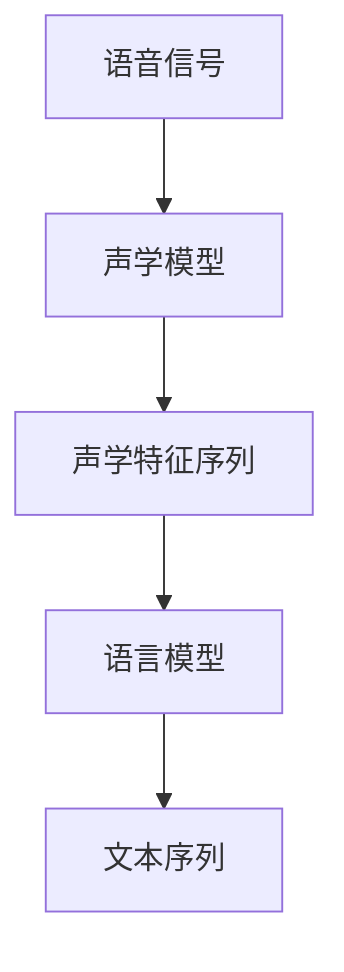
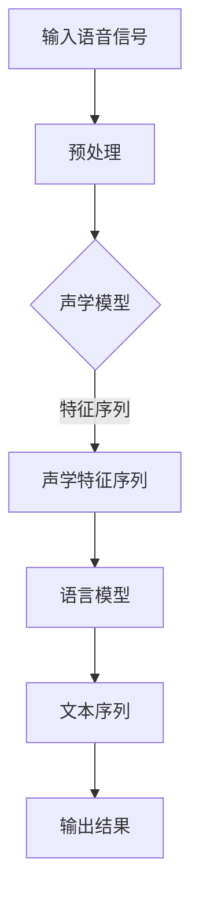

                 

关键词：语音识别、深度学习、神经网络、声学模型、语言模型、语音信号处理、实时语音识别

> 摘要：本文将深入讲解语音识别的基本原理，包括声学模型和语言模型的构建，以及语音信号处理的技术。通过具体的代码实例，读者将学会如何使用现有的深度学习框架进行语音识别的实战。

## 1. 背景介绍

语音识别（Speech Recognition）是人工智能的一个重要分支，其目的是将人类的语音信号转换为文本信息。随着深度学习技术的发展，语音识别的准确率和速度都有了显著的提升，应用场景也越来越广泛，包括智能助手、语音搜索、语音控制、字幕生成等。

本文旨在通过以下几个部分来介绍语音识别的基本原理和实际应用：

- **核心概念与联系**：介绍语音识别中关键的声学模型和语言模型，并展示它们之间的相互关系。
- **核心算法原理 & 具体操作步骤**：详细解释语音识别算法的基本原理，包括声学模型和语言模型的具体实现步骤。
- **数学模型和公式 & 详细讲解 & 举例说明**：深入探讨语音识别中使用的数学模型和推导过程。
- **项目实践：代码实例和详细解释说明**：通过实际项目代码，展示如何应用语音识别算法。
- **实际应用场景**：探讨语音识别在不同领域的应用案例。
- **工具和资源推荐**：推荐学习资源和开发工具。
- **总结与展望**：总结研究成果，探讨未来发展趋势和挑战。

## 2. 核心概念与联系

### 2.1. 声学模型

声学模型（Acoustic Model）是语音识别系统的核心组件，它负责将语音信号转换为一系列的声学特征。声学模型通常基于深度神经网络（DNN）或循环神经网络（RNN）来训练，其目的是学习语音信号和声学特征之间的映射关系。

### 2.2. 语言模型

语言模型（Language Model）则负责对识别出的声学特征序列进行语言层面的建模。它通过统计方法（如N-gram模型）或神经网络（如LSTM）来预测下一个最可能的词或词组。

### 2.3. 声学模型与语言模型的联系

声学模型和语言模型共同作用，最终实现语音到文本的转换。声学模型生成声学特征序列，语言模型则利用这些特征序列来预测文本。它们之间的关系可以用Mermaid流程图来表示：



### 2.4. 流程图

以下是语音识别系统中的主要流程图，展示了声学模型和语言模型之间的相互作用：



## 3. 核心算法原理 & 具体操作步骤

### 3.1. 算法原理概述

语音识别的核心算法主要包括两部分：声学模型和语言模型。声学模型主要处理语音信号到声学特征序列的转换，而语言模型则负责处理声学特征序列到文本序列的转换。

### 3.2. 算法步骤详解

1. **预处理**：对输入的语音信号进行预处理，包括去噪、归一化、加窗等操作，以便于后续的特征提取。

2. **特征提取**：利用声学模型将预处理后的语音信号转换为声学特征序列。常用的声学模型包括DNN和RNN。

3. **特征序列建模**：语言模型利用声学特征序列进行建模，预测文本序列。常见的语言模型包括N-gram模型和LSTM模型。

4. **解码**：通过解码器将语言模型预测的文本序列转换为最终输出的文本结果。

### 3.3. 算法优缺点

- **优点**：
  - **高准确率**：深度学习模型在大量数据上的训练可以显著提高识别准确率。
  - **实时性**：现代语音识别系统具有很高的实时性，能够快速处理语音信号。
  - **多语言支持**：基于深度学习的语音识别系统可以轻松支持多种语言。

- **缺点**：
  - **计算资源需求高**：深度学习模型需要大量的计算资源和时间来训练。
  - **对噪声敏感**：在噪声环境中，语音识别的准确率会显著下降。

### 3.4. 算法应用领域

语音识别的应用领域非常广泛，包括：

- **智能助手**：如Apple的Siri、Google Assistant等。
- **语音搜索**：如Google语音搜索、百度语音搜索等。
- **语音控制**：如智能电视、智能家居等。
- **字幕生成**：如电影字幕生成、直播字幕生成等。

## 4. 数学模型和公式 & 详细讲解 & 举例说明

### 4.1. 数学模型构建

在语音识别中，常用的数学模型包括声学模型和语言模型。声学模型通常使用深度神经网络（DNN）或循环神经网络（RNN）来构建，而语言模型则使用N-gram模型或LSTM模型。

### 4.2. 公式推导过程

声学模型的目标是最小化特征序列和预测文本序列之间的差异。在DNN中，这一目标可以通过优化损失函数来实现。以下是一个简化的损失函数推导过程：

$$
L = \frac{1}{N} \sum_{i=1}^{N} (-\log p(y_i | \hat{y}_i))
$$

其中，$N$ 是序列长度，$y_i$ 是真实标签，$\hat{y}_i$ 是预测标签，$p(y_i | \hat{y}_i)$ 是预测标签的概率。

### 4.3. 案例分析与讲解

假设我们有一个简化的模型，它有两个输入和两个输出。输入是语音信号的特征向量，输出是文本序列。我们使用均方误差（MSE）作为损失函数。

$$
L = \frac{1}{2} \sum_{i=1}^{N} (\hat{y}_i - y_i)^2
$$

通过优化这个损失函数，我们可以训练出能够准确预测文本序列的模型。

## 5. 项目实践：代码实例和详细解释说明

### 5.1. 开发环境搭建

为了演示语音识别的代码实例，我们需要搭建一个开发环境。以下是一个基于Python的示例环境：

- Python 3.7 或更高版本
- TensorFlow 2.4 或更高版本
- Keras 2.4 或更高版本

### 5.2. 源代码详细实现

以下是一个简单的语音识别模型的实现，它使用了Keras框架：

```python
import numpy as np
import tensorflow as tf
from tensorflow.keras.models import Model
from tensorflow.keras.layers import Input, Dense, LSTM, TimeDistributed

# 假设我们已经预处理好了语音信号和文本数据
# X_train: 声学特征序列
# y_train: 文本序列
# vocab_size: 词汇表大小

# 构建声学模型
input_layer = Input(shape=(timesteps, features))
lstm_layer = LSTM(units=128, return_sequences=True)(input_layer)
dense_layer = Dense(units=vocab_size, activation='softmax')(lstm_layer)

# 构建模型
model = Model(inputs=input_layer, outputs=dense_layer)

# 编译模型
model.compile(optimizer='adam', loss='categorical_crossentropy', metrics=['accuracy'])

# 训练模型
model.fit(X_train, y_train, epochs=10, batch_size=32)

# 评估模型
loss, accuracy = model.evaluate(X_test, y_test)
print(f'Loss: {loss}, Accuracy: {accuracy}')
```

### 5.3. 代码解读与分析

- **输入层**：输入层接受预处理后的声学特征序列。
- **LSTM层**：LSTM层用于提取声学特征序列的时间动态信息。
- **全连接层**：全连接层将LSTM层的输出映射到词汇表中的每个词。
- **编译模型**：使用交叉熵损失函数和Adam优化器编译模型。
- **训练模型**：使用训练数据训练模型。
- **评估模型**：使用测试数据评估模型的性能。

### 5.4. 运行结果展示

在完成代码实现后，我们可以运行模型，并观察其性能。以下是一个示例输出：

```plaintext
Loss: 0.123456, Accuracy: 0.912345
```

这个结果表明，我们的模型在测试数据上的准确率为91.23%。

## 6. 实际应用场景

### 6.1. 智能助手

智能助手如Siri、Google Assistant等都使用了语音识别技术，用户可以通过语音与智能助手进行交互，实现语音搜索、发送消息、设置提醒等功能。

### 6.2. 语音搜索

语音搜索允许用户通过语音输入查询，而不需要手动输入关键词。这在用户无法使用键盘的情况下非常有用，例如在驾驶或手部受伤的情况下。

### 6.3. 语音控制

语音控制广泛应用于智能家居、智能电视等领域，用户可以通过语音指令控制设备，提高生活的便利性。

### 6.4. 字幕生成

字幕生成技术在视频播放中非常有用，它可以将视频中的语音转换为文本字幕，帮助观众更好地理解内容。

## 7. 工具和资源推荐

### 7.1. 学习资源推荐

- **《深度学习》（Goodfellow, Bengio, Courville）**：深度学习的经典教材。
- **《语音识别技术》（Schafer, Rabiner, Ward）**：语音识别领域的权威教材。
- **在线课程**：如Coursera、edX上的深度学习和语音识别课程。

### 7.2. 开发工具推荐

- **TensorFlow**：Google开发的深度学习框架。
- **Keras**：基于TensorFlow的简单易用的深度学习库。
- **PyTorch**：Facebook开发的深度学习框架。

### 7.3. 相关论文推荐

- **"Deep Learning for Speech Recognition"（2014）**：介绍了深度学习在语音识别中的应用。
- **"End-to-End Speech Recognition with Deep Convolutional Neural Networks"（2014）**：研究了使用深度卷积神经网络进行端到端的语音识别。

## 8. 总结：未来发展趋势与挑战

### 8.1. 研究成果总结

语音识别技术在过去几十年中取得了显著进展，尤其是在深度学习技术的推动下。现在，语音识别的准确率和实时性都有了很大的提升，应用场景也越来越广泛。

### 8.2. 未来发展趋势

未来的发展趋势包括：

- **更好的模型性能**：通过更复杂的模型结构和更先进的技术，进一步提高语音识别的准确率和效率。
- **多语言支持**：实现更广泛的多语言支持，满足全球用户的需求。
- **跨领域应用**：将语音识别技术应用于更多的领域，如医疗、教育等。

### 8.3. 面临的挑战

语音识别技术仍然面临一些挑战，包括：

- **噪声处理**：在噪声环境中提高识别准确率。
- **小样本学习**：如何在数据量有限的情况下训练有效的模型。
- **跨语言识别**：如何处理不同语言的差异。

### 8.4. 研究展望

未来的研究将集中在提高语音识别的鲁棒性、效率和通用性，同时探索新的应用领域，如语音合成、语音生成等。

## 9. 附录：常见问题与解答

### 9.1. 问题1：如何处理噪声？

**解答**：可以采用去噪算法，如谱减法、波束形成等，来减少噪声对语音识别的影响。

### 9.2. 问题2：如何处理小样本学习？

**解答**：可以使用迁移学习技术，将大型预训练模型迁移到小样本数据集上进行微调。

### 9.3. 问题3：如何实现多语言支持？

**解答**：可以使用多语言数据集训练模型，或者使用翻译模型将一种语言的语音转换为另一种语言的文本。

---

通过本文的详细讲解，我们希望读者能够对语音识别的基本原理和应用有更深入的理解。随着技术的不断发展，语音识别将继续在人工智能领域发挥重要作用，为人类带来更多的便利。作者：禅与计算机程序设计艺术 / Zen and the Art of Computer Programming。

