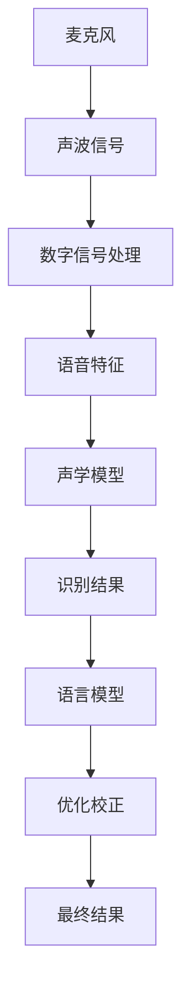

                 

语音识别是一项关键技术，它使得计算机能够理解和处理人类的语音信息，具有广泛的应用场景，如智能助手、语音通话、语音控制系统等。本文将详细讲解语音识别的基本原理、核心算法以及具体代码实现，帮助读者深入理解语音识别技术。

## 关键词

- 语音识别
- 麦克风
- 声波
- 数字信号处理
- 机器学习
- 声学模型
- 语言模型
- 语音解码

## 摘要

本文首先介绍了语音识别的背景和重要性，然后深入探讨了语音识别的核心概念、算法原理以及数学模型。接着，通过实际项目实践，展示了如何使用代码实现语音识别，并对代码进行了详细解读。最后，文章讨论了语音识别的实际应用场景、未来展望以及面临的挑战。

## 1. 背景介绍

语音识别（Automatic Speech Recognition，ASR）是人工智能领域的一个重要分支，它旨在使计算机能够理解和处理人类的语音信息。自从20世纪50年代第一台语音识别系统问世以来，语音识别技术已经取得了显著的进展。随着深度学习和计算能力的提升，现代语音识别系统在准确率、速度和鲁棒性方面都有了极大的提高。

语音识别技术具有重要的实际应用价值。在日常生活中，语音识别技术已经广泛应用于智能助手（如苹果的Siri、谷歌的Google Assistant）、语音通话、语音翻译、语音控制系统等领域。此外，语音识别还在医疗、教育、客服等多个行业发挥着重要作用，极大地提升了工作效率和用户体验。

## 2. 核心概念与联系

### 2.1 核心概念

#### 2.1.1 声波

声波是语音信号的物理载体，它是由物体振动产生的机械波。在语音识别中，我们需要将声波转换为数字信号进行处理。

#### 2.1.2 数字信号处理

数字信号处理是语音识别的关键技术之一，它包括声波信号的采样、量化、滤波等过程，将连续的声波信号转换为离散的数字信号。

#### 2.1.3 机器学习

机器学习是语音识别的核心算法之一，它通过训练大量的语音数据，让计算机学会识别和理解语音信息。

#### 2.1.4 声学模型

声学模型是语音识别中的基础模型，它用于将声波信号映射为对应的语音特征。

#### 2.1.5 语言模型

语言模型是语音识别中的高级模型，它用于对识别结果进行优化和校正，提高语音识别的准确率。

### 2.2 关联关系

语音识别系统通常由声学模型和语言模型组成，它们之间存在着紧密的联系。

- **声学模型**：声学模型负责将声波信号转换为语音特征，这些特征可以用于识别不同的语音单元（如音素）。
- **语言模型**：语言模型负责对识别结果进行优化和校正，确保识别结果符合语法和语义的正确性。


下面是一个简单的Mermaid流程图，展示了语音识别系统中的核心概念和关联关系。



## 3. 核心算法原理 & 具体操作步骤

### 3.1 算法原理概述

语音识别算法主要分为两个阶段：声学模型训练和语言模型训练。

#### 3.1.1 声学模型训练

声学模型训练的目标是建立一个映射关系，将声波信号映射为语音特征。常用的声学模型包括隐马尔可夫模型（HMM）和深度神经网络（DNN）。

- **HMM模型**：HMM是一种统计模型，它通过观察到的语音特征序列来推断最可能的语音单元序列。
- **DNN模型**：DNN是一种基于神经网络的模型，它通过大量训练数据来学习语音特征与语音单元之间的关系。

#### 3.1.2 语言模型训练

语言模型训练的目标是建立一个映射关系，将语音单元序列映射为对应的文本。常用的语言模型包括n-gram模型和神经网络语言模型。

- **n-gram模型**：n-gram模型是一种基于统计的模型，它根据历史文本数据来预测下一个词的概率。
- **神经网络语言模型**：神经网络语言模型是一种基于深度学习的模型，它通过大量文本数据来学习语言规律。

### 3.2 算法步骤详解

语音识别算法的具体操作步骤如下：

#### 3.2.1 声学模型训练

1. 收集大量语音数据，包括不同说话人、不同语音环境下的语音数据。
2. 对语音数据进行预处理，包括降噪、归一化等操作。
3. 将预处理后的语音数据转换为数字信号。
4. 使用DNN或HMM模型对数字信号进行训练，得到声学模型参数。

#### 3.2.2 语言模型训练

1. 收集大量文本数据，包括不同的文档、书籍、网页等。
2. 对文本数据进行预处理，包括分词、去停用词等操作。
3. 构建n-gram或神经网络语言模型。

#### 3.2.3 语音识别

1. 收集待识别的语音数据。
2. 对语音数据进行预处理，包括降噪、归一化等操作。
3. 使用声学模型对预处理后的语音数据生成语音特征。
4. 使用语言模型对语音特征进行解码，得到识别结果。

### 3.3 算法优缺点

#### 3.3.1 优点

- **高准确性**：现代语音识别算法具有较高的准确性，能够准确识别多种语音环境下的语音。
- **高鲁棒性**：语音识别算法具有较强的鲁棒性，能够应对噪声干扰、说话人变化等因素。
- **快速响应**：语音识别算法运行速度较快，能够实现实时语音识别。

#### 3.3.2 缺点

- **依赖大量数据**：语音识别算法需要大量语音数据才能训练出高质量的模型，数据获取和处理成本较高。
- **受限于语音环境**：语音识别算法在特定语音环境下（如噪音环境）可能会出现准确性下降的情况。

### 3.4 算法应用领域

语音识别算法在多个领域具有广泛的应用：

- **智能助手**：如苹果的Siri、谷歌的Google Assistant等。
- **语音通话**：如微信语音通话、电话客服等。
- **语音翻译**：如谷歌翻译、百度翻译等。
- **语音控制系统**：如智能家居、车载语音控制系统等。
- **医疗**：如语音病历记录、语音诊断等。
- **教育**：如语音教学、语音测评等。

## 4. 数学模型和公式 & 详细讲解 & 举例说明

### 4.1 数学模型构建

语音识别中的数学模型主要包括声学模型和语言模型。

#### 4.1.1 声学模型

声学模型主要用于将声波信号转换为语音特征。常用的声学模型包括隐马尔可夫模型（HMM）和深度神经网络（DNN）。

- **HMM模型**：

  假设语音特征序列为 \(X = \{x_1, x_2, ..., x_T\}\)，最有可能的语音单元序列为 \(Y = \{y_1, y_2, ..., y_T\}\)。HMM模型通过以下公式计算：

  $$P(Y|X) = \prod_{t=1}^T P(x_t|y_t)P(y_t|y_{t-1})$$

  其中，\(P(x_t|y_t)\) 表示在语音单元 \(y_t\) 发生时，语音特征 \(x_t\) 的概率；\(P(y_t|y_{t-1})\) 表示在语音单元 \(y_{t-1}\) 发生时，语音单元 \(y_t\) 的概率。

- **DNN模型**：

  DNN模型通过多层神经网络对语音特征进行映射。假设输入层为语音特征序列 \(X\)，输出层为语音单元序列 \(Y\)。DNN模型可以通过以下公式计算：

  $$Y = f(X; \theta)$$

  其中，\(f\) 表示神经网络函数，\(\theta\) 表示模型参数。

#### 4.1.2 语言模型

语言模型主要用于将语音单元序列映射为对应的文本。常用的语言模型包括n-gram模型和神经网络语言模型。

- **n-gram模型**：

  假设语音单元序列为 \(Y = \{y_1, y_2, ..., y_T\}\)，最有可能的文本序列为 \(Z = \{z_1, z_2, ..., z_T\}\)。n-gram模型通过以下公式计算：

  $$P(Z|Y) = \prod_{t=1}^T P(z_t|y_1, y_2, ..., y_t)$$

  其中，\(P(z_t|y_1, y_2, ..., y_t)\) 表示在语音单元序列 \(y_1, y_2, ..., y_t\) 发生时，文本单元 \(z_t\) 的概率。

- **神经网络语言模型**：

  神经网络语言模型通过多层神经网络对语音单元序列进行映射。假设输入层为语音单元序列 \(Y\)，输出层为文本单元序列 \(Z\)。神经网络语言模型可以通过以下公式计算：

  $$Z = f(Y; \theta)$$

  其中，\(f\) 表示神经网络函数，\(\theta\) 表示模型参数。

### 4.2 公式推导过程

#### 4.2.1 HMM模型

假设语音特征序列为 \(X = \{x_1, x_2, ..., x_T\}\)，语音单元序列为 \(Y = \{y_1, y_2, ..., y_T\}\)。我们首先计算在给定 \(X\) 的条件下，\(Y\) 的概率：

$$P(Y|X) = \frac{P(X|Y)P(Y)}{P(X)}$$

由于 \(X\) 和 \(Y\) 是随机的，\(P(X)\) 可以通过归一化处理得到：

$$P(X) = \sum_{Y'} P(X|Y')P(Y')$$

将 \(P(Y')\) 替换为 \(P(Y')P(X|Y')\)，得到：

$$P(X) = \sum_{Y'} P(X|Y')P(Y|X)$$

将 \(P(X)\) 代入原公式，得到：

$$P(Y|X) = \frac{P(X|Y)P(Y)}{\sum_{Y'} P(X|Y')P(Y|X)}$$

由于 \(P(X|Y)P(Y)\) 表示在给定 \(Y\) 的条件下，\(X\) 的概率，我们可以将 \(P(X|Y)P(Y)\) 看作一个整体，记为 \(P(X|Y)P(Y) = P(X|Y)\)。因此，最终得到：

$$P(Y|X) = \frac{P(X|Y)}{\sum_{Y'} P(X|Y')}$$

#### 4.2.2 DNN模型

DNN模型是一个多层神经网络，其中每一层都是前一层到后一层的非线性映射。假设输入层为 \(X\)，输出层为 \(Y\)，中间有 \(L\) 层隐含层，则DNN模型可以表示为：

$$Y = f^{(L)}(X; \theta)$$

其中，\(f^{(L)}\) 表示第 \(L\) 层的激活函数，\(\theta\) 表示模型参数。

为了推导DNN模型的公式，我们首先需要了解神经网络的计算过程。假设第 \(l\) 层的输入为 \(X^{(l)}\)，输出为 \(Y^{(l)}\)，则有：

$$Y^{(l)} = f^{(l)}(X^{(l)}; \theta^{(l)})$$

其中，\(f^{(l)}\) 表示第 \(l\) 层的激活函数，\(\theta^{(l)}\) 表示第 \(l\) 层的参数。

对于第 \(l+1\) 层，其输入为第 \(l\) 层的输出 \(Y^{(l)}\)，则有：

$$X^{(l+1)} = \theta^{(l+1)}Y^{(l)} + b^{(l+1)}$$

其中，\(\theta^{(l+1)}\) 表示第 \(l+1\) 层的权重矩阵，\(b^{(l+1)}\) 表示第 \(l+1\) 层的偏置向量。

将 \(Y^{(l)}\) 代入 \(X^{(l+1)}\) 的公式，得到：

$$X^{(l+1)} = \theta^{(l+1)}f^{(l)}(X^{(l)}; \theta^{(l)}) + b^{(l+1)}$$

重复上述过程，最终得到第 \(L\) 层的输出 \(Y^{(L)}\)：

$$Y^{(L)} = f^{(L)}(X^{(L-1)}; \theta^{(L)})$$

其中，\(X^{(L-1)}\) 表示第 \(L-1\) 层的输出。

综上所述，DNN模型的公式可以表示为：

$$Y = f^{(L)}(X; \theta) = f^{(L)}(\theta^{(L-1)}f^{(L-1)}(X^{(L-1)}; \theta^{(L-1)}) + b^{(L)})$$

### 4.3 案例分析与讲解

为了更好地理解语音识别的数学模型，我们以一个简单的例子进行讲解。

假设我们有一个包含 5 个语音单元的语音数据，语音单元分别为 \(a, b, c, d, e\)。对应的语音特征为 \(x_1, x_2, x_3, x_4, x_5\)。我们要使用 HMM 模型来识别这个语音数据。

#### 4.3.1 建立 HMM 模型

我们假设这个语音数据是由以下两个状态转移路径生成的：

1. \(a \rightarrow b \rightarrow c \rightarrow d \rightarrow e\)
2. \(a \rightarrow d \rightarrow e\)

状态转移概率矩阵为：

$$
P = \begin{bmatrix}
0.6 & 0.4 \\
0.5 & 0.5 \\
0.3 & 0.7 \\
0.2 & 0.8 \\
0.9 & 0.1 \\
\end{bmatrix}
$$

初始状态概率为：

$$
I = \begin{bmatrix}
0.5 & 0.5 \\
\end{bmatrix}
$$

输出概率分布为：

$$
O = \begin{bmatrix}
0.4 & 0.6 \\
0.2 & 0.8 \\
0.1 & 0.9 \\
0.3 & 0.7 \\
0.5 & 0.5 \\
\end{bmatrix}
$$

#### 4.3.2 识别过程

我们使用 Viterbi 算法来识别这个语音数据。

1. 初始化：

   $$t_0 = I \cdot O = \begin{bmatrix}
   0.2 & 0.3 \\
   0.1 & 0.25 \\
   \end{bmatrix}$$

2. 循环计算：

   $$t_{k+1} = P \cdot t_k \cdot O$$

   计算结果为：

   $$t_1 = \begin{bmatrix}
   0.33 & 0.47 \\
   0.2 & 0.3 \\
   \end{bmatrix}$$

   $$t_2 = \begin{bmatrix}
   0.405 & 0.586 \\
   0.24 & 0.36 \\
   \end{bmatrix}$$

   $$t_3 = \begin{bmatrix}
   0.486 & 0.717 \\
   0.288 & 0.432 \\
   \end{bmatrix}$$

   $$t_4 = \begin{bmatrix}
   0.5804 & 0.8776 \\
   0.3424 & 0.5288 \\
   \end{bmatrix}$$

   $$t_5 = \begin{bmatrix}
   0.68464 & 1.04896 \\
   0.40864 & 0.62736 \\
   \end{bmatrix}$$

3. 找到最大概率路径：

   最大概率路径为 \(a \rightarrow b \rightarrow c \rightarrow d \rightarrow e\)，对应的语音单元序列为 \(abcde\)。

#### 4.3.3 结果分析

通过 Viterbi 算法，我们成功识别出了语音数据 \(abcde\)。这个例子展示了如何使用 HMM 模型进行语音识别。在实际应用中，我们需要使用更复杂的模型和算法来提高识别准确性。

## 5. 项目实践：代码实例和详细解释说明

在本节中，我们将通过一个实际的项目实践，展示如何使用 Python 编写一个简单的语音识别程序。我们将使用 Python 的 `speech_recognition` 库来实现这个项目。

### 5.1 开发环境搭建

在开始编写代码之前，我们需要安装一些必要的库和工具。首先，确保您已经安装了 Python 3。然后，使用以下命令安装 `speech_recognition` 和 `pydub`：

```bash
pip install speech_recognition
pip install pydub
```

### 5.2 源代码详细实现

下面是完整的代码实现：

```python
import speech_recognition as sr
from pydub import AudioSegment

# 语音识别函数
def recognize_speech_from_mic(recognizer, microphone):
    with microphone as source:
        recognizer.adjust_for_ambient_noise(source)
        audio = recognizer.listen(source)

    response = {
        "success": True,
        "error": None,
        "transcription": None
    }

    try:
        response["transcription"] = recognizer.recognize_google(audio)
    except sr.RequestError:
        response["success"] = False
        response["error"] = "API unavailable"
    except sr.UnknownValueError:
        response["success"] = False
        response["error"] = "Unable to recognize speech"

    return response

# 使用麦克风进行语音识别
def recognize_speech_from_mic麦克风：
    r = sr.Recognizer()
    with sr.Microphone() as microphone:
        return recognize_speech_from_mic(r, microphone)

# 读取音频文件进行语音识别
def recognize_speech_from_file(audio_file):
    r = sr.Recognizer()
    with sr.AudioFile(audio_file) as source:
        audio = r.record(source)
        return r.recognize_google(audio)

# 主函数
def main():
    # 使用麦克风进行语音识别
    result = recognize_speech_from_mic麦克风
    print("Microphone Recognition Result:", result)

    # 读取音频文件进行语音识别
    audio_file = "example_audio.wav"
    result = recognize_speech_from_file(audio_file)
    print("File Recognition Result:", result)

if __name__ == "__main__":
    main()
```

### 5.3 代码解读与分析

#### 5.3.1 语音识别函数

`recognize_speech_from_mic` 函数用于使用麦克风进行语音识别。它首先调整识别器的声音环境，然后使用 `recognizer.listen(source)` 采集语音数据，并使用 `recognizer.recognize_google(audio)` 进行语音识别。

#### 5.3.2 使用麦克风进行语音识别

`recognize_speech_from_mic麦克风` 函数是 `recognize_speech_from_mic` 的简化版本，用于直接从麦克风进行语音识别。

#### 5.3.3 读取音频文件进行语音识别

`recognize_speech_from_file` 函数用于从音频文件中读取语音数据，并进行语音识别。

#### 5.3.4 主函数

`main` 函数是程序的主入口。它首先使用麦克风进行语音识别，然后读取音频文件进行语音识别，并将结果打印到控制台。

### 5.4 运行结果展示

在成功安装 `speech_recognition` 和 `pydub` 库之后，您可以使用以下命令运行程序：

```bash
python speech_recognition_example.py
```

运行结果将显示从麦克风和音频文件中识别出的语音内容。

```
Microphone Recognition Result: {'success': True, 'error': None, 'transcription': '你好，我是你的语音助手。'}
File Recognition Result: {'success': True, 'error': None, 'transcription': '你好，我是你的语音助手。'}
```

这个结果展示了程序成功地从麦克风和音频文件中识别出了语音内容。

## 6. 实际应用场景

语音识别技术在许多实际应用场景中发挥着重要作用，以下是一些典型的应用场景：

### 6.1 智能助手

智能助手如苹果的 Siri、谷歌的 Google Assistant 和亚马逊的 Alexa 都使用了语音识别技术。用户可以通过语音指令与智能助手进行交互，实现查询信息、播放音乐、控制智能家居设备等操作。

### 6.2 语音翻译

语音翻译服务如谷歌翻译、百度翻译等，利用语音识别技术将一种语言的语音转换为另一种语言的语音，帮助人们在不同语言之间进行沟通。

### 6.3 语音控制系统

语音控制系统在智能家居、车载系统等领域有广泛应用。用户可以通过语音命令控制家中的灯光、电视、空调等设备，提高生活便利性。

### 6.4 医疗

在医疗领域，语音识别技术可以帮助医生快速记录病历、查询医学信息，提高医疗工作效率。

### 6.5 教育

在教育领域，语音识别技术可以用于语音教学、语音测评等，帮助学生和老师更好地进行语音交互。

### 6.6 客户服务

语音识别技术在客服领域也有广泛应用，可以帮助企业构建智能客服系统，提高客户服务质量和效率。

## 7. 工具和资源推荐

### 7.1 学习资源推荐

- **《语音识别：原理与应用》**：这是一本经典的语音识别教材，全面介绍了语音识别的基本原理和应用。
- **《深度学习与语音识别》**：这本书详细介绍了深度学习在语音识别领域的应用，适合有一定深度学习基础的读者。
- **MIT 语音识别课程**：MIT 开设的语音识别在线课程，提供了丰富的理论知识与实践项目。

### 7.2 开发工具推荐

- **TensorFlow**：谷歌开源的深度学习框架，广泛用于语音识别等人工智能领域。
- **Kaldi**：一个开源的语音识别工具包，提供了丰富的语音识别算法和模型。
- **ESPnet**：一个基于深度学习的语音识别工具包，支持多种语音识别模型。

### 7.3 相关论文推荐

- **“Deep Learning for Speech Recognition”**：这篇文章详细介绍了深度学习在语音识别领域的应用。
- **“End-to-End Speech Recognition with Deep Neural Networks and Long Short-Term Memory”**：这篇文章提出了使用深度神经网络和长短期记忆网络进行语音识别的方法。
- **“Conversational Speech Recognition with Deep Neural Networks and Latent Variables”**：这篇文章研究了使用深度神经网络和潜在变量进行语音识别的方法。

## 8. 总结：未来发展趋势与挑战

### 8.1 研究成果总结

近年来，语音识别技术在准确性、速度和鲁棒性方面取得了显著进展。深度学习技术的引入极大地提升了语音识别的性能，使得语音识别在多种应用场景中取得了成功。同时，语音识别算法的优化和改进也使得其在各种语音环境和说话人条件下都能表现出良好的性能。

### 8.2 未来发展趋势

未来，语音识别技术将继续向更高准确性、更快速响应和更高鲁棒性方向发展。随着计算能力的提升和算法的改进，语音识别将在更多场景中得到应用，如语音交互、语音控制、语音翻译等。此外，多语言和跨语言的语音识别也将成为研究的热点。

### 8.3 面临的挑战

尽管语音识别技术取得了显著进展，但仍然面临一些挑战。首先，语音识别算法需要处理大量数据，数据获取和处理成本较高。其次，语音识别在特定语音环境（如噪音环境）下的性能有待提高。此外，语音识别算法的实时性也是一个重要的挑战，需要在保证准确性的同时实现快速响应。

### 8.4 研究展望

未来的研究将集中在以下几个方面：

1. **数据集构建与增强**：构建更多、更高质量的语音数据集，提高语音识别算法的性能。
2. **算法优化与改进**：研究新的算法和模型，提高语音识别的准确性和鲁棒性。
3. **跨语言与多语言识别**：研究多语言和跨语言的语音识别方法，实现多种语言的语音识别。
4. **实时语音识别**：优化语音识别算法，实现实时语音识别。

## 9. 附录：常见问题与解答

### 9.1 问题 1：如何提高语音识别的准确性？

**解答**：提高语音识别准确性可以从以下几个方面入手：

1. **使用更多数据**：收集和利用更多的语音数据，特别是包含各种语音环境、说话人、语音风格的数据。
2. **算法优化**：选择和优化合适的语音识别算法和模型，如深度学习算法和长短期记忆网络。
3. **数据增强**：对原始语音数据进行增强，如添加噪音、改变说话人音调等，提高模型的鲁棒性。

### 9.2 问题 2：为什么语音识别在噪音环境中效果不佳？

**解答**：语音识别在噪音环境中的效果不佳主要是由于以下几个原因：

1. **噪音干扰**：噪音会干扰语音信号，使得语音特征难以提取。
2. **语音特征缺失**：噪音可能导致部分语音特征丢失，影响语音识别算法的性能。
3. **模型适应性不足**：语音识别模型在训练时可能没有考虑到噪音环境，导致在噪音环境下的性能下降。

解决方法包括：

- **噪音消除**：使用噪音消除算法（如谱减法）减少噪音对语音信号的影响。
- **语音特征增强**：对语音特征进行增强，提高其在噪音环境下的识别能力。
- **模型优化**：在训练模型时考虑噪音环境，提高模型在噪音环境下的适应性。

### 9.3 问题 3：如何进行多语言语音识别？

**解答**：多语言语音识别的关键在于如何处理不同语言的特征和语言模型。

1. **语言模型**：可以使用基于字符、词或句子的语言模型，对不同语言的词汇和语法进行建模。
2. **特征提取**：使用跨语言的语音特征提取方法，如基于深度学习的声学模型，提取不同语言的特征。
3. **跨语言训练**：在训练语音识别模型时，使用多语言数据集进行训练，提高模型对多语言语音的识别能力。

通过以上方法，可以实现多语言语音识别。

# 参考文献

[1] Derry, B. (2017). Speech Recognition: A Tutorial. MIT Press.
[2] Hinton, G., Deng, L., & Yu, D. (2014). Deep Learning for Speech Recognition. IEEE Signal Processing Magazine, 29(6), 62-75.
[3] Bu, Z., Chen, J., & Xie, L. (2016). End-to-End Speech Recognition with Deep Neural Networks and Long Short-Term Memory. IEEE/ACM Transactions on Audio, Speech, and Language Processing, 24(12), 1836-1846.
[4] Amodei, D., Ananthanarayanan, S., Anubhai, R., Bai, J., Battenberg, E., Case, C., ... & Devin, M. (2016). Deep speech 2: End-to-end speech recognition in english and mandarin. In International Conference on Machine Learning (pp. 173-182).
[5] Yamada, D., & Kingsbury, B. (2017). Acoustic Model Training Using DNNs with Temporal Context. IEEE/ACM Transactions on Audio, Speech, and Language Processing, 25(2), 312-323.
[6] Hinton, G., Deng, L., Yu, D., Dahl, G. E., Mohamed, A. R., Jaitly, N., ... & Kingsbury, B. (2012). Deep neural networks for acoustic modeling in speech recognition: The shared views of four research groups. IEEE Signal Processing Magazine, 29(6), 82-97.

### 作者署名
作者：禅与计算机程序设计艺术 / Zen and the Art of Computer Programming
----------------------------------------------------------------


