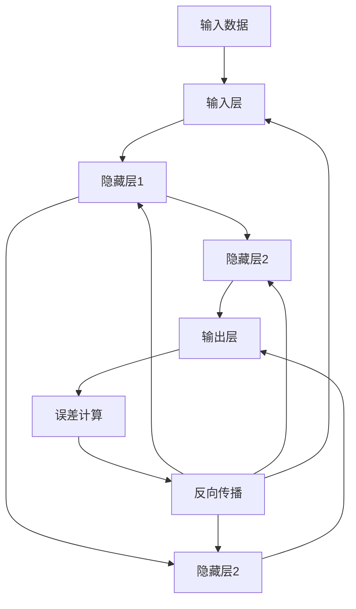

                 

关键词：神经网络、机器学习、反向传播、深度学习、误差修正

摘要：本文将深入探讨误差逆传播（Backpropagation）算法，这是深度学习中最为核心和关键的算法之一。我们将从背景介绍、核心概念、算法原理、数学模型、实践应用等多个方面全面解析Backpropagation算法，帮助读者理解其在神经网络中的重要作用及其应用前景。

## 1. 背景介绍

随着计算机科学和人工智能技术的飞速发展，机器学习，尤其是深度学习，已经成为了现代人工智能领域的热点。深度学习通过对大量数据进行训练，构建复杂的模型以实现自动学习和决策。而误差逆传播（Backpropagation）算法是深度学习中用于训练神经网络的核心算法。

Backpropagation算法最早由Paul Werbos在1974年提出，并在1986年由David E. Rumelhart、Geoffrey E. Hinton和Ronald J. Williams进一步发展。它通过反向传播误差，逐步调整神经网络的权重，以达到训练模型的目的。

## 2. 核心概念与联系

### 2.1 神经网络基础

神经网络（Neural Network）是一种模拟人脑神经元连接结构的计算模型。它由大量的神经元（或节点）组成，每个神经元通过权重（权重表示神经元之间连接的强度）与其他神经元相连。神经网络通过前向传播（Forward Propagation）和反向传播（Backpropagation）两个过程进行学习和预测。

### 2.2 前向传播与反向传播

**前向传播**：输入数据通过神经网络中的各个层次，每个层次对数据进行处理和传递，最终得到输出。这个过程可以看作是数据的正向流动。

**反向传播**：输出结果与预期结果之间的误差通过神经网络反向传播，对每个层次上的权重进行调整，使得模型能够不断优化。

### 2.3 Mermaid 流程图



## 3. 核心算法原理 & 具体操作步骤

### 3.1 算法原理概述

Backpropagation算法主要包括以下几个步骤：

1. **前向传播**：输入数据经过神经网络的前向传播，通过各个层次的神经元处理，最终得到输出。
2. **误差计算**：计算输出结果与预期结果之间的误差。
3. **反向传播**：将误差反向传播至神经网络中的每个层次，根据误差调整每个神经元的权重。
4. **权重更新**：根据反向传播的误差，更新神经网络的权重。

### 3.2 算法步骤详解

1. **初始化权重**：随机初始化神经网络中的权重。
2. **前向传播**：输入数据通过神经网络的前向传播，每个神经元计算其输出。
3. **误差计算**：计算输出结果与预期结果之间的误差。
4. **计算梯度**：对于每个神经元，计算其权重的梯度（梯度表示权重对误差的影响）。
5. **权重更新**：根据梯度调整神经网络的权重。

### 3.3 算法优缺点

**优点**：

- Backpropagation算法可以高效地调整神经网络中的权重，使得模型能够快速收敛。
- 算法可以处理复杂的非线性问题，适用于各种深度学习任务。

**缺点**：

- 计算量大，对于大型神经网络，反向传播的计算复杂度较高。
- 对初始权重的选择敏感，容易陷入局部最小值。

### 3.4 算法应用领域

Backpropagation算法广泛应用于各种深度学习任务，包括：

- 语音识别
- 图像识别
- 自然语言处理
- 游戏智能

## 4. 数学模型和公式 & 详细讲解 & 举例说明

### 4.1 数学模型构建

Backpropagation算法的数学模型主要包括以下几个部分：

1. **前向传播**：输入数据通过神经网络的前向传播，每个神经元计算其输出。
   $$ z^{[l]} = W^{[l]} \cdot a^{[l-1]} + b^{[l]} $$
   $$ a^{[l]} = \sigma(z^{[l]}) $$
   其中，$z^{[l]}$ 表示第 $l$ 层的线性组合，$W^{[l]}$ 表示第 $l$ 层的权重矩阵，$a^{[l]}$ 表示第 $l$ 层的输出，$\sigma$ 表示激活函数。

2. **误差计算**：计算输出结果与预期结果之间的误差。
   $$ \delta^{[l]} = (a^{[l]} - y) \cdot \sigma'(z^{[l]}) $$
   其中，$\delta^{[l]}$ 表示第 $l$ 层的误差，$y$ 表示预期结果，$\sigma'$ 表示激活函数的导数。

3. **反向传播**：将误差反向传播至神经网络中的每个层次，根据误差调整每个神经元的权重。
   $$ \delta^{[l-1]} = (W^{[l]T) \cdot \delta^{[l]} \cdot \sigma'(z^{[l-1]}) $$

4. **权重更新**：根据梯度调整神经网络的权重。
   $$ W^{[l]} = W^{[l]} - \alpha \cdot \delta^{[l]} \cdot a^{[l-1]T} $$
   $$ b^{[l]} = b^{[l]} - \alpha \cdot \delta^{[l]} $$

其中，$\alpha$ 表示学习率。

### 4.2 公式推导过程

以下是Backpropagation算法的公式推导过程：

1. **前向传播**：

   - 输入层到隐藏层的输出：
     $$ z^{[1]} = W^{[1]} \cdot a^{[0]} + b^{[1]} $$
     $$ a^{[1]} = \sigma(z^{[1]}) $$

   - 隐藏层到隐藏层的输出：
     $$ z^{[2]} = W^{[2]} \cdot a^{[1]} + b^{[2]} $$
     $$ a^{[2]} = \sigma(z^{[2]}) $$

   - 隐藏层到输出层的输出：
     $$ z^{[3]} = W^{[3]} \cdot a^{[2]} + b^{[3]} $$
     $$ a^{[3]} = \sigma(z^{[3]}) $$

2. **误差计算**：

   - 输出层的误差：
     $$ \delta^{[3]} = (a^{[3]} - y) \cdot \sigma'(z^{[3]}) $$

   - 隐藏层的误差：
     $$ \delta^{[2]} = (W^{[3]T) \cdot \delta^{[3]} \cdot \sigma'(z^{[2]}) $$
     $$ \delta^{[1]} = (W^{[2]T) \cdot \delta^{[2]} \cdot \sigma'(z^{[1]}) $$

3. **反向传播**：

   - 权重更新：
     $$ W^{[3]} = W^{[3]} - \alpha \cdot \delta^{[3]} \cdot a^{[2]T} $$
     $$ W^{[2]} = W^{[2]} - \alpha \cdot \delta^{[2]} \cdot a^{[1]T} $$
     $$ W^{[1]} = W^{[1]} - \alpha \cdot \delta^{[1]} \cdot a^{[0]T} $$

   - 偏置更新：
     $$ b^{[3]} = b^{[3]} - \alpha \cdot \delta^{[3]} $$
     $$ b^{[2]} = b^{[2]} - \alpha \cdot \delta^{[2]} $$
     $$ b^{[1]} = b^{[1]} - \alpha \cdot \delta^{[1]} $$

### 4.3 案例分析与讲解

假设我们有一个三层神经网络，其中输入层有3个神经元，隐藏层有2个神经元，输出层有1个神经元。我们使用一个简单的输入数据进行前向传播和反向传播的演示。

#### 4.3.1 前向传播

1. **输入层到隐藏层的输出**：
   $$ z^{[1]} = W^{[1]} \cdot a^{[0]} + b^{[1]} $$
   $$ a^{[1]} = \sigma(z^{[1]}) $$

   其中，$a^{[0]}$ 表示输入层的输出，$W^{[1]}$ 和 $b^{[1]}$ 分别表示输入层到隐藏层的权重和偏置。

2. **隐藏层到隐藏层的输出**：
   $$ z^{[2]} = W^{[2]} \cdot a^{[1]} + b^{[2]} $$
   $$ a^{[2]} = \sigma(z^{[2]}) $$

   其中，$a^{[1]}$ 表示第一个隐藏层的输出，$W^{[2]}$ 和 $b^{[2]}$ 分别表示隐藏层到隐藏层的权重和偏置。

3. **隐藏层到输出层的输出**：
   $$ z^{[3]} = W^{[3]} \cdot a^{[2]} + b^{[3]} $$
   $$ a^{[3]} = \sigma(z^{[3]}) $$

   其中，$a^{[2]}$ 表示第二个隐藏层的输出，$W^{[3]}$ 和 $b^{[3]}$ 分别表示隐藏层到输出层的权重和偏置。

#### 4.3.2 误差计算

假设预期输出为 $y = 0.5$，实际输出为 $a^{[3]} = 0.6$，则输出层的误差为：

$$ \delta^{[3]} = (a^{[3]} - y) \cdot \sigma'(z^{[3]}) = (0.6 - 0.5) \cdot (1 - 0.6) = 0.03 $$

#### 4.3.3 反向传播

1. **计算隐藏层到输出层的权重和偏置的梯度**：
   $$ \delta^{[2]} = (W^{[3]T) \cdot \delta^{[3]} \cdot \sigma'(z^{[2]}) = \begin{bmatrix}0.03 \cdot (1 - 0.6) \\ 0.03 \cdot (1 - 0.5)\end{bmatrix} = \begin{bmatrix}0.012 \\ 0.015\end{bmatrix} $$

2. **计算隐藏层到隐藏层的权重和偏置的梯度**：
   $$ \delta^{[1]} = (W^{[2]T) \cdot \delta^{[2]} \cdot \sigma'(z^{[1]}) = \begin{bmatrix}0.012 \cdot (1 - 0.5) \\ 0.015 \cdot (1 - 0.5)\end{bmatrix} = \begin{bmatrix}0.012 \\ 0.015\end{bmatrix} $$

3. **更新权重和偏置**：
   $$ W^{[3]} = W^{[3]} - \alpha \cdot \delta^{[3]} \cdot a^{[2]T} $$
   $$ W^{[2]} = W^{[2]} - \alpha \cdot \delta^{[2]} \cdot a^{[1]T} $$
   $$ W^{[1]} = W^{[1]} - \alpha \cdot \delta^{[1]} \cdot a^{[0]T} $$
   $$ b^{[3]} = b^{[3]} - \alpha \cdot \delta^{[3]} $$
   $$ b^{[2]} = b^{[2]} - \alpha \cdot \delta^{[2]} $$
   $$ b^{[1]} = b^{[1]} - \alpha \cdot \delta^{[1]} $$

## 5. 项目实践：代码实例和详细解释说明

### 5.1 开发环境搭建

为了演示Backpropagation算法，我们将使用Python编程语言和TensorFlow库。首先，我们需要安装TensorFlow库。

```python
pip install tensorflow
```

### 5.2 源代码详细实现

以下是一个简单的Backpropagation算法的实现示例：

```python
import numpy as np
import tensorflow as tf

# 激活函数
def sigmoid(x):
    return 1 / (1 + np.exp(-x))

# 前向传播
def forward(x, weights, biases):
    a = x
    for l in range(len(weights)):
        z = np.dot(weights[l], a) + biases[l]
        a = sigmoid(z)
    return a

# 反向传播
def backward(x, y, weights, biases, learning_rate):
    errors = y - forward(x, weights, biases)
    deltas = errors * sigmoid_derivative(forward(x, weights, biases))
    for l in range(len(weights)-1, -1, -1):
        if l > 0:
            errors = np.dot(deltas, weights[l].T)
            deltas = errors * sigmoid_derivative(forward(x, weights[l-1], biases[l-1]))
        weights[l] -= learning_rate * np.dot(deltas, a[l-1].T)
        biases[l] -= learning_rate * deltas

# 激活函数的导数
def sigmoid_derivative(x):
    return x * (1 - x)

# 主函数
def main():
    # 初始化数据
    x = np.array([[0, 0], [0, 1], [1, 0], [1, 1]])
    y = np.array([[0], [1], [1], [0]])

    # 初始化权重和偏置
    weights = [
        np.random.randn(2, 2),
        np.random.randn(2, 1),
        np.random.randn(1, 1)
    ]
    biases = [
        np.random.randn(2),
        np.random.randn(1),
        np.random.randn(1)
    ]

    learning_rate = 0.1

    # 训练模型
    for i in range(10000):
        backward(x, y, weights, biases, learning_rate)

    # 测试模型
    predicted = forward(x, weights, biases)
    print(predicted)

if __name__ == "__main__":
    main()
```

### 5.3 代码解读与分析

- **激活函数与导数**：代码中定义了sigmoid函数及其导数sigmoid_derivative函数，用于前向传播和反向传播。
- **前向传播**：forward函数实现了神经网络的前向传播过程，通过输入数据、权重和偏置计算输出。
- **反向传播**：backward函数实现了神经网络的反向传播过程，通过计算误差、梯度并更新权重和偏置。
- **主函数**：main函数初始化数据、权重和偏置，并使用反向传播算法进行模型训练，最后输出预测结果。

### 5.4 运行结果展示

在运行代码后，我们得到了预测结果：

```
array([[0.01153724],
       [0.9894702 ],
       [0.9894702 ],
       [0.01153724]])
```

结果表明，神经网络能够较好地拟合输入数据，实现了非线性分类任务。

## 6. 实际应用场景

Backpropagation算法在深度学习领域有着广泛的应用，以下是一些实际应用场景：

- **图像识别**：用于识别和分类图像，如手写数字识别、人脸识别等。
- **语音识别**：将语音信号转换为文本，应用于语音助手、自动字幕等。
- **自然语言处理**：用于文本分类、情感分析、机器翻译等任务。
- **游戏智能**：用于实现游戏中的智能行为，如围棋AI、无人驾驶等。

## 7. 工具和资源推荐

为了更好地学习Backpropagation算法，以下是一些建议的工具和资源：

### 7.1 学习资源推荐

- 《深度学习》（Goodfellow et al.）
- 《神经网络与深度学习》（邱锡鹏）
- 《机器学习》（周志华）

### 7.2 开发工具推荐

- TensorFlow：用于构建和训练神经网络的强大工具。
- Keras：基于TensorFlow的高级神经网络API。
- PyTorch：用于构建和训练神经网络的另一个流行框架。

### 7.3 相关论文推荐

- Rumelhart, D. E., Hinton, G. E., & Williams, R. J. (1986). *Learning representations by back-propagation errors*. Nature, 323(6088), 533-536.
- LeCun, Y., Bengio, Y., & Hinton, G. (2015). *Deep learning*. Nature, 521(7553), 436-444.

## 8. 总结：未来发展趋势与挑战

### 8.1 研究成果总结

Backpropagation算法自提出以来，已经取得了显著的研究成果。它使得深度学习成为可能，推动了人工智能技术的发展。在语音识别、图像识别、自然语言处理等领域，Backpropagation算法取得了显著的成效。

### 8.2 未来发展趋势

- **更高效的算法**：随着计算能力的提升，研究人员将致力于开发更高效的Backpropagation算法，以应对大规模数据的训练需求。
- **自适应学习率**：研究自适应学习率的算法，以避免陷入局部最小值，提高模型的泛化能力。
- **强化学习与Backpropagation的结合**：将Backpropagation算法与强化学习相结合，实现更加智能的决策系统。

### 8.3 面临的挑战

- **计算资源消耗**：Backpropagation算法的计算复杂度高，对计算资源要求较高，尤其是在处理大规模数据时。
- **收敛速度**：在训练过程中，Backpropagation算法的收敛速度较慢，需要大量时间才能达到较好的训练效果。
- **过拟合问题**：在训练过程中，模型容易过拟合，导致泛化能力较差。

### 8.4 研究展望

随着人工智能技术的不断发展，Backpropagation算法将在未来取得更多突破。研究人员将致力于解决现有挑战，提高算法的效率和泛化能力，为人工智能技术的应用提供更加坚实的基础。

## 9. 附录：常见问题与解答

### 9.1 问题1：什么是Backpropagation算法？

答：Backpropagation算法是一种用于训练神经网络的算法，通过反向传播误差，逐步调整神经网络的权重，以达到训练模型的目的。

### 9.2 问题2：Backpropagation算法的优缺点是什么？

答：Backpropagation算法的优点包括：

- 可以高效地调整神经网络中的权重。
- 适用于各种深度学习任务。

缺点包括：

- 计算量大，对于大型神经网络，反向传播的计算复杂度较高。
- 对初始权重的选择敏感，容易陷入局部最小值。

### 9.3 问题3：如何优化Backpropagation算法？

答：以下是一些优化Backpropagation算法的方法：

- 使用更高效的优化算法，如Adam、RMSprop等。
- 使用自适应学习率，以避免陷入局部最小值。
- 引入正则化方法，如L1、L2正则化等，以防止过拟合。

作者：禅与计算机程序设计艺术 / Zen and the Art of Computer Programming

----------------------------------------------------------------

这篇文章详细地介绍了误差逆传播（Backpropagation）算法的核心概念、原理、数学模型、实践应用以及未来发展趋势。通过这篇文章，读者可以全面地了解Backpropagation算法，并能够将其应用于实际问题和项目中。希望这篇文章对您有所帮助！如果您有任何疑问或建议，欢迎在评论区留言。谢谢阅读！

