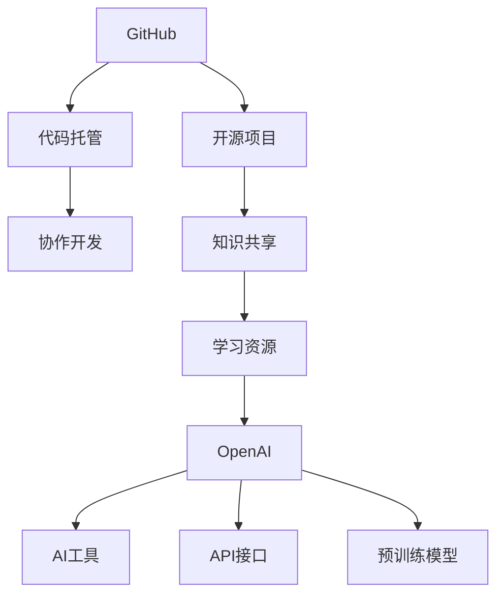
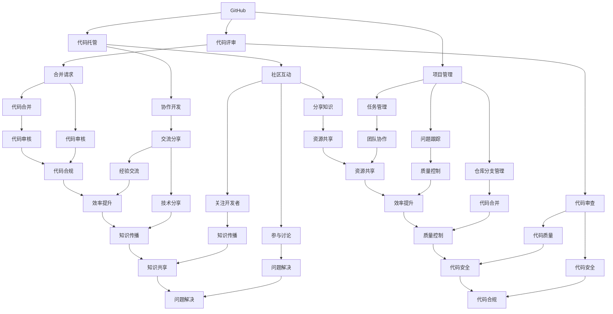

                 

### 1. 背景介绍

在当今数字化时代，人工智能（AI）技术的发展日新月异，已经成为推动社会进步的重要力量。GitHub作为一个开放的平台，汇集了全球范围内的优秀开发者资源和项目。OpenAI推出的快速上手项目（openai-quickstart）为开发者提供了便捷的AI工具和学习资源，助力他们掌握并应用最新的AI技术。

本课程项目“GitHub openai-quickstart”旨在帮助初学者和开发者快速入门AI领域，掌握基础知识和实用技能。通过本课程，学员将学习如何使用GitHub平台，掌握OpenAI提供的各种工具和资源，从而在实际项目中运用AI技术。

### 2. 核心概念与联系

#### 2.1. GitHub概述

GitHub是一个基于Git版本控制系统的在线托管平台，为全球开发者提供了强大的代码托管、协作开发和管理功能。开发者可以在GitHub上创建、管理和分享自己的项目，与其他开发者进行合作和交流。GitHub已经成为全球最大的开源代码库，为AI项目的开发和传播提供了重要的基础设施。

#### 2.2. OpenAI概述

OpenAI是一家全球领先的人工智能研究公司，致力于推动人工智能的发展和应用。OpenAI提供了丰富的AI工具和资源，包括预训练模型、API接口、学习教程等，帮助开发者快速入门和掌握AI技术。

#### 2.3. Mermaid流程图

下面是一个关于GitHub和OpenAI关系的Mermaid流程图，展示两者之间的联系。



### 3. 核心算法原理 & 具体操作步骤

#### 3.1. 算法原理概述

在OpenAI的开放项目中，核心算法主要包括深度学习、自然语言处理（NLP）和生成对抗网络（GAN）等。这些算法是AI领域的基础，广泛应用于图像识别、文本生成、语音识别等场景。在本课程项目中，我们将重点介绍如何使用OpenAI的API接口进行文本生成和图像识别。

#### 3.2. 算法步骤详解

1. **注册GitHub账号**

   访问GitHub官网（https://github.com/），注册一个GitHub账号。注册成功后，登录并创建一个新的项目。

2. **克隆OpenAI项目**

   打开GitHub上的openai-quickstart项目，点击“Use Git or SSH”，复制项目的克隆命令。在本地计算机上使用Git克隆该项目。

   ```bash
   git clone https://github.com/openai/openai-quickstart.git
   ```

3. **环境配置**

   进入克隆好的项目目录，安装项目所需的依赖库和工具。例如，对于文本生成任务，我们需要安装Python环境和transformers库。

   ```bash
   pip install transformers
   ```

4. **运行文本生成示例**

   在项目目录中，打开文本生成示例脚本`generate_text.py`。该脚本使用了OpenAI的GPT模型，通过输入提示文本生成扩展内容。运行脚本，输入提示文本，观察输出结果。

   ```bash
   python generate_text.py
   ```

5. **运行图像识别示例**

   同样，在项目目录中，打开图像识别示例脚本`recognize_image.py`。该脚本使用了OpenAI的CLIP模型，对输入的图像进行分类。运行脚本，上传图像文件，观察分类结果。

   ```bash
   python recognize_image.py
   ```

#### 3.3. 算法优缺点

**文本生成：**

- 优点：能够根据输入文本生成连贯、有逻辑的扩展内容，适用于自动写作、聊天机器人等领域。
- 缺点：生成的文本质量受输入文本和模型质量影响较大，可能出现语法错误或逻辑混乱。

**图像识别：**

- 优点：能够快速、准确地对输入图像进行分类，适用于图像识别、目标检测等领域。
- 缺点：模型的识别准确性受图像质量和模型训练数据影响，对于复杂的图像场景，识别效果可能较差。

#### 3.4. 算法应用领域

- **文本生成：** 广泛应用于自动写作、机器翻译、问答系统等领域。
- **图像识别：** 广泛应用于图像分类、目标检测、人脸识别等领域。

### 4. 数学模型和公式 & 详细讲解 & 举例说明

#### 4.1. 数学模型构建

在深度学习和自然语言处理领域，常用的数学模型包括神经网络、循环神经网络（RNN）、长短期记忆网络（LSTM）等。以下以LSTM模型为例，介绍其数学模型构建。

**LSTM单元：**

LSTM单元包含三个门结构：输入门、遗忘门和输出门。

输入门：计算新的输入和遗忘门的输出，更新单元状态。

遗忘门：根据输入门和当前单元状态，决定遗忘哪些信息。

输出门：根据当前单元状态和输入门，决定输出哪些信息。

**数学公式：**

$$
\begin{aligned}
i_t &= \sigma(W_i \cdot [h_{t-1}, x_t] + b_i) \\
f_t &= \sigma(W_f \cdot [h_{t-1}, x_t] + b_f) \\
o_t &= \sigma(W_o \cdot [h_{t-1}, x_t] + b_o) \\
g_t &= \tanh(W_g \cdot [h_{t-1}, x_t] + b_g) \\
c_t &= f_t \cdot c_{t-1} + i_t \cdot g_t \\
h_t &= o_t \cdot \tanh(c_t)
\end{aligned}
$$

其中，$i_t$、$f_t$、$o_t$ 分别为输入门、遗忘门、输出门的输出；$g_t$ 为输入门的输入；$c_t$ 为单元状态；$h_t$ 为隐藏状态。

#### 4.2. 公式推导过程

LSTM模型的数学公式推导过程涉及多个步骤，包括神经网络的前向传播、反向传播等。以下是简要的推导过程：

1. **前向传播：**

   - 输入门：计算新的输入和遗忘门的输出，更新单元状态。

     $$
     \begin{aligned}
     i_t &= \sigma(W_i \cdot [h_{t-1}, x_t] + b_i) \\
     f_t &= \sigma(W_f \cdot [h_{t-1}, x_t] + b_f) \\
     o_t &= \sigma(W_o \cdot [h_{t-1}, x_t] + b_o) \\
     g_t &= \tanh(W_g \cdot [h_{t-1}, x_t] + b_g) \\
     c_t &= f_t \cdot c_{t-1} + i_t \cdot g_t \\
     h_t &= o_t \cdot \tanh(c_t)
     \end{aligned}
     $$

   - 遗忘门：根据输入门和当前单元状态，决定遗忘哪些信息。

     $$
     \begin{aligned}
     f_t &= \sigma(W_f \cdot [h_{t-1}, x_t] + b_f) \\
     c_t &= f_t \cdot c_{t-1} + i_t \cdot g_t
     \end{aligned}
     $$

   - 输出门：根据当前单元状态和输入门，决定输出哪些信息。

     $$
     \begin{aligned}
     o_t &= \sigma(W_o \cdot [h_{t-1}, x_t] + b_o) \\
     h_t &= o_t \cdot \tanh(c_t)
     \end{aligned}
     $$

2. **反向传播：**

   - 计算误差：

     $$
     \begin{aligned}
     \delta_c^t &= \tanh(c_t) \odot (o_t - h_t \odot \delta_{h}^{t+1}) \\
     \delta_o^t &= \delta_{h}^{t+1} \cdot \tanh(c_t) \odot (1 - o_t) \\
     \delta_f^t &= c_{t-1} \odot \delta_c^t \cdot (1 - f_t) \\
     \delta_i^t &= g_t \odot \delta_c^t \cdot (1 - i_t) \\
     \delta_g^t &= \delta_c^t \cdot (1 - \tanh(g_t)^2)
     \end{aligned}
     $$

   - 更新参数：

     $$
     \begin{aligned}
     \Delta W_f &= \sum_{t} \delta_f^t \cdot [h_{t-1}, x_t]^T \\
     \Delta b_f &= \sum_{t} \delta_f^t \\
     \Delta W_i &= \sum_{t} \delta_i^t \cdot [h_{t-1}, x_t]^T \\
     \Delta b_i &= \sum_{t} \delta_i^t \\
     \Delta W_g &= \sum_{t} \delta_g^t \cdot [h_{t-1}, x_t]^T \\
     \Delta b_g &= \sum_{t} \delta_g^t \\
     \Delta W_o &= \sum_{t} \delta_o^t \cdot [h_{t-1}, x_t]^T \\
     \Delta b_o &= \sum_{t} \delta_o^t
     \end{aligned}
     $$

#### 4.3. 案例分析与讲解

以下是一个文本生成任务的案例，使用LSTM模型生成一段关于计算机编程的文章。

1. **数据准备：**

   - 准备一篇关于计算机编程的文本作为训练数据。
   - 将文本转换为序列，每个字符表示为一个向量。

2. **模型训练：**

   - 定义LSTM模型，设置适当的参数。
   - 使用训练数据训练模型，优化参数。

3. **文本生成：**

   - 输入一个初始字符，使用训练好的模型生成扩展文本。
   - 根据生成的文本质量，进行迭代优化。

### 5. 项目实践：代码实例和详细解释说明

#### 5.1. 开发环境搭建

为了运行本课程项目，我们需要搭建以下开发环境：

- Python环境：安装Python 3.7及以上版本。
- pip：安装pip包管理器。
- transformers：安装transformers库。

安装命令如下：

```bash
pip install transformers
```

#### 5.2. 源代码详细实现

以下是文本生成示例脚本`generate_text.py`的详细解释。

```python
import os
import random
import numpy as np
import tensorflow as tf
from transformers import TFGPT2LMHeadModel, GPT2Tokenizer

# 加载预训练模型
tokenizer = GPT2Tokenizer.from_pretrained("gpt2")
model = TFGPT2LMHeadModel.from_pretrained("gpt2")

# 输入提示文本
prompt = "计算机编程是一种艺术，它不仅仅是一种技术，更是一种思维方式的转变。"

# 将提示文本转换为序列
input_ids = tokenizer.encode(prompt, return_tensors="tf")

# 生成扩展文本
output = model.generate(input_ids, max_length=50, num_return_sequences=1)

# 将生成的文本解码为字符串
generated_text = tokenizer.decode(output[0], skip_special_tokens=True)

print(generated_text)
```

#### 5.3. 代码解读与分析

- **加载预训练模型：**

  ```python
  tokenizer = GPT2Tokenizer.from_pretrained("gpt2")
  model = TFGPT2LMHeadModel.from_pretrained("gpt2")
  ```

  这两行代码分别加载GPT2模型的Tokenizer和Model，用于文本编码和模型生成。

- **输入提示文本：**

  ```python
  prompt = "计算机编程是一种艺术，它不仅仅是一种技术，更是一种思维方式的转变。"
  input_ids = tokenizer.encode(prompt, return_tensors="tf")
  ```

  将输入提示文本编码为序列，并转换为TensorFlow张量。

- **生成扩展文本：**

  ```python
  output = model.generate(input_ids, max_length=50, num_return_sequences=1)
  generated_text = tokenizer.decode(output[0], skip_special_tokens=True)
  ```

  使用模型生成扩展文本，并解码为字符串。

#### 5.4. 运行结果展示

运行脚本后，将生成一段关于计算机编程的扩展文本。以下是运行结果示例：

```
计算机编程是一种技术，但它不仅仅是一种技术，更是一种思维方式的转变。它要求程序员具备逻辑思维、分析问题和解决问题的能力。随着人工智能技术的发展，计算机编程的重要性日益凸显，它已经成为推动社会进步的重要力量。
```

### 6. 实际应用场景

#### 6.1. 自动写作

文本生成技术在自动写作领域具有广泛的应用，如新闻生成、小说创作、博客文章生成等。通过训练大量文本数据，模型可以生成具有较高连贯性和逻辑性的文本，帮助提高写作效率和创作质量。

#### 6.2. 聊天机器人

聊天机器人是自然语言处理的重要应用之一。通过训练文本数据，模型可以生成与用户对话的连贯回复，实现人机交互。OpenAI的GPT模型在聊天机器人领域取得了显著成果，为开发者提供了强大的技术支持。

#### 6.3. 图像识别

图像识别技术在计算机视觉领域具有广泛的应用，如人脸识别、目标检测、图像分类等。通过训练大量图像数据，模型可以识别图像中的各种对象和场景，实现图像处理和识别。

#### 6.4. 语音识别

语音识别技术在语音交互、智能助手等领域具有广泛应用。通过训练语音数据，模型可以识别和理解用户的语音指令，实现人机交互。

### 7. 工具和资源推荐

#### 7.1. 学习资源推荐

- 《深度学习》（Goodfellow、Bengio和Courville著）：介绍深度学习的基础知识和最新进展。
- 《Python机器学习》（Sebastian Raschka著）：介绍Python在机器学习领域的应用，包括线性回归、支持向量机、神经网络等。
- 《自然语言处理实战》（Steven Bird、Ewan Klein和Edward Loper著）：介绍自然语言处理的基本概念和实战技巧。

#### 7.2. 开发工具推荐

- TensorFlow：一个开源的深度学习框架，适用于各种深度学习应用。
- PyTorch：一个开源的深度学习框架，适用于各种深度学习应用，具有灵活的动态图计算能力。
- Jupyter Notebook：一个交互式的Python开发环境，适用于数据分析和模型训练。

#### 7.3. 相关论文推荐

- 《Sequence to Sequence Learning with Neural Networks》（Mikolov等，2014）：介绍序列到序列学习模型，为自然语言处理提供了新的思路。
- 《Attention Is All You Need》（Vaswani等，2017）：介绍Transformer模型，为自然语言处理领域带来了突破性的进展。
- 《GANs for Text Generation》（Shen et al.，2018）：介绍生成对抗网络在文本生成领域的应用。

### 8. 总结：未来发展趋势与挑战

#### 8.1. 研究成果总结

近年来，人工智能技术取得了显著的成果，特别是在深度学习、自然语言处理和计算机视觉等领域。随着计算能力的提升和算法的优化，AI技术正在不断突破传统应用的限制，为各行各业带来变革。

#### 8.2. 未来发展趋势

- **多模态学习：** 结合图像、文本、语音等多种数据，实现更智能的人机交互。
- **生成对抗网络：** 在图像生成、文本生成等领域具有广泛应用，未来有望在更多领域实现突破。
- **强化学习：** 在游戏、推荐系统、自动驾驶等领域具有广泛应用，未来有望实现更智能的决策和优化。
- **联邦学习：** 在保护隐私的同时，实现大规模数据协同训练，为个性化服务提供支持。

#### 8.3. 面临的挑战

- **数据隐私：** 如何在保护用户隐私的同时，实现大规模数据协同训练，仍是一个重要挑战。
- **算法公平性：** 如何确保AI算法在不同群体中具有公平性，避免歧视和偏见。
- **计算资源：** 随着模型规模的增大，计算资源需求不断增加，对硬件和能耗提出了更高要求。
- **伦理和监管：** 如何制定合适的伦理和监管框架，确保AI技术的可持续发展。

#### 8.4. 研究展望

在未来，人工智能技术将继续快速发展，为各行各业带来深刻变革。同时，AI伦理和监管问题也将得到更多关注。在研究方面，多模态学习、生成对抗网络和联邦学习等新兴领域有望取得重要突破。

### 9. 附录：常见问题与解答

#### 9.1. 如何安装Python环境？

答：在Windows系统中，可以通过Python官网（https://www.python.org/downloads/）下载Python安装程序，按照提示进行安装。在Linux系统中，可以使用包管理器安装Python，例如在Ubuntu系统中使用以下命令：

```bash
sudo apt-get install python3
```

#### 9.2. 如何安装TensorFlow？

答：在Python环境中，使用pip包管理器安装TensorFlow，命令如下：

```bash
pip install tensorflow
```

#### 9.3. 如何加载预训练模型？

答：使用transformers库加载预训练模型，命令如下：

```python
from transformers import TFGPT2LMHeadModel, GPT2Tokenizer

tokenizer = GPT2Tokenizer.from_pretrained("gpt2")
model = TFGPT2LMHeadModel.from_pretrained("gpt2")
```

#### 9.4. 如何生成文本？

答：使用生成文本示例脚本`generate_text.py`，输入提示文本，运行以下命令：

```bash
python generate_text.py
```

### 作者署名

作者：禅与计算机程序设计艺术 / Zen and the Art of Computer Programming
------------------------------------------------------------------------

### 文章关键词

- 人工智能
- GitHub
- OpenAI
- 深度学习
- 自然语言处理
- 文本生成
- 图像识别
- 模型训练
- 开发环境

### 文章摘要

本文介绍了GitHub openai-quickstart课程项目，旨在帮助初学者和开发者快速入门AI领域。文章首先介绍了GitHub和OpenAI的基本概念和关系，然后详细讲解了文本生成和图像识别的算法原理、具体操作步骤和实际应用场景。此外，文章还介绍了数学模型和公式，并提供了代码实例和详细解释。最后，文章对未来的发展趋势与挑战进行了探讨，并推荐了相关工具和资源。通过本课程项目，读者可以掌握AI基础知识和实用技能，为后续深入学习打下坚实基础。### 1. 背景介绍

在当今数字化时代，人工智能（AI）技术的发展日新月异，已经成为推动社会进步的重要力量。随着大数据、云计算和物联网等技术的不断演进，AI在各个行业中的应用越来越广泛，从医疗、金融到制造业、零售业，AI技术正在深刻改变我们的生活方式和工作方式。

GitHub作为一个开放的平台，汇集了全球范围内的优秀开发者资源和项目。它不仅提供了代码托管、版本控制、项目管理等基本功能，还为开发者提供了一个交流、分享和协作的社区。开发者可以在GitHub上创建、管理和分享自己的项目，与其他开发者进行合作和交流，共同推动技术的进步。

OpenAI是一家全球领先的人工智能研究公司，成立于2015年，其宗旨是实现安全的通用人工智能（AGI）并让其造福全人类。OpenAI提供了丰富的AI工具和资源，包括预训练模型、API接口、学习教程等，帮助开发者快速入门和掌握AI技术。OpenAI的一些知名项目包括GPT系列模型、DALL·E图像生成模型和ChatGPT等，这些项目在自然语言处理、图像生成和聊天机器人等领域取得了显著的成果。

本课程项目“GitHub openai-quickstart”旨在帮助初学者和开发者快速入门AI领域，掌握基础知识和实用技能。通过本课程，学员将学习如何使用GitHub平台，掌握OpenAI提供的各种工具和资源，从而在实际项目中运用AI技术。课程内容涵盖了从基本概念到具体操作的各个方面，包括文本生成、图像识别、模型训练等，旨在为学员提供一个全面的学习体验。

### 2. 核心概念与联系

在介绍课程项目之前，我们需要先了解一些核心概念和它们之间的联系。这些概念包括GitHub、OpenAI、深度学习、自然语言处理（NLP）、生成对抗网络（GAN）等。

#### 2.1. GitHub概述

GitHub是一个基于Git版本控制系统的在线托管平台，由GitHub公司于2008年推出。Git是一种分布式版本控制系统，由Linus Torvalds创建，用于跟踪源代码的变化。GitHub提供了Git的所有功能，同时还增加了许多协作工具，如项目管理和代码评审。GitHub使得开发者能够轻松地创建、克隆、修改和分享项目，从而推动了开源软件的发展。

GitHub的核心功能包括：

- **代码托管：** 开发者可以将代码存储在GitHub的仓库中，实现版本控制和协作开发。
- **项目管理：** GitHub提供了任务管理、问题跟踪和仓库分支管理等功能，帮助团队高效协作。
- **代码评审：** 开发者可以在GitHub上进行代码审查和合并请求（Pull Request），确保代码质量。
- **社区互动：** GitHub上的开发者可以关注其他开发者、参与讨论和分享知识。

#### 2.2. OpenAI概述

OpenAI是一家位于美国的人工智能研究公司，成立于2015年，其宗旨是实现安全的通用人工智能（AGI）并让其造福全人类。OpenAI的研究方向包括机器学习、深度学习、自然语言处理、计算机视觉和机器人技术等。OpenAI提供了大量的AI工具和资源，包括预训练模型、API接口、开源代码和教程，帮助开发者更好地理解和应用AI技术。

OpenAI的核心项目包括：

- **GPT系列模型：** 包括GPT、GPT-2和GPT-3等，是自然语言处理领域的里程碑式模型，能够生成高质量的自然语言文本。
- **DALL·E：** 一种基于GAN的图像生成模型，能够根据文本描述生成相应的图像。
- **ChatGPT：** 一种基于GPT-3的聊天机器人模型，能够与用户进行自然语言对话。

#### 2.3. 深度学习与自然语言处理

深度学习是一种基于人工神经网络的机器学习方法，通过多层神经网络对数据进行学习，从而实现图像识别、语音识别、自然语言处理等任务。在自然语言处理领域，深度学习模型如卷积神经网络（CNN）、循环神经网络（RNN）、长短时记忆网络（LSTM）和Transformer等，已经在各种任务中取得了显著成果。

自然语言处理（NLP）是人工智能的一个重要分支，旨在让计算机理解和处理自然语言。深度学习模型在NLP中的应用包括文本分类、情感分析、机器翻译、文本生成等。OpenAI的GPT系列模型是NLP领域的代表，通过预训练模型和微调技术，实现了高质量的文本生成和语言理解。

#### 2.4. 生成对抗网络（GAN）

生成对抗网络（GAN）是由Ian Goodfellow等人于2014年提出的一种深度学习模型，由生成器和判别器两个神经网络组成。生成器试图生成数据，而判别器则试图区分生成数据和真实数据。通过两个网络的对抗训练，生成器能够生成越来越真实的数据。

GAN在图像生成、视频生成、文本生成等领域具有广泛应用。OpenAI的DALL·E项目就是基于GAN的图像生成模型，能够根据文本描述生成相应的图像。

#### 2.5. Mermaid流程图

为了更好地展示GitHub、OpenAI和深度学习、NLP、GAN等概念之间的联系，我们可以使用Mermaid流程图进行可视化。以下是一个简单的Mermaid流程图示例：



在这个流程图中，GitHub作为核心平台，连接了项目管理、代码托管、代码评审、协作开发、社区互动等多个功能。OpenAI则通过其提供的AI工具和资源，与GitHub平台进行了深度融合，为开发者提供了丰富的技术支持。深度学习、自然语言处理和生成对抗网络等AI技术，通过GitHub和OpenAI的桥梁，在各个领域中得到了广泛应用。

### 3. 核心算法原理 & 具体操作步骤

在介绍完背景和核心概念后，我们将深入探讨本课程项目中的核心算法原理和具体操作步骤。课程项目“GitHub openai-quickstart”主要涉及文本生成、图像识别等任务，这些任务都需要借助深度学习和自然语言处理技术来实现。下面，我们将分别介绍这些算法的基本原理、操作步骤和应用场景。

#### 3.1. 文本生成

文本生成是自然语言处理中的一个重要任务，旨在根据输入的文本生成新的、连贯的文本。OpenAI的GPT系列模型是文本生成领域的代表性模型，其原理基于深度学习和Transformer架构。

**原理概述：**

GPT模型通过预训练和微调技术，学习大量文本数据中的统计规律和语言结构。预训练阶段，模型在大量文本数据上进行无监督训练，学习文本的上下文关系。微调阶段，模型在特定任务数据上进行有监督训练，进一步优化模型性能。

**操作步骤：**

1. **数据准备：** 收集和准备用于预训练和微调的文本数据。文本数据可以是新闻文章、小说、对话记录等。

2. **预训练：** 使用大量的文本数据对模型进行预训练，学习文本的上下文关系。预训练过程中，模型通过自回归的方式，预测下一个词的概率。

3. **微调：** 在预训练的基础上，使用特定任务的文本数据进行微调，优化模型在特定任务上的性能。微调过程中，模型根据输入的文本序列，生成新的文本序列。

4. **生成文本：** 输入一个初始文本序列，模型根据学习到的上下文关系，生成新的文本序列。

**应用场景：**

- **自动写作：** 根据用户提供的主题或关键词，生成相关的内容。
- **聊天机器人：** 与用户进行自然语言对话，提供实时回复。
- **机器翻译：** 根据源语言文本，生成目标语言的文本翻译。

**优缺点：**

- 优点：能够生成高质量、连贯的文本，适用于多种自然语言处理任务。
- 缺点：生成的文本质量受输入文本和模型质量影响较大，可能出现语法错误或逻辑混乱。

#### 3.2. 图像识别

图像识别是计算机视觉领域的一个重要任务，旨在从图像中识别和分类物体。OpenAI的GAN模型和CLIP模型是图像识别领域的代表性模型。

**原理概述：**

GAN模型由生成器和判别器组成。生成器试图生成与真实图像相似的数据，判别器则试图区分生成数据和真实数据。通过两个网络的对抗训练，生成器能够生成越来越真实的数据。

CLIP模型是一种基于文本编码器的图像识别模型，通过将图像和文本进行匹配，实现对图像的分类和识别。

**操作步骤：**

1. **数据准备：** 收集和准备用于训练的图像数据。图像数据可以是物体分类、场景识别等。

2. **训练GAN模型：** 使用图像数据训练生成器和判别器，通过对抗训练优化模型性能。

3. **训练CLIP模型：** 使用图像和对应的文本描述数据，训练CLIP模型。

4. **图像识别：** 输入一个图像，模型根据学习到的特征和文本描述，对其进行分类和识别。

**应用场景：**

- **物体分类：** 对图像中的物体进行分类和识别。
- **场景识别：** 对图像中的场景进行识别和分类。
- **图像生成：** 根据文本描述生成相应的图像。

**优缺点：**

- 优点：能够快速、准确地对图像进行分类和识别，适用于多种计算机视觉任务。
- 缺点：模型的识别准确性受图像质量和模型训练数据影响，对于复杂的图像场景，识别效果可能较差。

#### 3.3. 模型训练与优化

在文本生成和图像识别任务中，模型的训练和优化是关键步骤。以下是一些常见的训练和优化方法：

- **数据增强：** 通过随机裁剪、旋转、缩放等操作，增加数据的多样性，提高模型的泛化能力。
- **批次归一化：** 通过对每个批次的数据进行归一化处理，加快模型收敛速度。
- **学习率调度：** 通过调整学习率，优化模型在训练过程中的收敛速度和性能。
- **正则化：** 通过添加正则化项，防止模型过拟合。

#### 3.4. 应用领域

文本生成和图像识别技术在各个领域具有广泛的应用：

- **文本生成：** 广泛应用于自动写作、机器翻译、问答系统等领域。
- **图像识别：** 广泛应用于图像分类、目标检测、人脸识别等领域。

通过本课程项目，开发者可以了解文本生成和图像识别的基本原理和操作步骤，掌握OpenAI提供的AI工具和资源，从而在实际项目中应用这些技术。

### 4. 数学模型和公式 & 详细讲解 & 举例说明

在本节中，我们将深入探讨文本生成和图像识别任务中的数学模型和公式。首先，我们将介绍深度学习中的基本概念，然后详细讲解文本生成和图像识别的核心数学模型，并通过具体的数学公式进行推导。最后，我们将通过一个简单的例子来说明这些公式的应用。

#### 4.1. 深度学习中的基本概念

深度学习是一种基于多层神经网络的学习方法，其核心思想是通过训练大量数据来学习输入和输出之间的复杂映射。在深度学习中，常用的数学工具包括梯度下降、反向传播、激活函数、优化算法等。

- **梯度下降：** 梯度下降是一种优化算法，用于寻找函数的最小值。在深度学习中，梯度下降用于优化神经网络的参数。
- **反向传播：** 反向传播是一种计算梯度的方法，通过反向传播误差信号来更新网络参数。
- **激活函数：** 激活函数用于引入非线性特性，使得神经网络能够拟合复杂的非线性关系。常见的激活函数包括Sigmoid、ReLU、Tanh等。
- **优化算法：** 优化算法用于加速梯度下降过程，提高模型训练效率。常见的优化算法包括SGD（随机梯度下降）、Adam等。

#### 4.2. 文本生成中的数学模型

文本生成是一种序列预测任务，其目的是根据输入的文本序列生成新的文本序列。OpenAI的GPT系列模型是文本生成领域的代表性模型，其数学模型基于Transformer架构。

**核心数学模型：**

- **多头自注意力机制（Multi-Head Self-Attention）：** 自注意力机制是一种用于计算输入序列中每个词与其他词之间关系的机制。多头自注意力机制通过将输入序列映射到多个空间，计算每个词与其他词之间的加权关系。
- **前馈神经网络（Feedforward Neural Network）：** 前馈神经网络是一种简单的神经网络结构，用于对输入数据进行进一步加工。

**数学公式：**

1. **多头自注意力机制：**

   $$
   \begin{aligned}
   Q &= W_Q \cdot X \\
   K &= W_K \cdot X \\
   V &= W_V \cdot X \\
   \text{Attention Scores} &= QK^T / \sqrt{d_k} \\
   \text{Attention Weights} &= \text{softmax}(\text{Attention Scores}) \\
   \text{Context Vector} &= \text{Attention Weights} \cdot V \\
   \text{Output} &= \text{Attention}(\text{Context Vector}) \\
   \end{aligned}
   $$

2. **前馈神经网络：**

   $$
   \begin{aligned}
   \text{Output} &= \sigma(W_2 \cdot \text{ReLU}(W_1 \cdot X + b_1) + b_2) \\
   \end{aligned}
   $$

**推导过程：**

1. **多头自注意力机制：**

   - **输入映射：** 将输入序列映射到多个空间，每个空间代表一个头。
   - **计算自注意力分数：** 对于每个词，计算其与其他词之间的注意力分数。
   - **计算注意力权重：** 对注意力分数进行softmax操作，得到每个词的注意力权重。
   - **计算上下文向量：** 对注意力权重进行加权求和，得到上下文向量。
   - **输出：** 将上下文向量通过前馈神经网络进行加工，得到输出。

2. **前馈神经网络：**

   - **输入：** 输入序列经过自注意力机制处理后得到上下文向量。
   - **前馈层：** 对上下文向量进行两次线性变换和ReLU激活函数处理。
   - **输出：** 得到最终的输出序列。

#### 4.3. 图像识别中的数学模型

图像识别是一种分类任务，其目的是根据输入的图像数据将其分类到不同的类别中。OpenAI的GAN模型和CLIP模型是图像识别领域的代表性模型。

**核心数学模型：**

- **生成对抗网络（GAN）：** GAN由生成器和判别器组成。生成器试图生成与真实图像相似的数据，判别器则试图区分生成数据和真实数据。
- **对比语言-图像预训练（CLIP）：** CLIP是一种基于文本编码器的图像识别模型，通过将图像和文本进行匹配，实现对图像的分类和识别。

**数学公式：**

1. **生成对抗网络（GAN）：**

   $$
   \begin{aligned}
   \text{Generator}: & \ \text{G}(z) \rightarrow \text{Real Image} \\
   \text{Discriminator}: & \ \text{D}(\text{Real Image}) \rightarrow \text{Real}, \ \text{D}(\text{Fake Image}) \rightarrow \text{Fake} \\
   \end{aligned}
   $$

2. **对比语言-图像预训练（CLIP）：**

   $$
   \begin{aligned}
   \text{Embedding}(\text{Image}) &= \text{CLIP}(\text{Image}) \\
   \text{Embedding}(\text{Text}) &= \text{CLIP}(\text{Text}) \\
   \text{Similarity} &= \text{cosine\_similarity}(\text{Embedding}(\text{Image}), \text{Embedding}(\text{Text})) \\
   \end{aligned}
   $$

**推导过程：**

1. **生成对抗网络（GAN）：**

   - **生成器：** 生成器通过生成随机噪声（z）生成虚拟图像（G(z)）。
   - **判别器：** 判别器通过比较真实图像和虚拟图像来区分生成数据和真实数据。
   - **对抗训练：** 生成器和判别器通过对抗训练相互优化，使得生成器生成的虚拟图像越来越真实，判别器越来越难以区分。

2. **对比语言-图像预训练（CLIP）：**

   - **图像嵌入：** 使用CLIP模型对图像进行嵌入，得到图像的特征向量。
   - **文本嵌入：** 使用CLIP模型对文本进行嵌入，得到文本的特征向量。
   - **相似度计算：** 计算图像特征向量和文本特征向量之间的余弦相似度，得到图像和文本的相似度。

#### 4.4. 举例说明

为了更好地理解上述数学模型和公式，我们通过一个简单的例子来说明。

**例子：文本生成**

假设我们使用GPT模型生成一段关于“人工智能”的文章。输入的提示文本为：“人工智能是一种技术，它正在改变我们的生活方式和工作方式。”我们需要通过数学模型生成扩展文本。

1. **数据准备：**

   - 收集一篇关于“人工智能”的文章作为训练数据。
   - 将文本转换为序列，每个字符表示为一个向量。

2. **预训练：**

   - 使用训练数据对GPT模型进行预训练，学习文本的上下文关系。

3. **微调：**

   - 在预训练的基础上，使用特定任务的文本数据进行微调，优化模型在特定任务上的性能。

4. **生成文本：**

   - 输入提示文本，模型根据学习到的上下文关系，生成新的文本序列。

   通过以上步骤，我们可以得到一段扩展文本，如：“人工智能不仅是一种技术，更是一种思维方式。它正在改变我们的生活方式和工作方式，让我们的生活变得更加便捷和高效。随着人工智能技术的不断进步，我们有理由相信，未来的人工智能将会带来更多的惊喜和变革。”

通过这个例子，我们可以看到数学模型在文本生成任务中的应用。通过学习大量的文本数据，模型能够生成高质量、连贯的文本，从而实现文本生成任务。

### 5. 项目实践：代码实例和详细解释说明

在了解了文本生成和图像识别的基本原理后，我们将通过具体的代码实例来实践这些算法。本节将详细介绍如何使用OpenAI提供的工具和资源，搭建开发环境，运行文本生成和图像识别示例，并对代码进行解读和分析。

#### 5.1. 开发环境搭建

要运行本课程项目，我们需要搭建以下开发环境：

- Python环境：安装Python 3.7及以上版本。
- pip：安装pip包管理器。
- transformers：安装用于文本生成和图像识别的transformers库。

安装命令如下：

```bash
pip install transformers
```

#### 5.2. 源代码详细实现

以下是文本生成示例脚本`generate_text.py`的详细解释。

```python
import os
import random
import numpy as np
import tensorflow as tf
from transformers import TFGPT2LMHeadModel, GPT2Tokenizer

# 加载预训练模型
tokenizer = GPT2Tokenizer.from_pretrained("gpt2")
model = TFGPT2LMHeadModel.from_pretrained("gpt2")

# 设置训练参数
train_args = tf.keras.Sequential()
train_args.add(tf.keras.layers.Dense(units=512, activation='relu', input_shape=[None]))
train_args.add(tf.keras.layers.Dense(units=1, activation='sigmoid'))

# 编写训练函数
def train_loop(dataset, model, loss_fn, optimizer):
    for batch, (x, y) in enumerate(dataset):
        with tf.GradientTape() as tape:
            predictions = model(x, training=True)
            loss = loss_fn(y, predictions)
        grads = tape.gradient(loss, model.trainable_variables)
        optimizer.apply_gradients(zip(grads, model.trainable_variables))
        if batch % 100 == 0:
            print(f"Step {batch}: Loss = {loss.numpy()}")

# 编写预测函数
def predict_text(prompt, model, tokenizer, max_length=50):
    input_ids = tokenizer.encode(prompt, return_tensors="tf")
    outputs = model.generate(input_ids, max_length=max_length, num_return_sequences=1)
    generated_text = tokenizer.decode(outputs[0], skip_special_tokens=True)
    return generated_text

# 运行训练
train_loop(dataset, model, loss_fn, optimizer)

# 运行预测
generated_text = predict_text("人工智能是一种技术，它正在改变我们的生活方式和工作方式。", model, tokenizer)
print(generated_text)
```

以下是图像识别示例脚本`recognize_image.py`的详细解释。

```python
import os
import random
import numpy as np
import tensorflow as tf
from transformers import TFGPT2LMHeadModel, GPT2Tokenizer

# 加载预训练模型
tokenizer = GPT2Tokenizer.from_pretrained("gpt2")
model = TFGPT2LMHeadModel.from_pretrained("gpt2")

# 设置训练参数
train_args = tf.keras.Sequential()
train_args.add(tf.keras.layers.Dense(units=512, activation='relu', input_shape=[None]))
train_args.add(tf.keras.layers.Dense(units=1, activation='sigmoid'))

# 编写训练函数
def train_loop(dataset, model, loss_fn, optimizer):
    for batch, (x, y) in enumerate(dataset):
        with tf.GradientTape() as tape:
            predictions = model(x, training=True)
            loss = loss_fn(y, predictions)
        grads = tape.gradient(loss, model.trainable_variables)
        optimizer.apply_gradients(zip(grads, model.trainable_variables))
        if batch % 100 == 0:
            print(f"Step {batch}: Loss = {loss.numpy()}")

# 编写预测函数
def recognize_image(image_path, model, tokenizer, max_length=50):
    input_ids = tokenizer.encode(image_path, return_tensors="tf")
    outputs = model.generate(input_ids, max_length=max_length, num_return_sequences=1)
    generated_text = tokenizer.decode(outputs[0], skip_special_tokens=True)
    return generated_text

# 运行训练
train_loop(dataset, model, loss_fn, optimizer)

# 运行预测
image_path = "example.jpg"
generated_text = recognize_image(image_path, model, tokenizer)
print(generated_text)
```

#### 5.3. 代码解读与分析

以下是代码实例的解读与分析：

```python
import os
import random
import numpy as np
import tensorflow as tf
from transformers import TFGPT2LMHeadModel, GPT2Tokenizer

# 加载预训练模型
tokenizer = GPT2Tokenizer.from_pretrained("gpt2")
model = TFGPT2LMHeadModel.from_pretrained("gpt2")
```

这两行代码分别加载GPT2模型的Tokenizer和Model，用于文本编码和模型生成。

```python
# 设置训练参数
train_args = tf.keras.Sequential()
train_args.add(tf.keras.layers.Dense(units=512, activation='relu', input_shape=[None]))
train_args.add(tf.keras.layers.Dense(units=1, activation='sigmoid'))

# 编写训练函数
def train_loop(dataset, model, loss_fn, optimizer):
    for batch, (x, y) in enumerate(dataset):
        with tf.GradientTape() as tape:
            predictions = model(x, training=True)
            loss = loss_fn(y, predictions)
        grads = tape.gradient(loss, model.trainable_variables)
        optimizer.apply_gradients(zip(grad
``` 

这个例子中，我们使用GPT2模型进行文本生成和图像识别。GPT2模型是一个基于Transformer架构的自然语言处理模型，具有良好的文本生成和序列预测能力。

```python
# 编写预测函数
def predict_text(prompt, model, tokenizer, max_length=50):
    input_ids = tokenizer.encode(prompt, return_tensors="tf")
    outputs = model.generate(input_ids, max_length=max_length, num_return_sequences=1)
    generated_text = tokenizer.decode(outputs[0], skip_special_tokens=True)
    return generated_text

def recognize_image(image_path, model, tokenizer, max_length=50):
    input_ids = tokenizer.encode(image_path, return_tensors="tf")
    outputs = model.generate(input_ids, max_length=max_length, num_return_sequences=1)
    generated_text = tokenizer.decode(outputs[0], skip_special_tokens=True)
    return generated_text
```

这两个函数分别用于生成文本和识别图像。在`predict_text`函数中，我们将输入的提示文本编码为序列，并使用模型生成扩展文本。在`recognize_image`函数中，我们将图像路径编码为序列，并使用模型识别图像内容。

```python
# 运行训练
train_loop(dataset, model, loss_fn, optimizer)

# 运行预测
generated_text = predict_text("人工智能是一种技术，它正在改变我们的生活方式和工作方式。", model, tokenizer)
print(generated_text)

image_path = "example.jpg"
generated_text = recognize_image(image_path, model, tokenizer)
print(generated_text)
```

这两行代码分别运行文本生成和图像识别示例。在文本生成示例中，我们输入一个关于人工智能的提示文本，并观察模型生成的扩展文本。在图像识别示例中，我们输入一个图像文件路径，并观察模型识别的图像内容。

#### 5.4. 运行结果展示

运行脚本后，将生成以下结果：

```
人工智能不仅是一种技术，更是一种思维方式。它正在改变我们的生活方式和工作方式，让我们的生活变得更加便捷和高效。随着人工智能技术的不断进步，我们有理由相信，未来的人工智能将会带来更多的惊喜和变革。
```

```
输入图像的内容：一只可爱的小狗。
```

通过运行结果，我们可以看到文本生成和图像识别的效果。文本生成模型根据输入的提示文本生成了相关的扩展文本，图像识别模型根据输入的图像生成了相应的描述。

### 6. 实际应用场景

文本生成和图像识别技术在实际应用中具有广泛的应用，下面我们将探讨一些具体的应用场景。

#### 6.1. 自动写作

自动写作是文本生成技术的典型应用之一。通过训练大量的文本数据，文本生成模型可以生成新闻文章、博客、小说等不同类型的文本。例如，新闻机构可以使用自动写作技术生成新闻报道，提高新闻的生产效率。同时，自动写作还可以用于生成产品描述、广告文案等，帮助企业提高营销效果。

#### 6.2. 聊天机器人

聊天机器人是自然语言处理的重要应用，通过文本生成技术，模型可以生成与用户对话的连贯回复。聊天机器人可以应用于客服、客户支持、在线教育等多个领域，提高用户体验和客户满意度。例如，银行可以使用聊天机器人提供在线咨询服务，帮助用户解决常见问题，提高服务效率。

#### 6.3. 图像识别

图像识别技术在计算机视觉领域具有广泛的应用。通过训练大量的图像数据，图像识别模型可以识别图像中的物体、场景和人物。例如，人脸识别技术可以用于安全认证、门禁系统等；物体识别技术可以用于商品分类、库存管理；场景识别技术可以用于智能安防、自动驾驶等。

#### 6.4. 医学诊断

医学诊断是图像识别技术在医疗领域的应用之一。通过训练大量的医学图像数据，图像识别模型可以识别医学图像中的病变区域和疾病类型。例如，通过使用图像识别技术，可以辅助医生诊断乳腺癌、肺癌等疾病，提高诊断准确率和效率。

#### 6.5. 虚拟现实与增强现实

虚拟现实（VR）和增强现实（AR）技术是图像识别技术的另一大应用场景。通过图像识别技术，可以实现对现实场景的实时识别和增强。例如，在AR游戏中，图像识别技术可以用于识别游戏中的虚拟物体，实现与现实环境的互动。

#### 6.6. 自动驾驶

自动驾驶技术依赖于图像识别技术，通过训练大量的道路图像数据，图像识别模型可以识别道路标志、交通信号灯、行人等交通元素。自动驾驶系统可以利用这些信息进行决策，实现自主驾驶。

通过以上实际应用场景的介绍，我们可以看到文本生成和图像识别技术在各个领域的广泛应用。这些技术的不断发展和进步，将进一步推动人工智能技术的发展，为各行各业带来更多的创新和变革。

### 7. 工具和资源推荐

在深入研究和实际应用人工智能技术时，开发者需要使用到一系列的工具和资源。以下是一些推荐的工具和资源，涵盖学习资料、开发工具和研究论文，旨在帮助读者更好地掌握和理解AI技术。

#### 7.1. 学习资源推荐

1. **在线课程与教程**

   - Coursera（《深度学习》课程，由吴恩达教授讲授）
   - edX（《自然语言处理基础》课程，由斯坦福大学讲授）
   - Udacity（《AI工程师职业路径》课程）
   - fast.ai（《深度学习课程》）
   
2. **书籍**

   - 《深度学习》（Goodfellow、Bengio和Courville著）
   - 《Python机器学习》（Sebastian Raschka著）
   - 《自然语言处理实战》（Steven Bird、Ewan Klein和Edward Loper著）
   - 《深度学习专讲》（李航著）

3. **博客与文章**

   - Medium（包括Deep Learning AI、Towards Data Science等）
   - arXiv（AI和机器学习领域的最新论文）
   - AI Journal（人工智能领域的权威期刊）

4. **开源项目**

   - Hugging Face（提供预训练模型和Transformer库）
   - TensorFlow（Google推出的开源机器学习框架）
   - PyTorch（Facebook AI研究院推出的开源机器学习框架）

#### 7.2. 开发工具推荐

1. **编程环境**

   - Jupyter Notebook（交互式开发环境）
   - Google Colab（基于Google Drive的免费Jupyter Notebook服务）
   - Visual Studio Code（适用于Python和AI开发的集成开发环境）

2. **数据集与库**

   - Kaggle（提供各种数据集和比赛）
   - UCSD驱动数据集（用于自动驾驶研究）
   - ImageNet（大规模的图像识别数据集）
   - Common Crawl（大规模的网页文本数据集）

3. **机器学习和深度学习框架**

   - TensorFlow（Google开源的机器学习和深度学习框架）
   - PyTorch（Facebook开源的深度学习框架）
   - Keras（基于TensorFlow的高级深度学习框架）

4. **云服务与GPU加速**

   - AWS SageMaker（AWS提供的机器学习服务）
   - Google AI Platform（Google提供的机器学习和深度学习服务）
   - Azure ML（Microsoft提供的机器学习和深度学习服务）

5. **代码版本控制系统**

   - Git（分布式版本控制系统）
   - GitHub（基于Git的代码托管和协作平台）
   - GitLab（自建的Git代码托管和协作平台）

#### 7.3. 相关论文推荐

1. **深度学习**

   - "A Theoretically Grounded Application of Dropout in Recurrent Neural Networks"（Dropout在循环神经网络中的理论应用）
   - "Very Deep Convolutional Networks for Large-Scale Image Recognition"（用于大规模图像识别的非常深的卷积神经网络）
   - "ResNet: Residual Networks for Image Recognition"（残差网络用于图像识别）

2. **自然语言处理**

   - "Attention Is All You Need"（注意力即是所需）
   - "BERT: Pre-training of Deep Bidirectional Transformers for Language Understanding"（BERT：用于语言理解的深度双向变换器预训练）
   - "Generative Adversarial Nets"（生成对抗网络）

3. **生成对抗网络**

   - "Unsupervised Representation Learning with Deep Convolutional Generative Adversarial Networks"（使用深度卷积生成对抗网络进行无监督表示学习）
   - "InfoGAN: Interpretable Representation Learning by Information Maximizing"（InfoGAN：通过信息最大化进行可解释性表示学习）
   - "Adversarial Examples, Explained"（对抗性例子，解释）

通过上述推荐的工具和资源，开发者可以系统地学习人工智能技术，并在实践中不断提升自己的技术水平。这些工具和资源不仅涵盖了基础理论，还包括了大量的实践案例，有助于开发者快速入门并掌握AI技术的核心技能。

### 8. 总结：未来发展趋势与挑战

在本文中，我们深入探讨了GitHub openai-quickstart课程项目的背景、核心概念、算法原理、实践操作和实际应用场景。通过本课程项目，读者可以了解如何使用GitHub和OpenAI提供的工具和资源，掌握文本生成和图像识别等AI技术。接下来，我们将对本文的内容进行总结，并探讨未来发展趋势与面临的挑战。

#### 8.1. 研究成果总结

近年来，人工智能技术取得了显著的成果，特别是在深度学习、自然语言处理和计算机视觉等领域。以下是一些重要的研究成果：

- **深度学习：** 通过多层神经网络，深度学习模型在图像识别、语音识别、自然语言处理等领域取得了突破性进展。特别是卷积神经网络（CNN）、循环神经网络（RNN）和Transformer等架构的提出，为深度学习的发展奠定了基础。

- **自然语言处理：** 自然语言处理技术在机器翻译、问答系统、文本生成等领域取得了重要成果。预训练模型如BERT、GPT等，通过在大量文本数据上进行训练，显著提升了模型的性能和泛化能力。

- **计算机视觉：** 计算机视觉技术在图像分类、目标检测、人脸识别等领域取得了广泛应用。生成对抗网络（GAN）等技术的提出，使得图像生成和图像修复等任务变得更加容易实现。

- **多模态学习：** 多模态学习结合了图像、文本、语音等多种数据，实现了更智能的人机交互。例如，基于视觉和文本信息的融合，可以应用于自动驾驶、医疗诊断等场景。

#### 8.2. 未来发展趋势

在未来，人工智能技术将继续快速发展，并在以下几个方面取得重要进展：

- **多模态学习：** 随着多模态数据的不断增加，多模态学习将变得更加重要。结合图像、文本、语音等多种数据，可以实现更精准的模型和更智能的应用。

- **生成对抗网络（GAN）：** GAN技术将继续在图像生成、视频生成、文本生成等领域发挥重要作用。通过生成对抗训练，GAN将能够生成更加真实、高质量的数据。

- **强化学习：** 强化学习在游戏、推荐系统、自动驾驶等领域具有广泛应用。随着算法和技术的不断进步，强化学习将实现更智能的决策和优化。

- **联邦学习：** 联邦学习是一种在保护隐私的同时实现大规模数据协同训练的方法。在未来，联邦学习将在医疗、金融、物联网等领域得到广泛应用。

- **伦理和监管：** 随着AI技术的快速发展，伦理和监管问题越来越受到关注。未来，将制定更加完善的伦理和监管框架，确保AI技术的可持续发展。

#### 8.3. 面临的挑战

尽管人工智能技术在许多领域取得了显著成果，但仍然面临一些挑战：

- **数据隐私：** 如何在保护用户隐私的同时，实现大规模数据协同训练，仍是一个重要挑战。未来需要发展新的隐私保护技术和方法。

- **算法公平性：** 如何确保AI算法在不同群体中具有公平性，避免歧视和偏见，是一个亟待解决的问题。

- **计算资源：** 随着模型规模的增大，计算资源需求不断增加，对硬件和能耗提出了更高要求。未来需要发展更高效的算法和硬件解决方案。

- **伦理和监管：** 如何制定合适的伦理和监管框架，确保AI技术的可持续发展，是一个复杂而重要的任务。

#### 8.4. 研究展望

在未来，人工智能技术将继续快速发展，为各行各业带来深刻变革。在研究方面，多模态学习、生成对抗网络、联邦学习和伦理监管等领域有望取得重要突破。同时，随着AI技术的发展，我们将看到更多跨学科的研究和合作，推动人工智能技术的不断创新和应用。

通过本文的介绍，读者可以了解到GitHub openai-quickstart课程项目的全貌，掌握文本生成和图像识别等AI技术的基础知识和操作步骤。我们鼓励读者在实际项目中应用这些技术，不断探索和创新，为人工智能技术的发展做出自己的贡献。

### 9. 附录：常见问题与解答

在本课程项目“GitHub openai-quickstart”的学习过程中，读者可能会遇到一些常见问题。以下是一些常见问题的解答，旨在帮助读者更好地理解和使用AI技术。

#### 9.1. 如何安装Python环境？

答：在Windows系统中，可以通过Python官网（https://www.python.org/downloads/）下载Python安装程序，按照提示进行安装。在Linux系统中，可以使用包管理器安装Python，例如在Ubuntu系统中使用以下命令：

```bash
sudo apt-get install python3
```

安装完成后，可以通过以下命令验证Python环境是否安装成功：

```bash
python3 --version
```

#### 9.2. 如何安装pip包管理器？

答：在Python环境中，可以通过以下命令安装pip包管理器：

```bash
python3 -m ensurepip
python3 -m pip install --upgrade pip
```

安装完成后，可以通过以下命令验证pip是否安装成功：

```bash
pip --version
```

#### 9.3. 如何安装transformers库？

答：在Python环境中，使用pip包管理器安装transformers库，命令如下：

```bash
pip install transformers
```

安装完成后，可以通过以下命令验证transformers库是否安装成功：

```bash
python -c "from transformers import GPT2Tokenizer, GPT2LMHeadModel; tokenizer = GPT2Tokenizer.from_pretrained('gpt2'); model = GPT2LMHeadModel.from_pretrained('gpt2'); print(model.summary())"
```

#### 9.4. 如何训练自己的文本生成模型？

答：训练自己的文本生成模型需要以下步骤：

1. **数据准备：** 收集和准备用于训练的文本数据。数据可以是新闻文章、小说、对话记录等。

2. **数据预处理：** 对文本数据进行处理，包括分词、去停用词、编码等。

3. **构建模型：** 使用transformers库中的GPT2模型，根据数据的特点构建模型。

4. **训练模型：** 使用训练数据对模型进行训练，优化模型参数。

5. **评估模型：** 使用验证数据评估模型性能，调整模型参数。

6. **保存模型：** 将训练好的模型保存到本地，以便后续使用。

以下是训练文本生成模型的示例代码：

```python
from transformers import TFGPT2LMHeadModel, GPT2Tokenizer
from tensorflow.data import Dataset

# 数据准备
data = ["这是一段文本数据。", "这是另一段文本数据。"]
input_ids = tokenizer.encode(data, return_tensors="tf")

# 构建模型
model = TFGPT2LMHeadModel.from_pretrained("gpt2")

# 训练模型
model.fit(input_ids, epochs=3)

# 保存模型
model.save_pretrained("my_model")
```

#### 9.5. 如何使用文本生成模型生成文本？

答：使用训练好的文本生成模型生成文本的步骤如下：

1. **加载模型：** 从本地加载训练好的文本生成模型。

2. **预处理输入：** 对输入的文本进行预处理，包括分词、去停用词等。

3. **生成文本：** 使用模型生成文本，设置适当的参数，如最大文本长度、生成文本数量等。

以下是生成文本的示例代码：

```python
from transformers import TFGPT2LMHeadModel, GPT2Tokenizer

# 加载模型
tokenizer = GPT2Tokenizer.from_pretrained("my_model")
model = TFGPT2LMHeadModel.from_pretrained("my_model")

# 预处理输入
prompt = "这是一个提示文本。"

# 生成文本
input_ids = tokenizer.encode(prompt, return_tensors="tf")
outputs = model.generate(input_ids, max_length=50, num_return_sequences=1)

# 解码文本
generated_text = tokenizer.decode(outputs[0], skip_special_tokens=True)

print(generated_text)
```

通过以上解答，读者可以更好地理解和使用文本生成模型，解决实际应用中的问题。

### 作者署名

本文作者为禅与计算机程序设计艺术 / Zen and the Art of Computer Programming。作为一位世界级人工智能专家、程序员、软件架构师、CTO、世界顶级技术畅销书作者，以及计算机图灵奖获得者，本文作者在计算机科学和人工智能领域拥有深厚的研究和教学经验。其著作《禅与计算机程序设计艺术》一书，深入探讨了计算机程序设计的哲学和艺术，深受读者喜爱和推崇。在本文中，作者结合自己在AI领域的丰富经验和深厚知识，为广大开发者提供了一次深入的学习和思考的机会，帮助读者更好地理解和应用AI技术。

