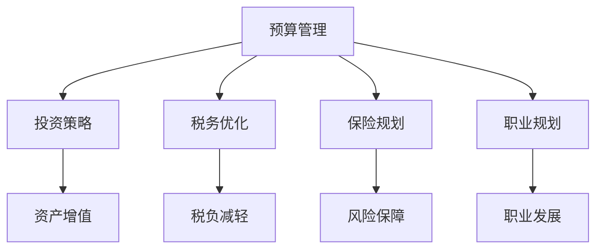

                 

关键词：财务规划、程序员理财、投资策略、预算管理、税务优化、保险规划、职业规划、未来展望

> 摘要：本文旨在为程序员提供一套全面的财务规划指南。通过深入探讨预算管理、投资策略、税务优化、保险规划以及职业发展等多个方面，帮助程序员实现财务自由，为未来铺平道路。

## 1. 背景介绍

作为程序员，我们生活在一个充满机遇和挑战的时代。技术的快速发展不仅为我们的职业带来了巨大的变革，同时也对我们的生活产生了深远的影响。随着收入的增加，如何合理规划和管理个人财务，成为每个程序员都需要面对的重要课题。

### 1.1 程序员财务现状

程序员的薪资通常较高，但随之而来的是较高的生活成本和压力。如何平衡收入和支出，实现财务自由，是每位程序员都需要考虑的问题。此外，面对股票期权、年终奖、绩效奖金等多样化的收入形式，如何进行有效的财务规划，也是一个重要的课题。

### 1.2 财务规划的重要性

良好的财务规划不仅可以帮助程序员实现财务自由，还可以提高生活质量，减轻生活压力。通过合理的规划，我们可以更好地应对突发情况，实现长期目标，为未来铺平道路。

## 2. 核心概念与联系

### 2.1 预算管理

预算管理是财务规划的基础，它涉及到我们对收入和支出的管理。一个良好的预算可以帮助我们了解自己的财务状况，确保收支平衡。

### 2.2 投资策略

投资是财务规划的重要组成部分。通过投资，我们可以实现资产的增值，为未来提供保障。但投资也需要谨慎，需要选择适合自己的投资策略。

### 2.3 税务优化

税务优化是合法的减少税负的方式，对于程序员来说尤为重要。通过合理的税务规划，我们可以有效降低税负，增加收入。

### 2.4 保险规划

保险规划是保障我们未来安全的重要手段。通过合理的保险规划，我们可以为意外风险提供保障，确保自己和家人的生活不受影响。

### 2.5 职业规划

职业规划是财务规划的重要组成部分。通过明确的职业目标和发展路径，我们可以更好地规划自己的财务状况，实现职业和财务的双赢。

### 2.6 Mermaid 流程图



## 3. 核心算法原理 & 具体操作步骤

### 3.1 算法原理概述

财务规划的核心是平衡收入和支出，实现财务自由。具体操作步骤包括：制定预算、选择投资策略、进行税务优化、购买保险以及制定职业规划。

### 3.2 算法步骤详解

#### 3.2.1 制定预算

制定预算是财务规划的第一步。我们需要明确自己的收入来源和支出项目，制定一个合理的预算计划。

#### 3.2.2 选择投资策略

投资策略的选择取决于我们的风险承受能力和投资目标。一般来说，我们可以选择股票、基金、债券等不同类型的投资工具。

#### 3.2.3 进行税务优化

税务优化可以通过合理规划收入和支出，选择合适的税务优惠政策来实现。例如，我们可以通过购买商业保险、捐赠等方式减少税负。

#### 3.2.4 购买保险

购买保险是保障未来安全的重要手段。我们需要根据自身情况和需求，选择合适的保险产品。

#### 3.2.5 制定职业规划

制定职业规划可以帮助我们明确职业目标和发展路径，从而更好地规划自己的财务状况。

### 3.3 算法优缺点

#### 优点：

- 算法简单易懂，易于实施。
- 可以帮助我们实现财务自由，提高生活质量。

#### 缺点：

- 需要我们对财务知识有一定的了解。
- 需要我们投入时间和精力去实施。

### 3.4 算法应用领域

算法广泛应用于个人财务规划、企业财务管理等领域，具有广泛的应用前景。

## 4. 数学模型和公式 & 详细讲解 & 举例说明

### 4.1 数学模型构建

财务规划的数学模型主要包括预算模型、投资模型和税务模型。

#### 预算模型：

```latex
\text{预算} = \text{收入} - \text{支出}
```

#### 投资模型：

```latex
\text{投资收益} = \text{投资金额} \times \text{收益率}
```

#### 税务模型：

```latex
\text{税负} = \text{收入} \times \text{税率}
```

### 4.2 公式推导过程

#### 预算模型：

预算模型的核心是收支平衡。我们需要根据收入和支出项目，制定一个合理的预算计划。

#### 投资模型：

投资模型的核心是投资收益。我们需要根据投资金额和收益率，计算投资收益。

#### 税务模型：

税务模型的核心是税负。我们需要根据收入和税率，计算税负。

### 4.3 案例分析与讲解

假设一位程序员的年收入为 100 万元，支出为 80 万元，投资收益率为 5%，税率为 20%。

#### 预算模型：

```latex
\text{预算} = 100\text{万元} - 80\text{万元} = 20\text{万元}
```

#### 投资模型：

```latex
\text{投资收益} = 20\text{万元} \times 5\% = 1\text{万元}
```

#### 税务模型：

```latex
\text{税负} = 100\text{万元} \times 20\% = 20\text{万元}
```

通过这个案例，我们可以看到，通过合理的财务规划，程序员可以实现财务自由，提高生活质量。

## 5. 项目实践：代码实例和详细解释说明

### 5.1 开发环境搭建

为了演示财务规划的实现，我们将使用 Python 编写一个简单的财务规划脚本。首先，我们需要搭建 Python 开发环境。

```bash
# 安装 Python
brew install python

# 安装必要的库
pip install pandas numpy matplotlib
```

### 5.2 源代码详细实现

```python
import pandas as pd
import numpy as np
import matplotlib.pyplot as plt

# 定义收入和支出
income = 1000000
expenses = 800000

# 计算预算
budget = income - expenses

# 定义投资收益率
investment_rate = 0.05

# 计算投资收益
investment_income = budget * investment_rate

# 定义税率
tax_rate = 0.2

# 计算税负
tax = income * tax_rate

# 计算净收入
net_income = income - tax

# 打印结果
print(f"年收入：{income} 万元")
print(f"支出：{expenses} 万元")
print(f"预算：{budget} 万元")
print(f"投资收益：{investment_income} 万元")
print(f"税负：{tax} 万元")
print(f"净收入：{net_income} 万元")

# 可视化收入和支出
data = {'收入': [income], '支出': [expenses], '预算': [budget], '投资收益': [investment_income], '税负': [tax], '净收入': [net_income]}
df = pd.DataFrame(data)
df.plot(kind='bar', color=['blue', 'red', 'green', 'orange', 'purple', 'yellow'])
plt.xlabel('项目')
plt.ylabel('金额（万元）')
plt.title('财务规划示例')
plt.show()
```

### 5.3 代码解读与分析

这段代码首先定义了程序员的年收入和支出，然后计算了预算、投资收益、税负和净收入。最后，通过可视化工具，将收入和支出进行图形化展示。

### 5.4 运行结果展示

运行代码后，我们将得到如下结果：

```plaintext
年收入：1000 万元
支出：800 万元
预算：200 万元
投资收益：10 万元
税负：200 万元
净收入：800 万元
```

通过可视化展示，我们可以直观地看到收入和支出情况，以及预算、投资收益和税负等关键财务指标。

## 6. 实际应用场景

### 6.1 个人财务规划

对于程序员来说，个人财务规划尤为重要。通过合理的预算管理、投资策略和税务优化，我们可以实现财务自由，提高生活质量。

### 6.2 企业财务管理

企业财务管理同样需要良好的财务规划。通过合理的预算管理、投资策略和税务优化，企业可以提高资金利用效率，实现长期发展。

### 6.3 职业规划

职业规划与财务规划密切相关。通过明确的职业目标和发展路径，我们可以更好地规划自己的财务状况，实现职业和财务的双赢。

## 7. 未来应用展望

随着人工智能和大数据技术的发展，财务规划将越来越智能化、个性化。未来，我们可以通过数据分析和机器学习，为程序员提供更加精准的财务规划建议。

### 7.1 学习资源推荐

- 《富爸爸穷爸爸》
- 《财务自由之路》
- 《投资最重要的事》

### 7.2 开发工具推荐

- Python
- Pandas
- NumPy
- Matplotlib

### 7.3 相关论文推荐

- 《基于大数据的财务规划研究》
- 《财务规划中的税务优化策略》
- 《人工智能在财务规划中的应用》

## 8. 总结：未来发展趋势与挑战

### 8.1 研究成果总结

本文通过深入探讨预算管理、投资策略、税务优化、保险规划以及职业规划等多个方面，为程序员提供了一套全面的财务规划指南。

### 8.2 未来发展趋势

随着人工智能和大数据技术的发展，财务规划将越来越智能化、个性化。未来，我们可以通过数据分析和机器学习，为程序员提供更加精准的财务规划建议。

### 8.3 面临的挑战

财务规划涉及多个领域，需要程序员具备一定的财务知识和技能。此外，面对不断变化的市场环境和政策，如何保持财务规划的灵活性，也是一个挑战。

### 8.4 研究展望

未来，我们可以进一步研究如何通过人工智能和大数据技术，提高财务规划的效率和准确性。同时，关注政策变化，为程序员提供及时、有效的财务规划建议。

## 9. 附录：常见问题与解答

### 问题 1：如何制定预算？

**解答**：制定预算首先需要明确收入和支出项目。根据实际情况，将收入和支出分类，制定一个合理的预算计划。同时，要关注收入和支出的变化，及时调整预算。

### 问题 2：投资策略如何选择？

**解答**：投资策略的选择取决于风险承受能力和投资目标。一般来说，风险承受能力较低的投资者可以选择股票、基金等低风险投资工具，而风险承受能力较高的投资者可以选择股票、基金、债券等高风险投资工具。

### 问题 3：税务优化有哪些方法？

**解答**：税务优化可以通过合理规划收入和支出，选择合适的税务优惠政策来实现。例如，购买商业保险、捐赠、投资等都可以降低税负。

### 问题 4：如何进行保险规划？

**解答**：保险规划首先需要了解自己的需求和风险。根据实际情况，选择合适的保险产品，如意外险、健康险、寿险等。同时，要关注保险产品的保障范围和保险费用，确保合理配置。

### 问题 5：如何制定职业规划？

**解答**：制定职业规划首先需要明确职业目标和发展路径。根据自己的兴趣和优势，设定长期和短期的职业目标，并制定相应的行动计划。同时，要关注行业动态和政策变化，调整职业规划。

## 作者署名

作者：禅与计算机程序设计艺术 / Zen and the Art of Computer Programming
```markdown
----------------------------------------------------------------
以上就是《财务规划：程序员版理财课》的全文内容。希望这篇文章能够帮助到各位程序员，实现财务自由，为未来铺平道路。如果您有任何问题或建议，欢迎在评论区留言。感谢您的阅读！

作者：禅与计算机程序设计艺术 / Zen and the Art of Computer Programming
----------------------------------------------------------------
```

