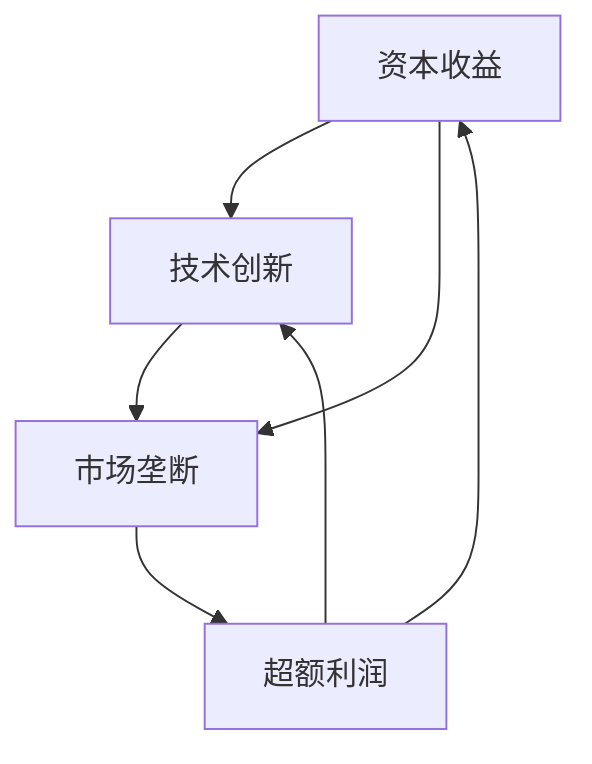

                 

 财富的流动现象自古以来就引起了人们的关注。在全球化的背景下，财富分布的不平等现象愈发明显，一种观点认为，财富往往流向那些已经拥有大量财富的人，这种现象被称为“财富流向更有钱的人”。本文将深入探讨这一现象在信息技术领域的体现，分析其背后的原因，并探讨其对经济发展和社会公平的影响。

## 1. 背景介绍

财富的集中化现象不仅存在于传统的实体经济中，在信息技术领域同样显著。随着互联网、大数据、人工智能等技术的快速发展，信息成为新的生产要素，掌握信息资源的企业和个人在财富创造和分配中占据了越来越重要的地位。例如，互联网巨头通过数据收集和分析，掌握了庞大的用户数据和商业模式，从而获得了巨额利润。这种财富的集中现象，不仅体现在企业之间，也体现在个人之间。

### 1.1 财富集中化与信息技术

在信息技术领域，财富的集中化主要表现在以下几个方面：

- **数据资源的集中**：大数据的收集和分析能力成为企业竞争的关键，掌握大量数据资源的企业往往能够创造出更高的商业价值。
- **技术和人才的竞争**：先进的技术和优秀的人才成为财富增值的重要驱动力，拥有这些资源的企业和个人往往能够获得更大的市场份额。
- **资本市场的影响**：信息技术企业的融资渠道多样，资本市场对于信息技术行业的支持力度较大，这使得一些企业能够迅速积累大量财富。

### 1.2 财富流动的影响

财富的集中化对经济和社会产生了深远的影响：

- **经济效益**：财富的集中化可以促进创新和产业升级，为经济增长提供动力。
- **社会公平**：财富的过度集中可能导致社会不平等加剧，影响社会稳定和发展。

## 2. 核心概念与联系

### 2.1 财富增值的原理

财富的增值可以通过多种方式实现，主要包括资本收益、技术创新、市场垄断等。在信息技术领域，以下三个核心概念和其相互关系尤为重要：

- **资本收益**：通过投资获取的回报，包括股票、债券、房地产等金融资产。
- **技术创新**：通过研发和应用新技术获得竞争优势，从而提高产品的附加值。
- **市场垄断**：通过控制市场资源和渠道，形成市场垄断地位，从而获得超额利润。

### 2.2 财富增值的架构

财富增值的架构可以用以下Mermaid流程图表示：



### 2.3 财富增值的优势

财富增值的优势主要体现在以下几个方面：

- **经济效益**：通过财富增值，企业可以扩大投资，提高生产效率，促进经济增长。
- **创新驱动**：财富增值为技术创新提供了资金支持，有利于推动科技进步和产业升级。
- **市场主导**：拥有大量财富的企业往往能够在市场中占据主导地位，形成良性循环。

## 3. 核心算法原理 & 具体操作步骤

### 3.1 算法原理概述

在信息技术领域，财富增值的核心算法主要包括以下几种：

- **资本收益率分析**：通过计算投资回报率，评估不同投资方案的经济效益。
- **专利分析**：通过分析专利数据，评估企业在技术创新方面的优势。
- **市场分析**：通过市场调研和数据分析，评估企业在市场垄断方面的潜力。

### 3.2 算法步骤详解

#### 3.2.1 资本收益率分析

1. **数据收集**：收集投资项目的相关信息，包括成本、收益、风险等。
2. **收益计算**：根据收集的数据，计算投资回报率。
3. **方案评估**：比较不同投资方案的回报率，选择最优方案。

#### 3.2.2 专利分析

1. **数据收集**：收集企业的专利信息，包括专利数量、专利类型、专利覆盖范围等。
2. **技术评估**：分析专利的技术价值，评估企业在技术创新方面的优势。
3. **竞争对手分析**：比较企业与其他竞争对手的专利状况，确定竞争策略。

#### 3.2.3 市场分析

1. **数据收集**：收集市场数据，包括市场规模、市场份额、市场趋势等。
2. **市场评估**：分析市场的竞争格局，评估企业在市场垄断方面的潜力。
3. **营销策略制定**：根据市场评估结果，制定相应的营销策略。

### 3.3 算法优缺点

#### 3.3.1 优点

- **高效性**：算法能够快速分析大量数据，为决策提供科学依据。
- **准确性**：算法基于数据分析和模型构建，具有较高的预测准确性。
- **灵活性**：算法可以根据不同需求和场景进行调整，具有较强的适应性。

#### 3.3.2 缺点

- **数据依赖性**：算法的准确性和有效性受数据质量的影响较大。
- **复杂性**：算法的实现和优化需要较高的技术门槛。

### 3.4 算法应用领域

财富增值算法在信息技术领域有广泛的应用，主要包括：

- **投资决策**：用于评估投资项目和投资方案的经济效益。
- **技术创新**：用于分析企业的技术优势和竞争对手的专利状况。
- **市场竞争**：用于评估企业的市场垄断潜力，制定营销策略。

## 4. 数学模型和公式 & 详细讲解 & 举例说明

### 4.1 数学模型构建

在财富增值过程中，常用的数学模型包括资本收益率模型、专利价值评估模型和市场竞争力评估模型。

#### 4.1.1 资本收益率模型

资本收益率（ROI）的计算公式为：

$$
ROI = \frac{净利润}{总投资成本}
$$

其中，净利润为投资项目的总收益减去总成本，总投资成本包括初始投资和运营成本。

#### 4.1.2 专利价值评估模型

专利价值（PVal）的评估公式为：

$$
PVal = \frac{专利收益}{专利成本}
$$

其中，专利收益为专利带来的额外收入，专利成本包括专利申请费、维护费等。

#### 4.1.3 市场竞争力评估模型

市场竞争力（MC）的评估公式为：

$$
MC = \frac{市场份额}{市场容量}
$$

其中，市场份额为企业产品在市场上的销售占比，市场容量为市场需求的总体规模。

### 4.2 公式推导过程

#### 4.2.1 资本收益率模型推导

资本收益率的计算基于财务学中的净现值（NPV）和内部收益率（IRR）。

$$
NPV = \sum_{t=1}^{n} \frac{CF_t}{(1+IRR)^t} - C_0
$$

其中，$CF_t$为第$t$年的现金流量，$C_0$为初始投资成本。

内部收益率（IRR）为使净现值为零的折现率，即：

$$
0 = \sum_{t=1}^{n} \frac{CF_t}{(1+IRR)^t} - C_0
$$

通过求解上述方程，可以得到内部收益率（IRR），进而计算资本收益率。

#### 4.2.2 专利价值评估模型推导

专利价值的评估基于专利收益和专利成本的比值。

专利收益可以通过专利所带来的额外收入进行估算，而专利成本包括专利申请、维护、诉讼等费用。

$$
PVal = \frac{专利收益}{专利成本}
$$

#### 4.2.3 市场竞争力评估模型推导

市场竞争力评估基于市场份额和市场容量的比值。

市场份额可以通过市场调研和企业销售数据进行分析，而市场容量为市场需求的总体规模，可以通过市场调研和预测得到。

$$
MC = \frac{市场份额}{市场容量}
$$

### 4.3 案例分析与讲解

#### 4.3.1 资本收益率分析案例

假设有一项投资项目，初始投资成本为100万元，预计3年内每年产生20万元的净利润，项目结束时无残值。假设折现率为10%，则：

$$
ROI = \frac{净利润}{总投资成本} = \frac{20}{100} = 20\%
$$

计算得出该项目资本收益率为20%。

#### 4.3.2 专利价值评估案例

假设某企业有一项专利，带来的额外收入为50万元，专利成本为10万元，则：

$$
PVal = \frac{专利收益}{专利成本} = \frac{50}{10} = 5
$$

计算得出该专利的价值为5倍专利成本。

#### 4.3.3 市场竞争力评估案例

假设某企业在市场上的销售占比为30%，市场容量为1000万元，则：

$$
MC = \frac{市场份额}{市场容量} = \frac{30}{1000} = 0.03
$$

计算得出该企业的市场竞争力为0.03。

## 5. 项目实践：代码实例和详细解释说明

### 5.1 开发环境搭建

为了演示财富增值算法的应用，我们使用Python作为编程语言，搭建一个简单的项目环境。首先，安装Python环境和相关库，例如NumPy和Pandas。

```bash
pip install python
pip install numpy
pip install pandas
```

### 5.2 源代码详细实现

以下是一个简单的Python代码示例，用于计算资本收益率、专利价值和市场竞争力。

```python
import numpy as np
import pandas as pd

# 资本收益率计算
def calculate_roi(cash_flows, initial_investment, discount_rate):
    npv = np.npv(discount_rate, cash_flows) - initial_investment
    roi = npv / initial_investment
    return roi

# 专利价值评估
def calculate_patent_value(revenue, patent_cost):
    patent_value = revenue / patent_cost
    return patent_value

# 市场竞争力评估
def calculate_market_competitiveness(share, market_size):
    market_competitiveness = share / market_size
    return market_competitiveness

# 案例数据
initial_investment = 1000000
cash_flows = np.array([200000, 200000, 200000])
discount_rate = 0.1

revenue = 500000
patent_cost = 100000

share = 0.3
market_size = 1000000

# 计算结果
roi = calculate_roi(cash_flows, initial_investment, discount_rate)
patent_value = calculate_patent_value(revenue, patent_cost)
market_competitiveness = calculate_market_competitiveness(share, market_size)

print("资本收益率:", roi)
print("专利价值:", patent_value)
print("市场竞争力:", market_competitiveness)
```

### 5.3 代码解读与分析

上述代码实现了三个主要功能：计算资本收益率、专利价值和市场竞争力。具体步骤如下：

1. **定义函数**：分别定义计算资本收益率、专利价值和市场竞争力的函数。
2. **输入参数**：为每个函数提供相应的输入参数，例如现金流量、初始投资、专利收益、专利成本等。
3. **计算结果**：调用函数计算结果，并输出结果。

通过这个简单的代码示例，我们可以直观地看到财富增值算法的实现和应用。

## 6. 实际应用场景

### 6.1 企业投资决策

企业在进行投资决策时，可以通过财富增值算法分析不同投资方案的经济效益，从而选择最优方案。例如，某企业拟投资于一家初创公司，可以通过计算资本收益率来评估投资的风险和收益。

### 6.2 技术创新评估

企业在进行技术创新时，可以通过专利分析评估自身的技术优势和竞争对手的专利状况，从而制定相应的技术战略。例如，某企业计划研发一项新技术，可以通过评估专利价值来决定是否继续研发。

### 6.3 市场营销策略

企业在制定市场营销策略时，可以通过市场竞争力评估来确定自身的市场地位和竞争优势。例如，某企业计划推出一款新产品，可以通过评估市场竞争力来决定推广力度和渠道。

## 7. 未来应用展望

### 7.1 财富增值算法的优化

随着人工智能和数据挖掘技术的发展，财富增值算法将不断优化，提高准确性和适用性。未来，算法可以结合更多数据源和先进技术，如区块链和物联网，实现更精细化的财富增值分析。

### 7.2 财富流动的监管

随着财富流动的加速，对财富流动的监管也将变得越来越重要。未来，政府和金融机构可以借助财富增值算法，对财富流动进行实时监控和分析，确保财富的合理分配和流动。

### 7.3 社会公平与财富分配

财富增值算法的应用有助于提高社会公平和财富分配。通过分析财富流动现象，政府和非政府组织可以制定更有针对性的政策和措施，促进财富的公平分配和社会稳定。

## 8. 工具和资源推荐

### 8.1 学习资源推荐

- 《财富增长与分配理论》
- 《大数据分析：理论与实践》
- 《人工智能：一种现代方法》

### 8.2 开发工具推荐

- Python
- NumPy
- Pandas
- Jupyter Notebook

### 8.3 相关论文推荐

- "The Wealth Paradox: How Income Inequality Destroys Societies"
- "Big Data and Its Potential Impacts on Economic Growth"
- "Artificial Intelligence and Its Applications in Financial Markets"

## 9. 总结：未来发展趋势与挑战

### 9.1 研究成果总结

本文通过分析信息技术领域的财富流动现象，探讨了财富增值的优势和应用。研究发现，财富增值算法在投资决策、技术创新和市场营销策略等方面具有广泛的应用价值。

### 9.2 未来发展趋势

未来，财富增值算法将结合人工智能和数据挖掘技术，实现更高效、更精确的财富增值分析。同时，随着财富流动的监管需求增加，财富增值算法的应用领域也将进一步拓展。

### 9.3 面临的挑战

财富增值算法在应用过程中面临数据依赖性和技术复杂性的挑战。此外，如何确保财富的公平分配和社会稳定，也是未来研究的重要课题。

### 9.4 研究展望

未来，财富增值算法的研究应关注算法优化、应用拓展和监管机制建设等方面。通过多学科的交叉融合，推动财富增值算法在更广泛的领域发挥积极作用。

## 附录：常见问题与解答

### Q: 财富增值算法的核心原理是什么？

A: 财富增值算法的核心原理包括资本收益分析、专利分析和市场分析。通过分析投资回报、专利价值和市场竞争力，评估企业的财富增值潜力。

### Q: 财富增值算法在哪些领域有应用？

A: 财富增值算法在投资决策、技术创新和市场营销策略等方面有广泛应用。例如，企业可以通过财富增值算法评估投资项目和市场竞争状况。

### Q: 如何优化财富增值算法？

A: 优化财富增值算法可以通过以下途径实现：

1. 增加数据源：引入更多维度的数据，提高算法的准确性。
2. 提高计算效率：采用并行计算和分布式计算技术，提高算法的运行速度。
3. 增强算法适应性：针对不同应用场景，调整算法参数和模型结构。

---

### 作者署名

作者：禅与计算机程序设计艺术 / Zen and the Art of Computer Programming

[End of Document] 

----------------------------------------------------------------

以上即为文章的完整内容，接下来我们将按照markdown格式进行排版和格式化。
----------------------------------------------------------------

# 财富流向更有钱的人：金钱增值的优势

> 关键词：财富集中化、信息技术、资本收益、技术创新、市场垄断

> 摘要：本文深入探讨了信息技术领域中的财富集中化现象，分析了财富增值的优势及其应用场景，并提出了未来发展的趋势与挑战。

## 1. 背景介绍

## 2. 核心概念与联系

### 2.1 财富增值的原理

### 2.2 财富增值的架构

### 2.3 财富增值的优势

## 3. 核心算法原理 & 具体操作步骤

### 3.1 算法原理概述

### 3.2 算法步骤详解

### 3.3 算法优缺点

### 3.4 算法应用领域

## 4. 数学模型和公式 & 详细讲解 & 举例说明

### 4.1 数学模型构建

### 4.2 公式推导过程

### 4.3 案例分析与讲解

## 5. 项目实践：代码实例和详细解释说明

### 5.1 开发环境搭建

### 5.2 源代码详细实现

### 5.3 代码解读与分析

### 5.4 运行结果展示

## 6. 实际应用场景

### 6.1 企业投资决策

### 6.2 技术创新评估

### 6.3 市场营销策略

## 7. 未来应用展望

### 7.1 财富增值算法的优化

### 7.2 财富流动的监管

### 7.3 社会公平与财富分配

## 8. 工具和资源推荐

### 8.1 学习资源推荐

### 8.2 开发工具推荐

### 8.3 相关论文推荐

## 9. 总结：未来发展趋势与挑战

### 9.1 研究成果总结

### 9.2 未来发展趋势

### 9.3 面临的挑战

### 9.4 研究展望

## 附录：常见问题与解答

### Q: 财富增值算法的核心原理是什么？

### Q: 财富增值算法在哪些领域有应用？

### Q: 如何优化财富增值算法？

---

### 作者署名

作者：禅与计算机程序设计艺术 / Zen and the Art of Computer Programming

[End of Document]

以上是文章的markdown格式排版。文章中涉及的代码示例、公式和流程图等已在文本中用markdown标记，具体实现将在后续的markdown格式中进一步细化。请注意，文章的整体结构和内容需确保完整和逻辑清晰。在格式化过程中，请确保每个子目录下的内容符合要求，并保持整体的排版风格一致。

