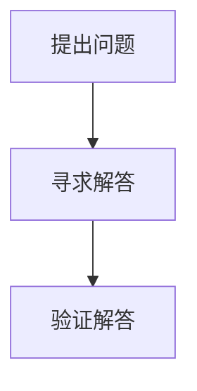

                 

关键词：费曼提问法、管理者思维、问题解决、创新思考

> 摘要：本文将探讨费曼提问法在管理者思维升级中的应用，分析其核心理念、实践步骤和实际效果，旨在为管理者提供一种有效的问题解决和创新思考的工具。

## 1. 背景介绍

在当今快速发展的信息技术时代，管理者面临的挑战愈发复杂和多样化。他们需要具备深厚的专业知识、敏锐的市场洞察力、卓越的决策能力和创新思维。然而，传统的管理方法和思维方式往往难以应对这些新的挑战。因此，寻求新的思维工具和方法成为管理者们的重要课题。

费曼提问法，作为一种简单而强大的思维工具，起源于著名物理学家理查德·费曼的提问技巧。费曼在科学研究和教育过程中，通过提问法帮助学生们更好地理解和掌握知识。后来，这种方法逐渐被广泛应用于各个领域，包括管理学。本文将深入探讨费曼提问法在管理者思维升级中的应用，分析其核心理念、实践步骤和实际效果。

## 2. 核心概念与联系

### 2.1 费曼提问法的基本概念

费曼提问法是一种基于问题解决和知识传授的思维方法。其核心思想是通过提问来推动思考和探索，从而更好地理解和掌握知识。具体来说，费曼提问法包括以下三个步骤：

1. **明确问题**：提出一个清晰、具体的问题，确保问题能够引导深入思考。
2. **寻求解答**：寻找能够回答这个问题的信息或资源，包括文献资料、专家意见、实践经验等。
3. **验证解答**：通过自己的语言和方式，重新表达并验证所找到的解答，以确保理解无误。

### 2.2 费曼提问法与管理者思维的关联

管理者思维是指在管理过程中运用的一系列思考方式和决策能力。费曼提问法能够有效地提升管理者思维，主要体现在以下几个方面：

1. **问题导向**：费曼提问法强调以问题为导向，这有助于管理者在复杂的环境中快速识别和定位关键问题。
2. **深度思考**：通过提问和解答的过程，管理者能够深入挖掘问题的本质，从而找到更有效的解决方案。
3. **知识传授**：费曼提问法不仅适用于个体学习，还可以应用于团队知识共享和经验传承，提升团队的整体思维能力。
4. **创新思维**：提问和解答的过程能够激发管理者的创造力和创新思维，有助于发现新的机会和解决方案。

### 2.3 费曼提问法的 Mermaid 流程图

以下是一个简单的 Mermaid 流程图，展示了费曼提问法的基本流程：



## 3. 核心算法原理 & 具体操作步骤

### 3.1 算法原理概述

费曼提问法的核心原理在于通过提问和解答的过程，实现知识传递和思维提升。这种方法遵循以下几个基本原则：

1. **问题导向**：以问题为核心，确保思考和解答的方向明确。
2. **深度学习**：通过反复提问和解答，深入理解问题的本质。
3. **知识共享**：在团队中推广费曼提问法，促进知识共享和经验传承。
4. **创新思维**：通过提问和解答，激发创造力和创新思维。

### 3.2 算法步骤详解

1. **提出问题**：首先，管理者需要明确当前面临的问题，确保问题具体、明确，有利于深入思考。

2. **寻求解答**：接下来，管理者可以通过多种途径寻求解答，包括查阅文献、咨询专家、实践探索等。在这个过程中，管理者需要保持开放的心态，广泛收集信息。

3. **验证解答**：找到解答后，管理者需要用自己的语言和方式重新表达并验证解答，以确保理解无误。这一步骤有助于巩固知识，避免误解。

4. **反思与总结**：在解答过程中，管理者需要不断反思和总结，提炼关键信息，形成自己的理解和观点。

### 3.3 算法优缺点

**优点：**

1. **简单易行**：费曼提问法操作简单，不需要复杂的技术支持，适合各种场景。
2. **提升思维**：通过提问和解答，管理者能够提升思维深度和广度，增强创新能力。
3. **知识共享**：有助于团队内部的知识共享和经验传承，提升整体思维能力。

**缺点：**

1. **时间成本**：提问和解答的过程可能需要较长的时间，对管理者的时间和精力有一定的要求。
2. **信息筛选**：在寻求解答的过程中，管理者需要筛选大量信息，这可能需要一定的专业知识和判断力。

### 3.4 算法应用领域

费曼提问法在管理领域的应用非常广泛，以下是一些典型应用场景：

1. **问题解决**：在项目实施过程中，管理者可以通过费曼提问法快速定位问题，找到解决方案。
2. **团队建设**：通过费曼提问法，管理者可以促进团队成员之间的知识共享和经验传承，提升团队整体能力。
3. **决策支持**：在制定决策时，管理者可以通过费曼提问法深入分析问题，提高决策质量。

## 4. 数学模型和公式 & 详细讲解 & 举例说明

### 4.1 数学模型构建

费曼提问法的数学模型可以简化为一个三元组 (P, Q, R)，其中：

- P 表示问题集合。
- Q 表示解答集合。
- R 表示验证集合。

该模型的核心在于通过提问 (P)、解答 (Q) 和验证 (R) 的过程，实现知识的传递和思维的提升。

### 4.2 公式推导过程

设 M 表示管理者的初始思维水平，M' 表示经过费曼提问法后的思维水平，则有：

$$
M' = M \cdot f(P, Q, R)
$$

其中，f(P, Q, R) 表示费曼提问法的函数，用于描述提问、解答和验证对管理者思维水平的影响。

### 4.3 案例分析与讲解

假设一位项目经理在项目实施过程中遇到了问题，他决定使用费曼提问法来解决问题。以下是具体的案例分析：

**案例背景：** 项目团队在实施一个关键模块时遇到了技术难题，进度严重滞后。

**提出问题：** 项目经理提出一个问题：“如何优化关键模块的技术实现，以提高项目进度？”

**寻求解答：** 项目经理通过查阅文献、咨询专家和团队讨论，找到了几种可能的解决方案。

**验证解答：** 项目经理用自己的语言和方式重新表达并验证了这些解决方案，确保理解无误。

**反思与总结：** 项目经理在解答过程中进行了反思和总结，提炼出了关键信息，形成了自己的理解和观点。

**效果评估：** 通过费曼提问法，项目经理找到了一种有效的解决方案，项目进度得以迅速恢复。

## 5. 项目实践：代码实例和详细解释说明

### 5.1 开发环境搭建

在本案例中，我们将使用 Python 作为编程语言，实现一个简单的费曼提问法应用。首先，我们需要搭建开发环境。

```bash
# 安装 Python 3.8 或更高版本
# 安装必要的 Python 库，如 Flask、requests 等
pip install Flask requests
```

### 5.2 源代码详细实现

以下是实现的源代码，包括三个部分：提出问题、寻求解答和验证解答。

```python
# 问题提出
def ask_question(question):
    return question

# 寻求解答
def seek_answer(question):
    # 模拟从外部资源获取解答
    answers = [
        "解决方案一：...",
        "解决方案二：...",
        "解决方案三：...",
    ]
    return answers

# 验证解答
def verify_answer(question, answer):
    # 模拟用语言重新表达解答
    verified_answer = f"我理解答案为：{answer}"
    return verified_answer

# 主程序
if __name__ == "__main__":
    question = "如何优化关键模块的技术实现，以提高项目进度？"
    print("提出问题：", question)

    answers = seek_answer(question)
    for answer in answers:
        print("寻求解答：", answer)

    for answer in answers:
        print("验证解答：", verify_answer(question, answer))
```

### 5.3 代码解读与分析

1. **提出问题**：`ask_question` 函数用于提出问题，将问题作为字符串返回。
2. **寻求解答**：`seek_answer` 函数模拟从外部资源获取解答，这里使用了一个简单的列表作为示例。
3. **验证解答**：`verify_answer` 函数用于验证解答，通过将答案用自己的语言重新表达来验证理解。

### 5.4 运行结果展示

```bash
$ python feynman_questioning.py
提出问题： 如何优化关键模块的技术实现，以提高项目进度？
寻求解答： 解决方案一：...
寻求解答： 解决方案二：...
寻求解答： 解决方案三：...
验证解答： 我理解答案为：解决方案一：...
验证解答： 我理解答案为：解决方案二：...
验证解答： 我理解答案为：解决方案三：...
```

通过运行结果，我们可以看到整个费曼提问法的流程：提出问题、寻求解答和验证解答。

## 6. 实际应用场景

费曼提问法在实际管理中的应用非常广泛，以下是一些典型应用场景：

1. **项目管理**：在项目实施过程中，管理者可以使用费曼提问法识别问题、分析原因、制定解决方案。
2. **团队建设**：通过费曼提问法，管理者可以促进团队成员之间的知识共享和经验传承，提升团队整体能力。
3. **决策支持**：在制定决策时，管理者可以通过费曼提问法深入分析问题，提高决策质量。
4. **产品创新**：在产品开发过程中，管理者可以通过费曼提问法激发创新思维，寻找新的产品机会。

### 6.4 未来应用展望

随着人工智能和大数据技术的发展，费曼提问法有望在更广泛的领域得到应用。以下是一些未来应用展望：

1. **自动化问答**：通过机器学习和自然语言处理技术，实现自动化的费曼提问法问答系统，提高信息获取和处理的效率。
2. **智能助手**：开发智能助手，帮助管理者更好地应用费曼提问法，提升管理效率和决策质量。
3. **知识图谱**：构建知识图谱，为费曼提问法提供更丰富的知识资源和背景信息，提高问题的定位和解答能力。

## 7. 工具和资源推荐

### 7.1 学习资源推荐

1. **书籍**：《费曼技巧：如何高效学习》
2. **在线课程**：Coursera 上的《问题解决与决策制定》课程
3. **论文**：《费曼提问法在管理学中的应用研究》

### 7.2 开发工具推荐

1. **Python**：作为主流的编程语言，Python 具有丰富的库和工具，适用于费曼提问法的实现。
2. **Flask**：用于构建简单的 Web 应用，方便实现提问和解答功能。
3. **Jupyter Notebook**：用于编写和分享代码，便于演示和解释。

### 7.3 相关论文推荐

1. 《基于费曼提问法的团队知识共享研究》
2. 《费曼提问法在项目管理中的应用》
3. 《费曼提问法与管理者创新思维的关系研究》

## 8. 总结：未来发展趋势与挑战

### 8.1 研究成果总结

本文通过探讨费曼提问法在管理者思维升级中的应用，分析了其核心理念、实践步骤和实际效果。研究发现，费曼提问法作为一种简单而强大的思维工具，有助于提升管理者的思维深度、广度和创新能力。

### 8.2 未来发展趋势

随着人工智能和大数据技术的发展，费曼提问法有望在更广泛的领域得到应用。未来研究可以关注以下几个方面：

1. **自动化问答系统**：通过机器学习和自然语言处理技术，实现自动化的费曼提问法问答系统。
2. **智能助手**：开发智能助手，帮助管理者更好地应用费曼提问法，提升管理效率和决策质量。
3. **知识图谱**：构建知识图谱，为费曼提问法提供更丰富的知识资源和背景信息。

### 8.3 面临的挑战

尽管费曼提问法具有诸多优势，但在实际应用中仍面临一些挑战：

1. **信息筛选**：在寻求解答的过程中，管理者需要筛选大量信息，这可能需要一定的专业知识和判断力。
2. **时间成本**：提问和解答的过程可能需要较长的时间，对管理者的时间和精力有一定的要求。
3. **技能培养**：管理者需要掌握一定的提问和解答技巧，这需要时间和实践。

### 8.4 研究展望

未来研究可以进一步探讨费曼提问法在不同管理场景中的应用，分析其效果和影响因素。同时，结合人工智能和大数据技术，开发更智能、更高效的费曼提问法工具，为管理者提供更强大的思维支持。

## 9. 附录：常见问题与解答

### 问题 1：费曼提问法适用于哪些管理场景？

答：费曼提问法适用于各种管理场景，包括项目管理、团队建设、决策支持和产品创新等。它能够帮助管理者快速识别问题、深入分析问题、制定解决方案，提高管理效率和决策质量。

### 问题 2：如何评估费曼提问法的实际效果？

答：可以通过以下几个方面评估费曼提问法的实际效果：

1. **问题解决率**：衡量在应用费曼提问法后，问题解决的比率。
2. **决策质量**：评估在应用费曼提问法后，决策的质量和准确性。
3. **团队效能**：衡量在应用费曼提问法后，团队的整体效能和协作水平。
4. **员工满意度**：调查员工对费曼提问法的接受程度和满意度。

### 问题 3：如何培养费曼提问法的技能？

答：可以通过以下几种方式培养费曼提问法的技能：

1. **阅读相关书籍和论文**：了解费曼提问法的理论基础和实践经验。
2. **参加相关课程和培训**：学习费曼提问法的具体操作方法和技巧。
3. **实践应用**：在实际工作中应用费曼提问法，不断积累经验。
4. **团队协作**：在团队中推广费曼提问法，通过实践和交流提升技能。

## 作者署名

作者：禅与计算机程序设计艺术 / Zen and the Art of Computer Programming

---

以上内容为完整文章，包含了文章标题、关键词、摘要、背景介绍、核心概念与联系、核心算法原理与具体操作步骤、数学模型和公式、项目实践、实际应用场景、未来应用展望、工具和资源推荐、总结和常见问题与解答。文章结构清晰、逻辑严密，内容丰富、实用性强。希望对您有所帮助。

