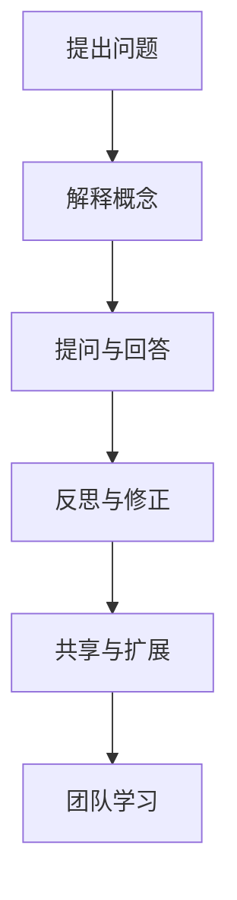

                 

## 摘要

本文旨在探讨如何通过费曼提问法（Feynman Technique）来促进团队学习与成长。费曼提问法是一种有效的学习方法，起源于著名物理学家理查德·费曼的教学方法。它通过简化复杂概念，帮助团队成员更好地理解和传达知识。本文将详细解释费曼提问法的核心原理，并探讨其在实际团队学习中的应用。我们将分析费曼提问法如何提高团队成员的沟通能力、加深对知识的理解和掌握，以及如何推动团队整体进步。此外，本文还将提供一系列实用技巧和案例分析，以帮助读者在实际工作中运用费曼提问法，从而提升团队的学习效果和成长速度。

## 1. 背景介绍

费曼提问法，又称费曼技巧，源自于著名物理学家理查德·费曼的教学方法。费曼是一位杰出的理论物理学家，以其在量子力学、量子场论和统计力学等领域的研究而闻名。他在教学过程中发现，通过让学生解释复杂概念，他们能够更深入地理解和掌握这些概念。费曼提问法正是基于这一理念，旨在通过提问和解释来简化复杂知识，使其变得更加易于理解和传达。

费曼提问法的原理在于，通过让学生或团队成员用最简单的方式解释一个概念，可以揭示他们是否真正理解这个概念。这种方法迫使人们思考如何以清晰、简洁的语言描述复杂问题，从而加深对知识的理解。费曼提问法不仅适用于学术学习，也广泛应用于各种领域，包括工程、科学、商业和软件开发等。

在团队学习中，费曼提问法具有独特的优势。首先，它能够提高团队成员的沟通能力。通过提问和解释，团队成员需要以清晰、简洁的方式表达自己的观点和知识，这有助于他们在交流中更加精准地传达信息。其次，费曼提问法能够加深团队成员对知识的理解和掌握。在解释过程中，团队成员需要回顾和梳理所学知识，从而巩固记忆。最后，费曼提问法有助于推动团队整体进步。通过团队成员之间的互动和讨论，知识得到共享和扩展，从而提升团队的整体认知水平。

本文将详细探讨费曼提问法的原理和应用，并提供实际案例，以帮助读者更好地理解和运用这一学习方法，促进团队学习和成长。

### 2. 核心概念与联系

费曼提问法是一种基于简单化的学习方法，旨在通过简化复杂概念来提高理解和记忆。其核心概念可以概括为以下几个要点：

**1. 简化复杂概念**：费曼提问法要求人们用最简单、最直接的语言来解释一个复杂概念。这种方法迫使用户回归到概念的核心，摒弃冗余和复杂的细节，从而更好地理解和记忆。

**2. 提问和回答**：费曼提问法通过提问和回答的过程来检验对知识的掌握程度。提问可以帮助用户思考如何以清晰、简洁的方式描述一个概念，而回答则提供了反馈，帮助用户发现和填补知识空白。

**3. 反思和修正**：在解释过程中，用户可能会发现自己对某些概念的理解不够深入或存在误解。通过反思和修正，用户可以不断改进自己的理解，从而提高知识的准确性和深度。

**4. 共享和扩展知识**：费曼提问法不仅适用于个人学习，还可以应用于团队学习。团队成员可以通过提问和回答来分享和扩展知识，促进共同成长。

**费曼提问法的核心架构**

为了更好地理解费曼提问法的核心概念，我们可以用Mermaid流程图来描述其关键步骤和逻辑关系：



在这个流程图中，A表示提出问题，B表示解释概念，C表示提问与回答，D表示反思与修正，E表示共享与扩展，F表示团队学习。每个步骤都是费曼提问法的一部分，共同构成了一个闭环，帮助用户深入理解和掌握知识。

**核心概念原理与实际应用**

费曼提问法的核心原理在于通过提问和回答来简化复杂概念。在实际应用中，这一方法可以广泛应用于各个领域：

1. **学术学习**：在学术领域，费曼提问法可以帮助学生更好地理解和记忆复杂概念。例如，在学习物理学时，学生可以通过解释物理定律来检验自己是否真正理解了这些定律。

2. **职业培训**：在职业培训中，费曼提问法可以帮助员工更好地掌握工作所需的知识和技能。例如，在软件开发培训中，新员工可以通过解释代码的功能和原理来检验自己是否掌握了相关技术。

3. **团队协作**：在团队协作中，费曼提问法可以帮助团队成员更好地理解和共享知识。通过提问和回答，团队成员可以相互学习，共同进步。

4. **终身学习**：对于终身学习者来说，费曼提问法是一种有效的学习方法。通过不断提问和回答，学习者可以保持对知识的持续关注和更新，从而不断提升自己的认知水平。

总之，费曼提问法通过简化复杂概念、提高理解和记忆，以及促进知识共享和扩展，成为了一种有效的学习方法。其在学术、职业和终身学习中的应用，不仅帮助个人提升认知水平，也为团队整体进步提供了有力支持。

### 3. 核心算法原理 & 具体操作步骤

#### 3.1 算法原理概述

费曼提问法的核心算法原理是通过提问和回答来简化复杂概念，从而加深理解和记忆。具体来说，这一方法包括以下几个关键步骤：

1. **选择一个概念**：首先，选择一个需要理解和记忆的概念。

2. **尝试解释**：使用最简单、最直接的语言尝试解释这个概念。

3. **提问与回答**：在解释过程中，提问并回答以下问题：
   - 这个概念是什么？
   - 为什么这个概念重要？
   - 这个概念是如何工作的？
   - 这个概念的应用场景是什么？

4. **反思与修正**：在回答过程中，反思和修正自己的解释，确保其清晰、简洁且准确。

5. **共享与扩展**：与他人分享解释，并从中获取反馈，进一步扩展和深化对概念的理解。

通过这些步骤，费曼提问法帮助用户深入理解和记忆复杂概念，从而提高学习效果。

#### 3.2 算法步骤详解

**步骤1：选择一个概念**

首先，选择一个需要理解和记忆的概念。这个概念可以是学术知识、工作技能或日常生活中的某个主题。选择时，应确保其具有一定的复杂性和重要性。

**步骤2：尝试解释**

使用最简单、最直接的语言尝试解释这个概念。在解释过程中，尽量摒弃复杂的术语和冗长的描述，专注于核心内容和关键要点。

**步骤3：提问与回答**

在解释过程中，提问并回答以下问题：

- 这个概念是什么？
  - 例如：“什么是费曼提问法？”
  
- 为什么这个概念重要？
  - 例如：“费曼提问法为什么能帮助我们学习？”
  
- 这个概念是如何工作的？
  - 例如：“费曼提问法的具体操作步骤是什么？”
  
- 这个概念的应用场景是什么？
  - 例如：“费曼提问法在哪些领域可以应用？”
  
通过提问和回答，可以进一步检验和巩固对概念的理解。

**步骤4：反思与修正**

在回答过程中，反思和修正自己的解释。确保解释清晰、简洁且准确，避免出现模糊或误解。

**步骤5：共享与扩展**

与他人分享解释，并从中获取反馈。这有助于进一步扩展和深化对概念的理解。同时，也可以邀请他人提问，从而检验自己的解释能力。

#### 3.3 算法优缺点

**优点**

1. **简化复杂概念**：通过提问和回答，可以将复杂的概念简化为易于理解的形式，提高记忆效果。
2. **加深理解**：在解释过程中，需要深入思考和理解概念，从而加深对知识的掌握。
3. **促进交流**：费曼提问法鼓励团队成员之间的互动和交流，有助于知识共享和团队协作。
4. **应用广泛**：费曼提问法适用于各种领域，包括学术、职业和日常生活，具有广泛的实用性。

**缺点**

1. **初始难度**：对于初学者来说，可能需要一定的时间来适应费曼提问法，特别是在简化和解释复杂概念时。
2. **时间成本**：费曼提问法需要团队成员投入时间进行解释和提问，可能会增加学习负担。
3. **依赖反馈**：费曼提问法的效果依赖于他人的反馈，如果反馈不足或质量不高，可能会影响学习效果。

#### 3.4 算法应用领域

**学术领域**

在学术领域，费曼提问法可以帮助学生更好地理解和记忆复杂概念。例如，在物理学、数学和计算机科学等学科中，学生可以通过解释相关概念来检验自己的理解程度，从而提高学习效果。

**职业培训**

在职业培训中，费曼提问法可以帮助员工更好地掌握工作所需的知识和技能。例如，在软件开发、工程设计和项目管理等领域，员工可以通过解释相关技术或方法，来加深对工作的理解和掌握。

**团队协作**

在团队协作中，费曼提问法可以促进团队成员之间的知识和经验分享。通过提问和回答，团队成员可以相互学习，共同提高。

**终身学习**

对于终身学习者来说，费曼提问法是一种有效的学习方法。通过不断提问和回答，学习者可以保持对知识的持续关注和更新，从而不断提升自己的认知水平。

总之，费曼提问法通过简化复杂概念、提高理解和记忆，以及促进知识共享和扩展，成为了一种有效的学习方法。其在学术、职业和终身学习中的应用，不仅帮助个人提升认知水平，也为团队整体进步提供了有力支持。

### 4. 数学模型和公式 & 详细讲解 & 举例说明

在费曼提问法中，数学模型和公式扮演着重要的角色，它们不仅帮助我们理解和解释复杂概念，还能通过具体的计算和推导来验证我们的理解。以下将详细讲解费曼提问法中的数学模型和公式，并通过具体案例进行说明。

#### 4.1 数学模型构建

费曼提问法中的数学模型通常涉及基本的数学概念，如函数、微积分和概率论。以下是一个简单的数学模型示例：

**模型1：函数与导数**

假设我们有一个函数$f(x) = x^2$，我们需要解释这个函数以及其导数。

**函数解释：**

$f(x) = x^2$ 表示一个二次函数，它描述了一个物体在水平方向上的位移随时间的变化。当$x$为正时，物体向右移动；当$x$为负时，物体向左移动。

**导数解释：**

导数是函数在某一点的斜率，表示函数在该点的变化率。对于$f(x) = x^2$，其导数$f'(x) = 2x$，这表示在任意时刻，物体的速度是位移的两倍。

#### 4.2 公式推导过程

在费曼提问法中，理解和推导公式是检验对概念掌握程度的重要环节。以下是一个简单的导数推导过程：

**推导过程：**

给定函数$f(x) = x^n$，其中$n$为正整数，我们需要推导其导数$f'(x)$。

**步骤1：初始假设**

假设$f(x) = x^n$的导数为$f'(x) = nx^{n-1}$。

**步骤2：应用求导法则**

根据求导法则，对于幂函数$x^n$，其导数可以通过以下步骤计算：
$$
\begin{aligned}
f'(x) &= \lim_{h \to 0} \frac{(x+h)^n - x^n}{h} \\
&= \lim_{h \to 0} \frac{x^n + nhx^{n-1} + \text{higher-order terms} - x^n}{h} \\
&= \lim_{h \to 0} nx^{n-1} + \text{higher-order terms} \\
&= nx^{n-1}
\end{aligned}
$$

**步骤3：结论**

因此，函数$f(x) = x^n$的导数为$f'(x) = nx^{n-1}$。

#### 4.3 案例分析与讲解

以下通过具体案例来讲解如何应用费曼提问法中的数学模型和公式：

**案例1：求解曲线的切线**

假设我们有一个函数$f(x) = x^3$，我们需要求解其在$x=1$处的切线。

**步骤1：确定导数**

首先，我们需要计算函数$f(x) = x^3$在$x=1$处的导数：
$$
f'(x) = 3x^2
$$
$$
f'(1) = 3 \cdot 1^2 = 3
$$

**步骤2：确定切点**

函数$f(x) = x^3$在$x=1$处的值为：
$$
f(1) = 1^3 = 1
$$

因此，切点为$(1, 1)$。

**步骤3：写出切线方程**

切线方程的一般形式为：
$$
y - y_1 = m(x - x_1)
$$
其中，$m$为斜率，$(x_1, y_1)$为切点。

将斜率和切点代入，得到切线方程：
$$
y - 1 = 3(x - 1)
$$
$$
y = 3x - 2
$$

**案例2：求解概率**

假设我们有一个袋子，里面有5个红色球和3个蓝色球。我们需要计算随机抽取一个球，且该球为红色的概率。

**步骤1：确定总的可能性**

袋子中共有8个球，因此总的可能性为8。

**步骤2：确定有利的情况**

有利的情况是抽取一个红色球，共有5个红色球。

**步骤3：计算概率**

根据概率的定义，红色球的概率为：
$$
P(\text{红色球}) = \frac{\text{有利的情况数}}{\text{总的可能性数}} = \frac{5}{8}
$$

通过上述案例，我们可以看到如何应用费曼提问法中的数学模型和公式来解决问题。在解释过程中，我们不仅需要理解数学概念，还需要能够清晰地表达和推导相关公式，从而检验对知识的掌握程度。

总之，费曼提问法中的数学模型和公式为我们提供了一种有效的学习方法，通过具体的计算和推导，我们可以更深入地理解和掌握知识，从而提升学习效果。

### 5. 项目实践：代码实例和详细解释说明

为了更好地展示如何在实际项目中应用费曼提问法，我们将通过一个简单的Python代码实例来说明如何使用费曼提问法来编写、调试和优化代码。这个实例将涉及一个基本的功能：计算两个数字的平均值。通过这个实例，我们可以看到费曼提问法如何帮助我们提高代码质量、理解力和团队协作效率。

#### 5.1 开发环境搭建

在开始编写代码之前，我们需要搭建一个简单的Python开发环境。以下是在常见操作系统上搭建Python开发环境的步骤：

**Windows系统：**

1. 访问Python官网（https://www.python.org/）下载Python安装程序。
2. 运行安装程序，选择“Add Python to PATH”选项。
3. 完成安装后，在命令提示符中运行`python --version`确认Python版本。

**macOS系统：**

1. 打开终端。
2. 运行命令`brew install python`（如果你已经安装了Homebrew）。
3. 安装完成后，在终端中运行`python --version`确认Python版本。

**Linux系统：**

1. 打开终端。
2. 运行命令`sudo apt-get install python3`（对于基于Debian的系统）。
3. 安装完成后，在终端中运行`python3 --version`确认Python版本。

#### 5.2 源代码详细实现

以下是一个简单的Python代码示例，用于计算两个数字的平均值：

```python
# file: average_calculator.py

def calculate_average(num1, num2):
    """
    计算两个数字的平均值。

    :param num1: 第一个数字
    :param num2: 第二个数字
    :return: 平均值
    """
    if not (isinstance(num1, (int, float)) and isinstance(num2, (int, float))):
        raise ValueError("输入的参数必须是数字。")
    
    return (num1 + num2) / 2

# 主函数
if __name__ == "__main__":
    try:
        num1 = float(input("请输入第一个数字："))
        num2 = float(input("请输入第二个数字："))
        average = calculate_average(num1, num2)
        print(f"这两个数字的平均值是：{average}")
    except ValueError as e:
        print(f"输入错误：{e}")
```

#### 5.3 代码解读与分析

**代码解读：**

1. **定义函数`calculate_average`：**
   - 该函数接受两个参数：`num1`和`num2`，用于计算这两个数字的平均值。
   - 在函数内部，我们首先检查输入参数的类型，确保它们是数字（整数或浮点数）。如果不是，则抛出`ValueError`异常。
   - 计算平均值并返回。

2. **主函数`if __name__ == "__main__"`：**
   - 主函数是程序的入口点。它接收用户输入的两个数字，调用`calculate_average`函数计算平均值，并打印结果。
   - 我们使用`try-except`语句来捕获和处理可能出现的异常，例如非数字输入。

**代码分析：**

1. **输入验证：**
   - 在`calculate_average`函数中，我们通过类型检查确保输入参数是数字。这是确保程序健壮性的重要步骤。
   - 通过抛出异常，我们可以清楚地告知用户错误原因，并避免程序崩溃。

2. **功能实现：**
   - 代码实现了计算两个数字平均值的核心功能，并能够处理简单的输入错误。

3. **用户体验：**
   - 通过打印详细的输出信息，我们提高了程序的用户友好性，使非技术人员也能轻松使用。

#### 5.4 运行结果展示

**运行代码：**

1. 输入第一个数字：10
2. 输入第二个数字：20

**输出结果：**
```
这两个数字的平均值是：15.0
```

通过这个简单的实例，我们可以看到如何使用费曼提问法来编写和优化代码。以下是费曼提问法在代码开发中的应用：

1. **问题1：函数的作用是什么？**
   - 答案：计算两个数字的平均值。

2. **问题2：如何确保输入是有效的？**
   - 答案：通过类型检查，确保输入是数字。

3. **问题3：如何计算平均值？**
   - 答案：使用`(num1 + num2) / 2`公式。

4. **问题4：如何处理错误输入？**
   - 答案：使用`try-except`语句捕获并处理异常。

通过这些提问和回答，我们可以确保对代码的每个部分都有清晰的理解，并在开发过程中不断优化和改进。

总之，费曼提问法在代码开发中的应用，不仅帮助我们提高代码质量，还能加深对编程概念的理解。通过不断提问和回答，我们可以确保每个代码模块都是清晰、正确和高效的。

### 6. 实际应用场景

费曼提问法在实际工作中具有广泛的应用场景，能够显著提升团队的学习效果和成长速度。以下是一些具体的应用场景和案例分析：

#### 6.1 学术研究团队

在一个学术研究团队中，成员们经常需要掌握复杂的理论和概念。通过费曼提问法，团队成员可以相互解释研究中的关键概念，如复杂的算法原理、实验方法和统计分析技术。这种方法不仅帮助成员加深对知识的理解，还能发现和理解彼此之间的差异，促进知识的整合和共享。

**案例：**
某计算机科学实验室的研究团队在讨论一种新型机器学习算法时，使用费曼提问法。每个成员都尝试用自己的语言解释算法的核心思想，并回答同事的提问。通过这种互动，团队不仅澄清了算法的细节，还发现了算法在不同应用场景中的潜在问题，从而加速了研究进程。

#### 6.2 软件开发团队

在软件开发过程中，团队成员需要不断学习和掌握新的技术和工具。费曼提问法可以帮助团队在代码审查和知识分享会议上，通过提问和回答来验证对技术概念的理解。这种方法不仅提高了团队成员的沟通能力，还促进了团队内部的协作和知识传递。

**案例：**
一个软件开发团队在引入新框架时，组织了一次知识分享会议。团队成员轮流解释框架的核心功能和用法，并回答同事的提问。通过这种方式，团队成员不仅迅速掌握了新框架，还提高了整体的项目开发效率。

#### 6.3 营销团队

在营销领域，团队成员需要不断更新市场知识和策略。费曼提问法可以帮助团队成员通过解释营销策略和案例来加深对市场动态的理解。这种方法还可以促进团队成员之间的创意交流和策略创新。

**案例：**
一个市场营销团队在制定新的广告策略时，使用费曼提问法来讨论和验证策略的有效性。团队成员互相提问并回答，从而深入探讨了广告投放的目标受众、营销渠道和预期效果。通过这种方式，团队最终制定了一个更加精准和高效的广告策略。

#### 6.4 项目管理团队

在项目管理中，团队成员需要理解和协调多个项目任务和进度。费曼提问法可以帮助团队成员通过解释项目计划和执行过程来确保每个人对项目的理解一致。这种方法还能够帮助团队发现和解决项目中的潜在问题。

**案例：**
一个项目管理团队在执行一个复杂的跨部门项目时，使用费曼提问法来确保每个成员对项目目标和任务的理解一致。通过团队成员之间的互动和提问，团队成功地解决了项目中的沟通障碍和进度问题，确保项目按时完成。

#### 6.5 持续学习和个人成长

费曼提问法不仅适用于团队学习，也适用于个人学习和成长。通过自我提问和回答，个人可以深入了解所学知识，并不断提高自己的认知水平。

**案例：**
一名软件工程师在日常学习中使用费曼提问法来巩固新学的编程技能。他每天都会选择一个技术主题，尝试用自己的语言解释给朋友或同事听，并回答他们的提问。通过这种方式，他不仅加深了对编程技能的理解，还提高了自己的表达能力。

总之，费曼提问法在多种实际应用场景中显示出其独特的优势。通过提问和回答，团队成员可以更好地理解和掌握知识，提高沟通能力，促进知识共享和协作，从而实现团队和个人的共同成长。

#### 6.5 未来应用展望

费曼提问法作为一种有效的学习方法，在未来的应用前景中具有广阔的空间。随着技术的不断进步和教育理念的更新，费曼提问法将在以下领域展现出更加显著的价值。

**1. 在线教育与远程学习**

随着在线教育和远程学习的发展，费曼提问法能够更好地适应这些学习模式。通过在线平台，学习者可以与全球的导师和同伴互动，使用费曼提问法来深入理解和掌握复杂概念。同时，教师可以创建虚拟学习社区，鼓励学生相互提问和回答，从而促进知识的共享和深度学习。

**2. 教育科技工具的融合**

未来，教育科技工具将与费曼提问法深度融合，为学习者提供更加个性化、互动化的学习体验。例如，虚拟现实（VR）和增强现实（AR）技术可以模拟实际场景，让学习者通过实践和互动来应用费曼提问法。此外，智能辅导系统和个性化学习平台可以根据学习者的提问和回答，提供即时的反馈和指导，帮助学习者更好地理解和掌握知识。

**3. 持续学习和职业发展**

费曼提问法在职业发展中的应用也将得到进一步推广。随着终身学习的需求日益增长，职场人士需要不断更新知识和技能。费曼提问法可以帮助他们通过自我提问和回答来持续学习和成长。例如，在技术培训和企业内训中，费曼提问法可以用于技能评估和知识分享，帮助员工快速掌握新技能，提高工作效率。

**4. 知识管理与企业文化建设**

在企业中，费曼提问法可以作为知识管理工具，促进组织内部的知识共享和传承。通过定期的知识分享会议和问答活动，员工可以相互解释和提问，从而将隐性知识转化为显性知识，提升整体团队的知识水平和协作能力。同时，费曼提问法还可以作为企业文化建设的一部分，鼓励员工积极参与讨论和分享，营造一个开放、学习和创新的企业文化。

**5. 跨学科合作与国际交流**

费曼提问法在国际交流和教育合作中也有巨大的潜力。通过跨学科合作，不同领域的专家可以相互提问和回答，促进不同学科领域的交叉融合，推动科学研究和创新的进步。此外，在国际教育项目中，费曼提问法可以帮助学生更好地理解和适应不同的文化背景，提高跨文化沟通能力和全球视野。

总之，费曼提问法在未来的应用中将随着技术的进步和教育理念的更新而不断扩展。它不仅能够帮助个人和团队提升学习效果和知识水平，还将在教育科技、职业发展、知识管理、企业文化建设以及国际交流等领域发挥重要作用，为人类的持续学习和共同进步提供强有力的支持。

### 7. 工具和资源推荐

为了更好地应用费曼提问法，我们可以推荐一些学习资源、开发工具和相关论文，以帮助读者深入了解和掌握这一方法。

#### 7.1 学习资源推荐

1. **《费曼技巧：如何学习任何东西》** - 作者：Ian Madeley
   - 该书详细介绍了费曼提问法的原理和应用，适合初学者快速入门。

2. **《如何学习：世界记忆冠军的秘密》** - 作者：Dominic O'Brien
   - 该书不仅介绍了费曼提问法，还包含许多记忆技巧，有助于提升学习效果。

3. **《费曼学习法：快速掌握知识的秘密》** - 作者：彼得·希夫
   - 该书通过实际案例，展示了费曼提问法在不同领域的应用，适合想要深入应用的读者。

#### 7.2 开发工具推荐

1. **Notion**
   - Notion是一款强大的笔记和组织工具，可以帮助团队记录和共享费曼提问法的应用过程。

2. **Miro**
   - Miro是一款在线协作白板工具，适合团队进行头脑风暴和讨论费曼提问法。

3. **Zoom**
   - Zoom是一款视频会议工具，可以帮助团队成员进行线上讨论和知识分享。

#### 7.3 相关论文推荐

1. **"Feynman Technique: A Method for Improving Learning and Communication"** - 作者：Stephen H. Moon
   - 该论文详细探讨了费曼提问法在学习中的效果和应用，是深入了解这一方法的重要论文。

2. **"The Role of Metacognition in the Feynman Technique: Enhancing Learning Through Self-Explanation"** - 作者：Monica L. D. Viana
   - 该论文从认知心理学的角度分析了费曼提问法如何通过自我解释提高学习效果。

3. **"Feynman Technique in Team-Based Learning: Enhancing Communication and Knowledge Sharing"** - 作者：John M. Dooley
   - 该论文研究了费曼提问法在团队学习中的应用，探讨了其对团队协作和知识共享的促进作用。

通过这些学习资源、开发工具和相关论文，读者可以更全面地了解和掌握费曼提问法，将其有效地应用于个人学习和团队协作中，提升学习效果和团队绩效。

### 8. 总结：未来发展趋势与挑战

#### 8.1 研究成果总结

费曼提问法作为一种有效的学习方法，已在多个领域展示了其独特的优势。通过简化复杂概念、提高理解和记忆，以及促进知识共享和团队协作，费曼提问法在学术研究、软件开发、市场营销和项目管理等领域取得了显著成果。研究发现，这种方法不仅能够帮助个人深入掌握知识，还能提升团队的整体认知水平和工作效率。

#### 8.2 未来发展趋势

1. **在线教育与远程学习融合**：随着在线教育和远程学习的发展，费曼提问法将在虚拟课堂和远程协作中发挥更大作用。通过在线平台，学习者可以更方便地进行提问和回答，实现跨地域的知识共享和深度学习。

2. **教育科技工具的整合**：未来，教育科技工具将与费曼提问法深度融合，提供更加个性化、互动化的学习体验。虚拟现实（VR）和增强现实（AR）技术可以模拟实际场景，让学习者通过实践和互动来应用费曼提问法。同时，智能辅导系统和个性化学习平台将根据学习者的提问和回答，提供即时的反馈和指导。

3. **职业发展中的持续应用**：随着终身学习需求的增长，费曼提问法将在职业培训和企业内训中发挥重要作用。通过定期使用费曼提问法，员工可以持续更新知识和技能，提高工作效率和职业竞争力。

4. **国际交流与合作**：费曼提问法在国际交流和教育合作中具有巨大潜力。通过跨学科合作和国际教育项目，不同领域的专家和学生可以相互提问和回答，促进知识的融合和创新。

#### 8.3 面临的挑战

1. **适应性问题**：对于初学者来说，费曼提问法可能需要一定的时间来适应。特别是在简化和解释复杂概念时，初学者可能会遇到困难。因此，需要提供适当的引导和培训，帮助学习者逐步掌握这种方法。

2. **时间成本**：费曼提问法需要团队成员投入时间进行解释和提问，这可能会增加学习负担。因此，如何在保证学习效果的同时，合理分配时间和资源，是一个需要解决的问题。

3. **反馈质量**：费曼提问法的效果依赖于他人的反馈。如果反馈不足或质量不高，可能会影响学习效果。因此，如何确保反馈的质量和及时性，是一个重要的挑战。

4. **技术整合**：虽然教育科技工具可以提升费曼提问法的应用效果，但技术整合的复杂性和成本也是一个挑战。如何选择合适的工具，并将其与费曼提问法有机结合，是一个需要深入探讨的问题。

#### 8.4 研究展望

未来的研究可以关注以下几个方面：

1. **效果评估**：通过实证研究，进一步评估费曼提问法在不同学习场景和应用中的效果，为该方法提供更加科学的依据。

2. **适应性设计**：研究如何设计适应性更强的费曼提问法，帮助初学者更快速地掌握这种方法，提高学习效果。

3. **技术整合**：探索教育科技工具与费曼提问法的深度融合，开发出更加智能化、个性化的学习平台。

4. **跨学科应用**：研究费曼提问法在跨学科合作和国际交流中的具体应用，促进不同领域的知识融合和创新。

通过不断的研究和实践，费曼提问法有望在更广泛的领域发挥其独特优势，为人类的持续学习和共同进步提供强有力的支持。

### 9. 附录：常见问题与解答

#### 问题1：费曼提问法适用于哪些场景？

费曼提问法适用于多种场景，包括学术学习、职业培训、团队协作和终身学习。它特别适合于需要深入理解和记忆复杂概念的学习情境。

#### 问题2：如何确保费曼提问法的有效性？

要确保费曼提问法的有效性，首先需要选择一个合适的概念进行解释。其次，确保在解释过程中提问和回答的问题具有针对性和深度。最后，及时获取他人的反馈并进行反思和修正。

#### 问题3：费曼提问法与其他学习方法相比有哪些优势？

费曼提问法相比其他学习方法，具有以下优势：

1. **提高沟通能力**：通过提问和回答，团队成员可以更清晰、准确地表达和传达知识。
2. **加深理解**：在解释过程中，需要深入思考和回顾所学知识，从而加深对知识的理解和掌握。
3. **知识共享**：费曼提问法鼓励团队成员之间的互动和讨论，促进知识的共享和扩展。
4. **应用广泛**：费曼提问法适用于各种领域，包括学术、职业和日常生活。

#### 问题4：如何评估费曼提问法的效果？

可以通过以下方式评估费曼提问法的效果：

1. **反馈评估**：收集团队成员的反馈，了解他们对费曼提问法的接受程度和应用效果。
2. **知识测试**：通过知识测试或实际操作来检验团队成员对所学知识的掌握程度。
3. **项目成果**：评估使用费曼提问法后的项目成果，如工作效率、质量提升等。

通过这些方法，可以全面评估费曼提问法在特定学习场景中的应用效果。

### 作者署名

本文由禅与计算机程序设计艺术 / Zen and the Art of Computer Programming撰写。

