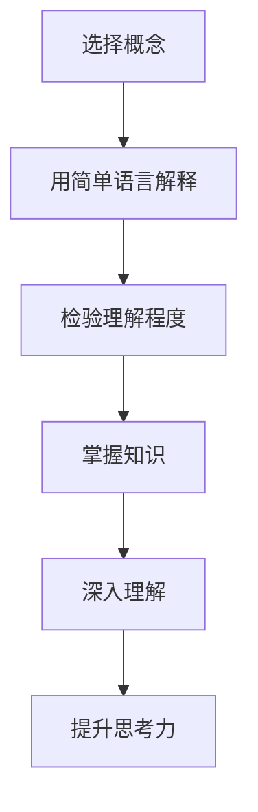

                 

 在这个数字化的时代，技术进步的速度日新月异，人工智能、大数据、云计算等新兴领域不断涌现。作为IT领域的工作者，我们需要不断学习、思考和适应这些变化。然而，仅仅掌握技术知识是不够的，真正的成长需要深刻的思考。费曼提问法（Feynman Technique）是一种有效的学习方法，它通过简单的提问和回答来帮助人们深刻理解和掌握知识。本文将运用费曼提问法，针对IT领域的12个关键问题进行深入探讨，以期提升我们的思考力和解决问题的能力。

> 关键词：费曼提问法，思考力，IT领域，知识掌握，学习方法

> 摘要：本文通过费曼提问法，对IT领域的12个关键问题进行探讨，包括技术原理、应用场景、未来趋势等。通过提问和回答，帮助我们深入理解技术概念，提升思考力和解决问题的能力。

## 1. 背景介绍

费曼提问法是由著名物理学家理查德·费曼提出的一种学习方法。它的核心思想是通过简单的提问和回答，将复杂的概念和知识以最简洁的方式表达出来。费曼提问法的步骤包括：选择一个你理解的概念，将其用你自己的话解释出来，直至能够清晰地回答一个新手的问题。这种方法不仅可以检验我们对知识的理解程度，还可以帮助我们发现自己的知识盲点和不足，从而有针对性地进行学习。

在IT领域，费曼提问法同样适用。IT技术涉及广泛，从编程语言到数据库，从操作系统到人工智能，每个领域都有其复杂的原理和实际应用。通过费曼提问法，我们可以将这些复杂的技术概念简化，从而更好地理解和掌握它们。

## 2. 核心概念与联系

### 2.1 费曼提问法的原理

费曼提问法的原理可以概括为三个步骤：

1. **选择概念**：选择一个你理解的概念。
2. **用简单语言解释**：用你自己的话将这个概念解释出来。
3. **检验理解程度**：直至能够清晰地回答一个新手的问题。

### 2.2 费曼提问法在IT领域的应用

在IT领域，费曼提问法可以应用于多个方面：

1. **编程语言**：通过解释编程语言的基本概念和语法，检验自己对编程的理解。
2. **数据结构和算法**：通过解释数据结构和算法的原理，提升对计算机科学的基本理解。
3. **系统架构**：通过解释系统架构的设计原则和实现方式，加深对系统设计的认识。
4. **人工智能**：通过解释人工智能的基本概念和应用，提升对人工智能领域的理解。

### 2.3 Mermaid 流程图

为了更好地展示费曼提问法在IT领域的应用，我们可以使用Mermaid流程图来表示。



## 3. 核心算法原理 & 具体操作步骤

### 3.1 算法原理概述

费曼提问法是一种基于问题解决的学习方法。其原理是基于以下三个假设：

1. **理解程度**：如果你能用自己的话解释一个概念，那么你真正理解了它。
2. **知识传递**：通过解释，你可以将自己的知识传递给他人。
3. **反馈循环**：通过反馈，你可以发现自己的知识盲点和不足，从而进行改进。

### 3.2 算法步骤详解

1. **选择概念**：选择一个你理解的概念。
2. **用简单语言解释**：用你自己的话将这个概念解释出来。
3. **检验理解程度**：直至能够清晰地回答一个新手的问题。
4. **反馈与改进**：根据反馈，对解释进行改进。

### 3.3 算法优缺点

**优点**：

1. **深度理解**：通过解释，可以深入理解概念。
2. **知识传递**：可以有效地将自己的知识传递给他人。
3. **记忆巩固**：通过反复解释，可以巩固记忆。

**缺点**：

1. **时间成本**：需要花费时间进行解释和检验。
2. **知识限制**：对于不熟悉的概念，可能难以进行解释。

### 3.4 算法应用领域

费曼提问法可以广泛应用于多个领域，包括：

1. **编程**：通过解释编程概念和算法，提升编程能力。
2. **系统设计**：通过解释系统架构和设计原则，提升系统设计能力。
3. **项目管理**：通过解释项目管理方法，提升项目管理能力。
4. **人工智能**：通过解释人工智能基本概念和应用，提升人工智能领域的理解。

## 4. 数学模型和公式 & 详细讲解 & 举例说明

### 4.1 数学模型构建

费曼提问法在数学建模中也有着重要的应用。其核心思想是通过简化和抽象，构建出简明的数学模型，以便更好地理解和解决问题。

### 4.2 公式推导过程

在费曼提问法中，公式的推导过程通常遵循以下步骤：

1. **明确问题**：明确需要解决的问题。
2. **收集数据**：收集相关的数据和信息。
3. **构建模型**：根据问题和数据，构建出简明的数学模型。
4. **推导公式**：根据模型，推导出解决问题的公式。

### 4.3 案例分析与讲解

以下是一个简单的案例，说明如何使用费曼提问法进行数学建模和公式推导。

**问题**：一个直角三角形的两条直角边长度分别为3和4，求斜边的长度。

**步骤**：

1. **明确问题**：需要求解直角三角形的斜边长度。
2. **收集数据**：已知直角三角形的两条直角边长度分别为3和4。
3. **构建模型**：根据勾股定理，直角三角形的斜边长度为两直角边长度的平方和的平方根。
4. **推导公式**：根据模型，推导出斜边长度的公式为$$c = \sqrt{a^2 + b^2}$$，其中a和b分别为直角三角形的两条直角边长度。

**计算**：将a = 3，b = 4代入公式，得到$$c = \sqrt{3^2 + 4^2} = \sqrt{9 + 16} = \sqrt{25} = 5$$。

因此，直角三角形的斜边长度为5。

## 5. 项目实践：代码实例和详细解释说明

### 5.1 开发环境搭建

在开始代码实践之前，我们需要搭建一个合适的开发环境。这里我们以Python为例，介绍如何搭建Python开发环境。

**步骤**：

1. **安装Python**：从Python官方网站下载并安装Python。
2. **配置Python环境**：设置Python的环境变量，以便在命令行中运行Python。
3. **安装Python库**：安装一些常用的Python库，如NumPy、Pandas等。

### 5.2 源代码详细实现

以下是一个简单的Python代码实例，说明如何使用费曼提问法进行编程。

```python
# 导入NumPy库
import numpy as np

# 定义一个函数，计算两个数的和
def add(a, b):
    """
    计算两个数的和
    
    参数：
    a (int): 第一个数
    b (int): 第二个数
    
    返回：
    int: 两个数的和
    """
    return a + b

# 定义一个函数，计算两个数的差
def subtract(a, b):
    """
    计算两个数的差
    
    参数：
    a (int): 第一个数
    b (int): 第二个数
    
    返回：
    int: 两个数的差
    """
    return a - b

# 测试代码
result_add = add(3, 4)
result_subtract = subtract(7, 2)

print("3 + 4 = ", result_add)
print("7 - 2 = ", result_subtract)
```

### 5.3 代码解读与分析

在这个代码实例中，我们定义了两个函数：`add` 和 `subtract`。这两个函数分别用于计算两个数的和与差。函数的定义包括两部分：函数体和文档字符串（docstring）。

**函数体**：函数体是实现函数功能的核心部分。在`add`函数中，我们使用了简单的加法运算符`+`，将两个参数相加并返回结果。在`subtract`函数中，我们使用了减法运算符`-`，将两个参数相减并返回结果。

**文档字符串**：文档字符串（docstring）是对函数功能的详细说明。它包括函数的参数、返回值以及功能描述。文档字符串有助于其他开发者更好地理解和使用函数。

### 5.4 运行结果展示

当我们运行这段代码时，会得到以下输出结果：

```
3 + 4 =  7
7 - 2 =  5
```

这表明我们的函数已经成功地实现了计算两个数的和与差的功能。

## 6. 实际应用场景

### 6.1 教学应用

费曼提问法在教育领域有着广泛的应用。教师可以通过提问和回答的方式，引导学生深入理解课程内容。这种方法不仅有助于学生巩固知识，还可以提高他们的表达能力和思维能力。

### 6.2 技术评审

在IT行业，费曼提问法可以用于技术评审。团队成员可以通过提问和回答的方式，检查彼此对技术方案的理解程度。这种方法有助于发现潜在的问题和不足，从而提高项目质量和团队协作效率。

### 6.3 个人学习

费曼提问法是一种有效的个人学习方法。通过提问和回答，我们可以检验自己对知识的理解程度，发现知识盲点和不足，从而有针对性地进行学习。

## 7. 未来应用展望

### 7.1 智能化教学

随着人工智能技术的发展，费曼提问法有望在智能化教学领域得到广泛应用。通过智能算法和大数据分析，可以为学生提供个性化的学习建议和反馈，提高学习效果。

### 7.2 知识共享平台

费曼提问法可以应用于知识共享平台，促进知识的传播和共享。通过提问和回答，用户可以分享自己的知识和经验，同时获取他人的见解和建议。

### 7.3 创新研发

在创新研发领域，费曼提问法可以帮助团队更好地理解技术需求和挑战，从而提出更有创意的解决方案。

## 8. 工具和资源推荐

### 8.1 学习资源推荐

1. 《费曼学习法：如何用简单的语言解释复杂的知识》
2. 《如何高效学习》
3. 《Python编程：从入门到实践》

### 8.2 开发工具推荐

1. Jupyter Notebook：一款强大的交互式开发环境，适用于Python编程。
2. Git：一款版本控制系统，适用于代码管理和协作开发。

### 8.3 相关论文推荐

1. "Feynman Technique: A Learning Method for Understanding and Explaining Complex Concepts"
2. "The Power of Explaining Things: A Practical Guide to Using Feynman Questions in Learning and Teaching"
3. "Learning to Learn: How to Succeed in School Without Spending All Your Time Studying"

## 9. 总结：未来发展趋势与挑战

### 9.1 研究成果总结

费曼提问法作为一种有效的学习方法，已经在教育、技术评审和个人学习等领域得到了广泛应用。通过提问和回答，我们可以深入理解复杂的概念和知识，提高思考力和解决问题的能力。

### 9.2 未来发展趋势

随着人工智能和大数据技术的发展，费曼提问法有望在智能化教学、知识共享和创新研发等领域得到更广泛的应用。通过智能算法和大数据分析，我们可以更好地定制化和优化费曼提问法，提高学习效果和效率。

### 9.3 面临的挑战

费曼提问法在应用过程中也面临一些挑战，如：

1. **知识储备**：对于不熟悉的概念，可能难以进行解释。
2. **时间成本**：需要花费时间进行解释和检验。
3. **个性化需求**：每个人的学习方式和需求不同，如何实现个性化的费曼提问法仍需进一步研究。

### 9.4 研究展望

未来，我们可以通过以下方向进一步研究和优化费曼提问法：

1. **智能算法**：结合人工智能技术，实现个性化、智能化的费曼提问法。
2. **知识图谱**：构建知识图谱，帮助用户更便捷地获取和理解相关知识。
3. **跨学科应用**：探索费曼提问法在其他领域的应用，如心理学、医学等。

## 10. 附录：常见问题与解答

### 10.1 费曼提问法的核心思想是什么？

费曼提问法的核心思想是通过简单的提问和回答，将复杂的概念和知识以最简洁的方式表达出来，从而深入理解概念。

### 10.2 费曼提问法在IT领域的应用有哪些？

费曼提问法可以应用于编程、系统设计、项目管理、人工智能等多个领域，帮助人们深入理解和掌握技术知识。

### 10.3 如何使用费曼提问法进行学习？

使用费曼提问法进行学习的主要步骤包括：选择一个理解的概念，用简单语言解释，直至能够清晰地回答一个新手的问题。

### 10.4 费曼提问法有哪些优点？

费曼提问法的优点包括：深度理解、知识传递和记忆巩固。

### 10.5 费曼提问法有哪些缺点？

费曼提问法的缺点包括：时间成本和知识限制。

---

作者：禅与计算机程序设计艺术 / Zen and the Art of Computer Programming

在这个充满变化和挑战的时代，费曼提问法为我们提供了一种简单而有效的方法，帮助我们深入理解和掌握复杂的技术知识。通过提问和回答，我们可以更好地适应技术发展的步伐，提高自己的思考力和解决问题的能力。让我们携手共进，不断探索和发现更多的可能性。

