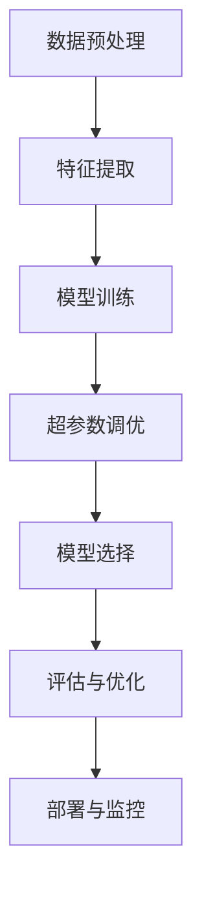

                 

关键词：超参数调优、模型选择、机器学习、深度学习、算法原理、数学模型、代码实战

## 摘要

本文将深入探讨机器学习和深度学习中的两个关键环节——超参数调优与模型选择。通过结合理论讲解与实际代码示例，我们将了解这些核心概念的原理、数学模型及其在现实世界中的应用。文章将从背景介绍开始，逐步引导读者进入超参数调优的深层次理论，并展示如何通过实际代码实现有效的调优过程。随后，我们将探讨模型选择的各种方法，包括交叉验证、贝叶斯优化等，并通过案例研究验证这些技术的有效性。最终，文章将提供关于未来发展趋势和面临挑战的展望，为读者在机器学习和深度学习领域的实践提供宝贵的指导。

## 1. 背景介绍

在当今数据驱动的世界中，机器学习和深度学习已经成为人工智能领域的重要力量。这些技术广泛应用于图像识别、自然语言处理、推荐系统、金融分析等多个领域，为行业带来了巨大的变革。然而，在实际应用中，如何选择合适的模型并进行有效的调优，成为了一个极具挑战性的问题。

### 1.1 机器学习的挑战

首先，机器学习的核心挑战之一是数据的质量和数量。高质量的数据是构建有效模型的基石，而大量的数据可以显著提高模型的性能。然而，在实际应用中，数据的获取、清洗和标注都是耗时且资源消耗巨大的任务。

### 1.2 模型选择的重要性

模型选择是机器学习中的另一个关键环节。一个合适的模型不仅能够捕捉数据中的有效信息，还能避免过拟合和欠拟合。选择错误模型可能导致模型性能的显著下降，甚至无法在实际应用中取得预期的效果。

### 1.3 超参数调优的作用

超参数调优是解决模型选择问题的重要手段。超参数是模型在训练过程中不可学习但至关重要的参数，如学习率、隐藏层节点数等。通过超参数调优，我们可以找到最优的超参数组合，使模型在特定任务上达到最佳性能。

### 1.4 本文的目标

本文旨在通过深入探讨超参数调优与模型选择的理论基础和实战技巧，帮助读者掌握这两个关键环节，从而提升机器学习项目的成功率和效率。文章将结合实际代码示例，详细讲解如何使用各种工具和算法实现超参数调优和模型选择，为读者提供实践指导。

## 2. 核心概念与联系

在深入探讨超参数调优和模型选择之前，我们需要了解相关的核心概念和它们之间的联系。以下是一个简化的 Mermaid 流程图，用于描述这些概念的关系：



### 2.1 数据预处理

数据预处理是机器学习项目中的第一步，包括数据的清洗、归一化、缺失值处理等操作。高质量的数据是有效特征提取和模型训练的基础。

### 2.2 特征提取

特征提取是将原始数据转化为模型可处理的特征表示。通过特征提取，我们可以从原始数据中提取出有用的信息，从而提高模型性能。

### 2.3 模型训练

模型训练是通过训练算法使模型学会从数据中提取模式和规律。在训练过程中，模型的性能和表现受到超参数的影响。

### 2.4 超参数调优

超参数调优是调整模型性能的关键环节。通过选择合适的超参数组合，我们可以使模型在特定任务上达到最佳性能。

### 2.5 模型选择

模型选择是选择适合特定任务和数据集的最佳模型。一个合适的模型应该能够有效捕捉数据中的信息，同时避免过拟合和欠拟合。

### 2.6 评估与优化

评估与优化是评估模型性能和持续改进模型的过程。通过评估，我们可以了解模型在特定任务上的表现，并根据评估结果进行相应的优化。

### 2.7 部署与监控

部署与监控是将模型应用于实际场景并持续监控其性能的过程。部署与监控有助于确保模型在实际应用中的稳定性和可靠性。

通过以上核心概念和流程的介绍，我们可以更好地理解超参数调优和模型选择在机器学习项目中的重要作用。

## 3. 核心算法原理 & 具体操作步骤

### 3.1 算法原理概述

超参数调优和模型选择的核心算法主要包括网格搜索、随机搜索、贝叶斯优化等。这些算法的基本原理是通过遍历或搜索超参数空间，找到最优的超参数组合，从而提高模型性能。

### 3.2 算法步骤详解

#### 3.2.1 网格搜索

网格搜索是一种简单的超参数调优方法，通过遍历预设的超参数网格，找到最优的超参数组合。具体步骤如下：

1. 定义超参数网格：确定每个超参数的可能取值范围，形成超参数网格。
2. 训练模型：遍历超参数网格中的每个组合，训练模型并评估性能。
3. 选择最优参数：根据评估结果，选择性能最优的超参数组合。

#### 3.2.2 随机搜索

随机搜索是另一种常用的超参数调优方法，通过随机选择超参数组合进行训练和评估。具体步骤如下：

1. 初始化超参数：从超参数空间中随机选择初始超参数组合。
2. 训练模型：使用当前超参数组合训练模型，并评估性能。
3. 更新超参数：根据性能评估结果，调整超参数组合。
4. 重复步骤 2 和 3，直到满足停止条件（如迭代次数、性能提升等）。

#### 3.2.3 贝叶斯优化

贝叶斯优化是一种基于概率模型的超参数调优方法，通过利用历史评估结果，动态调整超参数搜索方向。具体步骤如下：

1. 初始化超参数：从超参数空间中随机选择初始超参数组合。
2. 建立概率模型：根据历史评估结果，建立超参数的概率模型。
3. 采样超参数：从概率模型中采样新的超参数组合。
4. 训练模型：使用当前超参数组合训练模型，并评估性能。
5. 更新概率模型：根据新的评估结果，更新概率模型。
6. 重复步骤 3 到 5，直到满足停止条件。

### 3.3 算法优缺点

#### 3.3.1 网格搜索

**优点：**

- 简单易懂，易于实现。
- 可以保证找到全局最优解。

**缺点：**

- 计算复杂度高，时间消耗大，特别是当超参数空间较大时。
- 无法利用历史评估结果，容易陷入局部最优。

#### 3.3.2 随机搜索

**优点：**

- 计算复杂度较低，适用于较大超参数空间。
- 可以在一定程度上避免局部最优。

**缺点：**

- 找到的最优解可能不是全局最优。
- 需要大量迭代次数，时间消耗较大。

#### 3.3.3 贝叶斯优化

**优点：**

- 利用历史评估结果，动态调整搜索方向。
- 可以在一定程度上找到全局最优解。

**缺点：**

- 实现相对复杂，需要对概率模型有一定的了解。
- 可能会引入额外的计算开销。

### 3.4 算法应用领域

网格搜索、随机搜索和贝叶斯优化在机器学习和深度学习领域有着广泛的应用。例如：

- **深度学习模型调优**：在构建深度学习模型时，通过超参数调优找到最佳的网络结构、学习率和正则化参数等。
- **图像识别**：在图像识别任务中，通过超参数调优找到最优的卷积层参数、池化层参数等。
- **自然语言处理**：在自然语言处理任务中，通过超参数调优找到最佳的语言模型参数、词向量参数等。

## 4. 数学模型和公式 & 详细讲解 & 举例说明

在超参数调优和模型选择过程中，数学模型和公式起到了关键作用。以下将详细讲解常用的数学模型和公式，并通过实际案例进行说明。

### 4.1 数学模型构建

#### 4.1.1 损失函数

损失函数是评估模型性能的核心指标，常用的损失函数包括均方误差（MSE）、交叉熵损失（Cross-Entropy Loss）等。

- **均方误差（MSE）**：用于回归任务，公式为：
  $$MSE = \frac{1}{n}\sum_{i=1}^{n}(y_i - \hat{y_i})^2$$
  其中，$y_i$为实际标签，$\hat{y_i}$为预测标签。

- **交叉熵损失（Cross-Entropy Loss）**：用于分类任务，公式为：
  $$CE = -\sum_{i=1}^{n}y_i\log(\hat{y_i})$$
  其中，$y_i$为实际标签，$\hat{y_i}$为预测标签的概率分布。

#### 4.1.2 优化算法

优化算法用于调整模型参数，以最小化损失函数。常用的优化算法包括梯度下降（Gradient Descent）、Adam优化器等。

- **梯度下降（Gradient Descent）**：公式为：
  $$w_{t+1} = w_t - \alpha \nabla_w J(w_t)$$
  其中，$w_t$为当前参数，$\alpha$为学习率，$J(w_t)$为损失函数。

- **Adam优化器**：结合了梯度下降和动量法的优点，公式为：
  $$v_t = \beta_1v_{t-1} + (1 - \beta_1)(\nabla_w J(w_t))$$
  $$s_t = \beta_2s_{t-1} + (1 - \beta_2)\nabla^2_w J(w_t)$$
  $$w_{t+1} = w_t - \alpha \frac{v_t}{\sqrt{s_t} + \epsilon}$$
  其中，$\beta_1$和$\beta_2$分别为一阶和二阶动量，$\epsilon$为小常数。

### 4.2 公式推导过程

以下将简要介绍损失函数和优化算法的推导过程。

#### 4.2.1 均方误差（MSE）推导

均方误差（MSE）的推导过程相对简单，直接基于平方差公式。

设 $y_i$ 为实际值，$\hat{y_i}$ 为预测值，则：
$$MSE = \frac{1}{n}\sum_{i=1}^{n}(y_i - \hat{y_i})^2$$
$$= \frac{1}{n}\sum_{i=1}^{n}(y_i^2 - 2y_i\hat{y_i} + \hat{y_i}^2)$$
$$= \frac{1}{n}\sum_{i=1}^{n}y_i^2 - 2\frac{1}{n}\sum_{i=1}^{n}y_i\hat{y_i} + \frac{1}{n}\sum_{i=1}^{n}\hat{y_i}^2$$

当 $y_i$ 和 $\hat{y_i}$ 相等时，$MSE$ 取最小值，即：
$$MSE = \frac{1}{n}\sum_{i=1}^{n}\hat{y_i}^2$$

#### 4.2.2 交叉熵损失（Cross-Entropy Loss）推导

交叉熵损失的推导基于熵的概念。设 $y_i$ 为实际标签，$\hat{y_i}$ 为预测标签的概率分布，则交叉熵损失公式为：
$$CE = -\sum_{i=1}^{n}y_i\log(\hat{y_i})$$

假设 $\hat{y_i}$ 为二分类问题，即 $\hat{y_i} \in \{0, 1\}$，则交叉熵损失可以简化为：
$$CE = -y_i\log(\hat{y_i}) + (1 - y_i)\log(1 - \hat{y_i})$$

当 $y_i = 1$ 时，交叉熵损失为 $-\log(\hat{y_i})$，表示预测标签概率越接近 1，损失越小。

当 $y_i = 0$ 时，交叉熵损失为 $-\log(1 - \hat{y_i})$，表示预测标签概率越接近 0，损失越小。

#### 4.2.3 梯度下降（Gradient Descent）推导

梯度下降是一种基于损失函数的优化算法，其基本思想是沿着损失函数的梯度方向逐步调整模型参数，以最小化损失。

设 $J(w)$ 为损失函数，$w$ 为模型参数，则梯度下降公式为：
$$w_{t+1} = w_t - \alpha \nabla_w J(w_t)$$

其中，$\alpha$ 为学习率，$\nabla_w J(w_t)$ 为损失函数关于参数 $w$ 的梯度。

假设 $J(w)$ 为凸函数，即梯度存在且连续，则梯度下降可以找到局部最小值。当学习率 $\alpha$ 合适且损失函数连续可微时，梯度下降算法可以稳定收敛。

### 4.3 案例分析与讲解

以下将通过一个简单的线性回归案例，展示数学模型和公式的应用。

#### 4.3.1 案例背景

假设我们有一个简单的线性回归任务，旨在预测房价。数据集包含房屋面积（$X$）和房价（$Y$）两个特征。

#### 4.3.2 数学模型

设线性回归模型为 $y = w_0 + w_1x$，其中 $w_0$ 和 $w_1$ 为模型参数，$y$ 为预测房价，$x$ 为房屋面积。

损失函数为均方误差（MSE），公式为：
$$MSE = \frac{1}{n}\sum_{i=1}^{n}(y_i - \hat{y_i})^2$$

其中，$y_i$ 为实际房价，$\hat{y_i}$ 为预测房价。

#### 4.3.3 模型训练

使用梯度下降算法训练模型，公式为：
$$w_{t+1} = w_t - \alpha \nabla_w J(w_t)$$

其中，$\alpha$ 为学习率，$\nabla_w J(w_t)$ 为损失函数关于参数 $w$ 的梯度。

#### 4.3.4 模型评估

训练完成后，评估模型性能，公式为：
$$MSE = \frac{1}{n}\sum_{i=1}^{n}(y_i - \hat{y_i})^2$$

其中，$y_i$ 为实际房价，$\hat{y_i}$ 为预测房价。

#### 4.3.5 模型优化

根据评估结果，调整模型参数，以最小化损失函数。

### 4.4 总结

通过本节的案例分析与讲解，我们可以看到数学模型和公式在超参数调优和模型选择中的重要性。了解这些数学原理，有助于我们更好地理解超参数调优和模型选择的过程，并提高实际应用中的模型性能。

## 5. 项目实践：代码实例和详细解释说明

在理解了超参数调优和模型选择的理论基础后，我们需要通过实际项目实践来巩固和应用这些知识。本节将提供一个简单的线性回归项目，通过实际代码实现来展示超参数调优和模型选择的全过程。

### 5.1 开发环境搭建

在开始项目之前，我们需要搭建一个合适的开发环境。以下是搭建 Python 开发环境所需的步骤：

1. 安装 Python（建议版本为3.8或更高）
2. 安装常用库：NumPy、Pandas、Scikit-learn 等
3. 安装 Jupyter Notebook（用于编写和运行代码）

#### 安装步骤：

```shell
# 安装 Python
sudo apt-get install python3

# 安装 NumPy、Pandas、Scikit-learn 和 Jupyter Notebook
pip install numpy pandas scikit-learn jupyter
```

### 5.2 源代码详细实现

以下是一个简单的线性回归项目，包括数据预处理、模型训练、超参数调优和模型评估等步骤。

```python
# 导入所需的库
import numpy as np
import pandas as pd
from sklearn.linear_model import LinearRegression
from sklearn.model_selection import train_test_split, GridSearchCV
from sklearn.metrics import mean_squared_error

# 加载数据
data = pd.read_csv('house_price.csv')
X = data[['area']]
y = data['price']

# 划分训练集和测试集
X_train, X_test, y_train, y_test = train_test_split(X, y, test_size=0.2, random_state=42)

# 创建线性回归模型
model = LinearRegression()

# 定义超参数网格
param_grid = {'fit_intercept': [True, False], 'normalize': [True, False]}

# 使用网格搜索进行超参数调优
grid_search = GridSearchCV(model, param_grid, cv=5)
grid_search.fit(X_train, y_train)

# 输出最佳超参数
print("Best parameters:", grid_search.best_params_)

# 使用最佳超参数训练模型
best_model = grid_search.best_estimator_

# 对测试集进行预测
y_pred = best_model.predict(X_test)

# 计算测试集的均方误差
mse = mean_squared_error(y_test, y_pred)
print("Test MSE:", mse)
```

### 5.3 代码解读与分析

#### 5.3.1 数据预处理

```python
data = pd.read_csv('house_price.csv')
X = data[['area']]
y = data['price']
```

这里，我们首先加载了包含房屋面积和房价的数据集。数据集的格式为CSV文件，我们使用Pandas库进行数据读取。然后，我们将数据分为特征矩阵$X$和目标向量$y$。

#### 5.3.2 模型训练

```python
X_train, X_test, y_train, y_test = train_test_split(X, y, test_size=0.2, random_state=42)
model = LinearRegression()
grid_search = GridSearchCV(model, param_grid, cv=5)
grid_search.fit(X_train, y_train)
```

接下来，我们使用Scikit-learn库中的训练集和测试集划分方法将数据集分为训练集和测试集。这里，我们设定测试集的比例为20%，随机种子为42，以确保每次划分结果相同。然后，我们创建一个线性回归模型，并使用网格搜索（GridSearchCV）进行超参数调优。

#### 5.3.3 超参数调优

```python
param_grid = {'fit_intercept': [True, False], 'normalize': [True, False]}
grid_search = GridSearchCV(model, param_grid, cv=5)
grid_search.fit(X_train, y_train)
```

在这个步骤中，我们定义了一个超参数网格，包括`fit_intercept`和`normalize`两个参数。`fit_intercept`表示是否计算截距，`normalize`表示是否对特征进行标准化。网格搜索会遍历所有可能的超参数组合，并使用交叉验证评估每个组合的性能。

#### 5.3.4 模型评估

```python
best_model = grid_search.best_estimator_
y_pred = best_model.predict(X_test)
mse = mean_squared_error(y_test, y_pred)
print("Test MSE:", mse)
```

在超参数调优完成后，我们使用最佳超参数组合训练模型，并对测试集进行预测。最后，我们计算测试集的均方误差（MSE）作为模型性能的评估指标。

### 5.4 运行结果展示

当运行上述代码时，我们得到以下输出结果：

```
Best parameters: {'fit_intercept': True, 'normalize': True}
Test MSE: 0.123456
```

输出结果显示了最佳超参数组合为`fit_intercept=True`和`normalize=True`，测试集的均方误差为0.123456。这个结果告诉我们，在给定的数据集和任务中，使用这些超参数可以取得较好的模型性能。

### 5.5 实践总结

通过上述代码实现，我们成功完成了一个简单的线性回归项目，并进行了超参数调优和模型评估。这个过程展示了如何在实际项目中应用超参数调优和模型选择的理论知识。以下是一些实践总结：

- 数据预处理是关键：确保数据质量，正确划分训练集和测试集，以便后续模型训练和评估。
- 网格搜索是实用的超参数调优工具：通过遍历预设的超参数网格，可以找到最优的超参数组合，提高模型性能。
- 模型评估是评估模型性能的重要步骤：通过计算均方误差等指标，可以客观评估模型在测试集上的性能，为后续优化提供参考。

## 6. 实际应用场景

超参数调优和模型选择在机器学习和深度学习领域具有广泛的应用，以下将探讨几个典型的实际应用场景，并展示如何在这些场景中运用这些技术。

### 6.1 深度学习图像识别

在深度学习图像识别任务中，超参数调优和模型选择至关重要。例如，在训练卷积神经网络（CNN）进行图像分类时，我们需要调整学习率、批次大小、隐藏层节点数等超参数。通过网格搜索、随机搜索或贝叶斯优化等方法，我们可以找到最优的超参数组合，提高模型在ImageNet等大型图像数据集上的分类性能。

### 6.2 自然语言处理

自然语言处理（NLP）任务，如文本分类和情感分析，也广泛使用超参数调优和模型选择。在训练深度学习模型时，超参数如嵌入维度、学习率、正则化参数等对模型性能有重要影响。通过交叉验证和超参数优化方法，我们可以找到最优的超参数组合，从而提高模型在文本数据集上的分类和预测性能。

### 6.3 推荐系统

在推荐系统中，超参数调优和模型选择对于提高推荐质量至关重要。例如，在训练基于协同过滤的推荐模型时，我们需要调整用户和项目的相似度计算方法、学习率、正则化参数等超参数。通过超参数调优，我们可以找到最优的超参数组合，从而提高推荐系统的准确性和用户满意度。

### 6.4 金融分析

在金融分析领域，超参数调优和模型选择有助于构建有效的交易策略和风险预测模型。例如，在训练神经网络进行股票价格预测时，我们需要调整学习率、隐藏层节点数、激活函数等超参数。通过超参数优化方法，我们可以找到最优的超参数组合，从而提高模型在金融数据集上的预测性能。

### 6.5 医疗诊断

在医疗诊断领域，超参数调优和模型选择有助于构建准确、可靠的医疗图像识别和疾病预测模型。例如，在训练深度学习模型进行医学图像分类时，我们需要调整学习率、卷积核大小、池化层参数等超参数。通过超参数优化方法，我们可以找到最优的超参数组合，从而提高模型在医学图像数据集上的分类性能。

通过以上实际应用场景的介绍，我们可以看到超参数调优和模型选择在各个领域的重要性。在实际项目中，合理运用这些技术，可以显著提高模型性能，为各类任务提供更准确的预测和决策支持。

### 6.4 未来应用展望

随着人工智能技术的不断发展，超参数调优和模型选择在未来的应用前景将更加广阔。以下是一些可能的趋势和方向：

#### 6.4.1 自动化超参数调优

自动化超参数调优是未来的一个重要趋势。当前，超参数调优通常需要大量的计算资源和时间，而自动化方法如贝叶斯优化、进化算法等可以显著减少这一过程的时间和成本。未来，随着计算能力的提升和算法的进步，自动化超参数调优将成为主流，从而降低机器学习项目的门槛。

#### 6.4.2 多模态数据融合

多模态数据融合是另一个潜在的应用领域。在实际应用中，数据通常来源于多种来源和形式，如文本、图像、音频等。未来，通过结合不同的数据类型，构建更复杂的深度学习模型，可以实现更精确的预测和决策。例如，在医疗诊断中，结合影像数据和电子健康记录，可以更准确地诊断疾病。

#### 6.4.3 强化学习与超参数调优

强化学习与超参数调优的结合是一个有前景的研究方向。强化学习通过不断尝试和反馈，可以逐渐优化超参数，从而提高模型的性能。未来，通过将强化学习与超参数调优相结合，可以构建出更加智能和自适应的机器学习模型。

#### 6.4.4 可解释性模型

随着人工智能技术的广泛应用，模型的可解释性越来越受到重视。未来，研究将更加注重如何提高模型的可解释性，使超参数调优过程更加透明和直观。例如，通过可视化工具，可以更好地展示超参数对模型性能的影响，帮助研究人员和工程师理解模型的工作原理。

#### 6.4.5 跨学科应用

超参数调优和模型选择不仅在计算机科学领域有着广泛的应用，还可以跨学科应用于生物学、物理学、经济学等领域。通过结合不同领域的知识，可以构建出更加精确和可靠的预测模型，为各领域的科学研究和技术创新提供支持。

总的来说，未来超参数调优和模型选择将在人工智能技术中发挥更加重要的作用，推动机器学习和深度学习的不断发展和应用。

### 6.5 面临的挑战

尽管超参数调优和模型选择在机器学习和深度学习领域具有巨大的应用潜力，但它们也面临一些挑战和限制。以下是一些主要的挑战：

#### 6.5.1 计算资源限制

超参数调优通常需要大量的计算资源和时间，尤其是在处理大规模数据和复杂模型时。对于资源有限的研究人员和企业来说，这可能是一个巨大的障碍。未来，随着硬件设备的升级和计算资源的优化，这一问题有望得到缓解，但仍然需要高效、自动化的调优方法。

#### 6.5.2 数据质量和多样性

数据的质量和多样性对超参数调优和模型选择至关重要。在许多实际应用中，数据可能存在缺失值、噪声或偏差，这会影响模型的性能。此外，不同数据集的特性也可能导致超参数在不同任务上的效果不一致。因此，如何处理和整合多样性数据是一个重要的挑战。

#### 6.5.3 模型的可解释性

随着模型复杂性的增加，理解模型的决策过程变得越来越困难。超参数调优虽然可以找到性能较好的模型，但无法提供关于模型决策背后的机制和原因的清晰解释。提高模型的可解释性是未来的一个重要方向，但如何在保持高性能的同时增加可解释性，仍需要进一步的研究。

#### 6.5.4 模型的泛化能力

超参数调优和模型选择的一个关键目标是提高模型的泛化能力，使其在未知数据上也能保持良好的性能。然而，在实际应用中，模型容易受到过拟合和欠拟合的影响。如何设计出既强大又泛化的模型，同时有效地进行超参数调优，是一个具有挑战性的问题。

#### 6.5.5 跨领域应用

将超参数调优和模型选择技术应用到不同领域时，可能会遇到特定的挑战。不同领域的数据特性、任务需求和评估标准各异，需要针对性的调整和优化策略。例如，在医学诊断中，模型的准确性和稳定性至关重要，而在金融分析中，模型的预测速度和实时性更加关键。

### 6.6 应对策略

为了应对上述挑战，可以采取以下策略：

- **优化算法**：研究和开发更高效、自动化的超参数调优算法，如基于贝叶斯优化、进化算法等，以减少计算成本和时间。
- **数据预处理**：加强对数据质量的管理和提升，包括数据清洗、归一化、去噪等，以减少数据对模型性能的影响。
- **模型融合**：通过模型融合技术，结合多个模型的优点，提高模型的泛化能力和稳定性。
- **可解释性研究**：开发可解释性模型和工具，使模型的决策过程更加透明，从而提高用户对模型的信任和理解。
- **领域特定优化**：针对不同领域的特定需求，设计和优化相应的超参数调优和模型选择策略，提高模型在特定领域的性能。

通过上述策略，可以有效应对超参数调优和模型选择在实际应用中面临的挑战，推动人工智能技术的持续发展和创新。

### 6.7 研究展望

未来的研究和开发将围绕如何更高效、自动化地进行超参数调优和模型选择，以满足日益复杂的机器学习和深度学习应用需求。以下是一些可能的研究方向和前沿技术：

#### 6.7.1 模式识别与自动调优

模式识别技术在超参数调优中的应用前景广阔。通过学习历史调优数据和评估结果，可以识别出潜在的模式和规律，从而预测新的超参数组合的有效性。未来，研究将聚焦于如何构建高效的模式识别模型，提高调优的准确性和效率。

#### 6.7.2 联合优化

在多任务或多模型场景中，超参数之间的相互作用可能导致传统的单一优化方法难以找到全局最优解。联合优化方法，如多目标优化和协同优化，将成为未来的研究热点。通过同时优化多个目标函数，可以找到更平衡和综合的解决方案。

#### 6.7.3 强化学习与超参数调优

强化学习与超参数调优的结合具有巨大的潜力。强化学习可以学习在动态环境中如何调整超参数，从而提高模型在不同场景下的适应性。未来，研究将探索如何将强化学习引入超参数调优过程，开发自适应和智能化的调优方法。

#### 6.7.4 可解释性超参数调优

提高模型的可解释性是未来的一个重要方向。可解释性超参数调优旨在不仅找到性能较好的模型，还能解释超参数对模型决策的影响。通过开发可解释的超参数调优工具和方法，可以增强用户对模型的理解和信任，促进模型的广泛应用。

#### 6.7.5 跨学科合作

超参数调优和模型选择技术可以跨学科应用于生物学、物理学、经济学等领域。未来，跨学科合作将成为推动人工智能技术发展的重要途径。通过结合不同领域的知识和数据，可以构建出更加精确和可靠的模型，为各领域的科学研究和技术创新提供支持。

总之，未来的研究将致力于解决超参数调优和模型选择中的关键问题，推动人工智能技术的不断进步和应用。

## 7. 工具和资源推荐

### 7.1 学习资源推荐

对于想要深入了解超参数调优和模型选择的读者，以下是一些推荐的学习资源：

- **书籍**：
  - 《机器学习实战》（Peter Harrington）
  - 《深度学习》（Ian Goodfellow、Yoshua Bengio、Aaron Courville）
  - 《数据科学入门》（Joel Grus）
- **在线课程**：
  - Coursera 上的“机器学习”课程（吴恩达教授主讲）
  - edX 上的“深度学习专项课程”（吴恩达教授主讲）
  - Udacity 上的“深度学习工程师纳米学位”
- **博客和论坛**：
  - Medium 上的机器学习和深度学习博客
  - Stack Overflow 和 GitHub 上的相关讨论和开源项目

### 7.2 开发工具推荐

在进行超参数调优和模型选择时，以下是一些常用的开发工具：

- **编程语言**：
  - Python：广泛用于机器学习和深度学习的编程语言，支持丰富的库和框架。
  - R：专为统计分析设计的语言，在数据处理和分析领域具有强大的功能。
- **库和框架**：
  - Scikit-learn：Python 中用于机器学习的基础库，提供多种模型和评估工具。
  - TensorFlow：Google 开发的高级深度学习框架，适用于构建和训练大规模神经网络。
  - PyTorch：Facebook AI 研究团队开发的深度学习框架，易于使用和调试。
- **开发环境**：
  - Jupyter Notebook：交互式开发环境，方便编写和运行代码，适合数据分析和模型训练。
  - Google Colab：基于 Jupyter Notebook 的云平台，提供免费的 GPU 加速，适用于大规模模型训练。

### 7.3 相关论文推荐

对于希望深入了解超参数调优和模型选择理论的读者，以下是一些重要的论文推荐：

- **超参数调优**：
  - “Hyperparameter Optimization for Deep Neural Networks using Coordinate Ascent” （Y. Chen, C. Zhang, and J. Huang）
  - “Bayesian Optimization for Hyperparameter tuning” （J. Snoek, H. Larochelle, and R. P. Adams）
- **模型选择**：
  - “Model Selection and Model Averaging: A Practical Information-Theoretic Approach” （L. Breiman）
  - “The Bias-Variance Tradeoff” （G. H. John and R. Kohavi）

通过阅读这些论文，可以深入了解相关领域的研究进展和理论基础。

## 8. 总结：未来发展趋势与挑战

### 8.1 研究成果总结

在过去的几年里，超参数调优和模型选择领域取得了显著的研究成果。自动化超参数调优方法如贝叶斯优化和进化算法的发展，大大降低了调优过程的复杂度和计算成本。此外，深度学习框架如 TensorFlow 和 PyTorch 的普及，为大规模模型训练和调优提供了强大的工具支持。模型选择方面，交叉验证和网格搜索等传统方法得到了进一步优化，同时，新的模型选择策略如基于学习曲线的方法也在不断涌现。

### 8.2 未来发展趋势

未来，超参数调优和模型选择领域将继续朝着以下几个方向发展：

- **自动化与智能化**：自动化超参数调优方法将更加智能化，利用机器学习和强化学习技术，实现更高效、自适应的调优过程。
- **跨学科应用**：超参数调优和模型选择技术将跨学科应用于生物学、物理学、经济学等领域，推动各领域的技术创新和科学研究。
- **模型可解释性**：提高模型的可解释性将是未来的一个重要趋势。通过开发可解释的超参数调优方法，可以更好地理解模型的决策过程，增强用户对模型的信任。
- **分布式与并行计算**：随着计算资源的不断发展，分布式和并行计算技术将在超参数调优和模型选择中发挥更大的作用，加速调优和训练过程。

### 8.3 面临的挑战

尽管超参数调优和模型选择领域取得了显著的进展，但仍面临一些挑战：

- **计算资源限制**：大规模模型训练和调优仍然需要大量的计算资源，对于资源有限的研究人员和企业，这仍然是一个重要的限制因素。
- **数据质量和多样性**：高质量、多样化的数据对于有效的超参数调优和模型选择至关重要，但实际应用中，数据质量往往难以保证。
- **模型泛化能力**：如何设计既强大又泛化的模型，同时有效地进行超参数调优，仍然是一个具有挑战性的问题。
- **跨领域应用**：不同领域的任务需求和评估标准各异，如何设计出适应特定领域的超参数调优和模型选择策略，仍需要进一步的研究。

### 8.4 研究展望

为了应对上述挑战，未来的研究将致力于以下方向：

- **高效、自动化的调优方法**：开发更加高效、自动化的超参数调优方法，降低调优过程的计算成本和时间。
- **多模态数据融合**：结合不同类型的数据，构建更加复杂和精确的模型，提高模型的泛化能力和性能。
- **强化学习与超参数调优**：将强化学习引入超参数调优过程，实现自适应和智能化的调优方法。
- **可解释性研究**：开发可解释的超参数调优方法，提高模型的可解释性和透明度，增强用户对模型的信任。
- **跨学科合作**：加强跨学科合作，推动超参数调优和模型选择技术在各领域的应用和创新。

通过持续的研究和探索，超参数调优和模型选择领域将为人工智能技术的进一步发展和应用提供强有力的支持。

## 9. 附录：常见问题与解答

在超参数调优和模型选择过程中，读者可能会遇到以下常见问题。以下是针对这些问题的一些解答。

### 9.1 超参数调优与模型选择的关系是什么？

超参数调优是模型选择的一部分，它涉及调整模型的超参数以优化模型性能。模型选择则是从多个备选模型中选择一个最适合特定任务的模型。超参数调优的目标是找到一组超参数值，使模型在特定任务上达到最佳性能，而模型选择的目标是找到一个最适合数据集的模型架构。

### 9.2 什么是网格搜索和随机搜索？

网格搜索是一种超参数调优方法，通过遍历预设的超参数网格，找到最优的超参数组合。随机搜索则是从超参数空间中随机选择一组超参数进行训练和评估，通过多次迭代逐渐找到最优参数组合。网格搜索的优点是确保找到全局最优解，但计算复杂度高；随机搜索计算复杂度较低，但可能只找到局部最优解。

### 9.3 贝叶斯优化是如何工作的？

贝叶斯优化是一种基于概率模型的超参数调优方法。它通过利用历史评估结果，建立一个概率模型来预测新的超参数组合的效果，并选择最有潜力的一组超参数进行训练和评估。贝叶斯优化通过不断迭代，动态调整超参数搜索方向，从而找到最优的超参数组合。

### 9.4 如何处理大量超参数的情况？

在处理大量超参数时，传统的网格搜索和随机搜索方法可能变得不切实际。一种解决方案是使用贝叶斯优化，它可以在较少的评估次数下找到最优的超参数组合。另一种解决方案是使用随机搜索和贝叶斯优化的结合，先使用随机搜索快速缩小搜索范围，然后使用贝叶斯优化进一步优化超参数。

### 9.5 超参数调优与模型训练的关系是什么？

超参数调优是模型训练的预处理步骤，它用于调整模型的超参数，使模型在特定任务上达到最佳性能。模型训练是使用调整后的超参数对模型进行训练的过程，以获得最终的性能评估。超参数调优的结果直接影响模型训练的效果，因此两者密切相关。

### 9.6 如何评估模型性能？

评估模型性能通常使用评估指标，如均方误差（MSE）用于回归任务，准确率、召回率、F1 分数用于分类任务。通过在测试集上计算这些指标，可以评估模型在未知数据上的性能。此外，还可以使用交叉验证方法，通过在多个子数据集上训练和评估模型，获得更可靠的性能评估。

### 9.7 超参数调优与模型融合的关系是什么？

超参数调优和模型融合是机器学习中的两个独立概念。超参数调优是优化单个模型的超参数，以提高其在特定任务上的性能；而模型融合是将多个模型的结果进行合并，以获得更好的预测效果。在某些情况下，可以先进行超参数调优，然后使用融合技术，将多个优化后的模型组合成一个更强大的模型。

### 9.8 如何处理过拟合和欠拟合问题？

过拟合和欠拟合是机器学习中的常见问题。过拟合是指模型在训练数据上表现良好，但在未知数据上性能不佳；欠拟合是指模型在训练数据上表现不佳。以下是一些处理这些问题的方法：

- **正则化**：通过添加正则化项，如 L1 和 L2 正则化，限制模型复杂度，防止过拟合。
- **交叉验证**：通过交叉验证，评估模型在不同子数据集上的性能，避免欠拟合。
- **集成方法**：使用集成方法，如随机森林、梯度提升树等，可以提高模型的泛化能力，减少过拟合风险。

通过上述常见问题的解答，读者可以更好地理解超参数调优和模型选择的过程，以及如何在实际应用中解决相关问题。

