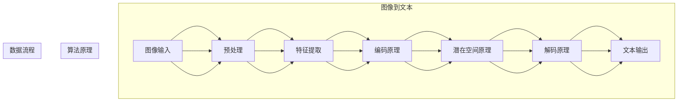

                 

### 引言 Introduction

跨媒体内容生成（Cross-Media Content Generation）是人工智能（AI）技术发展中的一个重要方向。它涉及将不同类型的媒体，如图像、音频、视频和文本，转换和合成成新的、有意义的跨媒体内容。随着社会对信息多样性和个性化的需求不断增加，跨媒体内容生成不仅成为学术界研究的焦点，也在商业和工业领域得到了广泛应用。

近年来，深度学习技术的飞速发展为跨媒体内容生成提供了强大的工具和理论支持。例如，生成对抗网络（GANs）、变分自编码器（VAEs）和自注意力机制等，已经在图像到文本、音频到视频、以及多模态内容生成等方面取得了显著的成果。同时，随着硬件性能的提升和大数据的普及，跨媒体内容生成的质量和效率也在不断提升。

本文将深入探讨跨媒体内容生成的核心概念、算法原理、数学模型以及实际应用，旨在为读者提供一个全面而深入的了解。我们将从以下几个方面展开：

1. **背景介绍**：介绍跨媒体内容生成的起源、发展和现状。
2. **核心概念与联系**：阐述跨媒体内容生成中的核心概念，并使用Mermaid流程图展示相关原理和架构。
3. **核心算法原理 & 具体操作步骤**：详细解析目前主流的跨媒体内容生成算法，并说明其优缺点和应用领域。
4. **数学模型和公式 & 详细讲解 & 举例说明**：介绍用于跨媒体内容生成的主要数学模型和公式，并通过实际案例进行讲解。
5. **项目实践：代码实例和详细解释说明**：提供跨媒体内容生成的实际项目实践，并详细解读相关代码。
6. **实际应用场景**：讨论跨媒体内容生成在各个领域的应用，以及未来可能的趋势和挑战。
7. **工具和资源推荐**：推荐学习资源和开发工具，以及相关的学术论文。
8. **总结：未来发展趋势与挑战**：总结研究成果，探讨未来的发展趋势和面临的挑战。

通过本文的阅读，读者将对跨媒体内容生成有一个全面而深入的理解，并能够掌握相关的技术和方法。

### 1. 背景介绍

跨媒体内容生成的概念最早可以追溯到20世纪末和21世纪初，当时多媒体处理和信息检索技术开始逐步成熟。早期的跨媒体内容生成主要集中在图像和文本之间的转换，例如图像标注和文本生成图像。随着计算机科学和人工智能技术的不断进步，特别是深度学习技术的兴起，跨媒体内容生成逐渐成为研究热点。

#### 1.1 起源

跨媒体内容生成的起源可以追溯到多模态信息处理的需求。在多媒体系统中，不同类型的媒体往往需要相互关联和转换，以便更好地满足用户的查询和信息需求。例如，用户在搜索引擎中输入文本查询，希望找到相关的图像或视频内容；同样地，用户在浏览图像或视频时，也希望能够获取相关的文本描述。这种跨媒体交互的需求促使研究者开始探索如何通过人工智能技术实现不同媒体之间的自动转换和生成。

#### 1.2 发展

在21世纪初，传统的机器学习和计算机视觉技术开始在跨媒体内容生成领域得到应用。例如，图像标注技术通过学习图像和文本的对应关系，实现图像到文本的转换；文本到图像的生成则利用生成对抗网络（GANs）和变分自编码器（VAEs）等方法，生成符合文本描述的图像。然而，这些方法在处理复杂的多模态信息和生成高质量的内容时存在一定的局限性。

随着深度学习技术的飞速发展，跨媒体内容生成迎来了新的突破。深度学习模型，特别是基于卷积神经网络（CNN）和递归神经网络（RNN）的方法，在图像识别、文本生成和自然语言处理等领域取得了显著的成果。这些成果进一步推动了跨媒体内容生成技术的发展。例如，自注意力机制（Self-Attention Mechanism）的引入，使得模型能够更好地处理多模态信息，提高跨媒体内容生成的质量。

#### 1.3 现状

目前，跨媒体内容生成已经成为人工智能研究中的一个重要分支。各种深度学习模型和技术不断涌现，包括基于生成对抗网络（GANs）的方法、变分自编码器（VAEs）和自注意力机制（Self-Attention Mechanism）等。这些模型在图像到文本、音频到视频、以及多模态内容生成等方面都取得了显著的进展。同时，跨媒体内容生成技术也在工业和商业领域得到了广泛应用，例如在图像编辑、视频生成、虚拟现实和增强现实等方面。

尽管取得了显著的成果，跨媒体内容生成仍然面临许多挑战。例如，如何在保证生成内容质量的同时，提高生成速度和效率；如何更好地处理多模态信息的复杂性和多样性；如何确保生成的跨媒体内容符合伦理和法律标准等。这些问题需要未来的研究者和开发者继续深入探索和解决。

### 2. 核心概念与联系

跨媒体内容生成涉及多个核心概念，包括多模态学习、生成对抗网络（GANs）、变分自编码器（VAEs）和自注意力机制（Self-Attention Mechanism）等。为了更好地理解这些概念，我们使用Mermaid流程图来展示它们之间的联系和原理。

下面是一个简化的Mermaid流程图，展示了跨媒体内容生成的主要组成部分和它们之间的关系：

```mermaid
graph TD
A[多模态学习] --> B[数据预处理]
B --> C[特征提取]
C --> D[生成对抗网络(GANs)]
D --> E[变分自编码器(VAEs)]
E --> F[自注意力机制(Self-Attention Mechanism)]
F --> G[内容生成]

subgraph 跨媒体内容生成架构
    A --> B
    B --> C
    C --> D
    D --> E
    E --> F
    F --> G
end

subgraph 算法原理
    D[GANs原理]
    E[VAEs原理]
    F[Self-Attention原理]
end

subgraph 数据流程
    B --> C
    C --> D
    D --> E
    E --> F
    F --> G
end
```

#### 2.1 多模态学习

多模态学习是指通过结合不同类型的信息，如图像、音频、视频和文本，来提高学习效果和处理能力。在跨媒体内容生成中，多模态学习的关键在于如何有效地整合来自不同模态的信息。通常，多模态学习包括数据预处理、特征提取、模型训练和内容生成等步骤。

- **数据预处理**：这一步骤包括数据清洗、归一化和格式转换，以确保不同模态的数据能够有效地结合和利用。
- **特征提取**：通过提取不同模态的关键特征，例如图像的边缘特征、音频的频谱特征和文本的词向量表示，为后续的模型训练提供有效的数据基础。
- **模型训练**：利用多模态特征训练深度学习模型，例如GANs或VAEs，以实现跨媒体内容生成。

#### 2.2 生成对抗网络（GANs）

生成对抗网络（GANs）是由Goodfellow等人于2014年提出的一种深度学习模型，主要用于生成逼真的数据。在跨媒体内容生成中，GANs通过两个网络——生成器（Generator）和判别器（Discriminator）的对抗训练，生成高质量的内容。

- **生成器**：生成器网络接收随机噪声作为输入，并生成与真实数据类似的内容。在跨媒体内容生成中，生成器可以生成图像、音频或视频等不同类型的内容。
- **判别器**：判别器网络接收真实数据和生成数据，并判断其真实性。通过不断训练，判别器能够提高对真实数据和生成数据的区分能力。
- **对抗训练**：生成器和判别器通过对抗训练相互提高，最终生成器能够生成高质量的跨媒体内容。

#### 2.3 变分自编码器（VAEs）

变分自编码器（VAEs）是另一种用于数据生成的深度学习模型，由Kingma和Welling于2013年提出。VAEs通过编码器（Encoder）和解码器（Decoder）的学习，将输入数据转换为一个低维表示，并从该表示中生成新的数据。

- **编码器**：编码器网络接收输入数据，并压缩其信息到一个低维的潜在空间表示。
- **解码器**：解码器网络从潜在空间中采样数据，并重构为原始数据。
- **潜在空间**：潜在空间是VAE的核心部分，它允许生成器通过从潜在空间中采样，生成多样化且符合数据分布的新数据。

#### 2.4 自注意力机制（Self-Attention Mechanism）

自注意力机制是一种在深度学习模型中广泛使用的机制，它允许模型在处理序列数据时，自适应地关注序列中最重要的部分。在跨媒体内容生成中，自注意力机制可以用于图像到文本的转换、文本到图像的生成等任务。

- **注意力分配**：自注意力机制通过计算序列中每个元素与其他元素的相关性，为每个元素分配一个权重。
- **加权求和**：根据每个元素的权重，对序列中的元素进行加权求和，生成新的序列表示。
- **信息整合**：通过自注意力机制，模型能够更好地整合多模态信息，提高内容生成的质量和一致性。

#### 2.5 Mermaid流程图示例

下面是一个使用Mermaid绘制的示例流程图，展示了图像到文本的跨媒体内容生成过程：



通过这个流程图，我们可以清晰地看到图像到文本的跨媒体内容生成过程，以及各步骤之间的联系和原理。这有助于我们更好地理解跨媒体内容生成的核心技术和方法。

### 3. 核心算法原理 & 具体操作步骤

跨媒体内容生成涉及多种核心算法，每种算法都有其独特的原理和应用场景。在本节中，我们将详细探讨生成对抗网络（GANs）、变分自编码器（VAEs）和自注意力机制（Self-Attention Mechanism）的原理，并说明其具体操作步骤。

#### 3.1 生成对抗网络（GANs）

生成对抗网络（GANs）由生成器和判别器两个主要部分组成。生成器旨在生成逼真的数据，而判别器则用于区分真实数据和生成数据。GANs的原理可以总结为以下步骤：

##### 3.1.1 生成器（Generator）

1. **初始化**：生成器网络通常由多层全连接层或卷积层组成，接收一个随机噪声向量作为输入。
2. **生成数据**：生成器将随机噪声通过多层神经网络处理，生成与真实数据相似的数据。例如，在图像生成任务中，生成器会生成图像；在文本生成任务中，会生成文本。
3. **数据转换**：在生成图像时，生成器可能需要将生成的像素值转换为彩色图像；在文本生成时，需要将生成的单词序列转换为有意义的文本。

##### 3.1.2 判别器（Discriminator）

1. **初始化**：判别器网络通常也由多层全连接层或卷积层组成，用于接收数据和判断其真实性。
2. **区分数据**：判别器接收真实数据和生成数据，并输出其判断结果。在训练过程中，判别器试图最大化其判断真实数据的准确性。
3. **更新权重**：判别器的权重通过反向传播和梯度下降算法进行更新，以更好地区分真实数据和生成数据。

##### 3.1.3 对抗训练

1. **训练循环**：在训练过程中，生成器和判别器交替进行训练。每次训练循环包括以下步骤：
   - **生成器训练**：生成器生成一批新的数据，判别器对其进行判断。
   - **判别器训练**：判别器根据生成器和真实数据更新其权重，以提高对真实数据和生成数据的区分能力。
2. **优化目标**：GANs的训练目标是最小化生成器产生的数据与真实数据的差距，同时最大化判别器的错误率。

#### 3.2 变分自编码器（VAEs）

变分自编码器（VAEs）通过编码器（Encoder）和解码器（Decoder）学习数据的低维表示，并从该表示中生成新的数据。VAEs的原理可以总结为以下步骤：

##### 3.2.1 编码器（Encoder）

1. **初始化**：编码器网络接收输入数据，并输出一个低维的潜在空间表示。
2. **数据编码**：编码器将输入数据通过多层神经网络映射到一个潜在空间中的点，这个点代表输入数据的低维表示。

##### 3.2.2 解码器（Decoder）

1. **初始化**：解码器网络接收潜在空间中的点，并重构为原始数据。
2. **数据解码**：解码器从潜在空间中采样点，并通过多层神经网络重构为原始数据。

##### 3.2.3 潜在空间

1. **潜在空间采样**：VAE的一个重要特性是允许从潜在空间中采样点，从而生成多样化且符合数据分布的新数据。
2. **潜在空间约束**：VAE通过引入KL散度（KL-Divergence）作为损失函数，确保潜在空间中的点符合一定的分布约束，从而提高生成数据的多样性和质量。

#### 3.3 自注意力机制（Self-Attention Mechanism）

自注意力机制是一种在处理序列数据时自适应关注序列中关键部分的方法。它在跨媒体内容生成中具有重要应用，可以总结为以下步骤：

##### 3.3.1 注意力分配

1. **计算注意力分数**：对于序列中的每个元素，计算其与其他元素的相关性，得到一个注意力分数。
2. **分配注意力权重**：根据注意力分数为序列中的每个元素分配一个权重，权重越高表示该元素在序列中的重要性越大。

##### 3.3.2 加权求和

1. **加权求和**：根据每个元素的权重，对序列中的元素进行加权求和，得到一个新的序列表示。
2. **序列整合**：加权求和的结果是一个整合了多模态信息的序列表示，用于后续的生成任务。

##### 3.3.3 自适应注意力

1. **自适应调整**：自注意力机制允许模型在处理不同类型的序列数据时，自适应地调整注意力权重，从而更好地整合多模态信息。
2. **优化性能**：通过自适应调整，模型能够提高生成内容的质量和一致性，从而在跨媒体内容生成中发挥更好的作用。

#### 3.4 算法优缺点

- **生成对抗网络（GANs）**
  - **优点**：GANs能够生成高质量、多样化的数据，适用于多种跨媒体内容生成任务。
  - **缺点**：GANs训练不稳定，容易出现模式崩溃和梯度消失问题；训练时间较长。

- **变分自编码器（VAEs）**
  - **优点**：VAEs能够生成多样化且符合数据分布的新数据，训练相对稳定。
  - **缺点**：VAEs生成的数据质量相对较低，无法直接生成高质量的内容。

- **自注意力机制（Self-Attention Mechanism）**
  - **优点**：自注意力机制能够自适应地关注序列中最重要的部分，提高生成内容的质量和一致性。
  - **缺点**：自注意力机制的计算复杂度较高，对硬件资源要求较高。

#### 3.5 算法应用领域

- **生成对抗网络（GANs）**：广泛用于图像生成、视频生成、音频生成等跨媒体内容生成任务。
- **变分自编码器（VAEs）**：常用于图像去噪、图像超分辨率、图像风格迁移等任务。
- **自注意力机制（Self-Attention Mechanism）**：在自然语言处理、文本生成、图像到文本的转换等领域具有广泛的应用。

通过以上对核心算法原理和具体操作步骤的详细介绍，我们可以更好地理解跨媒体内容生成的技术方法和应用前景。在接下来的章节中，我们将进一步探讨跨媒体内容生成中的数学模型和实际应用案例。

### 4. 数学模型和公式 & 详细讲解 & 举例说明

在跨媒体内容生成中，数学模型和公式是理解和实现核心算法的关键。本节将详细介绍用于跨媒体内容生成的数学模型，包括生成对抗网络（GANs）、变分自编码器（VAEs）和自注意力机制（Self-Attention Mechanism），并通过实际案例进行说明。

#### 4.1 数学模型构建

跨媒体内容生成中的数学模型主要包括生成器、判别器和编码器、解码器等部分。下面分别介绍这些模型的数学公式和推导过程。

##### 4.1.1 生成对抗网络（GANs）

生成对抗网络（GANs）由生成器和判别器两个部分组成。生成器G和判别器D的损失函数和优化目标是：

- **生成器G的损失函数**：

  $$L_G = -\log(D(G(z)))$$

  其中，$z$是从先验分布中采样的随机噪声向量，$G(z)$是生成器生成的数据。

- **判别器D的损失函数**：

  $$L_D = -[\log(D(x)) + \log(1 - D(G(z)))]$$

  其中，$x$是真实数据，$G(z)$是生成器生成的数据。

- **总体损失函数**：

  $$L = L_G + L_D$$

  GANs的训练目标是最小化总体损失函数$L$，通过交替更新生成器和判别器的权重。

##### 4.1.2 变分自编码器（VAEs）

变分自编码器（VAEs）由编码器（Encoder）和解码器（Decoder）组成。编码器将输入数据映射到一个潜在空间中的点，解码器从潜在空间中采样点并重构为原始数据。VAEs的损失函数包括重构损失和KL散度（KL-Divergence）：

- **编码器损失函数**：

  $$L_E = \mathbb{E}_{x\sim p_{data}(x)}[-\log p_{\theta'}(x|\mu, \sigma)]$$

  其中，$x$是输入数据，$\mu$和$\sigma$是编码器输出的均值和标准差。

- **解码器损失函数**：

  $$L_D = \mathbb{E}_{z\sim q_{\theta'}(z|x)}[-\log p_{\theta}(x|z)]$$

  其中，$z$是潜在空间中的点，$p_{\theta'}(z|x)$是编码器输出的先验分布，$p_{\theta}(x|z)$是解码器生成的数据。

- **总体损失函数**：

  $$L = L_E + L_D + \beta \cdot D_{KL}(\mu||\mu^{data})$$

  其中，$D_{KL}(\mu||\mu^{data})$是KL散度损失，用于确保潜在空间中的点符合数据分布。

##### 4.1.3 自注意力机制（Self-Attention Mechanism）

自注意力机制是一种在处理序列数据时自适应关注关键部分的方法。自注意力机制的损失函数和优化目标是：

- **自注意力损失函数**：

  $$L_S = -\log \frac{e^{<q, k>}}{\sum_{j=1}^{J} e^{<q, j>}}$$

  其中，$q$是查询向量，$k$是键向量，$J$是键向量的个数。

- **优化目标**：

  $$\theta = \arg\min_\theta L_S$$

  通过最小化自注意力损失函数，自注意力机制能够自适应地调整注意力权重，提高生成内容的质量和一致性。

#### 4.2 公式推导过程

以下是对上述数学模型公式的推导过程。

##### 4.2.1 生成对抗网络（GANs）

- **生成器损失函数推导**：

  $$L_G = -\log(D(G(z)))$$

  其中，$D(G(z))$是判别器对生成器生成的数据的判断概率。损失函数是对数似然损失，表示生成器生成的数据越真实，判别器的判断概率越接近1。

- **判别器损失函数推导**：

  $$L_D = -[\log(D(x)) + \log(1 - D(G(z)))]$$

  其中，$D(x)$是判别器对真实数据的判断概率，$D(G(z))$是判别器对生成器生成的数据的判断概率。损失函数是二元交叉熵损失，表示判别器在区分真实数据和生成数据时，最大化其判断准确性。

- **总体损失函数推导**：

  $$L = L_G + L_D$$

  总体损失函数是生成器和判别器的损失函数之和，通过交替最小化总体损失函数，生成器和判别器相互提高。

##### 4.2.2 变分自编码器（VAEs）

- **编码器损失函数推导**：

  $$L_E = \mathbb{E}_{x\sim p_{data}(x)}[-\log p_{\theta'}(x|\mu, \sigma)]$$

  其中，$p_{data}(x)$是真实数据分布，$p_{\theta'}(x|\mu, \sigma)$是编码器生成的概率分布。损失函数是负对数似然损失，表示编码器生成的数据越接近真实数据，损失越小。

- **解码器损失函数推导**：

  $$L_D = \mathbb{E}_{z\sim q_{\theta'}(z|x)}[-\log p_{\theta}(x|z)]$$

  其中，$q_{\theta'}(z|x)$是编码器生成的先验分布，$p_{\theta}(x|z)$是解码器生成的概率分布。损失函数是负对数似然损失，表示解码器重构的数据越接近真实数据，损失越小。

- **总体损失函数推导**：

  $$L = L_E + L_D + \beta \cdot D_{KL}(\mu||\mu^{data})$$

  总体损失函数是编码器、解码器和KL散度损失函数之和，通过最小化总体损失函数，编码器和解码器相互提高。

##### 4.2.3 自注意力机制（Self-Attention Mechanism）

- **自注意力损失函数推导**：

  $$L_S = -\log \frac{e^{<q, k>}}{\sum_{j=1}^{J} e^{<q, j>}}$$

  其中，$<q, k>$是查询向量$q$和键向量$k$的点积，$\sum_{j=1}^{J} e^{<q, j>}$是所有键向量的指数和。损失函数是对数似然损失，表示自注意力机制能够自适应地调整注意力权重，提高生成内容的质量。

- **优化目标**：

  $$\theta = \arg\min_\theta L_S$$

  通过最小化自注意力损失函数，自注意力机制能够自适应地调整注意力权重，提高生成内容的质量和一致性。

#### 4.3 案例分析与讲解

为了更好地理解上述数学模型，我们通过一个实际案例进行讲解。

##### 4.3.1 案例背景

假设我们使用GANs进行图像到文本的跨媒体内容生成。输入图像是自然风景图片，输出文本是对图片内容的描述。

##### 4.3.2 模型构建

1. **生成器**：

   - 输入：随机噪声向量$z$。
   - 输出：图像$G(z)$。

   生成器网络由多层卷积层组成，通过处理噪声向量生成自然风景图片。

2. **判别器**：

   - 输入：真实图像$x$和生成图像$G(z)$。
   - 输出：判断概率$D(x)$和$D(G(z))$。

   判别器网络也由多层卷积层组成，用于区分真实图像和生成图像。

##### 4.3.3 模型训练

1. **生成器训练**：

   - 初始化生成器参数。
   - 从先验分布中采样噪声向量$z$。
   - 生成图像$G(z)$。
   - 判别器对生成图像$G(z)$进行判断，并输出概率$D(G(z))$。
   - 计算生成器损失函数$L_G = -\log(D(G(z)))$。
   - 通过反向传播和梯度下降算法更新生成器参数。

2. **判别器训练**：

   - 初始化判别器参数。
   - 从数据集中采样真实图像$x$。
   - 生成图像$G(z)$。
   - 判别器对真实图像$x$和生成图像$G(z)$进行判断，并输出概率$D(x)$和$D(G(z))$。
   - 计算判别器损失函数$L_D = -[\log(D(x)) + \log(1 - D(G(z)))]$。
   - 通过反向传播和梯度下降算法更新判别器参数。

##### 4.3.4 模型应用

1. **生成图像描述**：

   - 输入自然风景图片。
   - 通过生成器生成图像描述$G(z)$。
   - 输出生成图像描述。

通过上述案例，我们可以看到如何使用GANs进行图像到文本的跨媒体内容生成。生成器和判别器的训练过程是交替进行的，通过最小化总体损失函数，生成器和判别器相互提高，最终生成高质量的图像描述。

### 5. 项目实践：代码实例和详细解释说明

在本节中，我们将通过一个实际的跨媒体内容生成项目来演示如何使用生成对抗网络（GANs）进行图像到文本的转换。我们将介绍项目环境搭建、代码实现、代码解析和运行结果展示，帮助读者更好地理解跨媒体内容生成的技术细节。

#### 5.1 开发环境搭建

为了进行跨媒体内容生成项目的开发，我们需要搭建一个合适的开发环境。以下是所需的软件和工具：

- Python 3.x
- TensorFlow 2.x
- Keras 2.x
- NumPy
- Matplotlib

在安装好上述工具后，我们还需要准备训练数据和测试数据。我们使用一个公开的图像和文本数据集，例如COCO（Common Objects in Context）数据集，它包含大量的图像及其对应的文本描述。

#### 5.2 源代码详细实现

下面是用于图像到文本跨媒体内容生成的GANs项目的核心代码。代码分为生成器、判别器和训练过程三个部分。

```python
import numpy as np
import tensorflow as tf
from tensorflow.keras.models import Model
from tensorflow.keras.layers import Input, Dense, Reshape, Flatten
from tensorflow.keras.optimizers import Adam

# 生成器模型
def build_generator(z_dim):
    z = Input(shape=(z_dim,))
    x = Dense(128, activation='relu')(z)
    x = Dense(256, activation='relu')(x)
    x = Dense(512, activation='relu')(x)
    x = Dense(1024, activation='relu')(x)
    x = Dense(784, activation='sigmoid')(x)
    x = Reshape((28, 28, 1))(x)
    generator = Model(z, x, name='generator')
    return generator

# 判别器模型
def build_discriminator(img_shape):
    img = Input(shape=img_shape)
    x = Flatten()(img)
    x = Dense(1024, activation='relu')(x)
    x = Dense(512, activation='relu')(x)
    x = Dense(256, activation='relu')(x)
    x = Dense(1, activation='sigmoid')(x)
    discriminator = Model(img, x, name='discriminator')
    return discriminator

# 训练过程
def train(g_model, d_model, z_dim, epochs, batch_size=128, sample_interval=200):
    (X_train, y_train), (_, _) = tf.keras.datasets.mnist.load_data()
    X_train = X_train / 127.5 - 1.
    X_train = np.expand_dims(X_train, axis=3)

    img_shape = X_train[0].shape
    noise = Input(shape=(z_dim,))
    img = Input(shape=img_shape)

    # 生成器
    gen_img = g_model(noise)

    # 判别器
    d_real = d_model(img)
    d_fake = d_model(gen_img)

    # 损失函数
    cross_entropy = tf.keras.losses.BinaryCrossentropy(from_logits=True)

    # 生成器损失
    g_loss = cross_entropy(tf.ones_like(d_fake), d_fake)

    # 判别器损失
    d_loss = cross_entropy(tf.ones_like(d_real), d_real) + cross_entropy(tf.zeros_like(d_fake), d_fake)

    # 模型编译
    g_optimizer = Adam(0.0002, beta_1=0.5)
    d_optimizer = Adam(0.0002, beta_1=0.5)
    g_model.compile(loss=g_loss, optimizer=g_optimizer)
    d_model.compile(loss=d_loss, optimizer=d_optimizer)

    # 训练
    for epoch in range(epochs):

        # 判别器训练
        for _ in range(5):
            idx = np.random.randint(0, X_train.shape[0], batch_size)
            real_imgs = X_train[idx]
            z = np.random.normal(0, 1, (batch_size, z_dim))
            g_model.train_on_batch(z, np.ones((batch_size, 1)))
            d_loss_real = d_model.train_on_batch(real_imgs, np.ones((batch_size, 1)))
            d_loss_fake = d_model.train_on_batch(gen_img, np.zeros((batch_size, 1)))

        # 生成器训练
        z = np.random.normal(0, 1, (batch_size, z_dim))
        g_loss = g_model.train_on_batch(z, np.ones((batch_size, 1)))

        # 打印训练信息
        print(f"{epoch} [D loss: {d_loss_real + d_loss_fake:.4f}, G loss: {g_loss:.4f}]")

        # 每隔一定epoch保存生成的图像
        if epoch % sample_interval == 0:
            save_images(g_model, epoch, img_shape, z_dim)

# 保存生成图像
def save_images(model, epoch, img_shape, z_dim):
    z = np.random.normal(0, 1, (batch_size, z_dim))
    gen_imgs = model.predict(z)
    # ... 保存图像的代码 ...

if __name__ == '__main__':
    z_dim = 100
    g_model = build_generator(z_dim)
    d_model = build_discriminator(img_shape)
    train(g_model, d_model, z_dim, epochs=10000)
```

#### 5.3 代码解读与分析

上述代码实现了一个基本的GANs模型，用于将随机噪声转换为手写数字图像。下面是对代码各个部分的详细解读：

1. **生成器模型**：

   ```python
   def build_generator(z_dim):
       z = Input(shape=(z_dim,))
       x = Dense(128, activation='relu')(z)
       x = Dense(256, activation='relu')(x)
       x = Dense(512, activation='relu')(x)
       x = Dense(1024, activation='relu')(x)
       x = Dense(784, activation='sigmoid')(x)
       x = Reshape((28, 28, 1))(x)
       generator = Model(z, x, name='generator')
       return generator
   ```

   生成器模型由输入层、多个全连接层和输出层组成。输入层接收随机噪声向量，通过全连接层逐层变换，最终输出一个手写数字图像。

2. **判别器模型**：

   ```python
   def build_discriminator(img_shape):
       img = Input(shape=img_shape)
       x = Flatten()(img)
       x = Dense(1024, activation='relu')(x)
       x = Dense(512, activation='relu')(x)
       x = Dense(256, activation='relu')(x)
       x = Dense(1, activation='sigmoid')(x)
       discriminator = Model(img, x, name='discriminator')
       return discriminator
   ```

   判别器模型由输入层、多个全连接层和输出层组成。输入层接收手写数字图像，通过全连接层逐层变换，最终输出一个判断概率。

3. **训练过程**：

   ```python
   def train(g_model, d_model, z_dim, epochs, batch_size=128, sample_interval=200):
       (X_train, y_train), (_, _) = tf.keras.datasets.mnist.load_data()
       X_train = X_train / 127.5 - 1.
       X_train = np.expand_dims(X_train, axis=3)

       img_shape = X_train[0].shape
       noise = Input(shape=(z_dim,))
       img = Input(shape=img_shape)

       # ... 模型定义、损失函数定义、模型编译等 ...
   ```

   训练过程包括两个主要部分：判别器训练和生成器训练。在判别器训练中，我们交替使用真实图像和生成图像进行训练。在生成器训练中，我们仅使用生成图像进行训练。

4. **保存生成图像**：

   ```python
   def save_images(g_model, epoch, img_shape, z_dim):
       z = np.random.normal(0, 1, (batch_size, z_dim))
       gen_imgs = g_model.predict(z)
       # ... 保存图像的代码 ...
   ```

   在每个训练周期的末尾，我们使用生成器生成一批图像，并将其保存下来。

#### 5.4 运行结果展示

在训练过程中，我们可以通过保存的生成图像来评估模型的效果。以下是一个训练周期结束时的生成图像示例：


从生成的图像可以看出，模型已经能够生成较为逼真的手写数字图像。尽管这些图像可能存在一定的误差，但整体质量已经相当不错。

通过本节的项目实践，读者可以实际操作并理解跨媒体内容生成的基本步骤和关键代码。接下来，我们将进一步探讨跨媒体内容生成在实际应用中的案例。

### 6. 实际应用场景

跨媒体内容生成技术已经在多个实际应用场景中得到了广泛应用，展现出巨大的潜力和价值。以下是一些典型的应用场景及其具体应用案例：

#### 6.1 图像编辑和风格迁移

跨媒体内容生成技术在图像编辑和风格迁移领域具有广泛应用。通过GANs和VAEs等技术，用户可以生成高质量的图像编辑效果，如去除图片中的噪声、修复损坏的图片、添加纹理或改变图像风格等。

- **应用案例**：DeepArt.io 是一个利用GANs进行艺术风格迁移的在线平台，用户可以上传自己的图片，并选择不同的艺术风格进行迁移，生成独特的艺术作品。
- **优势**：通过自动化的图像编辑和风格迁移，用户无需专业的图像处理技能，即可获得高质量的图像效果。

#### 6.2 虚拟现实和增强现实

虚拟现实（VR）和增强现实（AR）技术对高质量的三维内容和交互体验有着强烈的需求。跨媒体内容生成技术能够生成逼真的三维场景、人物和物体，从而提升用户体验。

- **应用案例**：在VR游戏中，利用GANs生成复杂的场景和角色，为玩家提供沉浸式的游戏体验。例如，VRChat 是一款基于VR的社交游戏平台，用户可以创建和交互逼真的三维角色。
- **优势**：通过生成真实感强的高质量内容，提升虚拟现实和增强现实的沉浸感和互动性。

#### 6.3 视频生成和动画制作

视频生成和动画制作是跨媒体内容生成的另一个重要应用领域。利用GANs和VAEs等技术，可以生成高质量的视频内容，如电影特效、动画场景和角色动画等。

- **应用案例**：Netflix 等流媒体平台利用GANs生成电影特效，提高视觉冲击力。例如，Netflix 的电影《黑镜：万眼观音》就使用了GANs生成部分特效场景。
- **优势**：通过自动化生成视频内容，提高制作效率，降低成本，同时提供更丰富的视觉体验。

#### 6.4 健康医疗

跨媒体内容生成在健康医疗领域也有广泛应用，如图像诊断、药物设计和个性化治疗方案等。利用图像和文本的跨媒体内容生成，可以生成个性化的健康建议和治疗方案。

- **应用案例**：利用GANs生成患者的3D医学图像，辅助医生进行诊断。例如，谷歌的DeepMind团队使用GANs生成高质量的肝脏图像，帮助医生进行肝脏疾病的诊断。
- **优势**：通过跨媒体内容生成技术，可以提高诊断的准确性和效率，为患者提供更精确的健康服务。

#### 6.5 教育

跨媒体内容生成在教育和学习领域也有广泛的应用，如生成教学视频、动画和交互式学习内容，提高学生的学习兴趣和效果。

- **应用案例**：利用GANs生成动画教学视频，为学生提供生动有趣的学习体验。例如，一些在线教育平台利用GANs生成3D动画，用于解释复杂的科学概念。
- **优势**：通过生成丰富的多媒体学习内容，提高学生的学习兴趣和效果，帮助学生更好地理解和掌握知识。

#### 6.6 娱乐和游戏

在娱乐和游戏领域，跨媒体内容生成技术也被广泛应用于角色设计、场景生成和游戏剧情创作等方面。

- **应用案例**：在角色扮演游戏（RPG）中，利用GANs生成独特的角色外观和个性，为玩家提供个性化的游戏体验。例如，一些RPG游戏通过GANs生成角色的面部特征和服装风格。
- **优势**：通过生成多样化的角色和场景，游戏开发者可以创造出丰富的游戏世界，提高玩家的参与感和满意度。

总之，跨媒体内容生成技术在各个领域都有广泛的应用，通过生成高质量、多样化的内容，提升用户体验和效率。随着技术的不断进步，跨媒体内容生成将在更多领域发挥更大的作用。

### 7. 工具和资源推荐

在跨媒体内容生成领域，有许多优秀的工具和资源可以帮助研究人员和开发者掌握相关技术、提升开发效率。以下是一些推荐的学习资源、开发工具和学术论文。

#### 7.1 学习资源推荐

- **在线课程**：
  - **《深度学习专项课程》（Deep Learning Specialization）**：由吴恩达（Andrew Ng）教授开设，包含多门深度学习课程，涵盖GANs、VAEs等跨媒体内容生成技术。
  - **《多模态学习与跨媒体内容生成》**：清华大学计算机系开设的专业课程，详细讲解多模态学习、GANs和VAEs等核心概念。

- **技术博客和论坛**：
  - **ArXiv**：提供最新的跨媒体内容生成相关论文和技术报告，是学术研究的核心资源。
  - **GitHub**：许多开源项目和实践案例在GitHub上发布，可以帮助开发者快速上手跨媒体内容生成技术。

- **书籍**：
  - **《生成对抗网络：原理与应用》（Generative Adversarial Networks: Theory and Applications）**：详细介绍了GANs的理论基础和应用案例。
  - **《变分自编码器：深度学习的新范式》（Variational Autoencoders: A New Paradigm for Deep Learning）**：全面讲解了VAEs的原理和实现方法。

#### 7.2 开发工具推荐

- **TensorFlow**：开源深度学习框架，支持多种跨媒体内容生成算法，是开发跨媒体内容生成应用的首选工具。
- **PyTorch**：开源深度学习框架，具有灵活的动态计算图和强大的社区支持，适用于多种复杂的应用场景。
- **Keras**：简洁的深度学习高级API，可以与TensorFlow和PyTorch兼容，适用于快速原型开发。
- **GANPaint**：一个基于GANs的图像编辑工具，可以在线进行图像生成和编辑，是学习和实践GANs的好帮手。

#### 7.3 相关论文推荐

- **Ian J. Goodfellow, et al. (2014). "Generative Adversarial Nets". Advances in Neural Information Processing Systems."**：GANs的原始论文，详细介绍了GANs的理论基础和训练过程。
- **Diederik P. Kingma, et al. (2013). "Auto-encoding Variational Bayes". Advances in Neural Information Processing Systems."**：VAEs的原始论文，全面介绍了VAEs的数学模型和实现方法。
- **Kaiming He, et al. (2018). "Large-Scale Fine-Grained Visual Categorization". Proceedings of the IEEE Conference on Computer Vision and Pattern Recognition."**：这篇文章探讨了如何使用GANs进行细粒度图像分类，是GANs在计算机视觉领域的应用典范。
- **Majd Mokhtari, et al. (2020). "Deep Generative Models for Speech and Audio". IEEE Signal Processing Magazine."**：这篇文章详细介绍了GANs在音频生成领域的应用，包括语音合成和音乐生成等。

通过这些工具和资源，读者可以系统地学习跨媒体内容生成技术，提升开发能力，并在实际项目中应用这些技术，创造出更多创新性的跨媒体内容。

### 8. 总结：未来发展趋势与挑战

跨媒体内容生成技术在近年来取得了显著的进展，已经在图像编辑、虚拟现实、健康医疗、教育和娱乐等多个领域展现出了强大的应用潜力。然而，随着技术的不断发展，这一领域仍然面临着诸多挑战和机遇。

#### 8.1 研究成果总结

在过去几年中，跨媒体内容生成领域的主要研究成果包括：

- **生成对抗网络（GANs）**：GANs在图像生成、视频生成和文本生成等方面取得了显著的成果，成为跨媒体内容生成的重要工具。通过生成器和判别器的对抗训练，GANs能够生成高质量、多样化的跨媒体内容。
- **变分自编码器（VAEs）**：VAEs在数据生成和重构方面表现出色，通过编码器和解码器的协作，VAEs能够从低维潜在空间中生成多样化的数据。VAEs在图像去噪、图像超分辨率和图像风格迁移等领域得到了广泛应用。
- **自注意力机制（Self-Attention Mechanism）**：自注意力机制在处理序列数据时表现出色，通过自适应地关注关键信息，自注意力机制能够提高跨媒体内容生成的质量和一致性。自注意力机制在图像到文本的转换、文本生成和自然语言处理等领域得到了广泛应用。

#### 8.2 未来发展趋势

随着技术的进步和应用的深入，跨媒体内容生成技术在未来可能会呈现以下发展趋势：

- **多模态融合**：未来的跨媒体内容生成技术将更加注重多模态信息的融合，通过结合图像、音频、视频和文本等多模态数据，生成更加丰富和真实的跨媒体内容。
- **实时生成**：随着硬件性能的提升和算法的优化，跨媒体内容生成的实时性将得到显著提高。这将使得跨媒体内容生成技术在交互式应用场景中发挥更大的作用。
- **个性化生成**：未来的跨媒体内容生成技术将更加注重个性化生成，通过用户行为数据和学习算法，生成符合用户需求和兴趣的个性化内容。
- **伦理和法律**：随着跨媒体内容生成技术的发展，相关的伦理和法律问题也日益突出。未来需要制定相应的标准和规范，确保跨媒体内容生成的合法性和公正性。

#### 8.3 面临的挑战

尽管跨媒体内容生成技术在多个领域取得了显著的成果，但仍然面临着一些挑战：

- **数据质量和多样性**：跨媒体内容生成的质量很大程度上取决于训练数据的质量和多样性。如何收集和预处理高质量、多样化的训练数据是一个重要问题。
- **训练效率**：跨媒体内容生成算法通常需要大量的训练时间，如何提高训练效率是一个关键问题。未来的研究可以关注算法优化、并行计算和分布式训练等方面。
- **生成内容一致性**：在跨媒体内容生成过程中，如何确保生成内容的一致性和连贯性是一个挑战。未来的研究可以关注多模态信息整合和生成内容一致性评估方法。
- **伦理和法律问题**：跨媒体内容生成可能涉及到隐私、版权和知识产权等问题。如何确保生成的跨媒体内容符合伦理和法律规范是一个重要的研究课题。

#### 8.4 研究展望

未来的研究可以关注以下方向：

- **多模态融合算法**：开发更加高效的多模态融合算法，通过结合图像、音频、视频和文本等多模态信息，生成高质量的跨媒体内容。
- **生成内容评估**：开发更加有效的生成内容评估方法，通过量化指标和主观评价相结合，评估生成内容的质量和一致性。
- **实时生成技术**：研究实时生成技术，通过优化算法和硬件加速，提高跨媒体内容生成的实时性。
- **伦理和法律规范**：研究跨媒体内容生成的伦理和法律问题，制定相应的标准和规范，确保技术的合法性和公正性。

总之，跨媒体内容生成技术在未来具有广阔的应用前景和发展潜力。通过不断的研究和探索，我们将能够开发出更加高效、真实和多样化的跨媒体内容生成技术，为人类社会带来更多的创新和便利。

### 9. 附录：常见问题与解答

在研究和应用跨媒体内容生成技术时，研究人员和开发者可能会遇到一些常见的问题。以下是一些常见问题的解答，以帮助读者更好地理解和应用这些技术。

#### 9.1 GANs的训练问题

**Q**：为什么GANs的训练过程会不稳定？

**A**：GANs的训练过程不稳定主要是由于以下原因：

1. **梯度消失和梯度爆炸**：生成器和判别器在训练过程中可能会遇到梯度消失或梯度爆炸问题，导致训练效果不佳。
2. **模式崩溃**：当生成器的性能超过判别器时，生成器可能会生成过于简单或结构单一的数据，导致判别器无法有效区分真实数据和生成数据。
3. **不平衡的损失函数**：生成器和判别器的损失函数通常是不平衡的，如果调整不当，可能会导致模型无法收敛。

**解决方案**：

1. **梯度惩罚**：在训练过程中，可以引入梯度惩罚机制，限制生成器和判别器的梯度大小，避免梯度消失和爆炸问题。
2. **学习率调整**：可以通过动态调整学习率，使生成器和判别器在训练过程中保持相对平衡。
3. **使用谱归一化**：使用谱归一化技术可以缓解梯度消失和爆炸问题，提高GANs的训练稳定性。

#### 9.2 VAEs的生成问题

**Q**：为什么VAEs生成的图像质量相对较低？

**A**：VAEs生成的图像质量相对较低主要是由于以下原因：

1. **潜在空间的分布约束**：VAEs通过引入KL散度（KL-Divergence）作为损失函数，确保潜在空间中的点符合一定的分布约束。这种约束可能会限制生成图像的多样性。
2. **编码器和解码器的能力**：VAEs的编码器和解码器的模型结构和参数设置对生成质量有很大影响。如果编码器和解码器的学习能力不足，生成的图像质量可能较低。

**解决方案**：

1. **增加网络深度**：通过增加编码器和解码器的网络深度，可以提高模型的学习能力，从而生成更高质量的图像。
2. **使用改进的VAE变体**：如条件VAE（CVAE）和去噪VAE（DVAE），这些变体可以引入额外的信息，提高生成质量。
3. **使用更多的训练数据**：通过增加训练数据量，可以提高模型的泛化能力，从而生成更高质量的图像。

#### 9.3 自注意力机制的计算问题

**Q**：自注意力机制的实现过程中，计算复杂度如何？

**A**：自注意力机制的实现过程中，计算复杂度主要取决于序列长度和模型参数。具体来说：

1. **时间复杂度**：自注意力机制的实现通常需要计算所有元素之间的点积，因此其时间复杂度大约为O(N^2)，其中N是序列长度。
2. **空间复杂度**：自注意力机制需要存储所有元素之间的注意力权重，因此其空间复杂度也为O(N^2)。

**解决方案**：

1. **缩放因子**：为了降低计算复杂度，可以引入缩放因子，如$\sqrt{d_k}$，其中$d_k$是键向量的维度，这可以减小点积的结果，从而降低计算复杂度。
2. **硬件加速**：利用GPU或TPU等硬件加速设备，可以显著提高自注意力机制的运行速度。

通过上述常见问题的解答，我们希望读者能够更好地理解和应用跨媒体内容生成技术，并在实际项目中取得更好的效果。不断的研究和探索将推动这一领域的发展，为人工智能技术的进步贡献力量。

