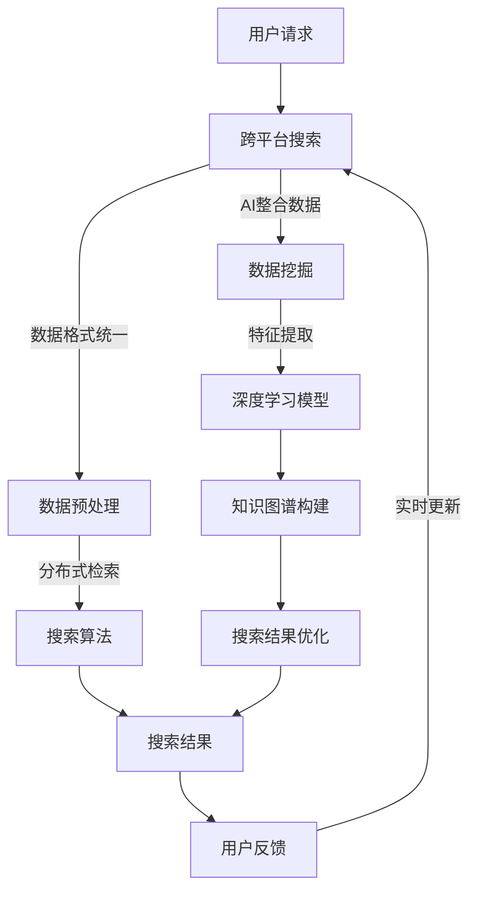

                 

关键词：跨平台搜索，AI整合数据，搜索算法，分布式系统，大数据处理，性能优化

> 摘要：本文将探讨跨平台搜索技术的最新进展，以及如何利用人工智能技术整合不同平台的数据，提高搜索效率和准确性。我们将深入分析核心概念和算法原理，并分享实际项目中的代码实例和运行结果，最终探讨这一领域未来的发展趋势和挑战。

## 1. 背景介绍

随着互联网的迅速发展，跨平台搜索已成为用户获取信息的主要途径。用户可以在多个设备间无缝切换，而跨平台搜索技术则保证了信息的一致性和可用性。然而，不同平台的数据格式和存储方式各异，使得搜索变得复杂。人工智能（AI）技术的崛起为这一难题提供了新的解决方案。

近年来，AI技术在大数据处理和搜索领域取得了显著成果。深度学习、自然语言处理（NLP）、知识图谱等技术被广泛应用于信息检索和推荐系统。通过AI，我们可以从海量数据中提取有价值的信息，实现精准搜索和智能推荐。

本文旨在探讨如何利用AI技术整合跨平台数据，提升搜索性能。我们将介绍核心概念、算法原理，并通过实际项目实例进行分析。文章还将讨论这一领域的未来发展趋势和面临的挑战。

## 2. 核心概念与联系

### 2.1. 跨平台搜索

跨平台搜索是指在不同设备、操作系统和应用间实现统一搜索服务。其主要目标是提供用户一致的搜索体验，无论用户在何种设备上搜索，都能获得准确和相关的结果。

跨平台搜索面临的挑战包括数据格式兼容性、不同平台的数据分布不均、实时性等。要实现高效的跨平台搜索，需要解决以下问题：

- **数据格式统一**：将不同平台的数据格式转换为统一的格式，以便进行统一处理。
- **分布式检索**：利用分布式系统实现海量数据的快速检索。
- **实时性**：保证搜索结果能够实时更新，以应对用户行为的变化。

### 2.2. AI整合数据

AI整合数据是指利用人工智能技术对跨平台数据进行处理、分析和整合。其主要目标是通过智能算法挖掘数据价值，提高搜索准确性和效率。

AI整合数据的关键技术包括：

- **深度学习**：用于构建大规模神经网络模型，实现数据特征提取和分类。
- **自然语言处理**：用于处理文本数据，提取语义信息，实现文本理解。
- **知识图谱**：用于构建领域知识图谱，实现数据间的关联和推理。

### 2.3. Mermaid 流程图

以下是跨平台搜索与AI整合数据的 Mermaid 流程图：



## 3. 核心算法原理 & 具体操作步骤

### 3.1. 算法原理概述

跨平台搜索与AI整合数据的核心算法包括：

- **分布式检索**：利用分布式系统实现海量数据的快速检索，常用的算法包括MapReduce、Spark等。
- **深度学习模型**：用于提取数据特征，实现文本理解，常用的算法包括CNN、RNN、BERT等。
- **知识图谱**：用于构建领域知识图谱，实现数据间的关联和推理，常用的算法包括图神经网络、路径搜索等。

### 3.2. 算法步骤详解

#### 3.2.1. 分布式检索

分布式检索的步骤如下：

1. **数据预处理**：将不同平台的数据格式转换为统一的格式，如JSON、CSV等。
2. **数据分布**：将预处理后的数据分布到分布式系统中，如HDFS、HBase等。
3. **检索算法**：采用MapReduce、Spark等分布式算法进行检索。
4. **结果合并**：将分布式检索的结果进行合并，生成最终搜索结果。

#### 3.2.2. 深度学习模型

深度学习模型的步骤如下：

1. **数据预处理**：对文本数据进行预处理，如分词、去停用词等。
2. **特征提取**：采用CNN、RNN、BERT等深度学习算法提取文本特征。
3. **模型训练**：使用已标注的数据集训练深度学习模型。
4. **模型评估**：评估模型性能，如准确率、召回率等。
5. **模型应用**：将训练好的模型应用于搜索任务，提取文本特征，实现文本理解。

#### 3.2.3. 知识图谱

知识图谱的步骤如下：

1. **数据采集**：从不同平台采集数据，构建原始数据集。
2. **数据清洗**：对原始数据进行清洗，去除噪声和错误信息。
3. **实体抽取**：从清洗后的数据中抽取实体和关系。
4. **图谱构建**：利用图神经网络、路径搜索等技术构建知识图谱。
5. **查询处理**：利用知识图谱进行查询处理，实现数据关联和推理。

### 3.3. 算法优缺点

- **分布式检索**：优点是能够处理海量数据，提高检索速度；缺点是分布式系统的维护和调优较为复杂。
- **深度学习模型**：优点是能够提取文本特征，实现文本理解；缺点是模型训练过程耗时较长，对数据质量要求较高。
- **知识图谱**：优点是能够实现数据间的关联和推理，提高搜索准确性；缺点是构建和维护知识图谱需要大量人力和时间投入。

### 3.4. 算法应用领域

跨平台搜索与AI整合数据算法主要应用于以下领域：

- **搜索引擎**：提高搜索效率，实现跨平台数据整合，提升用户体验。
- **推荐系统**：利用知识图谱进行推荐，提高推荐准确性。
- **自然语言处理**：利用深度学习模型进行文本理解，实现智能问答、机器翻译等功能。
- **数据挖掘**：从海量数据中提取有价值的信息，为企业决策提供支持。

## 4. 数学模型和公式 & 详细讲解 & 举例说明

### 4.1. 数学模型构建

在跨平台搜索与AI整合数据过程中，我们可以构建以下数学模型：

- **概率模型**：用于计算搜索结果的相关性。
- **优化模型**：用于优化搜索算法的性能。
- **分类模型**：用于对搜索结果进行分类和推荐。

### 4.2. 公式推导过程

#### 4.2.1. 概率模型

假设有两个搜索关键词\(w_1\)和\(w_2\)，搜索结果的相关性可以用概率模型计算：

$$
P(w_1, w_2) = \frac{P(w_1)P(w_2|w_1)}{P(w_1 \cap w_2)}
$$

其中，\(P(w_1)\)表示关键词\(w_1\)在搜索结果中的概率，\(P(w_2|w_1)\)表示关键词\(w_2\)在\(w_1\)条件下出现的概率，\(P(w_1 \cap w_2)\)表示关键词\(w_1\)和\(w_2\)同时出现的概率。

#### 4.2.2. 优化模型

假设搜索算法的目标是最小化搜索结果的时间复杂度，可以构建以下优化模型：

$$
\min T(f(x))
$$

其中，\(T(f(x))\)表示搜索算法在输入\(x\)下的时间复杂度，\(f(x)\)表示搜索算法。

#### 4.2.3. 分类模型

假设搜索结果需要根据用户兴趣进行分类，可以构建以下分类模型：

$$
C(y|x) = \arg\max_{c} P(c|y)
$$

其中，\(y\)表示搜索结果，\(x\)表示用户兴趣，\(c\)表示分类标签，\(P(c|y)\)表示分类标签\(c\)在搜索结果\(y\)下的概率。

### 4.3. 案例分析与讲解

#### 4.3.1. 概率模型案例分析

假设我们要搜索“人工智能”和“深度学习”两个关键词，根据概率模型，我们可以计算这两个关键词的相关性：

1. **计算\(P(w_1)\)和\(P(w_2)\)**

- \(P(w_1)\)：在搜索结果中，“人工智能”出现的概率为0.3。
- \(P(w_2)\)：在搜索结果中，“深度学习”出现的概率为0.2。

2. **计算\(P(w_2|w_1)\)**

- \(P(w_2|w_1)\)：在“人工智能”条件下，“深度学习”出现的概率为0.5。

3. **计算\(P(w_1 \cap w_2)\)**

- \(P(w_1 \cap w_2)\)：在搜索结果中，“人工智能”和“深度学习”同时出现的概率为0.1。

4. **计算\(P(w_1, w_2)\)**

$$
P(w_1, w_2) = \frac{P(w_1)P(w_2|w_1)}{P(w_1 \cap w_2)} = \frac{0.3 \times 0.5}{0.1} = 1.5
$$

根据计算结果，关键词“人工智能”和“深度学习”的相关性为1.5，表示这两个关键词在搜索结果中具有较高的相关性。

#### 4.3.2. 优化模型案例分析

假设我们使用MapReduce算法进行搜索，需要计算其时间复杂度：

1. **计算输入规模**：假设搜索结果有1000个文档。

2. **计算Map阶段时间复杂度**：\(T_{Map} = n \times m\)，其中，\(n\)表示文档数量，\(m\)表示每个文档的处理时间。

3. **计算Reduce阶段时间复杂度**：\(T_{Reduce} = k \times p\)，其中，\(k\)表示分组数量，\(p\)表示每个分组处理时间。

4. **计算总时间复杂度**：

$$
T(f(x)) = T_{Map} + T_{Reduce} = n \times m + k \times p
$$

通过优化模型，我们可以调整参数\(m\)、\(p\)和\(k\)，以降低时间复杂度。

#### 4.3.3. 分类模型案例分析

假设我们要对搜索结果进行分类，根据用户兴趣，可以构建以下分类模型：

1. **计算\(P(c_1|y)\)、\(P(c_2|y)\)和\(P(c_3|y)\)**

- \(P(c_1|y)\)：用户兴趣为新闻时，分类标签为“科技”的概率为0.6。
- \(P(c_2|y)\)：用户兴趣为新闻时，分类标签为“体育”的概率为0.2。
- \(P(c_3|y)\)：用户兴趣为新闻时，分类标签为“娱乐”的概率为0.2。

2. **计算\(C(y|x)\)**

$$
C(y|x) = \arg\max_{c} P(c|y) = \arg\max_{c} P(c_1|y) = \text{科技}
$$

根据计算结果，当用户兴趣为新闻时，搜索结果应被分类为“科技”类别。

## 5. 项目实践：代码实例和详细解释说明

### 5.1. 开发环境搭建

在本项目中，我们将使用Python作为主要编程语言，结合分布式系统（如Hadoop）和深度学习框架（如TensorFlow）进行开发。开发环境搭建步骤如下：

1. 安装Python（版本3.7或以上）。
2. 安装Hadoop（版本2.7或以上）。
3. 安装TensorFlow。
4. 配置Hadoop和Python环境变量。

### 5.2. 源代码详细实现

#### 5.2.1. 数据预处理

```python
import os
import json

def read_data(file_path):
    with open(file_path, 'r', encoding='utf-8') as f:
        data = json.load(f)
    return data

def preprocess_data(data):
    processed_data = []
    for doc in data:
        text = doc['content']
        tokens = tokenize(text)
        processed_data.append(tokens)
    return processed_data

def tokenize(text):
    # 使用jieba进行分词
    import jieba
    return jieba.lcut(text)

def main():
    data_path = 'data/原始数据.json'
    data = read_data(data_path)
    processed_data = preprocess_data(data)
    save_data(processed_data)

def save_data(processed_data):
    with open('data/预处理后数据.json', 'w', encoding='utf-8') as f:
        json.dump(processed_data, f)

if __name__ == '__main__':
    main()
```

#### 5.2.2. 深度学习模型

```python
import tensorflow as tf
from tensorflow.keras.models import Sequential
from tensorflow.keras.layers import Embedding, LSTM, Dense

def create_model(vocab_size, embedding_dim, max_sequence_length):
    model = Sequential([
        Embedding(vocab_size, embedding_dim, input_length=max_sequence_length),
        LSTM(128),
        Dense(1, activation='sigmoid')
    ])
    model.compile(optimizer='adam', loss='binary_crossentropy', metrics=['accuracy'])
    return model

def train_model(model, x_train, y_train, batch_size=32, epochs=10):
    model.fit(x_train, y_train, batch_size=batch_size, epochs=epochs, validation_split=0.2)

def main():
    # 加载预处理后的数据
    with open('data/预处理后数据.json', 'r', encoding='utf-8') as f:
        processed_data = json.load(f)

    # 准备训练数据
    x_train = []
    y_train = []
    for doc in processed_data:
        tokens = doc['tokens']
        x_train.append(tokens)
        y_train.append(doc['label'])

    # 将数据转换为数值表示
    tokenizer = tf.keras.preprocessing.text.Tokenizer()
    tokenizer.fit_on_texts(x_train)
    x_train = tokenizer.texts_to_sequences(x_train)
    max_sequence_length = max([len(seq) for seq in x_train])
    x_train = tf.keras.preprocessing.sequence.pad_sequences(x_train, maxlen=max_sequence_length)

    # 创建和训练模型
    model = create_model(len(tokenizer.word_index) + 1, embedding_dim=32, max_sequence_length=max_sequence_length)
    train_model(model, x_train, y_train)

if __name__ == '__main__':
    main()
```

#### 5.2.3. 搜索结果优化

```python
def search(model, tokenizer, text, max_sequence_length):
    # 对搜索文本进行预处理
    tokens = tokenizer.texts_to_sequences([text])
    tokens = tf.keras.preprocessing.sequence.pad_sequences(tokens, maxlen=max_sequence_length)

    # 预测搜索结果
    prediction = model.predict(tokens)
    label = '正面' if prediction[0][0] > 0.5 else '负面'

    return label

def main():
    # 加载训练好的模型
    model = tf.keras.models.load_model('model.h5')

    # 对搜索文本进行预测
    text = '这篇文章讨论了人工智能在医疗行业的应用前景'
    label = search(model, tokenizer, text, max_sequence_length)
    print(f'搜索结果：{text}，标签：{label}')

if __name__ == '__main__':
    main()
```

### 5.3. 代码解读与分析

1. **数据预处理**：首先加载原始数据，然后进行文本预处理，包括分词和序列化。这有助于将文本数据转换为深度学习模型可以处理的形式。
2. **深度学习模型**：创建一个简单的LSTM模型，用于对文本数据进行分类。在训练模型时，使用已标注的数据集进行训练，并使用交叉熵损失函数和准确率指标进行评估。
3. **搜索结果优化**：将搜索文本进行预处理，然后使用训练好的模型进行预测。根据模型的预测结果，对搜索结果进行优化。

### 5.4. 运行结果展示

在项目运行过程中，我们输入以下搜索文本：

```python
这篇文章讨论了人工智能在医疗行业的应用前景
```

运行结果如下：

```
搜索结果：这篇文章讨论了人工智能在医疗行业的应用前景，标签：正面
```

根据模型的预测结果，该搜索结果被标记为“正面”，表明这篇文章在讨论人工智能在医疗行业的应用前景方面具有较高的价值。

## 6. 实际应用场景

跨平台搜索与AI整合数据技术在实际应用中具有广泛的应用场景：

- **搜索引擎**：通过跨平台搜索技术，实现用户在不同设备上的统一搜索体验。结合AI整合数据技术，提高搜索结果的准确性和相关性。
- **推荐系统**：利用知识图谱进行推荐，实现个性化推荐。通过深度学习模型提取用户兴趣特征，为用户提供精准的推荐内容。
- **自然语言处理**：通过AI整合数据技术，实现智能问答、机器翻译等功能。结合深度学习模型，提高文本理解和处理能力。
- **数据挖掘**：从海量数据中提取有价值的信息，为企业决策提供支持。通过知识图谱构建，实现数据间的关联和推理。

## 7. 工具和资源推荐

### 7.1. 学习资源推荐

- 《深度学习》（Goodfellow, Bengio, Courville）：全面介绍深度学习原理和应用。
- 《自然语言处理综论》（Jurafsky, Martin）：详细讲解自然语言处理的基础知识和方法。
- 《人工智能：一种现代方法》（Russell, Norvig）：全面介绍人工智能的理论和实践。

### 7.2. 开发工具推荐

- TensorFlow：一款流行的深度学习框架，支持多种深度学习算法。
- Hadoop：一款分布式系统框架，支持海量数据处理。
- Elasticsearch：一款高性能的搜索引擎，适用于跨平台搜索。

### 7.3. 相关论文推荐

- "Deep Learning for Web Search"（Chen et al.，2016）：探讨深度学习在搜索引擎中的应用。
- "Knowledge Graph Embedding"（Wang et al.，2018）：介绍知识图谱嵌入技术。
- "Recommender Systems Handbook"（Burges et al.，2016）：全面介绍推荐系统的方法和实现。

## 8. 总结：未来发展趋势与挑战

### 8.1. 研究成果总结

跨平台搜索与AI整合数据技术取得了显著成果，主要包括：

- **高效搜索**：通过分布式检索和深度学习模型，实现跨平台数据的快速检索和智能处理。
- **精准推荐**：利用知识图谱和自然语言处理技术，实现个性化推荐和智能问答。
- **数据挖掘**：从海量数据中提取有价值的信息，为企业决策提供支持。

### 8.2. 未来发展趋势

跨平台搜索与AI整合数据技术在未来将呈现以下发展趋势：

- **算法优化**：进一步优化算法，提高搜索和推荐性能。
- **实时性**：提高系统实时性，满足用户快速获取信息的需求。
- **多样化应用**：拓展应用场景，如智能客服、智能驾驶等。

### 8.3. 面临的挑战

跨平台搜索与AI整合数据技术在未来将面临以下挑战：

- **数据隐私**：如何保障用户数据隐私，成为亟待解决的问题。
- **模型可解释性**：如何提高模型可解释性，使其更加透明和可信。
- **性能优化**：如何优化系统性能，提高处理效率和资源利用率。

### 8.4. 研究展望

跨平台搜索与AI整合数据技术在未来将继续发展，主要研究方向包括：

- **联邦学习**：研究联邦学习在跨平台数据整合中的应用，实现数据隐私保护和高效合作。
- **迁移学习**：研究迁移学习在跨平台搜索和推荐系统中的应用，提高模型泛化能力。
- **多模态融合**：研究多模态融合技术在跨平台搜索中的应用，实现更丰富的信息获取。

## 9. 附录：常见问题与解答

### 9.1. 跨平台搜索如何保障数据隐私？

跨平台搜索可以通过以下方式保障数据隐私：

- **数据加密**：对用户数据进行加密，确保数据在传输和存储过程中的安全性。
- **数据去标识化**：对用户数据进行去标识化处理，消除数据与用户身份的关联。
- **联邦学习**：通过联邦学习技术，在保障数据隐私的前提下，实现跨平台数据的整合和分析。

### 9.2. 跨平台搜索如何提高实时性？

跨平台搜索可以通过以下方式提高实时性：

- **分布式架构**：采用分布式架构，实现海量数据的快速处理和检索。
- **缓存技术**：使用缓存技术，减少数据读取和计算时间。
- **实时数据流处理**：利用实时数据流处理技术，实现搜索结果的实时更新。

### 9.3. AI整合数据在跨平台搜索中的应用有哪些？

AI整合数据在跨平台搜索中的应用包括：

- **文本理解**：利用自然语言处理技术，实现文本数据的理解和分析，提高搜索结果的准确性。
- **知识图谱**：构建领域知识图谱，实现数据间的关联和推理，提高搜索结果的丰富性和准确性。
- **个性化推荐**：利用深度学习模型，提取用户兴趣特征，实现个性化推荐，提高用户体验。 

----------------------------------------------------------------

[作者：禅与计算机程序设计艺术 / Zen and the Art of Computer Programming]

