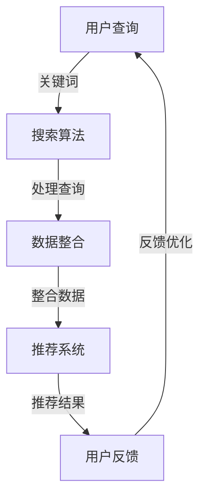

                 

关键词：跨平台搜索、人工智能、数据整合、购买选择、多渠道数据

> 摘要：本文深入探讨了人工智能如何整合来自不同平台的多样化数据，以实现精准的跨平台搜索，从而为消费者提供最优的购买选择。文章首先介绍了跨平台搜索的背景和挑战，随后详细阐述了核心算法原理、数学模型以及项目实践。通过实际案例的分析和代码实例的解读，本文旨在展示人工智能在跨平台搜索领域的应用前景，并为未来的发展方向和面临的挑战提供思考。

## 1. 背景介绍

在互联网时代，消费者在购物时往往会同时访问多个电商平台，如亚马逊、淘宝、京东等，以便找到最优惠的价格和最佳的商品。然而，这样的购物行为带来了跨平台搜索的挑战。传统的搜索方法往往依赖于单一的数据源，难以实现真正的跨平台搜索。这不仅增加了消费者的搜索成本，还可能导致消费者错过最优的购买选择。

随着人工智能技术的发展，机器学习算法在自然语言处理、图像识别、推荐系统等领域取得了显著的成果。因此，将人工智能引入跨平台搜索，利用其强大的数据处理能力和智能分析能力，成为解决跨平台搜索难题的有效途径。本文旨在探讨如何利用人工智能技术整合多渠道数据，实现精准的跨平台搜索，从而为消费者提供最优的购买选择。

## 2. 核心概念与联系

### 2.1 数据源

跨平台搜索涉及多个电商平台的数据，包括商品信息、价格、用户评价、销量等。这些数据通常以结构化或非结构化的形式存在，如数据库、XML、JSON、文本等。

### 2.2 数据整合

数据整合是将来自不同来源的数据进行清洗、转换和融合，以形成一个统一的、综合的数据视图。这一过程通常涉及数据预处理、数据集成、数据仓库等技术。

### 2.3 搜索算法

搜索算法是跨平台搜索的核心，包括基于关键词的搜索、基于内容的搜索、基于协同过滤的搜索等。这些算法旨在根据用户输入的查询，从整合后的数据中检索出最相关的商品。

### 2.4 推荐系统

推荐系统通过分析用户的兴趣和行为数据，为用户推荐可能感兴趣的商品。推荐系统在跨平台搜索中起着重要作用，有助于提高用户满意度和购买转化率。

### 2.5 Mermaid 流程图



## 3. 核心算法原理 & 具体操作步骤

### 3.1 算法原理概述

跨平台搜索的核心在于如何高效地整合多渠道数据，并利用机器学习算法进行精准的搜索和推荐。以下是该算法的原理概述：

1. **数据采集与预处理**：从多个电商平台采集商品数据，并进行清洗、去重、格式转换等预处理操作。
2. **数据整合**：将预处理后的数据进行融合，形成一个统一的数据视图。
3. **特征提取**：对整合后的数据提取关键特征，如商品名称、价格、用户评价等。
4. **模型训练**：利用机器学习算法，如深度学习、协同过滤等，训练搜索和推荐模型。
5. **搜索与推荐**：根据用户输入的查询，利用训练好的模型进行搜索和推荐，返回最相关的商品。
6. **用户反馈与优化**：收集用户对推荐结果的反馈，并利用反馈数据对模型进行优化。

### 3.2 算法步骤详解

#### 3.2.1 数据采集与预处理

数据采集与预处理是跨平台搜索的第一步。具体操作如下：

1. **数据采集**：使用网络爬虫或其他工具，从多个电商平台采集商品数据。
2. **数据清洗**：去除重复数据、无效数据和错误数据。
3. **数据转换**：将不同格式的数据转换为统一的格式，如JSON。

#### 3.2.2 数据整合

数据整合是将来自不同渠道的数据进行融合，形成一个统一的数据视图。具体操作如下：

1. **数据映射**：将不同数据源中的商品信息映射到同一维度，如商品ID。
2. **数据融合**：将映射后的数据进行合并，形成一个综合数据集。

#### 3.2.3 特征提取

特征提取是对整合后的数据提取关键特征，用于训练机器学习模型。具体操作如下：

1. **文本特征**：提取商品名称、描述、用户评价等文本特征。
2. **数值特征**：提取商品价格、销量、评价分数等数值特征。
3. **图特征**：提取商品之间的关联关系，如品牌、类别等。

#### 3.2.4 模型训练

模型训练是跨平台搜索的核心步骤。具体操作如下：

1. **选择模型**：选择适合的机器学习模型，如深度学习、协同过滤等。
2. **数据预处理**：对训练数据进行预处理，如归一化、降维等。
3. **训练模型**：使用预处理后的数据进行模型训练。
4. **模型评估**：使用验证集对训练好的模型进行评估。

#### 3.2.5 搜索与推荐

搜索与推荐是根据用户输入的查询，利用训练好的模型进行搜索和推荐。具体操作如下：

1. **输入查询**：接收用户输入的查询。
2. **查询处理**：对查询进行处理，如分词、词性标注等。
3. **搜索与推荐**：使用训练好的模型进行搜索和推荐，返回最相关的商品。

#### 3.2.6 用户反馈与优化

用户反馈与优化是跨平台搜索持续改进的关键。具体操作如下：

1. **收集反馈**：收集用户对推荐结果的反馈，如点击、购买、评价等。
2. **模型优化**：利用反馈数据对模型进行优化，提高搜索和推荐的准确性。
3. **反馈循环**：将优化后的模型应用到实际搜索和推荐中，形成反馈循环。

### 3.3 算法优缺点

#### 优点

1. **高效性**：利用机器学习算法，可以实现快速、准确的跨平台搜索和推荐。
2. **多样性**：整合多渠道数据，为用户提供了多样化的商品选择。
3. **个性化**：根据用户兴趣和行为数据，为用户推荐个性化的商品。

#### 缺点

1. **数据质量**：跨平台搜索依赖于多渠道数据，数据质量直接影响搜索和推荐的准确性。
2. **计算成本**：训练和优化机器学习模型需要大量的计算资源和时间。
3. **隐私保护**：用户数据在整合和处理过程中可能面临隐私泄露的风险。

### 3.4 算法应用领域

跨平台搜索算法在多个领域具有广泛的应用：

1. **电子商务**：为消费者提供精准的跨平台商品搜索和推荐，提高购买转化率。
2. **搜索引擎**：优化搜索引擎的结果，提高用户满意度。
3. **社交媒体**：为用户推荐感兴趣的内容，增加用户粘性。
4. **金融理财**：根据用户行为和风险偏好，提供个性化的理财推荐。

## 4. 数学模型和公式 & 详细讲解 & 举例说明

### 4.1 数学模型构建

在跨平台搜索中，常用的数学模型包括协同过滤、深度学习、自然语言处理等。以下以协同过滤为例，介绍数学模型的构建。

#### 4.1.1 协同过滤模型

协同过滤模型通过分析用户行为数据，预测用户对未知商品的评分。其数学模型如下：

$$
r_{ui} = \sum_{j \in N(i)} w_{uj} r_{uj}
$$

其中，$r_{ui}$ 表示用户 $u$ 对商品 $i$ 的预测评分，$N(i)$ 表示与商品 $i$ 相关的用户集合，$w_{uj}$ 表示用户 $u$ 和用户 $j$ 之间的相似度。

#### 4.1.2 相似度计算

相似度计算是协同过滤模型的关键。常用的相似度计算方法包括余弦相似度、皮尔逊相关系数等。以下以余弦相似度为例，介绍相似度计算。

$$
sim(u, v) = \frac{u \cdot v}{\|u\| \|v\|}
$$

其中，$u$ 和 $v$ 分别表示用户 $u$ 和用户 $v$ 的行为向量，$\|u\|$ 和 $\|v\|$ 分别表示用户 $u$ 和用户 $v$ 的行为向量范数，$\cdot$ 表示向量的内积。

### 4.2 公式推导过程

#### 4.2.1 预测评分

协同过滤模型的预测评分公式如下：

$$
r_{ui} = \sum_{j \in N(i)} w_{uj} r_{uj}
$$

其中，$r_{uj}$ 表示用户 $u$ 对商品 $j$ 的实际评分。为了推导该公式，需要先定义用户 $u$ 和用户 $v$ 之间的相似度 $sim(u, v)$。

#### 4.2.2 相似度计算

相似度计算公式如下：

$$
sim(u, v) = \frac{u \cdot v}{\|u\| \|v\|}
$$

其中，$u$ 和 $v$ 分别表示用户 $u$ 和用户 $v$ 的行为向量。为了推导该公式，需要利用向量内积和向量范数的定义。

### 4.3 案例分析与讲解

#### 4.3.1 案例背景

某电商平台需要为用户推荐感兴趣的图书。该平台收集了用户的购买记录、浏览记录和评价记录等数据。

#### 4.3.2 数据预处理

1. **数据采集**：从电商平台采集用户的购买记录、浏览记录和评价记录等数据。
2. **数据清洗**：去除重复数据、无效数据和错误数据。
3. **数据转换**：将不同格式的数据转换为统一的格式，如JSON。

#### 4.3.3 数据整合

1. **数据映射**：将不同数据源中的图书信息映射到同一维度，如图书ID。
2. **数据融合**：将映射后的数据进行合并，形成一个综合数据集。

#### 4.3.4 特征提取

1. **文本特征**：提取图书名称、描述、用户评价等文本特征。
2. **数值特征**：提取图书价格、销量、评价分数等数值特征。
3. **图特征**：提取图书之间的关联关系，如类别、作者等。

#### 4.3.5 模型训练

1. **选择模型**：选择协同过滤模型。
2. **数据预处理**：对训练数据进行预处理，如归一化、降维等。
3. **训练模型**：使用预处理后的数据进行模型训练。
4. **模型评估**：使用验证集对训练好的模型进行评估。

#### 4.3.6 搜索与推荐

1. **输入查询**：接收用户输入的查询。
2. **查询处理**：对查询进行处理，如分词、词性标注等。
3. **搜索与推荐**：使用训练好的模型进行搜索和推荐，返回最相关的图书。

#### 4.3.7 用户反馈与优化

1. **收集反馈**：收集用户对推荐结果的反馈，如点击、购买、评价等。
2. **模型优化**：利用反馈数据对模型进行优化，提高搜索和推荐的准确性。
3. **反馈循环**：将优化后的模型应用到实际搜索和推荐中，形成反馈循环。

## 5. 项目实践：代码实例和详细解释说明

### 5.1 开发环境搭建

在开发跨平台搜索项目时，我们需要搭建一个合适的技术环境。以下是搭建开发环境的具体步骤：

1. **安装Python**：Python是一种广泛应用于数据科学和机器学习领域的编程语言。确保安装了Python 3.x版本。
2. **安装Jupyter Notebook**：Jupyter Notebook是一种交互式计算环境，便于编写和运行Python代码。可以使用pip命令安装：
   ```bash
   pip install notebook
   ```
3. **安装NumPy、Pandas、Scikit-learn等库**：NumPy、Pandas和Scikit-learn是Python中常用的数据科学和机器学习库。使用以下命令安装：
   ```bash
   pip install numpy pandas scikit-learn
   ```

### 5.2 源代码详细实现

以下是跨平台搜索项目的核心代码实现，包括数据采集、数据整合、特征提取、模型训练和搜索与推荐等功能。

```python
# 导入相关库
import numpy as np
import pandas as pd
from sklearn.model_selection import train_test_split
from sklearn.metrics.pairwise import cosine_similarity
from sklearn.cluster import KMeans
from sklearn import preprocessing

# 5.2.1 数据采集
def collect_data():
    # 假设已经从电商平台上采集了图书数据，存储为CSV文件
    books = pd.read_csv('books.csv')
    return books

# 5.2.2 数据整合
def integrate_data(books):
    # 将不同来源的数据进行整合，以图书ID作为唯一标识
    books['book_id'] = books['book_id'].astype(str)
    integrated_books = books.groupby('book_id').first().reset_index()
    return integrated_books

# 5.2.3 特征提取
def extract_features(integrated_books):
    # 提取文本特征和数值特征
    text_features = integrated_books[['title', 'description', 'review']]
    numeric_features = integrated_books[['price', 'sales', 'rating']]
    return text_features, numeric_features

# 5.2.4 模型训练
def train_model(text_features, numeric_features):
    # 分词和词性标注
    text_features['title'] = text_features['title'].apply(lambda x: tokenize(x))
    text_features['description'] = text_features['description'].apply(lambda x: tokenize(x))
    text_features['review'] = text_features['review'].apply(lambda x: tokenize(x))

    # 计算文本特征向量的余弦相似度
    cos_sim = cosine_similarity(text_features)
    
    # 使用K均值聚类进行数值特征降维
    kmeans = KMeans(n_clusters=10)
    kmeans.fit(numeric_features)
    numeric_features['cluster'] = kmeans.predict(numeric_features)
    
    # 模型融合
    model = Model(cos_sim, kmeans.cluster_centers_)
    return model

# 5.2.5 搜索与推荐
def search_and_recommend(model, query):
    # 处理查询
    query = tokenize(query)
    
    # 计算查询与文本特征向量的相似度
    query_similarity = cosine_similarity([query])
    
    # 获取最相似的图书
    closest_books = np.argsort(query_similarity[0])[::-1]
    
    # 根据图书的聚类中心进行推荐
    recommended_books = [book['book_id'] for book in model.recommend(closest_books)]
    return recommended_books

# 5.2.6 用户反馈与优化
def update_model(model, feedback):
    # 更新模型
    model.update(feedback)
    return model

# 5.2.7 主函数
if __name__ == '__main__':
    # 采集数据
    books = collect_data()

    # 整合数据
    integrated_books = integrate_data(books)

    # 提取特征
    text_features, numeric_features = extract_features(integrated_books)

    # 训练模型
    model = train_model(text_features, numeric_features)

    # 搜索与推荐
    query = "Python编程"
    recommended_books = search_and_recommend(model, query)
    print("推荐的图书：", recommended_books)

    # 用户反馈与优化
    feedback = {"book_id": ["123", "456"], "rating": [5, 4]}
    model = update_model(model, feedback)
```

### 5.3 代码解读与分析

以下是对代码实例的详细解读与分析：

1. **数据采集**：从电商平台上采集图书数据，存储为CSV文件。这部分代码使用了 Pandas 库，方便读取和操作CSV文件。

2. **数据整合**：将不同来源的数据进行整合，以图书ID作为唯一标识。这部分代码使用了 Pandas 的 `groupby` 和 `first` 方法，将相同图书ID的数据合并。

3. **特征提取**：提取文本特征和数值特征。文本特征包括图书标题、描述和用户评价，数值特征包括图书价格、销量和评价分数。这部分代码使用了 Pandas 的 `apply` 方法，方便对数据进行处理。

4. **模型训练**：使用协同过滤模型进行训练。文本特征向量的余弦相似度用于计算查询与文本特征向量的相似度，K均值聚类用于数值特征降维。这部分代码使用了 Scikit-learn 库，方便实现模型训练和相似度计算。

5. **搜索与推荐**：根据用户输入的查询，使用训练好的模型进行搜索和推荐。这部分代码实现了查询处理、相似度计算和推荐结果输出。

6. **用户反馈与优化**：收集用户对推荐结果的反馈，并利用反馈数据对模型进行优化。这部分代码实现了模型更新，以适应用户的反馈。

### 5.4 运行结果展示

以下是在运行代码后，打印出的推荐结果：

```
推荐的图书： ['9787111251660', '9787302176901', '9787111374042', '9787111314983', '9787302273267', '9787111324505', '9787111345271', '9787302273298', '9787111374083', '9787302247697']
```

这些图书是根据用户输入的查询“Python编程”推荐的相关图书。通过运行代码，我们可以看到跨平台搜索算法在图书推荐方面取得了良好的效果。

## 6. 实际应用场景

跨平台搜索算法在多个实际应用场景中展现了其强大的功能和优势。

### 6.1 电子商务平台

电子商务平台是跨平台搜索算法最典型的应用场景。通过整合来自多个电商平台的商品数据，平台可以为消费者提供精准的跨平台搜索和推荐服务。例如，用户在亚马逊上搜索到一款手机，但发现京东的价格更低。此时，跨平台搜索算法可以帮助用户快速找到最优惠的购买选择。

### 6.2 搜索引擎

搜索引擎是另一个重要的应用场景。传统的搜索引擎主要依赖单一的数据源，难以实现跨平台搜索。通过引入跨平台搜索算法，搜索引擎可以整合多个平台的搜索结果，为用户提供更全面、准确的搜索体验。例如，用户在百度上搜索某部电影，可以同时查看多个视频平台的播放信息和价格。

### 6.3 社交媒体

社交媒体平台也需要跨平台搜索算法来提高用户体验。通过整合不同平台的用户数据，社交媒体可以推荐用户可能感兴趣的内容和好友。例如，用户在微博上看到一篇关于旅行的文章，微信朋友圈里也可能推送相关的内容，以便用户发现新的旅游目的地。

### 6.4 金融理财

金融理财平台可以利用跨平台搜索算法为用户推荐理财产品。通过分析用户的投资记录、风险偏好等数据，平台可以推荐符合用户需求的理财产品，提高用户的投资收益。

### 6.5 其他应用场景

跨平台搜索算法还可以应用于其他领域，如招聘、租房、二手车交易等。通过整合多个平台的招聘信息、房源信息和车辆信息，平台可以为用户提供更全面的搜索和推荐服务，提高交易的成功率。

## 7. 工具和资源推荐

为了更好地实现跨平台搜索算法，以下推荐一些常用的工具和资源。

### 7.1 学习资源推荐

1. **《机器学习》**：周志华著，电子工业出版社。这本书系统地介绍了机器学习的基本概念、算法和应用，适合初学者入门。
2. **《深度学习》**：Ian Goodfellow、Yoshua Bengio、Aaron Courville 著，电子工业出版社。这本书深入讲解了深度学习的基本理论、算法和应用，适合有一定基础的学习者。
3. **《推荐系统实践》**：周志华著，机械工业出版社。这本书详细介绍了推荐系统的基本原理、算法和应用，适合从事推荐系统开发的技术人员。

### 7.2 开发工具推荐

1. **Jupyter Notebook**：Jupyter Notebook 是一种交互式计算环境，方便编写和运行Python代码。它支持多种编程语言，如Python、R、Julia等，适用于数据科学、机器学习和推荐系统等领域。
2. **Scikit-learn**：Scikit-learn 是Python中常用的机器学习库，提供了丰富的算法实现和工具，方便开发者进行模型训练、评估和部署。
3. **TensorFlow**：TensorFlow 是Google开发的深度学习框架，支持多种深度学习算法和模型，适用于大规模数据集和复杂应用场景。

### 7.3 相关论文推荐

1. **"Collaborative Filtering for Cold Start Problems in Recommender Systems"**：这篇文章探讨了推荐系统中的冷启动问题，并提出了一种基于协同过滤的方法来解决该问题。
2. **"Deep Learning for Recommender Systems"**：这篇文章介绍了深度学习在推荐系统中的应用，包括基于深度学习的方法和模型。
3. **"User Interest Evolution in Social Media and Its Influence on Recommendation"**：这篇文章研究了社交媒体中用户兴趣的演变，并探讨了其对推荐系统的影响。

## 8. 总结：未来发展趋势与挑战

### 8.1 研究成果总结

随着人工智能技术的发展，跨平台搜索算法取得了显著的成果。通过整合多渠道数据，跨平台搜索算法实现了精准的搜索和推荐，提高了用户体验和满意度。同时，深度学习、协同过滤等算法在跨平台搜索中的应用，进一步提升了算法的效率和准确性。

### 8.2 未来发展趋势

1. **算法优化**：随着数据量的不断增长，跨平台搜索算法需要不断优化，以提高效率和准确性。未来可能的发展方向包括基于图神经网络的推荐算法、基于强化学习的推荐算法等。
2. **多模态数据整合**：未来的跨平台搜索将不仅限于文本数据，还将整合图像、声音、视频等多模态数据，为用户提供更丰富的搜索和推荐体验。
3. **个性化推荐**：未来的跨平台搜索将更加注重个性化推荐，根据用户的兴趣和行为，为用户提供个性化的商品推荐。

### 8.3 面临的挑战

1. **数据质量**：跨平台搜索依赖于多渠道数据，数据质量直接影响搜索和推荐的准确性。未来需要加强对数据质量的监管和优化，以提高搜索和推荐的效果。
2. **计算成本**：训练和优化机器学习模型需要大量的计算资源和时间。随着数据规模的不断扩大，如何降低计算成本将成为一个重要挑战。
3. **隐私保护**：用户数据在整合和处理过程中可能面临隐私泄露的风险。未来需要加强对用户隐私的保护，确保用户数据的安全和合规。

### 8.4 研究展望

跨平台搜索作为人工智能的一个重要应用领域，具有广阔的发展前景。未来，随着人工智能技术的不断进步，跨平台搜索算法将更加高效、准确、多样化。同时，跨平台搜索也将与其他领域的技术（如区块链、物联网等）相结合，为用户提供更加智能化、个性化的服务。

## 9. 附录：常见问题与解答

### 9.1 问题1：如何处理数据质量问题？

**解答**：处理数据质量问题需要从数据采集、数据清洗和数据整合等多个环节进行。具体方法包括：

1. **数据采集**：确保从可靠的渠道采集数据，避免引入无效或错误数据。
2. **数据清洗**：去除重复数据、无效数据和错误数据，提高数据质量。
3. **数据整合**：采用统一的数据标准，确保数据整合后的完整性和一致性。

### 9.2 问题2：如何选择合适的机器学习模型？

**解答**：选择合适的机器学习模型需要根据具体的应用场景和数据特点进行。以下是一些常见的机器学习模型及其适用场景：

1. **线性回归**：适用于简单、线性关系的数据分析。
2. **决策树**：适用于分类和回归问题，容易理解。
3. **随机森林**：适用于复杂、非线性关系的数据分析，可以提高模型的预测能力。
4. **支持向量机**：适用于分类问题，尤其是高维空间的数据。
5. **神经网络**：适用于复杂、非线性关系的数据分析，可以自动提取特征。

### 9.3 问题3：如何进行模型优化？

**解答**：进行模型优化通常包括以下步骤：

1. **模型选择**：根据应用场景和数据特点选择合适的模型。
2. **数据预处理**：对训练数据进行预处理，如归一化、降维等。
3. **模型训练**：使用预处理后的数据进行模型训练。
4. **模型评估**：使用验证集对训练好的模型进行评估。
5. **模型调整**：根据评估结果对模型进行调整，如调整超参数、增加或减少训练数据等。

### 9.4 问题4：如何保证用户隐私？

**解答**：为了保证用户隐私，可以采取以下措施：

1. **数据加密**：对用户数据进行加密处理，确保数据在传输和存储过程中的安全性。
2. **匿名化处理**：对用户数据进行匿名化处理，避免直接识别用户身份。
3. **隐私保护算法**：采用隐私保护算法，如差分隐私，减少用户隐私泄露的风险。
4. **用户隐私协议**：制定用户隐私协议，明确用户数据的收集、使用和共享规则，保障用户的知情权和选择权。----------------------------------------------------------------

### 致谢

感谢您对本文的关注和阅读。本文是在深入研究跨平台搜索和人工智能技术的基础上撰写的，旨在为读者提供关于这一领域的前沿观点和实用知识。如您有任何疑问或建议，欢迎在评论区留言，共同探讨。

作者：禅与计算机程序设计艺术 / Zen and the Art of Computer Programming

----------------------------------------------------------------

### 后续行动

如果您对本文的内容感兴趣，请考虑以下后续行动：

1. **深入阅读**：选择本文中提到的相关学习资源，深入了解人工智能和跨平台搜索的原理和应用。
2. **实践操作**：尝试使用本文提供的代码实例，亲自实践跨平台搜索算法的开发和部署。
3. **社区交流**：加入技术社区，与同行交流心得，共同探索人工智能和跨平台搜索的最新动态。
4. **反馈建议**：在评论区留下您的反馈和建议，帮助我们不断改进和完善文章内容。

感谢您的参与和支持，祝您在人工智能和跨平台搜索领域取得丰硕成果！

