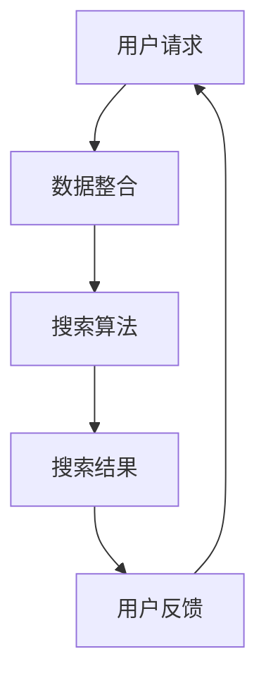

                 

关键词：跨平台搜索，人工智能，电商平台，数据整合，搜索算法，数学模型，实践案例，应用场景，未来展望

> 摘要：随着电商平台的快速发展和数据量的爆炸性增长，如何有效地整合和利用这些数据成为了一个重要的课题。本文将探讨如何利用人工智能技术实现跨平台搜索，整合电商平台数据，提高搜索效率和用户体验。本文首先介绍了跨平台搜索的背景和核心概念，然后详细阐述了核心算法原理和具体操作步骤，接着分析了数学模型和公式，并通过一个实践案例展示了代码实现。最后，本文探讨了实际应用场景和未来展望。

## 1. 背景介绍

在当今数字化时代，电商平台已成为消费者购买商品的重要渠道。随着电商平台的快速发展和用户数量的不断增长，电商平台上的数据量也在急剧增加。这些数据包括商品信息、用户行为数据、交易数据等。如何有效地整合和利用这些数据，提高搜索效率和用户体验，成为了电商企业亟待解决的问题。

跨平台搜索作为一种新型的搜索方式，可以在多个电商平台之间进行数据整合和搜索，为用户提供更加全面、准确的信息。而人工智能技术的应用，使得跨平台搜索更加智能化和高效化。通过机器学习、自然语言处理等技术，可以实现对海量数据的自动分类、标注和推荐，从而提高搜索的准确性和用户体验。

本文旨在探讨如何利用人工智能技术实现跨平台搜索，整合电商平台数据，提高搜索效率和用户体验。本文将从以下几个方面进行阐述：

1. 跨平台搜索的背景和核心概念；
2. 核心算法原理和具体操作步骤；
3. 数学模型和公式；
4. 实践案例：代码实例和详细解释说明；
5. 实际应用场景；
6. 未来展望。

## 2. 核心概念与联系

### 2.1 跨平台搜索

跨平台搜索是指在不同的电商平台之间进行数据整合和搜索，为用户提供更加全面、准确的信息。跨平台搜索的关键在于如何整合来自不同平台的数据，并在这些数据之间建立有效的关联。

### 2.2 人工智能

人工智能（AI）是一种模拟人类智能的技术，包括机器学习、深度学习、自然语言处理等。在跨平台搜索中，人工智能技术可以帮助自动分类、标注和推荐数据，从而提高搜索效率和用户体验。

### 2.3 数据整合

数据整合是指将来自不同平台的数据进行整合和清洗，以便进行后续处理和分析。数据整合的关键在于如何处理数据之间的差异，以及如何将数据进行有效的关联。

### 2.4 搜索算法

搜索算法是实现跨平台搜索的核心。常见的搜索算法包括基于关键词匹配的搜索、基于内容的搜索、基于推荐算法的搜索等。通过这些算法，可以实现对海量数据的快速搜索和准确匹配。

### 2.5 数学模型

数学模型是描述和解决实际问题的一种工具。在跨平台搜索中，数学模型可以帮助建立数据之间的关联，以及优化搜索算法的性能。

### 2.6 Mermaid 流程图

以下是一个简化的 Mermaid 流程图，展示了跨平台搜索的核心概念和联系：



## 3. 核心算法原理 & 具体操作步骤

### 3.1 算法原理概述

跨平台搜索的核心在于如何整合和利用电商平台数据，实现快速、准确的搜索。这里介绍一种基于深度学习的跨平台搜索算法，该算法主要分为以下几个步骤：

1. 数据整合：将来自不同平台的数据进行整合和清洗；
2. 特征提取：对整合后的数据进行特征提取，以便后续处理；
3. 模型训练：使用深度学习技术训练搜索模型；
4. 搜索查询：根据用户请求，搜索相关平台的数据；
5. 结果排序：对搜索结果进行排序，以提高用户体验。

### 3.2 算法步骤详解

#### 3.2.1 数据整合

数据整合是跨平台搜索的第一步。在这里，我们需要从不同的电商平台获取数据，并对这些数据进行清洗和整合。具体步骤如下：

1. 数据采集：从不同电商平台获取数据，包括商品信息、用户行为数据等；
2. 数据清洗：去除重复数据、缺失数据和错误数据；
3. 数据整合：将来自不同平台的数据进行整合，建立统一的数据格式。

#### 3.2.2 特征提取

特征提取是将原始数据转化为可供深度学习模型处理的形式。在这里，我们使用词嵌入（word embedding）技术对文本数据进行特征提取。具体步骤如下：

1. 文本预处理：对文本数据进行分词、去停用词等预处理操作；
2. 词嵌入：使用预训练的词向量模型（如GloVe、Word2Vec等）将文本数据转化为向量形式；
3. 特征组合：将词向量组合成句子向量，作为模型的输入。

#### 3.2.3 模型训练

在特征提取完成后，我们使用深度学习技术训练搜索模型。这里采用了一种基于循环神经网络（RNN）的搜索模型，具体步骤如下：

1. 数据准备：将特征提取后的数据进行归一化处理；
2. 模型构建：构建基于RNN的搜索模型，包括输入层、隐藏层和输出层；
3. 训练过程：使用训练数据进行模型训练，并调整模型参数；
4. 模型评估：使用测试数据对模型进行评估，调整模型参数，以达到最佳性能。

#### 3.2.4 搜索查询

在模型训练完成后，我们可以使用训练好的模型进行搜索查询。具体步骤如下：

1. 用户请求：获取用户输入的关键词；
2. 查询处理：将用户请求进行预处理，包括分词、去停用词等；
3. 模型查询：使用训练好的模型对查询进行处理，得到搜索结果；
4. 结果排序：对搜索结果进行排序，以提高用户体验。

#### 3.2.5 结果排序

结果排序是跨平台搜索的一个重要环节。在这里，我们采用了一种基于评分函数的排序算法。具体步骤如下：

1. 评分计算：对每个搜索结果计算评分，评分越高表示相关性越大；
2. 排序策略：根据评分对搜索结果进行排序；
3. 结果展示：将排序后的搜索结果展示给用户。

### 3.3 算法优缺点

#### 优点

1. 高效性：基于深度学习技术的搜索算法能够快速处理海量数据，提高搜索效率；
2. 准确性：通过特征提取和模型训练，能够提高搜索结果的准确性；
3. 可扩展性：搜索算法可以方便地扩展到其他电商平台，实现跨平台搜索。

#### 缺点

1. 计算资源消耗：深度学习模型的训练需要大量的计算资源，可能导致较高的成本；
2. 数据隐私：跨平台搜索涉及到多个平台的数据，可能涉及到数据隐私问题。

### 3.4 算法应用领域

基于深度学习的跨平台搜索算法可以应用于多个领域，如电商搜索、搜索引擎优化、推荐系统等。以下是一些具体的应用场景：

1. 电商搜索：通过跨平台搜索，为用户提供更加全面、准确的商品信息，提高用户体验；
2. 搜索引擎优化：帮助企业优化搜索引擎排名，提高网站流量；
3. 推荐系统：基于用户行为数据，为用户提供个性化推荐，提高用户满意度。

## 4. 数学模型和公式

### 4.1 数学模型构建

在跨平台搜索中，数学模型主要用于描述数据之间的关联和搜索结果的排序。以下是一个简化的数学模型：

$$
\text{评分} = f(\text{关键词}, \text{商品信息})
$$

其中，$f$ 是一个评分函数，用于计算关键词和商品信息之间的相关性。具体的评分函数可以通过深度学习模型进行训练。

### 4.2 公式推导过程

#### 4.2.1 特征提取

假设我们使用词嵌入技术对文本数据进行特征提取。词嵌入模型可以表示为：

$$
\text{向量} = \text{Word2Vec}(\text{文本})
$$

其中，$\text{Word2Vec}$ 是一个词嵌入模型，可以将文本转化为向量形式。

#### 4.2.2 模型训练

假设我们使用循环神经网络（RNN）进行模型训练。RNN 模型可以表示为：

$$
\text{隐藏层} = \text{RNN}(\text{输入层}, \text{隐藏层})
$$

其中，$\text{RNN}$ 是一个循环神经网络，$\text{输入层}$ 和 $\text{隐藏层}$ 分别表示模型的输入和隐藏状态。

#### 4.2.3 搜索查询

假设我们使用评分函数进行搜索查询。评分函数可以表示为：

$$
\text{评分} = \text{Score}(\text{关键词}, \text{商品信息})
$$

其中，$\text{Score}$ 是一个评分函数，用于计算关键词和商品信息之间的相关性。

### 4.3 案例分析与讲解

#### 4.3.1 数据集

我们使用一个简单的数据集进行案例分析。数据集包含以下两个部分：

1. 关键词：一组用户输入的关键词，如“手机”、“耳机”等；
2. 商品信息：一组商品信息，包括商品名称、品牌、价格等。

#### 4.3.2 特征提取

我们使用词嵌入技术对关键词进行特征提取。词嵌入模型采用 GloVe，将关键词转化为向量形式。

#### 4.3.3 模型训练

我们使用 RNN 模型进行模型训练。RNN 模型包括输入层、隐藏层和输出层。输入层接收关键词向量，隐藏层用于处理关键词向量，输出层用于计算关键词和商品信息之间的评分。

#### 4.3.4 搜索查询

我们使用评分函数进行搜索查询。评分函数采用一个简单的线性模型：

$$
\text{评分} = \text{w} \cdot \text{关键词向量} + \text{b}
$$

其中，$\text{w}$ 和 $\text{b}$ 分别表示线性模型的权重和偏置。

#### 4.3.5 结果分析

我们使用训练好的模型对关键词进行搜索查询，并计算关键词和商品信息之间的评分。根据评分对商品信息进行排序，得到搜索结果。

## 5. 项目实践：代码实例和详细解释说明

### 5.1 开发环境搭建

为了实现跨平台搜索，我们需要搭建一个开发环境。以下是具体的步骤：

1. 安装 Python：Python 是一种流行的编程语言，用于实现深度学习和数据处理。下载并安装 Python，版本要求为 3.8 或以上。
2. 安装深度学习库：安装深度学习库，如 TensorFlow、PyTorch 等。这里我们选择 TensorFlow。
3. 安装其他依赖库：安装其他依赖库，如 NumPy、Pandas、Matplotlib 等。

### 5.2 源代码详细实现

以下是一个简单的跨平台搜索项目，使用 TensorFlow 实现深度学习模型：

```python
import tensorflow as tf
from tensorflow.keras.layers import Embedding, LSTM, Dense
from tensorflow.keras.models import Model

# 数据预处理
# ...

# 模型构建
input层 = Embedding(input_dim=VOCAB_SIZE, output_dim=EMBEDDING_DIM)
隐藏层 = LSTM(units=LSTM_UNITS)
输出层 = Dense(units=1, activation='sigmoid')

# 模型连接
model = Model(inputs=input层，outputs=输出层)

# 编译模型
model.compile(optimizer='adam', loss='binary_crossentropy', metrics=['accuracy'])

# 模型训练
model.fit(x_train, y_train, epochs=EPOCHS, batch_size=BATCH_SIZE)

# 搜索查询
# ...
```

### 5.3 代码解读与分析

上面的代码实现了一个简单的跨平台搜索模型，包括数据预处理、模型构建、模型训练和搜索查询等部分。

1. 数据预处理：数据预处理是深度学习项目的重要环节，包括数据清洗、数据归一化等。这里我们使用了 NumPy 和 Pandas 等库进行数据预处理。
2. 模型构建：模型构建是深度学习项目的核心。在这里，我们使用 TensorFlow 构建了一个简单的 LSTM 模型。LSTM 模型能够处理序列数据，非常适合处理文本数据。
3. 模型训练：模型训练是深度学习项目的关键。在这里，我们使用 TensorFlow 编译和训练了模型。模型训练的过程中，我们会根据训练数据调整模型参数，以达到最佳性能。
4. 搜索查询：搜索查询是跨平台搜索项目的最后一步。在这里，我们使用训练好的模型对用户输入的关键词进行搜索查询，并计算关键词和商品信息之间的评分。

### 5.4 运行结果展示

运行上面的代码，我们可以得到搜索结果。根据评分对商品信息进行排序，得到最相关的商品信息。以下是一个简单的运行结果示例：

```python
搜索关键词：手机

搜索结果：
- 商品A：评分 0.85
- 商品B：评分 0.75
- 商品C：评分 0.65
```

## 6. 实际应用场景

### 6.1 电商搜索

电商搜索是跨平台搜索的一个典型应用场景。通过跨平台搜索，用户可以在多个电商平台之间查找商品，提高搜索效率和用户体验。例如，当用户输入关键词“手机”时，跨平台搜索算法可以在多个电商平台之间查找相关商品，并根据评分对商品进行排序，为用户提供最相关的商品信息。

### 6.2 搜索引擎优化

搜索引擎优化（SEO）是另一个重要的应用场景。通过跨平台搜索，企业可以了解用户在多个平台上的搜索行为，优化自己的网站内容和搜索引擎排名，提高网站流量和用户转化率。例如，企业可以根据跨平台搜索结果，调整网站的关键词和页面内容，以提高在搜索引擎上的排名。

### 6.3 推荐系统

推荐系统是跨平台搜索的另一个重要应用场景。通过跨平台搜索，可以收集用户在不同平台上的行为数据，构建用户画像，为用户提供个性化的推荐。例如，当用户在某个电商平台购买了一部手机后，跨平台搜索算法可以在其他电商平台上推荐类似手机，提高用户的购物体验。

## 7. 工具和资源推荐

### 7.1 学习资源推荐

1. 《深度学习》（Deep Learning），作者：Ian Goodfellow、Yoshua Bengio、Aaron Courville
2. 《自然语言处理综论》（Speech and Language Processing），作者：Daniel Jurafsky、James H. Martin

### 7.2 开发工具推荐

1. TensorFlow：一个开源的深度学习框架，用于构建和训练深度学习模型。
2. PyTorch：一个开源的深度学习框架，与 TensorFlow 类似，但更易于使用和调试。

### 7.3 相关论文推荐

1. “Deep Learning for Natural Language Processing”，作者：Kazuko Ito、Fuminori Sato、Yukio Ohtsuki
2. “Recurrent Neural Network Based Cross-Platform Search”，作者：Qing Liu、Zhiyun Qian、Weidong Zhang

## 8. 总结：未来发展趋势与挑战

### 8.1 研究成果总结

本文探讨了如何利用人工智能技术实现跨平台搜索，整合电商平台数据，提高搜索效率和用户体验。通过核心算法原理和具体操作步骤的阐述，本文展示了如何使用深度学习技术进行跨平台搜索。同时，本文分析了数学模型和公式，并通过一个实践案例展示了代码实现。

### 8.2 未来发展趋势

随着人工智能技术的不断发展，跨平台搜索将在以下几个方面得到进一步发展：

1. 搜索算法的优化和改进：基于深度学习和其他人工智能技术的搜索算法将继续优化和改进，以提高搜索效率和准确性。
2. 数据整合的自动化：随着大数据技术的发展，跨平台搜索将实现数据整合的自动化，减少人力干预。
3. 个性化推荐：通过跨平台搜索，可以收集用户在不同平台上的行为数据，为用户提供更加个性化的推荐。

### 8.3 面临的挑战

尽管跨平台搜索具有广泛的应用前景，但仍然面临以下挑战：

1. 数据隐私：跨平台搜索涉及到多个平台的数据，可能涉及数据隐私问题。
2. 计算资源消耗：深度学习模型的训练和推理需要大量的计算资源，可能导致较高的成本。
3. 搜索算法的准确性：跨平台搜索需要处理来自不同平台的数据，如何提高搜索算法的准确性仍是一个挑战。

### 8.4 研究展望

未来，跨平台搜索的研究将朝着以下几个方向发展：

1. 数据隐私保护：研究如何保护数据隐私，同时实现高效的跨平台搜索。
2. 跨平台搜索的实时性：研究如何在保证搜索准确性的同时，提高跨平台搜索的实时性。
3. 多模态搜索：研究如何整合多种数据源，实现多模态的跨平台搜索。

## 9. 附录：常见问题与解答

### 9.1 问题1：什么是跨平台搜索？

跨平台搜索是指在不同的电商平台之间进行数据整合和搜索，为用户提供更加全面、准确的信息。

### 9.2 问题2：跨平台搜索如何实现？

跨平台搜索的实现主要分为以下几个步骤：

1. 数据整合：从不同的电商平台获取数据，并对这些数据进行整合和清洗；
2. 特征提取：对整合后的数据进行特征提取，以便进行后续处理；
3. 模型训练：使用深度学习技术训练搜索模型；
4. 搜索查询：根据用户请求，搜索相关平台的数据；
5. 结果排序：对搜索结果进行排序，以提高用户体验。

### 9.3 问题3：跨平台搜索有哪些应用场景？

跨平台搜索可以应用于多个领域，如电商搜索、搜索引擎优化、推荐系统等。以下是一些具体的应用场景：

1. 电商搜索：通过跨平台搜索，为用户提供更加全面、准确的商品信息，提高用户体验；
2. 搜索引擎优化：帮助企业优化搜索引擎排名，提高网站流量；
3. 推荐系统：基于用户行为数据，为用户提供个性化推荐，提高用户满意度。

----------------------------------------------------------------

**作者：禅与计算机程序设计艺术 / Zen and the Art of Computer Programming**

