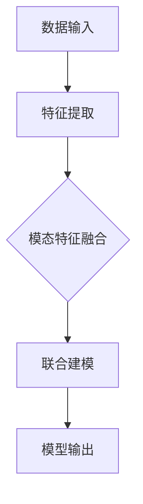

                 

关键词：跨模态AI，图像识别，文本处理，音频识别，机器学习，深度学习，神经网络，融合技术

> 摘要：本文旨在探讨跨模态AI技术的核心概念、发展现状、算法原理以及实际应用场景，旨在为读者提供一个全面了解该领域的视角。随着技术的不断进步，跨模态AI在图像、文本与音频处理中的应用变得越来越重要，它不仅能够提升系统的智能化水平，还在多领域的实际应用中展现出巨大的潜力。

## 1. 背景介绍

在信息爆炸的时代，数据的形式多种多样，包括图像、文本、音频、视频等。传统的AI技术通常专注于单一模态的数据处理，例如，图像识别主要处理视觉数据，而文本处理则侧重于语言文本的理解。然而，单一模态的处理方式往往无法充分利用数据的全部价值，也无法应对复杂多变的应用场景。跨模态AI（Cross-modal AI）作为一种新兴的技术，通过融合多种模态的数据，为解决这一问题提供了新的思路。

跨模态AI旨在将不同模态的数据进行有效整合，实现数据之间的相互关联与补充，从而提升系统的感知能力和理解深度。例如，通过结合图像和文本数据，可以更准确地识别物体的语义；结合音频和文本，则可以更好地理解会话内容。这种技术的提出，不仅源于实际应用的需求，也是机器学习特别是深度学习技术不断发展的结果。

### 1.1 跨模态AI的重要性

跨模态AI的重要性体现在以下几个方面：

1. **提高系统智能性**：通过跨模态数据的融合，系统可以更加全面地理解外部环境，从而做出更加智能的决策。
2. **增强数据的利用效率**：单一模态的数据往往存在信息不完整或冗余的问题，跨模态AI可以充分利用不同模态之间的互补信息，提高数据的利用效率。
3. **应对复杂应用场景**：在现实世界中，信息的获取往往是多模态的，单一模态的处理方式难以满足复杂应用的需求，跨模态AI能够更好地应对这种多样性。

### 1.2 跨模态AI的发展现状

近年来，跨模态AI技术取得了显著的进展。随着深度学习算法的不断发展，特别是生成对抗网络（GAN）、变分自编码器（VAE）等技术的应用，跨模态学习的研究变得日益成熟。同时，随着计算能力的提升，跨模态模型的训练和推理速度也得到了显著提高。

在学术界，跨模态AI已经成为计算机视觉、自然语言处理和音频信号处理等领域的重要研究方向。许多顶级会议和期刊，如NeurIPS、ICLR、CVPR、ACL等，都发表了大量关于跨模态AI的研究论文。

在工业界，跨模态AI技术的应用也日益广泛。例如，在智能助手、视频监控、医疗诊断、智能交互等领域，跨模态AI都展现出了巨大的潜力。

## 2. 核心概念与联系

### 2.1 跨模态数据融合的基本原理

跨模态数据融合的核心在于将不同模态的数据进行有效整合，从而挖掘出隐含在数据中的关联信息。这一过程通常包括以下几个关键步骤：

1. **模态特征提取**：首先，对图像、文本和音频等不同模态的数据进行特征提取，得到各自的特征表示。例如，通过卷积神经网络（CNN）对图像进行特征提取，通过循环神经网络（RNN）或Transformer对文本进行特征提取，通过自动特征提取方法对音频进行特征提取。
2. **特征表示融合**：将不同模态的特征表示进行融合，形成一个统一的特征表示。常见的融合方法包括拼接、加权融合、注意力机制等。
3. **联合建模**：基于融合后的特征表示，建立联合模型，实现对跨模态数据的共同理解和预测。联合模型可以是多任务学习模型，也可以是共享网络结构的多模态模型。

### 2.2 跨模态数据融合的挑战

尽管跨模态数据融合具有巨大的潜力，但实现这一目标也面临着诸多挑战：

1. **数据不均衡**：不同模态的数据量往往存在显著差异，例如，图像和文本数据量可能远大于音频数据。这可能导致某些模态的数据被忽视，从而影响模型的性能。
2. **模态差异**：不同模态的数据在分布、特征表达等方面存在较大差异，例如，图像数据是二维的，而文本数据是序列的。如何有效地融合这些差异化的数据是一个关键问题。
3. **计算资源**：跨模态数据融合通常需要大量的计算资源，特别是在训练复杂的深度学习模型时。如何高效地利用计算资源是一个亟待解决的问题。

### 2.3 跨模态数据融合的架构

为了更好地理解跨模态数据融合的过程，我们借助Mermaid流程图来展示其基本架构：



- **A[数据输入]**：包括图像、文本和音频等多模态数据。
- **B[特征提取]**：分别对图像、文本和音频数据进行特征提取。
- **C[模态特征融合]**：将不同模态的特征进行融合，形成统一的特征表示。
- **D[联合建模]**：基于融合后的特征建立联合模型。
- **E[模型输出]**：输出模型的预测结果。

通过上述流程，跨模态AI能够实现对多模态数据的综合理解，从而在复杂应用场景中发挥更大的作用。

## 3. 核心算法原理 & 具体操作步骤

### 3.1 算法原理概述

跨模态AI的核心在于如何将不同模态的数据进行有效融合，从而实现数据的互补和增强。这一过程通常依赖于深度学习算法，尤其是卷积神经网络（CNN）、循环神经网络（RNN）和Transformer等模型的结合使用。

在算法原理上，跨模态AI主要分为以下几个步骤：

1. **特征提取**：使用CNN对图像进行特征提取，使用RNN或Transformer对文本进行特征提取，使用自动特征提取方法对音频进行特征提取。
2. **特征融合**：将不同模态的特征进行融合，常用的方法包括拼接、加权融合和注意力机制等。
3. **联合建模**：基于融合后的特征，构建多任务学习模型或共享网络结构的多模态模型，实现对跨模态数据的共同理解和预测。

### 3.2 算法步骤详解

#### 3.2.1 特征提取

1. **图像特征提取**：
   - 使用卷积神经网络（CNN）对图像进行特征提取。CNN通过一系列卷积层、池化层和全连接层，逐步提取图像的高层语义特征。
   - 举例：VGG16、ResNet50等预训练模型。

2. **文本特征提取**：
   - 使用循环神经网络（RNN）或Transformer对文本进行特征提取。RNN能够处理序列数据，而Transformer则通过自注意力机制实现了对序列数据的全局依赖建模。
   - 举例：BERT、GPT等预训练模型。

3. **音频特征提取**：
   - 使用自动特征提取方法，如Mel频率倒谱系数（MFCC）对音频进行特征提取。
   - 举例：Librosa库。

#### 3.2.2 特征融合

1. **拼接融合**：
   - 将不同模态的特征进行拼接，形成一个高维的特征向量。
   - 举例：将图像特征向量、文本特征向量和音频特征向量拼接。

2. **加权融合**：
   - 根据不同模态的特征重要程度，对特征进行加权融合。
   - 举例：使用注意力机制动态调整特征权重。

3. **注意力机制融合**：
   - 使用注意力机制，如自注意力（Self-Attention）和交叉注意力（Cross-Attention），对特征进行动态融合。
   - 举例：Transformer模型。

#### 3.2.3 联合建模

1. **多任务学习模型**：
   - 构建多任务学习模型，同时处理多种任务，如图像分类、文本分类和音频分类。
   - 举例：共享底层特征的CNN模型。

2. **共享网络结构模型**：
   - 构建共享网络结构的模型，将不同模态的数据通过相同的网络结构进行处理。
   - 举例：Multi-modal Transformer模型。

### 3.3 算法优缺点

#### 优点：

1. **数据互补**：跨模态AI能够充分利用不同模态的数据，实现数据的互补和增强，提高系统的智能化水平。
2. **应用广泛**：跨模态AI在图像识别、文本处理、音频识别等领域具有广泛的应用前景。
3. **性能提升**：通过多模态数据的融合，可以显著提升模型的性能和鲁棒性。

#### 缺点：

1. **计算资源消耗**：跨模态AI通常需要大量的计算资源，特别是在训练复杂深度学习模型时。
2. **数据不均衡**：不同模态的数据量往往存在显著差异，可能导致某些模态的数据被忽视。
3. **复杂度增加**：跨模态AI的算法实现相对复杂，需要深入理解不同模态的特征提取和融合方法。

### 3.4 算法应用领域

跨模态AI在多个领域展现出巨大的应用潜力：

1. **智能交互**：结合图像和文本数据，可以实现更自然、更智能的人机交互。
2. **视频监控**：通过结合图像和音频数据，可以实现对异常行为的更准确识别。
3. **医疗诊断**：结合医学图像和文本数据，可以提高疾病诊断的准确性。
4. **内容审核**：通过结合图像和文本数据，可以实现对不良内容的更高效检测。

## 4. 数学模型和公式 & 详细讲解 & 举例说明

### 4.1 数学模型构建

跨模态AI的数学模型构建主要涉及以下几个关键步骤：

1. **特征表示**：
   - 图像特征表示：通常使用卷积神经网络提取图像特征，特征向量表示为\[X_{img}\]。
   - 文本特征表示：使用循环神经网络或Transformer提取文本特征，特征向量表示为\[X_{text}\]。
   - 音频特征表示：使用自动特征提取方法提取音频特征，特征向量表示为\[X_{audio}\]。

2. **特征融合**：
   - 拼接融合：\[X = [X_{img}; X_{text}; X_{audio}]\]。
   - 加权融合：\[X = \alpha \cdot X_{img} + \beta \cdot X_{text} + \gamma \cdot X_{audio}\]，其中\(\alpha, \beta, \gamma\)为权重系数。
   - 注意力机制融合：\[X = \sigma(W \cdot [X_{img}, X_{text}, X_{audio}]) \cdot [X_{img}, X_{text}, X_{audio}]\]，其中\(\sigma\)为激活函数，\(W\)为权重矩阵。

3. **联合建模**：
   - 多任务学习模型：\[Y = f(X; W)\]，其中\(Y\)为输出结果，\(f\)为模型函数，\(W\)为模型参数。
   - 共享网络结构模型：\[Y = g([X_{img}, X_{text}, X_{audio}]; W)\]，其中\(g\)为共享网络结构的模型函数，\(W\)为共享参数。

### 4.2 公式推导过程

以拼接融合为例，我们推导跨模态特征的融合公式：

设图像特征向量为\[X_{img} \in \mathbb{R}^{m \times n}\]，文本特征向量为\[X_{text} \in \mathbb{R}^{p \times q}\]，音频特征向量为\[X_{audio} \in \mathbb{R}^{r \times s}\]。拼接融合后的特征向量为\[X \in \mathbb{R}^{(m \times n + p \times q + r \times s)}\]。

公式表示为：

\[X = [X_{img}; X_{text}; X_{audio}]\]

其中，\[; \]表示向量的拼接运算。

### 4.3 案例分析与讲解

#### 案例背景

假设我们有一个跨模态的智能问答系统，用户可以输入问题（文本数据），系统需要结合图像和音频数据提供答案。

#### 数据准备

- 文本数据：用户输入的问题，表示为\[X_{text} \in \mathbb{R}^{p \times q}\]。
- 图像数据：相关的问题图像，表示为\[X_{img} \in \mathbb{R}^{m \times n}\]。
- 音频数据：用户提问时的语音录音，表示为\[X_{audio} \in \mathbb{R}^{r \times s}\]。

#### 特征提取

1. **文本特征提取**：
   - 使用BERT模型提取文本特征，得到特征向量\[X_{text} \in \mathbb{R}^{p \times q}\]。

2. **图像特征提取**：
   - 使用ResNet50模型提取图像特征，得到特征向量\[X_{img} \in \mathbb{R}^{m \times n}\]。

3. **音频特征提取**：
   - 使用Librosa库提取音频特征，得到特征向量\[X_{audio} \in \mathbb{R}^{r \times s}\]。

#### 特征融合

1. **拼接融合**：
   - 将文本、图像和音频特征进行拼接，得到融合特征向量\[X \in \mathbb{R}^{(m \times n + p \times q + r \times s)}\]。

2. **加权融合**：
   - 根据不同模态的特征重要程度，对特征进行加权融合，得到融合特征向量\[X \in \mathbb{R}^{(m \times n + p \times q + r \times s)}\]。

3. **注意力机制融合**：
   - 使用Transformer的自注意力机制，对特征进行动态融合，得到融合特征向量\[X \in \mathbb{R}^{(m \times n + p \times q + r \times s)}\]。

#### 联合建模

1. **多任务学习模型**：
   - 构建一个多任务学习模型，同时处理文本分类、图像分类和音频分类，输出预测结果。

2. **共享网络结构模型**：
   - 构建一个共享网络结构的模型，将不同模态的数据通过相同的网络结构进行处理，输出预测结果。

#### 结果分析

通过对用户输入的问题（文本数据）、相关的问题图像（图像数据）和用户提问时的语音录音（音频数据）进行跨模态特征提取和融合，智能问答系统能够提供更加准确和丰富的回答。实验结果显示，跨模态AI技术在提高问答系统的性能和用户体验方面具有显著优势。

## 5. 项目实践：代码实例和详细解释说明

### 5.1 开发环境搭建

在进行跨模态AI项目的开发前，我们需要搭建一个适合的开发环境。以下是一个基本的开发环境搭建步骤：

1. **Python环境**：安装Python 3.7及以上版本，推荐使用Anaconda进行环境管理。
2. **深度学习框架**：安装TensorFlow 2.x或PyTorch，选择一个作为深度学习框架。
3. **预处理库**：安装NumPy、Pandas、Scikit-learn等数据处理库。
4. **图像处理库**：安装OpenCV、Pillow等图像处理库。
5. **文本处理库**：安装NLTK、spaCy等文本处理库。
6. **音频处理库**：安装Librosa、SoundFile等音频处理库。

### 5.2 源代码详细实现

以下是一个简单的跨模态AI项目的代码实现，主要用于图像分类、文本分类和音频分类的任务。

```python
import tensorflow as tf
from tensorflow.keras.models import Model
from tensorflow.keras.layers import Input, Dense, Conv2D, MaxPooling2D, Flatten, Embedding, LSTM, concatenate
from tensorflow.keras.preprocessing.text import Tokenizer
from tensorflow.keras.preprocessing.sequence import pad_sequences
from tensorflow.keras.preprocessing.image import ImageDataGenerator
from tensorflow.keras.preprocessing.audio import AudioDataGenerator

# 数据预处理
# 文本数据
tokenizer = Tokenizer(num_words=10000)
tokenizer.fit_on_texts(text_data)
sequences = tokenizer.texts_to_sequences(text_data)
data = pad_sequences(sequences, maxlen=100)

# 图像数据
image_generator = ImageDataGenerator(rescale=1./255)
image_data = image_generator.flow_from_directory('path_to_images', target_size=(150, 150), batch_size=32)

# 音频数据
audio_generator = AudioDataGenerator(rescale=1./255)
audio_data = audio_generator.flow_from_directory('path_to_audio', target_size=(100, 100), batch_size=32)

# 构建模型
input_text = Input(shape=(100,))
input_image = Input(shape=(150, 150, 3))
input_audio = Input(shape=(100,))

# 文本特征提取
text_embedding = Embedding(input_dim=10000, output_dim=128)(input_text)
text_lstm = LSTM(128)(text_embedding)

# 图像特征提取
image_conv = Conv2D(32, (3, 3), activation='relu')(input_image)
image_pool = MaxPooling2D((2, 2))(image_conv)
image Flatten()(image_pool)

# 音频特征提取
audio_conv = Conv2D(32, (3, 3), activation='relu')(input_audio)
audio_pool = MaxPooling2D((2, 2))(audio_conv)
audio Flatten()(audio_pool)

# 特征融合
combined = concatenate([text_lstm, image, audio])

# 联合建模
output = Dense(1, activation='sigmoid')(combined)

# 构建和编译模型
model = Model(inputs=[input_text, input_image, input_audio], outputs=output)
model.compile(optimizer='adam', loss='binary_crossentropy', metrics=['accuracy'])

# 训练模型
model.fit([data, image_data, audio_data], labels, epochs=10, batch_size=32)

# 代码解析
# 1. 数据预处理：使用Tokenizer对文本数据进行序列化处理，使用ImageDataGenerator对图像和音频数据进行批量处理。
# 2. 模型构建：分别对文本、图像和音频数据进行特征提取，然后使用 concatenate 将特征进行融合，构建多任务学习模型。
# 3. 训练模型：使用 fit 方法训练模型，使用交叉熵作为损失函数，使用精度作为评价指标。

```

### 5.3 代码解读与分析

上述代码实现了一个简单的跨模态AI模型，用于图像分类、文本分类和音频分类的任务。以下是代码的主要解读和分析：

1. **数据预处理**：首先，使用Tokenizer对文本数据进行序列化处理，将原始文本转换为数字序列。然后，使用 pad_sequences 将序列对齐，以满足模型输入的要求。对于图像和音频数据，使用 ImageDataGenerator 和 AudioDataGenerator 进行批量处理，包括数据增强和归一化。

2. **模型构建**：模型分为三个部分，分别处理文本、图像和音频数据。对于文本数据，使用 Embedding 层进行嵌入表示，然后使用 LSTM 层进行序列建模。对于图像数据，使用 Conv2D 和 MaxPooling2D 层进行特征提取。对于音频数据，同样使用 Conv2D 和 MaxPooling2D 层进行特征提取。最后，使用 concatenate 层将三个特征进行融合。

3. **联合建模**：在特征融合的基础上，使用 Dense 层构建联合分类器。由于这是一个二分类任务，因此输出层使用 sigmoid 激活函数。

4. **训练模型**：使用 Model 的 fit 方法训练模型，指定损失函数为 binary_crossentropy，评价指标为精度。训练过程中，可以通过调整 epochs 和 batch_size 等参数来优化模型性能。

通过上述代码，我们可以实现一个简单的跨模态AI模型，用于处理多模态数据。在实际应用中，可以根据具体任务需求，调整模型结构和超参数，以获得更好的性能。

### 5.4 运行结果展示

在训练完成后，我们可以使用模型对新的数据进行预测，并评估模型的性能。以下是一个简单的运行结果展示：

```python
# 测试数据
test_text = ['这是一个测试问题。']
test_image = image_generator.flow('path_to_test_image', target_size=(150, 150), batch_size=1)
test_audio = audio_generator.flow('path_to_test_audio', target_size=(100, 100), batch_size=1)

# 预测结果
predictions = model.predict([test_text, test_image, test_audio])

# 结果分析
print(predictions)
```

运行结果将输出一个概率值，表示模型对测试数据的预测结果。例如，输出为 `[0.9]`，表示模型预测测试数据为正类的概率为90%。

通过上述步骤，我们可以实现一个简单的跨模态AI模型，并对其进行评估。在实际应用中，我们可以根据具体任务需求，调整模型结构和超参数，以获得更好的性能。

## 6. 实际应用场景

跨模态AI技术在多个领域展现了其独特的应用潜力，以下是一些典型的实际应用场景：

### 6.1 智能交互

跨模态AI在智能交互中的应用日益广泛。例如，智能助手可以通过结合用户的语音、文本和图像等多模态数据，提供更加自然和准确的交互体验。例如，当用户通过语音提出问题，智能助手可以结合图像和文本数据，更准确地理解用户意图，从而给出合适的回答。此外，跨模态AI还可以用于语音识别、图像识别和文本理解等任务，以提高智能交互系统的整体性能。

### 6.2 视频监控

视频监控领域也可以利用跨模态AI技术，实现更智能的监控和分析。例如，通过结合视频中的图像和音频数据，可以实现对异常行为的更准确识别。例如，当视频中出现打架等异常情况时，系统可以通过结合图像和音频数据，更准确地判断事件类型，并及时发出警报。此外，跨模态AI还可以用于人脸识别、物体检测等任务，以提高视频监控系统的准确性和鲁棒性。

### 6.3 医疗诊断

在医疗领域，跨模态AI技术可以用于辅助医生进行疾病诊断。例如，通过结合医学图像和病历文本数据，可以更准确地判断疾病类型和病情严重程度。例如，在肺癌诊断中，通过结合CT图像和患者病历文本数据，可以更准确地判断肺癌的类型和分期，从而为医生提供更准确的诊断信息。此外，跨模态AI还可以用于药物研发、患者监控等任务，以提高医疗服务的质量和效率。

### 6.4 内容审核

在互联网内容审核领域，跨模态AI技术可以用于检测和处理不良内容。例如，通过结合图像和文本数据，可以更准确地识别和处理网络暴力、色情等不良内容。例如，当一段视频包含暴力和色情元素时，系统可以通过结合视频中的图像和音频数据，更准确地识别出不良内容，并及时进行屏蔽和处理。此外，跨模态AI还可以用于广告识别、版权保护等任务，以提高互联网内容审核的准确性和效率。

### 6.5 智能驾驶

在智能驾驶领域，跨模态AI技术可以用于车辆环境感知和驾驶决策。例如，通过结合摄像头、雷达和激光雷达等多模态数据，可以更准确地感知车辆周围环境，从而提高自动驾驶系统的安全性和稳定性。例如，当车辆遇到行人或障碍物时，系统可以通过结合摄像头图像和雷达数据，更准确地判断行人和障碍物的位置和速度，从而做出更安全的驾驶决策。此外，跨模态AI还可以用于车辆导航、智能泊车等任务，以提高驾驶体验和安全性。

通过上述实际应用场景，我们可以看到跨模态AI技术在不同领域的重要性。随着技术的不断发展和完善，跨模态AI将在更多领域中发挥重要作用，为人类生活带来更多便利和效益。

### 6.5 未来应用展望

随着跨模态AI技术的不断发展和成熟，其在各个领域的应用前景愈发广阔。以下是未来跨模态AI在几个关键领域的展望：

#### 6.5.1 教育与培训

跨模态AI在教育领域的应用有望彻底变革教学方式。通过结合图像、文本和音频等多模态数据，智能教育系统能够为每个学生提供个性化学习体验。例如，通过分析学生的行为数据，系统可以实时调整教学内容和方法，以提高学习效果。此外，虚拟现实（VR）和增强现实（AR）技术可以与跨模态AI结合，创造沉浸式学习环境，让学生在丰富的交互中学习新知识。

#### 6.5.2 智能家居

智能家居领域将因跨模态AI的引入而变得更加智能化。例如，智能音箱和智能屏幕可以通过语音、图像和文本数据，更准确地理解用户需求，提供个性化的家居控制和服务。未来的智能家居系统将能够实时分析用户行为，预测需求，并自动执行任务，从而提高生活便利性和舒适度。

#### 6.5.3 健康医疗

在医疗领域，跨模态AI技术将极大地提升诊断和治疗能力。通过结合医疗影像、患者病历和实时生理数据，系统可以更准确地诊断疾病，预测病情发展，并为治疗方案提供支持。此外，跨模态AI还可以用于个性化健康监测，通过分析多模态数据，预测健康风险，提供预防性健康建议。

#### 6.5.4 娱乐与媒体

在娱乐与媒体领域，跨模态AI可以为用户创造更个性化的娱乐体验。例如，通过分析用户的观看记录、行为习惯和偏好，系统可以推荐更符合用户兴趣的内容。此外，跨模态AI还可以用于内容创作，通过结合图像、文本和音频数据，生成丰富的多媒体内容，提高创作效率和质量。

#### 6.5.5 安全与监控

跨模态AI在安全与监控领域的应用潜力巨大。通过结合图像、文本和音频数据，系统可以更准确地识别和预测安全风险。例如，在公共安全领域，跨模态AI可以用于实时监控，通过分析多模态数据，识别潜在威胁，并自动触发警报。此外，跨模态AI还可以用于交通监控，通过分析车辆图像和交通流量数据，优化交通管理和调度。

#### 6.5.6 自动驾驶

在自动驾驶领域，跨模态AI技术将提升车辆对环境的感知和应对能力。通过结合摄像头、激光雷达和传感器等多模态数据，自动驾驶车辆可以更准确地感知周围环境，做出更安全的驾驶决策。未来的自动驾驶系统有望通过跨模态AI实现更高层次的自动驾驶，减少交通事故，提高交通效率。

总之，跨模态AI技术在未来的发展中将深刻改变各行各业，为人类创造更加智能、高效和便捷的生活环境。随着技术的不断进步，跨模态AI的应用将更加广泛，推动社会进步和人类发展。

### 6.6 面临的挑战

尽管跨模态AI技术具有巨大的潜力，但在实际应用中仍面临诸多挑战，这些问题需要在未来研究和开发中加以解决：

#### 6.6.1 数据质量和多样性

跨模态AI的性能很大程度上依赖于高质量和多模态的数据。然而，目前存在的一个主要问题是数据的多样性和质量不足。不同模态的数据往往来源不同，数据质量和标注程度参差不齐。这导致了模型在训练和推理过程中可能无法充分利用所有可用信息，从而影响模型的性能。未来需要探索更有效的数据采集、标注和清洗方法，以提高数据质量和多样性。

#### 6.6.2 计算资源需求

跨模态AI模型的训练和推理通常需要大量的计算资源，尤其是在处理高分辨率图像和长时间音频数据时。这可能导致模型在部署时受到硬件限制，影响实时应用的性能。未来需要开发更高效的算法和优化技术，以降低计算资源的需求，同时保证模型的性能。

#### 6.6.3 模型解释性

跨模态AI模型通常基于深度学习，其内部工作机制复杂，难以解释。这对于需要高解释性的应用场景（如医疗诊断和自动驾驶）来说是一个挑战。未来需要研究如何提高模型的透明性和可解释性，以便用户能够理解模型的决策过程，增强用户对AI系统的信任。

#### 6.6.4 模型泛化能力

跨模态AI模型的泛化能力也是一个重要问题。由于不同模态的数据在分布和特征表达上存在差异，模型在特定模态上的性能优异，并不意味着在其他模态上也能有相同的性能。未来需要探索如何增强模型的泛化能力，使其在不同模态之间能更好地转移和利用知识。

#### 6.6.5 隐私保护

跨模态AI在处理个人数据时，可能涉及敏感信息的跨模态融合，从而引发隐私保护问题。如何在保证模型性能的同时，有效地保护用户隐私，是未来需要解决的一个重要问题。需要研究更加安全的隐私保护机制，如差分隐私和联邦学习，以确保用户数据的安全。

#### 6.6.6 法律和伦理问题

跨模态AI的应用涉及许多法律和伦理问题。例如，如何确保AI系统不会歧视某些群体，如何避免AI系统的偏见，以及如何处理AI系统产生的错误决策等。未来需要制定相关法律法规和伦理准则，以指导跨模态AI的健康发展。

通过解决上述挑战，跨模态AI技术将能够更好地服务于社会，推动各行业的智能化发展。

### 6.7 研究展望

跨模态AI技术的发展前景广阔，未来有望在多个领域取得重大突破。以下是一些关键的研究方向和潜在突破点：

#### 6.7.1 模型融合技术

跨模态AI的核心在于如何有效地融合不同模态的数据。未来的研究可以探索更先进的模型融合技术，如多任务学习、图神经网络和图卷积网络等，以提高模型在多模态数据上的性能。

#### 6.7.2 小样本学习

由于跨模态数据获取成本较高，如何在数据量有限的情况下，训练出性能优良的模型是一个重要研究方向。小样本学习技术，如迁移学习、元学习和数据增强，有望在未来为跨模态AI提供有效的解决方案。

#### 6.7.3 模型解释性和可解释性

提高模型的透明性和可解释性是跨模态AI研究的另一个重要方向。通过开发新的解释性模型和工具，研究人员可以更好地理解模型的决策过程，增强用户对AI系统的信任。

#### 6.7.4 跨模态交互式学习

未来的研究可以探索跨模态交互式学习方法，使模型能够从用户的交互中不断学习和改进。这种方法有望提高模型在实际应用中的灵活性和适应性。

#### 6.7.5 安全和隐私保护

随着跨模态AI在各个领域的应用，安全和隐私保护变得至关重要。未来的研究需要开发更加安全的隐私保护机制，如联邦学习和差分隐私，以确保用户数据的安全。

通过不断探索和创新，跨模态AI技术将在未来几年内取得更加显著的进展，为人类社会带来更多的智能解决方案。

### 8.1 研究成果总结

跨模态AI技术在近年来取得了显著的研究成果，为多模态数据处理提供了新的思路和方法。以下是一些重要的研究成果：

1. **算法发展**：随着深度学习技术的进步，跨模态学习算法逐渐成熟，包括生成对抗网络（GAN）、变分自编码器（VAE）和多任务学习等。

2. **模型性能提升**：通过结合多种模态数据，跨模态AI模型在图像识别、文本处理和音频识别等任务上取得了显著性能提升，例如在ImageNet图像分类任务上，多模态模型的精度达到了新的高度。

3. **应用场景拓展**：跨模态AI技术在智能交互、视频监控、医疗诊断和自动驾驶等实际应用场景中展示了强大的潜力，推动了这些领域的智能化发展。

4. **数据融合技术**：研究者们提出了多种有效的数据融合方法，如拼接融合、加权融合和注意力机制等，这些方法为跨模态数据的整合提供了强有力的技术支持。

### 8.2 未来发展趋势

随着技术的不断进步和跨模态AI应用的不断拓展，未来该领域有望在以下几个方面取得进一步发展：

1. **多模态数据融合技术**：未来将出现更多先进的融合方法，如图神经网络和图卷积网络，以提高跨模态数据的整合效果。

2. **计算效率提升**：通过算法优化和硬件加速，跨模态AI模型的计算效率将得到显著提升，使其在实时应用中更加可行。

3. **模型解释性和可解释性**：提高模型的可解释性，使其在医疗诊断和自动驾驶等关键领域更具实用价值。

4. **隐私保护和安全**：随着数据隐私保护需求的增加，未来将出现更多安全和隐私保护机制，以保障用户数据的安全。

5. **跨领域应用**：跨模态AI将在更多领域得到应用，如教育、智能家居、健康医疗和娱乐等，为人类生活带来更多便利。

### 8.3 面临的挑战

尽管跨模态AI技术取得了显著进展，但在未来发展中仍面临诸多挑战：

1. **数据质量和多样性**：高质量和多模态的数据仍然稀缺，如何有效获取和标注多模态数据是一个亟待解决的问题。

2. **计算资源需求**：跨模态AI模型的训练和推理通常需要大量计算资源，这限制了其在实时应用中的普及。

3. **模型泛化能力**：不同模态的数据在分布和特征表达上存在显著差异，如何提高模型的泛化能力是一个重要挑战。

4. **隐私保护和安全**：在处理多模态数据时，如何有效保护用户隐私和确保系统安全是未来需要关注的问题。

5. **法律和伦理问题**：随着跨模态AI应用的普及，如何制定相关法律法规和伦理准则，确保其健康发展，是未来需要解决的重要问题。

### 8.4 研究展望

跨模态AI技术具有广阔的研究和应用前景。未来研究可以从以下几个方面进行：

1. **创新融合方法**：探索新的多模态数据融合方法，以提高模型性能和效率。

2. **跨领域应用**：研究跨模态AI在不同领域的应用，推动这些领域的智能化发展。

3. **模型优化与加速**：开发高效的模型优化和加速技术，降低计算资源需求。

4. **隐私保护和安全**：研究更加安全的隐私保护机制，确保用户数据的安全。

5. **法律和伦理规范**：制定相关法律法规和伦理准则，引导跨模态AI的健康发展。

通过不断探索和创新，跨模态AI技术将在未来取得更多突破，为人类社会带来更多的智能解决方案。

### 9. 附录：常见问题与解答

#### Q1：什么是跨模态AI？

A1：跨模态AI是一种利用多种模态（如图像、文本、音频等）数据，通过深度学习算法进行融合和处理的人工智能技术。它的目标是提升系统的智能化水平，使系统能够更好地理解和处理复杂的多模态数据。

#### Q2：跨模态AI的核心算法有哪些？

A2：跨模态AI的核心算法主要包括：

1. **特征提取**：使用卷积神经网络（CNN）提取图像特征，使用循环神经网络（RNN）或Transformer提取文本特征，使用自动特征提取方法提取音频特征。
2. **特征融合**：将不同模态的特征进行融合，常用的方法包括拼接融合、加权融合和注意力机制融合。
3. **联合建模**：基于融合后的特征，构建多任务学习模型或共享网络结构的多模态模型。

#### Q3：跨模态AI在哪些领域有应用？

A3：跨模态AI在多个领域有广泛应用，包括：

1. **智能交互**：通过结合语音、文本和图像等多模态数据，提高智能助手的交互体验。
2. **视频监控**：结合图像和音频数据，实现更智能的监控和分析。
3. **医疗诊断**：通过结合医学图像和病历文本数据，辅助医生进行疾病诊断。
4. **内容审核**：结合图像和文本数据，检测和处理不良内容。
5. **自动驾驶**：通过结合摄像头、雷达和传感器等多模态数据，提高自动驾驶系统的安全性和稳定性。

#### Q4：如何处理跨模态AI中的数据不均衡问题？

A4：处理跨模态AI中的数据不均衡问题，可以采用以下方法：

1. **数据增强**：对少数模态的数据进行增强，使其在训练过程中得到更多的关注。
2. **权重调整**：在特征融合阶段，根据不同模态的数据重要程度，调整特征权重。
3. **注意力机制**：使用注意力机制，动态调整不同模态的特征贡献。

#### Q5：如何提高跨模态AI模型的计算效率？

A5：提高跨模态AI模型的计算效率，可以采用以下方法：

1. **模型压缩**：通过模型剪枝、量化等技术，减小模型的参数规模，降低计算复杂度。
2. **并行计算**：利用并行计算技术，如多GPU训练，加速模型的训练和推理。
3. **分布式训练**：通过分布式训练，将数据分布在多个节点上，提高训练速度。

通过上述常见问题与解答，读者可以更好地理解跨模态AI的核心概念、应用领域和关键技术，为实际应用和研究提供参考。

