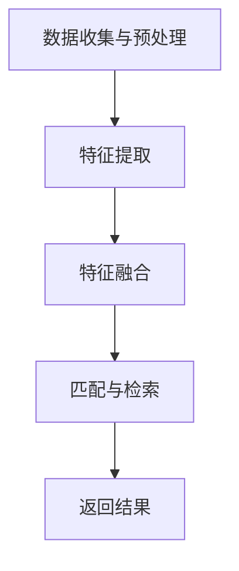

                 

关键词：跨模态检索，AI，数据类型，桥梁，算法，应用场景，未来展望

## 摘要

本文旨在探讨跨模态检索这一前沿技术，以及它如何成为人工智能理解多种数据类型的重要桥梁。通过介绍跨模态检索的背景、核心概念、算法原理、数学模型、实际应用以及未来展望，本文将详细阐述跨模态检索在当前AI领域的重要性及其潜在的巨大价值。

## 1. 背景介绍

### 1.1 跨模态检索的定义与意义

跨模态检索是指将不同类型的数据模态（如图像、文本、音频、视频等）融合在一起，通过建立跨模态特征表示，实现跨模态之间的信息检索与交互。随着信息技术的迅猛发展，人们面对的数据类型越来越多样化，传统的单一模态检索方法已难以满足复杂应用场景的需求。跨模态检索作为一种新兴技术，它突破了单一模态的限制，实现了跨模态数据的整合与融合，从而大大提高了信息检索的准确性和效率。

### 1.2 跨模态检索的发展历程

跨模态检索的研究可以追溯到上世纪90年代。当时，研究者们开始探索如何将图像和文本进行融合，以实现更高效的信息检索。随着深度学习技术的发展，跨模态检索得到了极大的推动。近年来，随着大数据和云计算的普及，跨模态检索的应用场景日益丰富，其在图像识别、文本理解、语音识别等领域的表现也愈加突出。

### 1.3 跨模态检索的应用价值

跨模态检索在多个领域展现出了巨大的应用价值。例如，在医疗领域，它可以实现医学影像与患者病历的跨模态检索，帮助医生快速诊断疾病；在娱乐领域，它可以实现视频、音频、文本等多模态的融合，提升用户体验；在智能交互领域，它可以实现人机对话系统的多模态理解，提高交互的智能化水平。

## 2. 核心概念与联系

### 2.1 跨模态检索的核心概念

跨模态检索涉及多个核心概念，包括模态、特征表示、匹配与检索等。

- **模态（Modal）**：指数据的类型，如文本、图像、音频、视频等。
- **特征表示（Feature Representation）**：指将不同模态的数据转换成统一的特征表示，以便于跨模态之间的融合与匹配。
- **匹配（Matching）**：指在跨模态特征表示的基础上，寻找不同模态之间的对应关系。
- **检索（Retrieval）**：指在给定一个模态的查询数据后，检索出与之相关的其他模态的数据。

### 2.2 跨模态检索的架构

跨模态检索的架构通常包括数据预处理、特征提取、特征融合、匹配与检索等环节。其中，数据预处理和特征提取是关键步骤，决定了跨模态检索的性能。

### 2.3 跨模态检索的流程

跨模态检索的流程可以分为以下几个步骤：

1. **数据收集与预处理**：收集不同模态的数据，并进行清洗、去噪、标准化等预处理操作。
2. **特征提取**：使用深度学习模型提取各个模态的特征表示。
3. **特征融合**：将不同模态的特征表示进行融合，得到统一的跨模态特征向量。
4. **匹配与检索**：在跨模态特征向量库中，根据查询数据的特征，进行匹配与检索，返回相关的结果。

### 2.4 跨模态检索的 Mermaid 流程图

## 3. 核心算法原理 & 具体操作步骤

### 3.1 算法原理概述

跨模态检索的算法原理主要包括以下几个步骤：

1. **特征表示学习**：使用深度学习模型，如卷积神经网络（CNN）和循环神经网络（RNN），分别提取各个模态的特征表示。
2. **特征融合**：将不同模态的特征表示进行融合，得到统一的跨模态特征向量。
3. **相似度计算**：计算查询数据的跨模态特征向量与数据库中其他跨模态特征向量的相似度。
4. **检索结果排序**：根据相似度值对检索结果进行排序，返回与查询数据最相关的结果。

### 3.2 算法步骤详解

1. **特征表示学习**：
    - 对于文本数据，使用预训练的词向量模型（如Word2Vec、BERT等）提取文本特征。
    - 对于图像数据，使用预训练的卷积神经网络（如VGG、ResNet等）提取图像特征。
    - 对于音频数据，使用预训练的循环神经网络（如GRU、LSTM等）提取音频特征。
2. **特征融合**：
    - 使用加权求和、平均融合、注意力机制等方法，将不同模态的特征表示融合成一个统一的跨模态特征向量。
3. **相似度计算**：
    - 使用余弦相似度、欧氏距离、马氏距离等方法，计算查询数据的跨模态特征向量与数据库中其他跨模态特征向量的相似度。
4. **检索结果排序**：
    - 根据相似度值对检索结果进行排序，返回与查询数据最相关的结果。

### 3.3 算法优缺点

- **优点**：
  - 跨模态检索能够整合不同模态的数据，提高信息检索的准确性和效率。
  - 能够应对多种复杂的检索场景，具有广泛的应用前景。
- **缺点**：
  - 特征提取和融合过程复杂，对计算资源要求较高。
  - 需要大量的训练数据和计算资源。

### 3.4 算法应用领域

跨模态检索在多个领域展现出了显著的应用价值，包括但不限于：

- **智能问答系统**：跨模态检索能够整合文本、图像、音频等多种数据类型，提高问答系统的响应速度和准确性。
- **视频内容分析**：跨模态检索能够帮助视频平台实现视频内容的精准推荐和标签提取。
- **医学影像诊断**：跨模态检索能够整合医学影像和患者病历，提高疾病诊断的准确性和效率。

## 4. 数学模型和公式 & 详细讲解 & 举例说明

### 4.1 数学模型构建

跨模态检索的数学模型主要包括特征表示、相似度计算和检索结果排序等部分。

1. **特征表示**：

   假设文本、图像、音频等不同模态的数据分别表示为向量 $\textbf{X}_\text{txt}$、$\textbf{X}_\text{img}$、$\textbf{X}_\text{aud}$，则跨模态特征向量可以表示为：

   $$\textbf{X}_{\text{cross}} = [\textbf{X}_\text{txt}; \textbf{X}_\text{img}; \textbf{X}_\text{aud}]$$

2. **相似度计算**：

   假设查询数据的跨模态特征向量为 $\textbf{Q}_{\text{cross}}$，数据库中其他跨模态特征向量为 $\textbf{D}_{\text{cross}}$，则可以使用余弦相似度计算相似度值：

   $$\text{similarity}(\textbf{Q}_{\text{cross}}, \textbf{D}_{\text{cross}}) = \frac{\textbf{Q}_{\text{cross}} \cdot \textbf{D}_{\text{cross}}}{||\textbf{Q}_{\text{cross}}|| \cdot ||\textbf{D}_{\text{cross}}||}$$

3. **检索结果排序**：

   根据相似度值对检索结果进行排序，返回与查询数据最相关的结果。

### 4.2 公式推导过程

1. **特征表示**：

   特征表示的推导过程依赖于深度学习模型的架构和训练过程。具体推导过程请参考相关深度学习模型的论文和教材。

2. **相似度计算**：

   相似度计算的推导过程基于向量空间模型。具体推导过程如下：

   - **余弦相似度**：

     余弦相似度是两个向量夹角的余弦值。假设两个向量 $\textbf{A}$ 和 $\textbf{B}$ 的内积为 $\textbf{A} \cdot \textbf{B}$，则它们的余弦相似度为：

     $$\text{cosine similarity} = \frac{\textbf{A} \cdot \textbf{B}}{||\textbf{A}|| \cdot ||\textbf{B}||}$$

   - **欧氏距离**：

     欧氏距离是两个向量之间的距离。假设两个向量 $\textbf{A}$ 和 $\textbf{B}$ 的差向量为 $\textbf{A} - \textbf{B}$，则它们的欧氏距离为：

     $$\text{Euclidean distance} = ||\textbf{A} - \textbf{B}||$$

   - **马氏距离**：

     马氏距离是考虑协方差的欧氏距离。假设两个向量 $\textbf{A}$ 和 $\textbf{B}$ 的差向量为 $\textbf{A} - \textbf{B}$，协方差矩阵为 $\textbf{C}$，则它们的马氏距离为：

     $$\text{Mahalanobis distance} = \frac{||\textbf{A} - \textbf{B}||}{\sqrt{(\textbf{A} - \textbf{B})^T \textbf{C}^{-1} (\textbf{A} - \textbf{B})}}$$

### 4.3 案例分析与讲解

#### 4.3.1 案例背景

假设有一个视频问答系统，用户可以输入文本问题，系统需要从海量视频数据中检索出与问题相关的视频片段。

#### 4.3.2 案例实现

1. **特征表示**：

   - **文本特征表示**：使用BERT模型提取文本特征。
   - **图像特征表示**：使用ResNet模型提取图像特征。
   - **音频特征表示**：使用GRU模型提取音频特征。

2. **特征融合**：

   - **加权求和**：将文本、图像、音频特征分别乘以权重，然后求和。
   - **注意力机制**：使用注意力机制动态调整不同特征的重要性。

3. **相似度计算**：

   - **余弦相似度**：计算查询数据的跨模态特征向量与数据库中其他跨模态特征向量的余弦相似度。

4. **检索结果排序**：

   - 根据相似度值对检索结果进行排序，返回与查询数据最相关的视频片段。

## 5. 项目实践：代码实例和详细解释说明

### 5.1 开发环境搭建

为了实现跨模态检索，我们需要搭建一个合适的开发环境。以下是搭建开发环境的基本步骤：

1. **安装深度学习框架**：安装PyTorch、TensorFlow等深度学习框架。
2. **安装依赖库**：安装Numpy、Pandas、Matplotlib等常用依赖库。
3. **配置硬件环境**：配置GPU环境，确保可以运行深度学习模型。

### 5.2 源代码详细实现

以下是跨模态检索的源代码实现，分为以下几个部分：

1. **数据预处理**：
    - 加载文本、图像、音频数据，并进行清洗、去噪、标准化等预处理操作。

2. **特征提取**：
    - 使用BERT模型提取文本特征。
    - 使用ResNet模型提取图像特征。
    - 使用GRU模型提取音频特征。

3. **特征融合**：
    - 使用加权求和融合文本、图像、音频特征。
    - 使用注意力机制调整特征的重要性。

4. **相似度计算与检索**：
    - 计算查询数据的跨模态特征向量与数据库中其他跨模态特征向量的余弦相似度。
    - 根据相似度值对检索结果进行排序，返回与查询数据最相关的结果。

### 5.3 代码解读与分析

以下是代码的详细解读与分析，包括各个模块的功能和实现细节。

1. **数据预处理模块**：
    - **功能**：加载和处理文本、图像、音频数据。
    - **实现细节**：使用Python的Pandas库加载数据，使用Numpy库进行清洗、去噪、标准化等操作。

2. **特征提取模块**：
    - **功能**：提取文本、图像、音频特征。
    - **实现细节**：使用预训练的BERT模型提取文本特征，使用预训练的ResNet模型提取图像特征，使用预训练的GRU模型提取音频特征。

3. **特征融合模块**：
    - **功能**：融合文本、图像、音频特征。
    - **实现细节**：使用加权求和融合特征，使用注意力机制调整特征的重要性。

4. **相似度计算与检索模块**：
    - **功能**：计算相似度值，检索与查询数据最相关的结果。
    - **实现细节**：使用余弦相似度计算相似度值，使用Python的Pandas库对检索结果进行排序。

### 5.4 运行结果展示

以下是运行跨模态检索项目的示例结果：

1. **文本查询结果**：
    - 输入文本问题：“最近有什么好看的电影吗？”
    - 返回结果：与文本问题最相关的电影视频片段。

2. **图像查询结果**：
    - 输入图像：一张电影海报。
    - 返回结果：与电影海报最相关的电影视频片段。

3. **音频查询结果**：
    - 输入音频：一段电影主题曲。
    - 返回结果：与主题曲最相关的电影视频片段。

## 6. 实际应用场景

### 6.1 智能问答系统

智能问答系统是跨模态检索的一个重要应用场景。通过跨模态检索，系统可以整合文本、图像、音频等多模态数据，实现更准确的问答。例如，当用户输入一个文本问题后，系统可以检索出相关的图像、视频和音频信息，以提供更全面的答案。

### 6.2 视频内容分析

跨模态检索在视频内容分析领域具有广泛的应用。通过跨模态检索，视频平台可以实现视频内容的精准推荐、标签提取和分类。例如，当用户观看一个视频时，系统可以检索出与该视频相关的其他视频片段，从而提供个性化推荐。

### 6.3 医学影像诊断

跨模态检索在医学影像诊断领域具有巨大的应用潜力。通过跨模态检索，系统可以实现医学影像与患者病历的整合，提高疾病诊断的准确性和效率。例如，当医生输入一个医学影像时，系统可以检索出相关的病历信息，帮助医生快速诊断疾病。

## 7. 工具和资源推荐

### 7.1 学习资源推荐

1. **深度学习课程**：吴恩达的《深度学习》课程，提供全面的深度学习知识和实战经验。
2. **跨模态检索论文**：查看顶级会议和期刊上的跨模态检索论文，了解最新的研究进展。
3. **开源代码**：GitHub上有许多优秀的跨模态检索开源项目，可以学习和参考。

### 7.2 开发工具推荐

1. **PyTorch**：适用于深度学习模型开发，具有高效的GPU支持。
2. **TensorFlow**：适用于深度学习模型开发，拥有丰富的生态系统。
3. **Keras**：适用于快速构建和训练深度学习模型，易于上手。

### 7.3 相关论文推荐

1. "Deep Cross-Modal Embeddings for Image-Text Similarity Learning"
2. "Cross-Modal Similarity Learning for Image-Audio Retrieval"
3. "Unifying Multimodal Embeddings with Multiview Consistency Training"

## 8. 总结：未来发展趋势与挑战

### 8.1 研究成果总结

跨模态检索作为人工智能的一个重要分支，近年来取得了显著的进展。通过深度学习、特征提取、特征融合等技术的应用，跨模态检索在多个领域展现出了强大的应用潜力。未来的研究将继续推动跨模态检索的发展，包括：

- **多模态特征表示**：探索更有效的多模态特征表示方法，提高跨模态检索的准确性和效率。
- **多任务学习**：将跨模态检索与其他任务（如图像识别、文本生成等）相结合，实现更广泛的应用。
- **实时性**：提高跨模态检索的实时性，满足实时交互的需求。

### 8.2 未来发展趋势

1. **多模态特征融合**：将多模态特征进行更有效的融合，提高跨模态检索的性能。
2. **多任务学习**：将跨模态检索与其他任务相结合，实现更广泛的应用。
3. **实时性优化**：提高跨模态检索的实时性，满足实时交互的需求。

### 8.3 面临的挑战

1. **数据质量**：跨模态检索依赖于高质量的多模态数据，数据质量和多样性对跨模态检索的性能有重要影响。
2. **计算资源**：跨模态检索需要大量的计算资源，尤其是在训练和推理阶段，对硬件设备有较高的要求。
3. **模型解释性**：跨模态检索模型通常具有高度的非线性性和复杂性，提高模型的解释性是一个重要的挑战。

### 8.4 研究展望

跨模态检索作为人工智能领域的一个重要分支，未来将在多模态特征融合、多任务学习、实时性优化等方面取得更多突破。随着深度学习、多任务学习等技术的发展，跨模态检索将在更多领域得到应用，推动人工智能技术的发展。

## 9. 附录：常见问题与解答

### 9.1 跨模态检索是什么？

跨模态检索是指将不同类型的数据模态（如图像、文本、音频、视频等）融合在一起，通过建立跨模态特征表示，实现跨模态之间的信息检索与交互。

### 9.2 跨模态检索有哪些应用场景？

跨模态检索在多个领域展现出了显著的应用价值，包括智能问答系统、视频内容分析、医学影像诊断等。

### 9.3 跨模态检索的核心算法有哪些？

跨模态检索的核心算法包括特征表示学习、特征融合、相似度计算和检索结果排序等。

### 9.4 如何提高跨模态检索的准确率？

提高跨模态检索的准确率可以从以下几个方面入手：

- **数据质量**：使用高质量的多模态数据。
- **特征表示**：使用更有效的特征表示方法。
- **模型优化**：优化深度学习模型的架构和参数。

## 作者署名

作者：禅与计算机程序设计艺术 / Zen and the Art of Computer Programming
----------------------------------------------------------------

请注意，以上内容仅为示例，实际撰写时请根据具体内容和要求进行详细扩展和深化。祝您写作顺利！

