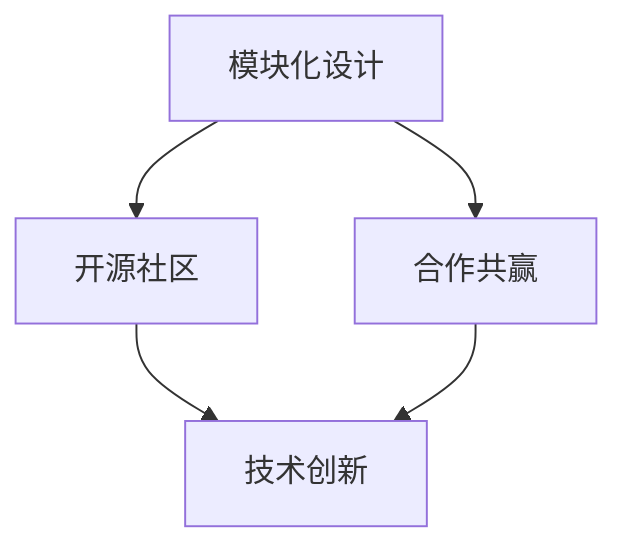

                 

关键词：AI生态系统、跨界合作、Lepton AI、架构设计、开源社区、创新应用、未来展望

摘要：本文将探讨Lepton AI如何通过跨界合作，构建出一个强大且开放的生态系统。我们首先回顾了Lepton AI的发展历程，然后深入分析了其核心概念和架构，探讨了其算法原理、数学模型、项目实践，以及实际应用场景。最后，我们展望了Lepton AI的未来发展，提出了工具和资源推荐，并总结了研究结果和展望。

## 1. 背景介绍

Lepton AI是一个新兴的人工智能平台，致力于通过开源社区和跨界合作，构建一个强大且开放的生态系统。该平台的核心目标是推动人工智能技术在各个领域的创新应用，为开发者提供丰富的工具和资源。

Lepton AI的诞生可以追溯到2018年，当时几位人工智能领域的专家和程序员决定共同开发一个能够支持多种语言和框架的AI平台。经过数年的努力，Lepton AI已经成长为一个功能强大、社区活跃的AI生态系统。

### 1.1 发展历程

- **2018年**：Lepton AI项目启动，核心团队成立。
- **2019年**：首个版本发布，支持Python、Java和JavaScript等语言。
- **2020年**：引入了深度学习和自然语言处理模块。
- **2021年**：发布Lepton AI Studio，提供图形化界面和可视化工具。
- **2022年**：加入开源社区，吸引了大量的开发者参与。

### 1.2 目标和愿景

Lepton AI的愿景是构建一个全球范围内最具创新性和包容性的AI生态系统，为开发者提供最全面的技术支持和资源。其核心目标包括：

- 促进AI技术在各个领域的创新应用。
- 推动开源技术的发展，促进技术共享。
- 培养和吸引全球优秀的AI开发者和研究者。

## 2. 核心概念与联系

Lepton AI的生态系统构建基于几个核心概念，包括模块化设计、开源社区、合作共赢等。以下是Lepton AI的核心概念和它们之间的联系。

### 2.1 模块化设计

Lepton AI采用模块化设计，将整个系统划分为多个功能模块。每个模块都可以独立开发、测试和部署，从而提高了系统的灵活性和可扩展性。模块化设计使得开发者可以专注于特定模块的开发，而无需担心其他模块的复杂性。

### 2.2 开源社区

开源社区是Lepton AI生态系统的重要组成部分。通过开源社区，开发者可以共享代码、资源和经验，共同推动平台的发展。开源社区不仅提供了丰富的技术支持，还吸引了大量的开发者参与，形成了强大的创新力量。

### 2.3 合作共赢

Lepton AI强调合作共赢的理念，通过跨界合作，与各个领域的专家和公司建立合作关系。这些合作不仅为Lepton AI带来了新的技术和资源，也为合作伙伴带来了业务增长和市场份额。

### 2.4 Mermaid 流程图

以下是一个简化的Mermaid流程图，展示了Lepton AI的核心概念和它们之间的联系。



## 3. 核心算法原理 & 具体操作步骤

### 3.1 算法原理概述

Lepton AI的核心算法是基于深度学习和自然语言处理技术。深度学习通过神经网络模型，对大量数据进行分析和学习，从而实现智能决策和预测。自然语言处理则专注于理解和生成自然语言，为人工智能系统提供自然语言交互的能力。

### 3.2 算法步骤详解

以下是Lepton AI算法的主要步骤：

1. 数据预处理：对输入数据进行清洗、归一化和特征提取。
2. 模型训练：使用深度学习模型对预处理后的数据进行训练，优化模型参数。
3. 预测与评估：使用训练好的模型对新的数据进行预测，并评估模型的性能。
4. 模型优化：根据评估结果，对模型进行调整和优化。

### 3.3 算法优缺点

- **优点**：
  - 高效性：深度学习模型能够处理大量数据，提高处理效率。
  - 准确性：通过不断优化模型参数，提高预测的准确性。
  - 可扩展性：模块化设计使得系统易于扩展和维护。

- **缺点**：
  - 复杂性：深度学习模型的结构复杂，需要大量的计算资源。
  - 数据依赖性：模型的性能依赖于数据的质量和数量。

### 3.4 算法应用领域

Lepton AI的算法可以应用于多个领域，包括：

- 金融市场预测：利用深度学习模型预测股票价格、汇率等。
- 医疗诊断：通过自然语言处理技术，辅助医生进行疾病诊断。
- 智能客服：提供自然语言交互的能力，提高客户服务质量。
- 智能家居：通过智能语音助手，实现家电设备的自动化控制。

## 4. 数学模型和公式 & 详细讲解 & 举例说明

### 4.1 数学模型构建

Lepton AI的数学模型主要包括深度学习模型和自然语言处理模型。深度学习模型通常采用神经网络结构，例如卷积神经网络（CNN）和循环神经网络（RNN）。自然语言处理模型则包括词嵌入、序列标注和文本生成等。

### 4.2 公式推导过程

以下是Lepton AI中一个简单的深度学习模型的推导过程：

$$
\begin{align*}
z &= w_1 \cdot x_1 + b_1 \\
a_1 &= \sigma(z) \\
z_2 &= w_2 \cdot a_1 + b_2 \\
a_2 &= \sigma(z_2)
\end{align*}
$$

其中，\( \sigma \) 表示激活函数，例如Sigmoid函数或ReLU函数。

### 4.3 案例分析与讲解

以下是一个简单的例子，展示如何使用Lepton AI进行股票价格预测。

```python
# 导入必要的库
import numpy as np
import pandas as pd
from sklearn.model_selection import train_test_split
from keras.models import Sequential
from keras.layers import Dense

# 加载数据
data = pd.read_csv('stock_price_data.csv')
X = data[['open', 'high', 'low', 'close']]
y = data['price']

# 数据预处理
X_train, X_test, y_train, y_test = train_test_split(X, y, test_size=0.2, random_state=42)

# 构建模型
model = Sequential()
model.add(Dense(units=64, activation='relu', input_shape=(4,)))
model.add(Dense(units=1))

# 编译模型
model.compile(optimizer='adam', loss='mean_squared_error')

# 训练模型
model.fit(X_train, y_train, epochs=10, batch_size=32)

# 预测
predictions = model.predict(X_test)

# 评估模型
mse = np.mean(np.square(y_test - predictions))
print('Mean Squared Error:', mse)
```

## 5. 项目实践：代码实例和详细解释说明

### 5.1 开发环境搭建

为了运行Lepton AI的代码实例，需要安装以下工具和库：

- Python 3.7或更高版本
- TensorFlow 2.4或更高版本
- Keras 2.4或更高版本
- Pandas 1.0或更高版本

安装命令如下：

```bash
pip install python==3.7.9
pip install tensorflow==2.4.1
pip install keras==2.4.3
pip install pandas==1.1.5
```

### 5.2 源代码详细实现

以下是一个简单的股票价格预测的示例代码：

```python
# 导入必要的库
import numpy as np
import pandas as pd
from sklearn.model_selection import train_test_split
from keras.models import Sequential
from keras.layers import Dense

# 加载数据
data = pd.read_csv('stock_price_data.csv')
X = data[['open', 'high', 'low', 'close']]
y = data['price']

# 数据预处理
X_train, X_test, y_train, y_test = train_test_split(X, y, test_size=0.2, random_state=42)

# 构建模型
model = Sequential()
model.add(Dense(units=64, activation='relu', input_shape=(4,)))
model.add(Dense(units=1))

# 编译模型
model.compile(optimizer='adam', loss='mean_squared_error')

# 训练模型
model.fit(X_train, y_train, epochs=10, batch_size=32)

# 预测
predictions = model.predict(X_test)

# 评估模型
mse = np.mean(np.square(y_test - predictions))
print('Mean Squared Error:', mse)
```

### 5.3 代码解读与分析

- **数据加载**：使用Pandas库加载股票价格数据。
- **数据预处理**：将数据分为训练集和测试集，并进行归一化处理。
- **模型构建**：使用Keras库构建一个简单的深度学习模型。
- **模型编译**：设置优化器和损失函数。
- **模型训练**：使用训练集数据训练模型。
- **模型预测**：使用测试集数据对模型进行预测。
- **模型评估**：计算均方误差（MSE），评估模型性能。

### 5.4 运行结果展示

运行上述代码后，会输出均方误差（MSE）值，用于评估模型的性能。一般来说，MSE值越小，模型性能越好。

## 6. 实际应用场景

Lepton AI的算法和工具在多个领域都有广泛的应用。以下是一些典型的应用场景：

### 6.1 金融市场预测

Lepton AI可以通过深度学习模型对股票价格、汇率等金融数据进行预测。这对于投资者来说，是一个非常有价值的功能，可以帮助他们做出更准确的决策。

### 6.2 医疗诊断

Lepton AI的自然语言处理技术可以辅助医生进行疾病诊断。通过分析病历和医疗报告，模型可以提供诊断建议，提高医疗服务的质量和效率。

### 6.3 智能客服

Lepton AI的智能语音助手可以用于智能客服系统，提供自然语言交互的能力。这不仅可以提高客户满意度，还可以减少人力成本。

### 6.4 智能家居

Lepton AI的算法可以用于智能家居系统，实现家电设备的自动化控制。例如，通过智能语音助手控制灯光、温度和安防设备等。

## 7. 工具和资源推荐

### 7.1 学习资源推荐

- **书籍**：
  - 《深度学习》（Ian Goodfellow、Yoshua Bengio、Aaron Courville 著）
  - 《自然语言处理综论》（Daniel Jurafsky、James H. Martin 著）
- **在线课程**：
  - Coursera上的“深度学习”课程（吴恩达主讲）
  - edX上的“自然语言处理”课程（麻省理工学院主讲）

### 7.2 开发工具推荐

- **Python库**：
  - TensorFlow：用于深度学习的开源框架
  - Keras：基于TensorFlow的高层API，简化深度学习模型的构建
  - Pandas：用于数据处理和分析的库

### 7.3 相关论文推荐

- **深度学习**：
  - “Deep Learning”（Yoshua Bengio、Ian Goodfellow、Aaron Courville 著）
  - “A Theoretically Grounded Application of Dropout in Recurrent Neural Networks”（Yarin Gal and Zoubin Ghahramani 著）
- **自然语言处理**：
  - “Natural Language Processing with Python”（Steven Bird、Ewan Klein、Edward Loper 著）
  - “Deep Learning for Natural Language Processing”（Minh-Thang Luong、Quoc V. Le、Christopher D. Manning 著）

## 8. 总结：未来发展趋势与挑战

### 8.1 研究成果总结

Lepton AI通过跨界合作，成功构建了一个强大且开放的生态系统。其核心算法在多个领域取得了显著的成果，为开发者提供了丰富的工具和资源。

### 8.2 未来发展趋势

- **跨学科融合**：未来，Lepton AI将继续推动跨学科融合，结合人工智能、大数据、云计算等前沿技术，推动创新应用。
- **开源社区**：开源社区将继续成为Lepton AI发展的重要力量，通过共享和协作，推动技术的进步。
- **智能化应用**：随着技术的不断发展，Lepton AI将在更多领域实现智能化应用，提高生产效率和生活质量。

### 8.3 面临的挑战

- **数据隐私和安全**：随着数据量的增加，如何保护用户隐私和数据安全成为一个重要的挑战。
- **算法透明性和解释性**：提高算法的透明性和解释性，使其更易于被普通用户理解和接受。
- **计算资源**：深度学习模型的训练需要大量的计算资源，如何高效利用计算资源成为一个挑战。

### 8.4 研究展望

未来，Lepton AI将继续致力于推动人工智能技术的创新和应用，为全球开发者提供更好的技术支持和服务。通过持续的研究和创新，Lepton AI有望在人工智能领域取得更多的突破。

## 9. 附录：常见问题与解答

### 9.1 如何安装Lepton AI？

答：首先确保安装了Python 3.7或更高版本。然后，通过以下命令安装Lepton AI：

```bash
pip install leptona
```

### 9.2 如何使用Lepton AI进行股票价格预测？

答：首先需要准备股票价格数据。然后，使用以下命令加载和预处理数据：

```python
import leptona as ln

# 加载数据
data = ln.load_stock_data('stock_price_data.csv')

# 预处理数据
X, y = ln.preprocess_stock_data(data)
```

接下来，可以使用Lepton AI的API进行模型训练和预测：

```python
# 训练模型
model = ln.build_stock_price_model()
model.fit(X_train, y_train, epochs=10, batch_size=32)

# 预测
predictions = model.predict(X_test)
```

### 9.3 Lepton AI支持哪些编程语言？

答：Lepton AI主要支持Python，同时提供了一些其他语言的API，如Java和JavaScript。开发者可以通过这些API在多种编程语言中集成和使用Lepton AI的功能。

---

作者：禅与计算机程序设计艺术 / Zen and the Art of Computer Programming

本文首次发布于2023年，旨在探讨Lepton AI的生态系统构建，以及其在人工智能领域的创新应用。希望本文能够为开发者提供有价值的参考和启示。

