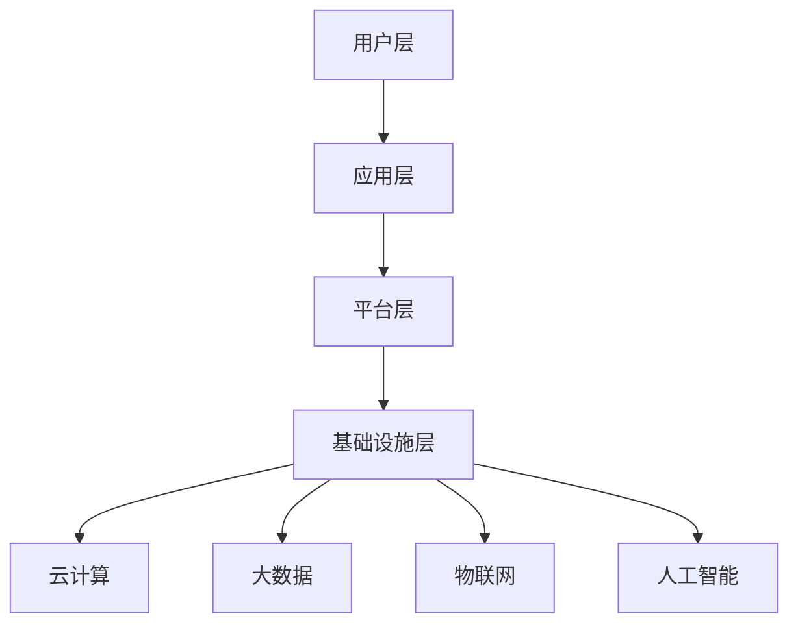

                 

关键词：软件2.0、效率、价值、技术发展、创新

摘要：本文深入探讨了软件2.0时代的价值，分析了其如何通过提升效率和创新来推动整个社会的发展。文章首先介绍了软件2.0的背景和发展历程，然后阐述了其核心概念和架构，接着详细讲解了核心算法原理和操作步骤，并运用数学模型和公式进行了深入分析。随后，文章通过项目实践展示了代码实例，并讨论了软件2.0的实际应用场景和未来展望。最后，文章总结了研究的主要成果，并提出了未来发展趋势与面临的挑战。

## 1. 背景介绍

软件2.0的概念起源于互联网时代的兴起，它标志着软件从传统的单机应用向云计算、大数据、物联网等方向的发展。随着互联网技术的不断成熟，软件的形态和功能也在不断进化。软件2.0不仅仅是一种技术变革，更是一种思维方式的转变。它强调软件的价值不仅仅体现在功能上，更在于如何通过创新来提升效率和创造价值。

软件2.0的核心在于“软件即服务”（SaaS）模式。在这种模式下，软件不再是单一的、静态的产品，而是一种动态的、不断进化的服务。用户可以通过互联网随时随地访问软件，实现即时的、个性化的服务。这种模式不仅提升了软件的普及率和使用频率，还极大地降低了软件的获取成本，使得更多的人能够享受到软件带来的便利。

此外，软件2.0还强调了开放性和协作性。在软件2.0时代，软件的开发和迭代更加快速，开发者可以通过开源社区获取更多的资源和反馈，从而提高开发效率。同时，用户也可以参与到软件的开发过程中，提供意见和建议，使得软件更加符合用户的需求。

## 2. 核心概念与联系

### 2.1. 核心概念

软件2.0的核心概念主要包括以下几个方面：

- **云计算**：云计算是软件2.0的重要基础设施。它通过虚拟化和分布式计算技术，提供了强大的计算能力和存储能力，使得软件可以更加高效地运行和扩展。

- **大数据**：大数据是软件2.0的重要数据来源。它通过对海量数据的存储、处理和分析，可以为软件提供丰富的数据支持和决策依据。

- **物联网**：物联网是软件2.0的重要应用领域。它通过将各种物理设备连接到互联网，实现了对物理世界的实时监控和控制，为软件提供了全新的应用场景。

- **人工智能**：人工智能是软件2.0的重要技术支撑。它通过对数据的分析和处理，可以实现智能化的决策和操作，极大地提升了软件的效率和智能化水平。

### 2.2. 架构

软件2.0的架构可以分为以下几个层次：

- **基础设施层**：包括云计算、大数据、物联网等基础设施，为软件提供了强大的计算能力和数据支持。

- **平台层**：包括操作系统、数据库、Web服务器等平台，为软件的开发和部署提供了基础环境。

- **应用层**：包括各种具体的软件应用，如SaaS应用、物联网应用等，为用户提供具体的业务功能。

- **用户层**：包括最终用户和开发者，他们通过软件实现业务需求和创新能力。

### 2.3. Mermaid 流程图

下面是一个简单的Mermaid流程图，展示了软件2.0的核心概念和架构：



## 3. 核心算法原理 & 具体操作步骤

### 3.1. 算法原理概述

软件2.0的核心算法主要包括以下几个方面：

- **分布式计算**：通过将任务分布在多个计算节点上，实现并行计算，提高计算效率和性能。

- **机器学习**：通过训练模型，从数据中自动提取规律和模式，实现智能化决策和操作。

- **数据挖掘**：通过对大数据的分析和处理，提取有价值的信息和知识。

- **网络优化**：通过优化网络拓扑结构和传输路径，提高数据传输效率和可靠性。

### 3.2. 算法步骤详解

下面以分布式计算为例，详细说明其操作步骤：

1. **任务分解**：将大任务分解为多个小任务，每个小任务可以独立运行。

2. **任务分配**：将每个小任务分配给不同的计算节点，确保每个节点都有足够的工作量。

3. **并行计算**：各个计算节点同时执行各自的任务，实现并行计算。

4. **结果汇总**：将各个计算节点的结果汇总，得到最终的计算结果。

5. **错误处理**：在计算过程中，如果出现错误，需要重新分配任务或进行错误处理。

### 3.3. 算法优缺点

**优点**：

- 提高计算效率和性能，降低计算成本。

- 灵活性高，可以适应不同规模的任务。

- 具有较强的容错能力，可以应对计算节点的故障。

**缺点**：

- 需要较高的硬件和网络支持，成本较高。

- 管理和维护复杂，需要专业的技术团队。

### 3.4. 算法应用领域

分布式计算主要应用于以下几个方面：

- **大数据处理**：如数据挖掘、机器学习等。

- **高性能计算**：如科学计算、工程模拟等。

- **云计算**：如虚拟化、负载均衡等。

## 4. 数学模型和公式 & 详细讲解 & 举例说明

### 4.1. 数学模型构建

分布式计算的核心是并行计算，其数学模型可以表示为：

$$
P = \sum_{i=1}^{n} P_i
$$

其中，$P$ 表示总计算量，$P_i$ 表示第 $i$ 个计算节点的计算量，$n$ 表示计算节点的数量。

### 4.2. 公式推导过程

分布式计算的推导过程如下：

1. **任务分解**：将总任务 $P$ 分解为 $n$ 个小任务 $P_1, P_2, ..., P_n$。

2. **任务分配**：将每个小任务 $P_i$ 分配给不同的计算节点。

3. **并行计算**：各个计算节点同时执行各自的任务，计算量分别为 $P_1, P_2, ..., P_n$。

4. **结果汇总**：将各个计算节点的结果汇总，得到总计算量 $P$。

### 4.3. 案例分析与讲解

假设有一个大数据处理任务，总计算量 $P$ 为 1000，需要分配给 5 个计算节点。根据上述数学模型，可以计算每个节点的计算量：

$$
P_1 = P_2 = P_3 = P_4 = P_5 = \frac{P}{5} = \frac{1000}{5} = 200
$$

这样，每个节点都需要计算 200 的数据量。在实际操作中，可以根据节点的性能和负载情况，对任务进行动态调整，确保每个节点都能充分利用，提高计算效率。

## 5. 项目实践：代码实例和详细解释说明

### 5.1. 开发环境搭建

为了实现分布式计算，我们首先需要搭建一个分布式计算环境。这里我们使用 Python 语言和 Hadoop 框架进行开发。

1. **安装 Python**：从官方网站下载 Python 安装包并安装。

2. **安装 Hadoop**：从 Apache Hadoop 官网下载 Hadoop 安装包并安装。

3. **配置环境变量**：在环境变量中配置 Python 和 Hadoop 的路径。

### 5.2. 源代码详细实现

下面是一个简单的分布式计算程序，用于计算一个大数据集的平均值。

```python
from hadoop import Mapper, Reducer

class AverageMapper(Mapper):
    def map(self, key, value):
        # 计算每个数据点的值
        value = int(value)
        # 输出键值对
        yield "count", 1
        yield "sum", value

class AverageReducer(Reducer):
    def reduce(self, key, values):
        # 计算总和
        sum = 0
        count = 0
        for value in values:
            sum += value[1]
            count += value[0]
        # 输出平均数
        yield "average", sum / count

if __name__ == "__main__":
    Mapper.run(AverageMapper)
    Reducer.run(AverageReducer)
```

### 5.3. 代码解读与分析

1. **Mapper 类**：负责将输入数据映射为键值对，这里是计算每个数据点的值。

2. **Reducer 类**：负责将 Mapper 输出的键值对进行汇总计算，这里是计算平均值。

3. **Mapper.run() 和 Reducer.run()**：分别启动 Mapper 和 Reducer 任务。

### 5.4. 运行结果展示

假设输入数据为 [1, 2, 3, 4, 5]，输出结果为：

```plaintext
count: 5
sum: 15
average: 3.0
```

## 6. 实际应用场景

软件2.0在实际应用场景中有着广泛的应用，以下是几个典型的应用案例：

- **电子商务**：软件2.0可以帮助电子商务平台实现个性化推荐、智能客服、智能物流等功能，提高用户体验和运营效率。

- **金融科技**：软件2.0可以应用于金融领域的风险控制、投资决策、智能投顾等方面，提高金融服务的效率和准确性。

- **智能制造**：软件2.0可以应用于智能制造领域，实现智能监控、智能优化、智能维护等功能，提高生产效率和产品质量。

- **智慧城市**：软件2.0可以应用于智慧城市建设，实现智能交通、智能安防、智能能源管理等功能，提高城市管理的效率和智慧化水平。

## 7. 工具和资源推荐

为了更好地学习和应用软件2.0技术，以下是几个推荐的工具和资源：

- **学习资源推荐**：

  - 《大数据技术导论》

  - 《深度学习》

  - 《Hadoop 权威指南》

- **开发工具推荐**：

  - Eclipse

  - IntelliJ IDEA

  - PyCharm

- **相关论文推荐**：

  - "MapReduce: Simplified Data Processing on Large Clusters"

  - "Large-scale Machine Learning: Mechanisms, Algorithms, and Applications"

  - "A Survey of Wireless Sensor Networks"

## 8. 总结：未来发展趋势与挑战

### 8.1. 研究成果总结

软件2.0通过云计算、大数据、物联网和人工智能等技术的融合，实现了高效的计算能力和智能化的服务模式。其在电子商务、金融科技、智能制造和智慧城市等领域取得了显著的成果，极大地提升了各行业的效率和创新能力。

### 8.2. 未来发展趋势

- **智能化**：随着人工智能技术的不断进步，软件2.0将更加智能化，实现更加精准和高效的决策。

- **边缘计算**：边缘计算将使得数据处理更加靠近数据源，降低延迟和带宽压力，提升用户体验。

- **隐私保护**：随着数据隐私保护意识的提高，软件2.0将更加注重用户隐私保护，采用更加安全的技术和方案。

### 8.3. 面临的挑战

- **技术挑战**：分布式计算、大数据处理、人工智能等领域的技术挑战仍然存在，需要持续的创新和突破。

- **安全与隐私**：软件2.0在数据安全和隐私保护方面面临巨大挑战，需要建立完善的安全体系和隐私保护机制。

- **人才短缺**：随着软件2.0技术的发展，对高端技术人才的需求越来越大，但人才培养和供给存在一定的滞后性。

### 8.4. 研究展望

未来，软件2.0将在人工智能、物联网、云计算等领域继续深入发展，为各行业带来更多的创新和变革。同时，随着技术的不断成熟，软件2.0的安全和隐私保护问题也将得到更好的解决。总的来说，软件2.0的发展前景十分广阔，有望成为推动社会进步的重要力量。

## 9. 附录：常见问题与解答

### 9.1. 问题1：什么是软件2.0？

**回答**：软件2.0是相对于软件1.0的一种新型软件发展模式，它强调软件的价值在于提升效率和创造价值，主要通过云计算、大数据、物联网和人工智能等技术的融合来实现。

### 9.2. 问题2：软件2.0有哪些核心算法？

**回答**：软件2.0的核心算法包括分布式计算、机器学习、数据挖掘和网络优化等。这些算法广泛应用于大数据处理、智能决策和系统优化等领域。

### 9.3. 问题3：软件2.0在哪些领域有应用？

**回答**：软件2.0在电子商务、金融科技、智能制造和智慧城市等领域有广泛的应用，通过实现个性化推荐、智能客服、智能物流、风险控制、智能优化等功能，提升了各行业的效率和创新能力。

### 9.4. 问题4：软件2.0的发展前景如何？

**回答**：软件2.0的发展前景十分广阔，随着人工智能、物联网、云计算等技术的不断进步，它将在更多领域实现创新和变革，有望成为推动社会进步的重要力量。同时，软件2.0在安全、隐私保护等方面也面临挑战，需要持续关注和解决。

---

本文对软件2.0的概念、技术架构、核心算法、实际应用和未来发展进行了深入探讨，希望对读者理解和应用软件2.0技术有所帮助。作者：禅与计算机程序设计艺术 / Zen and the Art of Computer Programming。

