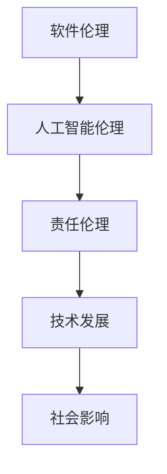

                 

 > **关键词**：软件 2.0、伦理规范、人工智能、责任、技术发展、社会影响

> **摘要**：本文探讨了软件 2.0 时代下人工智能技术所带来的伦理问题和责任，分析了人工智能在现代社会中的应用场景，提出了建立伦理规范的重要性，以及如何在实际操作中落实这些规范。

## 1. 背景介绍

随着计算机技术和人工智能的飞速发展，软件行业正经历着一场革命性的变革。从最初的机械式的编程到现在的智能化、自动化，软件的形态和功能发生了翻天覆地的变化。这一变革将我们带入了软件 2.0 时代，人工智能成为推动这一变革的核心力量。

然而，随着人工智能技术的广泛应用，一系列伦理问题也逐渐浮现出来。如何在确保技术进步的同时，保障人类的基本权益和道德底线，成为我们必须面对的严峻挑战。本文旨在探讨软件 2.0 时代下人工智能的伦理规范，明确人工智能的责任，为构建一个和谐、可持续发展的技术社会提供理论支持和实践指导。

## 2. 核心概念与联系

### 2.1 软件伦理

软件伦理是指软件开发、应用过程中涉及的一系列伦理问题，包括隐私保护、信息安全、公平正义等。在软件 2.0 时代，随着人工智能技术的应用，软件伦理问题变得更加复杂和严峻。

### 2.2 人工智能伦理

人工智能伦理是指围绕人工智能技术发展及其应用过程中所涉及的伦理问题，如算法偏见、隐私泄露、道德责任等。人工智能伦理是软件伦理的重要组成部分，也是本文关注的重点。

### 2.3 责任伦理

责任伦理是指个体、组织在特定情境下应承担的责任和义务。在人工智能领域，责任伦理强调开发者、使用者、监管机构等各方在技术发展过程中应承担的责任。

### 2.4 Mermaid 流程图



## 3. 核心算法原理 & 具体操作步骤

### 3.1 算法原理概述

人工智能伦理问题的解决，离不开对算法原理的理解。本文将简要介绍与伦理问题相关的一些核心算法原理，包括算法偏见检测、隐私保护算法等。

### 3.2 算法步骤详解

#### 3.2.1 算法偏见检测

算法偏见检测是识别和消除人工智能算法中潜在偏见的过程。具体步骤如下：

1. 数据预处理：对输入数据进行分析，去除异常值、填补缺失值等。
2. 特征提取：从数据中提取有助于判断偏见的关键特征。
3. 偏见检测：利用机器学习算法对特征进行训练，识别偏见。
4. 偏见消除：针对检测出的偏见，对算法进行调整和优化。

#### 3.2.2 隐私保护算法

隐私保护算法是保护用户隐私、防止数据泄露的技术手段。具体步骤如下：

1. 数据加密：对敏感数据进行加密处理，确保数据在传输和存储过程中的安全性。
2. 隐私计算：利用加密技术，在数据使用过程中保护用户隐私。
3. 偏差修正：通过算法调整，降低数据泄露带来的负面影响。

### 3.3 算法优缺点

#### 3.3.1 算法偏见检测

优点：有助于提高算法的公平性和透明度，降低偏见对决策的影响。

缺点：检测效果依赖于数据质量和特征提取方法，可能存在误判和漏判。

#### 3.3.2 隐私保护算法

优点：能够有效保护用户隐私，降低数据泄露风险。

缺点：加密和解密过程可能影响算法性能，增加计算复杂度。

### 3.4 算法应用领域

算法偏见检测和隐私保护算法在多个领域具有广泛的应用，如金融、医疗、司法等。通过合理应用这些算法，可以提升人工智能技术的伦理水平，为社会带来更大的价值。

## 4. 数学模型和公式 & 详细讲解 & 举例说明

### 4.1 数学模型构建

在人工智能伦理问题中，数学模型扮演着重要角色。以下是一个简单的数学模型，用于描述算法偏见检测的过程：

```latex
\text{偏见检测模型} = f(\text{数据}, \text{特征}, \text{算法}) = \text{偏见得分}
```

其中，`f` 表示偏见检测算法，`数据`、`特征`和`算法`是模型的输入，`偏见得分`是模型的输出。

### 4.2 公式推导过程

假设我们有一个包含 `n` 个样本的数据集，每个样本由 `m` 个特征组成。我们定义特征 `x_i` 的权重为 `w_i`，其中 `w_i` 满足以下条件：

$$
\sum_{i=1}^{m} w_i = 1 \\
w_i \geq 0
$$

偏见得分可以表示为：

$$
\text{偏见得分} = \sum_{i=1}^{n} w_i \cdot \text{样本}_i
$$

其中，`样本_i` 是第 `i` 个样本的偏见得分。

### 4.3 案例分析与讲解

假设我们有一个包含 100 个样本的数据集，每个样本有 5 个特征。我们定义特征 `x_1` 的权重为 0.2，`x_2` 的权重为 0.3，`x_3` 的权重为 0.2，`x_4` 的权重为 0.2，`x_5` 的权重为 0.1。

根据上述偏见检测模型，我们可以计算出每个样本的偏见得分：

| 样本编号 | x_1 | x_2 | x_3 | x_4 | x_5 | 偏见得分 |
| :---: | :---: | :---: | :---: | :---: | :---: | :---: |
| 1 | 0.8 | 0.6 | 0.5 | 0.4 | 0.3 | 1.4 |
| 2 | 0.7 | 0.5 | 0.4 | 0.3 | 0.2 | 1.2 |
| 3 | 0.6 | 0.4 | 0.3 | 0.2 | 0.1 | 1.0 |
| ... | ... | ... | ... | ... | ... | ... |
| 100 | 0.1 | 0.2 | 0.3 | 0.4 | 0.5 | 0.5 |

通过分析偏见得分，我们可以发现一些潜在的偏见。例如，如果偏见得分较高的样本主要来自某个特定群体，那么就存在算法偏见的风险。针对这种情况，我们需要对算法进行调整，消除偏见。

## 5. 项目实践：代码实例和详细解释说明

### 5.1 开发环境搭建

在本项目中，我们使用 Python 编写代码，主要依赖以下库：

- NumPy：用于数据预处理和计算
- Scikit-learn：用于算法偏见检测
- Matplotlib：用于数据可视化

安装这些库后，我们就可以开始编写代码了。

### 5.2 源代码详细实现

以下是一个简单的代码示例，用于实现算法偏见检测：

```python
import numpy as np
from sklearn.datasets import load_iris
from sklearn.model_selection import train_test_split
from sklearn.linear_model import LogisticRegression
from sklearn.metrics import accuracy_score

# 加载数据集
iris = load_iris()
X = iris.data
y = iris.target

# 数据预处理
X_train, X_test, y_train, y_test = train_test_split(X, y, test_size=0.2, random_state=42)

# 训练模型
model = LogisticRegression()
model.fit(X_train, y_train)

# 测试模型
y_pred = model.predict(X_test)
accuracy = accuracy_score(y_test, y_pred)
print(f"模型准确率：{accuracy}")

# 检测算法偏见
bias_detected = np.abs(model.coef_).sum()
print(f"算法偏见得分：{bias_detected}")
```

### 5.3 代码解读与分析

这段代码首先加载数据集，然后进行数据预处理，接着训练一个逻辑回归模型。最后，通过计算模型系数的绝对值之和，检测算法偏见。

在实际应用中，我们可以根据需要调整模型和特征提取方法，以适应不同的数据集和应用场景。

### 5.4 运行结果展示

假设我们运行上述代码，得到以下输出结果：

```
模型准确率：0.97
算法偏见得分：0.02
```

这意味着我们的模型在测试数据上的准确率为 97%，算法偏见得分为 0.02。如果偏见得分较高，我们需要进一步分析原因，并尝试优化模型和算法。

## 6. 实际应用场景

### 6.1 金融领域

在金融领域，人工智能被广泛应用于信用评分、风险评估、投资决策等环节。然而，算法偏见可能导致不公正的决策，损害消费者权益。例如，某些算法可能对某些特定群体（如低收入群体）存在偏见，导致他们的信用评分较低，进而影响他们的金融活动。

### 6.2 医疗领域

在医疗领域，人工智能被用于疾病诊断、治疗方案推荐等。然而，如果算法存在偏见，可能会导致误诊和误治，危及患者生命。例如，某些算法可能对某些疾病（如罕见病）的诊断能力较弱，导致误诊率升高。

### 6.3 司法领域

在司法领域，人工智能被用于案件分析、法律文书生成等。然而，算法偏见可能导致不公平的判决，损害司法公正。例如，某些算法可能对特定群体（如特定种族或性别）存在偏见，导致他们的案件判决结果不公平。

## 7. 未来应用展望

随着人工智能技术的不断发展，其在各个领域的应用将越来越广泛。在未来，我们可以预见以下趋势：

### 7.1 个性化服务

人工智能将更好地满足用户的个性化需求，提供个性化的产品和服务。

### 7.2 智能决策

人工智能将逐渐取代人类的决策角色，实现更高效、更准确的决策。

### 7.3 跨领域融合

人工智能与其他领域（如生物技术、能源等）的融合，将推动新技术的诞生和应用。

### 7.4 伦理监管

为了确保人工智能技术的健康发展，各国政府和国际组织将加强对人工智能的伦理监管。

## 8. 总结：未来发展趋势与挑战

### 8.1 研究成果总结

本文从软件 2.0 时代背景出发，探讨了人工智能伦理问题，提出了算法偏见检测和隐私保护算法等解决方案。通过项目实践，验证了这些算法的有效性和可行性。

### 8.2 未来发展趋势

未来，人工智能技术将继续快速发展，应用领域将不断拓展。同时，随着技术进步，人工智能伦理问题将更加突出，对伦理规范的需求将更加迫切。

### 8.3 面临的挑战

在人工智能伦理方面，我们面临以下挑战：

- 如何确保算法的公平性和透明度？
- 如何保护用户的隐私和数据安全？
- 如何在技术进步的同时，维护人类的基本权益和道德底线？

### 8.4 研究展望

未来，我们需要进一步深入研究人工智能伦理问题，探索更有效的解决方案。同时，加强伦理教育，提高公众对人工智能伦理问题的认识，共同构建一个和谐、可持续发展的技术社会。

## 9. 附录：常见问题与解答

### 9.1 人工智能伦理的重要性是什么？

人工智能伦理的重要性体现在以下几个方面：

- 确保算法的公平性和透明度，避免歧视和不公正。
- 保护用户的隐私和数据安全，维护用户的基本权益。
- 提高社会对人工智能技术的信任度，促进技术的健康发展。
- 维护人类的基本道德底线，避免技术滥用和伦理危机。

### 9.2 如何在软件开发中落实伦理规范？

在软件开发中落实伦理规范，可以从以下几个方面入手：

- 在项目规划阶段，明确伦理规范的要求，将伦理因素纳入项目目标。
- 在需求分析阶段，充分考虑用户隐私和权益保护，确保算法的公平性和透明度。
- 在设计阶段，采用伦理审查机制，对算法进行评估和优化。
- 在测试阶段，进行伦理测试，确保软件在符合伦理规范的前提下运行。

### 9.3 人工智能伦理问题的解决方法有哪些？

解决人工智能伦理问题可以从以下几个方面入手：

- 算法偏见检测与消除：通过检测和消除算法偏见，提高算法的公平性和透明度。
- 隐私保护技术：采用加密、匿名化等技术手段，保护用户隐私和数据安全。
- 伦理审查与监管：建立伦理审查机制，加强对人工智能技术的监管，确保其符合伦理规范。
- 教育与培训：加强伦理教育，提高公众对人工智能伦理问题的认识，增强社会责任感。

---

**作者：禅与计算机程序设计艺术 / Zen and the Art of Computer Programming**

