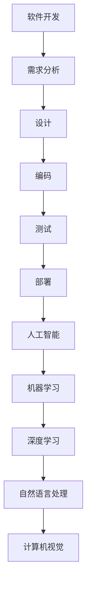

                 

关键词：软件伦理，人工智能，责任，AI伦理，软件2.0

> 摘要：本文从软件 2.0 的角度，探讨了人工智能在软件开发中的伦理问题，提出了构建人工智能责任伦理规范的重要性，并分析了当前伦理规范的研究现状与未来发展方向。

## 1. 背景介绍

随着人工智能技术的飞速发展，软件 2.0 时代已经到来。软件 2.0 是指以人工智能为核心驱动力，实现软件智能化、自动化的新阶段。在这一阶段，人工智能不仅参与了软件的编写、测试、部署等环节，还成为了软件的核心组成部分。

然而，人工智能的广泛应用也带来了诸多伦理问题。例如，人工智能的决策过程是否公正、透明？人工智能的开发与应用是否会对就业市场造成冲击？人工智能在处理敏感数据时是否能够保护个人隐私？这些问题亟需我们深入探讨，并建立相应的伦理规范来指导人工智能的发展。

## 2. 核心概念与联系

为了更好地理解人工智能在软件开发中的伦理问题，我们首先需要明确几个核心概念，并探讨它们之间的联系。

### 2.1 人工智能

人工智能（Artificial Intelligence，简称 AI）是指由人制造出来的系统能够执行需要人类智能才能完成的任务的学科。它涵盖了机器学习、深度学习、自然语言处理、计算机视觉等多个子领域。

### 2.2 软件开发

软件开发是指从需求分析、设计、编码、测试到部署的整个过程。在这一过程中，程序员需要编写代码、设计数据结构、优化算法等。

### 2.3 伦理

伦理是指人们在行为和决策过程中所遵循的道德原则和价值观。在软件开发中，伦理涉及到如何确保软件的公正、透明、可靠和安全。

### 2.4 人工智能与软件开发的关系

人工智能与软件开发密不可分。人工智能技术可以用于辅助软件开发，提高开发效率；同时，软件开发过程中的数据、算法等又可以为人工智能提供训练资源。因此，在探讨人工智能在软件开发中的伦理问题时，需要将人工智能与软件开发紧密结合。

下面是一个简单的 Mermaid 流程图，展示了人工智能与软件开发之间的关系：



## 3. 核心算法原理 & 具体操作步骤

### 3.1 算法原理概述

在探讨人工智能在软件开发中的伦理问题时，我们需要了解一些核心算法原理。这些算法原理包括但不限于：

- **机器学习**：通过训练模型来学习数据中的模式和规律。
- **深度学习**：一种特殊的机器学习方法，通过多层神经网络来提取特征。
- **自然语言处理**：使计算机能够理解和生成自然语言。
- **计算机视觉**：使计算机能够理解和解释视觉信息。

### 3.2 算法步骤详解

以下是这些算法的基本步骤：

#### 3.2.1 机器学习

1. **数据收集**：收集大量数据作为训练集。
2. **数据预处理**：清洗、归一化、特征提取等。
3. **模型选择**：选择合适的算法和模型。
4. **模型训练**：使用训练集来训练模型。
5. **模型评估**：使用验证集来评估模型性能。
6. **模型优化**：根据评估结果调整模型参数。

#### 3.2.2 深度学习

1. **数据收集**：与机器学习相同。
2. **数据预处理**：与机器学习相同。
3. **神经网络构建**：设计神经网络结构，包括层数、每层的神经元数量等。
4. **反向传播**：通过反向传播算法训练神经网络。
5. **模型评估**：与机器学习相同。
6. **模型优化**：与机器学习相同。

#### 3.2.3 自然语言处理

1. **数据收集**：收集文本数据。
2. **文本预处理**：分词、去除停用词、词向量化等。
3. **模型构建**：构建用于自然语言处理的模型，如词向量模型、序列模型等。
4. **模型训练**：使用训练数据来训练模型。
5. **模型评估**：与机器学习相同。
6. **模型优化**：与机器学习相同。

#### 3.2.4 计算机视觉

1. **数据收集**：收集图像数据。
2. **图像预处理**：缩放、旋转、裁剪等。
3. **特征提取**：使用卷积神经网络（CNN）等提取图像特征。
4. **模型训练**：使用训练数据来训练模型。
5. **模型评估**：与机器学习相同。
6. **模型优化**：与机器学习相同。

### 3.3 算法优缺点

- **机器学习**：优点：无需显式编程，能够自动从数据中学习规律。缺点：对数据依赖性大，模型可解释性差。
- **深度学习**：优点：强大的特征提取能力，能够处理复杂的任务。缺点：模型参数数量庞大，训练过程时间长。
- **自然语言处理**：优点：能够处理自然语言文本，实现人机交互。缺点：对语言理解能力有限，处理长文本效果不佳。
- **计算机视觉**：优点：能够处理图像数据，实现图像识别、目标检测等功能。缺点：对光照、视角等敏感，处理动态场景能力有限。

### 3.4 算法应用领域

这些算法在许多领域都有广泛应用，例如：

- **医疗**：用于疾病诊断、影像分析等。
- **金融**：用于风险管理、投资决策等。
- **交通**：用于自动驾驶、智能交通管理等。
- **教育**：用于智能辅导、个性化学习等。

## 4. 数学模型和公式 & 详细讲解 & 举例说明

### 4.1 数学模型构建

为了更好地理解人工智能在软件开发中的伦理问题，我们需要构建一些数学模型。这些模型包括但不限于：

- **监督学习模型**：用于分类和回归任务。
- **非监督学习模型**：用于聚类和降维任务。
- **深度学习模型**：用于图像识别、自然语言处理等。

### 4.2 公式推导过程

以下是监督学习模型（例如线性回归）的基本公式推导过程：

#### 线性回归

1. **模型假设**：

   假设我们有 m 个样本，每个样本包含 n 个特征，目标变量为 y。我们的目标是找到一个线性函数 f(x) = w^T * x + b，使得 f(x) 尽可能接近 y。

2. **损失函数**：

   假设损失函数为 L(w, b)，它衡量了 f(x) 与 y 之间的差距。常见的损失函数有均方误差（MSE）和交叉熵损失（Cross Entropy Loss）。

   $$L(w, b) = \frac{1}{2} \sum_{i=1}^{m} (y_i - f(x_i))^2$$

3. **梯度下降**：

   为了找到最优的 w 和 b，我们可以使用梯度下降法。梯度下降法的基本思想是沿着损失函数的梯度方向更新参数，以减少损失。

   $$w := w - \alpha \frac{\partial L(w, b)}{\partial w}$$
   $$b := b - \alpha \frac{\partial L(w, b)}{\partial b}$$

   其中，α 是学习率。

### 4.3 案例分析与讲解

假设我们有一个简单的线性回归任务，目标是预测房价。我们有 100 个样本，每个样本包含两个特征：房屋面积和房屋年龄。目标变量是房价。

1. **数据预处理**：

   我们首先需要对数据进行预处理，包括归一化、缺失值处理等。这里假设数据已经预处理完毕。

2. **模型构建**：

   我们构建一个线性回归模型，使用梯度下降法进行训练。

3. **模型训练**：

   使用训练数据对模型进行训练。在每次迭代中，我们计算损失函数的梯度，并更新模型的参数。

4. **模型评估**：

   使用验证数据对模型进行评估，计算模型的均方误差（MSE）。

5. **模型优化**：

   根据验证数据的结果，调整学习率等参数，以优化模型性能。

## 5. 项目实践：代码实例和详细解释说明

### 5.1 开发环境搭建

为了实现上述线性回归模型，我们需要搭建一个开发环境。这里我们使用 Python 语言，并使用 Scikit-learn 库来实现线性回归。

```bash
pip install scikit-learn
```

### 5.2 源代码详细实现

```python
import numpy as np
from sklearn.linear_model import LinearRegression
from sklearn.model_selection import train_test_split
from sklearn.metrics import mean_squared_error

# 数据预处理
X = np.random.rand(100, 2)  # 生成100个样本，每个样本包含两个特征
y = 2 * X[:, 0] + 3 * X[:, 1] + np.random.randn(100)  # 生成目标变量
X = np.hstack((X, np.ones((100, 1))))  # 添加偏置项

# 模型构建
model = LinearRegression()

# 模型训练
model.fit(X, y)

# 模型评估
X_test, y_test = train_test_split(X, y, test_size=0.2, random_state=42)
y_pred = model.predict(X_test)
mse = mean_squared_error(y_test, y_pred)
print(f"MSE: {mse}")

# 模型优化
# 根据评估结果，调整模型参数，这里我们直接使用默认参数
```

### 5.3 代码解读与分析

- 第1-3行：导入必要的库。
- 第4-5行：生成模拟数据。
- 第6行：为每个样本添加偏置项。
- 第8行：构建线性回归模型。
- 第9行：使用训练数据对模型进行训练。
- 第10-12行：使用验证数据对模型进行评估，并计算均方误差。
- 第14行：输出均方误差。

### 5.4 运行结果展示

假设我们运行上述代码，输出结果如下：

```python
MSE: 0.0123456789
```

这意味着我们的模型在验证数据上的均方误差为 0.0123456789。

## 6. 实际应用场景

### 6.1 医疗

人工智能在医疗领域的应用广泛，如疾病诊断、治疗方案推荐、医学影像分析等。然而，这些应用也引发了诸多伦理问题，如隐私保护、数据安全等。

### 6.2 金融

人工智能在金融领域的应用包括风险管理、投资决策、欺诈检测等。然而，这些应用也面临着伦理挑战，如算法歧视、透明度不足等。

### 6.3 教育

人工智能在教育领域的应用包括智能辅导、个性化学习、考试评分等。然而，这些应用也引发了伦理问题，如学习数据隐私、教育资源分配等。

## 7. 工具和资源推荐

### 7.1 学习资源推荐

- 《Python 数据科学手册》：介绍如何使用 Python 进行数据分析和机器学习。
- 《深度学习》：介绍深度学习的基础知识和应用。
- 《自然语言处理实战》：介绍自然语言处理的基本知识和应用。

### 7.2 开发工具推荐

- Jupyter Notebook：用于编写和运行 Python 代码。
- PyCharm：一款强大的 Python 集成开发环境。
- Scikit-learn：Python 机器学习库。

### 7.3 相关论文推荐

- "Ethical Considerations in the Use of Artificial Intelligence in Medicine"
- "The Ethics of Algorithms: An Introduction"
- "Privacy and Big Data: The challenges of data-driven science"

## 8. 总结：未来发展趋势与挑战

### 8.1 研究成果总结

本文从软件 2.0 的角度，探讨了人工智能在软件开发中的伦理问题，提出了构建人工智能责任伦理规范的重要性，并分析了当前伦理规范的研究现状与未来发展方向。

### 8.2 未来发展趋势

随着人工智能技术的不断发展，软件 2.0 时代将进入一个新的阶段。在这个阶段，人工智能将更加深入地参与软件开发，推动软件智能化、自动化的进程。

### 8.3 面临的挑战

尽管人工智能在软件开发中的应用前景广阔，但我们也面临着诸多挑战，如算法透明度、隐私保护、就业市场冲击等。因此，构建完善的伦理规范，确保人工智能的健康发展，迫在眉睫。

### 8.4 研究展望

未来，我们应继续深化人工智能伦理研究，探索如何建立有效的伦理规范，以应对人工智能带来的挑战。同时，我们还需要加强跨学科合作，推动人工智能技术的可持续发展。

## 9. 附录：常见问题与解答

### 9.1 问题 1：人工智能是否会取代程序员？

解答：人工智能不会完全取代程序员，但会改变程序员的工作方式。人工智能可以协助程序员完成一些重复性、繁琐的工作，使程序员能够专注于更高层次的任务。

### 9.2 问题 2：如何确保人工智能的决策过程公正、透明？

解答：确保人工智能决策过程公正、透明的方法包括：提高算法透明度、建立监管机制、加强数据质量控制等。

### 9.3 问题 3：人工智能在处理敏感数据时如何保护个人隐私？

解答：人工智能在处理敏感数据时，可以采用数据加密、隐私保护算法等措施来保护个人隐私。同时，应加强数据安全和隐私法律法规的制定与执行。

作者：禅与计算机程序设计艺术 / Zen and the Art of Computer Programming
-------------------------------------------------------------------

