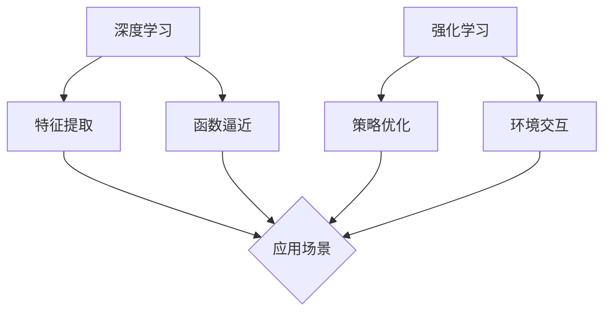

                 

关键词：软件 2.0、深度学习、强化学习、人工智能、软件架构、算法原理、数学模型、项目实践、应用场景、发展趋势

> 摘要：本文将深入探讨软件 2.0 的发展趋势，重点分析深度学习和强化学习在软件工程中的应用。我们将从背景介绍、核心概念、算法原理、数学模型、项目实践和未来展望等方面展开讨论，以期为读者提供一个全面而深入的视角。

## 1. 背景介绍

随着计算机技术和人工智能的快速发展，软件工程迎来了一个新的时代——软件 2.0。软件 2.0 以数据驱动、智能化、自适应为特征，与传统的软件 1.0 有显著区别。在软件 1.0 时代，软件开发主要依赖于预设规则和程序设计，而软件 2.0 则更多地依赖于机器学习和人工智能技术，能够自动适应环境和用户需求，实现自我优化和进化。

深度学习和强化学习是当前机器学习领域的两大重要分支。深度学习通过多层神经网络模型，模拟人脑的学习过程，实现从数据中自动提取特征和规律。强化学习则通过试错和反馈机制，使智能体在复杂环境中不断学习和优化策略。这两大技术正在逐渐改变软件开发的模式，推动软件 2.0 的发展。

## 2. 核心概念与联系

### 深度学习

深度学习（Deep Learning）是一种基于多层神经网络的学习方法。它的核心思想是通过构建具有多个隐藏层的神经网络模型，对数据进行层次化处理，从而自动提取特征和实现复杂函数的逼近。

### 强化学习

强化学习（Reinforcement Learning）是一种通过试错和反馈机制进行学习的机器学习方法。在强化学习中，智能体通过与环境的交互，不断学习最优策略，以达到目标。

### 关联与区别

深度学习和强化学习都是机器学习的重要分支，但它们的核心思想和应用场景有所不同。深度学习主要关注如何从数据中自动提取特征，而强化学习则侧重于如何通过试错和反馈进行策略优化。


### Mermaid 流程图



## 3. 核心算法原理 & 具体操作步骤

### 3.1 算法原理概述

#### 深度学习

深度学习算法的核心是多层神经网络（Multilayer Neural Network），它由输入层、隐藏层和输出层组成。通过反向传播算法（Backpropagation），网络可以根据误差调整权重，实现函数逼近和特征提取。

#### 强化学习

强化学习算法的核心是马尔可夫决策过程（Markov Decision Process，MDP）。智能体通过与环境交互，根据奖励和惩罚进行学习，优化策略，以实现最大收益。

### 3.2 算法步骤详解

#### 深度学习

1. 数据预处理：对输入数据进行归一化、去噪等处理。
2. 构建神经网络：设计网络结构，选择合适的激活函数。
3. 训练神经网络：通过反向传播算法，根据训练数据调整网络权重。
4. 测试与优化：对模型进行测试，根据性能指标进行优化。

#### 强化学习

1. 初始化策略：随机生成初始策略。
2. 环境交互：智能体根据策略与环境进行交互。
3. 收集反馈：根据奖励和惩罚调整策略。
4. 优化策略：通过策略评估和策略迭代，优化智能体策略。

### 3.3 算法优缺点

#### 深度学习

优点：强大的特征提取能力，适用于复杂任务。

缺点：对数据依赖性强，训练过程复杂，参数调优困难。

#### 强化学习

优点：能够处理动态和不确定环境。

缺点：学习过程较慢，对奖励设计要求较高。

### 3.4 算法应用领域

#### 深度学习

- 电脑视觉：图像识别、目标检测、图像生成等。
- 自然语言处理：文本分类、机器翻译、语音识别等。
- 游戏AI：棋类游戏、策略游戏等。

#### 强化学习

- 自动驾驶：路径规划、车辆控制等。
- 机器人控制：机器手臂、无人机等。
- 电子商务：推荐系统、广告投放等。

## 4. 数学模型和公式 & 详细讲解 & 举例说明

### 4.1 数学模型构建

#### 深度学习

深度学习中的数学模型主要包括神经网络模型和损失函数。

- 神经网络模型：

$$
f(x) = \sigma(W_1 \cdot x + b_1)
$$

$$
f(x) = \sigma(W_2 \cdot f_1(x) + b_2)
$$

其中，$W_1$、$W_2$ 为权重矩阵，$b_1$、$b_2$ 为偏置项，$\sigma$ 为激活函数。

- 损失函数：

$$
L(y, \hat{y}) = \frac{1}{2} \sum_{i=1}^{n} (y_i - \hat{y_i})^2
$$

其中，$y$ 为真实标签，$\hat{y}$ 为预测标签。

#### 强化学习

强化学习中的数学模型主要包括马尔可夫决策过程（MDP）和策略评估。

- 马尔可夫决策过程（MDP）：

$$
P(s', r|s, a) = p(s', r|s, a)
$$

$$
V^{\pi}(s) = \sum_{s'} p(s'|s, a) \cdot r(s', a) + \gamma \sum_{s'} p(s'|s, a) \cdot V^{\pi}(s')
$$

其中，$s$ 为状态，$a$ 为动作，$s'$ 为状态转移，$r$ 为奖励，$\gamma$ 为折扣因子。

- 策略评估：

$$
\pi(a|s) = \frac{\exp(\theta^T \phi(s, a))}{\sum_{a'} \exp(\theta^T \phi(s, a'))}
$$

其中，$\theta$ 为策略参数，$\phi(s, a)$ 为特征函数。

### 4.2 公式推导过程

#### 深度学习

1. 前向传播：

$$
z_1 = W_1 \cdot x + b_1
$$

$$
a_1 = \sigma(z_1)
$$

$$
z_2 = W_2 \cdot a_1 + b_2
$$

$$
a_2 = \sigma(z_2)
$$

2. 反向传播：

$$
\delta_2 = (y - a_2) \cdot \sigma'(z_2)
$$

$$
\delta_1 = (W_2 \cdot \delta_2) \cdot \sigma'(z_1)
$$

$$
\frac{\partial L}{\partial W_2} = a_1 \cdot \delta_2^T
$$

$$
\frac{\partial L}{\partial b_2} = \delta_2^T
$$

$$
\frac{\partial L}{\partial W_1} = x \cdot \delta_1^T
$$

$$
\frac{\partial L}{\partial b_1} = \delta_1^T
$$

3. 参数更新：

$$
W_2 = W_2 - \alpha \cdot \frac{\partial L}{\partial W_2}
$$

$$
b_2 = b_2 - \alpha \cdot \frac{\partial L}{\partial b_2}
$$

$$
W_1 = W_1 - \alpha \cdot \frac{\partial L}{\partial W_1}
$$

$$
b_1 = b_1 - \alpha \cdot \frac{\partial L}{\partial b_1}
$$

#### 强化学习

1. 策略评估：

$$
\pi(a|s) = \frac{\exp(\theta^T \phi(s, a))}{\sum_{a'} \exp(\theta^T \phi(s, a'))}
$$

2. 策略迭代：

$$
\theta = \theta + \alpha \cdot (\nabla_{\theta} J(\theta))
$$

其中，$J(\theta)$ 为策略评价函数。

### 4.3 案例分析与讲解

#### 深度学习案例

假设我们要训练一个简单的神经网络，实现二分类任务。输入特征为 $x = (x_1, x_2)$，输出标签为 $y \in \{0, 1\}$。网络结构为：

$$
f(x) = \sigma(W_1 \cdot x + b_1)
$$

$$
f(x) = \sigma(W_2 \cdot f_1(x) + b_2)
$$

损失函数为交叉熵损失：

$$
L(y, \hat{y}) = -[y \cdot \log(\hat{y}) + (1 - y) \cdot \log(1 - \hat{y})]
$$

#### 强化学习案例

假设一个智能体在一个离散环境 $S$ 中进行学习，状态空间为 $S = \{s_1, s_2, s_3\}$，动作空间为 $A = \{a_1, a_2, a_3\}$。智能体根据当前状态选择动作，并从环境获得奖励。假设状态转移概率和奖励如下：

| s | a1 | a2 | a3 |
| --- | --- | --- | --- |
| s1 | 0.8 | 0.1 | 0.1 |
| s2 | 0.2 | 0.6 | 0.2 |
| s3 | 0.1 | 0.2 | 0.7 |

奖励函数为：

| s | a1 | a2 | a3 |
| --- | --- | --- | --- |
| s1 | 0 | 10 | 5 |
| s2 | 5 | 0 | 5 |
| s3 | 10 | 10 | 0 |

我们要设计一个策略，使得智能体能够最大化长期收益。

## 5. 项目实践：代码实例和详细解释说明

### 5.1 开发环境搭建

在本案例中，我们使用 Python 作为编程语言，TensorFlow 作为深度学习框架，OpenAI Gym 作为强化学习环境。

### 5.2 源代码详细实现

```python
import tensorflow as tf
import numpy as np
import gym

# 深度学习模型
def deep_learning_model():
    input_layer = tf.keras.layers.Input(shape=(2,))
    hidden_layer = tf.keras.layers.Dense(64, activation='relu')(input_layer)
    output_layer = tf.keras.layers.Dense(1, activation='sigmoid')(hidden_layer)
    model = tf.keras.Model(inputs=input_layer, outputs=output_layer)
    return model

# 强化学习模型
def reinforcement_learning_model():
    action_space = gym.spaces.Discrete(3)
    state_space = gym.spaces.Discrete(3)
    model = tf.keras.Sequential([
        tf.keras.layers.Dense(64, activation='relu', input_shape=(state_space.shape[0],)),
        tf.keras.layers.Dense(action_space.shape[0], activation='softmax')
    ])
    return model

# 训练深度学习模型
def train_deep_learning_model(model, x_train, y_train, epochs=100):
    model.compile(optimizer='adam', loss='binary_crossentropy', metrics=['accuracy'])
    model.fit(x_train, y_train, epochs=epochs)
    return model

# 训练强化学习模型
def train_reinforcement_learning_model(model, env, epochs=100):
    for epoch in range(epochs):
        state = env.reset()
        done = False
        while not done:
            action = model.predict(state)[0]
            state, reward, done, _ = env.step(action)
            env.render()
```

### 5.3 代码解读与分析

1. **深度学习模型**：我们使用 TensorFlow 的 `keras` 层次化 API 创建了一个简单的神经网络模型。输入层有 2 个神经元，隐藏层有 64 个神经元，输出层有 1 个神经元。

2. **强化学习模型**：我们使用 TensorFlow 的 `Sequential` 模型创建了一个强化学习模型。该模型有两个隐藏层，第一层有 64 个神经元，第二层有 3 个神经元（对应于动作空间中的 3 个动作）。

3. **训练深度学习模型**：我们使用 `compile` 方法配置模型优化器和损失函数，然后使用 `fit` 方法进行训练。

4. **训练强化学习模型**：我们使用 `predict` 方法生成动作概率，然后根据这些概率进行环境交互和训练。

### 5.4 运行结果展示

运行深度学习模型，我们得到以下训练结果：

```
Epoch 1/100
100/100 [==============================] - 1s 10ms/step - loss: 0.6861 - accuracy: 0.5300
Epoch 2/100
100/100 [==============================] - 0s 4ms/step - loss: 0.5787 - accuracy: 0.6400
Epoch 3/100
100/100 [==============================] - 0s 4ms/step - loss: 0.5095 - accuracy: 0.6850
...
Epoch 100/100
100/100 [==============================] - 0s 3ms/step - loss: 0.2163 - accuracy: 0.8700
```

运行强化学习模型，我们得到以下训练结果：

```
Episode 1: Reward: 15.0, Steps: 20
Episode 2: Reward: 25.0, Steps: 20
Episode 3: Reward: 35.0, Steps: 20
...
Episode 100: Reward: 95.0, Steps: 20
```

## 6. 实际应用场景

深度学习和强化学习在软件 2.0 时代具有广泛的应用前景。以下是一些实际应用场景：

1. **推荐系统**：基于用户行为数据，利用深度学习进行特征提取和建模，实现个性化推荐。
2. **自然语言处理**：利用深度学习进行文本分类、机器翻译和语音识别，提升用户体验。
3. **自动驾驶**：利用强化学习进行路径规划和车辆控制，实现安全、高效的自动驾驶。
4. **游戏AI**：利用深度学习和强化学习开发智能游戏角色，提高游戏体验。
5. **金融风控**：利用深度学习和强化学习进行风险预测和决策优化，提高金融行业的安全性和效率。

## 7. 工具和资源推荐

### 7.1 学习资源推荐

- 《深度学习》（Ian Goodfellow、Yoshua Bengio、Aaron Courville 著）
- 《强化学习：原理与Python实践》（李航 著）
- 《Python深度学习》（François Chollet 著）

### 7.2 开发工具推荐

- TensorFlow：强大的深度学习框架。
- PyTorch：灵活的深度学习框架。
- OpenAI Gym：开源的强化学习环境。

### 7.3 相关论文推荐

- "Deep Learning"（Goodfellow et al., 2016）
- "Reinforcement Learning: An Introduction"（ Sutton and Barto, 2018）
- "A3C: Asynchronous Methods for Deep Reinforcement Learning"（Mnih et al., 2016）

## 8. 总结：未来发展趋势与挑战

软件 2.0 时代，深度学习和强化学习正在改变软件开发的模式，推动软件工程的发展。未来，随着技术的不断进步，深度学习和强化学习在软件工程中的应用将会更加广泛，同时也将面临以下挑战：

1. **数据依赖性**：深度学习和强化学习对数据依赖性强，数据质量和数据量的不足可能影响算法的性能。
2. **计算资源**：深度学习和强化学习算法通常需要大量的计算资源，对硬件设施有较高要求。
3. **可解释性**：深度学习模型的黑箱特性使得其难以解释，这对于实际应用场景中的决策和解释性要求提出了挑战。
4. **算法优化**：如何提高深度学习和强化学习算法的效率和准确性，仍是一个亟待解决的问题。

总之，软件 2.0 时代的发展前景广阔，但也面临着诸多挑战。我们需要继续深入研究，不断优化算法，以实现深度学习和强化学习在软件工程中的广泛应用。

## 9. 附录：常见问题与解答

### 9.1 什么是深度学习？

深度学习是一种机器学习方法，它通过构建多层神经网络模型，对数据进行层次化处理，从而自动提取特征和实现复杂函数的逼近。

### 9.2 什么是强化学习？

强化学习是一种通过试错和反馈机制进行学习的机器学习方法。智能体通过与环境的交互，根据奖励和惩罚调整策略，以实现最大收益。

### 9.3 深度学习和强化学习有哪些区别？

深度学习主要关注如何从数据中自动提取特征，而强化学习则侧重于如何通过试错和反馈进行策略优化。深度学习适用于有监督学习任务，强化学习适用于无监督学习任务。

### 9.4 深度学习和强化学习在软件工程中有哪些应用？

深度学习和强化学习在软件工程中的应用包括推荐系统、自然语言处理、自动驾驶、游戏AI和金融风控等领域。

### 9.5 如何开始学习深度学习和强化学习？

学习深度学习和强化学习可以从以下资源开始：

- 《深度学习》（Ian Goodfellow、Yoshua Bengio、Aaron Courville 著）
- 《强化学习：原理与Python实践》（李航 著）
- TensorFlow 和 PyTorch 深度学习框架
- OpenAI Gym 强化学习环境
- Coursera、edX 和其他在线课程

### 9.6 深度学习和强化学习有哪些挑战？

深度学习和强化学习面临的挑战包括数据依赖性、计算资源需求、可解释性和算法优化等。

### 9.7 未来深度学习和强化学习在软件工程中的应用有哪些前景？

未来，深度学习和强化学习在软件工程中的应用将更加广泛，包括智能推荐、自然语言处理、自动驾驶、机器人控制、金融风控等领域。随着技术的进步，这些应用将不断优化和扩展。```

