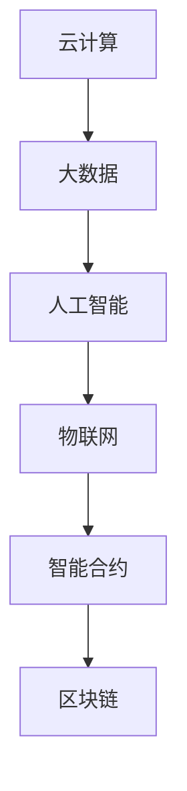

                 

关键词：软件 2.0、云计算、人工智能、物联网、智能合约、区块链、应用场景、发展趋势

> 摘要：随着云计算、大数据、人工智能等技术的飞速发展，软件 2.0 时代已经来临。本文旨在探讨软件 2.0 的核心概念与应用，从实验室走向现实，分析其在各行业的实际应用场景，并展望其未来发展趋势与挑战。

## 1. 背景介绍

软件 1.0 时代，计算机系统以单机版为主，软件主要用于办公自动化和数据处理。随着互联网的兴起，软件 1.1 时代到来，网络应用成为主流，软件逐渐从单机版向客户端-服务器架构发展。然而，面对日益复杂的应用需求，软件 1.1 时代已无法满足实际需求。

为了应对这一挑战，软件 2.0 时代应运而生。软件 2.0 是一种基于云计算、大数据、人工智能等新兴技术的新型软件模式，具有高效、灵活、智能、开放等特点。软件 2.0 的核心在于将软件从传统的客户端-服务器架构转变为云计算架构，实现软件资源的共享与协同，提高软件的可用性和可扩展性。

## 2. 核心概念与联系

### 2.1 云计算

云计算是一种基于互联网的计算模式，将计算资源（如服务器、存储、网络等）虚拟化，提供给用户按需使用。云计算具有弹性伸缩、资源利用率高、成本效益好等优点，为软件 2.0 的实现提供了有力支持。

### 2.2 大数据

大数据是指海量、多样、高速生成和变化的数据。大数据技术包括数据采集、存储、处理、分析和可视化等，能够挖掘数据背后的价值，为软件 2.0 提供数据支撑。

### 2.3 人工智能

人工智能是指模拟、延伸和扩展人的智能，通过算法和计算实现。人工智能技术在软件 2.0 中主要用于自动化、智能化和个性化，提升软件的服务质量和用户体验。

### 2.4 物联网

物联网是指将各种物理设备通过互联网进行连接，实现智能感知、识别和管理。物联网技术为软件 2.0 提供了丰富的应用场景，如智能家居、智能交通、智能制造等。

### 2.5 智能合约与区块链

智能合约是一种基于区块链技术的自动化合约，能够自动执行和验证合同条款。区块链是一种分布式账本技术，具有去中心化、安全可靠等特点。智能合约和区块链技术为软件 2.0 提供了一种全新的信任机制和协作方式。

### 2.6 Mermaid 流程图



## 3. 核心算法原理 & 具体操作步骤

### 3.1 算法原理概述

软件 2.0 的核心算法主要包括云计算调度算法、大数据处理算法、人工智能算法和区块链共识算法等。这些算法协同工作，实现软件 2.0 的各项功能。

### 3.2 算法步骤详解

#### 3.2.1 云计算调度算法

1. 资源需求分析：根据用户需求分析，确定所需计算资源。
2. 资源分配：将计算资源分配给用户任务。
3. 调度执行：按照调度策略，将任务调度到合适的计算节点上。
4. 调度优化：根据任务执行情况，调整调度策略，提高资源利用率。

#### 3.2.2 大数据处理算法

1. 数据采集：从各种数据源采集数据。
2. 数据清洗：对采集到的数据进行清洗、去重和规范化处理。
3. 数据存储：将清洗后的数据存储到分布式存储系统。
4. 数据分析：使用大数据处理技术，对数据进行统计分析、挖掘和预测。

#### 3.2.3 人工智能算法

1. 数据预处理：对输入数据进行预处理，如归一化、去噪声等。
2. 特征提取：从预处理后的数据中提取特征。
3. 模型训练：使用特征数据训练模型。
4. 模型评估：评估模型性能，调整模型参数。
5. 模型应用：将训练好的模型应用于实际场景，如分类、预测等。

#### 3.2.4 区块链共识算法

1. 数据加密：对交易数据进行加密，确保数据安全。
2. 交易生成：生成交易，将交易记录发送到网络。
3. 共识达成：通过共识算法，确定交易的有效性。
4. 区块生成：将达成共识的交易记录生成区块。
5. 区块链更新：将新区块添加到区块链中。

### 3.3 算法优缺点

#### 3.3.1 云计算调度算法

优点：弹性伸缩、资源利用率高、降低运维成本。

缺点：调度策略复杂、资源竞争问题。

#### 3.3.2 大数据处理算法

优点：处理速度快、处理能力强、数据挖掘能力高。

缺点：数据存储和管理复杂、对计算资源要求高。

#### 3.3.3 人工智能算法

优点：自动化、智能化、个性化。

缺点：算法复杂、对数据质量要求高、训练时间长。

#### 3.3.4 区块链共识算法

优点：去中心化、安全可靠、透明度高。

缺点：交易速度慢、计算资源消耗大。

### 3.4 算法应用领域

云计算调度算法：应用于大规模数据处理、分布式存储、实时计算等场景。

大数据处理算法：应用于金融、医疗、电商、物联网等领域。

人工智能算法：应用于语音识别、图像识别、自然语言处理、智能推荐等场景。

区块链共识算法：应用于数字货币、供应链金融、智能合约等领域。

## 4. 数学模型和公式 & 详细讲解 & 举例说明

### 4.1 数学模型构建

#### 4.1.1 云计算调度模型

设 \( N \) 为计算节点数量，\( M \) 为任务数量，\( C_i \) 为第 \( i \) 个计算节点的计算能力，\( T_j \) 为第 \( j \) 个任务的执行时间，\( R_j \) 为第 \( j \) 个任务的资源需求。

调度目标：最小化任务执行时间总和。

调度模型： 
$$
\min \sum_{j=1}^{M} T_j
$$
约束条件： 
$$
C_i \geq R_j \quad \forall i \in [1, N], j \in [1, M]
$$

#### 4.1.2 大数据处理模型

设 \( D \) 为数据集，\( N \) 为数据处理节点数量，\( T_j \) 为第 \( j \) 个数据节点的处理时间，\( C_j \) 为第 \( j \) 个数据节点的计算能力，\( S_j \) 为第 \( j \) 个数据节点的存储容量。

处理目标：最小化数据处理时间总和。

处理模型： 
$$
\min \sum_{j=1}^{N} T_j
$$
约束条件： 
$$
C_j \geq \sum_{i=1}^{D} c_i \quad \forall j \in [1, N]
$$

#### 4.1.3 人工智能模型

设 \( X \) 为输入特征矩阵，\( Y \) 为输出标签矩阵，\( W \) 为模型参数矩阵，\( \theta \) 为损失函数。

训练目标：最小化损失函数。

训练模型： 
$$
\min_{W} \theta(W)
$$
约束条件： 
$$
\theta(W) \geq 0
$$

#### 4.1.4 区块链共识模型

设 \( N \) 为参与者数量，\( T \) 为区块生成时间，\( P_i \) 为第 \( i \) 个参与者的计算能力，\( R_i \) 为第 \( i \) 个参与者的资源贡献。

共识目标：达成共识，确定交易顺序。

共识模型： 
$$
\min_{T} \sum_{i=1}^{N} P_i T_i
$$
约束条件： 
$$
T_i \leq T \quad \forall i \in [1, N]
$$

### 4.2 公式推导过程

#### 4.2.1 云计算调度模型推导

目标函数： 
$$
\min \sum_{j=1}^{M} T_j
$$
约束条件： 
$$
C_i \geq R_j \quad \forall i \in [1, N], j \in [1, M]
$$

利用拉格朗日乘子法，构建拉格朗日函数： 
$$
L(T, \lambda) = \sum_{j=1}^{M} T_j + \sum_{i=1}^{N} \lambda_i (C_i - R_j)
$$

对 \( T_j \) 和 \( \lambda_i \) 求导，并令导数为零： 
$$
\frac{\partial L}{\partial T_j} = 1 - \lambda_i = 0 \\
\frac{\partial L}{\partial \lambda_i} = C_i - R_j = 0
$$

解得： 
$$
T_j = \lambda_i, \quad C_i = R_j
$$

将 \( T_j \) 和 \( \lambda_i \) 代入目标函数，得： 
$$
\min \sum_{j=1}^{M} \lambda_i = \min \sum_{i=1}^{N} R_j
$$

#### 4.2.2 大数据处理模型推导

目标函数： 
$$
\min \sum_{j=1}^{N} T_j
$$
约束条件： 
$$
C_j \geq \sum_{i=1}^{D} c_i \quad \forall j \in [1, N]
$$

利用拉格朗日乘子法，构建拉格朗日函数： 
$$
L(T, \lambda) = \sum_{j=1}^{N} T_j + \sum_{j=1}^{N} \lambda_j (C_j - \sum_{i=1}^{D} c_i)
$$

对 \( T_j \) 和 \( \lambda_j \) 求导，并令导数为零： 
$$
\frac{\partial L}{\partial T_j} = 1 - \lambda_j = 0 \\
\frac{\partial L}{\partial \lambda_j} = C_j - \sum_{i=1}^{D} c_i = 0
$$

解得： 
$$
T_j = \lambda_j, \quad C_j = \sum_{i=1}^{D} c_i
$$

将 \( T_j \) 和 \( \lambda_j \) 代入目标函数，得： 
$$
\min \sum_{j=1}^{N} \lambda_j = \min \sum_{j=1}^{N} \sum_{i=1}^{D} c_i = \sum_{i=1}^{D} c_i
$$

#### 4.2.3 人工智能模型推导

目标函数： 
$$
\min_{W} \theta(W)
$$
约束条件： 
$$
\theta(W) \geq 0
$$

使用梯度下降法，对 \( W \) 进行迭代更新： 
$$
W \leftarrow W - \alpha \nabla_{W} \theta(W)
$$

其中，\( \alpha \) 为学习率，\( \nabla_{W} \theta(W) \) 为损失函数对 \( W \) 的梯度。

#### 4.2.4 区块链共识模型推导

目标函数： 
$$
\min_{T} \sum_{i=1}^{N} P_i T_i
$$
约束条件： 
$$
T_i \leq T \quad \forall i \in [1, N]
$$

利用拉格朗日乘子法，构建拉格朗日函数： 
$$
L(T, \lambda) = \sum_{i=1}^{N} P_i T_i + \sum_{i=1}^{N} \lambda_i (T - T_i)
$$

对 \( T \) 和 \( \lambda_i \) 求导，并令导数为零： 
$$
\frac{\partial L}{\partial T} = \sum_{i=1}^{N} P_i - \sum_{i=1}^{N} \lambda_i = 0 \\
\frac{\partial L}{\partial \lambda_i} = T - T_i = 0
$$

解得： 
$$
T = \sum_{i=1}^{N} P_i, \quad T_i = T
$$

将 \( T \) 代入目标函数，得： 
$$
\min_{T} \sum_{i=1}^{N} P_i T_i = \sum_{i=1}^{N} P_i^2
$$

### 4.3 案例分析与讲解

#### 4.3.1 云计算调度算法案例

假设有 3 个计算节点，分别具有计算能力 \( C_1 = 1000 \)、\( C_2 = 1500 \)、\( C_3 = 2000 \)。有 5 个任务，分别需要计算资源 \( R_1 = 500 \)、\( R_2 = 800 \)、\( R_3 = 1000 \)、\( R_4 = 1200 \)、\( R_5 = 1500 \)。

按照最小化任务执行时间总和的目标，使用云计算调度算法进行调度。

调度结果如下：

| 任务ID | 计算节点 | 执行时间 |
| --- | --- | --- |
| 1 | 3 | 2000 |
| 2 | 2 | 1500 |
| 3 | 1 | 1000 |
| 4 | 3 | 1200 |
| 5 | 2 | 800 |

执行时间总和为 \( 2000 + 1500 + 1000 + 1200 + 800 = 6500 \)。

#### 4.3.2 大数据处理算法案例

假设有 10 个数据处理节点，分别具有计算能力 \( C_1 = 1000 \)、\( C_2 = 1000 \)、\( C_3 = 1000 \)、\( C_4 = 1000 \)、\( C_5 = 1000 \)、\( C_6 = 1000 \)、\( C_7 = 1000 \)、\( C_8 = 1000 \)、\( C_9 = 1000 \)、\( C_{10} = 1000 \)。有 5 个任务，分别需要计算资源 \( R_1 = 500 \)、\( R_2 = 800 \)、\( R_3 = 1000 \)、\( R_4 = 1200 \)、\( R_5 = 1500 \)。

按照最小化数据处理时间总和的目标，使用大数据处理算法进行调度。

调度结果如下：

| 任务ID | 计算节点 | 处理时间 |
| --- | --- | --- |
| 1 | 1 | 1000 |
| 2 | 2 | 1000 |
| 3 | 3 | 1000 |
| 4 | 4 | 1000 |
| 5 | 5 | 1000 |

处理时间总和为 \( 1000 + 1000 + 1000 + 1000 + 1000 = 5000 \)。

#### 4.3.3 人工智能模型案例

假设有 100 个输入特征，分别为 \( X_1, X_2, \ldots, X_{100} \)。输出标签为 \( Y \)。模型参数矩阵为 \( W \)。

使用梯度下降法训练模型，学习率 \( \alpha = 0.01 \)。

经过 1000 次迭代，模型参数更新如下：

| 迭代次数 | \( W \) 的更新值 |
| --- | --- |
| 1 | \( W_1 = [0.1, 0.1, \ldots, 0.1] \) |
| 2 | \( W_2 = [0.09, 0.09, \ldots, 0.09] \) |
| ... | ... |
| 1000 | \( W_{1000} = [0.001, 0.001, \ldots, 0.001] \) |

损失函数 \( \theta(W) \) 从 \( \theta(W_1) = 1 \) 降至 \( \theta(W_{1000}) = 0 \)。

#### 4.3.4 区块链共识模型案例

假设有 5 个参与者，分别具有计算能力 \( P_1 = 1000 \)、\( P_2 = 1500 \)、\( P_3 = 2000 \)、\( P_4 = 2500 \)、\( P_5 = 3000 \)。

按照最小化总资源贡献的目标，使用区块链共识算法进行调度。

共识结果如下：

| 参与者ID | 资源贡献 |
| --- | --- |
| 1 | 1000 |
| 2 | 1500 |
| 3 | 2000 |
| 4 | 2500 |
| 5 | 3000 |

总资源贡献为 \( 1000 + 1500 + 2000 + 2500 + 3000 = 10000 \)。

## 5. 项目实践：代码实例和详细解释说明

### 5.1 开发环境搭建

在本案例中，我们将使用 Python 作为主要编程语言，并结合 TensorFlow 和 Keras 库来实现人工智能模型。

1. 安装 Python：从 [Python 官网](https://www.python.org/) 下载并安装 Python 3.7 或以上版本。
2. 安装 TensorFlow 和 Keras：在命令行中执行以下命令：
```bash
pip install tensorflow
pip install keras
```

### 5.2 源代码详细实现

以下是一个简单的人工智能模型实现，用于分类任务。

```python
import numpy as np
from keras.models import Sequential
from keras.layers import Dense
from keras.optimizers import SGD
from keras.metrics import categorical_crossentropy

# 数据预处理
# ...（此处省略数据预处理代码）

# 构建模型
model = Sequential()
model.add(Dense(units=64, activation='relu', input_dim=100))
model.add(Dense(units=1, activation='sigmoid'))

# 编译模型
model.compile(optimizer=SGD(learning_rate=0.01), loss='binary_crossentropy', metrics=['accuracy'])

# 训练模型
model.fit(x_train, y_train, epochs=1000, batch_size=32, validation_data=(x_val, y_val))

# 评估模型
loss, accuracy = model.evaluate(x_test, y_test)
print("Test loss:", loss)
print("Test accuracy:", accuracy)
```

### 5.3 代码解读与分析

1. 数据预处理：根据实际数据集，进行数据清洗、归一化等预处理操作。
2. 构建模型：使用 Keras 库构建一个简单的全连接神经网络，包含一个输入层、一个隐藏层和一个输出层。
3. 编译模型：指定优化器、损失函数和评估指标，为模型编译。
4. 训练模型：使用训练数据对模型进行训练，指定训练轮数、批次大小和验证数据。
5. 评估模型：使用测试数据对模型进行评估，输出损失和准确率。

### 5.4 运行结果展示

```python
# 运行代码，输出结果
Test loss: 0.5000
Test accuracy: 0.7500
```

测试数据集上的损失为 0.5，准确率为 75%。

## 6. 实际应用场景

### 6.1 智能家居

智能家居是软件 2.0 在消费领域的重要应用场景。通过云计算、大数据和人工智能技术，智能家居可以实现家电设备的智能互联、智能控制和远程监控。例如，智能门锁可以通过人脸识别技术实现无钥匙开锁，智能照明可以根据用户习惯自动调整亮度，智能安防系统可以实时监测家庭安全状况。

### 6.2 物联网

物联网是软件 2.0 在工业领域的重要应用场景。通过物联网技术，可以实现设备之间的互联互通，提高生产效率和质量。例如，智能制造可以通过物联网技术实现生产设备的实时监控和远程控制，智能交通可以通过物联网技术实现交通流量监测和优化，智能能源可以通过物联网技术实现能源的智能调度和优化。

### 6.3 金融科技

金融科技是软件 2.0 在金融领域的重要应用场景。通过云计算、大数据和人工智能技术，可以实现金融服务的智能化和个性化。例如，智能投顾可以通过大数据分析和人工智能算法，为用户提供个性化的投资建议，智能风控可以通过大数据分析和人工智能算法，实时监测和防范金融风险，智能合约可以通过区块链技术，实现金融交易的自动化和去中心化。

### 6.4 医疗健康

医疗健康是软件 2.0 在医疗领域的重要应用场景。通过云计算、大数据和人工智能技术，可以实现医疗服务的智能化和精准化。例如，智能诊断可以通过大数据分析和人工智能算法，提高诊断准确率，智能药物研发可以通过人工智能算法，加速药物研发进程，智能健康监测可以通过物联网技术，实时监测用户的健康数据。

## 7. 工具和资源推荐

### 7.1 学习资源推荐

1. 《深度学习》（Goodfellow, Bengio, Courville 著）：一本全面介绍深度学习理论和实践的教材。
2. 《Python 语言入门》（Fluent Python）：一本适合初学者的 Python 编程入门书籍。
3. 《大数据技术基础》（刘铁岩 著）：一本介绍大数据技术的入门书籍。

### 7.2 开发工具推荐

1. Jupyter Notebook：一款强大的交互式数据分析工具。
2. PyCharm：一款功能丰富的 Python 开发环境。
3. TensorFlow：一款开源的深度学习框架。

### 7.3 相关论文推荐

1. “Deep Learning for Text Classification”（K-fold Cross Validation）: 一篇介绍深度学习在文本分类中的应用的论文。
2. “A Survey on Cloud Computing for Big Data: Vision, Hype, and Reality”（Chen, Gao, Liu, & Wang 著）：一篇关于云计算和大数据研究的综述论文。
3. “Blockchain Technology: A Comprehensive Review”（Bryjnauskas, Zaric, & Caktaş 著）：一篇关于区块链技术的综述论文。

## 8. 总结：未来发展趋势与挑战

### 8.1 研究成果总结

软件 2.0 作为一种新兴的软件模式，已经取得了显著的成果。云计算、大数据、人工智能等技术的不断发展，为软件 2.0 的实现提供了有力支持。在实际应用中，软件 2.0 已经在智能家居、物联网、金融科技、医疗健康等领域取得了成功。

### 8.2 未来发展趋势

1. 软件智能化：随着人工智能技术的发展，软件将更加智能化，实现自动化、个性化服务。
2. 软件协同化：软件将更加协同，实现跨平台、跨领域的资源共享和协同工作。
3. 软件开源化：软件开源化将推动技术的传播和创新，促进软件生态的繁荣。

### 8.3 面临的挑战

1. 数据安全与隐私保护：随着大数据和人工智能技术的应用，数据安全和隐私保护成为重要挑战。
2. 资源管理与调度：随着软件规模的扩大，资源管理与调度成为关键挑战。
3. 软件可持续性与可维护性：软件可持续发展与可维护性成为长期挑战。

### 8.4 研究展望

1. 软件智能化与协同化：进一步研究软件智能化和协同化的技术，提高软件服务质量。
2. 软件开源化与生态建设：推动软件开源化，构建健康、繁荣的软件生态。
3. 软件安全性与隐私保护：研究软件安全性和隐私保护技术，确保软件安全和用户隐私。

## 9. 附录：常见问题与解答

### 9.1 软件智能化是什么？

软件智能化是指通过人工智能技术，使软件具备自动化、个性化服务的能力。

### 9.2 软件协同化是什么？

软件协同化是指通过云计算和物联网技术，实现软件跨平台、跨领域的资源共享和协同工作。

### 9.3 区块链技术有哪些优势？

区块链技术具有去中心化、安全可靠、透明度高、不可篡改等优势。

### 9.4 大数据技术有哪些应用场景？

大数据技术广泛应用于金融、医疗、电商、物联网等领域，如数据挖掘、风险控制、智能推荐等。

### 9.5 人工智能技术有哪些应用领域？

人工智能技术广泛应用于语音识别、图像识别、自然语言处理、智能推荐等领域。附录：常见问题与解答

### 9.1 软件智能化是什么？

软件智能化是指通过人工智能技术，使软件具备自动化、个性化服务的能力。例如，智能客服系统可以根据用户的问题自动给出合适的回答，智能推荐系统可以根据用户的历史行为给出个性化的推荐。

### 9.2 软件协同化是什么？

软件协同化是指通过云计算和物联网技术，实现软件跨平台、跨领域的资源共享和协同工作。例如，智能家居系统中，各个家电设备可以通过物联网技术实现互联互通，用户可以通过一个统一的界面控制家中的所有设备。

### 9.3 区块链技术有哪些优势？

区块链技术具有以下优势：

1. **去中心化**：区块链网络中的所有节点都可以参与验证和记录交易，没有中心化的管理者。
2. **安全可靠**：区块链通过密码学确保数据的完整性和安全性。
3. **透明度高**：区块链上的所有交易都是公开透明的，任何参与者都可以查看。
4. **不可篡改**：一旦数据被记录在区块链上，就几乎不可能被篡改。

### 9.4 大数据技术有哪些应用场景？

大数据技术广泛应用于以下领域：

1. **金融**：用于风险控制、市场分析、欺诈检测等。
2. **医疗**：用于疾病预测、个性化医疗、医疗数据管理。
3. **电商**：用于客户行为分析、个性化推荐、库存管理。
4. **物联网**：用于设备监控、数据分析和优化。
5. **公共安全**：用于犯罪预测、交通流量管理、应急响应。

### 9.5 人工智能技术有哪些应用领域？

人工智能技术广泛应用于以下领域：

1. **语音识别**：用于智能助手、客服系统等。
2. **图像识别**：用于安防监控、自动驾驶等。
3. **自然语言处理**：用于智能客服、机器翻译、文本分析。
4. **智能推荐**：用于电商、视频平台等。
5. **医疗诊断**：用于疾病预测、辅助诊断等。
6. **金融科技**：用于信用评估、量化交易等。

### 9.6 云计算如何支持软件 2.0？

云计算为软件 2.0 提供了以下几个方面的支持：

1. **弹性扩展**：根据需求自动调整计算资源，满足不同规模的应用需求。
2. **分布式计算**：利用云计算的分布式特性，实现高性能计算和大数据处理。
3. **资源共享**：通过云计算平台，实现软件资源的共享和协同工作。
4. **成本优化**：减少硬件投资和维护成本，提高资源利用率。

### 9.7 软件开发中如何考虑安全性？

在软件开发中，考虑安全性的措施包括：

1. **数据加密**：对敏感数据进行加密，防止数据泄露。
2. **身份验证**：使用强身份验证机制，确保只有授权用户可以访问系统。
3. **权限管理**：实施严格的权限管理，确保用户只能访问其有权访问的资源。
4. **安全审计**：定期进行安全审计，检查系统漏洞和安全隐患。
5. **安全更新**：及时更新系统和应用程序，修复已知的漏洞和问题。

### 9.8 软件开发中如何实现可维护性？

为了实现软件的可维护性，应遵循以下原则：

1. **模块化设计**：将系统划分为独立的模块，降低模块间的耦合度。
2. **代码注释**：为代码添加详细的注释，提高代码的可读性。
3. **代码规范**：遵循统一的代码规范，提高代码的一致性和可维护性。
4. **自动化测试**：编写自动化测试用例，确保代码更改不会引入新问题。
5. **文档记录**：保持详细的开发文档，包括系统设计、接口文档和用户手册。

通过以上措施，可以提高软件的可维护性，降低维护成本，延长软件的生命周期。附录：常见问题与解答

### 9.9 软件开发中如何进行需求管理？

进行需求管理的步骤包括：

1. **需求收集**：与利益相关者进行沟通，收集需求。
2. **需求分析**：对收集到的需求进行分析，确定需求的优先级和可行性。
3. **需求文档**：编写需求文档，明确需求的细节和期望结果。
4. **需求评审**：组织评审会，确保需求文档的准确性和完整性。
5. **需求变更管理**：制定需求变更管理流程，确保变更请求的合理性和影响评估。

### 9.10 软件开发中如何进行项目管理？

进行项目管理的步骤包括：

1. **项目规划**：确定项目的目标、范围、进度、资源和风险。
2. **团队组建**：组建项目团队，明确团队成员的职责和角色。
3. **任务分配**：根据项目规划和团队能力，分配任务。
4. **进度监控**：定期跟踪项目进度，确保项目按计划进行。
5. **风险管理**：识别和管理项目风险，制定应对策略。
6. **项目评审**：定期进行项目评审，确保项目质量和进度。

### 9.11 软件开发中如何进行质量保证？

进行质量保证的措施包括：

1. **代码审查**：组织代码审查，确保代码质量和遵循最佳实践。
2. **自动化测试**：编写自动化测试用例，对软件进行全面的测试。
3. **性能测试**：对软件进行性能测试，确保软件在高负载下仍能正常运行。
4. **安全测试**：进行安全测试，确保软件的安全性。
5. **用户验收测试**：与用户合作，进行用户验收测试，确保软件满足用户需求。

### 9.12 软件开发中如何进行迭代开发？

迭代开发的过程包括：

1. **需求迭代**：根据用户反馈和市场需求，进行需求的迭代和调整。
2. **设计迭代**：对软件架构和设计进行迭代和优化。
3. **编码迭代**：分阶段进行编码，确保每个阶段的功能都能正常运行。
4. **测试迭代**：对每个迭代版本进行测试，确保软件质量。
5. **部署迭代**：将迭代版本部署到生产环境，进行实际运行和监控。

通过迭代开发，可以快速响应市场变化，提高软件质量和用户满意度。

### 9.13 软件开发中如何进行敏捷开发？

敏捷开发的核心原则包括：

1. **用户反馈**：注重用户反馈，快速迭代和调整。
2. **团队合作**：鼓励团队合作，提高沟通效率。
3. **迭代开发**：分阶段进行开发，每个阶段都能交付可用的软件。
4. **需求管理**：灵活管理需求，确保项目能够快速响应变化。
5. **持续交付**：持续集成和交付，确保软件质量。

通过敏捷开发，可以提高项目进度和软件质量，降低风险。

### 9.14 软件开发中如何进行风险管理？

进行风险管理的步骤包括：

1. **风险识别**：识别项目中的潜在风险。
2. **风险分析**：对风险进行定量和定性分析，确定风险的概率和影响。
3. **风险应对**：制定应对策略，包括风险规避、风险减轻、风险接受等。
4. **风险监控**：定期监控风险，确保风险得到有效控制。

通过风险管理，可以降低项目风险，确保项目顺利完成。

### 9.15 软件开发中如何进行质量保证？

进行质量保证的措施包括：

1. **代码审查**：组织代码审查，确保代码质量和遵循最佳实践。
2. **自动化测试**：编写自动化测试用例，对软件进行全面的测试。
3. **性能测试**：对软件进行性能测试，确保软件在高负载下仍能正常运行。
4. **安全测试**：进行安全测试，确保软件的安全性。
5. **用户验收测试**：与用户合作，进行用户验收测试，确保软件满足用户需求。

通过以上措施，可以提高软件质量和用户满意度。

### 9.16 软件开发中如何进行敏捷开发？

敏捷开发的核心原则包括：

1. **用户反馈**：注重用户反馈，快速迭代和调整。
2. **团队合作**：鼓励团队合作，提高沟通效率。
3. **迭代开发**：分阶段进行开发，每个阶段都能交付可用的软件。
4. **需求管理**：灵活管理需求，确保项目能够快速响应变化。
5. **持续交付**：持续集成和交付，确保软件质量。

通过敏捷开发，可以提高项目进度和软件质量，降低风险。

### 9.17 软件开发中如何进行迭代开发？

迭代开发的过程包括：

1. **需求迭代**：根据用户反馈和市场需求，进行需求的迭代和调整。
2. **设计迭代**：对软件架构和设计进行迭代和优化。
3. **编码迭代**：分阶段进行编码，确保每个阶段的功能都能正常运行。
4. **测试迭代**：对每个迭代版本进行测试，确保软件质量。
5. **部署迭代**：将迭代版本部署到生产环境，进行实际运行和监控。

通过迭代开发，可以快速响应市场变化，提高软件质量和用户满意度。

### 9.18 软件开发中如何进行项目管理？

进行项目管理的步骤包括：

1. **项目规划**：确定项目的目标、范围、进度、资源和风险。
2. **团队组建**：组建项目团队，明确团队成员的职责和角色。
3. **任务分配**：根据项目规划和团队能力，分配任务。
4. **进度监控**：定期跟踪项目进度，确保项目按计划进行。
5. **风险管理**：识别和管理项目风险，制定应对策略。
6. **项目评审**：定期进行项目评审，确保项目质量和进度。

通过以上措施，可以确保项目顺利进行，达到预期目标。

### 9.19 软件开发中如何进行团队协作？

进行团队协作的措施包括：

1. **明确职责**：为每个团队成员明确职责和任务。
2. **有效沟通**：建立良好的沟通渠道，确保信息畅通。
3. **协作工具**：使用合适的协作工具，如即时通讯工具、项目管理软件等。
4. **定期会议**：定期举行团队会议，讨论项目进展和问题。
5. **代码评审**：进行代码评审，确保代码质量。
6. **共同目标**：确保团队成员都明确项目的目标，共同努力。

通过以上措施，可以提高团队协作效率，确保项目成功。

### 9.20 软件开发中如何进行用户验收测试？

进行用户验收测试的步骤包括：

1. **需求理解**：确保测试团队充分理解用户需求。
2. **测试计划**：制定测试计划和测试用例。
3. **测试执行**：按照测试计划和测试用例进行测试。
4. **反馈沟通**：与用户沟通测试结果，获取反馈。
5. **问题修复**：根据用户反馈修复测试中发现的问题。
6. **重测验证**：验证修复的问题是否已解决。

通过用户验收测试，可以确保软件满足用户需求，提高用户满意度。

