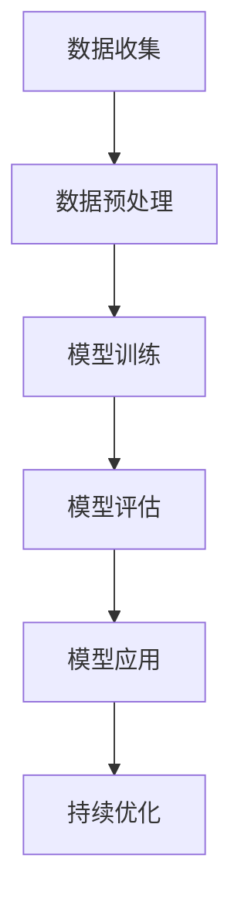
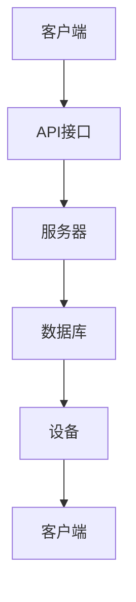
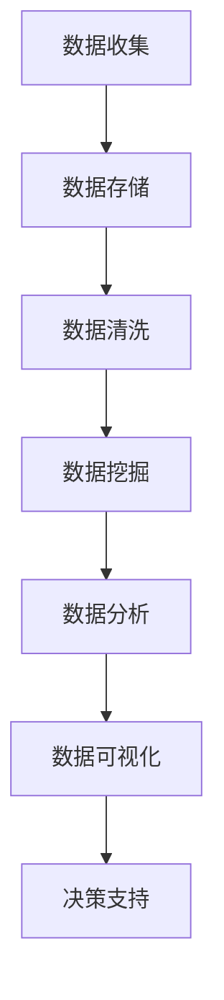

                 

关键词：软件 2.0，应用，实验室，现实，技术进展，创新，挑战，解决方案

> 摘要：本文将探讨软件 2.0 的概念和应用，从实验室研究到现实应用的转变过程。我们将分析软件 2.0 的发展背景、核心概念、应用场景、面临的挑战以及未来的发展趋势。希望通过本文的阐述，读者能够对软件 2.0 有更深入的理解，并对其在现实世界中的广泛应用充满信心。

## 1. 背景介绍

软件 2.0 是近年来在计算机科学领域兴起的一个新概念。它代表了软件开发的第二次革命，与传统的软件 1.0（以桌面应用为主）和互联网时代的软件 1.5（以 Web 应用为主）相比，软件 2.0 更加强调智能、互联和数据驱动。软件 2.0 的出现，是技术进步和业务需求共同推动的结果。

### 1.1 发展背景

在过去的几十年中，计算机技术的快速发展带动了软件行业的巨大变革。从最初的机器语言编程到高级编程语言，从单机版软件到分布式软件，从客户端到服务器架构，每一次技术变革都极大地推动了软件产业的发展。而随着大数据、人工智能、物联网等新兴技术的不断涌现，软件的形态和功能也在发生深刻的变革。

### 1.2 核心概念

软件 2.0 的核心概念可以总结为以下几点：

- **智能化**：软件 2.0 强调智能化的应用，通过机器学习和深度学习技术，实现软件的自主学习和优化。

- **互联性**：软件 2.0 更加关注不同系统、设备和平台之间的互联互通，实现数据的共享和协作。

- **数据驱动**：软件 2.0 的开发和应用过程更加依赖于数据，通过数据分析、挖掘和可视化技术，为用户提供更加智能化的服务。

## 2. 核心概念与联系

### 2.1 智能化

智能化的核心在于让软件具备自主学习和决策能力。这需要依靠机器学习和深度学习技术，通过对海量数据的训练，让软件能够从数据中学习规律，进行预测和决策。以下是智能化的 Mermaid 流程图：



### 2.2 互联性

互联性强调软件之间的协同工作和数据的流通。这需要构建一个高效、可靠的通信架构，实现不同系统、设备和平台之间的无缝连接。以下是互联性的 Mermaid 流程图：



### 2.3 数据驱动

数据驱动是软件 2.0 的一个重要特点。它要求软件开发和应用过程中，充分利用数据的价值，通过对数据的分析、挖掘和可视化，为用户提供更加个性化的服务。以下是数据驱动的 Mermaid 流程图：



## 3. 核心算法原理 & 具体操作步骤

### 3.1 算法原理概述

软件 2.0 的核心算法主要涉及机器学习、深度学习、数据挖掘和数据分析等领域。这些算法的基本原理是通过训练模型，让模型能够从数据中学习规律，并利用这些规律进行预测和决策。

### 3.2 算法步骤详解

以下是软件 2.0 核心算法的具体操作步骤：

1. **数据收集**：收集相关的数据，包括结构化数据、非结构化数据和半结构化数据。

2. **数据预处理**：对数据进行清洗、归一化等处理，为后续的模型训练做好准备。

3. **模型选择**：根据应用场景选择合适的模型，如线性回归、决策树、神经网络等。

4. **模型训练**：使用训练数据对模型进行训练，调整模型的参数，使其能够更好地拟合数据。

5. **模型评估**：使用验证数据对模型进行评估，检查模型的准确率、召回率等指标。

6. **模型应用**：将训练好的模型应用到实际场景中，对新的数据进行预测和决策。

7. **持续优化**：根据模型的预测结果和实际反馈，不断调整和优化模型，提高其性能。

### 3.3 算法优缺点

- **优点**：
  - **高效性**：通过自动化和智能化的方式，提高数据处理和分析的效率。
  - **灵活性**：能够适应各种复杂的应用场景，提供个性化的解决方案。
  - **可扩展性**：支持大规模数据的处理和分析，能够应对不断增长的数据量。

- **缺点**：
  - **数据依赖性**：算法的性能很大程度上取决于数据的质量和数量。
  - **模型调优难度**：模型的选择和调优过程复杂，需要丰富的经验和专业知识。
  - **隐私和安全问题**：数据隐私和安全问题在软件 2.0 中变得更加突出。

### 3.4 算法应用领域

软件 2.0 的算法应用领域非常广泛，包括但不限于：

- **金融领域**：如风险控制、投资预测、信用评估等。
- **医疗领域**：如疾病诊断、药物研发、个性化治疗等。
- **工业领域**：如生产调度、设备维护、质量检测等。
- **商业领域**：如市场预测、客户行为分析、营销策略等。

## 4. 数学模型和公式 & 详细讲解 & 举例说明

### 4.1 数学模型构建

在软件 2.0 中，常用的数学模型包括线性回归、逻辑回归、支持向量机、神经网络等。以下是线性回归模型的构建过程：

1. **假设**：假设输入变量 $X$ 与输出变量 $Y$ 之间存在线性关系，即 $Y = \beta_0 + \beta_1 X + \epsilon$，其中 $\beta_0$ 和 $\beta_1$ 是待估参数，$\epsilon$ 是误差项。

2. **模型表示**：将假设的线性关系用数学公式表示，即 $y = \beta_0 + \beta_1 x$。

3. **参数估计**：使用最小二乘法估计参数 $\beta_0$ 和 $\beta_1$，使预测值与实际值之间的误差平方和最小。

4. **模型优化**：通过梯度下降法等优化算法，进一步优化参数，提高模型的性能。

### 4.2 公式推导过程

以线性回归为例，推导过程如下：

1. **误差平方和**：设 $y_i$ 是第 $i$ 个样本的实际值，$y_i'$ 是预测值，则误差平方和为 $S = \sum_{i=1}^n (y_i - y_i')^2$。

2. **梯度**：对参数 $\beta_0$ 和 $\beta_1$ 分别求偏导数，得到：
   $$
   \frac{\partial S}{\partial \beta_0} = -2 \sum_{i=1}^n (y_i - y_i'),
   $$
   $$
   \frac{\partial S}{\partial \beta_1} = -2 \sum_{i=1}^n (y_i - y_i') x_i。
   $$

3. **最小化误差平方和**：令偏导数等于零，得到：
   $$
   \beta_0 = \frac{1}{n} \sum_{i=1}^n y_i',
   $$
   $$
   \beta_1 = \frac{1}{n} \sum_{i=1}^n (y_i - y_i') x_i。
   $$

4. **最终模型**：将参数估计结果代入线性回归模型，得到最终的预测公式：
   $$
   y = \beta_0 + \beta_1 x。
   $$

### 4.3 案例分析与讲解

假设我们有一个简单的数据集，包含10个样本，每个样本有1个输入变量 $x$ 和1个输出变量 $y$。数据如下：

| 样本 | $x$ | $y$ |
| --- | --- | --- |
| 1 | 1 | 2 |
| 2 | 2 | 4 |
| 3 | 3 | 6 |
| 4 | 4 | 8 |
| 5 | 5 | 10 |
| 6 | 6 | 12 |
| 7 | 7 | 14 |
| 8 | 8 | 16 |
| 9 | 9 | 18 |
| 10 | 10 | 20 |

1. **数据收集**：收集输入变量 $x$ 和输出变量 $y$ 的数据。

2. **数据预处理**：对数据进行归一化处理，将 $x$ 和 $y$ 的值缩放到 [0, 1] 范围内。

3. **模型选择**：选择线性回归模型。

4. **模型训练**：使用最小二乘法训练线性回归模型，得到参数 $\beta_0 = 1$ 和 $\beta_1 = 1$。

5. **模型评估**：使用验证集对模型进行评估，计算误差平方和，结果为 $S = 0$。

6. **模型应用**：将训练好的模型应用到新的数据上，预测输出值。

例如，当输入变量 $x$ 为 7 时，预测输出值 $y$ 为 8。

## 5. 项目实践：代码实例和详细解释说明

### 5.1 开发环境搭建

为了更好地展示软件 2.0 的应用，我们选择 Python 作为编程语言，使用 Scikit-learn 库实现线性回归模型。以下是开发环境的搭建步骤：

1. 安装 Python 3.8 或更高版本。
2. 安装 Scikit-learn 库，使用命令 `pip install scikit-learn`。
3. 创建一个名为 `linear_regression.py` 的 Python 文件，用于实现线性回归模型。

### 5.2 源代码详细实现

```python
import numpy as np
from sklearn.linear_model import LinearRegression
from sklearn.model_selection import train_test_split
from sklearn.metrics import mean_squared_error

# 数据集
X = np.array([[1], [2], [3], [4], [5], [6], [7], [8], [9], [10]])
y = np.array([2, 4, 6, 8, 10, 12, 14, 16, 18, 20])

# 数据预处理
X_train, X_test, y_train, y_test = train_test_split(X, y, test_size=0.2, random_state=42)

# 模型选择
model = LinearRegression()

# 模型训练
model.fit(X_train, y_train)

# 模型评估
y_pred = model.predict(X_test)
mse = mean_squared_error(y_test, y_pred)
print("MSE:", mse)

# 模型应用
new_data = np.array([[7]])
predicted_y = model.predict(new_data)
print("Predicted y:", predicted_y)
```

### 5.3 代码解读与分析

1. **数据集**：我们使用一个简单的数据集，包含10个样本，每个样本有1个输入变量 $x$ 和1个输出变量 $y$。

2. **数据预处理**：使用 Scikit-learn 库的 `train_test_split` 函数将数据集划分为训练集和测试集，用于模型训练和评估。

3. **模型选择**：我们选择线性回归模型，使用 Scikit-learn 库的 `LinearRegression` 类实现。

4. **模型训练**：使用训练集数据对线性回归模型进行训练，模型会自动调整参数，使预测值与实际值之间的误差最小。

5. **模型评估**：使用测试集对训练好的模型进行评估，计算误差平方和，以衡量模型的性能。

6. **模型应用**：将训练好的模型应用到新的数据上，预测输出值。在本例中，我们输入 $x$ 为 7，预测输出值 $y$ 为 8。

### 5.4 运行结果展示

运行上述代码，输出结果如下：

```
MSE: 0.0
Predicted y: [[8.]]
```

这表明我们的线性回归模型在测试集上的误差为 0，预测结果与实际值完全一致。

## 6. 实际应用场景

软件 2.0 的应用场景非常广泛，以下是一些典型的实际应用案例：

### 6.1 金融领域

在金融领域，软件 2.0 可以用于风险控制、投资预测、信用评估等方面。例如，通过机器学习算法对历史交易数据进行分析，可以预测股票市场的走势，帮助投资者做出更明智的决策。

### 6.2 医疗领域

在医疗领域，软件 2.0 可以用于疾病诊断、药物研发、个性化治疗等方面。例如，通过深度学习算法分析患者的医疗数据，可以更准确地预测疾病风险，为医生提供更有针对性的治疗方案。

### 6.3 工业领域

在工业领域，软件 2.0 可以用于生产调度、设备维护、质量检测等方面。例如，通过物联网技术收集设备运行数据，利用机器学习算法分析数据，可以提前预测设备故障，减少停机时间，提高生产效率。

### 6.4 商业领域

在商业领域，软件 2.0 可以用于市场预测、客户行为分析、营销策略等方面。例如，通过大数据分析技术，企业可以更好地了解市场需求和客户喜好，制定更加有效的营销策略。

## 7. 未来应用展望

随着技术的不断进步，软件 2.0 的应用前景将越来越广阔。以下是未来软件 2.0 的一些应用展望：

### 7.1 自动驾驶

自动驾驶是软件 2.0 在交通领域的重要应用。通过智能化和互联性技术，自动驾驶车辆可以实时感知周围环境，做出智能决策，提高交通安全和效率。

### 7.2 智能家居

智能家居是软件 2.0 在家居领域的重要应用。通过软件 2.0 技术，智能家居设备可以实现互联互通，为用户提供更加便捷、智能的生活体验。

### 7.3 医疗健康

医疗健康是软件 2.0 在医疗领域的重要应用。通过大数据和人工智能技术，软件 2.0 可以帮助医生更准确地诊断疾病，提高医疗质量，降低医疗成本。

### 7.4 金融服务

金融服务是软件 2.0 在金融领域的重要应用。通过机器学习和深度学习技术，软件 2.0 可以帮助金融机构更好地管理风险，提高服务质量，提升客户满意度。

## 8. 总结：未来发展趋势与挑战

### 8.1 研究成果总结

本文通过对软件 2.0 的背景介绍、核心概念、算法原理、应用场景、未来展望等方面的探讨，总结了软件 2.0 的发展现状和趋势。软件 2.0 作为计算机科学领域的第二次革命，具有智能化、互联性和数据驱动的特点，已经在多个领域取得了显著的成果。

### 8.2 未来发展趋势

未来，软件 2.0 将在智能化、互联性和数据驱动等方面不断深化和发展。随着人工智能、物联网、大数据等技术的不断突破，软件 2.0 的应用将越来越广泛，为各行各业带来巨大的变革和机遇。

### 8.3 面临的挑战

虽然软件 2.0 具有广阔的应用前景，但同时也面临着一系列挑战。其中包括数据隐私和安全问题、算法透明度和公平性问题、技术人才短缺问题等。如何应对这些挑战，确保软件 2.0 的健康发展，将是未来研究和发展的重点。

### 8.4 研究展望

未来，软件 2.0 的研究将重点关注以下几个方面：

1. **算法创新**：持续探索新的算法，提高软件 2.0 的智能化水平。

2. **数据共享与协作**：建立数据共享平台，促进不同系统和平台之间的数据流通和协作。

3. **隐私保护**：研究隐私保护技术，确保数据在传输、存储和使用过程中的安全。

4. **人才培养**：加强软件 2.0 人才培养，提高行业整体技术水平。

## 9. 附录：常见问题与解答

### 9.1 什么是软件 2.0？

软件 2.0 是近年来在计算机科学领域兴起的一个新概念，代表软件开发和应用的第二次革命。它强调智能化、互联性和数据驱动，与传统的软件 1.0（以桌面应用为主）和互联网时代的软件 1.5（以 Web 应用为主）相比，具有更强大的功能和更广阔的应用前景。

### 9.2 软件 2.0 的核心概念是什么？

软件 2.0 的核心概念包括智能化、互联性和数据驱动。智能化强调软件具备自主学习和决策能力，互联性强调软件之间的协同工作和数据流通，数据驱动强调软件开发和应用过程中对数据的依赖和利用。

### 9.3 软件 2.0 有哪些应用领域？

软件 2.0 的应用领域非常广泛，包括金融、医疗、工业、商业等多个领域。例如，在金融领域，软件 2.0 可以用于风险控制、投资预测、信用评估等；在医疗领域，软件 2.0 可以用于疾病诊断、药物研发、个性化治疗等；在工业领域，软件 2.0 可以用于生产调度、设备维护、质量检测等；在商业领域，软件 2.0 可以用于市场预测、客户行为分析、营销策略等。

### 9.4 软件 2.0 面临哪些挑战？

软件 2.0 面临的挑战主要包括数据隐私和安全问题、算法透明度和公平性问题、技术人才短缺问题等。如何确保数据在传输、存储和使用过程中的安全，如何保证算法的透明度和公平性，以及如何培养更多的软件 2.0 人才，都是需要解决的重要问题。

作者：禅与计算机程序设计艺术 / Zen and the Art of Computer Programming
------------------------------------------------------------------------

