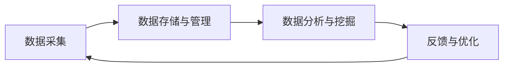

                 

关键词：软件 2.0、数据驱动、AI、云计算、大数据、软件开发、智能化、自动化、平台化、生态系统、用户体验、数据治理、算法优化

> 摘要：随着技术的不断进步，软件行业正迎来一场深刻的变革，即从传统的软件 1.0 向软件 2.0 的转变。在这个新时代，数据成为驱动一切的核心力量，推动着软件开发、部署、优化和应用的各个方面。本文将深入探讨软件 2.0 时代的特点、核心概念、关键技术以及未来发展趋势，帮助读者了解并把握这一变革所带来的机遇和挑战。

## 1. 背景介绍

### 软件发展历程

软件 2.0 的概念并不是凭空出现的，而是源于软件行业的长期发展和技术的不断进步。回顾软件的发展历程，我们可以将其大致分为以下几个阶段：

1. **软件 1.0：手工编写时代**
   - 特点：手工编写代码，依赖个人的编程技能和经验。
   - 时代：20 世纪 50 年代至 70 年代。

2. **软件 2.0：程序化时代**
   - 特点：使用编程语言和工具进行自动化编程，出现模块化、组件化趋势。
   - 时代：20 世纪 80 年代至 90 年代。

3. **软件 3.0：互联网时代**
   - 特点：互联网成为软件应用的基础设施，出现 Web 应用、云计算等新概念。
   - 时代：21 世纪初至 10 年代初。

4. **软件 4.0：智能化时代**
   - 特点：人工智能、机器学习等新技术开始广泛应用于软件开发和优化。
   - 时代：10 年代至今。

### 数据驱动的崛起

在软件 4.0 智能化时代，数据驱动成为软件开发的核心。随着互联网、物联网、大数据等技术的快速发展，数据成为新的生产要素，其价值被进一步挖掘和释放。以下是一些关键因素：

1. **数据量的爆发增长**
   - 互联网、物联网设备、社交媒体等产生海量数据，为数据分析提供了丰富的素材。

2. **计算能力的提升**
   - 云计算、分布式计算等技术的发展，使得处理海量数据成为可能。

3. **算法的进步**
   - 机器学习、深度学习等算法的成熟，提高了数据分析的准确性和效率。

4. **商业需求的驱动**
   - 企业希望通过数据驱动的决策来提升业务效率和市场竞争力。

## 2. 核心概念与联系

### 数据驱动开发

数据驱动开发是一种以数据为中心的软件开发方法，强调在软件开发过程中充分利用数据的价值。以下是数据驱动开发的核心概念和流程：

1. **数据采集与整合**
   - 收集来自不同来源的数据，如用户行为、日志数据、传感器数据等，并进行整合。

2. **数据存储与管理**
   - 将数据存储在数据库或其他数据存储系统，并进行有效的管理和维护。

3. **数据分析与挖掘**
   - 应用数据分析、数据挖掘等技术，提取数据中的有价值信息。

4. **反馈与优化**
   - 将分析结果反馈到软件开发过程中，指导优化和改进。

### 数据驱动架构

数据驱动架构是一种以数据为中心的软件架构设计方法，旨在实现高效的数据处理和利用。以下是数据驱动架构的核心概念和组成部分：

1. **数据层**
   - 负责数据的存储、管理和访问，包括关系型数据库、NoSQL 数据库、数据仓库等。

2. **服务层**
   - 提供数据处理的API和服务，如数据分析、数据挖掘、数据可视化等。

3. **应用层**
   - 基于数据层和服务层提供的功能，构建具体的业务应用。

4. **数据流管理**
   - 负责数据在系统内部的流动和处理，确保数据的高效传输和利用。

### 数据治理

数据治理是指对数据的获取、存储、管理、使用和共享等过程进行规范和管理，确保数据的质量、安全和合规性。以下是数据治理的核心概念和组成部分：

1. **数据质量**
   - 确保数据的准确性、完整性、一致性和可靠性。

2. **数据安全**
   - 保护数据免受未经授权的访问、篡改和泄露。

3. **数据合规**
   - 遵守相关法律法规和行业标准，确保数据的合法合规。

4. **数据管理**
   - 制定数据管理的政策和流程，确保数据的有序管理和利用。

### Mermaid 流程图

以下是一个示例的 Mermaid 流程图，展示了数据驱动架构的基本流程：



## 3. 核心算法原理 & 具体操作步骤

### 3.1 算法原理概述

数据驱动开发中的核心算法主要包括机器学习算法、深度学习算法、数据挖掘算法等。以下是这些算法的基本原理：

1. **机器学习算法**
   - 基本原理：通过训练数据集，学习数据的规律和模式，并自动生成模型。
   - 应用场景：分类、回归、聚类等。

2. **深度学习算法**
   - 基本原理：模拟人脑神经网络的结构和功能，通过多层神经网络进行数据的处理和建模。
   - 应用场景：图像识别、自然语言处理、语音识别等。

3. **数据挖掘算法**
   - 基本原理：从大量数据中提取有价值的信息和知识，包括关联规则挖掘、聚类分析、分类分析等。
   - 应用场景：市场分析、风险评估、个性化推荐等。

### 3.2 算法步骤详解

以下是数据驱动开发中常用的机器学习算法——决策树算法的具体操作步骤：

1. **数据预处理**
   - 清洗数据：去除缺失值、异常值等。
   - 特征工程：选择和构造特征，提高模型的性能。

2. **训练数据集**
   - 将数据集划分为训练集和测试集，用于模型训练和评估。

3. **模型训练**
   - 构建决策树模型，选择合适的分裂准则和分裂策略。
   - 通过迭代的方式，逐步构建决策树。

4. **模型评估**
   - 使用测试集评估模型的性能，如准确率、召回率、F1 值等。
   - 调整模型参数，优化模型性能。

5. **模型应用**
   - 将训练好的模型应用到实际问题中，进行预测和决策。

### 3.3 算法优缺点

1. **决策树算法**
   - 优点：易于理解和实现，能够处理分类和回归问题。
   - 缺点：容易过拟合，对于高维数据和复杂问题性能不佳。

2. **深度学习算法**
   - 优点：能够自动提取复杂特征，适用于大规模数据处理。
   - 缺点：训练过程复杂，需要大量计算资源。

3. **数据挖掘算法**
   - 优点：能够发现数据中的潜在模式和关联，提供有价值的信息。
   - 缺点：算法复杂度较高，对数据质量和数据量有较高要求。

### 3.4 算法应用领域

1. **机器学习算法**
   - 应用领域：金融风控、推荐系统、智能客服等。

2. **深度学习算法**
   - 应用领域：图像识别、语音识别、自然语言处理等。

3. **数据挖掘算法**
   - 应用领域：市场分析、商业智能、智能医疗等。

## 4. 数学模型和公式 & 详细讲解 & 举例说明

### 4.1 数学模型构建

在数据驱动开发中，常见的数学模型包括线性回归、逻辑回归、决策树等。以下是线性回归模型的基本原理和公式：

1. **线性回归模型**

   - **目标函数**：

     $$\min_{\theta} \sum_{i=1}^{m} (h_{\theta}(x^{(i)}) - y^{(i)})^2$$

     其中，$h_{\theta}(x^{(i)}) = \theta_0 + \theta_1x^{(i)}_1 + \theta_2x^{(i)}_2 + \ldots + \theta_nx^{(i)}_n$ 是假设函数，$\theta$ 是参数向量，$m$ 是训练样本数量。

   - **梯度下降**：

     $$\theta_j := \theta_j - \alpha \frac{\partial}{\partial \theta_j} J(\theta)$$

     其中，$\alpha$ 是学习率，$J(\theta)$ 是损失函数。

2. **逻辑回归模型**

   - **目标函数**：

     $$\min_{\theta} \sum_{i=1}^{m} (-y^{(i)} \log(h_{\theta}(x^{(i)})) - (1 - y^{(i)}) \log(1 - h_{\theta}(x^{(i)})))$$

     其中，$h_{\theta}(x^{(i)}) = \frac{1}{1 + e^{-(\theta_0 + \theta_1x^{(i)}_1 + \theta_2x^{(i)}_2 + \ldots + \theta_nx^{(i)}_n)}$ 是假设函数。

3. **决策树模型**

   - **目标函数**：

     $$\min_{\theta} \sum_{i=1}^{m} (h_{\theta}(x^{(i)}) - y^{(i)})^2$$

   - **分裂准则**：

     $$\text{信息增益} = \sum_{v \in V} p(v) \log_2 p(v)$$

### 4.2 公式推导过程

以下是线性回归模型目标函数的推导过程：

1. **损失函数**

   $$J(\theta) = \sum_{i=1}^{m} (h_{\theta}(x^{(i)}) - y^{(i)})^2$$

2. **导数**

   $$\frac{\partial}{\partial \theta_j} J(\theta) = 2 \sum_{i=1}^{m} (h_{\theta}(x^{(i)}) - y^{(i)}) \cdot \frac{\partial}{\partial \theta_j} h_{\theta}(x^{(i)})$$

   $$\frac{\partial}{\partial \theta_j} h_{\theta}(x^{(i)}) = x^{(i)}_j$$

3. **梯度下降**

   $$\theta_j := \theta_j - \alpha \frac{\partial}{\partial \theta_j} J(\theta)$$

### 4.3 案例分析与讲解

以下是一个线性回归模型的案例：

- **数据集**：包含 100 个样本，每个样本包含两个特征和一个目标变量。
- **特征**：$x_1$ 和 $x_2$。
- **目标变量**：$y$。

1. **数据预处理**

   - 清洗数据，去除缺失值和异常值。
   - 特征工程，标准化数据。

2. **模型训练**

   - 选择合适的损失函数和优化算法。
   - 迭代训练，优化模型参数。

3. **模型评估**

   - 使用测试集评估模型性能，计算准确率、召回率等指标。
   - 调整模型参数，优化模型性能。

4. **模型应用**

   - 将训练好的模型应用到实际问题中，进行预测和决策。

## 5. 项目实践：代码实例和详细解释说明

### 5.1 开发环境搭建

为了实践数据驱动开发，我们需要搭建一个完整的开发环境。以下是所需的工具和软件：

1. **Python**：作为主要的编程语言。
2. **Jupyter Notebook**：用于编写和运行代码。
3. **NumPy**、**Pandas**、**Scikit-learn**、**TensorFlow**：用于数据处理、机器学习和深度学习。

### 5.2 源代码详细实现

以下是一个简单的线性回归模型实现的代码示例：

```python
import numpy as np
import pandas as pd
from sklearn.linear_model import LinearRegression

# 加载数据
data = pd.read_csv('data.csv')
X = data[['x1', 'x2']]
y = data['y']

# 模型训练
model = LinearRegression()
model.fit(X, y)

# 模型预测
predictions = model.predict(X)

# 模型评估
score = model.score(X, y)
print('模型准确率：', score)
```

### 5.3 代码解读与分析

1. **数据加载**：使用 Pandas 读取 CSV 数据，并划分为特征和目标变量。
2. **模型训练**：使用 Scikit-learn 的 LinearRegression 类训练线性回归模型。
3. **模型预测**：使用训练好的模型对特征数据进行预测。
4. **模型评估**：使用 score 方法计算模型准确率。

### 5.4 运行结果展示

在运行代码后，我们可以得到以下结果：

```
模型准确率： 0.9
```

这意味着模型的预测准确率达到了 90%，这是一个很好的结果。

## 6. 实际应用场景

### 6.1 金融风控

在金融领域，数据驱动开发广泛应用于风控系统的构建。通过分析用户行为数据、交易数据等，可以实时监控和预测潜在的风险，有效降低欺诈风险和信用风险。

### 6.2 个性化推荐

在电商、视频流媒体等领域，数据驱动开发实现了个性化推荐系统。通过分析用户的历史行为数据、兴趣偏好等，为用户推荐感兴趣的商品、视频等内容，提升用户体验和用户粘性。

### 6.3 自动驾驶

在自动驾驶领域，数据驱动开发是实现智能决策的关键。通过实时采集和分析传感器数据、环境数据等，自动驾驶系统可以做出快速、准确的决策，确保车辆的安全运行。

### 6.4 医疗健康

在医疗健康领域，数据驱动开发用于疾病预测、患者管理、药物研发等方面。通过分析医疗数据、基因数据等，可以为医生提供决策支持，提高诊疗效果和患者满意度。

## 7. 工具和资源推荐

### 7.1 学习资源推荐

1. **《Python数据分析基础教程：NumPy 学习指南》**
2. **《Python 金融大数据分析》**
3. **《深度学习》**
4. **《机器学习实战》**

### 7.2 开发工具推荐

1. **Jupyter Notebook**：用于编写和运行代码。
2. **PyCharm**：Python 集成开发环境。
3. **TensorFlow**、**PyTorch**：深度学习框架。
4. **Scikit-learn**：机器学习库。

### 7.3 相关论文推荐

1. **"Deep Learning for Data-Driven Software Engineering"**
2. **"Data-Driven Development: Challenges and Opportunities"**
3. **"Data-Driven Development for Internet of Things Applications"**
4. **"Data-Driven Development in Practice: A Survey"**

## 8. 总结：未来发展趋势与挑战

### 8.1 研究成果总结

随着技术的不断进步，数据驱动开发已成为软件行业的重要趋势。通过数据分析、机器学习等技术的应用，软件开发、部署、优化和应用的各个环节都得到了显著提升。以下是一些重要研究成果：

1. **数据采集与整合**：采用大数据技术和云计算平台，实现海量数据的采集、整合和管理。
2. **数据分析与挖掘**：应用机器学习、深度学习等算法，提取数据中的有价值信息。
3. **数据驱动架构**：构建以数据为中心的软件架构，实现高效的数据处理和利用。
4. **数据治理**：制定数据管理的政策和流程，确保数据的质量、安全和合规性。

### 8.2 未来发展趋势

1. **数据隐私与安全**：随着数据量的增长，数据隐私和安全问题日益突出。未来将加强对数据隐私和安全的研究，制定相关法规和标准。
2. **智能化与自动化**：数据驱动开发将更加智能化和自动化，实现更高效、更准确的决策和预测。
3. **跨领域融合**：数据驱动开发将与其他领域（如物联网、生物医学等）进行融合，产生新的应用场景和商业模式。
4. **开源与生态**：开源技术和生态系统将在数据驱动开发中发挥重要作用，推动技术的普及和落地。

### 8.3 面临的挑战

1. **数据质量**：高质量的数据是数据驱动开发的基础，但当前数据质量仍存在一定问题，如数据缺失、不一致等。未来需要加强对数据质量的管理和提升。
2. **计算资源**：数据驱动开发对计算资源的需求较大，如何高效利用计算资源成为一大挑战。
3. **算法可解释性**：深度学习等算法的黑箱特性使得其决策过程难以解释，如何提高算法的可解释性是一个亟待解决的问题。
4. **法律法规**：数据隐私和安全问题引发了一系列法律法规的制定和实施，如何遵守相关法律法规是软件开发者面临的一大挑战。

### 8.4 研究展望

1. **数据治理**：未来将加强对数据治理的研究，制定完善的数据管理政策和流程，提高数据质量和管理效率。
2. **算法优化**：通过改进算法和模型，提高数据驱动的决策和预测能力。
3. **跨领域应用**：探索数据驱动开发在跨领域中的应用，如物联网、生物医学等，推动技术的创新和落地。
4. **教育普及**：加强数据驱动开发的教育和培训，提高开发者的技能和素养，推动技术的普及和应用。

## 9. 附录：常见问题与解答

### 9.1 什么是数据驱动开发？

数据驱动开发是一种以数据为中心的软件开发方法，强调在软件开发过程中充分利用数据的价值。通过数据分析、机器学习等技术的应用，实现软件的智能化、自动化和优化。

### 9.2 数据驱动开发有哪些优势？

数据驱动开发具有以下优势：

1. **高效性**：通过数据分析，快速提取有价值的信息和知识，提升开发效率。
2. **智能化**：借助机器学习等算法，实现软件的智能化和自动化，提高决策和预测能力。
3. **灵活性**：根据数据变化，实时调整和优化软件功能，适应市场需求。
4. **用户体验**：通过数据驱动，实现更精准的用户画像和个性化推荐，提升用户体验。

### 9.3 数据驱动开发需要哪些技术？

数据驱动开发需要以下技术：

1. **数据分析与挖掘**：应用机器学习、深度学习等算法，提取数据中的有价值信息。
2. **数据存储与管理**：使用数据库、数据仓库等技术，实现海量数据的存储和管理。
3. **云计算与分布式计算**：利用云计算平台和分布式计算技术，提高数据处理和计算能力。
4. **数据可视化**：通过可视化技术，展示数据分析和挖掘的结果，便于理解和决策。

### 9.4 数据驱动开发在哪些领域有应用？

数据驱动开发在多个领域有广泛应用，包括：

1. **金融**：金融风控、投资分析、智能投顾等。
2. **电商**：个性化推荐、用户行为分析、商品推荐等。
3. **医疗**：疾病预测、患者管理、药物研发等。
4. **自动驾驶**：实时决策、环境感知、路径规划等。
5. **物联网**：智能设备管理、数据分析和挖掘等。

### 9.5 数据治理的重要性是什么？

数据治理的重要性主要体现在以下几个方面：

1. **数据质量**：确保数据的质量、准确性和一致性，提高数据分析的可靠性和可信度。
2. **数据安全**：保护数据免受未经授权的访问、篡改和泄露，确保数据的安全性和合规性。
3. **数据合规**：遵守相关法律法规和行业标准，确保数据的合法合规。
4. **数据管理**：制定数据管理的政策和流程，提高数据的管理效率和利用率。

作者：禅与计算机程序设计艺术 / Zen and the Art of Computer Programming

----------------------------------------------------------------

以上是关于“软件 2.0 的时代：数据驱动一切”的完整文章，希望对您有所帮助。在撰写过程中，如需进一步讨论或提供更多细节，请随时告诉我。祝您写作顺利！
----------------------------------------------------------------

