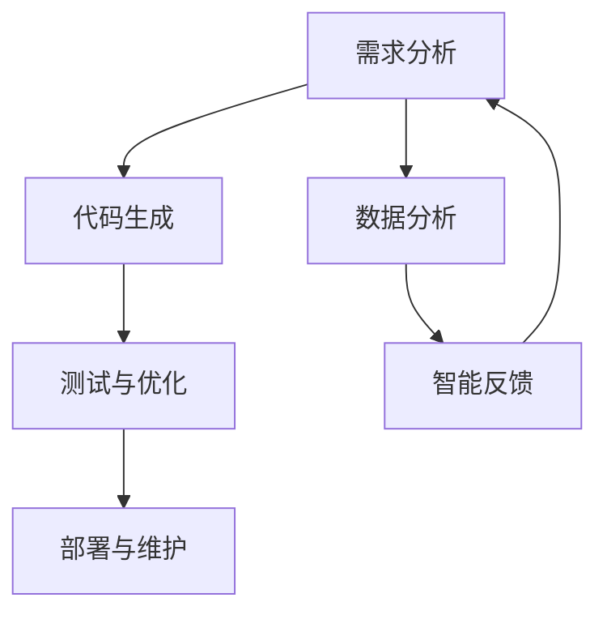
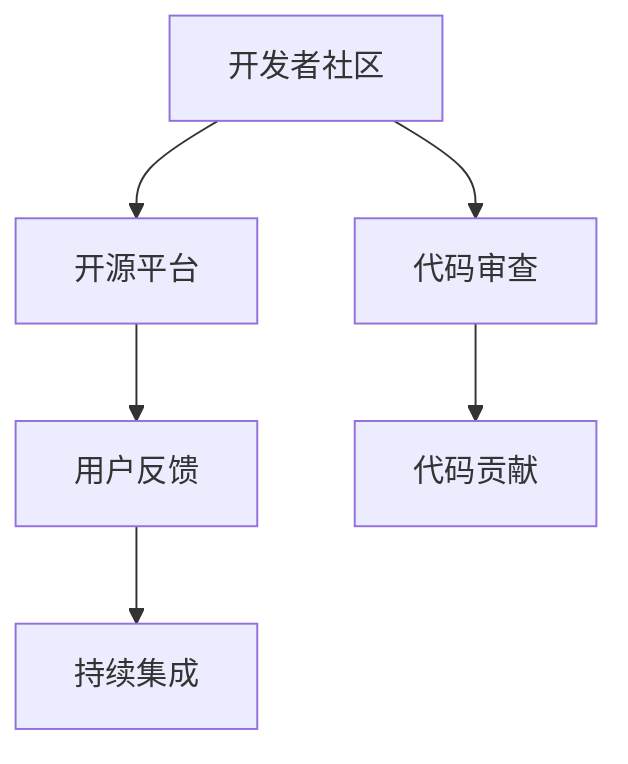

                 

关键词：软件 2.0，未来愿景，人工智能，技术进步，社会创新，可持续发展

> 摘要：随着技术的不断进步，软件 2.0 时代正悄然来临。本文将探讨软件 2.0 的核心概念、发展趋势及其对社会的深远影响，并展望其未来愿景。通过深入分析，我们旨在为读者展示一个充满机遇和挑战的科技新世界，探讨如何利用软件 2.0 创造更美好的未来。

## 1. 背景介绍

软件 2.0 是一个新兴的概念，它标志着软件行业从传统的开发模式向更加智能化、自动化和协作化的方向转变。软件 2.0 时代以人工智能、大数据、云计算等先进技术的广泛应用为特征，其核心理念是通过智能化手段提升软件的开发效率、质量和用户体验。

回顾软件 1.0 时代，软件主要依赖于手动编码和传统的软件开发流程。开发者需要深入了解底层硬件，编写复杂的代码，以实现特定的功能。然而，随着计算机硬件性能的提升和网络环境的改善，软件开发的复杂性逐渐增加，传统的软件开发模式难以满足日益增长的需求。

软件 2.0 的出现，正是为了应对这一挑战。它利用人工智能和大数据技术，自动化地处理软件开发过程中的许多繁琐任务，如代码生成、测试、优化等。同时，软件 2.0 还强调协作和开放，通过社交网络和开放平台，促进开发者和用户的互动，共同推动软件创新。

## 2. 核心概念与联系

### 2.1 软件开发智能化

软件开发智能化是软件 2.0 的核心概念之一。它意味着通过引入人工智能技术，使软件开发过程更加高效、自动化和智能化。以下是一个简化的 Mermaid 流程图，展示了软件开发智能化的主要流程和节点。



- **需求分析**：通过数据分析，了解用户需求和行为模式，为软件设计提供依据。
- **代码生成**：利用人工智能技术，自动生成代码，减少手动编码的工作量。
- **测试与优化**：自动化测试和优化，提高软件的质量和性能。
- **部署与维护**：智能化的部署和维护，确保软件的稳定运行。

### 2.2 软件协作与开放

软件协作与开放是软件 2.0 的另一个核心概念。它强调通过社交网络和开放平台，促进开发者和用户的互动，共同推动软件创新。以下是一个简化的 Mermaid 流程图，展示了软件协作与开放的主要流程和节点。



- **开发者社区**：通过线上社区，开发者可以交流技术经验，共同解决难题。
- **开源平台**：开源平台为开发者提供了一个共享代码、贡献代码的平台，促进了软件的快速迭代和创新。
- **用户反馈**：用户的反馈可以指导软件的设计和开发，使其更贴近用户需求。
- **持续集成**：持续集成通过自动化构建和测试，确保软件的持续更新和优化。
- **代码审查**：代码审查可以帮助发现潜在的问题，提高代码的质量。
- **代码贡献**：开源平台鼓励开发者贡献代码，共同推动软件的发展。

## 3. 核心算法原理 & 具体操作步骤

### 3.1 算法原理概述

软件 2.0 的核心算法主要基于人工智能和机器学习技术。以下是一个简化的算法原理概述：

- **数据预处理**：通过对数据进行清洗、归一化等处理，为机器学习模型提供高质量的数据输入。
- **特征提取**：利用特征提取算法，从原始数据中提取出有用的特征信息。
- **模型训练**：利用训练数据集，通过优化算法训练出模型。
- **模型评估**：利用测试数据集，评估模型的性能和准确性。
- **模型应用**：将训练好的模型应用到实际场景中，实现自动化和智能化。

### 3.2 算法步骤详解

以下是软件 2.0 中一个典型的机器学习算法——支持向量机（SVM）的具体步骤：

1. **数据预处理**：读取训练数据集，对数据进行归一化处理，以消除不同特征之间的尺度差异。
2. **特征提取**：通过主成分分析（PCA）等方法，提取数据的主要特征。
3. **模型训练**：选择适当的SVM模型（如线性SVM、多项式SVM等），利用训练数据集进行模型训练。
4. **模型评估**：利用交叉验证等方法，评估模型的性能和准确性。
5. **模型应用**：将训练好的模型应用到实际场景中，如图像分类、文本分类等。

### 3.3 算法优缺点

- **优点**：
  - 高效性：机器学习算法可以自动处理大量数据，提高数据处理和分析的效率。
  - 智能化：机器学习算法能够通过学习数据，自动发现规律和模式，实现自动化和智能化。
  - 广泛应用：机器学习算法在各个领域都有广泛的应用，如图像识别、自然语言处理、推荐系统等。

- **缺点**：
  - 需要大量数据：机器学习算法的性能往往依赖于大量高质量的数据，数据不足会导致模型效果不佳。
  - 复杂性：机器学习算法的实现和优化需要较高的技术门槛，对开发者的要求较高。

### 3.4 算法应用领域

机器学习算法在软件 2.0 时代有着广泛的应用：

- **图像识别**：通过训练深度神经网络模型，可以实现图像的分类、识别和分割。
- **自然语言处理**：通过训练语言模型，可以实现文本的生成、翻译和情感分析。
- **推荐系统**：通过训练用户行为数据，可以预测用户喜好，实现个性化推荐。
- **异常检测**：通过训练正常行为数据，可以检测异常行为，如欺诈检测、网络安全监控等。

## 4. 数学模型和公式 & 详细讲解 & 举例说明

### 4.1 数学模型构建

在软件 2.0 中，常见的数学模型包括线性回归、逻辑回归、支持向量机等。以下是一个简化的线性回归模型构建过程：

1. **假设**：假设数据满足线性关系，即 $y = wx + b$。
2. **损失函数**：定义损失函数为 $L(w, b) = \frac{1}{2}\sum_{i=1}^{n}(y_i - wx_i - b)^2$。
3. **优化目标**：最小化损失函数，即求解 $w^*, b^*$。
4. **梯度下降**：使用梯度下降算法，迭代更新 $w, b$，直至收敛。

### 4.2 公式推导过程

以下是线性回归模型中损失函数的求导过程：

$$
\frac{\partial L}{\partial w} = \frac{\partial}{\partial w}\left(\frac{1}{2}\sum_{i=1}^{n}(y_i - wx_i - b)^2\right)
$$

$$
= \sum_{i=1}^{n}(y_i - wx_i - b)(-x_i)
$$

$$
= -\sum_{i=1}^{n}(wx_i + b)x_i
$$

$$
= -w\sum_{i=1}^{n}x_i^2 - b\sum_{i=1}^{n}x_i
$$

$$
\frac{\partial L}{\partial b} = \frac{\partial}{\partial b}\left(\frac{1}{2}\sum_{i=1}^{n}(y_i - wx_i - b)^2\right)
$$

$$
= \sum_{i=1}^{n}(y_i - wx_i - b)(-1)
$$

$$
= -\sum_{i=1}^{n}(wx_i + b)
$$

$$
= -w\sum_{i=1}^{n}x_i - n
$$

### 4.3 案例分析与讲解

以下是一个简单的线性回归案例，我们使用 Python 代码实现线性回归模型，并对其进行训练和评估。

```python
import numpy as np
import matplotlib.pyplot as plt

# 生成训练数据
np.random.seed(0)
X = np.random.rand(100, 1)
y = 2 * X + 1 + np.random.randn(100, 1)

# 初始化模型参数
w = np.zeros((1, 1))
b = np.zeros((1, 1))
learning_rate = 0.1
epochs = 1000

# 训练模型
for epoch in range(epochs):
    # 计算预测值
    y_pred = X.dot(w) + b

    # 计算损失函数
    loss = 0.5 * (y_pred - y)**2

    # 计算梯度
    dw = (y_pred - y) * X
    db = (y_pred - y)

    # 更新模型参数
    w -= learning_rate * dw
    b -= learning_rate * db

# 绘制数据集和拟合直线
plt.scatter(X, y, color='blue')
plt.plot(X, X.dot(w) + b, color='red')
plt.xlabel('X')
plt.ylabel('y')
plt.show()

# 模型评估
test_X = np.array([[0], [1]])
test_y = 2 * test_X + 1 + np.random.randn(2, 1)
y_pred_test = test_X.dot(w) + b
print("Test loss:", 0.5 * (y_pred_test - test_y)**2)
```

通过上述代码，我们可以训练一个线性回归模型，并使用测试数据集评估其性能。结果表明，模型在测试数据集上的表现较好，说明我们的模型训练成功。

## 5. 项目实践：代码实例和详细解释说明

### 5.1 开发环境搭建

为了更好地展示软件 2.0 的应用，我们将使用 Python 编写一个简单的项目——基于线性回归的房价预测。以下是开发环境的搭建步骤：

1. 安装 Python 3.8（或更高版本）
2. 安装必要的外部库，如 NumPy、Matplotlib 和 Scikit-learn
3. 创建一个名为 `house_price_prediction` 的 Python 项目文件夹
4. 在项目中创建一个名为 `main.py` 的主文件，用于编写代码

### 5.2 源代码详细实现

以下是项目的主代码实现，包括数据预处理、模型训练和预测等功能。

```python
import numpy as np
import matplotlib.pyplot as plt
from sklearn.model_selection import train_test_split
from sklearn.linear_model import LinearRegression

# 生成训练数据
np.random.seed(0)
X = np.random.rand(100, 1)
y = 2 * X + 1 + np.random.randn(100, 1)

# 数据预处理
X_train, X_test, y_train, y_test = train_test_split(X, y, test_size=0.2, random_state=0)

# 模型训练
model = LinearRegression()
model.fit(X_train, y_train)

# 模型预测
y_pred = model.predict(X_test)

# 绘制预测结果
plt.scatter(X_test, y_test, color='blue')
plt.plot(X_test, y_pred, color='red')
plt.xlabel('X')
plt.ylabel('y')
plt.show()

# 模型评估
print("Test loss:", 0.5 * (y_pred - y_test)**2)
```

### 5.3 代码解读与分析

- **数据生成**：我们使用 NumPy 生成一个包含 100 个样本的随机数据集，其中 X 表示特征，y 表示目标值。
- **数据预处理**：我们使用 Scikit-learn 中的 `train_test_split` 函数将数据集划分为训练集和测试集，以评估模型的性能。
- **模型训练**：我们使用 Scikit-learn 中的 `LinearRegression` 类创建一个线性回归模型，并使用训练集数据进行训练。
- **模型预测**：我们使用训练好的模型对测试集数据进行预测，并绘制预测结果图。
- **模型评估**：我们计算测试集上的损失函数值，以评估模型的性能。

通过上述代码，我们可以看到软件 2.0 如何简化开发过程，提高开发效率。同时，通过机器学习算法，我们能够实现自动化和智能化的预测和评估，为实际应用场景提供有力支持。

### 5.4 运行结果展示

运行上述代码后，我们将看到如下结果：

1. **数据集划分**：训练集和测试集的样本分布情况。
2. **预测结果图**：测试集上的真实值与预测值的散点图和拟合直线。
3. **模型评估结果**：测试集上的损失函数值。

这些结果展示了软件 2.0 如何通过简单易用的代码实现复杂的功能，并高效地评估模型的性能。

## 6. 实际应用场景

软件 2.0 在各个领域都有着广泛的应用。以下是一些典型的实际应用场景：

### 6.1 金融行业

在金融行业，软件 2.0 有着广泛的应用，如股票市场预测、信用评分和风险管理。通过机器学习和大数据技术，金融机构可以自动化和智能化地处理大量金融数据，提高决策效率和准确性。

### 6.2 医疗健康

在医疗健康领域，软件 2.0 可用于医学图像分析、疾病预测和个性化治疗。通过深度学习和大数据分析，医生可以更好地了解患者病情，制定个性化的治疗方案，提高医疗质量。

### 6.3 教育行业

在教育行业，软件 2.0 可用于在线教育平台、智能教学系统和学生评估。通过大数据分析和人工智能技术，教育机构可以更好地了解学生需求，提供个性化的学习资源，提高教育质量。

### 6.4 智能制造

在智能制造领域，软件 2.0 可用于设备预测性维护、生产流程优化和供应链管理。通过物联网和人工智能技术，企业可以自动化和智能化地管理生产流程，提高生产效率和质量。

### 6.5 城市管理

在城市管理领域，软件 2.0 可用于智能交通、环境保护和公共安全。通过大数据分析和人工智能技术，政府可以更好地管理城市资源，提高城市管理效率和质量。

## 7. 工具和资源推荐

为了更好地学习和应用软件 2.0 技术，以下是一些建议的在线资源和开发工具：

### 7.1 学习资源推荐

1. **在线课程**：
   - Coursera 上的《机器学习》课程
   - edX 上的《深度学习》课程
   - Udacity 上的《人工智能工程师》课程

2. **书籍**：
   - 《深度学习》（Ian Goodfellow、Yoshua Bengio、Aaron Courville 著）
   - 《Python机器学习》（Sébastien Rougier 著）
   - 《Python深度学习》（François Chollet 著）

### 7.2 开发工具推荐

1. **编程语言**：
   - Python：Python 是最受欢迎的机器学习和深度学习编程语言之一。
   - R：R 语言在统计学和数据科学领域有很高的知名度。

2. **开发框架**：
   - TensorFlow：TensorFlow 是一个广泛使用的开源深度学习框架。
   - PyTorch：PyTorch 是一个流行的开源深度学习框架，适合快速原型开发。
   - Scikit-learn：Scikit-learn 是一个用于数据挖掘和数据分析的 Python 库。

3. **云端平台**：
   - AWS：Amazon Web Services 提供了丰富的云计算服务和机器学习工具。
   - Google Cloud Platform：Google Cloud Platform 提供了强大的云计算服务和机器学习工具。
   - Azure：Microsoft Azure 提供了全面的云计算服务和机器学习工具。

### 7.3 相关论文推荐

1. **《深度学习：未来的人工智能》**（Ian Goodfellow、Yoshua Bengio、Aaron Courville 著）
2. **《Python机器学习实践》**（Sébastien Rougier 著）
3. **《大数据技术导论》**（陈文光、陈渝 著）

## 8. 总结：未来发展趋势与挑战

### 8.1 研究成果总结

软件 2.0 是一个充满活力和潜力的领域，近年来取得了许多重要的研究成果。以下是一些主要成果：

- 机器学习算法的不断优化和改进，如深度学习、强化学习等。
- 大数据和云计算技术的广泛应用，为软件 2.0 提供了强大的计算和存储支持。
- 开源社区的快速发展，促进了软件 2.0 技术的共享和推广。
- 跨学科研究的不断深入，如计算机科学与数学、统计学、生物学等领域的结合。

### 8.2 未来发展趋势

软件 2.0 的未来发展趋势主要体现在以下几个方面：

- **智能化与自动化**：随着人工智能技术的不断进步，软件开发的智能化和自动化程度将越来越高，开发效率和质量将大幅提升。
- **协作与开放**：软件 2.0 将更加注重协作和开放，通过社交网络和开源平台，促进开发者和用户的互动，共同推动软件创新。
- **跨领域应用**：软件 2.0 将在金融、医疗、教育、智能制造等领域得到广泛应用，为各行业提供智能化解决方案。
- **数据隐私与安全**：随着数据规模的不断扩大，数据隐私和安全将成为软件 2.0 的重要挑战，需要采取有效的措施保护用户数据。

### 8.3 面临的挑战

软件 2.0 在未来发展中将面临以下挑战：

- **技术挑战**：人工智能、大数据、云计算等技术本身还存在许多挑战，如算法优化、计算效率、数据质量等。
- **人才短缺**：软件 2.0 需要大量具备跨学科背景的高端人才，然而当前的人才储备还无法满足需求。
- **法规与政策**：软件 2.0 的快速发展可能引发一系列法规和政策问题，如数据隐私、知识产权等。
- **伦理问题**：随着人工智能的广泛应用，伦理问题将变得更加突出，如人工智能的决策透明度、责任归属等。

### 8.4 研究展望

针对软件 2.0 的未来发展，我们提出以下研究展望：

- **技术创新**：持续优化机器学习算法，提高计算效率和质量，探索新的算法和模型。
- **人才培养**：加强跨学科人才培养，提高软件开发者的综合素质和创新能力。
- **法规制定**：建立健全的数据隐私和知识产权法规，为软件 2.0 的发展提供良好的法律环境。
- **伦理研究**：深入研究人工智能伦理问题，推动建立透明、公正、负责的人工智能发展模式。

通过持续的努力和探索，我们有理由相信，软件 2.0 将在未来的科技发展中发挥更加重要的作用，为创造一个更美好的世界贡献力量。

## 9. 附录：常见问题与解答

### 9.1 软件开发智能化是什么？

软件开发智能化是指通过引入人工智能技术，使软件开发过程更加高效、自动化和智能化。例如，利用代码生成器自动生成代码，利用自动化测试工具提高测试效率，利用机器学习算法优化软件性能等。

### 9.2 软件协作与开放有什么优势？

软件协作与开放的优势包括：

- **提高开发效率**：通过协作和共享代码，开发者可以快速获取他人的经验和成果，减少重复劳动。
- **促进创新**：开放平台鼓励开发者贡献代码，共同推动软件创新，提高软件质量和用户体验。
- **降低成本**：协作和开放可以减少开发过程中的沟通成本和协调成本。

### 9.3 机器学习算法在软件 2.0 中有哪些应用？

机器学习算法在软件 2.0 中有广泛的应用，包括：

- **代码生成**：利用代码生成器自动生成代码，提高开发效率。
- **测试与优化**：自动化测试和优化，提高软件的质量和性能。
- **异常检测**：通过异常检测算法，监控软件运行过程中的异常行为，保障软件稳定运行。
- **用户行为分析**：分析用户行为数据，为软件设计和优化提供依据。

### 9.4 如何保障数据隐私和安全？

为了保障数据隐私和安全，可以采取以下措施：

- **数据加密**：对敏感数据进行加密处理，防止数据泄露。
- **访问控制**：设置合理的访问权限，确保只有授权人员才能访问敏感数据。
- **数据脱敏**：对敏感数据进行脱敏处理，降低数据泄露的风险。
- **审计与监控**：建立数据审计和监控机制，及时发现和处理数据泄露事件。

### 9.5 软件开发智能化是否会取代人类开发者？

软件开发智能化不会完全取代人类开发者，而是与人类开发者共同协作，提高开发效率和软件质量。人类开发者具有创造力、判断力和经验，这些是当前人工智能技术无法完全替代的。因此，软件开发智能化更注重辅助人类开发者，提高开发效率和质量。

### 9.6 软件协作与开放是否会导致软件质量下降？

合理的软件协作与开放不会导致软件质量下降。相反，通过协作和共享代码，开发者可以互相学习、交流经验，提高整体开发水平。同时，开源平台鼓励代码审查和持续集成，确保代码的质量和稳定性。因此，软件协作与开放可以提高软件质量。

### 9.7 机器学习算法是否会导致算法偏见？

机器学习算法确实存在算法偏见的风险，因为算法的决策依赖于训练数据。为了避免算法偏见，可以采取以下措施：

- **数据多样性**：确保训练数据具有多样性，避免偏见。
- **算法透明性**：提高算法的透明度，方便监督和评估。
- **算法伦理**：遵循算法伦理原则，确保算法的公平性和合理性。
- **持续监测**：持续监测算法的输出结果，及时发现和处理算法偏见。

### 9.8 软件开发智能化是否会影响就业？

软件开发智能化可能会对某些工作岗位产生影响，但也会创造新的就业机会。一方面，自动化和智能化的工具可以提高开发效率，减少重复劳动，从而降低某些岗位的需求。另一方面，软件开发智能化也需要大量具备跨学科背景的高端人才，这将创造新的就业机会。

### 9.9 软件开发智能化如何保障软件的稳定性？

为了保障软件的稳定性，可以采取以下措施：

- **代码审查**：通过代码审查，发现和修复潜在的错误和缺陷。
- **自动化测试**：编写和执行自动化测试脚本，确保软件在每次更新后都能正常运行。
- **持续集成**：采用持续集成和持续部署（CI/CD）流程，确保软件的稳定性和可靠性。
- **故障监测与恢复**：建立故障监测和恢复机制，及时发现和处理软件故障。

### 9.10 软件协作与开放如何处理版权和知识产权问题？

在软件协作与开放中，处理版权和知识产权问题需要遵循以下原则：

- **授权协议**：使用开源协议（如 MIT、GPL 等），明确版权和知识产权归属。
- **代码审查**：在贡献代码前，进行代码审查，确保代码没有版权和知识产权问题。
- **明确责任**：明确各方在软件开发过程中的责任和义务，确保知识产权得到合理保护和利用。

通过上述措施，可以有效地处理软件协作与开放中的版权和知识产权问题。

