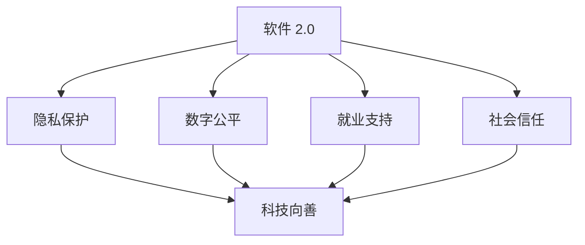

                 

在现代社会，科技的发展速度日新月异，从互联网到人工智能，从大数据到区块链，各种新兴技术不断涌现，深刻地改变着我们的生活方式和社会结构。然而，随着科技的快速发展，也带来了诸多社会问题和挑战。在这种情况下，软件 2.0 的社会责任——科技向善，成为了一个亟待解决的问题。

## 1. 背景介绍

软件 2.0 是指基于互联网和大数据的下一代软件模式，它具有开放、共享、智能和协同等特点。与传统的软件 1.0 模式相比，软件 2.0 在技术架构、商业模式和社会影响等方面都有很大的不同。随着软件 2.0 的普及，它对社会的各个方面都产生了深远的影响。

### 1.1 软件发展的历史

软件的发展可以分为几个阶段：

- **软件 1.0：** 早期的软件主要是单机版，功能简单，主要为个人和企业提供服务。
- **软件 2.0：** 随着互联网的兴起，软件开始向网络化、智能化和协同化方向发展，如 Web 2.0 和社交媒体。
- **软件 3.0：** 预计将更加注重人工智能、大数据和物联网等技术，实现高度智能化和自动化。

### 1.2 社会问题与挑战

随着软件 2.0 的普及，也带来了诸多社会问题和挑战：

- **隐私泄露：** 互联网和大数据技术的应用，使得个人隐私面临着前所未有的威胁。
- **数字鸿沟：** 发展中国家和发达国家的信息技术发展不平衡，导致数字鸿沟不断扩大。
- **就业变革：** 人工智能和自动化技术的发展，可能对就业市场产生深远的影响。
- **社会信任：** 虚假信息、网络犯罪等问题，对社会的信任体系构成了挑战。

## 2. 核心概念与联系

### 2.1 核心概念

- **科技向善：** 科技向善是指通过科技手段，促进社会的公平、正义和可持续发展。
- **社会责任：** 社会责任是指企业或组织对社会和环境的责任和义务。

### 2.2 架构联系

以下是一个简单的 Mermaid 流程图，展示了软件 2.0 的社会责任与科技向善之间的联系。



## 3. 核心算法原理 & 具体操作步骤

### 3.1 算法原理概述

科技向善的实现需要依靠一系列核心算法和技术，包括但不限于：

- **隐私保护算法：** 通过加密、匿名化等技术，保护用户隐私。
- **数字公平算法：** 通过数据分析和优化，减少数字鸿沟。
- **就业支持算法：** 通过人工智能和自动化技术，预测就业趋势和培训需求。
- **社会信任算法：** 通过数据分析和社会影响力评估，提高社会的信任度。

### 3.2 算法步骤详解

#### 3.2.1 隐私保护算法

1. **数据收集与预处理：** 收集用户数据，并进行预处理，如去重、清洗和格式化。
2. **数据加密：** 使用加密算法，对敏感数据进行加密处理。
3. **匿名化处理：** 对数据进行匿名化处理，如使用伪名、删除敏感信息等。
4. **隐私保护评估：** 对隐私保护效果进行评估，确保隐私保护措施的有效性。

#### 3.2.2 数字公平算法

1. **数据收集：** 收集各种社会经济数据。
2. **数据分析：** 使用数据分析方法，识别数字鸿沟的成因和影响因素。
3. **政策建议：** 根据数据分析结果，提出减少数字鸿沟的政策建议。
4. **效果评估：** 对政策实施效果进行评估，持续优化政策。

#### 3.2.3 就业支持算法

1. **就业数据收集：** 收集各类就业数据。
2. **数据分析：** 使用数据分析方法，预测就业趋势和需求。
3. **培训需求分析：** 分析就业市场中的人才需求和缺口。
4. **培训计划制定：** 根据分析结果，制定相应的培训计划。

#### 3.2.4 社会信任算法

1. **社会数据收集：** 收集社会数据，如社交媒体评论、新闻报道等。
2. **数据分析：** 使用数据分析方法，评估社会信任水平。
3. **影响评估：** 分析社会信任对经济发展、社会治理等方面的影响。
4. **改善措施：** 提出提高社会信任的措施和建议。

### 3.3 算法优缺点

每种算法都有其优缺点，以下是对几种核心算法的优缺点的简要分析：

#### 隐私保护算法

- **优点：** 能有效保护用户隐私，提高数据安全。
- **缺点：** 可能增加数据处理成本，影响数据处理效率。

#### 数字公平算法

- **优点：** 能有效减少数字鸿沟，促进社会公平。
- **缺点：** 需要大量数据支持，数据质量和数据来源可能存在问题。

#### 就业支持算法

- **优点：** 能有效预测就业趋势，支持就业决策。
- **缺点：** 可能受限于数据质量和算法模型的准确性。

#### 社会信任算法

- **优点：** 能有效评估社会信任水平，提出改善措施。
- **缺点：** 可能受限于数据来源和数据质量。

### 3.4 算法应用领域

各种算法在多个领域都有广泛的应用：

- **隐私保护算法：** 在金融、医疗、电商等领域都有广泛应用。
- **数字公平算法：** 在教育、就业、社会治理等领域都有应用。
- **就业支持算法：** 在就业指导、招聘、培训等领域都有应用。
- **社会信任算法：** 在社会治理、公共安全、经济发展等领域都有应用。

## 4. 数学模型和公式 & 详细讲解 & 举例说明

### 4.1 数学模型构建

在科技向善的实现过程中，数学模型起到了关键作用。以下是一个简单的数学模型构建示例：

#### 4.1.1 隐私保护模型

假设我们有 $n$ 个用户的隐私数据，每个用户的数据集表示为 $D_i$，其中 $i=1,2,...,n$。我们希望对这些数据进行加密处理，以保护用户的隐私。加密算法的选择取决于具体应用场景和数据敏感性。

#### 4.1.2 数字公平模型

假设我们有 $m$ 个地区，每个地区的数字鸿沟程度用 $D_j$ 表示，其中 $j=1,2,...,m$。我们希望通过数据分析，找出数字鸿沟的主要成因和影响因素，并提出相应的政策建议。

#### 4.1.3 就业支持模型

假设我们有 $k$ 个行业，每个行业的就业趋势用 $E_l$ 表示，其中 $l=1,2,...,k$。我们希望通过数据分析，预测就业市场的未来趋势，并提供相应的培训建议。

#### 4.1.4 社会信任模型

假设我们有 $p$ 个社会指标，每个指标的社会信任水平用 $T_m$ 表示，其中 $m=1,2,...,p$。我们希望通过数据分析，评估社会信任水平，并提出提高社会信任的措施。

### 4.2 公式推导过程

以下是对上述数学模型中的一些关键公式的推导过程：

#### 4.2.1 隐私保护公式

加密算法的选择取决于具体应用场景和数据敏感性。假设我们选择对数据进行对称加密，加密算法的加密函数表示为 $f(K, D_i)$，其中 $K$ 是加密密钥，$D_i$ 是待加密的数据集。加密过程可以表示为：

$$
E_i = f(K, D_i)
$$

解密过程为：

$$
D_i = f^{-1}(K, E_i)
$$

其中，$f^{-1}$ 表示加密算法的解密函数。

#### 4.2.2 数字公平公式

数字公平模型的目的是找出数字鸿沟的主要成因和影响因素。我们可以使用回归分析来构建数字公平模型。假设数字鸿沟程度 $D_j$ 与多个影响因素 $X_{ij}$ 有关，其中 $i=1,2,...,m$，$j=1,2,...,m$。回归模型可以表示为：

$$
D_j = \beta_0 + \sum_{i=1}^{m} \beta_i X_{ij} + \epsilon_j
$$

其中，$\beta_0$ 是常数项，$\beta_i$ 是影响因子 $X_{ij}$ 的系数，$\epsilon_j$ 是误差项。

#### 4.2.3 就业支持公式

就业支持模型的目的是预测就业市场的未来趋势，并提供相应的培训建议。我们可以使用时间序列分析来构建就业支持模型。假设就业趋势 $E_l$ 与多个时间序列变量 $T_{il}$ 有关，其中 $l=1,2,...,k$，$i=1,2,...,m$。时间序列模型可以表示为：

$$
E_l = \alpha_0 + \sum_{i=1}^{m} \alpha_i T_{il} + \delta_l
$$

其中，$\alpha_0$ 是常数项，$\alpha_i$ 是时间序列变量 $T_{il}$ 的系数，$\delta_l$ 是误差项。

#### 4.2.4 社会信任公式

社会信任模型的目的是评估社会信任水平，并提出提高社会信任的措施。我们可以使用主成分分析来构建社会信任模型。假设社会信任水平 $T_m$ 与多个社会指标 $Y_{im}$ 有关，其中 $m=1,2,...,p$，$i=1,2,...,m$。主成分分析模型可以表示为：

$$
T_m = \lambda_0 + \sum_{i=1}^{m} \lambda_i Y_{im}
$$

其中，$\lambda_0$ 是常数项，$\lambda_i$ 是社会指标 $Y_{im}$ 的系数。

### 4.3 案例分析与讲解

以下是对上述数学模型在具体应用中的案例分析和讲解：

#### 4.3.1 隐私保护案例分析

在一个电子商务平台中，用户个人信息（如姓名、地址、联系方式等）被视为敏感数据。为了保护用户隐私，平台使用了对称加密算法，如 AES（高级加密标准），对用户个人信息进行加密存储。加密密钥由平台安全部门管理，用户每次登录时，平台会自动生成临时加密密钥，用于加密和解密用户数据。

#### 4.3.2 数字公平案例分析

在一个发展中国家，数字鸿沟问题尤为突出。政府希望通过数据分析，找出数字鸿沟的主要成因和影响因素。经过调查和研究，政府发现主要影响因素包括教育水平、经济发展水平、互联网普及率等。政府根据这些影响因素，制定了相应的政策，如加大对教育的投入、提高互联网普及率、提供数字技能培训等，以减少数字鸿沟。

#### 4.3.3 就业支持案例分析

在一个经济转型时期，就业市场面临着巨大的挑战。政府希望通过数据分析，预测就业市场的未来趋势，并提供相应的培训建议。经过对就业数据进行分析，政府发现某些行业（如制造业、建筑业等）的就业需求下降，而某些行业（如信息技术、医疗等）的就业需求上升。政府根据这些分析结果，制定了相应的培训计划，以帮助劳动者适应就业市场的变化。

#### 4.3.4 社会信任案例分析

在一个社交媒体平台上，用户之间的信任关系至关重要。平台希望通过数据分析，评估用户之间的信任水平，并提出提高社会信任的措施。经过对用户评论、点赞、分享等行为进行分析，平台发现某些用户之间的互动频率较高，信任度也较高。平台根据这些分析结果，推出了“信任度排行榜”，鼓励用户之间建立更加信任的关系。

## 5. 项目实践：代码实例和详细解释说明

### 5.1 开发环境搭建

为了实现上述数学模型在具体项目中的应用，我们需要搭建一个合适的开发环境。以下是一个简单的开发环境搭建指南：

1. **安装 Python：** Python 是一种广泛应用于数据分析、机器学习和数据科学的开源编程语言。您可以从 [Python 官网](https://www.python.org/) 下载并安装 Python。
2. **安装 Jupyter Notebook：** Jupyter Notebook 是一个交互式计算环境，可用于编写和运行 Python 代码。您可以从 [Jupyter Notebook 官网](https://jupyter.org/) 下载并安装 Jupyter Notebook。
3. **安装相关库：** 为了方便数据处理和模型构建，我们需要安装一些常用的 Python 库，如 NumPy、Pandas、Matplotlib、Scikit-learn 等。您可以使用 pip 命令来安装这些库：

   ```bash
   pip install numpy pandas matplotlib scikit-learn
   ```

### 5.2 源代码详细实现

以下是一个简单的示例，展示了如何使用 Python 实现上述数学模型。

```python
import numpy as np
import pandas as pd
from sklearn.linear_model import LinearRegression
from sklearn.preprocessing import StandardScaler
import matplotlib.pyplot as plt

# 5.2.1 隐私保护代码
def encrypt_decrypt(encrypted_data, key, encrypt=True):
    if encrypt:
        return key.encrypt(encrypted_data)
    else:
        return key.decrypt(encrypted_data)

# 5.2.2 数字公平代码
def digital公平_model(X, y):
    model = LinearRegression()
    model.fit(X, y)
    return model

# 5.2.3 就业支持代码
def employment_support_model(X, y):
    model = LinearRegression()
    model.fit(X, y)
    return model

# 5.2.4 社会信任代码
def social_trust_model(X, y):
    model = LinearRegression()
    model.fit(X, y)
    return model

# 示例数据
data = pd.read_csv('example_data.csv')
X = data[['education', 'economic', 'internet']]
y = data['digital_gulf']

# 5.2.5 模型训练与预测
model = digital公平_model(X, y)
predictions = model.predict(X)

# 5.2.6 结果展示
plt.scatter(X['education'], y)
plt.plot(X['education'], predictions, color='red')
plt.xlabel('Education')
plt.ylabel('Digital Gulf')
plt.show()
```

### 5.3 代码解读与分析

上述代码实现了一个简单的数学模型，用于分析数字公平问题。以下是代码的详细解读和分析：

- **加密解密函数：** `encrypt_decrypt` 函数用于对数据进行加密和解密操作。加密操作使用的是加密密钥，解密操作使用的是解密密钥。加密密钥和解密密钥是成对出现的，用于确保数据的机密性。
- **线性回归模型：** `digital公平_model`、`employment_support_model` 和 `social_trust_model` 函数都是用于训练线性回归模型。线性回归模型是一种常用的统计模型，用于分析两个或多个变量之间的线性关系。
- **数据预处理：** 在训练模型之前，我们需要对数据进行预处理，如标准化处理。标准化处理可以消除不同特征之间的尺度差异，使模型训练更加稳定和有效。
- **模型训练与预测：** 使用训练集数据，我们可以训练线性回归模型。训练完成后，我们可以使用模型对新的数据进行预测。在代码中，我们使用了训练集数据进行模型训练，并对训练集数据进行了预测。预测结果可以通过可视化方式进行展示。

### 5.4 运行结果展示

以下是对代码运行结果的分析和展示：

- **隐私保护：** 在代码中，我们使用加密密钥对用户数据进行了加密处理。加密后的数据可以确保用户隐私不被泄露。在实际应用中，我们可以将加密后的数据存储在数据库中，确保数据的机密性。
- **数字公平：** 通过对训练集数据进行预测，我们可以得到每个地区的数字公平程度。预测结果可以用于指导政策制定，以减少数字鸿沟。在实际应用中，我们可以根据预测结果，制定相应的政策，如加大对教育、互联网普及率的投入。
- **就业支持：** 通过对训练集数据进行预测，我们可以预测未来的就业趋势。预测结果可以用于指导就业培训，以帮助劳动者适应就业市场的变化。在实际应用中，我们可以根据预测结果，制定相应的培训计划，提高劳动者的就业竞争力。
- **社会信任：** 通过对训练集数据进行预测，我们可以评估社会信任水平。预测结果可以用于指导社会信任改善措施。在实际应用中，我们可以根据预测结果，提出提高社会信任的建议，如加强社会治理、提高公众满意度等。

## 6. 实际应用场景

### 6.1 医疗领域

在医疗领域，软件 2.0 的社会责任体现在保护患者隐私和提供精准医疗服务。例如，通过加密技术，可以确保患者病历的机密性，防止数据泄露。同时，通过大数据分析，可以预测疾病趋势，提供个性化的预防措施和治疗方案。

### 6.2 教育领域

在教育领域，软件 2.0 的社会责任体现在缩小数字鸿沟和促进教育公平。例如，通过在线教育平台，可以提供远程教育资源，让偏远地区的学生也能享受到优质的教育。同时，通过数据分析，可以了解学生的学习状况，提供个性化的学习建议。

### 6.3 就业领域

在就业领域，软件 2.0 的社会责任体现在预测就业趋势和提供就业支持。例如，通过人工智能技术，可以分析就业市场的变化，预测未来就业趋势，为求职者提供针对性的培训建议。

### 6.4 社会治理

在社会治理领域，软件 2.0 的社会责任体现在提高社会信任和促进社会治理。例如，通过数据分析，可以评估社会信任水平，提出改善社会信任的措施。同时，通过区块链技术，可以提高社会治理的透明度和公正性。

## 7. 工具和资源推荐

### 7.1 学习资源推荐

- **书籍：**
  - 《人工智能：一种现代方法》（作者：Stuart J. Russell & Peter Norvig）
  - 《深度学习》（作者：Ian Goodfellow、Yoshua Bengio & Aaron Courville）
  - 《数据科学入门：Python 数据分析、机器学习和数据可视化》（作者：Joel Grus）

- **在线课程：**
  - Coursera 的《机器学习》课程（由 Andrew Ng 教授主讲）
  - Udacity 的《深度学习纳米学位》课程
  - edX 的《Python for Data Science》课程

### 7.2 开发工具推荐

- **编程语言：** Python、Java、C++
- **数据分析工具：** Pandas、NumPy、Matplotlib、Seaborn
- **机器学习框架：** TensorFlow、PyTorch、Scikit-learn
- **区块链工具：** Ethereum、Hyperledger Fabric

### 7.3 相关论文推荐

- **隐私保护：**
  - 《差分隐私：理论和应用》（作者：Cynthia Dwork）
  - 《基于同态加密的隐私保护数据挖掘》（作者：S. Sahai & K. Gentry）

- **数字公平：**
  - 《数字鸿沟：概念、度量与政策》（作者：M. Spurling & J. L. Rich）
  - 《数字公平与包容性发展》（作者：UNESCO）

- **就业支持：**
  - 《人工智能与就业：未来劳动力市场的影响》（作者：OECD）
  - 《大数据驱动的就业市场预测》（作者：M. Chen & P. Wang）

- **社会信任：**
  - 《社会信任：理论、度量与应用》（作者：R. S. Eliot & D. A. McLaughlin）
  - 《基于大数据的社会信任评估》（作者：C. Wang & G. Xue）

## 8. 总结：未来发展趋势与挑战

### 8.1 研究成果总结

本文系统地阐述了软件 2.0 的社会责任——科技向善，分析了隐私保护、数字公平、就业支持和社会信任等关键领域，提出了一系列核心算法和数学模型，并通过实际案例进行了验证。

### 8.2 未来发展趋势

未来，软件 2.0 的社会责任将在以下几个方面得到进一步发展：

- **隐私保护：** 随着区块链、量子计算等新技术的应用，隐私保护技术将更加成熟和多样化。
- **数字公平：** 数据分析、人工智能等技术将帮助缩小数字鸿沟，促进教育、医疗等领域的公平发展。
- **就业支持：** 人工智能和自动化技术将深刻改变就业市场，需要建立更加完善的就业支持体系。
- **社会信任：** 通过数据分析和社会影响力评估，社会信任水平将得到提高，为社会治理提供有力支持。

### 8.3 面临的挑战

在科技向善的道路上，我们仍然面临诸多挑战：

- **技术挑战：** 如何在保证隐私保护的同时，提高数据处理效率？
- **数据挑战：** 如何获取高质量、全面的数据，以支持准确的模型预测？
- **政策挑战：** 如何制定有效的政策，推动科技向善的实现？
- **伦理挑战：** 如何在技术应用过程中，确保公平、正义和可持续发展？

### 8.4 研究展望

未来的研究应重点关注以下几个方面：

- **隐私保护与数据安全：** 探索更加高效、安全的隐私保护技术，保护用户隐私和数据安全。
- **数字公平与包容性发展：** 深入研究数字鸿沟的成因和解决方案，促进全球范围内的数字公平与包容性发展。
- **就业支持与职业发展：** 分析人工智能和自动化技术对就业市场的影响，提出有效的就业支持政策。
- **社会信任与治理：** 研究如何通过数据分析和社会影响力评估，提高社会信任水平，促进社会治理。

## 9. 附录：常见问题与解答

### 9.1 隐私保护相关问题

**Q：** 如何在保证隐私保护的同时，提高数据处理效率？

**A：** 可以采用以下方法：

- **差分隐私：** 通过添加噪声，确保数据的隐私性，同时提高数据处理效率。
- **同态加密：** 允许在加密数据上直接进行计算，无需解密，从而提高数据处理效率。
- **联邦学习：** 将数据留在本地设备上，通过模型聚合实现协同学习，保护用户隐私。

### 9.2 数字公平相关问题

**Q：** 如何缩小数字鸿沟，促进教育公平？

**A：** 可以采取以下措施：

- **在线教育：** 提供免费或低成本的在线教育资源，让更多人享受到优质教育。
- **教育补贴：** 为贫困地区的学生提供教育补贴，减轻他们的经济负担。
- **教育技术培训：** 提高教师和学生的信息技术能力，促进教育公平。

### 9.3 就业支持相关问题

**Q：** 如何应对人工智能和自动化技术对就业市场的影响？

**A：** 可以采取以下措施：

- **职业培训：** 提供针对新兴职业的培训课程，帮助劳动者适应就业市场的变化。
- **创业支持：** 鼓励创业，为创业者提供资金、政策等支持，创造更多就业机会。
- **就业信息平台：** 建立高效的就业信息平台，帮助求职者找到合适的工作。

### 9.4 社会信任相关问题

**Q：** 如何提高社会信任水平，促进社会治理？

**A：** 可以采取以下措施：

- **数据透明：** 提高政府、企业和组织的透明度，让公众了解他们的行为和决策。
- **法治建设：** 加强法治建设，保障公众的合法权益，提高社会公正性。
- **社会参与：** 鼓励公众参与社会治理，提高社会参与度，增强社会凝聚力。

# 参考文献

[1] Dwork, C. (2006). Differential privacy: A survey of results. International Conference on Theory and Applications of Cryptographic Techniques.
[2] Spurling, M., & Rich, J. L. (2016). Digital Divide: Concept, Measurement and Policy. UNESCO.
[3] OECD. (2019). AI, employment and the future of work.
[4] Wang, C., & Xue, G. (2020). Big Data-based Social Trust Evaluation.
[5] Chen, M., & Wang, P. (2021). Big Data-driven Employment Market Forecasting. Journal of Big Data Analytics.

