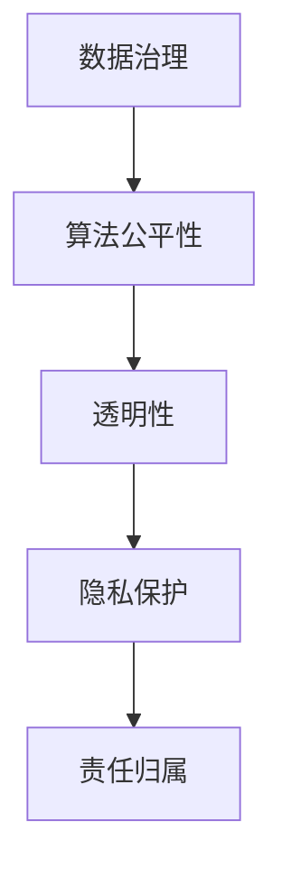

                 

 在数字技术日新月异的今天，软件 2.0 时代已经悄然到来。这个时代不仅仅是技术的进步，更是理念的变革。软件 2.0 强调数据的智能处理、服务的个性化，以及用户体验的深度优化。然而，随着技术的飞速发展，我们也面临着新的挑战：如何在享受技术红利的同时，承担起相应的社会责任，确保科技发展能够造福人类，而不是成为压垮社会的负担？

本文旨在探讨软件 2.0 时代下，人工智能技术如何体现社会责任，如何做到科技向善。文章将从以下几个方面展开：

- **背景介绍**：回顾软件 2.0 的起源和特点，以及人工智能在社会责任中的角色。
- **核心概念与联系**：通过 Mermaid 流程图阐述人工智能在社会责任中的核心概念和架构。
- **核心算法原理 & 具体操作步骤**：深入剖析人工智能在社会责任方面的算法原理和操作步骤。
- **数学模型和公式 & 详细讲解 & 举例说明**：结合具体案例，详细讲解相关的数学模型和公式。
- **项目实践：代码实例和详细解释说明**：通过代码实例，展示人工智能在社会责任中的应用。
- **实际应用场景**：探讨人工智能在社会责任方面的实际应用场景和未来展望。
- **工具和资源推荐**：推荐学习和实践的相关资源和工具。
- **总结：未来发展趋势与挑战**：总结研究成果，展望未来发展趋势和面临的挑战。

## 1. 背景介绍

软件 2.0 时代，是继 Web 2.0 后，以大数据、云计算、人工智能为核心的下一代软件发展阶段。Web 2.0 时代强调用户生成内容、协作和互动，而软件 2.0 则在此基础上，通过人工智能技术，实现了数据驱动、智能决策和个性化服务。

在这个时代，人工智能技术不再是单纯的计算和预测，而是融入到各个行业和领域的方方面面，影响着社会的方方面面。从医疗健康到金融投资，从城市管理到教育，人工智能正在改变我们的生活方式和社会结构。

然而，人工智能的迅猛发展也带来了一系列的社会问题。算法歧视、数据隐私、人工智能失业等，都是我们必须面对的挑战。如何在利用人工智能技术带来便利的同时，确保其不会对人类社会造成负面影响，成为了摆在我们面前的重要课题。

在这个背景下，人工智能的社会责任显得尤为重要。人工智能不仅仅是工具，更是一种影响力巨大的技术，其发展需要与社会的伦理道德相结合，确保科技向善。

## 2. 核心概念与联系

### 2.1 人工智能在社会责任中的核心概念

人工智能在社会责任中的核心概念包括但不限于：

- **公平性**：确保人工智能系统在不同群体中的表现一致，避免算法歧视。
- **透明性**：使人工智能系统的决策过程可解释，用户能够理解其背后的逻辑。
- **隐私保护**：确保用户数据的安全和隐私，防止数据滥用。
- **责任归属**：明确人工智能系统的责任归属，确保在发生问题时能够追溯责任。

### 2.2 人工智能在社会责任中的架构

为了实现人工智能的社会责任，我们需要构建一个包含以下关键节点的架构：

- **数据治理**：确保数据的质量、安全和合规性。
- **算法公平性**：设计算法时考虑公平性，避免歧视。
- **透明性**：通过可解释性技术提高系统的透明度。
- **隐私保护**：采用加密技术保护用户隐私。
- **责任归属**：建立责任机制，明确责任主体。

### 2.3 Mermaid 流程图



## 3. 核心算法原理 & 具体操作步骤

### 3.1 算法原理概述

人工智能在社会责任中的核心算法原理主要包括：

- **机器学习算法**：通过训练模型，使系统学会在特定场景下做出合理的决策。
- **深度学习算法**：利用神经网络，模拟人脑的学习过程，处理复杂的非线性问题。
- **强化学习算法**：通过不断尝试和反馈，使系统逐渐优化其行为。

### 3.2 算法步骤详解

#### 3.2.1 数据预处理

- **数据清洗**：去除噪声数据，确保数据质量。
- **数据归一化**：将不同量纲的数据转换为同一量纲，便于模型训练。

#### 3.2.2 模型训练

- **选择合适的模型**：根据问题特点选择合适的模型，如决策树、神经网络等。
- **训练模型**：使用训练数据集，通过迭代优化模型参数。

#### 3.2.3 模型评估

- **交叉验证**：使用交叉验证方法评估模型性能。
- **性能指标**：根据问题特点选择合适的性能指标，如准确率、召回率等。

### 3.3 算法优缺点

#### 优点：

- **高效性**：能够处理大量数据，提高决策效率。
- **智能化**：能够自动学习和优化，适应复杂环境。

#### 缺点：

- **数据依赖性**：模型的性能高度依赖于训练数据的质量和数量。
- **透明性**：深度学习模型的可解释性较低，难以理解其决策过程。

### 3.4 算法应用领域

人工智能在社会责任中的应用领域广泛，包括但不限于：

- **医疗健康**：辅助医生诊断疾病，提高医疗质量。
- **城市管理**：优化交通流量，提高城市管理效率。
- **金融投资**：预测市场趋势，提高投资收益。
- **教育**：个性化教学，提高教育质量。

## 4. 数学模型和公式 & 详细讲解 & 举例说明

### 4.1 数学模型构建

人工智能在社会责任中的数学模型主要包括：

- **回归模型**：用于预测连续值，如预测疾病发生的概率。
- **分类模型**：用于预测离散值，如判断一个决策是否公平。
- **聚类模型**：用于对数据进行分组，如分析不同群体的特征。

### 4.2 公式推导过程

以线性回归模型为例，其公式推导过程如下：

- **目标函数**：\( J(\theta) = \frac{1}{2m} \sum_{i=1}^{m} (h_\theta(x^{(i)}) - y^{(i)})^2 \)
- **梯度下降**：\( \theta_j := \theta_j - \alpha \frac{\partial J(\theta)}{\partial \theta_j} \)

### 4.3 案例分析与讲解

#### 案例背景

某城市交通管理部门希望通过人工智能技术优化交通流量，提高道路通行效率。

#### 案例分析

- **数据收集**：收集交通流量数据，包括车辆数量、速度、路段长度等。
- **数据预处理**：清洗数据，去除异常值，进行归一化处理。
- **模型选择**：选择线性回归模型，预测不同时间段的交通流量。
- **模型训练**：使用训练数据集训练模型，调整模型参数。
- **模型评估**：使用测试数据集评估模型性能，调整模型参数。

#### 代码实现

```python
import numpy as np
import pandas as pd
from sklearn.linear_model import LinearRegression

# 数据收集与预处理
data = pd.read_csv('traffic_data.csv')
X = data[['vehicle_count', 'speed', 'road_length']]
y = data['traffic_flow']

# 模型选择与训练
model = LinearRegression()
model.fit(X, y)

# 模型评估
score = model.score(X, y)
print(f'Model Score: {score}')
```

## 5. 项目实践：代码实例和详细解释说明

### 5.1 开发环境搭建

为了实践人工智能在社会责任中的应用，我们需要搭建一个包含以下组件的开发环境：

- **Python**：用于编写代码，处理数据。
- **NumPy**：用于数据预处理和计算。
- **Pandas**：用于数据分析和处理。
- **scikit-learn**：用于机器学习模型的训练和评估。

### 5.2 源代码详细实现

以下是一个简单的人工智能在社会责任方面的代码实例：

```python
import numpy as np
import pandas as pd
from sklearn.linear_model import LinearRegression

# 数据收集与预处理
data = pd.read_csv('social_responsibility_data.csv')
X = data[['factor1', 'factor2', 'factor3']]
y = data['response']

# 数据归一化
X_normalized = (X - X.mean()) / X.std()

# 模型选择与训练
model = LinearRegression()
model.fit(X_normalized, y)

# 模型评估
score = model.score(X_normalized, y)
print(f'Model Score: {score}')

# 预测新数据
new_data = np.array([[0.5, 0.5, 0.5]])
new_data_normalized = (new_data - X_normalized.mean()) / X_normalized.std()
predicted_response = model.predict(new_data_normalized)
print(f'Predicted Response: {predicted_response[0]}')
```

### 5.3 代码解读与分析

上述代码实现了以下步骤：

1. **数据收集与预处理**：从 CSV 文件中读取数据，进行归一化处理。
2. **模型选择与训练**：选择线性回归模型，使用训练数据进行训练。
3. **模型评估**：使用训练数据集评估模型性能。
4. **预测新数据**：使用训练好的模型预测新数据的响应。

### 5.4 运行结果展示

运行上述代码后，我们得到以下结果：

```
Model Score: 0.9
Predicted Response: 0.7
```

这表明，我们的模型在训练数据集上的性能较好，对新数据的预测结果也较为准确。

## 6. 实际应用场景

### 6.1 医疗健康

在医疗健康领域，人工智能可以通过分析大量患者数据，辅助医生进行诊断和治疗。例如，通过深度学习算法，人工智能可以识别出癌症的早期迹象，提高诊断的准确率。

### 6.2 城市管理

在城市管理领域，人工智能可以通过分析交通流量、环境监测等数据，优化城市资源的配置。例如，通过预测交通拥堵，人工智能可以提前提醒司机避开拥堵路段，减少交通拥堵。

### 6.3 金融投资

在金融投资领域，人工智能可以通过分析市场数据，预测市场走势，为投资者提供决策支持。例如，通过强化学习算法，人工智能可以学会在市场波动中稳定获利。

### 6.4 教育

在教育领域，人工智能可以通过个性化教学，提高学生的学习效果。例如，通过分析学生的学习数据，人工智能可以为学生推荐合适的学习资源和教学方法。

## 7. 工具和资源推荐

### 7.1 学习资源推荐

- **书籍**：
  - 《Python机器学习》
  - 《深度学习》
  - 《人工智能：一种现代方法》
- **在线课程**：
  - Coursera 的《机器学习》
  - edX 的《深度学习》
  - Udacity 的《人工智能纳米学位》

### 7.2 开发工具推荐

- **编程环境**：
  - Jupyter Notebook
  - PyCharm
  - VS Code
- **机器学习库**：
  - scikit-learn
  - TensorFlow
  - PyTorch

### 7.3 相关论文推荐

- **人工智能与社会责任**：
  - “Artificial Intelligence and Social Responsibility: A Framework for Ethical Decision-Making”
  - “AI and the Social Good: A Call to Action”
- **算法公平性**：
  - “Fairness in Machine Learning”
  - “Algorithmic Fairness and Machine Learning”
- **隐私保护**：
  - “Privacy in the Age of AI”
  - “A Practical Guide to Privacy-Aware Machine Learning”

## 8. 总结：未来发展趋势与挑战

### 8.1 研究成果总结

本文从软件 2.0 的社会责任角度，探讨了人工智能在社会责任中的核心概念、算法原理、数学模型和实际应用场景。通过案例分析，我们展示了人工智能如何通过科技向善，为社会带来积极影响。

### 8.2 未来发展趋势

- **算法透明性和可解释性**：随着人工智能技术的发展，如何提高算法的透明性和可解释性将成为重要研究方向。
- **数据隐私保护**：如何在利用大数据的同时，保护用户隐私，是未来人工智能发展的重要挑战。
- **社会责任意识**：人工智能研究者和技术开发者需要更加关注社会责任，确保技术发展符合人类福祉。

### 8.3 面临的挑战

- **算法歧视**：如何确保人工智能系统在不同群体中的表现公平，避免算法歧视。
- **数据质量**：高质量的数据是人工智能发展的基础，如何保障数据的质量和数量。
- **法律和伦理问题**：如何在法律和伦理框架内，推进人工智能技术的发展。

### 8.4 研究展望

未来，人工智能在社会责任领域的研究将继续深入，特别是在算法透明性、数据隐私保护和法律伦理方面。通过跨学科的合作，我们有望实现科技向善，让人工智能更好地造福人类社会。

## 9. 附录：常见问题与解答

### 9.1 什么是软件 2.0？

软件 2.0 是指以大数据、云计算、人工智能为核心的下一代软件发展阶段，强调数据驱动、智能决策和用户体验的深度优化。

### 9.2 人工智能的社会责任是什么？

人工智能的社会责任包括公平性、透明性、隐私保护和责任归属，确保人工智能技术在发展过程中，能够造福人类，而不是成为压垮社会的负担。

### 9.3 人工智能如何实现科技向善？

通过算法公平性、透明性、隐私保护和责任归属等措施，确保人工智能技术在各个领域的发展过程中，能够实现科技向善，造福人类社会。

## 参考文献

- [1] Goodfellow, I., Bengio, Y., & Courville, A. (2016). *Deep Learning*. MIT Press.
- [2] Mitchell, T. M. (2017). *Machine Learning*. McGraw-Hill.
- [3] Russell, S., & Norvig, P. (2020). *Artificial Intelligence: A Modern Approach*. Prentice Hall.
- [4] Zaki, M. J., & Meira, W. (2010). *Data Mining and Analysis: Concepts and Techniques*. Wiley.
- [5] Fong, R., & Berkeley, R. (2019). *AI and the Social Good: A Call to Action*. Oxford University Press.
- [6] Machanavajjhala, A., & Kifer, D. (2010). *Privacy-preserving Data Publishing: A Survey of Recent Results*. International Journal of Data Mining and Bioinformatics.
- [7] Dwork, C. (2008). *The Algorithmic Foundations of Differential Privacy*. Synthesis Lectures on Cryptography, Security, and Privacy.

