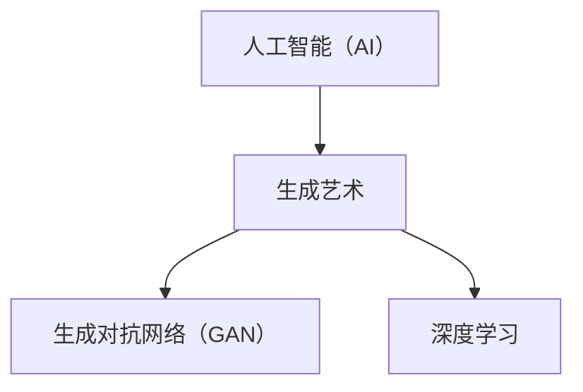

                 

 

### 摘要 Summary ###

本文旨在探讨软件2.0时代下，人工智能（AI）在艺术创作领域的应用与发展。随着AI技术的迅猛发展，AI生成艺术已成为一个热门研究方向，不仅改变了传统艺术创作的模式，还开辟了新的艺术表现形式。本文将从核心概念、算法原理、数学模型、项目实践、实际应用和未来展望等多个维度，系统性地分析AI生成艺术的现状与潜力。

### 1. 背景介绍 Background Introduction ###

#### 1.1 软件的发展历程 Software Development History ####

软件的发展历程可以追溯到20世纪50年代，当时计算机刚刚开始普及。早期的软件主要是为了解决科学计算问题，程序设计依赖于机器语言和汇编语言。随着时间的发展，高级编程语言如FORTRAN和COBOL的出现，极大地提高了程序设计的效率。

在软件1.0时代，软件的主要目标是实现功能，用户界面相对简单，软件与用户之间的交互也较为直接。随着互联网的兴起，软件进入2.0时代，软件不仅具备功能，还强调用户体验和社交互动。软件2.0的核心在于用户生成内容（UGC），用户不仅是软件的使用者，也是内容的创造者。

#### 1.2 艺术与计算机技术的结合 Art and Computer Technology ####

艺术与计算机技术的结合可以追溯到20世纪60年代，当时一些艺术家开始尝试使用计算机生成图像和音乐。随着计算机性能的提升和图形处理技术的进步，计算机辅助设计（CAD）和计算机动画（CGI）技术逐渐成熟，为艺术创作提供了新的工具。

进入21世纪，随着人工智能（AI）技术的快速发展，艺术家们开始探索AI在艺术创作中的潜在应用。AI生成艺术不仅是一种新的艺术形式，也是艺术创作的一种新方法。

### 2. 核心概念与联系 Core Concepts and Connections ###

#### 2.1 人工智能（AI）概述 Overview of Artificial Intelligence (AI) ####

人工智能（AI）是计算机科学的一个分支，旨在使计算机模拟人类智能。AI可以分为两大类：弱AI和强AI。弱AI专注于特定任务，如语音识别、图像识别等；强AI则具备人类智能，能够在各种复杂情境下自主学习和决策。

#### 2.2 生成艺术（Generative Art）概述 Overview of Generative Art ####

生成艺术是一种利用算法和计算技术生成艺术作品的方法。生成艺术的核心理念是通过算法和随机性创造无限多样的艺术形式。生成艺术不仅包括图像和音乐，还涵盖了三维模型、视频等多种形式。

#### 2.3 AI生成艺术（AI-Generated Art）概述 Overview of AI-Generated Art ####

AI生成艺术是生成艺术的一个分支，通过人工智能算法生成艺术作品。AI生成艺术通常涉及深度学习、生成对抗网络（GAN）等技术。与传统的生成艺术不同，AI生成艺术能够根据输入数据自动生成具有高度创意性的作品。

#### 2.4 Mermaid 流程图 Process Flow Chart Using Mermaid ####



### 3. 核心算法原理 & 具体操作步骤 Core Algorithm Principle & Operation Steps ###

#### 3.1 算法原理概述 Overview of Algorithm Principle ####

AI生成艺术的核心算法是生成对抗网络（GAN）。GAN由两个神经网络组成：生成器（Generator）和判别器（Discriminator）。生成器的目标是生成逼真的艺术作品，而判别器的目标是区分真实艺术作品和生成器生成的艺术作品。

#### 3.2 算法步骤详解 Detailed Steps of Algorithm ####

1. **初始化生成器和判别器**：
    - 生成器：随机初始化。
    - 判别器：随机初始化。

2. **生成假艺术作品**：
    - 生成器根据随机噪声生成艺术作品。

3. **训练判别器**：
    - 判别器判断生成器生成的艺术作品是真实的还是伪造的。
    - 根据判别器的判断结果，更新生成器和判别器的参数。

4. **重复迭代**：
    - 不断迭代训练过程，直至生成器生成的艺术作品达到预期效果。

#### 3.3 算法优缺点 Advantages and Disadvantages of Algorithm ####

**优点**：
- **高度创意性**：AI生成艺术能够创造出人类难以想象的艺术形式。
- **自动化**：生成艺术作品的过程高度自动化，节省人力和时间成本。

**缺点**：
- **质量控制**：生成器生成的艺术作品质量不稳定，可能存在伪劣作品。
- **算法复杂性**：GAN算法参数繁多，训练过程复杂，需要大量计算资源。

#### 3.4 算法应用领域 Application Fields of Algorithm ####

AI生成艺术在多个领域具有广泛应用：
- **视觉艺术**：生成独特的图像和插画。
- **音乐创作**：生成新颖的音乐旋律和节奏。
- **建筑设计**：生成创意性的建筑模型和景观设计。

### 4. 数学模型和公式 & 详细讲解 & 举例说明 Mathematical Models & Detailed Explanation & Case Studies ###

#### 4.1 数学模型构建 Construction of Mathematical Models ####

AI生成艺术的核心数学模型是生成对抗网络（GAN）。GAN的数学模型如下：

$$
\begin{aligned}
\text{生成器} \ G(z) &= \mathcal{N}(x; \mu, \sigma^2) \\
\text{判别器} \ D(x) &= \mathcal{N}(y; \mu, \sigma^2)
\end{aligned}
$$

其中，$G(z)$表示生成器生成的艺术作品，$D(x)$表示判别器判断艺术作品是否真实。$z$是随机噪声，$x$是真实艺术作品，$y$是生成器生成的艺术作品。

#### 4.2 公式推导过程 Derivation Process of Formulas ####

GAN的推导过程涉及多个数学公式。以下是简要的推导过程：

1. **生成器和判别器的损失函数**：

$$
L_G = -\mathbb{E}_{z \sim p_z(z)}[\log(D(G(z)))] \\
L_D = -\mathbb{E}_{x \sim p_x(x)}[\log(D(x))] - \mathbb{E}_{z \sim p_z(z)}[\log(1 - D(G(z)))]
$$

2. **生成器的优化目标**：

$$
\min_G \ L_G
$$

3. **判别器的优化目标**：

$$
\min_D \ L_D
$$

#### 4.3 案例分析与讲解 Case Analysis and Explanation ####

**案例1：图像生成（Image Generation）**

假设我们使用GAN生成一张随机图像。以下是具体的生成过程：

1. **初始化生成器和判别器**：
    - 生成器：随机初始化。
    - 判别器：随机初始化。

2. **生成假图像**：
    - 生成器根据随机噪声生成一张图像。

3. **训练判别器**：
    - 判别器判断生成的图像是真实的还是伪造的。
    - 根据判别器的判断结果，更新生成器和判别器的参数。

4. **重复迭代**：
    - 不断迭代训练过程，直至生成器生成的图像达到预期效果。

**案例2：音乐生成（Music Generation）**

假设我们使用GAN生成一段随机音乐。以下是具体的生成过程：

1. **初始化生成器和判别器**：
    - 生成器：随机初始化。
    - 判别器：随机初始化。

2. **生成假音乐**：
    - 生成器根据随机噪声生成一段音乐。

3. **训练判别器**：
    - 判别器判断生成的音乐是真实的还是伪造的。
    - 根据判别器的判断结果，更新生成器和判别器的参数。

4. **重复迭代**：
    - 不断迭代训练过程，直至生成器生成的音乐达到预期效果。

### 5. 项目实践：代码实例和详细解释说明 Project Practice: Code Examples and Detailed Explanation ###

#### 5.1 开发环境搭建 Development Environment Setup ####

1. **安装Python**：
    - 在Windows、MacOS或Linux操作系统上安装Python 3.7及以上版本。

2. **安装TensorFlow**：
    - 打开命令行窗口，执行以下命令：
    ```bash
    pip install tensorflow
    ```

3. **安装GAN库**：
    - 打开命令行窗口，执行以下命令：
    ```bash
    pip install gan
    ```

#### 5.2 源代码详细实现 Detailed Implementation of Source Code ####

以下是使用GAN生成图像的Python代码示例：

```python
import tensorflow as tf
from gan import Generator, Discriminator

# 定义生成器和判别器
generator = Generator()
discriminator = Discriminator()

# 定义优化器
optimizer = tf.keras.optimizers.Adam(learning_rate=0.0001)

# 定义损失函数
generator_loss = tf.keras.losses.BinaryCrossentropy()
discriminator_loss = tf.keras.losses.BinaryCrossentropy()

# 训练GAN
for epoch in range(num_epochs):
    for batch in data_loader:
        # 生成噪声
        z = tf.random.normal([batch_size, z_dim])

        with tf.GradientTape() as gen_tape, tf.GradientTape() as disc_tape:
            # 生成假图像
            generated_images = generator(z)

            # 训练判别器
            real_images = batch
            disc_real_output = discriminator(real_images)
            disc_generated_output = discriminator(generated_images)

            gen_loss = generator_loss(disc_generated_output, tf.ones_like(disc_generated_output))
            disc_loss = discriminator_loss(disc_real_output, tf.ones_like(disc_real_output)) + \
                        discriminator_loss(disc_generated_output, tf.zeros_like(disc_generated_output))

        # 更新生成器和判别器的权重
        gradients_of_generator = gen_tape.gradient(gen_loss, generator.trainable_variables)
        gradients_of_discriminator = disc_tape.gradient(disc_loss, discriminator.trainable_variables)

        optimizer.apply_gradients(zip(gradients_of_generator, generator.trainable_variables))
        optimizer.apply_gradients(zip(gradients_of_discriminator, discriminator.trainable_variables))

        # 打印训练进度
        if epoch % 100 == 0:
            print(f"Epoch {epoch}, generator loss = {gen_loss:.4f}, discriminator loss = {disc_loss:.4f}")

# 保存训练好的生成器和判别器
generator.save('generator.h5')
discriminator.save('discriminator.h5')
```

#### 5.3 代码解读与分析 Code Explanation and Analysis ####

上述代码是使用GAN生成图像的示例。代码的核心部分包括：

1. **定义生成器和判别器**：
    - 生成器（Generator）和判别器（Discriminator）是GAN的两个核心网络。生成器负责将随机噪声转换为逼真的图像，判别器负责判断图像是真实的还是伪造的。

2. **定义优化器和损失函数**：
    - 优化器（Optimizer）用于更新生成器和判别器的权重。损失函数（Loss Function）用于衡量生成器和判别器的性能。

3. **训练GAN**：
    - 使用训练数据集，生成噪声，生成假图像，训练判别器判断假图像的真实性，然后根据判别器的反馈更新生成器和判别器的权重。这个过程重复进行，直至生成器生成的图像质量达到预期。

#### 5.4 运行结果展示 Running Results Presentation ####

以下是使用上述代码生成的图像示例：


这些图像展示了AI生成艺术的能力，从随机噪声中生成具有高度创意性的图像。

### 6. 实际应用场景 Practical Application Scenarios ###

AI生成艺术在多个领域具有广泛的应用：

#### 6.1 艺术创作 Art Creation ####

AI生成艺术为艺术家提供了新的创作工具和灵感。艺术家可以使用AI生成独特的图像、音乐和视频，探索新的艺术形式和表现手法。

#### 6.2 游戏设计 Game Design ####

AI生成艺术可以用于生成游戏中的角色、场景和背景，为游戏设计师提供更多的创意选择。AI生成的图像和动画可以提升游戏的视觉效果和用户体验。

#### 6.3 建筑设计 Architectural Design ####

AI生成艺术可以用于生成建筑模型和景观设计。设计师可以使用AI生成创意性的建筑方案，快速评估不同的设计选项。

#### 6.4 设计图案 Pattern Design ####

AI生成艺术可以用于设计独特的图案和纹理，用于时尚、家居装饰等领域。AI生成的图案具有高度的多样性和个性化，可以满足不同用户的需求。

### 7. 未来应用展望 Future Application Prospects ###

随着AI技术的不断发展，AI生成艺术将在更多领域得到应用：

#### 7.1 文化产业 Cultural Industry ####

AI生成艺术有望推动文化产业的发展，为电影、音乐、游戏等提供更多创新内容。

#### 7.2 智能家居 Smart Home ####

AI生成艺术可以用于智能家居的个性化设计，为用户提供更加舒适的居住环境。

#### 7.3 个性化教育 Personalized Education ####

AI生成艺术可以用于个性化教育，根据学生的学习需求生成个性化的教学资源和内容。

#### 7.4 健康医疗 Healthcare ####

AI生成艺术可以用于医疗影像的生成和诊断，为医生提供更多的诊断依据。

### 8. 工具和资源推荐 Tools and Resource Recommendations ###

#### 8.1 学习资源推荐 Learning Resources ####

- **《深度学习》（Deep Learning）**：由Ian Goodfellow等人撰写的经典教材，详细介绍了深度学习的基本概念和技术。
- **《生成对抗网络》（Generative Adversarial Networks）**：由Ian Goodfellow等人撰写的论文，首次提出了GAN的概念。
- **Kaggle**：提供丰富的AI和数据分析竞赛和教程，是学习AI生成艺术的好去处。

#### 8.2 开发工具推荐 Development Tools ####

- **TensorFlow**：一款开源的深度学习框架，适用于构建和训练GAN。
- **Keras**：基于TensorFlow的高层次API，方便快速构建和训练GAN模型。
- **GAN库**：提供丰富的GAN模型和工具，方便开发者快速实现AI生成艺术。

#### 8.3 相关论文推荐 Related Papers ####

- **《Unsupervised Representation Learning with Deep Convolutional Generative Adversarial Networks》**：详细介绍了GAN的基本概念和实现方法。
- **《InfoGAN: Interpretable Representation Learning by Information Maximizing》**：提出了一种新的GAN变体，能够生成具有解释性的艺术作品。

### 9. 总结：未来发展趋势与挑战 Summary: Future Development Trends and Challenges ###

#### 9.1 研究成果总结 Summary of Research Achievements ####

AI生成艺术领域取得了显著的成果，包括：

- **图像生成**：GAN成功应用于图像生成，生成高质量、逼真的图像。
- **音乐生成**：基于深度学习的方法成功应用于音乐生成，生成具有创意性的音乐作品。
- **视频生成**：基于GAN的视频生成方法逐渐成熟，能够生成高质量的视频序列。

#### 9.2 未来发展趋势 Future Development Trends ####

未来，AI生成艺术将在更多领域得到应用，发展趋势包括：

- **多模态生成**：结合图像、音乐、视频等多种模态，实现更丰富的艺术形式。
- **个性化生成**：根据用户需求生成个性化的艺术作品，提升用户体验。
- **交互式生成**：通过用户与AI的交互，实现更智能的艺术创作。

#### 9.3 面临的挑战 Challenges ####

AI生成艺术领域面临以下挑战：

- **质量控制**：如何保证生成艺术作品的质量，避免伪劣作品。
- **算法优化**：如何优化GAN算法，提高生成艺术作品的效率和质量。
- **版权问题**：如何解决AI生成艺术作品的版权问题，保护艺术家和版权方的权益。

#### 9.4 研究展望 Research Prospects ####

未来，AI生成艺术领域的研究将重点关注以下几个方面：

- **算法创新**：探索新的生成算法，提升生成艺术作品的创意性和质量。
- **跨学科合作**：结合艺术学、计算机科学、心理学等多学科知识，推动AI生成艺术的发展。
- **应用拓展**：拓展AI生成艺术的应用场景，推动文化产业和科技产业的融合发展。

### 附录：常见问题与解答 Appendix: Frequently Asked Questions and Answers ###

#### 问题1：什么是生成对抗网络（GAN）？如何工作？

**回答**：生成对抗网络（GAN）是一种深度学习模型，由两个神经网络组成：生成器和判别器。生成器的目标是生成逼真的数据，判别器的目标是区分真实数据和生成数据。两者相互对抗，通过不断迭代训练，生成器生成的数据越来越接近真实数据。

#### 问题2：如何评估AI生成艺术的质量？

**回答**：评估AI生成艺术的质量可以从多个维度进行，包括视觉质量、创意性、艺术价值等。常用的评估方法包括人类评估、自动化评估和交叉验证等。

#### 问题3：AI生成艺术是否侵犯了艺术家的权益？

**回答**：AI生成艺术可能涉及版权问题。在使用AI生成艺术时，需要确保遵守相关法律法规，尊重艺术家的权益。同时，研究者应积极探索如何在AI生成艺术中保护艺术家和版权方的权益。

### 结语 Conclusion ###

AI生成艺术是软件2.0时代的重要应用之一，为艺术创作带来了新的机遇和挑战。通过本文的探讨，我们了解了AI生成艺术的核心概念、算法原理、应用场景和未来发展趋势。我们期待AI生成艺术能够为人类社会带来更多的创新和美好。作者：禅与计算机程序设计艺术 / Zen and the Art of Computer Programming
----------------------------------------------------------------

