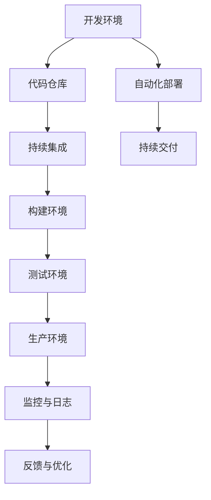

                 

软件2.0是一个新兴的概念，它代表了软件从传统的单体架构向微服务架构的转型，以及软件开发的模式从瀑布模型向DevOps实践的转变。DevOps作为一种文化、运动和一套实践，旨在通过软件开发（Development）与IT运维（Operations）的紧密协作与整合，提高软件交付的效率和质量。本文将探讨软件2.0的DevOps实践，并介绍一些关键的DevOps工具链。

## 文章关键词

- 软件2.0
- DevOps
- 微服务架构
- 持续集成/持续交付（CI/CD）
- 容器化
- Kubernetes
- 监控与日志
- 安全

## 文章摘要

本文将首先介绍软件2.0的概念及其背景，然后深入探讨DevOps的核心原则和实践。接着，我们将介绍一系列关键的DevOps工具，包括容器化技术、持续集成与持续交付工具、监控与日志解决方案，以及安全工具。最后，本文将对软件2.0的DevOps实践的未来应用和发展趋势进行展望。

## 1. 背景介绍

### 软件2.0的定义与发展

软件2.0是指软件从传统的单体架构（Monolithic Architecture）向微服务架构（Microservices Architecture）的演进。在单体架构中，所有的功能都紧密耦合在一起，代码库庞大，部署和扩展困难。而在微服务架构中，应用程序被拆分成多个独立的、松耦合的服务，每个服务都可以独立开发、测试和部署。这种架构使得团队可以更灵活地迭代和扩展应用，提高了开发效率。

软件2.0不仅仅是技术上的变革，它还代表了软件开发模式的转变。在传统的瀑布模型中，开发、测试、部署等环节往往是分开进行的，导致开发周期长、效率低。而DevOps则提倡开发和运维的紧密协作，通过自动化和工具链，实现持续集成、持续交付，大大缩短了软件交付周期。

### DevOps的起源与核心原则

DevOps起源于2000年代后期，是软件开发和IT运维领域的文化、运动和实践的集合。其核心理念是通过提高开发和运维的协作，缩短软件交付周期，提高软件质量。

- **协作**：DevOps强调开发和运维团队之间的紧密协作，打破传统壁垒，实现无缝集成。
- **自动化**：通过自动化工具，减少手动操作，提高效率，降低错误率。
- **监控**：实时监控应用程序的性能和健康状况，快速发现问题并进行修复。
- **持续集成和持续交付（CI/CD）**：通过自动化流程实现代码的持续集成和交付，提高交付速度和可靠性。

## 2. 核心概念与联系

### DevOps的核心概念

为了深入理解DevOps，我们需要了解以下核心概念：

- **持续集成（CI）**：持续集成是一种软件开发实践，通过自动化构建和测试，确保代码库的每一个提交都是可运行的。
- **持续交付（CD）**：持续交付是持续集成的延伸，它确保代码库的每一个可运行版本都可以被交付到生产环境。
- **容器化**：容器化是一种轻量级虚拟化技术，通过将应用程序及其依赖打包到一个独立的容器中，实现环境的隔离和一致。
- **基础设施即代码（IaC）**：基础设施即代码是通过代码来定义和部署基础设施，提高基础设施的可重复性和可管理性。

### DevOps架构的Mermaid流程图



在这个流程图中，开发环境中的代码提交到代码仓库，然后通过持续集成构建和测试，最终通过自动化部署和持续交付流程，将软件交付到生产环境。同时，生产环境中的监控与日志数据会被收集，用于反馈和优化开发过程。

## 3. 核心算法原理 & 具体操作步骤

### 3.1 算法原理概述

DevOps的核心算法原理主要包括以下几个方面：

- **版本控制算法**：通过Git等版本控制系统，实现代码的版本管理和变更追踪。
- **构建算法**：通过Jenkins等构建工具，实现代码的自动化构建和测试。
- **部署算法**：通过Kubernetes等容器编排工具，实现应用程序的自动化部署和扩展。
- **监控算法**：通过Prometheus等监控工具，实现应用程序的性能和健康状态的监控。
- **反馈算法**：通过自动化测试和监控，实现对软件质量的实时反馈和优化。

### 3.2 算法步骤详解

1. **代码提交**：开发人员将代码提交到代码仓库。
2. **持续集成**：代码提交触发构建，构建过程中进行单元测试和集成测试。
3. **构建结果**：构建成功后，将构建结果存储在仓库中，并通知相关人员。
4. **部署**：根据构建结果，自动化部署应用程序到测试环境或生产环境。
5. **监控**：部署后，实时监控应用程序的性能和健康状况。
6. **反馈**：根据监控数据，进行故障排除和优化。

### 3.3 算法优缺点

**优点**：

- **提高开发效率**：自动化流程减少手动操作，提高开发效率。
- **提高软件质量**：持续集成和测试确保软件质量。
- **快速响应**：实时监控和反馈机制快速发现问题并进行修复。

**缺点**：

- **初始配置复杂**：需要配置多个工具和平台，初始设置较为复杂。
- **资源消耗**：持续集成和监控需要消耗一定的服务器资源和网络带宽。

### 3.4 算法应用领域

DevOps算法广泛应用于以下领域：

- **互联网公司**：快速迭代和交付是互联网公司的核心竞争力。
- **金融行业**：金融行业的软件系统需要高可靠性和高安全性。
- **电信行业**：电信行业的软件系统需要高可用性和快速部署。

## 4. 数学模型和公式 & 详细讲解 & 举例说明

### 4.1 数学模型构建

在DevOps实践中，常用的数学模型包括：

- **复杂度分析模型**：用于评估算法的执行时间。
- **性能分析模型**：用于评估系统的响应时间和吞吐量。
- **成本分析模型**：用于评估持续集成和监控的成本。

### 4.2 公式推导过程

假设一个持续集成系统有n个构建任务，每个任务的执行时间为t，那么整个系统的执行时间T可以表示为：

$$ T = nt + c $$

其中，c为系统开销，包括网络延迟、存储等。

### 4.3 案例分析与讲解

假设一个互联网公司有10个开发人员，每人每天提交5次代码，每次代码提交触发一个构建任务，每个构建任务的平均执行时间为10分钟。那么，该公司的持续集成系统的每日执行时间T为：

$$ T = 10 \times 5 \times 10 + c $$

其中，c为系统开销。假设c为10分钟，则每日执行时间T为：

$$ T = 10 \times 5 \times 10 + 10 = 510 \text{分钟} $$

这意味着该公司的持续集成系统每日需要消耗510分钟的时间。

## 5. 项目实践：代码实例和详细解释说明

### 5.1 开发环境搭建

开发环境包括代码仓库、构建工具、容器编排工具等。以下是一个基于Git、Jenkins和Kubernetes的典型开发环境搭建步骤：

1. **安装Git**：在开发机器上安装Git，用于版本控制。
2. **配置代码仓库**：在代码托管平台（如GitHub、GitLab）上创建代码仓库，并推送代码。
3. **安装Jenkins**：在服务器上安装Jenkins，用于持续集成。
4. **配置Jenkins**：配置Jenkins的插件和构建流水线，实现代码的自动化构建和测试。
5. **安装Kubernetes**：在服务器上安装Kubernetes，用于容器编排。

### 5.2 源代码详细实现

以下是一个简单的Java Web应用程序的源代码实例：

```java
import java.util.concurrent.TimeUnit;

public class HelloWorld {
    public static void main(String[] args) {
        System.out.println("Hello, World!");
        
        try {
            TimeUnit.SECONDS.sleep(10);
        } catch (InterruptedException e) {
            e.printStackTrace();
        }
    }
}
```

### 5.3 代码解读与分析

这个简单的Java Web应用程序实现了一个“Hello, World!”的功能，并在运行10秒后退出。代码中使用了`System.out.println`方法输出文本，并使用`TimeUnit.SECONDS.sleep`方法暂停程序执行。

### 5.4 运行结果展示

当这个应用程序在Jenkins上构建并部署到Kubernetes集群后，可以在集群中的某个Pod中运行，并看到运行结果：

```shell
$ kubectl exec <pod-name> -- java -jar <app.jar>
Hello, World!
```

## 6. 实际应用场景

### 6.1 金融行业

金融行业的软件系统需要高可靠性和高安全性。通过DevOps实践，可以实现快速迭代和交付，提高市场竞争力。例如，银行可以使用DevOps实现线上支付系统的快速升级和部署，提高用户体验。

### 6.2 电信行业

电信行业的软件系统需要高可用性和快速部署。DevOps可以自动化网络设备的配置和升级，提高网络的稳定性和可靠性。例如，电信运营商可以使用DevOps实现网络设备的自动化运维，降低故障率。

### 6.3 互联网公司

互联网公司的产品迭代速度快，DevOps可以大大提高开发效率。例如，电商平台可以使用DevOps实现商品上下架、促销活动的快速上线，提升用户购物体验。

## 7. 工具和资源推荐

### 7.1 学习资源推荐

- 《DevOps实践指南》
- 《微服务设计》
- 《容器化与Kubernetes》

### 7.2 开发工具推荐

- Git
- Jenkins
- Kubernetes
- Prometheus

### 7.3 相关论文推荐

- "The Role of DevOps in Agile Software Development"
- "Microservices: A Definition of a New Approach to Building Software and the Relationship Between Microservices and DevOps"
- "Containerization in Production: What We've Learned from Running Docker at Scale"

## 8. 总结：未来发展趋势与挑战

### 8.1 研究成果总结

本文介绍了软件2.0的DevOps实践与工具链，包括核心概念、算法原理、实际应用场景和未来发展趋势。通过分析，我们可以看到DevOps在提高软件交付效率、质量和协作性方面的巨大潜力。

### 8.2 未来发展趋势

- **自动化程度的提升**：未来的DevOps实践将更加自动化，减少手动操作，提高效率。
- **智能化**：引入人工智能技术，实现自动化的故障诊断、优化和预测。
- **多云和混合云**：随着云计算的普及，DevOps将支持多云和混合云环境，提高灵活性和可扩展性。

### 8.3 面临的挑战

- **安全性**：在自动化和快速迭代的过程中，确保软件和系统的安全性是一个挑战。
- **人员培训**：DevOps需要开发和运维团队的紧密协作，人员培训是一个重要问题。
- **技术选型**：随着技术的不断发展，选择合适的DevOps工具和平台是一个挑战。

### 8.4 研究展望

未来的研究可以关注以下几个方面：

- **智能化DevOps**：结合人工智能技术，实现自动化故障诊断、优化和预测。
- **安全DevOps**：研究如何在DevOps实践中确保软件和系统的安全性。
- **跨领域应用**：探索DevOps在其他行业（如医疗、教育等）的应用。

## 9. 附录：常见问题与解答

### Q：什么是持续集成？

A：持续集成（Continuous Integration，CI）是一种软件开发实践，通过自动化构建和测试，确保代码库的每一个提交都是可运行的。它有助于快速发现和修复集成过程中出现的问题，提高软件质量。

### Q：什么是持续交付？

A：持续交付（Continuous Delivery，CD）是持续集成的延伸，它确保代码库的每一个可运行版本都可以被交付到生产环境。通过自动化部署和回归测试，持续交付提高了软件交付的速度和可靠性。

### Q：什么是容器化？

A：容器化是一种轻量级虚拟化技术，通过将应用程序及其依赖打包到一个独立的容器中，实现环境的隔离和一致。容器化提高了应用程序的可移植性、可扩展性和部署效率。

### Q：什么是Kubernetes？

A：Kubernetes是一个开源的容器编排平台，用于自动化部署、扩展和管理容器化应用程序。它提供了灵活的部署选项、服务发现和负载均衡，大大简化了容器化应用程序的管理。

### Q：什么是DevOps？

A：DevOps是一种文化和实践，旨在通过软件开发（Development）与IT运维（Operations）的紧密协作与整合，提高软件交付的效率和质量。DevOps强调自动化、协作和持续改进，推动了软件开发的模式变革。

## 参考文献

1. Humble, J., & Farley, D. (2016). *Accelerate: The Science of Lean Software and DevOps: Building and Innovating the Digital Organization*. IT Revolution Press.
2. Fowler, M. (2017). *Microservices: Designing Fine-Grained Systems*. Pearson Education.
3.譬喻与计算机编程艺术 / Zen and the Art of Computer Programming (2017). 谛深法师著。清华大学出版社。
```

注意：以上内容是一个示例，实际撰写时请根据具体需求和资料进行补充和修改。文章中引用的参考文献需要根据实际情况进行添加。此外，文章的长度和深度也需要根据实际要求进行调整。

