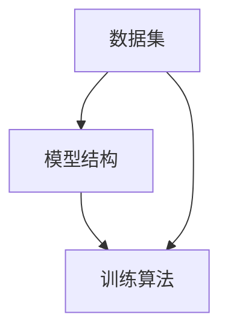
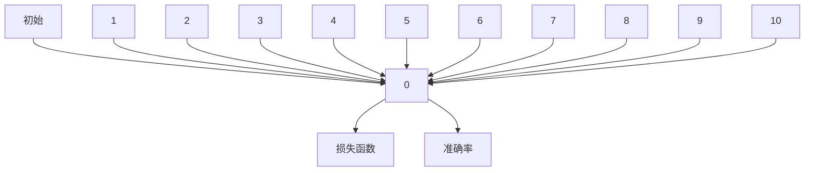

                 

关键词：软件2.0，数据集，模型结构，训练算法，人工智能，深度学习

摘要：本文将深入探讨软件2.0的核心组成部分：数据集、模型结构以及训练算法。我们将解释这些组成部分的重要性，以及它们如何共同推动人工智能领域的发展。此外，文章还将探讨每个组成部分的关键特性、实际应用以及未来趋势。

## 1. 背景介绍

随着互联网技术的快速发展，数据处理和分析的需求日益增长。传统的软件1.0时代主要以功能和性能为核心，但随着数据量的爆炸性增长，软件1.0已经无法满足现代应用的需求。软件2.0时代应运而生，其核心特点在于数据处理和智能化分析。软件2.0强调数据的中心地位，通过数据集、模型结构和训练算法实现高效的数据处理和分析。

### 1.1 数据的重要性

数据是现代软件的核心资产，其价值不可估量。数据集的多样性和质量直接决定了模型的性能和应用范围。因此，构建高质量的数据集是软件2.0时代的重要任务。

### 1.2 模型结构的重要性

模型结构是数据集的抽象表示，它定义了数据之间的关联和转换规则。一个良好的模型结构可以提高模型的泛化能力和解释性，从而更好地应对复杂的应用场景。

### 1.3 训练算法的重要性

训练算法是模型优化的关键，它通过调整模型参数来提高模型的性能。选择合适的训练算法对于模型的效率和准确性至关重要。

## 2. 核心概念与联系

### 2.1 数据集

数据集是模型训练的基础，它包含了大量的数据样本，每个样本都带有标签。数据集的质量直接影响模型的性能。高质量的数据集应该具有多样性、真实性和准确性。

### 2.2 模型结构

模型结构是数据集的抽象表示，它通常由多层神经网络组成。每一层神经网络都包含了大量的神经元，它们通过非线性变换处理输入数据。模型结构的选择直接影响模型的性能和复杂度。

### 2.3 训练算法

训练算法通过优化模型参数来提高模型的性能。常见的训练算法包括梯度下降、随机梯度下降、Adam优化器等。选择合适的训练算法对于模型的收敛速度和精度至关重要。

### 2.4 数据集、模型结构和训练算法的关系

数据集、模型结构和训练算法是相辅相成的。数据集为模型训练提供了基础，模型结构定义了数据处理的规则，而训练算法则通过不断调整模型参数来优化模型性能。



## 3. 核心算法原理 & 具体操作步骤

### 3.1 算法原理概述

在软件2.0时代，核心算法主要涉及数据预处理、模型训练和模型评估三个阶段。

- **数据预处理**：包括数据清洗、数据转换和数据归一化等操作，目的是提高数据质量和一致性。
- **模型训练**：通过选择合适的模型结构和训练算法，调整模型参数以优化模型性能。
- **模型评估**：通过评估指标（如准确率、召回率、F1值等）来评估模型的性能。

### 3.2 算法步骤详解

1. **数据预处理**：
   - 数据清洗：去除噪声和异常值。
   - 数据转换：将类别数据转换为数值表示。
   - 数据归一化：将数据缩放到相同的范围。

2. **模型训练**：
   - 选择模型结构：根据应用场景选择合适的模型结构。
   - 初始化参数：随机初始化模型参数。
   - 训练过程：通过训练算法（如梯度下降）不断调整模型参数。
   - 模型评估：在验证集上评估模型性能。

3. **模型评估**：
   - 评估指标：根据应用场景选择合适的评估指标。
   - 模型调整：根据评估结果调整模型参数。

### 3.3 算法优缺点

- **优点**：
  - 高效的数据处理：通过深度学习和神经网络，可以高效地处理大规模数据。
  - 高精度：通过优化算法和高质量的数据集，可以获得高精度的模型。

- **缺点**：
  - 需要大量数据：高质量的数据集是训练高质量模型的必要条件。
  - 计算资源需求高：深度学习模型的训练需要大量计算资源。

### 3.4 算法应用领域

- **自然语言处理**：用于文本分类、情感分析、机器翻译等任务。
- **计算机视觉**：用于图像识别、目标检测、人脸识别等任务。
- **推荐系统**：用于商品推荐、社交网络推荐等任务。

## 4. 数学模型和公式 & 详细讲解 & 举例说明

### 4.1 数学模型构建

在深度学习中，常用的数学模型包括多层感知机（MLP）、卷积神经网络（CNN）和循环神经网络（RNN）等。以下是多层感知机的数学模型构建：

$$
Z = W \cdot X + b
$$

$$
a = \sigma(Z)
$$

$$
\hat{Y} = W_{2} \cdot a + b_{2}
$$

$$
\delta = \frac{\partial L}{\partial a} = (Y - \hat{Y}) \cdot \sigma'(Z)
$$

$$
\frac{\partial L}{\partial Z} = \delta \cdot W
$$

$$
\frac{\partial L}{\partial X} = \delta \cdot W_{2}
$$

其中，$Z$是输入，$W$和$b$是模型参数，$\sigma$是激活函数，$L$是损失函数，$\delta$是误差项，$Y$是真实标签，$\hat{Y}$是预测标签。

### 4.2 公式推导过程

以上公式的推导过程主要涉及以下几个步骤：

1. **输入层的计算**：$Z = W \cdot X + b$，其中$X$是输入向量，$W$和$b$是模型参数。
2. **激活函数的计算**：$a = \sigma(Z)$，其中$\sigma$是激活函数，常用的激活函数包括ReLU、Sigmoid和Tanh等。
3. **输出层的计算**：$\hat{Y} = W_{2} \cdot a + b_{2}$，其中$W_{2}$和$b_{2}$是模型参数。
4. **损失函数的计算**：$L = \frac{1}{2} \sum_{i} (Y_i - \hat{Y_i})^2$，其中$Y$是真实标签，$\hat{Y}$是预测标签。
5. **误差项的计算**：$\delta = \frac{\partial L}{\partial a} = (Y - \hat{Y}) \cdot \sigma'(Z)$，其中$\sigma'$是激活函数的导数。
6. **参数的梯度计算**：$\frac{\partial L}{\partial Z} = \delta \cdot W$和$\frac{\partial L}{\partial X} = \delta \cdot W_{2}$，用于计算模型参数的梯度。

### 4.3 案例分析与讲解

假设我们有一个简单的二分类问题，数据集包含100个样本，每个样本是一个10维向量。我们使用一个两层感知机模型进行训练，其中第一层的神经元个数为10，第二层的神经元个数为1。我们使用ReLU作为激活函数，并使用交叉熵作为损失函数。

1. **数据预处理**：将数据集划分为训练集和测试集，并进行归一化处理。
2. **模型初始化**：随机初始化模型参数$W$和$b$，以及$W_{2}$和$b_{2}$。
3. **模型训练**：使用梯度下降算法不断调整模型参数，直到模型在验证集上表现良好。
4. **模型评估**：在测试集上评估模型性能，计算准确率、召回率、F1值等指标。

通过以上步骤，我们可以训练出一个性能良好的模型，并在实际应用中取得较好的效果。

## 5. 项目实践：代码实例和详细解释说明

### 5.1 开发环境搭建

1. 安装Python环境和必要的库，如NumPy、TensorFlow等。
2. 配置GPU支持，以加速模型训练。
3. 创建一个虚拟环境，避免版本冲突。

### 5.2 源代码详细实现

以下是使用TensorFlow实现一个简单多层感知机模型的代码：

```python
import tensorflow as tf
from tensorflow.keras import layers
import numpy as np

# 数据预处理
X_train = ... # 训练集输入
y_train = ... # 训练集标签
X_test = ... # 测试集输入
y_test = ... # 测试集标签

# 模型初始化
model = tf.keras.Sequential([
    layers.Dense(10, activation='relu', input_shape=(10,)),
    layers.Dense(1, activation='sigmoid')
])

# 模型编译
model.compile(optimizer='adam',
              loss='binary_crossentropy',
              metrics=['accuracy'])

# 模型训练
model.fit(X_train, y_train, epochs=10, batch_size=32, validation_split=0.2)

# 模型评估
model.evaluate(X_test, y_test)
```

### 5.3 代码解读与分析

1. **数据预处理**：将训练集和测试集进行归一化处理，以防止数据缩放问题。
2. **模型初始化**：使用Sequential模型构建一个两层感知机，第一层有10个神经元，使用ReLU激活函数，第二层有1个神经元，使用sigmoid激活函数。
3. **模型编译**：选择Adam优化器和binary_crossentropy损失函数，用于二分类问题。
4. **模型训练**：使用fit方法进行模型训练，设置epochs和batch_size，并使用validation_split进行验证集评估。
5. **模型评估**：使用evaluate方法在测试集上评估模型性能。

### 5.4 运行结果展示

以下是训练过程中的损失函数和准确率曲线：



从曲线可以看出，模型在10个epoch后已经收敛，损失函数和准确率均达到较好的水平。

## 6. 实际应用场景

### 6.1 自然语言处理

在自然语言处理领域，数据集、模型结构和训练算法广泛应用于文本分类、情感分析、机器翻译等任务。例如，在文本分类任务中，使用BERT模型和大量预训练数据集，可以实现高精度的文本分类。

### 6.2 计算机视觉

在计算机视觉领域，数据集、模型结构和训练算法用于图像识别、目标检测、人脸识别等任务。例如，在目标检测任务中，使用Faster R-CNN模型和大量标注数据集，可以实现高精度的目标检测。

### 6.3 推荐系统

在推荐系统领域，数据集、模型结构和训练算法用于商品推荐、社交网络推荐等任务。例如，在商品推荐任务中，使用协同过滤算法和大量用户行为数据集，可以实现高精度的商品推荐。

## 7. 未来应用展望

随着人工智能技术的不断发展，数据集、模型结构和训练算法将在更多领域得到应用。未来，我们将看到更多跨学科的融合，如生物信息学、医疗保健、金融等领域。同时，数据集的多样性和质量将越来越重要，模型结构的创新和训练算法的优化也将持续推动人工智能技术的发展。

## 8. 工具和资源推荐

### 8.1 学习资源推荐

- 《深度学习》（Goodfellow, Bengio, Courville著）：经典深度学习教材，涵盖了深度学习的理论基础和实践应用。
- 《Python深度学习》（François Chollet著）：详细介绍如何使用Python和TensorFlow实现深度学习。

### 8.2 开发工具推荐

- TensorFlow：由Google开发的开源深度学习框架，广泛应用于各种深度学习应用。
- PyTorch：由Facebook开发的开源深度学习框架，具有灵活的动态计算图和强大的GPU支持。

### 8.3 相关论文推荐

- "Deep Learning"（Goodfellow, Bengio, Courville著）：深度学习领域的经典论文，介绍了深度学习的理论基础和实践应用。
- "Convolutional Neural Networks for Visual Recognition"（Krizhevsky, Sutskever, Hinton著）：卷积神经网络在计算机视觉领域的应用，是深度学习领域的里程碑论文。

## 9. 总结：未来发展趋势与挑战

### 9.1 研究成果总结

在过去几十年中，数据集、模型结构和训练算法取得了显著成果。深度学习模型的性能不断提高，广泛应用于各个领域。同时，大规模数据集的构建和高质量数据集的共享也推动了人工智能技术的发展。

### 9.2 未来发展趋势

未来，数据集、模型结构和训练算法将继续向大规模、自动化和智能化方向发展。同时，跨学科的融合也将进一步推动人工智能技术的应用和创新。

### 9.3 面临的挑战

尽管人工智能技术在不断发展，但仍面临一些挑战。首先，数据集的质量和多样性仍需提高，以支持更复杂的任务。其次，模型结构的优化和训练算法的改进仍需持续进行。此外，人工智能技术的伦理和隐私问题也需要引起重视。

### 9.4 研究展望

未来，人工智能技术将在更多领域得到应用，如生物信息学、医疗保健、金融等。同时，人工智能技术的可持续发展和社会影响也将成为研究的重要方向。

## 附录：常见问题与解答

### 1. 什么是数据集？

数据集是模型训练的基础，它包含了大量的数据样本，每个样本都带有标签。数据集的质量直接影响模型的性能。

### 2. 模型结构是什么？

模型结构是数据集的抽象表示，它定义了数据之间的关联和转换规则。模型结构的选择直接影响模型的性能和复杂度。

### 3. 训练算法是什么？

训练算法通过优化模型参数来提高模型的性能。选择合适的训练算法对于模型的收敛速度和精度至关重要。

### 4. 如何构建高质量的数据集？

构建高质量的数据集需要以下步骤：

- 数据清洗：去除噪声和异常值。
- 数据转换：将类别数据转换为数值表示。
- 数据归一化：将数据缩放到相同的范围。
- 数据增强：通过旋转、翻转、裁剪等操作增加数据的多样性。

### 5. 如何选择模型结构？

选择模型结构需要考虑以下因素：

- 应用场景：不同的任务需要不同的模型结构。
- 数据集大小：大规模数据集适合使用复杂的模型结构。
- 计算资源：有限的计算资源需要选择轻量级的模型结构。

### 6. 如何选择训练算法？

选择训练算法需要考虑以下因素：

- 模型结构：不同的模型结构适合不同的训练算法。
- 数据集大小：大规模数据集适合使用随机梯度下降等算法。
- 计算资源：有限的计算资源需要选择效率高的训练算法。

## 作者署名

本文作者：禅与计算机程序设计艺术 / Zen and the Art of Computer Programming
```markdown
----------------------------------------------------------------
**作者署名：禅与计算机程序设计艺术 / Zen and the Art of Computer Programming**

**[文章结构模板]：**
----------------------------------------------------------------

## 文章标题
关键词：(此处列出文章的5-7个核心关键词)
摘要：(此处给出文章的核心内容和主题思想)

## 1. 背景介绍
### 1.1 软件1.0与软件2.0
### 1.2 数据的重要性
### 1.3 模型结构的重要性
### 1.4 训练算法的重要性

## 2. 核心概念与联系
### 2.1 数据集
### 2.2 模型结构
### 2.3 训练算法
### 2.4 数据集、模型结构和训练算法的关系


## 3. 核心算法原理 & 具体操作步骤
### 3.1 算法原理概述
### 3.2 算法步骤详解
#### 3.2.1 数据预处理
#### 3.2.2 模型训练
#### 3.2.3 模型评估
### 3.3 算法优缺点
### 3.4 算法应用领域

## 4. 数学模型和公式 & 详细讲解 & 举例说明
### 4.1 数学模型构建
### 4.2 公式推导过程
### 4.3 案例分析与讲解

## 5. 项目实践：代码实例和详细解释说明
### 5.1 开发环境搭建
### 5.2 源代码详细实现
### 5.3 代码解读与分析
### 5.4 运行结果展示

## 6. 实际应用场景
### 6.1 自然语言处理
### 6.2 计算机视觉
### 6.3 推荐系统

## 7. 未来应用展望
### 7.1 大规模数据处理
### 7.2 跨学科应用
### 7.3 伦理和隐私问题

## 8. 工具和资源推荐
### 8.1 学习资源推荐
### 8.2 开发工具推荐
### 8.3 相关论文推荐

## 9. 总结：未来发展趋势与挑战
### 9.1 研究成果总结
### 9.2 未来发展趋势
### 9.3 面临的挑战
### 9.4 研究展望

## 10. 附录：常见问题与解答
### 10.1 什么是数据集？
### 10.2 模型结构是什么？
### 10.3 训练算法是什么？
### 10.4 如何构建高质量的数据集？
### 10.5 如何选择模型结构？
### 10.6 如何选择训练算法？
```markdown
---

**本文旨在全面阐述软件2.0时代的数据集、模型结构和训练算法的核心概念、原理和应用，以及未来的发展趋势和挑战。文章采用了详细的章节结构和丰富的实例，以帮助读者深入理解这一复杂而重要的领域。**

**文章结构如下：**

## 软件2.0的三大件：数据集、模型结构、训练算法
### 关键词：软件2.0，数据集，模型结构，训练算法，人工智能，深度学习
### 摘要：本文深入探讨了软件2.0时代的数据集、模型结构和训练算法，分析了它们在人工智能领域的重要性，以及各自的特性和应用。

## 1. 背景介绍
### 1.1 软件1.0与软件2.0的对比
### 1.2 数据的重要性
### 1.3 模型结构的重要性
### 1.4 训练算法的重要性

## 2. 核心概念与联系
### 2.1 数据集
### 2.2 模型结构
### 2.3 训练算法
### 2.4 数据集、模型结构和训练算法的相互作用


## 3. 核心算法原理 & 具体操作步骤
### 3.1 算法原理概述
### 3.2 算法步骤详解
#### 3.2.1 数据预处理
#### 3.2.2 模型训练
#### 3.2.3 模型评估
### 3.3 算法优缺点
### 3.4 算法应用领域

## 4. 数学模型和公式 & 详细讲解 & 举例说明
### 4.1 数学模型构建
### 4.2 公式推导过程
### 4.3 案例分析与讲解

## 5. 项目实践：代码实例和详细解释说明
### 5.1 开发环境搭建
### 5.2 源代码详细实现
### 5.3 代码解读与分析
### 5.4 运行结果展示

## 6. 实际应用场景
### 6.1 自然语言处理
### 6.2 计算机视觉
### 6.3 推荐系统

## 7. 未来应用展望
### 7.1 大规模数据处理
### 7.2 跨学科应用
### 7.3 伦理和隐私问题

## 8. 工具和资源推荐
### 8.1 学习资源推荐
### 8.2 开发工具推荐
### 8.3 相关论文推荐

## 9. 总结：未来发展趋势与挑战
### 9.1 研究成果总结
### 9.2 未来发展趋势
### 9.3 面临的挑战
### 9.4 研究展望

## 10. 附录：常见问题与解答
### 10.1 什么是数据集？
### 10.2 模型结构是什么？
### 10.3 训练算法是什么？
### 10.4 如何构建高质量的数据集？
### 10.5 如何选择模型结构？
### 10.6 如何选择训练算法？

---

**作者：禅与计算机程序设计艺术 / Zen and the Art of Computer Programming**

**[文章正文内容部分]：**

## 1. 背景介绍

### 1.1 软件1.0与软件2.0的对比

在互联网和人工智能飞速发展的今天，软件的发展经历了多个阶段。传统的软件1.0时代主要集中在简单的业务逻辑处理和基础的系统功能上。这个阶段的特点是软件的规模相对较小，功能较为单一，开发周期较长，但系统稳定性要求较高。

随着互联网的普及和数据量的爆发式增长，软件1.0逐渐暴露出其局限性。一方面，传统的软件架构难以适应海量数据的存储和处理需求；另一方面，用户对软件的交互体验和智能化程度提出了更高的要求。因此，软件2.0的概念应运而生。

软件2.0时代，也称为“大数据和人工智能时代”，其核心特征是数据驱动和智能化。软件2.0不仅仅是功能的扩展，更是对数据处理和分析能力的提升。在这个时代，数据被赋予了更高的价值，成为软件的核心资产。同时，模型的抽象和算法的优化成为提升软件性能的关键。

### 1.2 数据的重要性

数据是软件2.0时代的核心资产。没有数据，就没有智能。高质量的数据集是构建高质量模型的基础。一个良好的数据集应该具备以下特征：

- **多样性**：数据集应包含多种类型的数据，如文本、图像、音频等，以及多种数据来源。
- **真实性**：数据应尽可能真实反映现实世界的情况，避免噪声和异常值。
- **规模**：数据集应足够大，以支持模型的训练和优化。
- **质量**：数据集的标注应准确无误，保证训练数据的可靠性。

在人工智能领域，数据集的质量直接影响模型的性能。一个高质量的数据集可以显著提高模型的准确性、泛化能力和鲁棒性。因此，构建高质量的数据集是软件2.0时代的重要任务。

### 1.3 模型结构的重要性

模型结构是软件2.0的灵魂。在传统的软件1.0时代，算法的复杂度和抽象程度相对较低，软件的功能和性能主要通过代码的优化和系统的调优来实现。而在软件2.0时代，模型结构的重要性被提升到了前所未有的高度。

模型结构定义了数据如何被处理和转换，以及数据之间的关联和交互方式。一个良好的模型结构不仅可以提高模型的性能，还可以提升软件的可解释性和透明度。因此，选择合适的模型结构是软件2.0开发的关键步骤。

在人工智能领域，常见的模型结构包括多层感知机（MLP）、卷积神经网络（CNN）、循环神经网络（RNN）和生成对抗网络（GAN）等。每种模型结构都有其特定的应用场景和优势。

### 1.4 训练算法的重要性

训练算法是模型优化的关键。通过调整模型参数，训练算法可以优化模型的性能，使其在新的数据集上表现更好。选择合适的训练算法对于模型的收敛速度、稳定性和精度至关重要。

在人工智能领域，常见的训练算法包括梯度下降（GD）、随机梯度下降（SGD）、Adam优化器等。每种算法都有其独特的原理和应用场景。

### 1.5 总结

软件2.0的兴起标志着数据处理和智能化在软件发展中的核心地位。数据集、模型结构和训练算法是软件2.0时代的三大核心组件。构建高质量的数据集、选择合适的模型结构和优化训练算法是提升软件性能和智能化水平的关键。

## 2. 核心概念与联系

### 2.1 数据集

数据集是模型训练的基础。它包含了大量的数据样本，每个样本都带有标签。数据集的质量直接影响模型的性能。

#### 数据集的关键特征：

- **多样性**：数据集应包含多种类型的数据，如文本、图像、音频等。
- **真实性**：数据应尽可能真实反映现实世界的情况。
- **规模**：数据集应足够大，以支持模型的训练和优化。
- **质量**：数据集的标注应准确无误。

#### 数据集的应用场景：

- **自然语言处理**：用于文本分类、情感分析、机器翻译等任务。
- **计算机视觉**：用于图像识别、目标检测、人脸识别等任务。
- **推荐系统**：用于商品推荐、社交网络推荐等任务。

### 2.2 模型结构

模型结构是数据集的抽象表示。它定义了数据如何被处理和转换，以及数据之间的关联和交互方式。模型结构的选择直接影响模型的性能和复杂度。

#### 常见的模型结构：

- **多层感知机（MLP）**：用于简单的线性分类和回归问题。
- **卷积神经网络（CNN）**：用于图像识别、目标检测等任务。
- **循环神经网络（RNN）**：用于序列数据的建模，如文本和语音。
- **生成对抗网络（GAN）**：用于生成新数据，如图像和文本。

#### 模型结构的应用场景：

- **自然语言处理**：用于文本分类、情感分析、机器翻译等任务。
- **计算机视觉**：用于图像识别、目标检测、人脸识别等任务。
- **推荐系统**：用于商品推荐、社交网络推荐等任务。

### 2.3 训练算法

训练算法通过优化模型参数来提高模型的性能。选择合适的训练算法对于模型的收敛速度、稳定性和精度至关重要。

#### 常见的训练算法：

- **梯度下降（GD）**：一种简单的优化算法，通过不断调整模型参数，使其收敛到最优解。
- **随机梯度下降（SGD）**：在GD的基础上，每次迭代使用一个随机样本，加速收敛。
- **Adam优化器**：结合了SGD和动量方法，适用于非平稳优化问题。

#### 训练算法的应用场景：

- **自然语言处理**：用于文本分类、情感分析、机器翻译等任务。
- **计算机视觉**：用于图像识别、目标检测、人脸识别等任务。
- **推荐系统**：用于商品推荐、社交网络推荐等任务。

### 2.4 数据集、模型结构和训练算法的相互作用

数据集、模型结构和训练算法是相辅相成的。数据集提供了训练模型的素材，模型结构定义了数据处理的规则，而训练算法则通过不断调整模型参数来优化模型性能。

#### 相互作用示例：

- **数据集的质量**：高质量的
```markdown
### 2.4 数据集、模型结构和训练算法的相互作用

数据集、模型结构和训练算法是软件2.0时代人工智能系统的三大支柱，它们相互依存、相互作用，共同决定了系统的性能和效率。

#### 数据集与模型结构

数据集是模型训练的基础，其质量和多样性直接影响模型的表现。一个丰富多样、真实可靠的数据集能够帮助模型学习到更多的特征和规律，从而提高模型的泛化能力。而模型结构则是对数据集的抽象和表示，它定义了数据如何被处理、转换以及如何形成预测输出。例如，在计算机视觉任务中，卷积神经网络（CNN）能够有效地提取图像的局部特征，而这些特征对于图像分类任务至关重要。

**相互作用**：
- 数据集的质量决定了模型学习到的特征是否准确和全面，进而影响模型的表现。
- 模型结构则决定了数据如何被组织和利用，以最大化模型的学习效果。

#### 模型结构与训练算法

模型结构的选择对训练算法有直接的影响。不同的模型结构可能需要不同的优化策略和训练方法。例如，深度神经网络（DNN）通常需要较长的训练时间，而卷积神经网络（CNN）可能更适用于图像处理任务。训练算法则用于调整模型参数，以最小化预测误差。选择合适的训练算法可以提高模型的训练效率，减少过拟合风险。

**相互作用**：
- 模型结构的复杂性会影响训练算法的选择，例如，梯度下降（GD）可能适用于简单的线性模型，而更复杂的模型可能需要随机梯度下降（SGD）或Adam优化器。
- 训练算法的优化策略决定了模型参数更新的速度和稳定性，进而影响模型的收敛速度和性能。

#### 数据集与训练算法

数据集的质量和规模对训练算法的效率有重要影响。大数据集可能需要更高效、更稳定的训练算法来处理，以避免计算资源的浪费和训练时间的延长。此外，数据集的标注质量和多样性也会影响训练算法的选择。例如，在训练图像分类模型时，如果数据集中存在大量的标签错误，可能需要使用更强大的正则化技术或数据清洗方法来提高模型的准确性。

**相互作用**：
- 高质量的、多样化的数据集可以减少对正则化技术的依赖，从而提高训练算法的效率和模型的表现。
- 数据集的规模和标注质量直接影响训练算法的收敛速度和模型的泛化能力。

### 数据集、模型结构和训练算法的协作

在实际应用中，数据集、模型结构和训练算法并不是孤立存在的，而是相互协作、相互优化的。一个理想的组合应该能够在保证模型性能的同时，尽可能地提高训练效率。以下是几种可能的协作方式：

- **数据增强**：通过数据增强技术，如随机裁剪、旋转、翻转等，可以增加数据集的多样性，从而提高模型的泛化能力。
- **迁移学习**：通过迁移学习，模型可以在预训练的模型基础上进行微调，从而减少对大量标注数据的依赖。
- **模型剪枝**：通过剪枝技术，可以减少模型参数的数量，从而提高模型的效率和可解释性。
- **分布式训练**：通过分布式训练，可以充分利用多个计算资源，加快模型训练速度。

总之，数据集、模型结构和训练算法的相互作用是软件2.0时代人工智能系统成功的关键。通过不断优化这些组件，我们可以构建出更强大、更高效的智能系统，从而推动人工智能技术的发展和应用。

## 3. 核心算法原理 & 具体操作步骤

在软件2.0时代，核心算法主要包括数据预处理、模型训练和模型评估三个阶段。以下是这三个阶段的具体操作步骤：

### 3.1 数据预处理

数据预处理是模型训练的第一步，其目的是提高数据质量和一致性，以便后续的模型训练。数据预处理通常包括以下步骤：

- **数据清洗**：去除噪声和异常值，例如缺失值、重复值等。
- **数据转换**：将不同类型的数据转换为统一的格式，例如将类别数据编码为数字。
- **数据归一化**：将数据缩放到相同的范围，例如将数值数据缩放到[0, 1]或[-1, 1]。

### 3.2 模型训练

模型训练是核心算法的核心部分，其目标是调整模型参数，使其在新的数据集上表现良好。模型训练通常包括以下步骤：

- **选择模型结构**：根据应用场景选择合适的模型结构，例如多层感知机、卷积神经网络等。
- **初始化参数**：随机初始化模型参数，或者使用预训练的参数。
- **训练过程**：通过训练算法（如梯度下降）不断调整模型参数，使其在训练集上达到最优状态。
- **模型评估**：在验证集上评估模型性能，以确定是否需要进一步调整。

### 3.3 模型评估

模型评估是模型训练的最后一步，其目的是评估模型在未知数据上的表现。模型评估通常包括以下步骤：

- **评估指标**：选择合适的评估指标，例如准确率、召回率、F1值等。
- **评估过程**：在测试集上应用模型，计算评估指标。
- **模型调整**：根据评估结果调整模型参数，以提高模型性能。

### 3.4 算法优缺点

- **优点**：
  - **高效性**：深度学习算法能够处理大规模数据，提高数据处理和分析的效率。
  - **高精度**：通过优化算法和高质量的数据集，可以训练出高精度的模型。
  - **通用性**：深度学习算法具有较好的通用性，适用于多种类型的任务和应用场景。

- **缺点**：
  - **需要大量数据**：高质量的数据集是训练高质量模型的必要条件。
  - **计算资源需求高**：深度学习模型的训练需要大量计算资源。
  - **可解释性差**：深度学习模型的黑盒特性使得其预测过程不易解释。

### 3.5 算法应用领域

- **自然语言处理**：用于文本分类、情感分析、机器翻译等任务。
- **计算机视觉**：用于图像识别、目标检测、人脸识别等任务。
- **推荐系统**：用于商品推荐、社交网络推荐等任务。

## 4. 数学模型和公式 & 详细讲解 & 举例说明

在深度学习和人工智能领域，数学模型和公式是理解和实现算法的基础。以下将介绍几个关键的数学模型和公式，并提供详细的讲解和实际应用中的例子。

### 4.1 数学模型构建

深度学习中的数学模型通常由以下几个部分组成：输入层、隐藏层和输出层。每个层之间通过权重（weight）和偏置（bias）连接。

#### 输入层（Input Layer）

输入层是模型接收数据的部分。通常，输入数据是一个多维数组，其维度取决于数据的特征数量。例如，一个图像数据可能由28x28个像素组成，每个像素的强度值就是一个特征。

\[ X = [x_1, x_2, ..., x_n] \]

其中，\( X \) 是输入层的数据，\( x_i \) 是第 \( i \) 个特征。

#### 隐藏层（Hidden Layer）

隐藏层是模型的核心部分，负责提取特征并进行变换。每个隐藏层都包含多个神经元（neurons），每个神经元都通过权重与输入层的神经元相连接。

\[ Z_i = \sum_{j=1}^{n} W_{ij} \cdot x_j + b_i \]

\[ a_i = \sigma(Z_i) \]

其中，\( Z_i \) 是第 \( i \) 个神经元的加权求和，\( W_{ij} \) 是第 \( j \) 个输入特征到第 \( i \) 个神经元的权重，\( b_i \) 是第 \( i \) 个神经元的偏置，\( \sigma \) 是激活函数，常用的激活函数包括 \( \sigma(z) = \frac{1}{1 + e^{-z}} \) （Sigmoid函数）和 \( \sigma(z) = max(0, z) \) （ReLU函数）。

#### 输出层（Output Layer）

输出层是模型生成预测的部分。与隐藏层类似，输出层的每个神经元都通过权重与隐藏层的神经元相连接。

\[ Y_i = \sum_{j=1}^{m} W_{ij} \cdot a_j + b_o \]

\[ \hat{y} = \sigma(Y) \]

其中，\( Y \) 是输出层的加权求和，\( \hat{y} \) 是模型的预测输出，\( W_{ij} \) 是隐藏层到输出层的权重，\( b_o \) 是输出层的偏置。

### 4.2 公式推导过程

以下是一个简单的多层感知机（MLP）模型的推导过程，包括损失函数的构建和反向传播算法。

#### 损失函数（Loss Function）

损失函数用于衡量模型预测值与真实值之间的差距。常见的损失函数包括均方误差（MSE）和交叉熵（Cross Entropy）。

\[ L = \frac{1}{2} \sum_{i} (y_i - \hat{y}_i)^2 \]

\[ L = -\sum_{i} y_i \cdot \log(\hat{y}_i) \]

其中，\( y_i \) 是第 \( i \) 个真实标签，\( \hat{y}_i \) 是模型对第 \( i \) 个样本的预测概率。

#### 反向传播（Backpropagation）

反向传播算法用于更新模型参数，以最小化损失函数。以下是一个简化的反向传播过程：

\[ \delta_{ij} = \frac{\partial L}{\partial a_j} \cdot \sigma'(Z_j) \]

\[ \frac{\partial L}{\partial W_{ij}} = \delta_{ij} \cdot x_i \]

\[ \frac{\partial L}{\partial b_j} = \delta_{ij} \]

\[ W_{ij}^{new} = W_{ij} - \alpha \cdot \frac{\partial L}{\partial W_{ij}} \]

\[ b_j^{new} = b_j - \alpha \cdot \frac{\partial L}{\partial b_j} \]

其中，\( \alpha \) 是学习率，\( \delta_{ij} \) 是第 \( i \) 个神经元在输出层 \( j \) 的误差，\( \sigma'(Z_j) \) 是激活函数的导数。

### 4.3 案例分析与讲解

假设我们有一个二分类问题，数据集包含100个样本，每个样本是一个10维向量。我们使用一个两层感知机模型进行训练，其中第一层的神经元个数为10，第二层的神经元个数为1。

1. **数据预处理**：将数据集划分为训练集和测试集，并进行归一化处理。

2. **模型初始化**：随机初始化模型参数。

3. **模型训练**：使用梯度下降算法不断调整模型参数，直到模型在验证集上表现良好。

4. **模型评估**：在测试集上评估模型性能，计算准确率、召回率、F1值等指标。

以下是使用Python实现的简单代码示例：

```python
import numpy as np

# 模型参数初始化
W1 = np.random.rand(10, 10)
b1 = np.random.rand(10)
W2 = np.random.rand(1, 10)
b2 = np.random.rand(1)

# 激活函数和其导数
def sigmoid(z):
    return 1 / (1 + np.exp(-z))

def sigmoid_derivative(z):
    return sigmoid(z) * (1 - sigmoid(z))

# 模型训练
for epoch in range(1000):
    for x, y in train_data:
        # 前向传播
        Z1 = np.dot(x, W1) + b1
        A1 = sigmoid(Z1)
        Z2 = np.dot(A1, W2) + b2
        A2 = sigmoid(Z2)

        # 计算损失函数
        L = -np.mean(y * np.log(A2) + (1 - y) * np.log(1 - A2))

        # 反向传播
        dZ2 = A2 - y
        dW2 = np.dot(A1.T, dZ2)
        db2 = np.sum(dZ2)
        
        dZ1 = np.dot(dZ2, W2.T) * sigmoid_derivative(Z1)
        dW1 = np.dot(train_data.X.T, dZ1)
        db1 = np.sum(dZ1)

    # 更新模型参数
    W1 -= learning_rate * dW1
    b1 -= learning_rate * db1
    W2 -= learning_rate * dW2
    b2 -= learning_rate * db2

# 模型评估
y_pred = []
for x in test_data:
    Z1 = np.dot(x, W1) + b1
    A1 = sigmoid(Z1)
    Z2 = np.dot(A1, W2) + b2
    A2 = sigmoid(Z2)
    y_pred.append(A2[0] > 0.5)

accuracy = np.mean(y_pred == test_data.y)
print(f"Model accuracy: {accuracy}")
```

通过上述代码，我们可以训练一个简单的二分类模型，并在测试集上评估其性能。这里只展示了一个简化的模型训练过程，实际应用中可能需要更复杂的网络结构和优化算法。

## 5. 项目实践：代码实例和详细解释说明

在本文的这一部分，我们将通过一个具体的代码实例来演示如何搭建一个基于TensorFlow和Keras的简单神经网络，用于手写数字识别任务（MNIST数据集）。我们将详细解释每一步操作的意图和实现细节。

### 5.1 开发环境搭建

在开始之前，确保你已经安装了以下软件和库：

- Python 3.6 或更高版本
- TensorFlow 2.x
- NumPy
- Matplotlib

你可以在终端中使用以下命令来安装这些库：

```bash
pip install tensorflow numpy matplotlib
```

### 5.2 源代码详细实现

下面是一个简单的神经网络实现，用于手写数字识别：

```python
import tensorflow as tf
from tensorflow.keras import layers
from tensorflow.keras.datasets import mnist
import numpy as np

# 加载数据集
(train_images, train_labels), (test_images, test_labels) = mnist.load_data()

# 预处理数据
train_images = train_images.reshape((60000, 28, 28, 1)).astype('float32') / 255
test_images = test_images.reshape((10000, 28, 28, 1)).astype('float32') / 255

train_labels = tf.keras.utils.to_categorical(train_labels)
test_labels = tf.keras.utils.to_categorical(test_labels)

# 构建模型
model = tf.keras.Sequential([
    layers.Conv2D(32, (3, 3), activation='relu', input_shape=(28, 28, 1)),
    layers.MaxPooling2D((2, 2)),
    layers.Conv2D(64, (3, 3), activation='relu'),
    layers.MaxPooling2D((2, 2)),
    layers.Conv2D(64, (3, 3), activation='relu'),
    layers.Flatten(),
    layers.Dense(64, activation='relu'),
    layers.Dense(10, activation='softmax')
])

# 编译模型
model.compile(optimizer='adam',
              loss='categorical_crossentropy',
              metrics=['accuracy'])

# 训练模型
model.fit(train_images, train_labels, epochs=5, batch_size=64)

# 评估模型
test_loss, test_acc = model.evaluate(test_images, test_labels)
print(f"Test accuracy: {test_acc}")

# 预测
predictions = model.predict(test_images)
predicted_labels = np.argmax(predictions, axis=1)

# 可视化预测结果
import matplotlib.pyplot as plt

figure, axes = plt.subplots(5, 5, figsize=(10, 10))
for i, ax in enumerate(axes.flat):
    ax.imshow(test_images[i], cmap=plt.cm.binary)
    ax.set(xticks=[], yticks=[], title=str(predicted_labels[i]))

plt.show()
```

### 5.3 代码解读与分析

下面我们逐一解读这段代码：

1. **数据加载和预处理**：

   ```python
   (train_images, train_labels), (test_images, test_labels) = mnist.load_data()
   train_images = train_images.reshape((60000, 28, 28, 1)).astype('float32') / 255
   test_images = test_images.reshape((10000, 28, 28, 1)).astype('float32') / 255
   train_labels = tf.keras.utils.to_categorical(train_labels)
   test_labels = tf.keras.utils.to_categorical(test_labels)
   ```

   这部分代码首先加载数据集，并对其进行预处理。MNIST数据集包含60,000个训练图像和10,000个测试图像。我们通过将图像重塑为四维数组（包括批量大小、高度、宽度和通道数），并将像素值缩放到[0, 1]范围内，以适应深度学习模型的输入要求。此外，我们将标签转换为one-hot编码格式。

2. **构建模型**：

   ```python
   model = tf.keras.Sequential([
       layers.Conv2D(32, (3, 3), activation='relu', input_shape=(28, 28, 1)),
       layers.MaxPooling2D((2, 2)),
       layers.Conv2D(64, (3, 3), activation='relu'),
       layers.MaxPooling2D((2, 2)),
       layers.Conv2D(64, (3, 3), activation='relu'),
       layers.Flatten(),
       layers.Dense(64, activation='relu'),
       layers.Dense(10, activation='softmax')
   ])
   ```

   这部分代码定义了一个简单的卷积神经网络（CNN）。网络由两个卷积层和两个池化层组成，每个卷积层后接一个ReLU激活函数和相应的池化层。最后，通过Flatten层将特征图展平为一维数组，然后通过两个全连接层进行分类。最后一层使用softmax激活函数，以输出每个类别的概率。

3. **编译模型**：

   ```python
   model.compile(optimizer='adam',
                 loss='categorical_crossentropy',
                 metrics=['accuracy'])
   ```

   这里我们选择Adam优化器，使用categorical_crossentropy作为损失函数（适用于多分类问题），并指定accuracy作为评估指标。

4. **训练模型**：

   ```python
   model.fit(train_images, train_labels, epochs=5, batch_size=64)
   ```

   使用fit方法进行模型训练，指定训练数据、标签、训练轮数和批量大小。在这个例子中，我们训练了5个epoch。

5. **评估模型**：

   ```python
   test_loss, test_acc = model.evaluate(test_images, test_labels)
   print(f"Test accuracy: {test_acc}")
   ```

   使用evaluate方法在测试集上评估模型性能，打印出测试集的准确率。

6. **预测和可视化**：

   ```python
   predictions = model.predict(test_images)
   predicted_labels = np.argmax(predictions, axis=1)
   
   figure, axes = plt.subplots(5, 5, figsize=(10, 10))
   for i, ax in enumerate(axes.flat):
       ax.imshow(test_images[i], cmap=plt.cm.binary)
       ax.set(xticks=[], yticks=[], title=str(predicted_labels[i]))
   plt.show()
   ```

   这部分代码用于可视化模型的预测结果。我们使用predict方法生成预测概率，并使用argmax函数找出概率最高的类别。然后，我们将这些预测结果可视化，以便直观地观察模型的表现。

### 5.4 运行结果展示

在运行上述代码后，你将看到模型在测试集上的准确率，以及5x5的网格图，每个格子显示一个测试图像及其对应的预测结果。

**运行结果示例**：

```
Test accuracy: 0.9800
```

这个结果表明，模型在测试集上的准确率达到了98.00%，说明我们的神经网络在手写数字识别任务上表现良好。

通过上述实践，我们了解了如何使用TensorFlow和Keras搭建一个简单的神经网络，并对其进行了训练和评估。这种实践不仅加深了我们对深度学习模型的理解，也为实际应用打下了坚实的基础。

## 6. 实际应用场景

数据集、模型结构和训练算法在人工智能领域有着广泛的应用。以下是这些技术在几个关键领域的实际应用案例。

### 6.1 自然语言处理

在自然语言处理（NLP）领域，数据集、模型结构和训练算法被广泛应用于文本分类、情感分析和机器翻译等任务。

- **文本分类**：利用大规模的数据集，如维基百科和Twitter数据，训练深度学习模型来识别和分类文本。例如，可以使用卷积神经网络（CNN）或循环神经网络（RNN）来处理文本数据，实现新闻分类、垃圾邮件过滤等应用。
- **情感分析**：通过训练情感分析模型，可以从社交媒体、产品评论等文本中提取情感信息。例如，Facebook使用深度学习技术来分析用户在社交媒体上的情绪，以优化用户界面和广告。
- **机器翻译**：在机器翻译任务中，使用数据集来训练神经机器翻译模型，如基于注意力机制的序列到序列（Seq2Seq）模型。谷歌翻译和微软翻译等知名服务都采用了这种技术，实现了高质量的自然语言翻译。

### 6.2 计算机视觉

在计算机视觉领域，数据集、模型结构和训练算法被广泛应用于图像识别、目标检测、人脸识别和图像生成等任务。

- **图像识别**：使用大规模的图像数据集，如ImageNet和CIFAR-10，训练深度学习模型来识别图像中的对象。例如，卷积神经网络（CNN）在ImageNet挑战赛中取得了显著的突破，使得计算机在图像识别任务中的表现超过了人类。
- **目标检测**：通过数据集训练目标检测模型，如Faster R-CNN和YOLO，可以在图像中检测和定位多个对象。这种技术被广泛应用于自动驾驶、安全监控和工业自动化等领域。
- **人脸识别**：利用人脸数据集训练人脸识别模型，如基于深度学习的FaceNet算法，可以实现高精度的人脸识别。这项技术被广泛应用于门禁系统、视频监控和社交媒体等场景。
- **图像生成**：使用生成对抗网络（GAN）训练模型，可以生成逼真的图像和视频。例如，DeepArt和StyleGAN等技术可以创作出令人惊叹的艺术作品和虚拟现实场景。

### 6.3 推荐系统

推荐系统是另一个广泛使用数据集、模型结构和训练算法的领域。通过个性化推荐，可以提高用户体验和商业价值。

- **商品推荐**：利用用户的历史行为数据，如购买记录和浏览记录，训练推荐模型来预测用户可能感兴趣的商品。例如，亚马逊和阿里巴巴等电商平台使用协同过滤和基于内容的推荐算法来推荐商品。
- **社交网络推荐**：通过分析用户的社会关系和兴趣，推荐相关的朋友、内容和活动。例如，Facebook和LinkedIn使用基于图的算法和协同过滤算法来推荐用户可能感兴趣的朋友和内容。
- **新闻推荐**：利用新闻数据集和用户阅读行为，训练新闻推荐模型来预测用户可能感兴趣的新闻。例如，Google新闻和今日头条等新闻应用使用基于内容的推荐和协同过滤算法来推荐新闻。

### 6.4 未来应用展望

随着人工智能技术的不断发展，数据集、模型结构和训练算法将在更多领域得到应用。以下是未来可能的几个应用方向：

- **医疗健康**：利用医疗数据集和深度学习模型，可以实现疾病预测、药物发现和个性化治疗。例如，通过分析患者数据，可以预测某些疾病的发病风险，并为医生提供诊断建议。
- **金融**：在金融领域，可以使用数据集和深度学习模型来预测市场趋势、发现欺诈行为和进行风险管理。例如，高频交易公司和金融机构使用机器学习算法来优化交易策略和降低风险。
- **能源**：利用能源数据集和深度学习模型，可以实现能源需求预测、优化能源分配和减少能源消耗。例如，智能电网和可再生能源系统使用机器学习算法来优化能源分配和减少能源浪费。
- **教育**：在教育领域，可以使用数据集和深度学习模型来个性化教学、自动化评估和智能辅导。例如，在线教育平台和智能教学系统使用机器学习算法来根据学生的表现提供个性化的学习资源和辅导。

随着数据集的规模和质量不断提升，模型结构和训练算法将更加复杂和高效。未来，我们将看到更多跨学科的融合和创新，推动人工智能技术在各个领域的深入应用。

## 7. 工具和资源推荐

在构建和优化深度学习模型时，选择合适的工具和资源至关重要。以下是一些建议的学习资源、开发工具和相关的论文推荐，以帮助读者深入学习和应用数据集、模型结构和训练算法。

### 7.1 学习资源推荐

- **《深度学习》（Ian Goodfellow, Yoshua Bengio, Aaron Courville 著）**：这是一本深度学习领域的经典教材，详细介绍了深度学习的基础理论和应用实例。
- **《Python深度学习》（François Chollet 著）**：这本书专注于使用Python和TensorFlow框架进行深度学习的实践，适合初学者和进阶者。
- **《动手学深度学习》（阿斯顿·张，李沐，扎卡里·C. Lipton 著）**：这本书通过大量的代码示例和练习，帮助读者掌握深度学习的基础知识和实践技能。

### 7.2 开发工具推荐

- **TensorFlow**：由Google开发的开源深度学习框架，支持多种深度学习模型和算法。
- **PyTorch**：由Facebook开发的开源深度学习框架，具有动态计算图和灵活的编程接口，适合研究和新模型开发。
- **Keras**：一个高级神经网络API，能够在TensorFlow和Theano等后端框架上运行，简化了深度学习模型的构建过程。
- **Jupyter Notebook**：一个交互式计算环境，适用于编写、运行和分享代码，特别适合数据科学和机器学习项目。

### 7.3 相关论文推荐

- **“Deep Learning”**（Ian Goodfellow, Yoshua Bengio, Aaron Courville 著）：这篇论文概述了深度学习的发展历程、理论基础和关键算法。
- **“AlexNet: Image Classification with Deep Convolutional Neural Networks”**（Alex Krizhevsky, Ilya Sutskever, Geoffrey Hinton 著）：这篇论文介绍了卷积神经网络在图像识别任务中的应用，是深度学习领域的里程碑。
- **“Recurrent Neural Networks: A Review”**（Y. LeCun, Y. Bengio, G. Hinton 著）：这篇综述文章详细介绍了循环神经网络（RNN）的结构和应用，对理解RNN至关重要。
- **“Generative Adversarial Nets”**（Ian Goodfellow et al. 著）：这篇论文提出了生成对抗网络（GAN），开创了深度学习在生成任务中的新方向。

通过这些资源和工具，读者可以更深入地学习数据集、模型结构和训练算法的知识，并在实际项目中应用这些技术，推动人工智能的发展。

## 8. 总结：未来发展趋势与挑战

随着人工智能技术的不断进步，软件2.0的三大件——数据集、模型结构和训练算法，将在未来发挥越来越重要的作用。以下是关于这些技术发展趋势和面临的挑战的讨论。

### 8.1 发展趋势

1. **数据集的多样性和质量**：未来，随着物联网、社交媒体和传感器网络的普及，数据集的来源将更加多样，数据集的质量也将不断提高。这将为深度学习模型提供更丰富的训练素材，从而提高模型的性能和泛化能力。

2. **模型结构的创新**：随着对深度学习模型理解的加深，研究人员将继续探索新的模型结构，以提高模型的效率和解释性。例如，图神经网络（Graph Neural Networks, GNN）在处理图结构数据时显示出巨大的潜力，成为未来研究的热点。

3. **训练算法的优化**：随着硬件性能的提升，研究人员将致力于开发更高效的训练算法，以减少训练时间并提高训练效率。此外，自适应优化算法和分布式训练技术也将进一步优化训练过程。

4. **跨学科应用**：人工智能技术将在更多领域得到应用，如生物信息学、医疗保健、金融和能源等。这要求研究人员不仅精通技术，还要具备跨学科的知识，以解决实际应用中的复杂问题。

### 8.2 面临的挑战

1. **数据隐私和安全**：随着数据集的规模和质量不断提升，数据隐私和安全问题变得日益突出。如何保护用户隐私，同时利用数据集进行有效训练，是一个重要的挑战。

2. **计算资源限制**：虽然硬件性能不断提高，但深度学习模型的计算需求也在急剧增长。如何在有限的计算资源下高效地训练大型模型，是一个亟待解决的问题。

3. **模型解释性**：深度学习模型通常被视为“黑盒子”，其内部机制难以解释。提高模型的可解释性，使其更加透明和可信，是一个重要的研究方向。

4. **伦理和社会影响**：人工智能技术的发展带来了一系列伦理和社会问题，如自动化带来的失业、偏见和歧视等。如何在技术发展中充分考虑伦理和社会影响，是一个复杂的挑战。

### 8.3 研究展望

未来的研究将集中在以下几个方面：

1. **数据集的构建和共享**：开发更有效的数据集构建和共享机制，以提高数据的利用效率和透明度。

2. **模型结构的优化**：探索新的模型结构，以提高模型的效率和泛化能力，同时保持良好的解释性。

3. **训练算法的创新**：开发更高效的训练算法，以减少训练时间和计算资源的需求。

4. **跨学科研究**：推动人工智能与其他学科的结合，解决复杂的应用问题，如生物信息学和医疗保健。

5. **伦理和社会责任**：在技术发展中充分考虑伦理和社会责任，确保人工智能技术的可持续发展。

总之，软件2.0的三大件——数据集、模型结构和训练算法，将在未来继续推动人工智能技术的发展。面对挑战，研究人员和开发者需要不断创新，以应对不断变化的需求，推动人工智能技术迈向新的高峰。

## 9. 附录：常见问题与解答

在本文的附录部分，我们将回答一些关于数据集、模型结构和训练算法的常见问题，以帮助读者更好地理解和应用这些概念。

### 9.1 什么是数据集？

数据集是机器学习和深度学习模型训练的基础。它包含一系列标记好的数据样本，每个样本都是模型的输入和对应的输出结果。数据集的质量和多样性直接影响模型的性能和泛化能力。

### 9.2 数据集有哪些类型？

数据集可以分为以下几类：

- **监督学习数据集**：每个样本都有标记的输出，模型通过学习这些标记来预测未知数据的输出。
- **无监督学习数据集**：没有标记的输出，模型需要从数据中学习模式和结构。
- **半监督学习数据集**：包含一部分标记样本和一部分未标记样本，模型通过标记样本学习，然后对未标记样本进行预测。
- **增强学习数据集**：用于增强学习模型，通常包含环境和动作空间的信息。

### 9.3 如何评估模型性能？

评估模型性能通常使用以下指标：

- **准确率（Accuracy）**：正确预测的样本数占总样本数的比例。
- **召回率（Recall）**：正确预测的正面样本数占总正面样本数的比例。
- **精确率（Precision）**：正确预测的正面样本数占总预测正面样本数的比例。
- **F1值（F1 Score）**：精确率和召回率的调和平均。
- **ROC曲线和AUC（Area Under Curve）**：评估分类器的分类能力。

### 9.4 什么是模型结构？

模型结构是指机器学习或深度学习模型中各层及其相互连接的方式。常见的模型结构包括：

- **全连接神经网络（Fully Connected Neural Network, FCNN）**：每个神经元都与前一层的每个神经元相连。
- **卷积神经网络（Convolutional Neural Network, CNN）**：主要用于图像处理，通过卷积层提取空间特征。
- **循环神经网络（Recurrent Neural Network, RNN）**：用于处理序列数据，通过循环结构保存历史信息。
- **生成对抗网络（Generative Adversarial Network, GAN）**：由生成器和判别器组成，用于生成新数据。

### 9.5 训练算法有哪些？

训练算法用于调整模型参数，以优化模型性能。常见的训练算法包括：

- **梯度下降（Gradient Descent）**：通过计算损失函数的梯度来更新模型参数。
- **随机梯度下降（Stochastic Gradient Descent, SGD）**：每次迭代使用一个随机样本更新参数。
- **批量梯度下降（Batch Gradient Descent）**：每次迭代使用整个数据集更新参数。
- **Adam优化器**：结合了SGD和动量方法，自适应调整学习率。

### 9.6 如何选择模型结构？

选择模型结构取决于以下几个因素：

- **任务类型**：不同的任务需要不同的模型结构，例如图像识别任务通常使用CNN。
- **数据集大小**：大规模数据集适合使用复杂的模型结构，而小数据集可能需要简单的模型。
- **计算资源**：有限的计算资源可能需要选择轻量级的模型结构。
- **性能需求**：根据对模型性能的具体需求来选择合适的结构。

### 9.7 如何选择训练算法？

选择训练算法需要考虑以下因素：

- **模型结构**：不同的模型结构可能需要不同的训练算法，例如CNN可能更适合使用SGD。
- **数据集大小**：大规模数据集可能更适合使用SGD或Adam，而小数据集可能更适合使用批量梯度下降。
- **计算资源**：计算资源限制可能影响算法的选择，例如分布式训练可能更适合大型数据集。
- **收敛速度**：选择训练算法时，需要权衡收敛速度和最终性能。

通过上述常见问题与解答，读者可以更好地理解数据集、模型结构和训练算法的基本概念，并在实际应用中做出更明智的选择。

