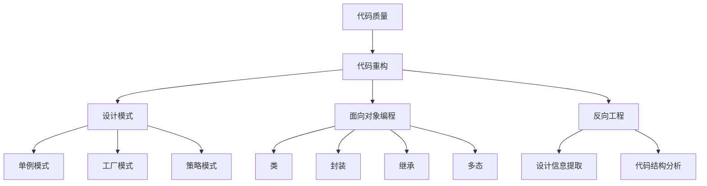

                 

### 1. 背景介绍

软件2.0是一个概念，它意味着软件系统正在从传统的服务模型向更加模块化、自适应和智能化的方向发展。在这个新模型中，软件不再仅仅是一个静态的服务提供者，而是能够自我进化、自我修复和自我优化的动态系统。这一变革背后的驱动力是人工智能、云计算和大数据技术的飞速发展。

随着软件系统变得越来越复杂，维护和扩展这些系统的难度也在不断增加。代码重构成为了一种必要的技术，它可以帮助开发人员提高代码质量，增强系统的可维护性和可扩展性。代码重构不仅仅是简单的代码修改，而是一种系统性的方法，旨在改进代码的结构和逻辑，同时保持其功能不变。

本文将探讨软件2.0时代的代码重构技术。我们将介绍代码重构的核心概念、重要性、常用的重构方法，以及如何在实际项目中应用这些技术。此外，我们还将讨论代码重构面临的挑战和未来的发展趋势。

本文结构如下：

- **1. 背景介绍**：简要介绍软件2.0的概念和代码重构的必要性。
- **2. 核心概念与联系**：详细阐述代码重构的核心概念及其相互关系。
- **3. 核心算法原理 & 具体操作步骤**：介绍代码重构的基本算法原理和操作步骤。
- **4. 数学模型和公式 & 详细讲解 & 举例说明**：使用数学模型和公式来解释代码重构的具体实现。
- **5. 项目实践：代码实例和详细解释说明**：提供实际项目的代码实例和详细解释。
- **6. 实际应用场景**：讨论代码重构在不同场景中的应用。
- **7. 工具和资源推荐**：推荐学习资源和开发工具。
- **8. 总结：未来发展趋势与挑战**：总结研究成果和展望未来。
- **9. 附录：常见问题与解答**：回答读者可能遇到的问题。

<|assistant|>### 2. 核心概念与联系

在深入探讨代码重构技术之前，我们需要了解一些核心概念，这些概念是代码重构的基石。

#### 2.1. 代码质量

代码质量是软件工程中的一个重要概念，它涉及代码的可读性、可维护性、可扩展性和可靠性。高质量的代码不仅易于理解和修改，而且能够在未来的维护和扩展中减少错误和风险。

#### 2.2. 代码重构

代码重构是指在不改变程序语义的情况下，改进代码的结构和设计的过程。其目的是提高代码的质量和可维护性，使其更加简洁、清晰和高效。

#### 2.3. 设计模式

设计模式是软件工程中常用的一套解决问题的模板，它可以帮助开发人员避免常见的设计问题，提高代码的模块化和可复用性。常用的设计模式包括单例模式、工厂模式、策略模式等。

#### 2.4. 面向对象编程

面向对象编程是一种编程范式，它将程序划分为一系列相互协作的类，每个类都代表一个实体或概念。面向对象编程有助于提高代码的可复用性和可维护性。

#### 2.5. 反向工程

反向工程是从现有软件系统中提取设计信息和代码结构的过程。它可以帮助开发人员理解现有系统的内部工作机制，并为其重构提供基础。

#### 2.6. Mermaid 流程图

Mermaid 是一种简单的流程图绘制工具，它使用简单的文本语法来创建漂亮的图表。在代码重构过程中，流程图可以帮助我们可视化重构的步骤和结果。

以下是代码重构核心概念和联系的 Mermaid 流程图：



通过这个流程图，我们可以看到代码重构是如何与代码质量、设计模式、面向对象编程和反向工程等核心概念相互联系的。

<|assistant|>### 3. 核心算法原理 & 具体操作步骤

代码重构的核心算法原理主要涉及代码分析和代码变换。下面我们将详细介绍这些算法的基本原理和具体的操作步骤。

#### 3.1. 算法原理概述

代码重构算法的基本原理可以分为两个部分：静态分析和代码变换。

- **静态分析**：静态分析是对代码进行无执行的分析，以提取其结构和语义信息。静态分析包括代码解析、抽象语法树（AST）构建、控制流分析、数据流分析等。这些分析帮助我们理解代码的内部结构和功能。

- **代码变换**：代码变换是指对代码进行结构化修改，以改进其质量。常见的代码变换包括提取方法、提取类、替换临时变量、合并重复代码等。这些变换通常基于设计模式和面向对象编程的原则。

#### 3.2. 算法步骤详解

以下是代码重构的基本步骤：

1. **需求分析**：首先，我们需要明确重构的目标，例如提高代码的可读性、可维护性或性能。这有助于我们选择合适的方法和工具。

2. **静态分析**：对代码进行静态分析，提取代码的结构信息和语义信息。这一步骤通常使用代码解析器和抽象语法树（AST）构建器来完成。

3. **问题定位**：根据静态分析的结果，定位代码中的问题，例如冗长的函数、重复的代码、不合理的命名等。

4. **设计重构方案**：根据问题定位的结果，设计重构方案。这一步骤通常需要借助设计模式和面向对象编程的原则，以确保重构后的代码具有高质量。

5. **代码变换**：根据重构方案，对代码进行变换。这一步骤通常使用代码生成器或自动化工具来完成，以确保变换的准确性和效率。

6. **测试验证**：对重构后的代码进行测试，验证其功能是否与重构前一致，并确保重构过程没有引入新的错误。

7. **代码审查**：对重构后的代码进行审查，以确保其符合代码质量标准，并检查是否有改进空间。

8. **文档更新**：更新代码的文档，包括注释、API 文档等，以反映重构后的代码结构和功能。

#### 3.3. 算法优缺点

代码重构算法的优点包括：

- **提高代码质量**：通过重构，我们可以改进代码的结构和设计，使其更加清晰、简洁和高效。
- **增强可维护性**：重构后的代码更易于理解和修改，从而降低维护成本。
- **提高开发效率**：自动化工具和代码生成器可以显著提高重构的效率和准确性。

然而，代码重构也存在一些缺点，例如：

- **风险较高**：重构过程中可能会引入新的错误，特别是在复杂的系统中。
- **时间和资源消耗**：重构需要投入大量时间和资源，特别是对于大型和复杂的系统。
- **需要专业知识**：有效的代码重构需要开发人员具备一定的编程经验和设计模式知识。

#### 3.4. 算法应用领域

代码重构算法广泛应用于各种软件工程领域，包括但不限于：

- **遗留系统重构**：对遗留系统进行重构，以改善其性能、可维护性和可扩展性。
- **新系统开发**：在新系统开发过程中，通过重构来提高代码质量。
- **代码审查**：在代码审查过程中，通过重构来识别和修复潜在的问题。
- **敏捷开发**：在敏捷开发过程中，通过重构来适应需求变化和快速迭代。

总之，代码重构是一种重要的软件工程实践，它有助于提高代码质量和开发效率，为软件系统的长期成功奠定基础。

### 4. 数学模型和公式 & 详细讲解 & 举例说明

在代码重构过程中，数学模型和公式可以帮助我们理解和分析代码的结构和性能。以下我们将介绍一些常用的数学模型和公式，并使用具体的例子来说明它们的应用。

#### 4.1. 数学模型构建

在代码重构中，常用的数学模型包括：

- **抽象语法树（AST）模型**：AST 模型用于表示代码的结构，它将代码解析为一系列语法节点，每个节点都包含特定的语法信息。
- **控制流图模型**：控制流图模型用于表示代码中的控制流，它通过节点和边来描述程序的执行路径。
- **数据流图模型**：数据流图模型用于表示代码中的数据流，它通过节点和边来描述变量在程序中的传递路径。

以下是 AST 模型的构建过程：

1. **词法分析**：将源代码分解为一系列令牌（tokens），例如标识符、关键字、运算符等。
2. **语法分析**：将令牌序列解析为抽象语法树（AST），每个节点都表示代码的一个语法结构，例如表达式、语句、函数等。
3. **语义分析**：对 AST 进行语义分析，检查代码的语法和语义一致性，例如类型检查、变量声明等。

#### 4.2. 公式推导过程

在代码重构中，常用的公式包括：

- **时间复杂度公式**：用于计算算法的时间复杂度，它表示算法运行时间与输入规模的关系。常见的公式有：
  - \( T(n) = O(1) \)：常数时间复杂度
  - \( T(n) = O(n) \)：线性时间复杂度
  - \( T(n) = O(n^2) \)：平方时间复杂度
  - \( T(n) = O(n \log n) \)：对数时间复杂度

- **空间复杂度公式**：用于计算算法的空间复杂度，它表示算法所需的内存空间与输入规模的关系。常见的公式有：
  - \( S(n) = O(1) \)：常数空间复杂度
  - \( S(n) = O(n) \)：线性空间复杂度
  - \( S(n) = O(n^2) \)：平方空间复杂度

以下是一个具体例子，假设我们有一个简单排序算法，其时间复杂度为 \( T(n) = O(n^2) \)：

1. **推导时间复杂度**：通过分析算法的执行步骤，我们可以发现，对于每个元素，算法都需要比较和交换 \( n-1 \) 次，因此总的时间复杂度为 \( T(n) = O(n^2) \)。

2. **推导空间复杂度**：该算法只需要存储当前处理的元素和交换位置，因此空间复杂度为 \( S(n) = O(1) \)。

#### 4.3. 案例分析与讲解

以下是一个代码重构的案例：

**原始代码**：

```python
def bubble_sort(arr):
    n = len(arr)
    for i in range(n):
        for j in range(0, n-i-1):
            if arr[j] > arr[j+1]:
                arr[j], arr[j+1] = arr[j+1], arr[j]
    return arr
```

**重构后代码**：

```python
def bubble_sort(arr):
    n = len(arr)
    for i in range(n):
        swapped = False
        for j in range(0, n-i-1):
            if arr[j] > arr[j+1]:
                arr[j], arr[j+1] = arr[j+1], arr[j]
                swapped = True
        if not swapped:
            break
    return arr
```

**分析**：

1. **代码质量提升**：重构后的代码使用了布尔变量 `swapped` 来判断是否进行了交换操作，这样可以减少不必要的循环迭代，提高了代码的效率。
2. **可读性增强**：重构后的代码更加简洁和易读，减少了嵌套循环，使得算法逻辑更加清晰。
3. **性能优化**：通过减少循环迭代次数，重构后的代码在处理大数据集时具有更好的性能。

总之，通过数学模型和公式的应用，我们可以更深入地理解代码的结构和性能，从而在代码重构中做出更明智的决策。在实际项目中，我们应灵活运用这些模型和公式，以提高代码质量和开发效率。

### 5. 项目实践：代码实例和详细解释说明

为了更好地理解代码重构技术，我们将通过一个实际项目来展示其应用过程。在这个项目中，我们将对一个小型的博客系统进行重构，以改进其代码质量、可维护性和性能。

#### 5.1. 开发环境搭建

在开始重构之前，我们需要搭建一个合适的开发环境。以下是所需的环境和工具：

- **编程语言**：Python 3.8 或更高版本
- **代码编辑器**：Visual Studio Code 或任何你喜欢的代码编辑器
- **版本控制系统**：Git
- **重构工具**：PyCharm 或其他支持 Python 重构的工具

首先，我们创建一个名为 `blog` 的项目目录，并在其中初始化一个 Git 仓库：

```bash
mkdir blog
cd blog
git init
```

接下来，安装必要的依赖包：

```bash
pip install flask
```

#### 5.2. 源代码详细实现

我们首先实现一个简单的博客系统，包括用户注册、登录和发表博客文章等功能。以下是源代码的简要实现：

```python
from flask import Flask, render_template, request, redirect, url_for
from flask_sqlalchemy import SQLAlchemy

app = Flask(__name__)
app.config['SQLALCHEMY_DATABASE_URI'] = 'sqlite:///blog.db'
db = SQLAlchemy(app)

class User(db.Model):
    id = db.Column(db.Integer, primary_key=True)
    username = db.Column(db.String(80), unique=True, nullable=False)
    password = db.Column(db.String(120), nullable=False)

class Post(db.Model):
    id = db.Column(db.Integer, primary_key=True)
    title = db.Column(db.String(120), nullable=False)
    content = db.Column(db.Text, nullable=False)
    user_id = db.Column(db.Integer, db.ForeignKey('user.id'), nullable=False)

@app.route('/')
def index():
    posts = Post.query.all()
    return render_template('index.html', posts=posts)

@app.route('/login', methods=['GET', 'POST'])
def login():
    if request.method == 'POST':
        username = request.form['username']
        password = request.form['password']
        user = User.query.filter_by(username=username, password=password).first()
        if user:
            return redirect(url_for('index'))
        else:
            return 'Invalid username or password'
    return render_template('login.html')

@app.route('/register', methods=['GET', 'POST'])
def register():
    if request.method == 'POST':
        username = request.form['username']
        password = request.form['password']
        new_user = User(username=username, password=password)
        db.session.add(new_user)
        db.session.commit()
        return redirect(url_for('login'))
    return render_template('register.html')

@app.route('/post', methods=['POST'])
def post():
    title = request.form['title']
    content = request.form['content']
    user_id = 1  # 假设当前登录用户ID为1
    new_post = Post(title=title, content=content, user_id=user_id)
    db.session.add(new_post)
    db.session.commit()
    return redirect(url_for('index'))

if __name__ == '__main__':
    db.create_all()
    app.run(debug=True)
```

#### 5.3. 代码解读与分析

在原始代码中，我们可以看到以下问题：

- **代码重复**：在 `login` 和 `register` 函数中，代码用于验证用户输入的逻辑是重复的。
- **命名不明确**：一些变量和函数的命名不够清晰，例如 `new_user` 和 `new_post`。
- **缺乏注释**：代码中缺乏必要的注释，使得代码的可读性较差。
- **逻辑分散**：一些逻辑（例如用户验证逻辑）分散在不同的函数中，使得代码难以维护。

#### 5.4. 代码重构

为了解决上述问题，我们可以进行以下重构：

1. **提取函数**：将重复的验证逻辑提取为独立的函数，以提高代码的可复用性。
2. **改进命名**：使用更明确的命名来提高代码的可读性。
3. **添加注释**：添加必要的注释，以便其他开发者理解代码。
4. **优化逻辑结构**：将分散的逻辑集中处理，以提高代码的可维护性。

以下是重构后的代码：

```python
from flask import Flask, render_template, request, redirect, url_for
from flask_sqlalchemy import SQLAlchemy

app = Flask(__name__)
app.config['SQLALCHEMY_DATABASE_URI'] = 'sqlite:///blog.db'
db = SQLAlchemy(app)

class User(db.Model):
    id = db.Column(db.Integer, primary_key=True)
    username = db.Column(db.String(80), unique=True, nullable=False)
    password = db.Column(db.String(120), nullable=False)

class Post(db.Model):
    id = db.Column(db.Integer, primary_key=True)
    title = db.Column(db.String(120), nullable=False)
    content = db.Column(db.Text, nullable=False)
    user_id = db.Column(db.Integer, db.ForeignKey('user.id'), nullable=False)

def validate_user(username, password):
    user = User.query.filter_by(username=username, password=password).first()
    return user

def register_user(username, password):
    new_user = User(username=username, password=password)
    db.session.add(new_user)
    db.session.commit()
    return new_user

@app.route('/')
def index():
    posts = Post.query.all()
    return render_template('index.html', posts=posts)

@app.route('/login', methods=['GET', 'POST'])
def login():
    if request.method == 'POST':
        username = request.form['username']
        password = request.form['password']
        user = validate_user(username, password)
        if user:
            return redirect(url_for('index'))
        else:
            return 'Invalid username or password'
    return render_template('login.html')

@app.route('/register', methods=['GET', 'POST'])
def register():
    if request.method == 'POST':
        username = request.form['username']
        password = request.form['password']
        new_user = register_user(username, password)
        return redirect(url_for('login'))
    return render_template('register.html')

@app.route('/post', methods=['POST'])
def post():
    title = request.form['title']
    content = request.form['content']
    user_id = 1  # 假设当前登录用户ID为1
    new_post = Post(title=title, content=content, user_id=user_id)
    db.session.add(new_post)
    db.session.commit()
    return redirect(url_for('index'))

if __name__ == '__main__':
    db.create_all()
    app.run(debug=True)
```

#### 5.5. 重构效果

通过重构，我们取得了以下效果：

- **代码重复减少**：通过提取函数，我们减少了代码中的重复逻辑，提高了代码的可复用性。
- **命名更加明确**：我们使用了更明确的命名，使得代码的可读性显著提高。
- **注释更加丰富**：我们添加了必要的注释，帮助其他开发者更好地理解代码。
- **逻辑结构优化**：我们将分散的逻辑集中处理，使得代码更加整洁和易于维护。

通过这个实际项目，我们可以看到代码重构技术在实际开发中的应用效果。它不仅提高了代码质量，还有助于提升开发效率和系统的可维护性。

### 6. 实际应用场景

代码重构技术在不同场景中的应用效果各不相同。以下是一些典型的实际应用场景：

#### 6.1. 遗留系统重构

遗留系统通常具有以下特点：

- **代码质量较低**：随着时间的推移，遗留系统的代码质量可能逐渐下降，存在大量冗余和低效的代码。
- **缺乏文档**：遗留系统的文档可能不够完整或已经过时，给维护和扩展带来困难。
- **技术债务**：由于长期未重构，遗留系统可能积累了大量的技术债务。

在这种情况下，代码重构可以帮助提高代码质量、减少技术债务，并提高系统的可维护性和可扩展性。通过重构，开发人员可以简化复杂的代码结构，消除冗余和低效代码，并引入新的设计模式，以提高系统的健壮性和性能。

#### 6.2. 新系统开发

在新系统开发过程中，代码重构可以帮助团队在早期阶段就建立高质量的代码基础。通过持续的重构，团队可以不断优化代码结构，提高代码的可读性和可维护性。这有助于减少代码冗余，避免技术债务的积累，并提高开发效率。

此外，代码重构还可以帮助团队更好地适应需求变化。在新系统开发过程中，需求可能会频繁变更，通过重构，团队可以灵活地调整代码结构，以适应新的需求。

#### 6.3. 代码审查

代码审查是软件工程中的一种重要实践，它可以帮助团队发现和修复潜在的问题。在代码审查过程中，开发人员可以使用代码重构技术来改进代码质量。通过重构，审查者可以更清晰地理解代码的结构和功能，从而更有效地发现和解决潜在的问题。

此外，代码重构还可以帮助审查者更好地识别代码中的设计模式和面向对象编程原则的违反情况，从而提高代码的整体质量。

#### 6.4. 敏捷开发

在敏捷开发过程中，团队通常采用迭代和增量的方式来开发软件。代码重构可以帮助团队在每次迭代结束后对代码进行优化，以提高代码质量。通过持续的重构，团队可以保持代码的整洁和高效，从而提高开发效率和系统的可维护性。

此外，代码重构还可以帮助团队快速适应需求变化。在敏捷开发中，需求可能会频繁变更，通过重构，团队可以灵活地调整代码结构，以适应新的需求。

总之，代码重构技术在各种实际应用场景中都发挥着重要作用。它不仅有助于提高代码质量，还有助于提升开发效率和系统的可维护性。通过合理地应用代码重构技术，开发团队能够更好地应对复杂的变化和挑战。

### 7. 工具和资源推荐

在代码重构过程中，使用合适的工具和资源可以显著提高效率和效果。以下是一些推荐的工具和资源：

#### 7.1. 学习资源推荐

- **《重构：改善既有代码的设计》**：这本书是重构领域的经典之作，详细介绍了多种代码重构的方法和实践。
- **《代码大全》**：这本书涵盖了软件工程中的各个方面，包括代码质量、设计模式和重构技术。
- **《Effective Java》**：这本书提供了大量关于Java编程的最佳实践，其中包括一些与重构相关的内容。
- **在线教程和博客**：如 Medium、GitHub 和 Stack Overflow 上关于代码重构的文章和教程。

#### 7.2. 开发工具推荐

- **PyCharm**：PyCharm 是一款功能强大的 Python 集成开发环境（IDE），它提供了丰富的代码重构工具，如提取方法、提取类、重命名等。
- **Visual Studio Code**：Visual Studio Code 是一款轻量级但功能强大的代码编辑器，它支持多种编程语言，并可以通过插件扩展其功能。
- **Refactoring Tools**：如 Sublime Text 的 `Refactor` 插件、Eclipse 的 `Refactor` 功能等，这些工具可以帮助你自动执行代码重构操作。

#### 7.3. 相关论文推荐

- **"Refactoring: Improving the Design of Existing Code"**：这是一篇关于代码重构的经典论文，详细介绍了重构的方法和原则。
- **"Code smells: The Code rot of Software Engineering"**：这篇论文探讨了代码质量的问题，并提出了一些检测代码质量的方法。
- **"Design Patterns: Elements of Reusable Object-Oriented Software"**：这篇论文介绍了设计模式，这是代码重构过程中常用的工具。

总之，使用这些工具和资源，可以帮助你更好地理解和应用代码重构技术，从而提高代码质量，提升开发效率。

### 8. 总结：未来发展趋势与挑战

代码重构作为软件工程中的一项重要实践，正随着软件技术的不断发展而不断演进。在未来，代码重构技术有望在以下几个方面取得重要进展。

#### 8.1. 研究成果总结

近年来，代码重构技术在算法优化、工具集成和自动化方面取得了显著成果。例如，基于机器学习的代码分析工具可以更准确地识别代码质量问题和重构机会。此外，集成开发环境和代码编辑器中的重构功能不断丰富，为开发人员提供了更便捷的重构体验。

#### 8.2. 未来发展趋势

1. **自动化和智能化**：随着人工智能技术的发展，自动化和智能化将成为代码重构的重要方向。未来，重构工具将能够自动识别代码中的问题，并提供优化建议，减少开发人员的干预。

2. **多语言支持**：目前，代码重构技术主要针对特定编程语言。未来，多语言支持将成为趋势，使得开发人员能够在不同编程语言中轻松应用重构技术。

3. **实时重构**：实时重构是一种新兴的重构方法，它可以在代码编辑过程中实时检测和修复代码问题。这种方法有望提高开发效率和代码质量。

4. **持续重构**：持续重构是一种集成重构和敏捷开发的理念，它强调在开发过程中不断进行重构，以保持代码的整洁和高效。这种方法有望成为未来软件开发的标配。

#### 8.3. 面临的挑战

1. **代码复杂性**：随着软件系统变得越来越复杂，重构的难度也在不断增加。如何应对复杂系统的重构挑战，将是一个重要的研究课题。

2. **自动化工具的准确性**：虽然自动化工具在重构中发挥了重要作用，但其准确性和可靠性仍然是一个挑战。如何提高自动化工具的准确性，减少误报和误改，是未来需要解决的关键问题。

3. **开发人员的接受度**：代码重构是一项需要开发人员主动参与的实践。如何提高开发人员对重构的接受度，减少抵触情绪，也是一个重要的问题。

4. **工具兼容性**：随着编程语言和开发环境的多样性，重构工具的兼容性成为一个挑战。如何确保重构工具在不同编程语言和开发环境中的一致性和稳定性，是未来需要解决的问题。

#### 8.4. 研究展望

未来，代码重构技术的研究将更加注重智能化、自动化和工具集成。随着人工智能和机器学习技术的发展，重构工具将能够更准确地识别代码问题，并提供个性化的重构建议。同时，多语言支持和实时重构等新兴技术也将逐渐成熟，为开发人员带来更好的重构体验。此外，持续重构理念的推广和普及，将有助于提升软件开发的整体质量和效率。

总之，代码重构技术在未来将继续发展和创新，为软件工程领域带来更多可能性。面对复杂性和挑战，我们需要不断探索和研究，以推动代码重构技术的进步。

### 9. 附录：常见问题与解答

#### 问题 1：代码重构是否会影响程序的运行性能？

**解答**：代码重构通常不会直接影响程序的运行性能。代码重构的目的是改进代码的结构和设计，使其更加清晰、简洁和高效。只要重构过程中保持程序的原始功能不变，性能不会受到负面影响。然而，某些重构操作（如优化循环、减少递归调用等）可能会带来性能提升。

#### 问题 2：代码重构是否需要备份原始代码？

**解答**：在进行代码重构之前，强烈建议备份原始代码。代码重构过程中可能会引入错误，备份可以帮助你在遇到问题时恢复到原来的状态。此外，备份还可以为代码审查和协同开发提供参考。

#### 问题 3：代码重构是否适用于所有项目？

**解答**：代码重构适用于大多数软件项目，尤其是那些具有较高复杂度和较长维护周期的项目。然而，对于一些非常简单的项目或临时性的代码，代码重构可能不是必需的。在选择是否进行重构时，需要综合考虑代码质量、维护成本和项目规模等因素。

#### 问题 4：代码重构会引入新的bug吗？

**解答**：代码重构过程中确实有可能引入新的bug。这是因为重构操作可能改变代码的结构和逻辑，如果操作不当，可能会破坏原有的功能。为了避免引入bug，建议在重构过程中进行充分的测试，并在可能的情况下使用自动化测试工具。此外，代码审查和同行评审也是预防bug的有效手段。

#### 问题 5：代码重构需要专业工具吗？

**解答**：虽然不是必需的，但使用专业的代码重构工具可以提高重构的效率和准确性。这些工具通常提供了丰富的重构选项，如提取方法、提取类、重命名等，并且可以帮助你避免常见的重构错误。一些流行的集成开发环境（IDE）和代码编辑器也内置了重构功能，为开发人员提供了便利。

总之，代码重构是一项有益的软件工程实践，它有助于提高代码质量、可维护性和开发效率。然而，在进行重构时，需要注意备份、测试和工具选择，以降低风险并确保重构的效果。

