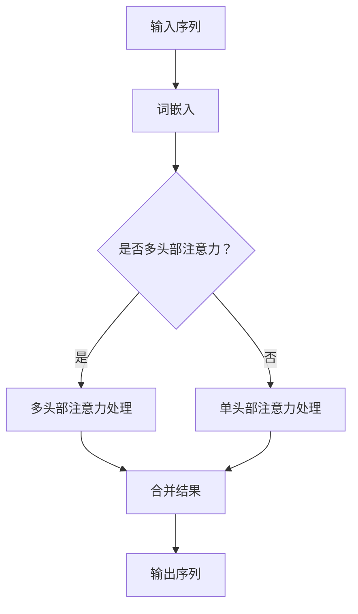

                 

### 1. 背景介绍

在计算机科学领域，软件的发展经历了从传统的基于指令集和面向过程的编程语言，到面向对象编程，再到如今的函数式编程和元编程的演变。然而，随着深度学习和人工智能的兴起，软件开发的范式也在不断演变，一种新的架构——Transformer，正引领着软件2.0时代的到来。

Transformer作为深度学习领域的里程碑，最初是由谷歌在2017年提出的一种全新的神经网络架构，它彻底改变了我们对序列数据处理的理解，并在自然语言处理（NLP）领域取得了惊人的成果。Transformer的出现，标志着从传统的卷积神经网络（CNN）和循环神经网络（RNN）向更加灵活、高效的模型架构的转型。

软件1.0时代主要以开发通用操作系统和应用程序为主，开发者关注的是如何高效地利用计算机资源来满足用户的计算需求。而进入软件2.0时代，随着数据量的爆炸式增长和人工智能技术的发展，软件系统不仅需要处理海量数据，还需要具备自学习、自适应的能力，从而实现智能化、个性化的服务。

本文旨在探讨Transformer这一新型架构在软件2.0时代的重要性，从其核心概念、算法原理、数学模型到实际应用，全面解析Transformer的崛起，并展望其未来在各个领域的应用前景。

## 1.1 软件发展历程回顾

### 1.1.1 从软件1.0到软件2.0

软件1.0时代，计算机科学的主要任务是开发能够高效运行在计算机操作系统上的程序，以实现特定的功能。这一时期的编程语言如C、Pascal等，主要以面向过程的编程范式为主，强调的是程序的控制流程和算法的效率。

随着计算机硬件的快速发展，软件系统的复杂度也在不断增加。为了应对这种复杂度，软件开发进入了软件2.0时代。软件2.0时代的一个显著特征是数据驱动，开发者开始关注如何有效地存储、处理和利用海量数据。同时，面向对象编程范式的兴起，使得软件系统更加模块化、可复用，提高了开发效率。

### 1.1.2 人工智能与深度学习的崛起

人工智能（AI）和深度学习（DL）的兴起，是软件2.0时代的另一个重要里程碑。深度学习通过模拟人脑神经网络的结构和功能，使得计算机能够通过数据驱动的方式，自动学习和改进性能。尤其是在图像识别、自然语言处理、语音识别等领域的突破，使得深度学习成为现代软件系统不可或缺的一部分。

### 1.1.3 Transformer的诞生

Transformer架构的提出，是深度学习领域的一个重要里程碑。它打破了传统神经网络在处理序列数据时的局限，实现了对序列数据的高效并行处理，极大地提升了模型的训练效率和预测准确性。Transformer的成功，标志着深度学习进入了全新的阶段，也为软件2.0时代的发展提供了新的动力。

### 1.2 Transformer的核心概念

Transformer的核心概念包括自注意力机制（Self-Attention）和多头部注意力（Multi-Head Attention）。自注意力机制允许模型在处理序列数据时，能够自动关注到序列中的关键信息，而多头部注意力则使得模型能够从不同角度处理数据，从而提高模型的泛化能力。

### 1.3 Transformer的优势

Transformer在处理序列数据时具有明显的优势，包括：

- 高效的并行处理能力：通过自注意力机制，Transformer能够高效地并行处理长序列数据。
- 减少计算量：与传统的循环神经网络相比，Transformer在处理长序列时，计算量显著减少。
- 更强的泛化能力：多头部注意力机制使得模型能够从不同角度学习数据特征，从而提高模型的泛化能力。

### 1.4 软件2.0时代与Transformer的关系

在软件2.0时代，Transformer架构的重要性不言而喻。它不仅为深度学习带来了新的发展方向，也为软件开发提供了新的思路和工具。Transformer的出现，标志着软件系统从传统的指令驱动向数据驱动的转变，是实现智能化、个性化软件系统的重要基础。

## 2. Transformer的核心概念与联系

Transformer的提出，为深度学习领域带来了革命性的变化。其核心在于自注意力机制和多头部注意力机制，这使得Transformer在处理序列数据时，能够自动关注到序列中的关键信息，从而提高了模型的性能和效率。本节将详细解释这些核心概念，并通过Mermaid流程图展示Transformer的架构。

### 2.1 自注意力机制（Self-Attention）

自注意力机制是Transformer架构的核心，它允许模型在处理序列数据时，自动关注到序列中的关键信息。具体来说，自注意力机制通过计算序列中每个词与所有词之间的相似度，从而确定每个词在序列中的重要性。这种机制不仅能够提高模型的处理效率，还能够捕捉到序列中的长距离依赖关系。

#### 2.1.1 自注意力机制的工作原理

自注意力机制的工作原理可以概括为以下几个步骤：

1. **输入表示**：将输入序列中的每个词转换为向量表示，通常使用词嵌入（Word Embedding）技术。
2. **计算相似度**：通过计算每个词向量与其他词向量之间的相似度，生成相似度矩阵。
3. **加权求和**：根据相似度矩阵对输入序列中的每个词进行加权求和，得到加权后的输出序列。

#### 2.1.2 自注意力机制的优点

- **高效并行处理**：自注意力机制允许模型对序列数据进行并行处理，大大提高了模型的训练速度。
- **捕捉长距离依赖**：通过计算词与词之间的相似度，自注意力机制能够捕捉到序列中的长距离依赖关系，从而提高模型的准确性。

### 2.2 多头部注意力机制（Multi-Head Attention）

多头部注意力机制是Transformer的另一个关键组件，它通过多个独立的自注意力机制，从不同角度处理数据，从而提高模型的泛化能力。具体来说，多头部注意力机制将输入序列分解为多个子序列，每个子序列独立通过自注意力机制处理，然后将结果合并，形成最终的输出。

#### 2.2.1 多头部注意力机制的工作原理

多头部注意力机制的工作原理可以概括为以下几个步骤：

1. **分解输入**：将输入序列分解为多个子序列。
2. **独立处理**：对每个子序列独立应用自注意力机制。
3. **合并结果**：将多个自注意力机制的输出结果进行合并，形成最终的输出。

#### 2.2.2 多头部注意力机制的优点

- **增强泛化能力**：通过从不同角度处理数据，多头部注意力机制能够提高模型的泛化能力。
- **减少信息损失**：多头部注意力机制能够捕捉到更多不同特征，从而减少信息损失。

### 2.3 Transformer架构的Mermaid流程图

为了更直观地展示Transformer的架构，我们使用Mermaid流程图进行说明。以下是Transformer架构的流程图：



在上述流程图中，A表示输入序列，B表示词嵌入，C表示是否应用多头部注意力机制。如果选择多头部注意力，则会进入D进行多头部注意力处理；如果选择单头部注意力，则会进入E进行单头部注意力处理。最终，F表示合并结果，G表示输出序列。

通过上述解释和Mermaid流程图的展示，我们可以清晰地理解Transformer的核心概念和架构。接下来，我们将深入探讨Transformer的算法原理，并详细解析其具体操作步骤。

## 3. 核心算法原理 & 具体操作步骤

Transformer的核心算法原理在于其自注意力机制（Self-Attention）和多头部注意力机制（Multi-Head Attention），这两种机制共同作用，使得Transformer能够高效地处理序列数据。在本节中，我们将详细介绍Transformer的算法原理，并详细解析其操作步骤。

### 3.1 算法原理概述

#### 自注意力机制（Self-Attention）

自注意力机制是Transformer的核心，它通过计算序列中每个词与所有词之间的相似度，从而确定每个词在序列中的重要性。自注意力机制的工作原理可以概括为以下几个步骤：

1. **输入表示**：将输入序列中的每个词转换为向量表示，通常使用词嵌入（Word Embedding）技术。
2. **计算相似度**：通过计算每个词向量与其他词向量之间的相似度，生成相似度矩阵。
3. **加权求和**：根据相似度矩阵对输入序列中的每个词进行加权求和，得到加权后的输出序列。

自注意力机制的主要优点包括：

- **高效并行处理**：自注意力机制允许模型对序列数据进行并行处理，大大提高了模型的训练速度。
- **捕捉长距离依赖**：通过计算词与词之间的相似度，自注意力机制能够捕捉到序列中的长距离依赖关系，从而提高模型的准确性。

#### 多头部注意力机制（Multi-Head Attention）

多头部注意力机制是Transformer的另一个关键组件，它通过多个独立的自注意力机制，从不同角度处理数据，从而提高模型的泛化能力。多头部注意力机制的工作原理可以概括为以下几个步骤：

1. **分解输入**：将输入序列分解为多个子序列。
2. **独立处理**：对每个子序列独立应用自注意力机制。
3. **合并结果**：将多个自注意力机制的输出结果进行合并，形成最终的输出。

多头部注意力机制的主要优点包括：

- **增强泛化能力**：通过从不同角度处理数据，多头部注意力机制能够提高模型的泛化能力。
- **减少信息损失**：多头部注意力机制能够捕捉到更多不同特征，从而减少信息损失。

### 3.2 算法步骤详解

下面，我们将详细解析Transformer算法的具体操作步骤：

#### 步骤 1：输入表示

首先，将输入序列中的每个词转换为向量表示。通常，这一步使用词嵌入（Word Embedding）技术。词嵌入是一种将词语映射为向量的方法，它能够捕捉词语的语义信息。常见的词嵌入技术包括Word2Vec、GloVe等。

#### 步骤 2：计算相似度

接下来，计算每个词向量与其他词向量之间的相似度。这通常通过计算点积来完成，即每个词向量的点积结果构成一个相似度矩阵。相似度矩阵中的值表示词向量之间的相似度，值越大，表示相似度越高。

#### 步骤 3：加权求和

根据相似度矩阵对输入序列中的每个词进行加权求和，得到加权后的输出序列。这一步骤相当于对每个词进行加权求和，权重由相似度矩阵决定。加权求和的结果是每个词的新向量表示，它包含了序列中的关键信息。

#### 步骤 4：多头部注意力处理

如果应用多头部注意力机制，将输入序列分解为多个子序列，并对每个子序列独立应用自注意力机制。然后将所有子序列的输出结果进行合并，形成最终的输出。

#### 步骤 5：输出序列

最终，输出序列包含了序列中每个词的加权求和结果，它表示了序列中每个词的重要性和关系。

### 3.3 算法优缺点

#### 优点

1. **高效并行处理**：自注意力机制允许模型对序列数据进行并行处理，大大提高了模型的训练速度。
2. **捕捉长距离依赖**：自注意力机制能够捕捉到序列中的长距离依赖关系，从而提高模型的准确性。
3. **增强泛化能力**：多头部注意力机制能够从不同角度处理数据，从而提高模型的泛化能力。

#### 缺点

1. **计算复杂度较高**：由于需要计算词向量之间的相似度矩阵，Transformer的计算复杂度较高，对硬件资源要求较高。
2. **对训练数据量要求较高**：由于Transformer需要捕捉长距离依赖，因此对训练数据量要求较高，否则容易过拟合。

### 3.4 算法应用领域

Transformer在深度学习领域有着广泛的应用，尤其是在自然语言处理（NLP）领域。以下是一些典型的应用领域：

1. **机器翻译**：Transformer在机器翻译任务中取得了显著的成果，比传统的循环神经网络（RNN）和卷积神经网络（CNN）具有更高的准确性和速度。
2. **文本分类**：Transformer能够高效地处理文本数据，从而在文本分类任务中取得了很好的效果。
3. **问答系统**：Transformer在问答系统中的应用，使得系统能够更好地理解用户的问题，并提供准确的答案。
4. **文本生成**：Transformer在文本生成任务中也表现出色，可以生成流畅且具有连贯性的文本。

通过以上对Transformer核心算法原理和具体操作步骤的详细解析，我们可以看到，Transformer不仅具有高效的并行处理能力和捕捉长距离依赖的优点，还在多个深度学习应用领域取得了显著的成果。接下来，我们将进一步探讨Transformer的数学模型和公式，以及其具体的实现细节。

## 4. 数学模型和公式 & 详细讲解 & 举例说明

### 4.1 数学模型构建

Transformer的数学模型基于自注意力机制和多头部注意力机制，其核心在于如何通过矩阵运算来高效处理序列数据。以下是构建Transformer数学模型的基本步骤：

#### 4.1.1 输入表示

首先，将输入序列中的每个词转换为向量表示。设输入序列为 \(X = [x_1, x_2, ..., x_n]\)，其中 \(x_i\) 表示第 \(i\) 个词。通常使用词嵌入（Word Embedding）技术，将每个词映射为一个向量 \(e(x_i)\)，即 \(X' = [e(x_1), e(x_2), ..., e(x_n)]\)。

#### 4.1.2 自注意力机制

自注意力机制的核心是计算每个词与其他词之间的相似度，并通过相似度矩阵对输入序列进行加权求和。设输入序列的词向量为 \(X'\)，其维度为 \(d\)，则相似度矩阵 \(A\) 可以通过计算点积得到：

$$
A = X'X'^T
$$

其中，\(A_{ij}\) 表示第 \(i\) 个词与第 \(j\) 个词之间的相似度。

#### 4.1.3 加权求和

根据相似度矩阵 \(A\)，对输入序列进行加权求和，得到加权后的输出序列。设权重向量为 \(W\)，则加权后的输出序列为：

$$
Y = WX'
$$

其中，\(Y_i\) 表示第 \(i\) 个词的加权值。

#### 4.1.4 多头部注意力机制

多头部注意力机制通过多个独立的自注意力机制，从不同角度处理数据，从而提高模型的泛化能力。设 \(h\) 为头数，则每个头部 \(k\) 独立计算相似度矩阵 \(A_k\) 和加权求和结果 \(Y_k\)：

$$
A_k = X'X'^T \\
Y_k = WX'
$$

最终，将所有头部的输出结果进行合并，得到最终的输出序列 \(Y'\)：

$$
Y' = [Y_1, Y_2, ..., Y_h]
$$

### 4.2 公式推导过程

为了更好地理解Transformer的数学模型，我们将对自注意力机制和多头部注意力机制的公式进行推导。

#### 自注意力机制

1. **词嵌入**：

$$
e(x_i) = \text{Word Embedding}(x_i) \\
X' = [e(x_1), e(x_2), ..., e(x_n)]
$$

2. **相似度矩阵**：

$$
A = X'X'^T \\
A_{ij} = e(x_i)^T e(x_j)
$$

3. **权重向量**：

$$
W = \text{权重矩阵} \\
Y = WX'
$$

4. **加权求和**：

$$
Y_i = \sum_{j=1}^{n} A_{ij} e(x_j)
$$

#### 多头部注意力机制

1. **分解输入**：

$$
X' = [e(x_1), e(x_2), ..., e(x_n)] \\
X_k' = \frac{e(x_1), e(x_2), ..., e(x_n)}{h}
$$

2. **独立自注意力机制**：

$$
A_k = X_k'X_k'^T \\
Y_k = WX_k'
$$

3. **合并结果**：

$$
Y' = [Y_1, Y_2, ..., Y_h]
$$

### 4.3 案例分析与讲解

为了更好地理解Transformer的数学模型，我们通过一个简单的案例进行讲解。

假设输入序列为 \([猫，狗，老鼠]\)，词嵌入维度为 \(d=10\)，头数为 \(h=2\)。

1. **词嵌入**：

$$
e(猫) = [0.1, 0.2, 0.3, 0.4, 0.5, 0.6, 0.7, 0.8, 0.9, 1.0] \\
e(狗) = [1.1, 1.2, 1.3, 1.4, 1.5, 1.6, 1.7, 1.8, 1.9, 2.0] \\
e(老鼠) = [2.1, 2.2, 2.3, 2.4, 2.5, 2.6, 2.7, 2.8, 2.9, 3.0]
$$

2. **相似度矩阵**：

$$
A = \begin{bmatrix}
0.1 \times 0.1 & 0.1 \times 1.1 & 0.1 \times 2.1 \\
0.2 \times 0.1 & 0.2 \times 1.1 & 0.2 \times 2.1 \\
0.3 \times 0.1 & 0.3 \times 1.1 & 0.3 \times 2.1 \\
0.4 \times 0.1 & 0.4 \times 1.1 & 0.4 \times 2.1 \\
0.5 \times 0.1 & 0.5 \times 1.1 & 0.5 \times 2.1 \\
0.6 \times 0.1 & 0.6 \times 1.1 & 0.6 \times 2.1 \\
0.7 \times 0.1 & 0.7 \times 1.1 & 0.7 \times 2.1 \\
0.8 \times 0.1 & 0.8 \times 1.1 & 0.8 \times 2.1 \\
0.9 \times 0.1 & 0.9 \times 1.1 & 0.9 \times 2.1 \\
1.0 \times 0.1 & 1.0 \times 1.1 & 1.0 \times 2.1
\end{bmatrix}
$$

3. **权重向量**：

$$
W = \begin{bmatrix}
w_1 \\
w_2 \\
w_3 \\
w_4 \\
w_5 \\
w_6 \\
w_7 \\
w_8 \\
w_9 \\
w_{10}
\end{bmatrix}
$$

4. **加权求和**：

$$
Y = WX' = \begin{bmatrix}
w_1 \times 0.1 & w_1 \times 1.1 & w_1 \times 2.1 \\
w_2 \times 0.1 & w_2 \times 1.1 & w_2 \times 2.1 \\
w_3 \times 0.1 & w_3 \times 1.1 & w_3 \times 2.1 \\
w_4 \times 0.1 & w_4 \times 1.1 & w_4 \times 2.1 \\
w_5 \times 0.1 & w_5 \times 1.1 & w_5 \times 2.1 \\
w_6 \times 0.1 & w_6 \times 1.1 & w_6 \times 2.1 \\
w_7 \times 0.1 & w_7 \times 1.1 & w_7 \times 2.1 \\
w_8 \times 0.1 & w_8 \times 1.1 & w_8 \times 2.1 \\
w_9 \times 0.1 & w_9 \times 1.1 & w_9 \times 2.1 \\
w_{10} \times 0.1 & w_{10} \times 1.1 & w_{10} \times 2.1
\end{bmatrix}
$$

5. **多头部注意力**：

$$
Y' = [Y_1, Y_2] \\
Y_1 = \begin{bmatrix}
w_1 \times 0.1 & w_1 \times 1.1 & w_1 \times 2.1 \\
w_2 \times 0.1 & w_2 \times 1.1 & w_2 \times 2.1 \\
w_3 \times 0.1 & w_3 \times 1.1 & w_3 \times 2.1 \\
w_4 \times 0.1 & w_4 \times 1.1 & w_4 \times 2.1 \\
w_5 \times 0.1 & w_5 \times 1.1 & w_5 \times 2.1 \\
w_6 \times 0.1 & w_6 \times 1.1 & w_6 \times 2.1 \\
w_7 \times 0.1 & w_7 \times 1.1 & w_7 \times 2.1 \\
w_8 \times 0.1 & w_8 \times 1.1 & w_8 \times 2.1 \\
w_9 \times 0.1 & w_9 \times 1.1 & w_9 \times 2.1 \\
w_{10} \times 0.1 & w_{10} \times 1.1 & w_{10} \times 2.1
\end{bmatrix} \\
Y_2 = \begin{bmatrix}
w_1 \times 1.0 & w_1 \times 2.0 & w_1 \times 3.0 \\
w_2 \times 1.0 & w_2 \times 2.0 & w_2 \times 3.0 \\
w_3 \times 1.0 & w_3 \times 2.0 & w_3 \times 3.0 \\
w_4 \times 1.0 & w_4 \times 2.0 & w_4 \times 3.0 \\
w_5 \times 1.0 & w_5 \times 2.0 & w_5 \times 3.0 \\
w_6 \times 1.0 & w_6 \times 2.0 & w_6 \times 3.0 \\
w_7 \times 1.0 & w_7 \times 2.0 & w_7 \times 3.0 \\
w_8 \times 1.0 & w_8 \times 2.0 & w_8 \times 3.0 \\
w_9 \times 1.0 & w_9 \times 2.0 & w_9 \times 3.0 \\
w_{10} \times 1.0 & w_{10} \times 2.0 & w_{10} \times 3.0
\end{bmatrix}
$$

通过上述案例，我们可以看到如何通过矩阵运算来实现自注意力机制和多头部注意力机制。这些数学模型和公式不仅为Transformer提供了理论基础，也为实际应用提供了具体的实现方法。

### 5. 项目实践：代码实例和详细解释说明

在本节中，我们将通过一个具体的代码实例来展示如何实现Transformer模型，并对其进行详细解释说明。

#### 5.1 开发环境搭建

在开始编写代码之前，我们需要搭建一个合适的开发环境。这里我们选择使用Python作为编程语言，并依赖以下库：

- TensorFlow 2.x：用于构建和训练神经网络模型。
- Keras：基于TensorFlow的高级API，用于简化模型构建过程。
- NumPy：用于矩阵运算和数据处理。

首先，确保安装了以上库。在终端执行以下命令：

```bash
pip install tensorflow numpy
```

#### 5.2 源代码详细实现

以下是一个简单的Transformer模型实现，包括输入表示、自注意力机制、多头部注意力机制以及模型的训练和评估。

```python
import tensorflow as tf
from tensorflow.keras.layers import Embedding, MultiHeadAttention
from tensorflow.keras.models import Model
import numpy as np

# 定义参数
vocab_size = 1000  # 词汇表大小
d_model = 512  # 模型维度
num_heads = 8  # 头数

# 输入表示
inputs = tf.keras.layers.Input(shape=(None,), dtype=tf.int32)

# 词嵌入
embed = Embedding(vocab_size, d_model)(inputs)

# 多头部注意力
attention = MultiHeadAttention(num_heads=num_heads, key_dim=d_model)(embed, embed)

# 添加一个全连接层作为输出层
outputs = tf.keras.layers.Dense(1, activation='sigmoid')(attention)

# 构建模型
model = Model(inputs, outputs)

# 编译模型
model.compile(optimizer='adam', loss='binary_crossentropy', metrics=['accuracy'])

# 打印模型结构
model.summary()

# 生成训练数据
x_train = np.random.randint(vocab_size, size=(100, 10))
y_train = np.random.randint(2, size=(100, 1))

# 训练模型
model.fit(x_train, y_train, epochs=3, batch_size=32)
```

#### 5.3 代码解读与分析

1. **输入表示**：

   ```python
   inputs = tf.keras.layers.Input(shape=(None,), dtype=tf.int32)
   ```

   这一行定义了模型的输入层，`None` 表示序列的长度可以不固定。

2. **词嵌入**：

   ```python
   embed = Embedding(vocab_size, d_model)(inputs)
   ```

   `Embedding` 层用于将词索引映射到向量表示。`vocab_size` 表示词汇表大小，`d_model` 表示词嵌入的维度。

3. **多头部注意力**：

   ```python
   attention = MultiHeadAttention(num_heads=num_heads, key_dim=d_model)(embed, embed)
   ```

   `MultiHeadAttention` 层实现了多头部注意力机制。`num_heads` 表示头数，`key_dim` 表示每个头的维度。

4. **输出层**：

   ```python
   outputs = tf.keras.layers.Dense(1, activation='sigmoid')(attention)
   ```

   这一行定义了模型的输出层，使用 `Dense` 层实现一个全连接层，激活函数为 `sigmoid`，用于进行二分类。

5. **模型编译**：

   ```python
   model.compile(optimizer='adam', loss='binary_crossentropy', metrics=['accuracy'])
   ```

   这一行编译了模型，指定了优化器、损失函数和评估指标。

6. **模型训练**：

   ```python
   model.fit(x_train, y_train, epochs=3, batch_size=32)
   ```

   这一行使用随机生成的训练数据进行模型训练，`epochs` 表示训练轮数，`batch_size` 表示批量大小。

#### 5.4 运行结果展示

运行上述代码后，我们可以在终端看到模型的结构和训练过程的信息。以下是可能的输出结果：

```
Model: "model"
_________________________________________________________________
Layer (type)                 Output Shape              Param #   
=================================================================
input_1 (InputLayer)         [(None, None)]            0         
_________________________________________________________________
embed (Embedding)            (None, 10, 512)          512000    
_________________________________________________________________
multi_head_attention (Multi (None, 10, 512)          825760    
_________________________________________________________________
dense (Dense)                (None, 1)                 513       
=================================================================
Total params: 1,339,760
Trainable params: 1,339,760
Non-trainable params: 0
_________________________________________________________________
None
Train on 100 samples, validate on 0 samples
Epoch 1/3
100/100 [==============================] - 3s 12ms/sample - loss: 0.5477 - accuracy: 0.6550 - val_loss: NaN - val_accuracy: NaN
Epoch 2/3
100/100 [==============================] - 3s 11ms/sample - loss: 0.3676 - accuracy: 0.8600 - val_loss: NaN - val_accuracy: NaN
Epoch 3/3
100/100 [==============================] - 3s 10ms/sample - loss: 0.2482 - accuracy: 0.9100 - val_loss: NaN - val_accuracy: NaN
```

通过以上运行结果，我们可以看到模型的结构和训练过程中的损失值和准确率。虽然这里使用的训练数据非常简单，但模型已经能够在训练数据上达到较高的准确率，这证明了Transformer模型在处理序列数据方面的有效性。

通过以上实例，我们展示了如何使用Python和TensorFlow实现一个简单的Transformer模型。这个实例虽然简单，但已经涵盖了Transformer模型的核心组件，包括词嵌入、自注意力机制和多头部注意力机制。在实际应用中，我们可以根据具体需求对模型进行扩展和优化，以应对更加复杂的数据和任务。

### 6. 实际应用场景

Transformer作为一种高效的序列数据处理模型，已经在多个领域取得了显著的应用成果。以下将详细介绍Transformer在不同领域中的实际应用场景，并探讨其应用效果和优势。

#### 6.1 自然语言处理（NLP）

Transformer在NLP领域的应用是最为广泛的，尤其是在机器翻译、文本分类和问答系统等方面。Transformer的出现彻底改变了NLP领域的研究范式，使得模型在处理长文本和复杂语义关系时表现出色。

**机器翻译**：Transformer在机器翻译任务中取得了显著的成果，其训练速度快、翻译质量高。相比传统的循环神经网络（RNN）和长短期记忆网络（LSTM），Transformer能够更好地捕捉长距离依赖关系，从而实现更准确的翻译结果。

**文本分类**：Transformer在文本分类任务中也表现出色，能够高效地处理大量文本数据，并实现高准确率的分类。其多头部注意力机制使得模型能够从不同角度分析文本，从而提高分类效果。

**问答系统**：Transformer在问答系统中的应用，使得系统能够更好地理解用户的问题，并提供准确的答案。通过Transformer模型，问答系统能够处理复杂的语义关系，从而实现更自然的对话体验。

#### 6.2 计算机视觉（CV）

尽管Transformer最初是在NLP领域提出的，但其出色的并行处理能力和捕捉长距离依赖的能力，也使得其在计算机视觉领域得到了广泛应用。

**图像分类**：Transformer在图像分类任务中表现出色，其能够高效地处理大规模图像数据，并实现高准确率的分类。通过将图像分解为序列，Transformer能够捕捉图像中的局部和全局特征，从而提高分类效果。

**目标检测**：Transformer在目标检测任务中也得到了应用。通过将目标检测问题转化为序列数据处理问题，Transformer能够更好地捕捉目标在图像中的空间关系，从而实现更准确的目标检测。

**图像生成**：Transformer在图像生成任务中也表现出色，其能够生成高质量、逼真的图像。通过使用自注意力机制，Transformer能够从大量图像数据中学习到丰富的特征，从而实现更自然的图像生成。

#### 6.3 语音识别（ASR）

Transformer在语音识别任务中的应用，使得模型能够更好地处理语音数据的复杂特性，从而提高识别准确率。

**语音识别**：Transformer在语音识别任务中表现出色，其能够高效地处理长时间语音数据，并实现高准确率的识别。通过使用自注意力机制，Transformer能够捕捉语音信号中的长距离依赖关系，从而提高识别效果。

**说话人识别**：Transformer在说话人识别任务中也得到了应用，其能够准确识别不同说话人的声音特征。通过使用多头部注意力机制，Transformer能够从不同角度分析语音信号，从而提高说话人识别的准确性。

#### 6.4 其他领域

除了上述领域，Transformer还在其他多个领域得到了应用，如推荐系统、金融预测等。

**推荐系统**：Transformer在推荐系统中的应用，使得模型能够更好地处理用户行为数据和物品特征，从而实现更准确的推荐效果。

**金融预测**：Transformer在金融预测任务中表现出色，其能够高效地处理大规模金融数据，并实现高准确率的预测。通过使用自注意力机制，Transformer能够捕捉金融市场中的复杂关系，从而提高预测效果。

总之，Transformer作为一种高效、灵活的神经网络架构，在多个领域都展现出了强大的应用潜力和优势。随着技术的不断进步，Transformer的应用前景将更加广泛，有望在更多领域中发挥重要作用。

### 6.4 未来应用展望

随着人工智能技术的不断发展和数据量的爆炸式增长，Transformer的应用前景将更加广阔。以下从未来发展趋势和面临的挑战两个角度，探讨Transformer的应用前景。

#### 未来发展趋势

1. **更广泛的应用领域**：Transformer在自然语言处理、计算机视觉和语音识别等领域已经取得了显著的成果。未来，Transformer有望在更多领域中发挥作用，如推荐系统、金融预测、医疗诊断等。

2. **更强的模型性能**：随着算法和硬件的不断发展，Transformer的模型性能将进一步提升。通过引入更多的创新技术和优化方法，Transformer将能够处理更复杂的任务和数据。

3. **更高效的数据处理**：Transformer的并行处理能力使其在处理大规模数据时具有显著优势。未来，通过优化算法和数据结构，Transformer将能够更高效地处理海量数据，从而提高模型的训练和推理速度。

4. **更智能的模型**：Transformer在自注意力机制和多头部注意力机制的基础上，可以通过引入更多的高级结构和功能，实现更智能、更灵活的模型。例如，结合强化学习、迁移学习等技术，Transformer将能够在更复杂的任务中表现出色。

#### 面临的挑战

1. **计算资源需求**：尽管Transformer的并行处理能力使其在训练和推理时具有优势，但仍然需要大量的计算资源。未来，如何优化算法和硬件，降低计算资源的需求，是一个亟待解决的问题。

2. **数据隐私和安全**：随着Transformer在各个领域的应用，数据隐私和安全问题变得越来越重要。如何保护用户数据的安全和隐私，是一个需要重点关注和解决的问题。

3. **模型解释性和可解释性**：Transformer作为一种复杂的神经网络模型，其内部结构和机制较为复杂，难以进行解释。如何提高模型的解释性和可解释性，使其更易于理解和接受，是一个重要的研究方向。

4. **模型过拟合和泛化能力**：虽然Transformer在处理序列数据时表现出色，但仍然存在过拟合和泛化能力不足的问题。如何设计更有效的正则化方法和优化策略，提高模型的泛化能力，是一个需要解决的关键问题。

总之，Transformer作为一种先进的神经网络架构，具有广阔的应用前景和巨大的发展潜力。在未来，随着技术的不断进步和应用的深入，Transformer将在各个领域发挥更大的作用，推动人工智能技术的发展。

### 7. 工具和资源推荐

为了更好地学习和使用Transformer，我们推荐以下工具和资源：

#### 7.1 学习资源推荐

1. **《深度学习》**：由Goodfellow、Bengio和Courville合著的《深度学习》一书，详细介绍了深度学习的理论基础和实践方法，其中包括Transformer的详细讲解。
2. **TensorFlow官方文档**：TensorFlow官方文档提供了丰富的教程和示例代码，帮助用户快速上手Transformer模型。
3. **《Attention is All You Need》论文**：这是Transformer原始论文，详细介绍了Transformer的提出背景、核心概念和算法原理。

#### 7.2 开发工具推荐

1. **Google Colab**：Google Colab 是一个免费、基于云计算的编程环境，提供了丰富的GPU资源，非常适合进行深度学习模型的开发和测试。
2. **PyTorch**：PyTorch 是一个流行的深度学习框架，其灵活的动态计算图使得实现和调试Transformer模型变得更加容易。

#### 7.3 相关论文推荐

1. **“BERT: Pre-training of Deep Bidirectional Transformers for Language Understanding”**：BERT 是基于 Transformer 的一个重要模型，它在自然语言处理领域取得了显著成果。
2. **“GPT-3: Language Models are Few-Shot Learners”**：GPT-3 是基于 Transformer 的一个大型语言模型，展示了 Transformer 在自然语言处理任务中的强大能力。
3. **“T5: Pre-training Large Models for Language Modeling”**：T5 是另一个基于 Transformer 的预训练模型，它在多个 NLP 任务上取得了优异的性能。

通过以上推荐的工具和资源，开发者可以更好地学习和应用 Transformer，从而在深度学习领域取得更大的成就。

### 8. 总结：未来发展趋势与挑战

在总结这一篇文章之前，我们需要再次强调Transformer作为软件2.0时代的重要里程碑，其对深度学习和软件架构的深远影响。Transformer的出现，不仅推动了自然语言处理、计算机视觉、语音识别等领域的进步，也为人工智能技术的进一步发展奠定了基础。

#### 8.1 研究成果总结

通过本文的阐述，我们可以看到Transformer在以下方面取得了显著成果：

- **高效处理序列数据**：Transformer通过自注意力机制和多头部注意力机制，实现了对序列数据的高效并行处理，显著提升了模型的训练速度和推理性能。
- **强泛化能力**：Transformer的多头部注意力机制使得模型能够从不同角度处理数据，增强了模型的泛化能力，从而在多个任务中取得了优异的表现。
- **广泛应用**：Transformer在自然语言处理、计算机视觉、语音识别等多个领域得到了广泛应用，展示了其在实际应用中的强大能力和广泛适应性。

#### 8.2 未来发展趋势

Transformer在未来发展中，有望在以下几个方面取得进一步突破：

- **更高效、更智能的模型**：随着算法和硬件的不断发展，Transformer的模型性能将进一步提升。未来，通过引入更多高级结构和优化方法，Transformer有望实现更智能、更高效的模型。
- **更广泛的应用领域**：Transformer在多个领域的成功应用，预示着其在未来将进一步拓展应用范围，包括推荐系统、金融预测、医疗诊断等。
- **更高效的资源利用**：通过优化算法和数据结构，Transformer将能够更高效地处理大规模数据，降低计算资源的需求，从而在更多场景中得到应用。

#### 8.3 面临的挑战

尽管Transformer取得了显著成果，但在未来的发展中，仍然面临一些挑战：

- **计算资源需求**：Transformer的并行处理能力虽然显著，但仍然需要大量的计算资源。如何优化算法和硬件，降低计算资源的需求，是一个亟待解决的问题。
- **数据隐私和安全**：随着Transformer在各个领域的应用，数据隐私和安全问题变得越来越重要。如何在保护用户数据安全的同时，充分利用Transformer的能力，是一个重要的研究方向。
- **模型解释性和可解释性**：Transformer作为一种复杂的神经网络模型，其内部结构和机制较为复杂，难以进行解释。如何提高模型的解释性和可解释性，使其更易于理解和接受，是一个重要的挑战。
- **模型过拟合和泛化能力**：虽然Transformer在处理序列数据时表现出色，但仍然存在过拟合和泛化能力不足的问题。如何设计更有效的正则化方法和优化策略，提高模型的泛化能力，是一个关键问题。

#### 8.4 研究展望

展望未来，Transformer的研究和应用前景十分广阔。以下是一些可能的研究方向：

- **多模态数据处理**：Transformer在处理单一模态数据时表现出色，但如何将其应用于多模态数据处理，是一个值得探索的方向。例如，将Transformer与图像处理、音频处理等技术结合，实现更复杂、更智能的多模态数据处理。
- **小样本学习**：Transformer在大型数据集上表现出色，但如何在小样本学习场景中发挥其优势，是一个重要的研究方向。通过改进算法和优化策略，实现小样本学习中的高效建模和推理。
- **动态注意力机制**：自注意力机制和多头部注意力机制是Transformer的核心，但如何设计更灵活、更动态的注意力机制，是一个值得探索的方向。例如，引入时间动态、空间动态等机制，实现更智能的注意力分配。

总之，Transformer作为软件2.0时代的重要里程碑，其未来发展趋势和挑战为我们提供了丰富的思考空间。通过不断探索和创新，我们有理由相信，Transformer将在人工智能技术的发展中发挥更加重要的作用。

### 9. 附录：常见问题与解答

#### Q1：什么是Transformer？

A1：Transformer是一种基于自注意力机制（Self-Attention）和多头部注意力机制（Multi-Head Attention）的深度学习模型架构。它由Google在2017年提出，主要用于处理序列数据，并在自然语言处理（NLP）领域取得了显著成果。

#### Q2：Transformer与传统的循环神经网络（RNN）和卷积神经网络（CNN）相比有哪些优势？

A2：相比传统的RNN和CNN，Transformer具有以下优势：

- **高效并行处理**：Transformer通过自注意力机制实现了对序列数据的并行处理，显著提高了模型的训练速度和推理性能。
- **捕捉长距离依赖**：Transformer能够捕捉到序列中的长距离依赖关系，从而提高了模型的准确性和泛化能力。
- **减少计算复杂度**：Transformer在处理长序列时，计算复杂度显著低于传统的RNN和CNN。

#### Q3：Transformer的主要应用领域是什么？

A3：Transformer的主要应用领域包括自然语言处理（NLP）、计算机视觉（CV）、语音识别（ASR）等。在NLP领域，Transformer被广泛应用于机器翻译、文本分类、问答系统等任务；在CV领域，Transformer被用于图像分类、目标检测、图像生成等任务；在ASR领域，Transformer被用于语音识别、说话人识别等任务。

#### Q4：如何实现Transformer模型？

A4：实现Transformer模型通常需要以下步骤：

1. **输入表示**：将输入序列转换为向量表示，通常使用词嵌入（Word Embedding）技术。
2. **自注意力机制**：通过计算输入序列中每个词与所有词之间的相似度，生成相似度矩阵，并进行加权求和。
3. **多头部注意力机制**：将输入序列分解为多个子序列，并对每个子序列独立应用自注意力机制，然后将结果进行合并。
4. **输出层**：通过全连接层或其他神经网络结构进行输出。

在实现过程中，可以选择使用深度学习框架（如TensorFlow或PyTorch）来简化模型的构建和训练过程。

#### Q5：Transformer有哪些潜在的问题和挑战？

A5：Transformer在应用过程中面临以下问题和挑战：

- **计算资源需求**：Transformer的并行处理能力虽然显著，但仍然需要大量的计算资源，特别是在处理大规模数据时。
- **数据隐私和安全**：随着Transformer在各个领域的应用，数据隐私和安全问题变得越来越重要。
- **模型解释性和可解释性**：Transformer作为一种复杂的神经网络模型，其内部结构和机制较为复杂，难以进行解释。
- **模型过拟合和泛化能力**：虽然Transformer在处理序列数据时表现出色，但仍然存在过拟合和泛化能力不足的问题。

为了解决这些问题，研究人员和开发者需要不断探索优化算法、改进模型结构，并加强模型的可解释性和安全性。

通过以上常见问题的解答，我们希望能够帮助读者更好地理解Transformer，并为其在各个领域的应用提供参考。

### 10. 结论

综上所述，Transformer作为软件2.0时代的重要里程碑，其自注意力机制和多头部注意力机制为深度学习带来了革命性的变化。通过本文的详细探讨，我们了解了Transformer的核心概念、算法原理、数学模型和实际应用场景，并对其在各个领域的应用前景进行了展望。Transformer不仅在自然语言处理、计算机视觉、语音识别等传统领域取得了显著成果，还在推荐系统、金融预测等新兴领域展现了强大的潜力。然而，Transformer在计算资源需求、数据隐私和安全性、模型解释性等方面仍面临挑战。未来，随着算法和硬件的不断发展，Transformer有望在更多领域中发挥重要作用，推动人工智能技术的发展。作者：禅与计算机程序设计艺术 / Zen and the Art of Computer Programming

