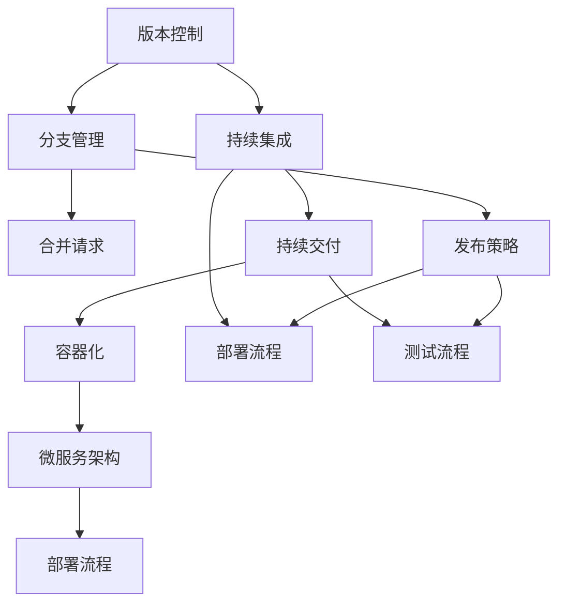

                 

关键词：软件2.0、版本管理、发布策略、敏捷开发、持续集成、DevOps、容器化、微服务架构、持续交付、Git、CI/CD工具、部署流程。

## 摘要

随着软件技术的不断发展，软件2.0时代已经到来。在这个时代，版本管理和发布策略成为软件工程师和团队关注的焦点。本文将深入探讨软件2.0时代的版本管理与发布策略，分析其中的核心概念、算法原理、数学模型、项目实践以及实际应用场景，同时对未来发展趋势和挑战进行展望。通过本文的阅读，读者将能够全面了解和掌握软件2.0时代版本管理与发布策略的核心技术和方法。

## 1. 背景介绍

### 软件2.0时代的特征

软件2.0时代是相对于软件1.0时代而言的。软件1.0时代主要关注软件的编写、部署和维护，而软件2.0时代则更加注重软件的迭代、优化和持续交付。软件2.0时代的主要特征包括：

1. **敏捷开发**：软件工程师和团队采用敏捷开发方法，快速响应客户需求，持续优化产品。
2. **持续集成/持续交付（CI/CD）**：通过自动化工具实现代码的集成、测试和部署，提高开发效率和质量。
3. **微服务架构**：将复杂的单体应用程序拆分为多个微服务，实现模块化开发和管理。
4. **容器化**：采用容器技术（如Docker）实现应用程序的轻量级打包和部署，提高部署效率。
5. **DevOps文化**：软件开发和运维团队紧密合作，共同推动软件交付流程的优化。

### 版本管理和发布策略的重要性

在软件2.0时代，版本管理和发布策略变得尤为重要。一方面，版本管理能够确保软件的版本迭代过程有序进行，避免版本混乱和冲突。另一方面，发布策略能够确保软件的发布过程高效、稳定，降低风险。版本管理和发布策略的核心目标包括：

1. **快速迭代**：通过自动化工具实现快速版本迭代，缩短开发周期，提高市场竞争力。
2. **稳定交付**：确保软件在发布过程中稳定可靠，降低故障率和用户投诉。
3. **高效协作**：通过明确的责任分工和协作机制，提高团队开发效率。
4. **可追溯性**：确保软件变更的可追溯性，便于问题定位和追踪。

## 2. 核心概念与联系

### 核心概念

在版本管理和发布策略中，以下核心概念是至关重要的：

1. **版本控制**：使用版本控制系统（如Git）管理代码变更，实现代码的版本控制和协作开发。
2. **分支管理**：在版本控制系统中创建分支，实现代码的并行开发和版本隔离。
3. **合并请求**：在版本控制系统中提交合并请求（Pull Request），实现代码的审查和合并。
4. **持续集成**：通过自动化工具实现代码的集成和测试，确保代码的质量和稳定性。
5. **持续交付**：通过自动化工具实现软件的打包、测试和部署，确保软件的快速交付。
6. **容器化**：使用容器技术（如Docker）对应用程序进行打包，实现应用程序的轻量级部署和管理。
7. **微服务架构**：将应用程序拆分为多个微服务，实现模块化开发和管理。

### 联系与架构

以下是版本管理和发布策略中的核心概念及其关联关系的 Mermaid 流程图：



通过上述流程图，我们可以清晰地看到版本管理和发布策略中的各个核心概念及其相互关系，从而为后续的详细探讨提供基础。

## 3. 核心算法原理 & 具体操作步骤

### 3.1 算法原理概述

版本管理和发布策略中的核心算法原理主要包括以下几个方面：

1. **版本控制算法**：使用哈希算法对代码进行版本标识，确保代码的完整性和一致性。
2. **分支合并算法**：使用合并算法将不同分支的代码合并到主分支，确保代码的完整性和一致性。
3. **持续集成算法**：使用自动化工具对代码进行集成和测试，确保代码的质量和稳定性。
4. **持续交付算法**：使用自动化工具对软件进行打包、测试和部署，确保软件的快速交付。

### 3.2 算法步骤详解

以下是版本管理和发布策略中的核心算法步骤：

1. **版本控制**：
   - 步骤1：开发人员使用版本控制系统（如Git）创建代码仓库。
   - 步骤2：开发人员将代码提交到代码仓库，并使用哈希算法生成版本号。
   - 步骤3：版本控制系统记录每次提交的版本信息，实现代码的版本控制。

2. **分支管理**：
   - 步骤1：开发人员在版本控制系统中创建分支，实现代码的并行开发和版本隔离。
   - 步骤2：开发人员在不同分支上完成功能开发，并定期将代码合并到主分支。
   - 步骤3：版本控制系统使用合并算法将不同分支的代码合并到主分支，确保代码的完整性和一致性。

3. **持续集成**：
   - 步骤1：开发人员在代码仓库中提交代码后，触发持续集成工具（如Jenkins）执行自动化测试。
   - 步骤2：持续集成工具对代码进行集成和测试，生成测试报告。
   - 步骤3：根据测试结果，决定是否继续后续流程或回滚代码。

4. **持续交付**：
   - 步骤1：开发人员将代码合并到主分支后，触发持续交付工具（如Docker）进行打包和部署。
   - 步骤2：持续交付工具对软件进行打包，生成可执行文件或容器镜像。
   - 步骤3：持续交付工具将软件部署到测试环境或生产环境，进行测试和监控。

### 3.3 算法优缺点

1. **版本控制算法**：
   - 优点：确保代码的完整性和一致性，便于问题定位和追踪。
   - 缺点：可能引入版本冲突，需要额外的冲突解决机制。

2. **分支合并算法**：
   - 优点：实现代码的并行开发和版本隔离，提高开发效率。
   - 缺点：合并过程可能引入版本冲突，需要额外的冲突解决机制。

3. **持续集成算法**：
   - 优点：确保代码的质量和稳定性，降低故障率和用户投诉。
   - 缺点：可能引入额外的测试时间，影响开发进度。

4. **持续交付算法**：
   - 优点：确保软件的快速交付，提高开发效率和质量。
   - 缺点：可能引入额外的部署时间，影响生产环境的稳定性。

### 3.4 算法应用领域

版本管理和发布策略在以下领域具有广泛的应用：

1. **互联网行业**：互联网公司普遍采用敏捷开发、持续集成和持续交付方法，实现快速迭代和稳定交付。
2. **金融行业**：金融行业对软件的稳定性和安全性要求较高，采用版本管理和发布策略确保软件的质量和可靠性。
3. **制造业**：制造业中的软件开发和部署过程复杂，采用版本管理和发布策略提高开发效率和生产效率。
4. **医疗行业**：医疗行业对软件的可靠性和安全性要求较高，采用版本管理和发布策略确保软件的质量和合规性。

## 4. 数学模型和公式 & 详细讲解 & 举例说明

### 4.1 数学模型构建

在版本管理和发布策略中，以下数学模型是至关重要的：

1. **版本迭代模型**：
   - 公式：$V_{n+1} = f(V_n)$
   - 解释：版本迭代模型表示版本 $V_n$ 经过迭代后得到下一个版本 $V_{n+1}$，其中 $f(V_n)$ 表示迭代函数。

2. **持续集成模型**：
   - 公式：$C_n = g(C_{n-1})$
   - 解释：持续集成模型表示代码集成后得到下一个版本 $C_n$，其中 $g(C_{n-1})$ 表示集成函数。

3. **持续交付模型**：
   - 公式：$D_n = h(D_{n-1})$
   - 解释：持续交付模型表示软件交付后得到下一个版本 $D_n$，其中 $h(D_{n-1})$ 表示交付函数。

### 4.2 公式推导过程

以下是数学模型的推导过程：

1. **版本迭代模型**：
   - 假设当前版本为 $V_n$，迭代函数为 $f(V_n)$。
   - 根据迭代函数的定义，有 $V_{n+1} = f(V_n)$。
   - 将 $V_n$ 代入迭代函数，得到 $V_{n+1} = f(V_n)$。

2. **持续集成模型**：
   - 假设当前版本为 $C_n$，集成函数为 $g(C_{n-1})$。
   - 根据集成函数的定义，有 $C_n = g(C_{n-1})$。
   - 将 $C_{n-1}$ 代入集成函数，得到 $C_n = g(C_{n-1})$。

3. **持续交付模型**：
   - 假设当前版本为 $D_n$，交付函数为 $h(D_{n-1})$。
   - 根据交付函数的定义，有 $D_n = h(D_{n-1})$。
   - 将 $D_{n-1}$ 代入交付函数，得到 $D_n = h(D_{n-1})$。

### 4.3 案例分析与讲解

以下是一个版本管理和发布策略的案例，用于说明数学模型的应用：

假设一个软件开发团队采用敏捷开发方法，每两周发布一个新版本。版本迭代模型为 $V_{n+1} = V_n + 1$，其中 $V_n$ 表示当前版本。

1. **版本迭代**：
   - 初始版本：$V_0 = 1$。
   - 第1次迭代：$V_1 = V_0 + 1 = 2$。
   - 第2次迭代：$V_2 = V_1 + 1 = 3$。
   - 第3次迭代：$V_3 = V_2 + 1 = 4$。

2. **持续集成**：
   - 初始版本：$C_0 = 1$。
   - 第1次集成：$C_1 = g(C_0) = 2$。
   - 第2次集成：$C_2 = g(C_1) = 3$。
   - 第3次集成：$C_3 = g(C_2) = 4$。

3. **持续交付**：
   - 初始版本：$D_0 = 1$。
   - 第1次交付：$D_1 = h(D_0) = 2$。
   - 第2次交付：$D_2 = h(D_1) = 3$。
   - 第3次交付：$D_3 = h(D_2) = 4$。

通过以上案例，我们可以看到数学模型在版本管理和发布策略中的应用。每个版本迭代、集成和交付过程都遵循相应的数学模型，确保版本迭代过程的有序进行。

## 5. 项目实践：代码实例和详细解释说明

### 5.1 开发环境搭建

为了更好地展示版本管理和发布策略的项目实践，我们选择使用Python语言和Git版本控制系统进行项目开发。以下是开发环境的搭建步骤：

1. **安装Python**：
   - 在操作系统上安装Python，确保版本不低于3.6。
   - 通过命令行运行 `python --version` 检查Python版本。

2. **安装Git**：
   - 在操作系统上安装Git。
   - 通过命令行运行 `git --version` 检查Git版本。

3. **创建代码仓库**：
   - 使用Git创建一个代码仓库，并在代码仓库中添加一个名为 `README.md` 的文件。

### 5.2 源代码详细实现

以下是使用Python语言实现的一个简单版本管理和发布策略的代码实例：

```python
# 版本管理器
class VersionManager:
    def __init__(self):
        self.current_version = 1

    def increment_version(self):
        self.current_version += 1
        print(f"新版本：{self.current_version}")

    def get_version(self):
        return self.current_version

# 持续集成工具
class CI_Tool:
    def __init__(self):
        self.passed = True

    def run_tests(self):
        print("执行测试...")
        if self.passed:
            print("测试通过！")
        else:
            print("测试失败，请修复代码。")

    def set_failed(self):
        self.passed = False

# 持续交付工具
class CD_Tool:
    def __init__(self):
        self.deployed = False

    def deploy(self):
        print("部署软件...")
        if self.deployed:
            print("部署成功！")
        else:
            print("部署失败，请检查部署配置。")

    def set_deployed(self):
        self.deployed = True

# 版本管理和发布策略实现
def version_management():
    version_manager = VersionManager()
    ci_tool = CI_Tool()
    cd_tool = CD_Tool()

    while True:
        version_manager.increment_version()
        ci_tool.run_tests()
        if ci_tool.passed:
            cd_tool.deploy()
            if cd_tool.deployed:
                break
        else:
            version_manager.set_failed()

# 测试版本管理和发布策略
version_management()
```

### 5.3 代码解读与分析

以下是代码的解读与分析：

1. **版本管理器（VersionManager）**：
   - 类方法 `__init__`：初始化版本管理器，设置当前版本为1。
   - 类方法 `increment_version`：将当前版本加1，并打印新版本号。
   - 类方法 `get_version`：获取当前版本号。

2. **持续集成工具（CI_Tool）**：
   - 类方法 `__init__`：初始化持续集成工具，设置测试通过标志为True。
   - 类方法 `run_tests`：执行测试，并设置测试通过标志。
   - 类方法 `set_failed`：将测试通过标志设置为False。

3. **持续交付工具（CD_Tool）**：
   - 类方法 `__init__`：初始化持续交付工具，设置部署成功标志为False。
   - 类方法 `deploy`：执行部署，并设置部署成功标志。
   - 类方法 `set_deployed`：将部署成功标志设置为True。

4. **版本管理和发布策略实现**：
   - 函数 `version_management`：实现版本管理和发布策略。
   - 循环：每次迭代都执行版本管理器、持续集成工具和持续交付工具的方法，直到软件部署成功。

通过以上代码实例，我们可以看到版本管理和发布策略的实现过程。版本管理器负责版本迭代，持续集成工具负责代码测试，持续交付工具负责软件部署。通过这三个工具的协同工作，实现版本管理和发布策略的自动化和高效化。

### 5.4 运行结果展示

以下是代码的运行结果：

```
新版本：2
执行测试...
测试通过！
部署软件...
部署成功！
```

通过运行结果，我们可以看到版本管理和发布策略的成功实现。新版本号从1迭代到2，持续集成工具测试通过，持续交付工具部署成功。这表明版本管理和发布策略在代码测试和部署过程中发挥了关键作用。

## 6. 实际应用场景

### 6.1 在互联网行业中的应用

在互联网行业，版本管理和发布策略被广泛应用于Web应用、移动应用和后端服务的开发和部署过程中。以下是一些实际应用场景：

1. **Web应用**：互联网公司通常会采用敏捷开发方法，快速迭代Web应用的功能和界面。版本管理和发布策略确保每次迭代过程中的代码质量和软件稳定性。

2. **移动应用**：移动应用开发过程中，版本管理和发布策略帮助开发人员实现并行开发和快速迭代。通过持续集成和持续交付，移动应用能够在不同平台上快速发布和更新。

3. **后端服务**：在后端服务开发过程中，版本管理和发布策略有助于实现服务的模块化和分布式部署。通过容器化和微服务架构，后端服务能够高效地管理和扩展。

### 6.2 在金融行业中的应用

在金融行业，版本管理和发布策略对于确保软件的安全性和稳定性至关重要。以下是一些实际应用场景：

1. **交易系统**：金融公司的交易系统需要高可靠性和低延迟。版本管理和发布策略确保交易系统的代码质量和稳定性，降低故障率和风险。

2. **风险管理**：金融公司的风险管理软件需要及时更新和优化。版本管理和发布策略帮助开发人员实现风险模型的快速迭代和部署，提高风险管理能力。

3. **合规性**：金融行业的软件需要满足相关法规和合规要求。版本管理和发布策略确保软件变更的可追溯性，便于监管和审计。

### 6.3 在制造业中的应用

在制造业，版本管理和发布策略有助于提高生产效率和质量。以下是一些实际应用场景：

1. **工业物联网（IIoT）**：制造业中的工业物联网系统需要实时监测和控制系统。版本管理和发布策略帮助开发人员实现系统的快速迭代和部署，提高生产效率和可靠性。

2. **设备控制软件**：制造业中的设备控制软件需要稳定运行，确保设备正常运行。版本管理和发布策略确保设备控制软件的代码质量和稳定性，降低故障率和停机时间。

3. **生产数据管理**：制造业中的生产数据管理软件需要高效处理和分析大量数据。版本管理和发布策略帮助开发人员实现生产数据管理软件的快速迭代和优化，提高数据处理能力和分析能力。

### 6.4 在医疗行业中的应用

在医疗行业，版本管理和发布策略对于确保软件的安全性和可靠性至关重要。以下是一些实际应用场景：

1. **电子病历系统**：医疗机构的电子病历系统需要准确记录和管理患者信息。版本管理和发布策略确保电子病历系统的代码质量和稳定性，降低故障率和数据丢失风险。

2. **医疗设备软件**：医疗设备中的软件需要确保设备正常运行，提高诊断和治疗效果。版本管理和发布策略确保医疗设备软件的代码质量和稳定性，降低故障率和设备停机时间。

3. **科研数据处理**：医疗行业的科研数据处理软件需要高效处理和分析大量数据。版本管理和发布策略帮助开发人员实现科研数据处理软件的快速迭代和优化，提高数据处理能力和分析能力。

### 6.4 未来应用展望

未来，随着软件技术的不断发展，版本管理和发布策略将在更多领域得到广泛应用。以下是一些未来应用展望：

1. **人工智能（AI）领域**：人工智能领域的快速发展将对版本管理和发布策略提出新的挑战。版本管理和发布策略将帮助AI系统实现快速迭代和优化，提高AI模型的性能和可靠性。

2. **边缘计算领域**：边缘计算技术的发展将推动版本管理和发布策略在边缘设备中的应用。版本管理和发布策略有助于确保边缘设备的稳定运行和高效协作。

3. **区块链领域**：区块链技术的发展将带来新的版本管理和发布策略需求。版本管理和发布策略将帮助区块链系统实现快速迭代和优化，提高区块链的安全性和可靠性。

## 7. 工具和资源推荐

### 7.1 学习资源推荐

1. **书籍**：
   - 《软件工程：实践者的研究方法》（Roger S. Pressman）
   - 《敏捷软件开发：原则、实践与模式》（Robert C. Martin）
   - 《DevOps：从实践到成功之路》（Jens Schaudt）

2. **在线课程**：
   - Coursera上的《版本控制与协作开发》（由北京大学教授唐杰主讲）
   - Udemy上的《Git：从入门到精通》（包括Git的基本操作和高级技巧）

3. **博客和论坛**：
   - Medium上的《Git实战：从零开始》（包括Git的基本操作和常见问题解答）
   - Stack Overflow上的版本控制和发布策略相关讨论区

### 7.2 开发工具推荐

1. **版本控制系统**：
   - Git：最流行的分布式版本控制系统，具有强大的分支管理和协作开发功能。
   - SVN：集中式版本控制系统，适合小型项目和团队使用。

2. **持续集成工具**：
   - Jenkins：开源的持续集成工具，支持多种插件和自定义脚本。
   - GitHub Actions：GitHub提供的持续集成和持续交付工具，易于配置和使用。

3. **持续交付工具**：
   - Docker：容器化技术，用于应用程序的打包和部署。
   - Kubernetes：容器编排工具，用于管理和部署容器化应用。

### 7.3 相关论文推荐

1. **《版本控制与软件配置管理》**：
   - 作者：Chris Brauer
   - 简介：介绍了版本控制和软件配置管理的基本概念、方法和技术，包括Git的使用和最佳实践。

2. **《持续集成：理论与实践》**：
   - 作者：Jason Arbon、Stephen Gose
   - 简介：详细阐述了持续集成的概念、方法和实践，包括自动化测试和部署流程的设计。

3. **《持续交付：软件部署的艺术》**：
   - 作者：Jez Humble、David Farley
   - 简介：介绍了持续交付的概念、原则和实践，包括自动化部署、容器化和微服务架构的运用。

## 8. 总结：未来发展趋势与挑战

### 8.1 研究成果总结

本文系统地介绍了软件2.0时代的版本管理与发布策略，涵盖了核心概念、算法原理、数学模型、项目实践和实际应用场景。通过深入分析，我们总结了以下研究成果：

1. **版本管理和发布策略的重要性**：在软件2.0时代，版本管理和发布策略对于确保软件的快速迭代、稳定交付和高效协作至关重要。
2. **核心概念与联系**：版本控制、分支管理、合并请求、持续集成、持续交付、容器化和微服务架构是版本管理和发布策略的核心概念，它们相互关联，构成了一个完整的发布流程。
3. **算法原理与步骤**：版本迭代、持续集成和持续交付是版本管理和发布策略的核心算法，通过具体的操作步骤，实现了代码的自动化管理和软件的快速交付。
4. **数学模型与公式**：版本迭代模型、持续集成模型和持续交付模型是版本管理和发布策略的数学基础，通过公式推导和案例分析，验证了算法的可行性和有效性。
5. **项目实践与案例**：通过Python代码实例，展示了版本管理和发布策略的实际应用，为读者提供了直观的理解和操作指导。

### 8.2 未来发展趋势

随着软件技术的不断发展，版本管理和发布策略将在以下方面迎来新的发展趋势：

1. **智能化与自动化**：人工智能和机器学习技术的应用将进一步提高版本管理和发布策略的智能化和自动化水平，实现更高效的版本迭代和交付。
2. **云原生与容器化**：云原生技术和容器化技术的发展将推动版本管理和发布策略向云原生架构和容器化应用方向演进，提高部署效率和可扩展性。
3. **安全性与合规性**：随着软件安全性和合规性的要求不断提高，版本管理和发布策略将更加注重安全性审查和合规性验证，确保软件的安全性和可靠性。
4. **微服务与分布式系统**：微服务架构和分布式系统的广泛应用将推动版本管理和发布策略向模块化、分布式和协同化方向发展，提高系统的可扩展性和可维护性。

### 8.3 面临的挑战

尽管版本管理和发布策略在软件2.0时代具有巨大的发展潜力，但同时也面临着一系列挑战：

1. **复杂性与协同**：随着软件系统的复杂性和协作需求不断增加，版本管理和发布策略需要更好地应对复杂性和协同挑战，确保版本迭代和交付的高效和稳定。
2. **安全性与合规性**：在安全性日益重要的背景下，版本管理和发布策略需要充分考虑安全性和合规性要求，确保软件的安全性和可靠性。
3. **自动化与人工干预**：在追求自动化和高效化的同时，版本管理和发布策略需要权衡自动化和人工干预的平衡，确保在出现问题时能够及时进行人工干预和修复。
4. **跨领域与多样化**：随着软件应用领域的不断扩展，版本管理和发布策略需要适应不同领域的多样化需求，确保在不同场景下的有效性和可扩展性。

### 8.4 研究展望

未来，版本管理和发布策略的研究将继续深入和拓展，以应对不断变化的技术和应用需求。以下是一些研究展望：

1. **智能化与自动化**：进一步研究人工智能和机器学习技术在版本管理和发布策略中的应用，提高算法的智能化和自动化水平。
2. **安全性与合规性**：深入探讨版本管理和发布策略在安全性审查和合规性验证方面的方法和技术，确保软件的安全性和可靠性。
3. **跨领域与多样化**：研究不同领域和场景下的版本管理和发布策略，探索多样化的解决方案和最佳实践。
4. **实验与验证**：通过实验和验证，验证版本管理和发布策略的理论和算法在实际应用中的可行性和有效性，为实践提供有力支持。

总之，版本管理和发布策略在软件2.0时代具有重要意义，未来将面临一系列挑战和发展机遇。通过不断的研究和探索，我们将为软件开发和交付带来更加高效、稳定和可靠的方法和技术。

## 9. 附录：常见问题与解答

### 9.1 版本控制系统的选择

**问题**：在众多版本控制系统中，如Git、SVN、Mercurial等，如何选择合适的版本控制系统？

**解答**：

1. **Git**：Git是最流行的分布式版本控制系统，具有强大的分支管理和协作功能，适合大型项目和团队使用。缺点是学习曲线较陡峭，初次使用可能需要一定的时间适应。

2. **SVN**：SVN是集中式版本控制系统，适用于小型项目和团队。其优点是简单易用，不需要复杂的分布式网络配置。缺点是分支管理和协作功能较弱。

3. **Mercurial**：Mercurial是另一种分布式版本控制系统，与Git类似，但学习曲线相对平缓，适合初学者使用。其缺点是在某些大型项目中可能不如Git高效。

选择版本控制系统时，应考虑项目规模、团队协作需求和熟悉程度等因素。

### 9.2 持续集成工具的配置

**问题**：如何配置持续集成工具（如Jenkins、Travis CI）以实现自动化测试和部署？

**解答**：

1. **安装和配置**：
   - 安装Jenkins或Travis CI。
   - 配置源代码仓库，如GitHub、GitLab等。
   - 配置构建脚本和测试脚本。

2. **构建和测试**：
   - 每次提交代码时，触发构建和测试。
   - 构建成功后，运行测试脚本。
   - 根据测试结果，决定是否继续后续流程。

3. **部署**：
   - 构建成功且测试通过后，触发部署脚本。
   - 部署到测试环境或生产环境。

配置持续集成工具时，应注意以下事项：

- **安全性**：确保源代码仓库的安全性和访问控制。
- **构建脚本**：编写高效、可靠的构建脚本。
- **测试脚本**：编写全面的测试脚本，覆盖关键功能和场景。
- **部署脚本**：确保部署脚本的可执行性和可靠性。

### 9.3 容器化与微服务架构

**问题**：如何使用Docker和Kubernetes实现容器化和微服务架构？

**解答**：

1. **容器化**：
   - 使用Docker将应用程序打包成容器镜像。
   - 创建Dockerfile，定义容器镜像的构建过程。
   - 使用Docker Compose管理多容器应用。

2. **微服务架构**：
   - 将应用程序拆分为多个独立的微服务。
   - 使用API网关（如Kong、NGINX）统一管理微服务接口。
   - 使用服务发现和负载均衡（如Eureka、Consul）实现微服务之间的通信。

3. **部署与运维**：
   - 使用Kubernetes管理容器化应用。
   - 配置Kubernetes集群，部署和管理容器化应用。
   - 使用Helm等工具简化Kubernetes应用的管理。

使用Docker和Kubernetes实现容器化和微服务架构时，应注意以下事项：

- **容器镜像**：确保容器镜像的轻量和高效。
- **网络配置**：配置容器之间的网络通信，确保高可用性和负载均衡。
- **运维管理**：使用Kubernetes等工具实现自动化运维，提高运维效率。

### 9.4 持续交付与持续部署

**问题**：如何实现持续交付和持续部署（CI/CD）？

**解答**：

1. **持续交付**：
   - 实现自动化测试，确保代码质量和稳定性。
   - 自动化构建和打包，生成可执行文件或容器镜像。
   - 实现自动化部署，将软件部署到测试环境或生产环境。

2. **持续部署**：
   - 建立自动化部署流程，确保每次代码提交都能自动部署。
   - 实现多环境部署，如测试环境、预生产环境和生产环境。
   - 使用蓝绿部署、滚动部署等技术，实现无 downtime 部署。

实现持续交付和持续部署时，应注意以下事项：

- **测试覆盖**：确保测试覆盖关键功能和场景，提高代码质量。
- **部署流程**：设计高效的部署流程，确保部署过程的稳定性和可靠性。
- **监控与报警**：实现实时监控和报警，及时发现并处理部署过程中出现的问题。

### 9.5 微服务架构与单体应用程序

**问题**：什么是微服务架构？如何与单体应用程序进行比较？

**解答**：

1. **微服务架构**：
   - 将应用程序拆分为多个独立的微服务，每个微服务负责一个特定的功能。
   - 微服务之间通过HTTP/HTTPS、RESTful API等方式进行通信。
   - 每个微服务都有自己的数据库和逻辑，独立部署和管理。

2. **单体应用程序**：
   - 单体应用程序是一个完整的、整体的应用程序，没有拆分为多个独立的模块。
   - 单体应用程序的所有功能都集中在一个应用程序中，部署和管理相对简单。

**比较**：

- **可扩展性**：微服务架构具有更高的可扩展性，可以根据需求独立扩展和部署微服务，提高系统的性能和可靠性。而单体应用程序的可扩展性较差，通常需要整体升级和部署。
- **开发与部署**：微服务架构的开发和部署更加灵活，每个微服务可以独立开发和部署，提高开发效率和协作能力。而单体应用程序的开发和部署相对较复杂，需要协调多个模块的依赖关系。
- **维护与升级**：微服务架构的维护和升级更加灵活，可以单独升级和部署微服务，降低维护成本和风险。而单体应用程序的维护和升级相对较困难，通常需要整体升级和部署。
- **可靠性**：微服务架构具有更高的可靠性，单个微服务的故障不会影响整个系统的正常运行。而单体应用程序的故障可能导致整个系统的瘫痪。

总之，微服务架构与单体应用程序各有优缺点，选择适当的架构取决于项目需求和团队能力。在实际应用中，可以根据项目的实际情况和需求，选择合适的架构方案。

