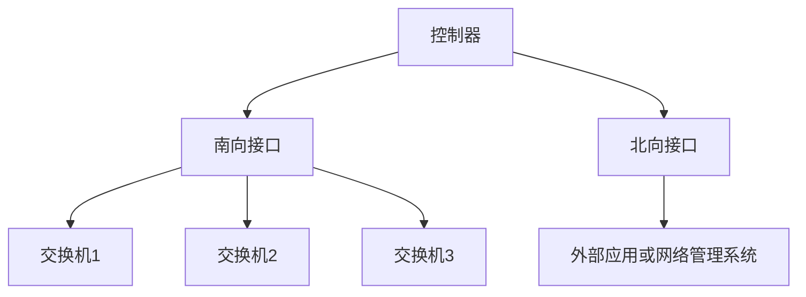

                 

关键词：软件定义网络（SDN），网络架构，网络控制平面，网络数据平面，集中式控制，分布式控制，OpenFlow，Open Networking Foundation（ONF）

> 摘要：软件定义网络（SDN）作为网络架构的一次重大革新，通过将网络控制平面与数据平面分离，实现了网络的灵活配置和动态管理。本文将深入探讨SDN的核心概念、架构原理、算法原理以及其在实际应用中的具体实现，旨在为读者提供全面而系统的了解。

## 1. 背景介绍

在传统的网络架构中，网络的控制平面（Control Plane）和数据平面（Data Plane）是紧密耦合在一起的。控制平面负责路由决策和流量管理，而数据平面则根据控制平面的指令进行数据包的转发。这种紧密耦合的架构导致了网络的可编程性和灵活性受限，难以适应快速变化的应用需求。

随着云计算、大数据和物联网等技术的快速发展，网络的需求变得越来越复杂。传统的网络架构已经无法满足这些新兴应用的需求，需要一种更加灵活和可扩展的网络架构。软件定义网络（SDN）正是在这种背景下应运而生。

SDN通过将网络的控制平面与数据平面分离，实现了网络的可编程性和灵活性。控制平面由集中的控制器（Controller）管理，而数据平面则由分散的交换机（Switch）或接入点（Access Point）组成。控制器通过南向接口与交换机通信，下发控制策略和路由信息，而交换机则通过北向接口与外部应用或网络管理系统通信。

## 2. 核心概念与联系

### 2.1 核心概念

- **控制平面（Control Plane）**：负责路由决策、流量控制和网络管理等任务。在SDN中，控制平面由集中的控制器管理，实现了网络的可编程性。

- **数据平面（Data Plane）**：负责数据包的接收、转发和发送。在SDN中，数据平面由分散的交换机或接入点组成，根据控制器的指令进行数据包的转发。

- **控制器（Controller）**：负责整个SDN网络的集中式控制。控制器通过南向接口与交换机通信，下发控制策略和路由信息。

- **交换机（Switch）**：负责数据包的转发和流量管理。交换机通过北向接口与外部应用或网络管理系统通信，接受控制器的指令。

- **南向接口（Southbound Interface）**：控制器与交换机之间的接口，用于下发控制策略和路由信息。

- **北向接口（Northbound Interface）**：交换机与外部应用或网络管理系统之间的接口，用于接收外部指令和反馈网络状态。

### 2.2 架构原理

SDN的架构原理主要包括以下几个方面：

1. **控制平面与数据平面分离**：SDN通过将控制平面与数据平面分离，实现了网络的可编程性和灵活性。控制器负责路由决策和流量控制，而交换机则负责数据包的转发。

2. **集中式控制**：控制器作为整个SDN网络的集中式控制实体，通过南向接口与交换机通信，下发控制策略和路由信息。集中式控制使得网络的管理和配置更加高效和灵活。

3. **分布式数据平面**：数据平面由分散的交换机或接入点组成，每个交换机都可以独立处理数据包的转发。这种分布式架构提高了网络的可靠性和可扩展性。

4. **南向接口与北向接口**：南向接口用于控制器与交换机之间的通信，而北向接口用于交换机与外部应用或网络管理系统之间的通信。南向接口和北向接口的设计使得SDN可以与各种外部应用和系统进行集成。

### 2.3 Mermaid 流程图

以下是SDN架构原理的Mermaid流程图：



## 3. 核心算法原理 & 具体操作步骤

### 3.1 算法原理概述

SDN的核心算法主要涉及控制器的路由决策和交换机的数据包转发。控制器的路由决策算法负责根据网络状态和流量需求选择最佳路径，而交换机的数据包转发算法则根据控制器的指令进行数据包的转发。

### 3.2 算法步骤详解

1. **控制器的路由决策算法**：

   - 控制器首先收集网络状态信息，包括带宽、延迟、丢包率等指标。

   - 控制器根据网络状态信息计算每个路径的权重，选择最佳路径。

   - 控制器将路由信息下发到对应的交换机。

2. **交换机的数据包转发算法**：

   - 交换机接收到数据包后，先检查数据包的目的地址。

   - 交换机根据控制器的指令查找最佳转发路径，并将数据包转发到对应的端口。

### 3.3 算法优缺点

1. **优点**：

   - **灵活性**：SDN通过控制平面与数据平面的分离，实现了网络的可编程性和灵活性。

   - **可扩展性**：SDN的分布式架构提高了网络的可靠性和可扩展性。

   - **高效性**：控制器集中管理网络，降低了网络管理的复杂度和开销。

2. **缺点**：

   - **性能瓶颈**：控制器的集中式控制可能导致性能瓶颈，需要高可用性和容错性的设计。

   - **安全性**：SDN网络的控制平面与数据平面分离，增加了网络攻击的潜在风险。

### 3.4 算法应用领域

SDN在多个领域具有广泛的应用，包括：

- **数据中心网络**：SDN可以提高数据中心网络的灵活性和可扩展性，实现网络资源的动态调度。

- **无线网络**：SDN可以优化无线网络的覆盖范围和带宽利用率，提高用户体验。

- **物联网网络**：SDN可以实现对大量物联网设备的集中管理和动态配置。

## 4. 数学模型和公式 & 详细讲解 & 举例说明

### 4.1 数学模型构建

SDN的数学模型主要涉及网络状态信息的收集、路由决策算法的设计以及数据包转发的算法。

### 4.2 公式推导过程

1. **网络状态信息收集**：

   - 带宽（Bandwidth）：$$B = \sum_{i=1}^{n} \frac{C_i}{L_i}$$

   - 延迟（Delay）：$$D = \sum_{i=1}^{n} \frac{L_i}{C_i}$$

   - 丢包率（Packet Loss Rate）：$$L = \frac{P_{loss}}{P_{total}}$$

2. **路由决策算法**：

   - 权重计算：$$W = \frac{B}{D} + L$$

   - 最佳路径选择：$$P_{best} = \arg\max_{i} W_i$$

3. **数据包转发算法**：

   - 转发路径选择：$$P_{forward} = \arg\min_{i} \frac{L_i}{C_i}$$

### 4.3 案例分析与讲解

假设有一个包含3个交换机的网络，交换机1连接了10台主机，交换机2连接了5台主机，交换机3连接了15台主机。我们需要根据网络状态信息计算最佳路由并实现数据包的转发。

1. **网络状态信息收集**：

   - 交换机1的带宽：$$B_1 = 100 Mbps$$，延迟：$$D_1 = 10 ms$$，丢包率：$$L_1 = 0.01$$

   - 交换机2的带宽：$$B_2 = 50 Mbps$$，延迟：$$D_2 = 20 ms$$，丢包率：$$L_2 = 0.02$$

   - 交换机3的带宽：$$B_3 = 200 Mbps$$，延迟：$$D_3 = 30 ms$$，丢包率：$$L_3 = 0.03$$

2. **路由决策算法**：

   - 权重计算：$$W_1 = \frac{100}{10} + 0.01 = 10.01$$

   - 权重计算：$$W_2 = \frac{50}{20} + 0.02 = 2.7$$

   - 权重计算：$$W_3 = \frac{200}{30} + 0.03 = 6.73$$

   - 最佳路径选择：$$P_{best} = \arg\max_{i} W_i = 3$$

3. **数据包转发算法**：

   - 转发路径选择：$$P_{forward} = \arg\min_{i} \frac{L_i}{C_i} = 2$$

   - 交换机1将数据包转发到交换机2，交换机2将数据包转发到交换机3，最终数据包到达目标主机。

## 5. 项目实践：代码实例和详细解释说明

### 5.1 开发环境搭建

在本项目中，我们将使用Python编程语言和OpenFlow协议实现一个简单的SDN网络。以下为开发环境搭建步骤：

1. 安装Python：从官方网站下载并安装Python。

2. 安装OpenFlow库：在终端中运行以下命令安装OpenFlow库：

   ```bash
   pip install ryu
   ```

3. 配置交换机：将交换机连接到计算机，并使用PuTTY或其他SSH客户端连接交换机。将交换机配置为OpenFlow交换机，并设置控制器的IP地址和端口号。

### 5.2 源代码详细实现

以下是一个简单的SDN网络示例代码：

```python
from ryu.base import AppEngineBase
from ryu.controller import ofp_event
from ryu.controller.handler import ConfigHandler, SET
from ryu.ofproto import ofproto_v1_3
from ryu.ofproto import ofproto_v1_3_parser
from ryu.ofproto import ofproto_v1_3_parser
from ryu.lib import dpid as dpid_lib

class SimpleSDNApp(AppEngineBase):
    def __init__(self, *args, **kwargs):
        super(SimpleSDNApp, self).__init__(*args, **kwargs)
        self.register_handler(ConfigHandler)
        self.register_handler(
            ofp_event.EventOFPSwitchFeatures,
            SET,
            self.handle_switch_features,
        )

    @staticmethod
    def handle_switch_features(ev):
        dp = ev.msg.datapath
        ofproto = dp.ofproto
        parser = dp.ofproto_parser
        dp.send_packet_out(
            ofproto.OFP_COMMAND_EX,
            in_port=ofproto.OFPP_CONTROLLER,
            actions=[parser.OFPActionOutput(ofproto.OFPP_FLOOD)],
            out_group=ofproto.OFPG_ANY,
        )

def launch():
    from ryu.app import manager
    manager.start(SimpleSDNApp)

if __name__ == "__main__":
    launch()
```

### 5.3 代码解读与分析

该代码实现了一个简单的SDN应用，主要包含以下几个部分：

1. **类定义**：定义了一个名为`SimpleSDNApp`的类，继承自`AppEngineBase`类。该类实现了SDN应用的主体功能。

2. **初始化**：在`__init__`方法中，注册了配置处理器（`ConfigHandler`）和事件处理器（`handle_switch_features`）。配置处理器用于处理交换机特征消息，事件处理器用于处理交换机事件。

3. **事件处理**：在`handle_switch_features`方法中，接收到交换机特征消息后，发送一个`OFPCommandEx`消息，将数据包转发到控制器的端口。

4. **启动**：在`launch`函数中，启动了SDN应用，并使用`manager`模块启动应用。

### 5.4 运行结果展示

运行该代码后，交换机将接收到来自控制器的指令，将数据包转发到控制器的端口。可以使用Wireshark等网络抓包工具观察数据包的转发过程。

## 6. 实际应用场景

### 6.1 数据中心网络

数据中心网络是SDN最早和最广泛的应用场景之一。SDN可以优化数据中心网络的资源分配和流量管理，提高网络的性能和可靠性。通过SDN，数据中心可以实现虚拟机迁移时的网络自动调整，确保虚拟机在迁移过程中不受网络中断的影响。

### 6.2 无线网络

无线网络中的SDN应用包括无线局域网（WLAN）和蜂窝网络。SDN可以优化无线网络的覆盖范围和带宽利用率，提高用户体验。例如，在WLAN中，SDN可以动态调整无线接入点的功率和信道，优化无线信号的覆盖范围和干扰。

### 6.3 物联网网络

物联网网络中的SDN应用包括智能家居网络、工业物联网和智能交通网络等。SDN可以实现对大量物联网设备的集中管理和动态配置，提高网络的可扩展性和灵活性。例如，在智能交通网络中，SDN可以实时调整交通信号灯的时序，优化交通流量。

## 6.4 未来应用展望

随着SDN技术的不断发展和成熟，未来将在更多领域得到广泛应用。以下是一些未来应用展望：

- **边缘计算**：SDN可以与边缘计算相结合，优化边缘网络的资源分配和流量管理，提高边缘计算的效率和性能。

- **自动驾驶**：SDN可以与自动驾驶技术相结合，实现自动驾驶车辆之间的实时通信和协同控制，提高道路安全和交通效率。

- **5G网络**：SDN可以与5G网络相结合，实现网络切片和动态资源分配，提高5G网络的性能和可靠性。

## 7. 工具和资源推荐

### 7.1 学习资源推荐

- **书籍**：

  - 《软件定义网络（SDN）：原理与实践》

  - 《OpenFlow实战：构建软件定义网络》

- **在线课程**：

  - Coursera上的“Software Defined Networking (SDN)”课程

  - edX上的“SDN: Controller and Switch Design”课程

### 7.2 开发工具推荐

- **Ryu**：一个基于OpenFlow的SDN控制器框架，适用于开发SDN应用。

- **Mininet**：一个虚拟网络仿真平台，用于测试和验证SDN应用。

### 7.3 相关论文推荐

- **《A Scalable Control Plane for SDN-Based Data Centers》**：讨论了SDN数据中心控制平面的可扩展性问题。

- **《Software-Defined WANs: An Overview》**：介绍了软件定义广域网的架构和应用。

## 8. 总结：未来发展趋势与挑战

### 8.1 研究成果总结

SDN作为一种新型的网络架构，已经在多个领域得到广泛应用。通过将控制平面与数据平面分离，SDN实现了网络的可编程性和灵活性。在数据中心网络、无线网络和物联网网络等领域，SDN的应用取得了显著的效果。

### 8.2 未来发展趋势

未来，SDN将在以下方面得到进一步发展：

- **高性能和可扩展性**：随着网络规模的不断扩大，SDN需要提高性能和可扩展性，以应对更复杂的网络环境。

- **安全性和可靠性**：SDN网络的控制平面与数据平面分离，增加了网络攻击的潜在风险。未来需要加强对SDN网络的安全性和可靠性的研究。

- **跨域协同**：未来SDN将与其他网络技术（如5G、边缘计算等）相结合，实现跨域协同，提高网络的性能和可靠性。

### 8.3 面临的挑战

SDN在发展过程中也面临着一些挑战：

- **性能瓶颈**：控制器的集中式控制可能导致性能瓶颈，需要高可用性和容错性的设计。

- **安全性**：SDN网络的控制平面与数据平面分离，增加了网络攻击的潜在风险。

- **标准化**：SDN的标准化工作仍需进一步完善，以推动SDN技术的广泛应用。

### 8.4 研究展望

未来，SDN的研究将重点关注以下几个方面：

- **高性能控制算法**：研究更高效的控制算法，提高SDN网络的性能和可扩展性。

- **安全性和隐私保护**：研究SDN网络的安全性和隐私保护技术，提高网络的安全性。

- **跨域协同**：研究SDN与其他网络技术的结合，实现跨域协同，提高网络的性能和可靠性。

## 9. 附录：常见问题与解答

### 9.1 如何搭建SDN网络？

搭建SDN网络主要包括以下步骤：

1. **选择控制器**：选择一个适合自己需求的SDN控制器，如Ryu、Floodlight等。

2. **配置交换机**：将交换机配置为OpenFlow交换机，并设置控制器的IP地址和端口号。

3. **编写SDN应用**：编写SDN应用，实现网络控制逻辑。

4. **启动控制器和交换机**：启动控制器和交换机，使SDN网络运行。

### 9.2 如何编写SDN应用？

编写SDN应用主要包括以下步骤：

1. **选择编程语言**：选择一个适合自己需求的编程语言，如Python、Java等。

2. **引入SDN库**：引入SDN库，如Ryu、Floodlight等。

3. **编写应用代码**：编写应用代码，实现网络控制逻辑。

4. **启动应用**：启动应用，使SDN应用运行。

### 9.3 如何优化SDN网络性能？

优化SDN网络性能主要包括以下方法：

1. **提高控制器的性能**：提高控制器的处理能力和吞吐量。

2. **优化数据平面算法**：优化交换机的数据包转发算法，提高转发效率。

3. **分布式控制**：采用分布式控制架构，提高网络的可扩展性和性能。

4. **负载均衡**：在控制器和交换机之间实现负载均衡，提高网络性能。

### 9.4 如何保障SDN网络的安全性？

保障SDN网络的安全性主要包括以下方法：

1. **加密通信**：使用加密技术保障控制器与交换机之间的通信安全。

2. **访问控制**：对控制器和交换机的访问进行严格的访问控制，防止未授权访问。

3. **安全审计**：定期进行安全审计，发现和修复潜在的安全漏洞。

4. **安全监测**：实时监测SDN网络的安全事件，及时响应和处理。

---

本文详细介绍了软件定义网络（SDN）的核心概念、架构原理、算法原理以及实际应用场景。通过本文，读者可以对SDN有一个全面而系统的了解。随着SDN技术的不断发展和成熟，未来将在更多领域得到广泛应用，为网络技术的发展注入新的活力。作者：禅与计算机程序设计艺术 / Zen and the Art of Computer Programming
----------------------------------------------------------------

以上完成了对《软件定义网络（SDN）：网络架构的革新》这篇文章的撰写，希望对您有所帮助。如果您有任何问题或需要进一步的讨论，请随时告诉我。祝您阅读愉快！作者：禅与计算机程序设计艺术 / Zen and the Art of Computer Programming。

