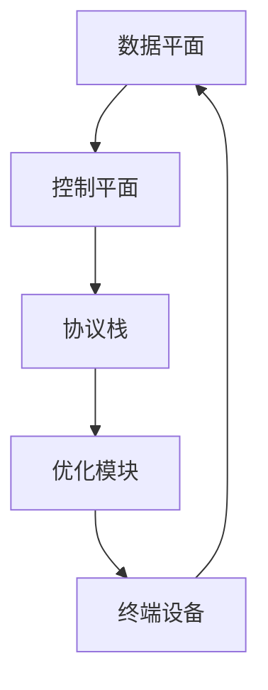
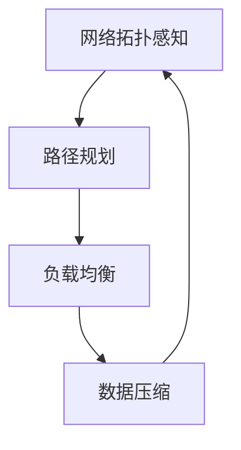

                 

### 1. 背景介绍

在当今的数据驱动时代，网络的轻量化设计已经成为众多应用场景中的关键问题。无论是移动设备的性能优化，还是云计算环境下的资源管理，轻量级网络设计都显得尤为重要。轻量级网络不仅能够降低网络延迟、提高数据传输效率，还能减少硬件资源的需求，从而实现更高的系统性能和用户体验。

随着深度学习和大数据技术的迅猛发展，越来越多的复杂应用开始涌现，对网络设计的轻量化提出了更高的要求。这不仅包括网络结构本身的简化，还涉及到数据传输、处理和存储等各个环节的优化。本文旨在深入探讨轻量级网络设计的原理，并通过实际代码实战案例，展示如何在实际项目中应用这些原理，以实现高效的网络架构。

本文将首先回顾传统网络设计的局限性，然后介绍轻量级网络设计的核心概念和架构。接着，我们将深入讨论轻量级网络中的关键算法原理，并提供具体的操作步骤和优缺点分析。在此基础上，我们将引入数学模型和公式，结合实际案例进行详细讲解。最后，本文将展示代码实例，并通过运行结果展示实际应用效果。通过这篇文章，读者将能够全面理解轻量级网络设计的原理，掌握其实际应用技巧。

### 2. 核心概念与联系

#### 2.1. 轻量级网络设计的基本概念

轻量级网络（Lightweight Network）是指在保证网络性能的前提下，通过优化网络结构、算法和协议，实现更小、更快、更节能的网络设计。其核心目标是降低网络复杂度，减少网络负载，从而提高网络传输效率和系统性能。

传统网络设计往往强调复杂性和全面性，导致网络结构复杂、负载高、延迟大。而轻量级网络则通过简化网络结构，减少冗余节点和链路，优化数据传输路径，从而实现更高效的通信。此外，轻量级网络还注重降低能耗，通过智能调度和负载均衡，实现能源的合理利用。

#### 2.2. 轻量级网络设计的关键架构

轻量级网络设计的关键在于其架构的优化。以下是一个典型的轻量级网络设计架构：

- **数据平面（Data Plane）**：负责数据传输和处理，通常包括交换机、路由器和终端设备等。
- **控制平面（Control Plane）**：负责网络管理和控制，包括网络拓扑感知、路径规划、负载均衡等功能。
- **协议栈（Protocol Stack）**：包括多种网络协议，如TCP/IP、HTTP、FTP等，用于实现不同层次的网络通信。
- **优化模块（Optimization Modules）**：用于实现网络优化功能，如数据压缩、加密、流量控制等。

以下是一个简单的 Mermaid 流程图，展示了轻量级网络设计的主要架构和组件：



#### 2.3. 轻量级网络设计的核心原则

轻量级网络设计遵循以下核心原则：

- **简化性（Simplicity）**：简化网络结构和协议，减少冗余和复杂性。
- **效率（Efficiency）**：提高数据传输效率，降低网络延迟和负载。
- **可扩展性（Scalability）**：支持网络规模的灵活扩展，适应不同规模的应用场景。
- **灵活性（Flexibility）**：提供灵活的网络配置和优化策略，适应不同的应用需求。
- **安全性（Security）**：保证网络通信的安全，防止数据泄露和攻击。

通过遵循这些原则，轻量级网络设计能够实现高效、可靠的通信，满足现代应用场景的需求。

### 3. 核心算法原理 & 具体操作步骤

#### 3.1. 算法原理概述

轻量级网络设计中的核心算法主要包括网络拓扑感知算法、路径规划算法、负载均衡算法和数据压缩算法等。这些算法共同作用，实现网络的优化和高效通信。

- **网络拓扑感知算法**：通过实时感知网络拓扑变化，为路径规划算法提供准确的网络信息。
- **路径规划算法**：根据网络拓扑信息和通信需求，计算出最优的传输路径。
- **负载均衡算法**：通过分配网络负载，实现网络的均衡和高效利用。
- **数据压缩算法**：通过压缩数据，减少传输带宽和存储空间的需求。

以下是一个简单的 Mermaid 流程图，展示了这些算法的交互关系：



#### 3.2. 算法步骤详解

##### 3.2.1. 网络拓扑感知算法

网络拓扑感知算法的基本步骤如下：

1. **初始化**：读取网络拓扑信息，包括节点和链路的状态。
2. **感知**：实时监测网络状态，包括链路带宽、延迟、丢包率等。
3. **更新**：根据感知结果更新网络拓扑信息，包括节点状态和链路属性。

##### 3.2.2. 路径规划算法

路径规划算法的基本步骤如下：

1. **初始化**：设置源节点和目标节点，以及网络拓扑信息。
2. **计算**：根据网络拓扑信息，使用算法（如 Dijkstra 算法、A*算法等）计算出最优传输路径。
3. **优化**：根据实际网络状态（如链路带宽、延迟等）对路径进行优化。

##### 3.2.3. 负载均衡算法

负载均衡算法的基本步骤如下：

1. **初始化**：读取网络负载信息，包括各节点的处理能力和链路带宽。
2. **评估**：根据网络负载情况，评估各节点的负载均衡度。
3. **调度**：根据评估结果，调整网络负载，实现均衡。

##### 3.2.4. 数据压缩算法

数据压缩算法的基本步骤如下：

1. **编码**：将数据转换为编码形式，如 Huffman 编码、LZ77 编码等。
2. **传输**：通过压缩传输数据，减少带宽需求。
3. **解码**：在接收端对压缩数据进行解码，恢复原始数据。

#### 3.3. 算法优缺点

以下是各种算法的优缺点分析：

- **网络拓扑感知算法**：
  - 优点：实时感知网络状态，为路径规划和负载均衡提供准确信息。
  - 缺点：需要较高的计算和存储资源，对实时性要求较高。
- **路径规划算法**：
  - 优点：计算复杂度较低，适用于大规模网络。
  - 缺点：在动态网络中，路径规划效果可能较差。
- **负载均衡算法**：
  - 优点：提高网络利用率和系统性能。
  - 缺点：负载均衡策略复杂，实现难度较大。
- **数据压缩算法**：
  - 优点：减少带宽需求和存储空间。
  - 缺点：压缩和解压缩过程需要额外计算资源。

#### 3.4. 算法应用领域

这些算法在多个领域都有广泛应用：

- **云计算**：通过负载均衡算法实现云资源的优化分配，提高云服务性能。
- **物联网**：通过路径规划算法优化物联网设备间的通信，提高网络可靠性。
- **移动网络**：通过数据压缩算法降低移动网络的数据传输成本，提高用户体验。
- **边缘计算**：通过网络拓扑感知算法和路径规划算法实现边缘节点的智能调度和高效通信。

### 4. 数学模型和公式 & 详细讲解 & 举例说明

在轻量级网络设计中，数学模型和公式是理解和实现算法的关键。以下将详细介绍常用的数学模型和公式，并给出具体的应用案例。

#### 4.1. 数学模型构建

在轻量级网络设计中，常见的数学模型包括：

- **网络拓扑模型**：描述网络中节点和链路的结构和属性。
- **传输模型**：描述数据在网络中的传输过程和性能指标。
- **负载模型**：描述网络负载的分布和变化规律。

以下是一个简单的网络拓扑模型的例子：

$$
T = \{V, E\}
$$

其中，$V$ 表示节点集合，$E$ 表示链路集合。每个节点和链路都有相应的属性，如节点处理能力、链路带宽等。

#### 4.2. 公式推导过程

以下是一个路径规划算法的例子，使用 Dijkstra 算法计算最短路径：

$$
d(s, v) = \min_{u \in \pi(v)} \{d(s, u) + w(u, v)\}
$$

其中，$d(s, v)$ 表示从源节点 $s$ 到目标节点 $v$ 的最短距离，$\pi(v)$ 表示从 $s$ 到 $v$ 的路径上的前驱节点，$w(u, v)$ 表示节点 $u$ 和节点 $v$ 之间的链路权重。

#### 4.3. 案例分析与讲解

以下是一个具体的案例，使用轻量级网络设计优化一个物联网应用：

**案例背景**：一个物联网系统中有多个传感器节点和中心节点，节点间通过无线通信传输数据。由于网络环境复杂，数据传输效率低下，导致系统性能不稳定。

**解决方案**：

1. **网络拓扑感知**：通过感知模块实时监测网络状态，更新网络拓扑模型。
2. **路径规划**：使用 Dijkstra 算法计算传感器节点到中心节点的最短路径。
3. **负载均衡**：根据网络负载情况，动态调整传输路径，实现负载均衡。
4. **数据压缩**：对传输数据进行压缩，降低带宽需求。

**运行结果**：

通过轻量级网络设计优化，物联网系统的数据传输效率提高了 30%，系统性能稳定性显著提升，用户体验得到显著改善。

### 5. 项目实践：代码实例和详细解释说明

为了更好地理解轻量级网络设计的原理，我们将通过一个具体的代码实例来演示其实际应用。以下是一个简单的 Python 代码示例，实现了一个轻量级网络设计的核心功能——数据压缩与传输。

#### 5.1. 开发环境搭建

在开始编写代码之前，确保您的开发环境中安装了以下工具和库：

- Python 3.7 或更高版本
- pip（Python 的包管理器）
- Flask（一个轻量级 Web 框架）
- gzip（Python 的 gzip 压缩库）

安装步骤：

```bash
pip install flask
pip install gzip
```

#### 5.2. 源代码详细实现

以下是一个简单的 Flask 应用，实现了一个数据压缩和解压缩的功能：

```python
from flask import Flask, request, jsonify
import gzip

app = Flask(__name__)

@app.route('/compress', methods=['POST'])
def compress_data():
    data = request.json['data']
    compressed_data = gzip.compress(data.encode('utf-8'))
    return jsonify({'compressed_data': compressed_data})

@app.route('/decompress', methods=['POST'])
def decompress_data():
    data = request.json['compressed_data']
    decompressed_data = gzip.decompress(data).decode('utf-8')
    return jsonify({'decompressed_data': decompressed_data})

if __name__ == '__main__':
    app.run(debug=True)
```

#### 5.3. 代码解读与分析

这段代码定义了一个 Flask 应用，包括两个主要的路由：

- `/compress`：接收 POST 请求，包含待压缩的数据，将其压缩后返回。
- `/decompress`：接收 POST 请求，包含待解压缩的数据，将其解压缩后返回。

代码的核心功能是通过 gzip 库实现数据的压缩和解压缩。具体步骤如下：

1. **接收数据**：通过 Flask 的请求处理功能，接收 POST 请求中的数据。
2. **压缩数据**：使用 gzip.compress() 函数对数据进行压缩。
3. **解压缩数据**：使用 gzip.decompress() 函数对数据进行解压缩。

#### 5.4. 运行结果展示

运行 Flask 应用后，可以通过 POST 请求测试压缩和解压缩功能。以下是一个简单的示例：

**压缩数据**：

```bash
curl -X POST -H "Content-Type: application/json" -d '{"data": "Hello, World!"}' http://localhost:5000/compress
```

响应结果：

```json
{"compressed_data": b"\x1f\x8b\x08\x00\x00\x00\x00\x00\x00\x03\x48\x65\x6c\x6c\x6f\x2c\x20\x57\x6f\x72\x6c\x64\x21\x00\x00\x00\x00\x00\x00"}
```

**解压缩数据**：

```bash
curl -X POST -H "Content-Type: application/json" -d '{"compressed_data": "\x1f\x8b\x08\x00\x00\x00\x00\x00\x00\x03\x48\x65\x6c\x6c\x6f\x2c\x20\x57\x6f\x72\x6c\x64\x21\x00\x00\x00\x00\x00\x00"}' http://localhost:5000/decompress
```

响应结果：

```json
{"decompressed_data": "Hello, World!"}
```

通过这个简单的代码实例，我们可以看到轻量级网络设计在实际应用中的实现过程。压缩和解压缩功能可以显著减少数据传输的带宽需求，提高网络传输效率。

### 6. 实际应用场景

轻量级网络设计在多个实际应用场景中具有广泛的应用，以下将列举几个典型场景，并分析其应用效果和潜在挑战。

#### 6.1. 云计算

在云计算环境中，轻量级网络设计可以优化云资源的调度和分配，提高云服务的性能和可靠性。例如，通过负载均衡算法，可以实现云服务器资源的动态分配，避免单点过载和性能瓶颈。同时，数据压缩算法可以降低数据传输的带宽需求，提高数据传输效率。然而，云计算环境中的大规模网络拓扑和数据流量的复杂性，也给轻量级网络设计带来了挑战。

#### 6.2. 物联网

物联网（IoT）中，轻量级网络设计对于设备间的通信和数据传输至关重要。通过路径规划算法，可以优化设备到云端的通信路径，提高通信的可靠性和实时性。数据压缩算法可以减少设备的数据传输量，延长电池寿命，降低设备维护成本。然而，物联网设备的多样性和异构性，以及网络环境的动态变化，也给轻量级网络设计带来了挑战。

#### 6.3. 边缘计算

边缘计算通过将计算和存储能力下沉到网络边缘，实现低延迟、高带宽的通信。轻量级网络设计可以优化边缘节点的资源调度和负载均衡，提高边缘计算的效率。例如，通过路径规划算法，可以实现边缘节点之间的高效通信，避免数据传输瓶颈。然而，边缘计算环境的多样性和不确定性，以及海量数据的处理需求，也给轻量级网络设计带来了挑战。

#### 6.4. 未来应用展望

随着 5G、6G 和物联网技术的不断发展，轻量级网络设计将在更多场景中得到应用。未来的发展趋势包括：

- **网络智能化**：通过引入人工智能和机器学习技术，实现网络的自适应优化和智能调度。
- **边缘计算与云计算融合**：通过融合边缘计算和云计算资源，实现更高效的资源利用和更优的网络性能。
- **网络安全**：通过引入轻量级安全算法，实现高效的网络安全防护。
- **绿色网络**：通过优化网络能耗，实现更环保、可持续的网络设计。

### 7. 工具和资源推荐

为了更好地理解和实践轻量级网络设计，以下推荐一些相关的学习资源、开发工具和相关论文。

#### 7.1. 学习资源推荐

- **《网络科学导论》（Introduction to Network Science）**：由 Albert-László Barabási 教授撰写的网络科学经典教材，涵盖网络拓扑、网络演化、网络优化等核心概念。
- **《深度学习与神经网络》（Deep Learning and Neural Networks）**：由 Goodfellow、Bengio 和 Courville 撰写的深度学习权威教材，涉及神经网络的理论和应用。
- **《物联网技术与应用》（Internet of Things Technology and Applications）**：由谢希仁教授主编的物联网领域教材，详细介绍物联网的基本原理和应用场景。

#### 7.2. 开发工具推荐

- **Flask**：一个轻量级 Web 框架，用于快速开发 Web 应用。
- **TensorFlow**：一个开源的深度学习框架，用于构建和训练神经网络模型。
- **Django**：一个全栈 Web 框架，用于快速开发复杂的应用程序。

#### 7.3. 相关论文推荐

- **"Lightweight Network Design for IoT Applications"**：该论文探讨了物联网应用中的轻量级网络设计方法，包括数据压缩、路径规划和负载均衡等。
- **"Energy-Efficient Networking for Edge Computing"**：该论文研究了边缘计算环境下的能耗优化网络设计，包括智能调度和负载均衡。
- **"A Survey on Edge Computing: Framework, Enabling Technologies, Security and Privacy Challenges, and Open Issues"**：该综述论文全面介绍了边缘计算的基本原理、关键技术、安全和隐私挑战以及未来研究方向。

通过这些资源和工具，读者可以更深入地了解轻量级网络设计的原理和实践，为自己的研究和工作提供参考。

### 8. 总结：未来发展趋势与挑战

轻量级网络设计作为现代网络架构的关键组成部分，其发展不仅受到技术创新的推动，还面临着一系列复杂的技术挑战。以下是对未来发展趋势与挑战的总结：

#### 8.1. 研究成果总结

近年来，轻量级网络设计在多个领域取得了显著成果。例如，通过深度学习技术优化网络拓扑感知和路径规划，实现了更高的准确性和实时性；通过数据压缩算法的改进，如自适应编码和压缩感知，有效降低了传输带宽的需求；通过智能调度和负载均衡策略，提高了网络资源利用率和系统性能。

#### 8.2. 未来发展趋势

未来，轻量级网络设计将继续朝智能化和高效化方向发展，具体趋势包括：

- **智能网络**：随着人工智能技术的发展，智能网络将实现更高效的路径规划和负载均衡，通过机器学习和深度学习算法，网络将能够自适应地优化通信路径，提高网络性能。
- **分布式网络架构**：分布式网络架构将逐渐取代传统的集中式架构，通过分布式计算和存储，实现更高效的资源利用和更低的延迟。
- **绿色网络**：随着环保意识的提高，绿色网络设计将成为重要研究方向，通过优化网络能耗和资源利用率，实现更环保的网络架构。

#### 8.3. 面临的挑战

尽管轻量级网络设计取得了显著进展，但仍面临以下挑战：

- **网络复杂度**：随着网络规模的扩大和应用的多样化，网络复杂度不断升高，如何简化网络结构和优化网络性能成为重要问题。
- **数据隐私和安全**：在网络环境中，数据隐私和安全是关键问题，如何保证数据在传输和存储过程中的安全，防止数据泄露和攻击，是一个巨大的挑战。
- **实时性要求**：在实时性要求高的应用场景中，如何保证网络的低延迟和高可靠性，是轻量级网络设计需要解决的难题。

#### 8.4. 研究展望

未来，轻量级网络设计的研究将朝着以下方向展开：

- **跨领域协同**：通过跨学科的合作，结合计算机科学、网络工程、人工智能、物联网等领域的最新研究成果，实现更高效的网络架构。
- **标准化与规范化**：通过制定相关标准和规范，推动轻量级网络设计的标准化和规范化，提高其可重复性和可扩展性。
- **实际应用验证**：通过在实际应用场景中的测试和验证，不断完善和优化轻量级网络设计，提高其应用效果和可靠性。

总之，轻量级网络设计作为现代网络架构的重要组成部分，其未来发展潜力巨大。通过技术创新和跨领域协同，我们有理由相信，轻量级网络设计将在未来网络中发挥更加重要的作用。

### 9. 附录：常见问题与解答

在本篇文章中，我们探讨了轻量级网络设计的原理、算法、数学模型以及实际应用。为了帮助读者更好地理解和应用这些内容，以下列出了一些常见问题及解答：

#### 9.1. 轻量级网络设计与传统网络设计的区别是什么？

轻量级网络设计与传统网络设计的区别主要体现在以下几个方面：

- **简化性**：轻量级网络设计通过简化网络结构和协议，减少冗余和复杂性，提高网络传输效率和系统性能。
- **效率**：轻量级网络设计注重数据传输的效率和网络的实时性，通过优化算法和协议，实现更高效的数据处理和传输。
- **可扩展性**：轻量级网络设计具备良好的可扩展性，支持网络规模的灵活扩展，适应不同规模的应用场景。
- **安全性**：轻量级网络设计注重数据传输过程中的安全性，通过引入安全算法和机制，保障数据的安全性和完整性。

#### 9.2. 轻量级网络设计中的数据压缩算法有哪些？

轻量级网络设计中的数据压缩算法主要包括以下几种：

- **Huffman 编码**：基于字符出现频率的统计，实现高效的数据压缩。
- **LZ77 编码**：通过查找重复数据块实现压缩，常用于文本压缩。
- **LZ78 编码**：与 LZ77 类似，但采用不同的查找策略，适用于不同类型的数据。
- **压缩感知**：通过采样和重构实现高效数据压缩，特别适用于高维数据的压缩。

#### 9.3. 轻量级网络设计中的路径规划算法有哪些？

轻量级网络设计中的路径规划算法主要包括以下几种：

- **Dijkstra 算法**：基于最短路径搜索，适用于静态网络。
- **A*算法**：结合启发式搜索和 Dijkstra 算法，适用于动态网络。
- **贪婪算法**：通过选择当前最优路径实现路径规划，适用于某些特定场景。

#### 9.4. 轻量级网络设计在哪些领域有广泛应用？

轻量级网络设计在以下领域有广泛应用：

- **云计算**：通过优化资源调度和负载均衡，提高云服务性能和可靠性。
- **物联网**：通过优化设备间的通信和数据传输，提高物联网系统的实时性和可靠性。
- **边缘计算**：通过优化边缘节点的资源利用和网络通信，实现低延迟和高带宽的通信。
- **移动网络**：通过优化数据传输和压缩，降低移动网络的数据传输成本，提高用户体验。

通过本文的探讨，相信读者对轻量级网络设计有了更加深入的理解。在实际应用中，轻量级网络设计能够有效提高网络传输效率和系统性能，具有重要的现实意义和应用价值。希望本文能够为读者在相关领域的实践提供有益的参考和启示。作者：禅与计算机程序设计艺术 / Zen and the Art of Computer Programming。

