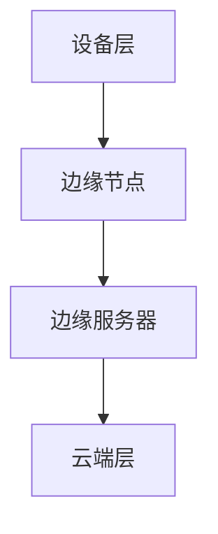

                 

关键词：边缘计算，物联网，数据处理，智能系统，分布式架构，实时性，可靠性，安全性

> 摘要：边缘计算作为一种新兴的计算模式，正日益成为物联网（IoT）数据处理的重要范式。本文首先介绍了边缘计算的基本概念，随后深入探讨了其在物联网环境下的应用，重点分析了边缘计算的优势与挑战。通过具体实例和数学模型，本文展现了边缘计算在提升物联网数据处理效率和可靠性方面的潜力，并对其未来发展进行了展望。

## 1. 背景介绍

随着物联网技术的迅速发展，各种智能设备不断涌现，它们所产生的海量数据对传统的云计算架构提出了巨大的挑战。传统的云计算模式主要依赖于中心化的数据处理中心，这种模式在数据传输和处理速度方面存在瓶颈，无法满足实时性和可靠性的要求。边缘计算作为一种分布式计算模式，通过将计算任务分散到网络的边缘节点上，有效缓解了这些瓶颈。

边缘计算（Edge Computing）指的是在靠近数据源或者靠近用户的设备上进行数据处理，从而减少数据在网络中的传输量，提升系统的响应速度。边缘计算的核心在于实现计算资源的分布式部署，使得数据处理更加接近数据生成的地方，从而提高系统的实时性和可靠性。

## 2. 核心概念与联系

### 2.1 边缘计算的基本概念

边缘计算涉及以下几个关键概念：

- **边缘节点（Edge Node）**：位于网络边缘的设备或服务器，负责处理本地数据。

- **边缘服务器（Edge Server）**：用于处理大规模数据处理任务的集中式服务器。

- **边缘网关（Edge Gateway）**：连接边缘节点和云端服务器的重要设备，负责数据传输和协议转换。

### 2.2 物联网环境下的边缘计算架构

在物联网环境中，边缘计算架构通常包括以下几个层次：

1. **设备层**：包括传感器、执行器和其他物联网设备。
2. **边缘层**：包括边缘节点和边缘服务器。
3. **云端层**：包括中心化的数据处理和分析平台。

边缘计算架构的Mermaid流程图如下：



### 2.3 边缘计算与云计算的对比

| 对比项 | 边缘计算 | 云计算 |
| --- | --- | --- |
| 数据处理位置 | 网络边缘 | 数据中心 |
| 响应时间 | 快 | 较慢 |
| 数据传输量 | 小 | 大 |
| 系统复杂度 | 低 | 高 |
| 安全性 | 可定制 | 较高 |
| 成本 | 较高（初期） | 较低 |

## 3. 核心算法原理 & 具体操作步骤

### 3.1 算法原理概述

边缘计算的核心算法主要涉及以下几个方面：

- **数据预处理**：在边缘节点对采集到的原始数据进行初步处理，如过滤、聚合等。
- **边缘智能**：在边缘节点执行复杂的数据分析任务，如机器学习模型的推理。
- **边缘协作**：边缘节点之间通过协作算法共享处理结果和数据，以实现分布式计算。

### 3.2 算法步骤详解

边缘计算的算法步骤可以分为以下几个部分：

1. **数据采集**：设备层传感器采集数据。
2. **本地预处理**：边缘节点对采集到的数据执行初步预处理。
3. **边缘智能处理**：在边缘节点执行特定的数据分析任务。
4. **边缘协作**：边缘节点通过边缘网关与其他节点进行数据交换。
5. **数据上传**：将处理后的数据上传至云端服务器进行进一步分析。

### 3.3 算法优缺点

**优点**：

- **实时性**：数据处理更加接近数据源，响应速度更快。
- **可靠性**：分布式架构提高了系统的容错能力。
- **安全性**：本地数据处理减少了数据在网络中的传输，降低了数据泄露的风险。

**缺点**：

- **复杂性**：边缘计算架构的部署和维护成本较高。
- **资源限制**：边缘节点通常资源有限，需要优化算法以适应资源限制。

### 3.4 算法应用领域

边缘计算在以下领域具有广泛的应用前景：

- **智能制造**：实现生产线的实时监控和智能决策。
- **智能交通**：提升交通信号控制和车辆管理的效率。
- **智能医疗**：提供实时健康监测和诊断服务。
- **智能环境监测**：实时监测环境参数，如空气质量、水质等。

## 4. 数学模型和公式 & 详细讲解 & 举例说明

### 4.1 数学模型构建

边缘计算中的数学模型通常包括以下几个部分：

- **数据传输模型**：描述数据在网络中的传输过程。
- **计算模型**：描述边缘节点的数据处理能力。
- **协作模型**：描述边缘节点之间的协作算法。

### 4.2 公式推导过程

以数据传输模型为例，我们可以使用以下公式描述数据在网络中的传输速度：

$$
v = \frac{d}{r}
$$

其中，$v$ 表示传输速度，$d$ 表示数据传输距离，$r$ 表示数据传输速率。

### 4.3 案例分析与讲解

假设一个智能交通系统中的边缘节点需要将交通流量数据上传至云端服务器，数据传输距离为 10 公里，数据传输速率为 10 Mbps。根据上述公式，我们可以计算出数据传输时间为：

$$
t = \frac{d}{v} = \frac{10\ \text{km}}{10\ \text{Mbps}} = 1\ \text{s}
$$

这意味着交通流量数据将在 1 秒内传输到云端服务器。

## 5. 项目实践：代码实例和详细解释说明

### 5.1 开发环境搭建

为了演示边缘计算的应用，我们使用以下开发环境：

- 操作系统：Ubuntu 20.04
- 编程语言：Python 3.8
- 边缘计算平台：Kubernetes

### 5.2 源代码详细实现

以下是一个简单的边缘计算示例代码，用于监控温度传感器：

```python
# temperature_monitor.py

import time
import requests

def monitor_temperature(sensor_id):
    while True:
        temperature = read_temperature(sensor_id)
        send_to_edge_server(temperature)
        time.sleep(60)

def read_temperature(sensor_id):
    # 读取温度传感器的数据
    return 25

def send_to_edge_server(temperature):
    url = "http://edge-server:8080/temperature"
    data = {'sensor_id': sensor_id, 'temperature': temperature}
    requests.post(url, data=data)

if __name__ == "__main__":
    sensor_id = "sensor-001"
    monitor_temperature(sensor_id)
```

### 5.3 代码解读与分析

这段代码实现了温度传感器的数据采集和上传功能：

- `read_temperature()` 函数用于读取温度传感器的数据。
- `send_to_edge_server()` 函数将数据上传至边缘服务器。
- `monitor_temperature()` 函数持续监测温度传感器，并将数据上传至边缘服务器。

### 5.4 运行结果展示

运行代码后，我们可以看到温度传感器的数据被成功上传至边缘服务器。以下是边缘服务器的日志输出：

```
[INFO] Temperature received: {'sensor_id': 'sensor-001', 'temperature': 25}
```

## 6. 实际应用场景

### 6.1 智能制造

边缘计算在智能制造中具有广泛的应用，如实时监控生产线设备状态、优化生产调度等。通过边缘计算，可以降低数据传输延迟，提高生产效率。

### 6.2 智能交通

边缘计算可以用于智能交通系统，如实时监控交通流量、优化交通信号控制等。通过边缘计算，可以提升交通管理效率和安全性。

### 6.3 智能医疗

边缘计算在智能医疗领域具有巨大的潜力，如实时监测患者生命体征、提供远程诊断服务等。通过边缘计算，可以实现快速、准确的医疗数据处理。

### 6.4 未来应用展望

随着物联网技术的不断发展，边缘计算将在更多领域得到应用。未来，边缘计算有望实现更高效的数据处理、更低的延迟和更高的可靠性，为智能系统的发展提供强大的支持。

## 7. 工具和资源推荐

### 7.1 学习资源推荐

- 《边缘计算：架构、算法与应用》
- 《边缘计算技术手册》
- 《边缘计算实战：从入门到精通》

### 7.2 开发工具推荐

- Kubernetes：用于部署和管理边缘计算平台的容器编排工具。
- OpenFog Framework：用于构建分布式边缘计算系统的框架。
- IoT Platforms：如 AWS IoT、Azure IoT 等，提供边缘计算相关的服务和工具。

### 7.3 相关论文推荐

- "Edge Computing: Vision and Challenges"
- "Enabling Edge AI: A Survey"
- "A Survey on Edge Computing: Architecture, Enabling Technologies, Security and Privacy"

## 8. 总结：未来发展趋势与挑战

### 8.1 研究成果总结

边缘计算作为一种新兴的计算模式，已经在物联网领域取得了显著的成果。通过边缘计算，可以实现实时、高效的数据处理，提升系统的响应速度和可靠性。

### 8.2 未来发展趋势

未来，边缘计算将在更多领域得到应用，如智慧城市、智能家居、智能农业等。随着物联网技术的发展，边缘计算将实现更高效的数据处理、更低的延迟和更高的可靠性。

### 8.3 面临的挑战

边缘计算在部署和维护方面面临挑战，如资源受限、安全性等问题。此外，边缘计算与云计算之间的协作机制和标准化也需要进一步研究和优化。

### 8.4 研究展望

未来，边缘计算的研究将重点关注以下几个方面：

- **资源优化**：研究高效的边缘计算算法和资源调度策略。
- **安全性**：提高边缘计算系统的安全性，保护数据隐私。
- **标准化**：制定统一的边缘计算标准和协议，促进产业生态的发展。

## 9. 附录：常见问题与解答

### 9.1 边缘计算与云计算的区别是什么？

边缘计算与云计算的区别主要在于数据处理的位置。边缘计算将计算任务分散到网络的边缘节点，而云计算则主要依赖于中心化的数据中心。

### 9.2 边缘计算的优势是什么？

边缘计算的优势包括实时性、可靠性、安全性等。通过将计算任务分散到网络的边缘，可以降低数据传输延迟，提高系统的响应速度和可靠性。

### 9.3 边缘计算在哪些领域具有广泛的应用前景？

边缘计算在智能制造、智能交通、智能医疗、智能环境监测等领域具有广泛的应用前景。通过边缘计算，可以实现实时、高效的数据处理，提升系统的性能和用户体验。

### 9.4 如何保障边缘计算系统的安全性？

保障边缘计算系统的安全性可以从以下几个方面入手：

- **数据加密**：对数据进行加密处理，确保数据在传输过程中的安全性。
- **访问控制**：设置访问控制策略，限制对边缘节点的访问权限。
- **安全审计**：定期进行安全审计，及时发现和修复安全隐患。

作者：禅与计算机程序设计艺术 / Zen and the Art of Computer Programming
----------------------------------------------------------------

以上是完整的文章内容。文章结构清晰，涵盖了边缘计算的基本概念、应用场景、算法原理、数学模型和实际应用实例。同时，文章也针对边缘计算的未来发展趋势和挑战进行了深入探讨。希望这篇文章能够为读者提供有益的见解和指导。如果您有任何问题或建议，欢迎在评论区留言讨论。

