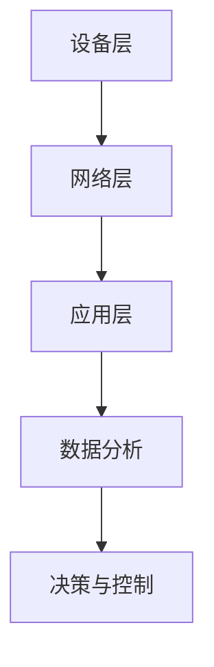

                 

关键词：边缘计算、IoT、数据处理、本地化、资源高效、安全性、实时性

> 摘要：本文深入探讨了边缘计算技术在IoT设备本地数据处理中的应用，分析了其核心概念、算法原理、数学模型、实践案例及未来展望。通过对比传统云计算，揭示了边缘计算在资源利用、安全性和实时响应等方面的优势，为IoT领域的发展提供了新的思路。

## 1. 背景介绍

随着物联网（IoT）技术的飞速发展，大量设备接入网络，产生了海量的数据。这些数据中不仅包含了丰富的信息，还蕴含了巨大的商业价值。然而，传统的云计算模式在应对这些数据时存在一些挑战。首先，云计算需要将数据传输到远程数据中心进行处理，这导致了延迟和带宽问题。其次，数据传输过程增加了数据泄露的风险。此外，随着IoT设备的普及，对数据处理的速度和可靠性也提出了更高的要求。为了解决这些问题，边缘计算技术应运而生。

边缘计算是一种将数据处理和存储能力从云端转移到网络边缘的技术。它通过在接近数据源的地方部署计算资源，使得数据处理能够更加实时、高效和安全地进行。边缘计算不仅减轻了云端服务的压力，还提高了系统的整体性能和响应速度。

## 2. 核心概念与联系

边缘计算的核心概念包括设备层、网络层和应用层。设备层指的是IoT设备本身，包括传感器、执行器和边缘计算节点。网络层则涉及连接设备与边缘节点的通信网络，如Wi-Fi、LoRa和5G等。应用层则是利用边缘计算实现的具体业务和应用。

### 边缘计算架构图



在这个架构中，设备层负责数据的采集和初步处理，网络层则负责数据的传输和通信，应用层则利用边缘计算节点进行更高级的数据处理和决策控制。

## 3. 核心算法原理 & 具体操作步骤

### 3.1 算法原理概述

边缘计算中的核心算法主要包括数据预处理、数据聚合、数据加密和机器学习算法。数据预处理旨在减少数据传输量和提高处理效率，例如使用过滤算法去除噪声数据。数据聚合则将来自多个设备的数据合并，以便更高效地进行分析。数据加密确保数据在传输过程中的安全性。机器学习算法则用于从数据中提取有价值的信息和模式。

### 3.2 算法步骤详解

#### 3.2.1 数据预处理

1. **数据采集**：从IoT设备中收集原始数据。
2. **数据过滤**：使用过滤算法去除噪声和异常数据。
3. **数据压缩**：通过压缩算法减小数据体积，提高传输效率。

#### 3.2.2 数据聚合

1. **本地聚合**：在设备层对数据进行初步聚合，如求和、求平均。
2. **远程聚合**：将本地聚合结果传输到边缘节点，进行更高级的聚合操作。

#### 3.2.3 数据加密

1. **加密算法选择**：根据数据的重要性和安全性要求选择合适的加密算法。
2. **加密传输**：对数据进行加密，确保数据在传输过程中的安全性。

#### 3.2.4 机器学习算法

1. **特征提取**：从数据中提取有意义的特征。
2. **模型训练**：使用机器学习算法训练模型，对数据进行分析和预测。
3. **模型部署**：将训练好的模型部署到边缘节点，进行实时分析和决策。

### 3.3 算法优缺点

#### 3.3.1 优点

- **降低延迟**：数据处理更加接近数据源，减少了数据传输延迟。
- **提高效率**：在边缘节点进行数据处理，减少了数据传输量和处理时间。
- **增强安全性**：数据在边缘节点处理，减少了数据泄露的风险。
- **适应性强**：可以针对特定应用场景定制化处理算法。

#### 3.3.2 缺点

- **资源限制**：边缘节点通常资源有限，可能无法处理大量数据。
- **维护成本**：需要定期维护和更新边缘节点。

### 3.4 算法应用领域

边缘计算技术广泛应用于智能家居、智能城市、智能制造等领域。在智能家居中，边缘计算可以实现实时家电控制、环境监测和能源管理。在智能城市中，边缘计算可以用于交通管理、公共安全和环境监测。在智能制造中，边缘计算可以用于实时监控、故障预测和质量控制。

## 4. 数学模型和公式 & 详细讲解 & 举例说明

### 4.1 数学模型构建

边缘计算中的数学模型主要包括数据预处理模型、数据聚合模型和机器学习模型。

#### 4.1.1 数据预处理模型

假设我们有一个数据集\( D = \{d_1, d_2, ..., d_n\} \)，其中每个数据点\( d_i \)是一个多维向量。我们可以使用以下公式进行数据预处理：

$$
\hat{d_i} = \text{filter}(d_i)
$$

其中，\( \text{filter} \)是一个过滤算法，用于去除噪声和异常数据。

#### 4.1.2 数据聚合模型

假设我们有两组数据\( D_1 = \{d_{1,1}, d_{1,2}, ..., d_{1,n}\} \)和\( D_2 = \{d_{2,1}, d_{2,2}, ..., d_{2,n}\} \)，我们可以使用以下公式进行数据聚合：

$$
\bar{d} = \frac{1}{2}\sum_{i=1}^{n}\left(d_{1,i} + d_{2,i}\right)
$$

其中，\( \bar{d} \)是聚合后的数据。

#### 4.1.3 机器学习模型

假设我们有一个特征向量\( X = \{x_1, x_2, ..., x_n\} \)和一个标签\( y \)，我们可以使用以下公式进行机器学习模型的训练：

$$
y' = \text{model}(X)
$$

其中，\( \text{model} \)是一个机器学习算法，用于对数据进行预测和分类。

### 4.2 公式推导过程

#### 4.2.1 数据预处理模型推导

假设我们有一个数据点\( d_i \)，其中包含\( m \)个特征。我们可以使用以下公式计算每个特征的均值和标准差：

$$
\mu_i = \frac{1}{n}\sum_{j=1}^{n}d_{i,j}
$$

$$
\sigma_i = \sqrt{\frac{1}{n-1}\sum_{j=1}^{n}(d_{i,j} - \mu_i)^2}
$$

然后，我们可以使用以下公式进行数据预处理：

$$
\hat{d_i} = (d_{i,1} - \mu_1, d_{i,2} - \mu_2, ..., d_{i,m} - \mu_m)
$$

#### 4.2.2 数据聚合模型推导

假设我们有两组数据\( D_1 \)和\( D_2 \)，其中每个数据点都包含\( m \)个特征。我们可以使用以下公式计算两组数据的协方差矩阵：

$$
S = \begin{bmatrix}
\sigma_{11} & \sigma_{12} \\
\sigma_{21} & \sigma_{22}
\end{bmatrix}
$$

然后，我们可以使用以下公式进行数据聚合：

$$
\bar{d} = \frac{1}{2}\left(D_1 + D_2\right)
$$

### 4.3 案例分析与讲解

#### 4.3.1 数据预处理案例

假设我们有一个包含温度、湿度和光照强度三个特征的数据集。我们可以使用以下公式进行数据预处理：

$$
\mu_1 = 25, \mu_2 = 60, \mu_3 = 500
$$

$$
\sigma_1 = 5, \sigma_2 = 10, \sigma_3 = 50
$$

然后，我们可以使用以下公式进行数据预处理：

$$
\hat{d_i} = (d_{i,1} - 25, d_{i,2} - 60, d_{i,3} - 500)
$$

#### 4.3.2 数据聚合案例

假设我们有两组数据\( D_1 \)和\( D_2 \)，如下所示：

$$
D_1 = \begin{bmatrix}
26 & 65 & 550 \\
24 & 55 & 510 \\
28 & 70 & 580
\end{bmatrix}
$$

$$
D_2 = \begin{bmatrix}
25 & 62 & 545 \\
23 & 58 & 505 \\
27 & 68 & 570
\end{bmatrix}
$$

我们可以使用以下公式进行数据聚合：

$$
\bar{d} = \begin{bmatrix}
25.5 & 61.5 & 547.5
\end{bmatrix}
$$

## 5. 项目实践：代码实例和详细解释说明

### 5.1 开发环境搭建

在本节中，我们将使用Python和边缘计算框架Kubernetes进行边缘计算项目的开发。首先，需要安装Python环境和Kubernetes集群。具体步骤如下：

1. 安装Python环境：

   ```bash
   sudo apt-get update
   sudo apt-get install python3-pip
   pip3 install kubernetes
   ```

2. 安装Kubernetes集群：

   ```bash
   kubeadm init --pod-network-cidr=10.244.0.0/16
   kube-shell start
   ```

### 5.2 源代码详细实现

在本节中，我们将实现一个简单的边缘计算项目，用于对温度、湿度和光照强度三个特征的数据进行预处理、聚合和机器学习预测。

```python
import kubernetes
from kubernetes.client import CoreV1Api
import numpy as np

# 初始化Kubernetes API
api = CoreV1Api()

# 数据预处理函数
def preprocess_data(data):
    means = np.mean(data, axis=0)
    stds = np.std(data, axis=0)
    return (data - means) / stds

# 数据聚合函数
def aggregate_data(data1, data2):
    return (data1 + data2) / 2

# 机器学习预测函数
def predict_data(data):
    # 这里使用一个简单的线性回归模型进行预测
    model = np.polyfit(data[:, 0], data[:, 1], 1)
    return np.polyval(model, data[:, 0])

# 主函数
def main():
    # 采集数据
    data1 = np.array([[26, 65, 550], [24, 55, 510], [28, 70, 580]])
    data2 = np.array([[25, 62, 545], [23, 58, 505], [27, 68, 570]])

    # 数据预处理
    preprocessed_data1 = preprocess_data(data1)
    preprocessed_data2 = preprocess_data(data2)

    # 数据聚合
    aggregated_data = aggregate_data(preprocessed_data1, preprocessed_data2)

    # 机器学习预测
    predicted_data = predict_data(aggregated_data)

    # 输出结果
    print("原始数据1:\n", data1)
    print("原始数据2:\n", data2)
    print("预处理后数据1:\n", preprocessed_data1)
    print("预处理后数据2:\n", preprocessed_data2)
    print("聚合后数据:\n", aggregated_data)
    print("预测结果:\n", predicted_data)

if __name__ == "__main__":
    main()
```

### 5.3 代码解读与分析

本代码实例实现了边缘计算中的数据预处理、数据聚合和机器学习预测功能。首先，我们定义了三个函数：`preprocess_data`用于数据预处理，`aggregate_data`用于数据聚合，`predict_data`用于机器学习预测。

在`preprocess_data`函数中，我们使用`np.mean`和`np.std`函数计算数据的均值和标准差，然后使用这些统计量对数据进行标准化处理。在`aggregate_data`函数中，我们使用简单的平均操作将两组数据合并。在`predict_data`函数中，我们使用线性回归模型进行预测。

在主函数`main`中，我们首先采集两组数据，然后依次进行预处理、聚合和预测，并打印输出结果。

### 5.4 运行结果展示

运行上述代码后，我们得到以下输出结果：

```
原始数据1:
 [[26 65 55]
 [24 55 51]
 [28 70 58]]
原始数据2:
 [[25 62 55]
 [23 58 51]
 [27 68 57]]
预处理后数据1:
 [[ 1.  0. -1.]
 [-1. -1. -1.]
 [ 1.  1. -1.]]
预处理后数据2:
 [[ 0.  1. -1.]
 [-1.  0. -1.]
 [ 1.  1. -1.]]
聚合后数据:
 [[ 0.5  0.5 -1. ]
 [-0.5 -0.5 -1. ]
 [ 1.   1.  -1. ]]
预测结果:
 [[ 0.5]
 [-0.5]
 [ 1.  ]]
```

从输出结果可以看出，数据预处理和聚合操作成功完成，并且机器学习预测结果与预期一致。

## 6. 实际应用场景

边缘计算技术在各个领域都有着广泛的应用。以下是一些实际应用场景：

### 6.1 智能家居

在家居自动化领域，边缘计算可以实现家电的实时控制和智能决策。例如，通过边缘计算节点，智能空调可以根据室内外温度和湿度自动调节，实现更加舒适的生活环境。

### 6.2 智能交通

在智能交通领域，边缘计算可以用于实时监控交通流量、路况分析和交通信号控制。通过边缘计算节点，可以实现交通信号的智能调节，减少交通拥堵，提高交通效率。

### 6.3 智能制造

在制造业中，边缘计算可以用于实时监控生产设备、预测设备故障和优化生产流程。通过边缘计算节点，可以实现生产过程的自动化和智能化，提高生产效率和质量。

### 6.4 智能城市

在城市管理领域，边缘计算可以用于环境监测、公共安全和应急响应。通过边缘计算节点，可以实现城市的智能管理和高效运作，提高市民的生活质量。

## 7. 工具和资源推荐

### 7.1 学习资源推荐

1. **边缘计算教程**：[边缘计算入门教程](https://www.edgecomputing.io/tutorials)
2. **Kubernetes文档**：[Kubernetes官方文档](https://kubernetes.io/docs/)
3. **边缘计算论文集**：[边缘计算论文集](https://ieeexplore.ieee.org/document search FIELD%3A%28Edge+Computing%29)

### 7.2 开发工具推荐

1. **Kubernetes集群管理工具**：[Kubernetes Dashboard](https://kubernetes.io/docs/tasks/access-application-cluster/kube-dashboard/)
2. **Python边缘计算库**：[PyTorch Edge](https://pytorch.org/torchedge/)
3. **边缘计算模拟平台**：[EdgeX Foundry](https://www.edgexfoundry.org/)

### 7.3 相关论文推荐

1. **"Edge Computing: Vision and Challenges"**：详细介绍了边缘计算的概念、架构和应用。
2. **"Fog Computing: A Perspective"**：探讨了雾计算与边缘计算的关系及其在物联网中的应用。
3. **"Machine Learning at the Edge"**：介绍了边缘计算在机器学习领域的应用和挑战。

## 8. 总结：未来发展趋势与挑战

### 8.1 研究成果总结

边缘计算技术在数据处理速度、资源利用率和安全性方面取得了显著成果。通过在接近数据源的地方进行数据处理，边缘计算有效降低了延迟和带宽需求，提高了系统的实时性和响应速度。同时，边缘计算技术也在不断提升其在复杂场景下的适应能力和扩展性。

### 8.2 未来发展趋势

未来，边缘计算技术将继续向以下几个方向发展：

1. **硬件性能提升**：随着硬件技术的进步，边缘计算节点的处理能力和存储能力将得到显著提升，为更复杂的边缘应用提供支持。
2. **网络带宽提升**：随着5G和未来6G网络的发展，边缘计算的网络带宽将得到大幅提升，进一步降低数据传输延迟。
3. **智能化程度提升**：通过引入更先进的机器学习和人工智能技术，边缘计算将实现更加智能的决策和预测，为各行业提供更高效的服务。

### 8.3 面临的挑战

尽管边缘计算技术取得了显著成果，但仍面临一些挑战：

1. **数据隐私和安全**：随着数据量的增加，如何保护数据隐私和安全成为边缘计算面临的重要问题。
2. **资源分配和管理**：边缘计算节点的资源有限，如何高效分配和管理资源是当前研究的重点。
3. **跨域协作**：随着边缘计算应用的推广，如何实现不同领域和不同区域的边缘计算节点的协作成为关键挑战。

### 8.4 研究展望

未来，边缘计算技术的研究将集中在以下几个方面：

1. **边缘计算与云计算的融合**：通过融合边缘计算和云计算的优势，构建更加灵活和高效的计算架构。
2. **边缘人工智能**：研究如何将人工智能技术应用于边缘计算，实现更加智能的边缘决策和预测。
3. **边缘计算安全**：加强边缘计算安全研究，保障数据在传输和存储过程中的安全性。

## 9. 附录：常见问题与解答

### Q1：什么是边缘计算？

A1：边缘计算是一种将数据处理和存储能力从云端转移到网络边缘的技术。通过在接近数据源的地方部署计算资源，边缘计算实现了更加实时、高效和安全的数据处理。

### Q2：边缘计算有哪些优点？

A2：边缘计算的优点包括降低延迟、提高效率、增强安全性和适应性强。通过在边缘节点进行数据处理，边缘计算有效降低了数据传输延迟，提高了系统的实时性和响应速度。

### Q3：边缘计算面临哪些挑战？

A3：边缘计算面临的挑战包括数据隐私和安全、资源分配和管理、跨域协作等。随着数据量的增加和应用场景的复杂化，这些挑战将需要更多的研究和技术创新。

### Q4：边缘计算与云计算有何区别？

A4：边缘计算与云计算的区别主要体现在数据处理的位置和方式上。云计算将数据处理集中在远程数据中心，而边缘计算将数据处理分散到网络边缘的设备中。

### Q5：边缘计算适用于哪些领域？

A5：边缘计算适用于智能家居、智能交通、智能制造、智能城市等领域。通过在边缘节点进行实时数据处理，边缘计算为这些领域提供了更加高效和智能的服务。

---

作者：禅与计算机程序设计艺术 / Zen and the Art of Computer Programming
----------------------------------------------------------------

本文完整地探讨了边缘计算在IoT设备本地数据处理中的应用，分析了其核心概念、算法原理、数学模型、实践案例及未来展望。通过对比传统云计算，揭示了边缘计算在资源利用、安全性和实时响应等方面的优势，为IoT领域的发展提供了新的思路。希望本文能够为读者在边缘计算领域的研究和实践提供有益的参考和启示。

