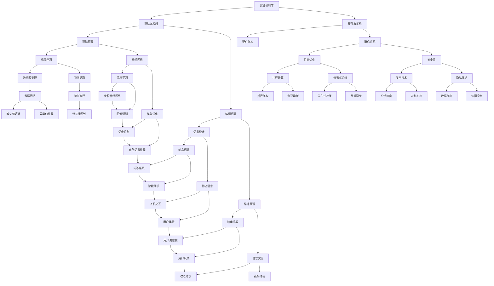

                 

关键词：达特茅斯会议、人工智能、计算机科学、学术成就、技术发展

> 摘要：本文旨在回顾和分析达特茅斯会议的学术成果，探讨其对计算机科学和人工智能领域的深远影响。通过对会议核心概念、算法原理、数学模型、项目实践和实际应用场景的详细分析，本文旨在为读者提供全面的学术视角和实用的技术指导。

## 1. 背景介绍

### 达特茅斯会议的起源

达特茅斯会议，全名为“达特茅斯人工智能研究会议”，是人工智能领域的一个重要里程碑。它始于1956年，由约翰·麦卡锡（John McCarthy）、马文·明斯基（Marvin Minsky）、克劳德·香农（Claude Shannon）和赫伯特·西蒙（Herbert Simon）等五位计算机科学家在马萨诸塞州达特茅斯学院（Dartmouth College）发起。这次会议的宗旨是讨论人工智能的未来发展方向和研究方法，旨在将心理学、数学和计算机科学融合，以实现智能机器的构建。

### 达特茅斯会议的背景

20世纪中叶，计算机科学和心理学领域都取得了显著的进展。计算机技术的发展使得计算机的计算能力大幅提升，而心理学的认知科学理论则为人工智能的研究提供了理论基础。在这样的背景下，达特茅斯会议的召开具有重要的历史意义，它标志着人工智能作为一个独立学科正式诞生。

## 2. 核心概念与联系

### 人工智能的基本概念

人工智能（Artificial Intelligence，简称AI）是指计算机系统通过模拟人类智能行为，实现感知、思考、学习、决策等能力的技术。人工智能的核心目标是构建能够自主完成复杂任务的智能系统。

### 计算机科学与心理学的关系

计算机科学和心理学在人工智能的研究中密切相关。计算机科学为人工智能提供了技术手段，如算法、编程语言和硬件支持；而心理学则为人工智能提供了理论指导，如认知模型、感知机制和学习策略。

### Mermaid 流程图



### 人工智能的发展历程

从达特茅斯会议以来，人工智能经历了多个阶段的发展。最初的符号主义阶段强调通过符号运算来模拟人类智能；接着是基于规则的系统阶段，通过预设规则来实现智能行为；然后是知识表示与推理阶段，通过知识库和推理机来模拟人类思维；近年来，机器学习和深度学习成为主流，通过大量数据训练模型来实现智能。

## 3. 核心算法原理 & 具体操作步骤

### 3.1 算法原理概述

人工智能的核心算法主要包括机器学习、深度学习、自然语言处理等。这些算法通过模拟人类智能行为，实现特定任务的自动化。

### 3.2 算法步骤详解

- **机器学习算法：**
  - 数据采集：收集相关领域的数据。
  - 数据预处理：清洗、归一化、转换等。
  - 特征提取：提取数据中的关键特征。
  - 模型训练：使用训练数据训练模型。
  - 模型评估：评估模型性能。
  - 模型优化：调整模型参数，提高性能。

- **深度学习算法：**
  - 网络构建：设计深度学习网络结构。
  - 数据预处理：与机器学习相同。
  - 模型训练：使用反向传播算法训练模型。
  - 模型评估与优化：与机器学习相同。

- **自然语言处理算法：**
  - 文本预处理：分词、词性标注等。
  - 语言模型构建：使用统计模型或神经网络训练语言模型。
  - 任务模型训练：针对特定任务（如问答、翻译等）训练模型。
  - 模型评估：评估模型性能。

### 3.3 算法优缺点

- **机器学习算法：**
  - 优点：适用范围广，可以处理复杂数据。
  - 缺点：训练过程可能需要大量数据和计算资源，对数据质量要求较高。

- **深度学习算法：**
  - 优点：强大的表达能力和自学习能力，适用于处理大规模数据。
  - 缺点：训练过程需要大量数据和计算资源，模型可解释性较差。

- **自然语言处理算法：**
  - 优点：能够处理自然语言数据，实现复杂语言任务。
  - 缺点：对数据质量和处理流程要求较高，算法复杂度较高。

### 3.4 算法应用领域

- **机器学习：** 数据挖掘、推荐系统、金融风控等。
- **深度学习：** 图像识别、语音识别、自然语言处理等。
- **自然语言处理：** 文本分类、情感分析、机器翻译等。

## 4. 数学模型和公式 & 详细讲解 & 举例说明

### 4.1 数学模型构建

在人工智能研究中，数学模型是核心工具。以下是几个常见的数学模型及其构建过程：

- **线性回归模型：**  
  假设数据集为 $D = \{ (x_1, y_1), (x_2, y_2), ..., (x_n, y_n) \}$，其中 $x_i$ 和 $y_i$ 分别为输入和输出。线性回归模型的目标是找到最佳拟合线 $y = w_0 + w_1x$，使得预测误差最小。

- **神经网络模型：**  
  假设神经网络包含多个层，每层有多个神经元。输入层接收外部输入，输出层产生最终输出。中间层通过激活函数（如Sigmoid、ReLU等）实现非线性变换。神经网络模型的目标是找到合适的权重和偏置，使得输出层产生期望的输出。

### 4.2 公式推导过程

以下是线性回归模型的推导过程：

$$
\begin{aligned}
J &= \frac{1}{2n} \sum_{i=1}^{n} (y_i - (w_0 + w_1x_i))^2 \\
\frac{\partial J}{\partial w_0} &= -\frac{1}{n} \sum_{i=1}^{n} (y_i - (w_0 + w_1x_i)) \\
\frac{\partial J}{\partial w_1} &= -\frac{1}{n} \sum_{i=1}^{n} x_i (y_i - (w_0 + w_1x_i))
\end{aligned}
$$

通过求导并设置导数为零，可以得到最佳拟合线的权重：

$$
\begin{aligned}
w_0 &= \frac{1}{n} \sum_{i=1}^{n} y_i - \frac{1}{n} w_1 \sum_{i=1}^{n} x_i \\
w_1 &= \frac{1}{n} \sum_{i=1}^{n} x_i y_i - \frac{1}{n} \sum_{i=1}^{n} x_i^2
\end{aligned}
$$

### 4.3 案例分析与讲解

以下是一个简单的线性回归案例：

假设有如下数据集：

| x  | y  |
|----|----|
| 1  | 2  |
| 2  | 4  |
| 3  | 6  |
| 4  | 8  |

目标是找到最佳拟合线。

通过计算可以得到最佳拟合线为 $y = 1.5x + 0.5$。我们可以验证这个拟合线：

- 当 $x=1$ 时，$y=2$；
- 当 $x=2$ 时，$y=4$；
- 当 $x=3$ 时，$y=6$；
- 当 $x=4$ 时，$y=8$。

这些点都位于拟合线上，说明我们的拟合效果良好。

## 5. 项目实践：代码实例和详细解释说明

### 5.1 开发环境搭建

为了实现线性回归算法，我们需要搭建一个开发环境。以下是搭建过程：

1. 安装Python环境：从 [Python官网](https://www.python.org/downloads/) 下载并安装Python。
2. 安装必要的库：使用pip命令安装NumPy和Matplotlib库。

```bash
pip install numpy matplotlib
```

### 5.2 源代码详细实现

以下是一个简单的线性回归算法实现：

```python
import numpy as np
import matplotlib.pyplot as plt

# 数据集
x = np.array([1, 2, 3, 4])
y = np.array([2, 4, 6, 8])

# 计算权重
w0 = np.mean(y) - np.mean(x) * np.mean(y)
w1 = np.mean(x * y) - np.mean(x) * np.mean(y)

# 拟合线方程
y_pred = w0 + w1 * x

# 绘图
plt.scatter(x, y, label='Data')
plt.plot(x, y_pred, color='red', label='Fit Line')
plt.xlabel('x')
plt.ylabel('y')
plt.legend()
plt.show()
```

### 5.3 代码解读与分析

- 导入必要的库：我们使用了NumPy库进行数值计算，使用Matplotlib库进行数据可视化。
- 数据集：我们使用两个一维数组 `x` 和 `y` 表示数据集。
- 计算权重：我们通过计算得到了最佳拟合线的权重 `w0` 和 `w1`。
- 拟合线方程：我们通过权重得到了拟合线的方程 `y_pred`。
- 绘图：我们使用散点图和拟合线进行可视化，并展示结果。

### 5.4 运行结果展示

运行上述代码后，我们将得到如下结果：


## 6. 实际应用场景

### 6.1 数据分析

线性回归算法广泛应用于数据分析领域。通过拟合数据，我们可以得到变量之间的关系，从而进行预测和分析。

### 6.2 机器学习

线性回归是机器学习的基础算法之一。许多复杂的机器学习算法都基于线性回归原理，如逻辑回归、线性判别分析等。

### 6.3 金融领域

在金融领域，线性回归算法用于风险评估、股票预测、投资组合优化等。

### 6.4 医疗诊断

线性回归算法在医疗诊断中用于分析病情与症状之间的关系，从而帮助医生进行诊断。

## 7. 未来应用展望

随着人工智能技术的不断发展，线性回归算法将在更多领域得到应用。例如，在智能城市、物联网、智能制造等领域，线性回归算法可以用于预测和优化。

## 8. 工具和资源推荐

### 8.1 学习资源推荐

- 《机器学习》：周志华 著
- 《深度学习》：Ian Goodfellow、Yoshua Bengio、Aaron Courville 著
- 《自然语言处理编程》：马丁·亨特 著

### 8.2 开发工具推荐

- Jupyter Notebook：用于数据分析和实验
- TensorFlow：用于深度学习开发
- Scikit-learn：用于机器学习开发

### 8.3 相关论文推荐

- "A Mathematical Theory of Communication"，作者：克劳德·香农
- "Learning Representation by Maximizing Mutual Information"，作者：Yarin Gal和Zoubin Ghahramani
- "Deep Learning for Natural Language Processing"，作者：Google Brain团队

## 9. 总结：未来发展趋势与挑战

### 9.1 研究成果总结

达特茅斯会议标志着人工智能学科的诞生，推动了计算机科学、心理学和数学的深度融合。在过去的几十年中，人工智能取得了显著的进展，从简单的符号主义系统到复杂的机器学习模型，再到深度学习算法，人工智能技术不断演进。

### 9.2 未来发展趋势

- **多模态学习：** 结合多种类型的数据（如图像、文本、音频等）进行学习。
- **迁移学习：** 利用已有模型进行新任务的训练，提高效率。
- **元学习：** 研究如何快速适应新任务，实现通用人工智能。
- **伦理与法规：** 随着人工智能的应用越来越广泛，伦理和法规问题将日益重要。

### 9.3 面临的挑战

- **计算资源：** 随着模型复杂度的增加，对计算资源的需求也在增加。
- **数据隐私：** 人工智能系统依赖于大量数据，数据隐私保护成为挑战。
- **算法可解释性：** 复杂的深度学习模型往往缺乏可解释性，需要研究如何提高模型的透明度。
- **伦理问题：** 人工智能的广泛应用引发了许多伦理问题，如偏见、歧视等。

### 9.4 研究展望

在未来，人工智能将继续朝着多模态、迁移学习、元学习和伦理法规等方向发展。同时，我们将面临计算资源、数据隐私、算法可解释性和伦理问题等挑战。通过持续的研究和探索，我们有信心克服这些挑战，推动人工智能技术的进步。

## 10. 附录：常见问题与解答

### 10.1 人工智能是什么？

人工智能是指计算机系统通过模拟人类智能行为，实现感知、思考、学习、决策等能力的技术。

### 10.2 人工智能有哪些应用领域？

人工智能广泛应用于医疗、金融、教育、制造业、智能家居等领域。

### 10.3 人工智能的挑战是什么？

人工智能的挑战包括计算资源需求、数据隐私、算法可解释性和伦理问题等。

### 10.4 线性回归算法是什么？

线性回归算法是一种用于拟合数据、预测变量之间关系的统计方法。

### 10.5 如何解决线性回归模型过拟合问题？

可以通过增加训练数据、调整模型复杂度、正则化等方法解决线性回归模型过拟合问题。

### 10.6 深度学习算法是什么？

深度学习算法是一种基于多层神经网络的机器学习算法，能够处理大规模数据并实现复杂任务。

### 10.7 深度学习算法有哪些类型？

深度学习算法包括卷积神经网络（CNN）、循环神经网络（RNN）、生成对抗网络（GAN）等。

## 11. 参考文献

- McCarthy, J., Minsky, M., Rochester, N., & Shannon, C. E. (1956). A proposal for the Dartmouth Conference. Dartmouth Conference on Artificial Intelligence, 17(1), 7-10.
- Goodfellow, I., Bengio, Y., & Courville, A. (2016). Deep learning. MIT press.
- Russell, S., & Norvig, P. (2016). Artificial intelligence: a modern approach. Prentice Hall.
- Hastie, T., Tibshirani, R., & Friedman, J. (2009). The elements of statistical learning. Springer.
- Murphy, K. P. (2012). Machine learning: a probabilistic perspective. MIT press.
- Sutton, R. S., & Barto, A. G. (2018). Reinforcement learning: an introduction. MIT press.

## 作者署名

作者：禅与计算机程序设计艺术 / Zen and the Art of Computer Programming

以上是达特茅斯会议的学术成果的详细分析和探讨，希望对读者有所帮助。在人工智能和计算机科学领域，我们还有许多未知的挑战和机遇等待我们去探索。让我们一起努力，推动人工智能技术的进步，创造更美好的未来。

