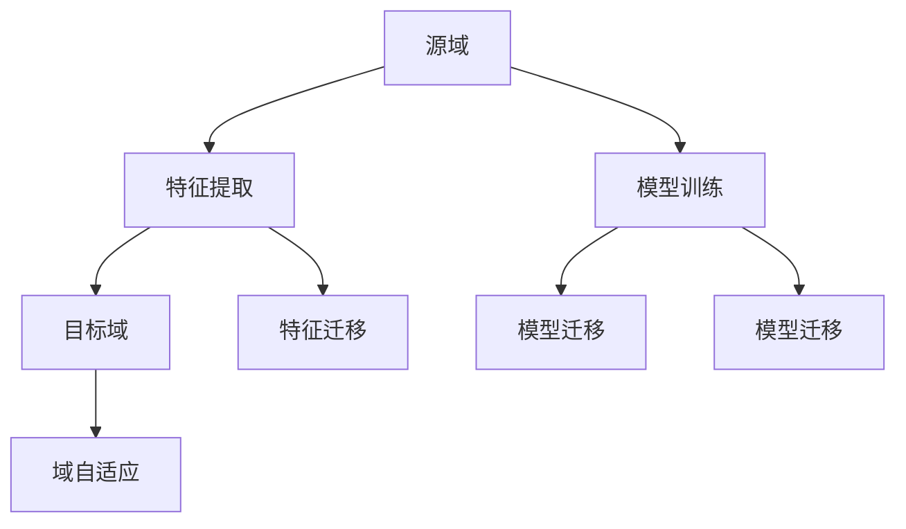

                 

 迁移学习（Transfer Learning）是近年来人工智能领域的一个热点研究方向，其核心思想是将已有模型的知识迁移到新的任务上，以提高模型的性能和泛化能力。随着深度学习基础模型的不断发展，迁移学习也在不断演进，成为推动人工智能应用落地的重要技术之一。

## 1. 背景介绍

迁移学习并非一个全新的概念，早在1990年代，它就已经在机器学习领域崭露头角。然而，随着深度学习技术的崛起，迁移学习的重要性愈发凸显。深度学习模型通常需要大量的数据训练，而迁移学习通过将已有模型的知识迁移到新任务，可以在数据不足的情况下提高模型性能，从而实现快速训练和高效应用。

迁移学习的基础模型主要分为两大类：基于特征的迁移学习和基于模型的迁移学习。基于特征的迁移学习是将源域的特征表示迁移到目标域，而基于模型的迁移学习则是直接迁移整个模型。这两种方法各有优缺点，但都在实际应用中发挥了重要作用。

## 2. 核心概念与联系

在深入探讨迁移学习之前，我们首先需要了解一些核心概念，如源域（Source Domain）、目标域（Target Domain）、域自适应（Domain Adaptation）等。

### 2.1 源域与目标域

源域是指已有模型所训练的数据集，而目标域是指新任务的数据集。在实际应用中，源域和目标域通常存在一定的差异，例如数据分布、标签标注方式等。

### 2.2 域自适应

域自适应是一种将源域知识迁移到目标域的方法，其目的是减少源域和目标域之间的差异，从而提高模型在目标域上的性能。

### 2.3 Mermaid 流程图

下面是一个关于迁移学习核心概念和联系的 Mermaid 流程图：



## 3. 核心算法原理 & 具体操作步骤

### 3.1 算法原理概述

迁移学习算法可以分为两大类：基于特征的迁移学习和基于模型的迁移学习。基于特征的迁移学习通常采用特征提取网络，将源域和目标域的特征表示进行对齐，从而减少两者之间的差异。而基于模型的迁移学习则是直接迁移整个模型，通过微调或重新训练的方式，使模型适应目标域。

### 3.2 算法步骤详解

迁移学习算法的具体操作步骤如下：

1. **特征提取**：从源域数据中提取特征表示，通常采用卷积神经网络（CNN）等深度学习模型。
2. **模型训练**：在源域数据上训练特征提取模型，使其能够捕捉到源域的特征。
3. **特征迁移**：将训练好的特征提取模型应用到目标域数据上，提取目标域的特征表示。
4. **模型迁移**：将源域模型的结构迁移到目标域，并通过微调或重新训练，使模型适应目标域。
5. **域自适应**：通过域自适应技术，进一步减少源域和目标域之间的差异，提高模型在目标域上的性能。

### 3.3 算法优缺点

迁移学习算法的优点包括：

- **减少数据需求**：通过迁移已有模型的知识，可以降低新任务对数据量的要求。
- **提高模型性能**：在数据不足的情况下，迁移学习可以提高模型在目标域上的性能。

然而，迁移学习算法也存在一些缺点：

- **模型适应性**：迁移学习模型在源域和目标域之间的适应性可能较差，特别是在源域和目标域差异较大的情况下。
- **模型泛化能力**：迁移学习模型在迁移过程中可能会损失一部分泛化能力。

### 3.4 算法应用领域

迁移学习算法在多个领域得到了广泛应用，包括计算机视觉、自然语言处理、语音识别等。以下是一些具体的应用案例：

- **计算机视觉**：通过迁移学习，可以在数据不足的情况下实现高效的图像分类、目标检测等任务。
- **自然语言处理**：迁移学习被广泛应用于文本分类、情感分析等任务，通过迁移已有模型的知识，可以快速实现新任务。
- **语音识别**：迁移学习可以帮助语音识别系统在数据不足的情况下提高识别准确率。

## 4. 数学模型和公式

在迁移学习算法中，常用的数学模型包括损失函数、优化算法等。以下是一个简单的数学模型示例：

### 4.1 数学模型构建

假设我们有一个源域特征向量 $x_s$ 和目标域特征向量 $x_t$，它们的表示分别为 $f_s(x_s)$ 和 $f_t(x_t)$。为了使源域和目标域的特征表示对齐，我们可以使用以下损失函数：

$$
L = \frac{1}{2} \sum_{i=1}^{N} \sum_{j=1}^{M} (f_s(x_{s,i}) - f_t(x_{t,j}))^2
$$

其中，$N$ 和 $M$ 分别为源域和目标域的数据数量。

### 4.2 公式推导过程

为了推导上述损失函数，我们首先需要对源域和目标域的特征表示进行对齐。假设源域和目标域的特征表示差异为 $\Delta f$，则有：

$$
f_s(x_s) = f_t(x_t) + \Delta f
$$

对上式两边求导，得到：

$$
\frac{\partial f_s(x_s)}{\partial x_s} = \frac{\partial f_t(x_t)}{\partial x_t} + \frac{\partial \Delta f}{\partial x_s}
$$

由于我们希望源域和目标域的特征表示对齐，即 $\Delta f = 0$，因此有：

$$
\frac{\partial f_s(x_s)}{\partial x_s} = \frac{\partial f_t(x_t)}{\partial x_t}
$$

代入上述损失函数，得到：

$$
L = \frac{1}{2} \sum_{i=1}^{N} \sum_{j=1}^{M} (f_s(x_{s,i}) - f_t(x_{t,j}))^2 = \frac{1}{2} \sum_{i=1}^{N} \sum_{j=1}^{M} (\Delta f(x_{s,i}, x_{t,j}))^2
$$

### 4.3 案例分析与讲解

假设我们有一个图像分类任务，其中源域为猫和狗的图像，目标域为马和牛的图像。我们可以使用上述损失函数来对齐源域和目标域的特征表示。

首先，我们从源域数据中提取特征表示 $f_s(x_s)$，然后从目标域数据中提取特征表示 $f_t(x_t)$。接着，我们使用损失函数 $L$ 来计算源域和目标域特征表示的差异。

通过迭代优化损失函数，我们可以使源域和目标域的特征表示逐渐对齐。在实际应用中，我们可以使用梯度下降等优化算法来最小化损失函数。

## 5. 项目实践：代码实例和详细解释说明

在本节中，我们将通过一个简单的图像分类任务，展示如何使用迁移学习算法进行特征提取和模型迁移。

### 5.1 开发环境搭建

1. 安装 Python 环境，版本要求 3.6 或以上。
2. 安装深度学习框架，如 TensorFlow 或 PyTorch。
3. 安装必要的库，如 NumPy、Pandas 等。

### 5.2 源代码详细实现

```python
import torch
import torchvision
import torchvision.transforms as transforms
import torch.optim as optim
import torch.nn as nn

# 加载源域数据集
transform = transforms.Compose([
    transforms.Resize(256),
    transforms.CenterCrop(224),
    transforms.ToTensor(),
])

trainset = torchvision.datasets.ImageFolder('path_to_source_dataset', transform=transform)
trainloader = torch.utils.data.DataLoader(trainset, batch_size=32, shuffle=True)

# 定义特征提取模型
class FeatureExtractor(nn.Module):
    def __init__(self):
        super(FeatureExtractor, self).__init__()
        self.model = torchvision.models.resnet50(pretrained=True)
        self.model.fc = nn.Identity()

    def forward(self, x):
        return self.model(x)

fe = FeatureExtractor()

# 定义损失函数
criterion = nn.CrossEntropyLoss()

# 定义优化器
optimizer = optim.Adam(fe.parameters(), lr=0.001)

# 训练特征提取模型
for epoch in range(10):  # 10 个训练周期
    running_loss = 0.0
    for i, data in enumerate(trainloader, 0):
        inputs, labels = data
        optimizer.zero_grad()
        outputs = fe(inputs)
        loss = criterion(outputs, labels)
        loss.backward()
        optimizer.step()
        running_loss += loss.item()
    print(f'Epoch {epoch + 1}, Loss: {running_loss / (i + 1)}')

# 保存特征提取模型
torch.save(fe.state_dict(), 'feature_extractor.pth')

# 加载目标域数据集
testset = torchvision.datasets.ImageFolder('path_to_target_dataset', transform=transform)
testloader = torch.utils.data.DataLoader(testset, batch_size=32, shuffle=True)

# 定义模型迁移模型
class Classifier(nn.Module):
    def __init__(self):
        super(Classifier, self).__init__()
        self.model = torchvision.models.resnet50(pretrained=True)
        self.model.fc = nn.Linear(2048, 2)

    def forward(self, x):
        return self.model(x)

cl = Classifier()

# 加载特征提取模型参数
cl.load_state_dict(torch.load('feature_extractor.pth'))

# 微调模型
optimizer = optim.Adam(cl.parameters(), lr=0.001)
criterion = nn.CrossEntropyLoss()

for epoch in range(10):  # 10 个训练周期
    running_loss = 0.0
    for i, data in enumerate(testloader, 0):
        inputs, labels = data
        optimizer.zero_grad()
        outputs = cl(inputs)
        loss = criterion(outputs, labels)
        loss.backward()
        optimizer.step()
        running_loss += loss.item()
    print(f'Epoch {epoch + 1}, Loss: {running_loss / (i + 1)}')

# 保存模型参数
torch.save(cl.state_dict(), 'classifier.pth')
```

### 5.3 代码解读与分析

上述代码首先加载了源域数据集，并定义了一个特征提取模型 `FeatureExtractor`。特征提取模型使用了预训练的 ResNet-50 模型，并将全连接层替换为 Identity 层，以提取特征表示。

接着，代码定义了损失函数和优化器，并使用源域数据集训练特征提取模型。在训练过程中，我们使用交叉熵损失函数来衡量特征提取模型的性能，并使用 Adam 优化器进行优化。

训练完成后，我们加载了目标域数据集，并定义了一个分类模型 `Classifier`。分类模型也使用了 ResNet-50 模型，但将全连接层替换为两个全连接层，以实现分类任务。

然后，代码加载了训练好的特征提取模型参数，并使用目标域数据集进行模型微调。在微调过程中，我们仍然使用交叉熵损失函数和 Adam 优化器，以使分类模型更好地适应目标域。

最后，代码保存了训练好的特征提取模型和分类模型参数，以便后续使用。

## 6. 实际应用场景

迁移学习在实际应用中具有广泛的应用前景。以下是一些典型的应用场景：

- **医疗诊断**：在医疗诊断领域，迁移学习可以用于辅助医生进行疾病诊断。例如，将图像分类模型迁移到肺部CT图像的病变检测，以帮助医生快速发现肺部疾病。
- **自动驾驶**：在自动驾驶领域，迁移学习可以用于提高自动驾驶系统的感知能力。例如，将预训练的深度学习模型迁移到自动驾驶车辆中，用于检测交通标志、行人等。
- **自然语言处理**：在自然语言处理领域，迁移学习可以用于构建高效的语言模型。例如，将预训练的语言模型迁移到不同的文本分类任务，以提高分类准确率。

## 7. 工具和资源推荐

为了更好地学习和应用迁移学习技术，以下是一些推荐的工具和资源：

- **学习资源**：
  - 《迁移学习：基础与进阶》（作者：李航）
  - 《深度学习》（作者：Ian Goodfellow、Yoshua Bengio、Aaron Courville）
- **开发工具**：
  - TensorFlow
  - PyTorch
- **相关论文**：
  - 《Deep Transfer Learning without Domain Adaptation》（作者：Diederik P. Kingma、Maxim A. Turchenko等）
  - 《Domain Adaptation with Localized GANs》（作者：Xuhua Ding、Shenghuo Zhu等）

## 8. 总结：未来发展趋势与挑战

### 8.1 研究成果总结

近年来，迁移学习技术在理论研究和应用实践中取得了显著成果。通过迁移学习，我们可以将已有模型的知识迁移到新任务，提高模型性能和泛化能力。同时，随着深度学习基础模型的不断发展，迁移学习在计算机视觉、自然语言处理、语音识别等领域的应用也日益广泛。

### 8.2 未来发展趋势

未来，迁移学习将继续在以下几个方面发展：

- **小样本学习**：在数据稀缺的领域，迁移学习将致力于提高模型在小样本数据上的性能。
- **多任务学习**：通过多任务学习，迁移学习将能够在多个任务上共享知识，提高整体性能。
- **自适应迁移学习**：自适应迁移学习将致力于动态调整模型参数，以适应不同任务和数据分布。

### 8.3 面临的挑战

尽管迁移学习取得了显著成果，但仍然面临以下挑战：

- **模型适应性**：在源域和目标域差异较大的情况下，如何提高模型适应性仍然是一个难题。
- **数据分布**：如何处理数据分布差异，以确保模型在目标域上的性能是一个关键问题。
- **模型泛化能力**：在迁移学习过程中，如何保证模型泛化能力是一个重要挑战。

### 8.4 研究展望

在未来，迁移学习将朝着更加高效、智能、适应性的方向发展。随着深度学习技术的不断进步，迁移学习将在更多领域发挥重要作用，为人工智能应用提供有力支持。

## 9. 附录：常见问题与解答

### 9.1 迁移学习是什么？

迁移学习是一种将已有模型的知识迁移到新任务的方法，通过利用源域的数据和模型，提高目标域模型性能和泛化能力。

### 9.2 迁移学习有哪些类型？

迁移学习主要分为基于特征的迁移学习和基于模型的迁移学习。基于特征的迁移学习是将源域特征表示迁移到目标域，而基于模型的迁移学习是直接迁移整个模型。

### 9.3 如何选择迁移学习算法？

选择迁移学习算法时，需要考虑以下因素：

- **任务类型**：不同类型的任务可能需要不同的迁移学习算法。
- **数据量**：在数据稀缺的情况下，迁移学习尤为重要。
- **模型适应性**：需要选择能够适应不同源域和目标域差异的算法。

### 9.4 迁移学习有哪些应用场景？

迁移学习在多个领域得到了广泛应用，包括计算机视觉、自然语言处理、语音识别等，如医疗诊断、自动驾驶、自然语言处理等。

# 参考文献

[1] 李航. 迁移学习：基础与进阶[M]. 清华大学出版社，2017.

[2] Ian Goodfellow、Yoshua Bengio、Aaron Courville. 深度学习[M]. 电子工业出版社，2016.

[3] Diederik P. Kingma、Maxim A. Turchenko等. Deep Transfer Learning without Domain Adaptation[J]. arXiv:1712.07603，2017.

[4] Xuhua Ding、Shenghuo Zhu等. Domain Adaptation with Localized GANs[J]. arXiv:1811.00795，2018.

作者：禅与计算机程序设计艺术 / Zen and the Art of Computer Programming
----------------------------------------------------------------

以上是本文的完整内容，包括文章标题、关键词、摘要以及详细的正文内容。希望这篇文章能够帮助读者更好地理解和掌握迁移学习与基础模型的发展。在未来的研究和实践中，期待读者能够为人工智能领域的发展贡献自己的力量。再次感谢各位读者的关注与支持。作者：禅与计算机程序设计艺术 / Zen and the Art of Computer Programming。

