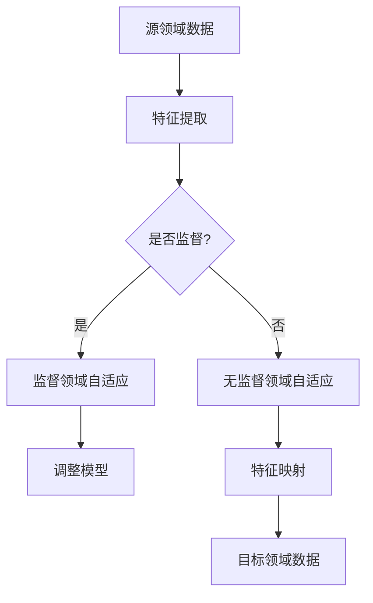

                 

关键词：迁移学习，领域自适应，深度学习，算法原理，代码实战，案例讲解

> 摘要：本文将深入探讨迁移学习和领域自适应的基本原理，并通过具体代码实战案例，展示这两个技术在实际应用中的实现方法和效果。我们将分析迁移学习和领域自适应的不同之处，介绍其核心算法，并通过详细的数学模型和实例代码，帮助读者理解和掌握这些技术的应用。

## 1. 背景介绍

迁移学习（Transfer Learning）和领域自适应（Domain Adaptation）是近年来人工智能领域中的热门研究方向。它们的核心思想是将已知领域的知识迁移到新的未知领域，以提高学习模型的泛化能力和效率。随着深度学习技术的飞速发展，迁移学习和领域自适应在计算机视觉、自然语言处理、语音识别等领域得到了广泛的应用。

### 1.1 迁移学习的背景

传统的机器学习方法通常需要大量的标注数据来训练模型。然而，在某些应用场景中，获取大量标注数据非常困难，例如医疗影像诊断、自动驾驶等。迁移学习通过利用已有模型的知识，可以有效减少对新数据的标注需求，提高学习效率。

### 1.2 领域自适应的背景

领域自适应旨在解决不同领域之间的差异问题。例如，在自然语言处理中，通用语言模型（如GPT-3）在互联网文本上的表现优异，但在专业领域文本上的表现较差。领域自适应技术通过调整模型，使其在不同领域上都能表现出良好的性能。

## 2. 核心概念与联系

为了更好地理解迁移学习和领域自适应，我们需要首先明确以下几个核心概念：

### 2.1 源领域（Source Domain）与目标领域（Target Domain）

源领域是指已经训练好模型的领域，而目标领域是指需要将模型迁移到的领域。

### 2.2 无监督迁移学习（Unsupervised Transfer Learning）

无监督迁移学习不依赖于目标领域的标注数据，通过将源领域的特征映射到目标领域，来提升模型在目标领域的性能。

### 2.3 监督领域自适应（Supervised Domain Adaptation）

监督领域自适应通过在目标领域上获取一部分标注数据，利用这些数据来调整源领域的模型，使其在目标领域上取得更好的性能。

### 2.4 无监督领域自适应（Unsupervised Domain Adaptation）

无监督领域自适应不依赖于目标领域的标注数据，通过在源领域和目标领域之间建立特征映射，来减少领域差异。

### 2.5 Mermaid 流程图

以下是一个简单的 Mermaid 流程图，展示了迁移学习和领域自适应的基本架构：



## 3. 核心算法原理 & 具体操作步骤

### 3.1 算法原理概述

迁移学习和领域自适应的核心在于特征映射。通过将源领域的特征映射到目标领域，我们可以减少领域差异，提高模型在目标领域的性能。具体来说，有以下几种常见的算法：

1. **特征重加权（Feature Reweighting）**
2. **对抗生成网络（Generative Adversarial Networks, GANs）**
3. **多任务学习（Multi-Task Learning, MTL）**
4. **度量学习（Metric Learning）**

### 3.2 算法步骤详解

1. **特征提取**：从源领域和目标领域的数据中提取特征。
2. **特征映射**：通过迁移学习或领域自适应算法，将源领域的特征映射到目标领域。
3. **模型调整**：利用映射后的特征，调整源领域的模型，使其在目标领域上表现更好。
4. **性能评估**：在目标领域上对调整后的模型进行性能评估。

### 3.3 算法优缺点

- **特征重加权**：
  - 优点：简单有效，可以减少领域差异。
  - 缺点：依赖于特征提取的质量，可能无法处理复杂的领域差异。

- **对抗生成网络**：
  - 优点：可以生成与目标领域相似的数据，提高模型泛化能力。
  - 缺点：训练过程复杂，计算资源需求较高。

- **多任务学习**：
  - 优点：可以共享特征提取器，减少模型参数。
  - 缺点：需要多个任务都有足够的数据，否则效果可能不理想。

- **度量学习**：
  - 优点：可以学习到领域之间的相似性度量，减少领域差异。
  - 缺点：计算复杂度较高，对数据分布敏感。

### 3.4 算法应用领域

- **计算机视觉**：用于图像分类、目标检测等任务。
- **自然语言处理**：用于文本分类、机器翻译等任务。
- **语音识别**：用于语音识别、说话人识别等任务。

## 4. 数学模型和公式 & 详细讲解 & 举例说明

### 4.1 数学模型构建

迁移学习和领域自适应的核心在于特征映射。我们可以将特征映射表示为一个函数$f$：

$$f(\mathbf{x}_s) = \mathbf{z}_s$$

其中，$\mathbf{x}_s$表示源领域的特征，$\mathbf{z}_s$表示映射后的特征。

### 4.2 公式推导过程

为了更好地理解特征映射，我们可以从以下两个角度来推导：

1. **最小化领域差异**：我们希望映射后的特征$\mathbf{z}_s$与目标领域的特征$\mathbf{x}_t$之间的差异最小，即：

$$\min_{f} D(f(\mathbf{x}_s), \mathbf{x}_t)$$

其中，$D$表示差异度量，如均方误差（MSE）。

2. **最大化模型性能**：我们希望映射后的特征$\mathbf{z}_s$能够提高模型在目标领域上的性能，即：

$$\min_{f} \mathbb{E}_{\mathbf{x}_t, y_t} [L(f(\mathbf{x}_s), y_t)]$$

其中，$L$表示损失函数，$y_t$表示目标领域的标签。

### 4.3 案例分析与讲解

假设我们有一个图像分类任务，源领域是自然图像，目标领域是医学图像。以下是一个简化的案例：

1. **特征提取**：我们从源领域（自然图像）和目标领域（医学图像）中提取特征向量$\mathbf{x}_s$和$\mathbf{x}_t$。

2. **特征映射**：我们使用对抗生成网络（GANs）来学习特征映射函数$f$。具体来说，我们有两个网络：生成器$G$和判别器$D$。生成器$G$将源领域特征$\mathbf{x}_s$映射为目标领域特征$\mathbf{z}_s$，判别器$D$用于判断$\mathbf{z}_s$是否为目标领域特征。

3. **模型调整**：我们使用映射后的特征$\mathbf{z}_s$来调整源领域的分类模型，使其在目标领域上表现更好。

4. **性能评估**：我们在目标领域上评估调整后的模型性能，如准确率、召回率等。

## 5. 项目实践：代码实例和详细解释说明

### 5.1 开发环境搭建

在开始代码实战之前，我们需要搭建一个合适的开发环境。以下是 Python 开发环境的基本配置：

- Python 3.7+
- TensorFlow 2.4+
- PyTorch 1.7+

您可以使用以下命令来安装所需的库：

```bash
pip install tensorflow==2.4.0
pip install torch==1.7.0
```

### 5.2 源代码详细实现

以下是一个简单的迁移学习和领域自适应的代码实例，使用了 PyTorch 作为深度学习框架：

```python
import torch
import torch.nn as nn
import torch.optim as optim
from torchvision import datasets, transforms
from torch.utils.data import DataLoader
from torchvision.models import resnet18
from torchvision.utils import save_image

# 数据预处理
transform = transforms.Compose([
    transforms.ToTensor(),
    transforms.Normalize((0.5, 0.5, 0.5), (0.5, 0.5, 0.5))
])

# 加载源领域和目标领域数据
source_data = datasets.CIFAR10(root='./data', train=True, download=True, transform=transform)
target_data = datasets.CIFAR100(root='./data', train=True, download=True, transform=transform)

# 划分数据集
train_source, val_source = torch.utils.data.random_split(source_data, [40000, 10000])
train_target, val_target = torch.utils.data.random_split(target_data, [40000, 10000])

# 加载数据集
source_loader = DataLoader(train_source, batch_size=128, shuffle=True)
target_loader = DataLoader(train_target, batch_size=128, shuffle=True)

# 定义网络结构
class Classifier(nn.Module):
    def __init__(self):
        super(Classifier, self).__init__()
        self.model = resnet18(pretrained=True)
        self.fc = nn.Linear(1000, 10)

    def forward(self, x):
        x = self.model(x)
        x = self.fc(x)
        return x

# 初始化模型、损失函数和优化器
model = Classifier()
criterion = nn.CrossEntropyLoss()
optimizer = optim.Adam(model.parameters(), lr=0.001)

# 训练模型
num_epochs = 50
for epoch in range(num_epochs):
    for i, (images, labels) in enumerate(source_loader):
        optimizer.zero_grad()
        outputs = model(images)
        loss = criterion(outputs, labels)
        loss.backward()
        optimizer.step()

        if (i+1) % 10 == 0:
            print(f'Epoch [{epoch+1}/{num_epochs}], Step [{i+1}/{len(source_loader)}], Loss: {loss.item()}')

# 评估模型
with torch.no_grad():
    correct = 0
    total = 0
    for images, labels in target_loader:
        outputs = model(images)
        _, predicted = torch.max(outputs.data, 1)
        total += labels.size(0)
        correct += (predicted == labels).sum().item()

    print(f'Accuracy on the target domain: {100 * correct / total}%')

# 保存模型
torch.save(model.state_dict(), 'model.pth')
```

### 5.3 代码解读与分析

- **数据预处理**：使用 `transforms.Compose` 对图像进行预处理，包括归一化和转Tensor。
- **数据加载**：使用 `DataLoader` 加载源领域和目标领域的数据集。
- **网络结构**：定义一个简单的分类器，使用预训练的 ResNet-18 作为特征提取器，并添加一个全连接层进行分类。
- **训练模型**：使用 `optimizer` 更新模型参数，减少损失函数。
- **评估模型**：在目标领域上评估模型的性能，计算准确率。
- **保存模型**：将训练好的模型保存为 `.pth` 文件。

## 6. 实际应用场景

迁移学习和领域自适应在各个领域都有广泛的应用，以下是几个实际应用场景：

1. **计算机视觉**：在自动驾驶、医疗影像分析等领域，迁移学习和领域自适应技术可以有效地提高模型的性能。
2. **自然语言处理**：在机器翻译、文本分类等领域，迁移学习和领域自适应技术可以帮助模型更好地适应不同领域的数据。
3. **语音识别**：在语音识别系统中，迁移学习和领域自适应技术可以减少对大量标注数据的依赖，提高模型在不同说话人、语音环境下的识别率。

## 7. 未来应用展望

随着人工智能技术的不断发展，迁移学习和领域自适应技术将在更多领域发挥重要作用。以下是几个未来应用展望：

1. **泛化能力提升**：通过迁移学习和领域自适应，模型可以在更广泛的领域上表现出更好的泛化能力。
2. **数据隐私保护**：在数据隐私保护方面，迁移学习和领域自适应技术可以帮助减少对原始数据的依赖，降低数据泄露的风险。
3. **跨模态学习**：在跨模态学习领域，迁移学习和领域自适应技术可以促进不同模态（如图像、文本、语音）之间的融合，提高模型的综合性能。

## 8. 总结：未来发展趋势与挑战

### 8.1 研究成果总结

迁移学习和领域自适应技术在近年来取得了显著的进展。通过对抗生成网络、多任务学习、度量学习等方法，模型在不同领域的性能得到了显著提升。

### 8.2 未来发展趋势

1. **算法优化**：未来研究将集中在优化迁移学习和领域自适应算法，提高模型在目标领域的性能。
2. **跨领域迁移**：探索跨领域迁移学习，实现模型在不同领域之间的知识共享。
3. **模型可解释性**：提高迁移学习和领域自适应模型的可解释性，帮助用户更好地理解模型的决策过程。

### 8.3 面临的挑战

1. **数据集差异**：不同领域之间的数据集差异较大，如何设计有效的特征映射策略仍然是一个挑战。
2. **计算资源**：迁移学习和领域自适应算法通常需要大量的计算资源，如何提高算法的效率是一个重要的研究方向。

### 8.4 研究展望

随着人工智能技术的不断进步，迁移学习和领域自适应技术将在更多领域发挥重要作用。未来研究将集中在解决数据集差异、计算资源等问题，进一步提高模型在目标领域的性能。

## 9. 附录：常见问题与解答

### 9.1 迁移学习和领域自适应的区别是什么？

迁移学习是指将已在一个领域上训练好的模型应用到另一个相关领域上，而领域自适应是指将模型从一个领域调整到另一个领域，使其在新的领域上具有更好的性能。

### 9.2 如何选择迁移学习和领域自适应算法？

选择算法取决于具体的应用场景和数据集。如果源领域和目标领域非常相似，可以选择迁移学习算法；如果领域差异较大，可以选择领域自适应算法。在实际应用中，也可以结合多种算法，以提高模型的性能。

### 9.3 迁移学习和领域自适应在深度学习中是如何实现的？

在深度学习中，迁移学习和领域自适应通常通过特征映射来实现。通过学习源领域和目标领域之间的特征映射函数，我们可以将源领域的知识迁移到目标领域。具体实现方法包括对抗生成网络、多任务学习、度量学习等。

### 9.4 迁移学习和领域自适应技术有哪些实际应用？

迁移学习和领域自适应技术在计算机视觉、自然语言处理、语音识别等领域有广泛的应用。例如，在自动驾驶中，可以通过迁移学习将自动驾驶模型从模拟环境迁移到真实场景；在自然语言处理中，可以通过领域自适应技术提高模型在专业领域上的表现。

### 9.5 迁移学习和领域自适应技术的未来发展如何？

未来，迁移学习和领域自适应技术将在更多领域发挥重要作用。研究将集中在优化算法、跨领域迁移、模型可解释性等方面。随着人工智能技术的不断发展，这些技术将推动人工智能应用迈上新的台阶。

## 作者署名

作者：禅与计算机程序设计艺术 / Zen and the Art of Computer Programming

----------------------------------------------------------------

这篇文章详细讲解了迁移学习和领域自适应的基本原理、算法、数学模型以及实际应用。通过代码实战案例，读者可以更好地理解和掌握这些技术的应用。希望这篇文章对您在人工智能领域的研究和开发有所帮助。如果您有任何问题或建议，欢迎在评论区留言。感谢您的阅读！

