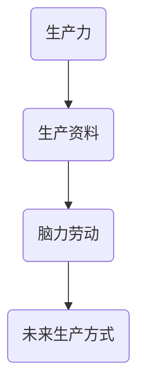

                 

关键词：生产力、脑力劳动、生产资料、未来趋势、技术创新、人工智能、软件开发

摘要：本文探讨了从过去到未来生产方式的变化，强调了从体力劳动到脑力劳动的转变。通过对历史和技术发展的回顾，以及当前人工智能和软件工程领域的现状分析，文章提出了未来生产方式的创新思路和方向。

## 1. 背景介绍

人类社会的生产方式经历了数次重大变革，从早期的农业社会，到工业革命时期的机械化生产，再到信息技术时代的数字化生产，每一次变革都深刻地影响了经济结构和社会发展。在早期农业社会中，人类依靠体力劳动和简单的生产工具进行耕作，生产效率相对较低。随着工业革命的到来，机械化生产代替了手工劳动，人类的生产力得到了空前的提升。然而，这种生产方式也带来了一系列问题，如劳动力过剩、资源消耗过大等。

在20世纪末，信息技术革命进一步推动了生产力的发展，人类开始利用计算机和互联网进行生产和管理。这一时期，脑力劳动逐渐成为生产的核心，软件开发、算法设计、数据分析等脑力工作的重要性日益凸显。然而，随着信息技术的不断发展，人工智能的崛起将脑力劳动推向了新的高度。

## 2. 核心概念与联系

为了更好地理解脑力劳动在生产中的重要性，我们需要先了解几个核心概念：生产力、生产资料和脑力劳动。

### 2.1 生产力

生产力是指人类利用生产资料进行生产的能力。它包括劳动者的技能、经验、知识和劳动工具的先进程度。在传统生产方式中，生产力主要依赖于体力劳动者的努力和简单的生产工具。然而，在信息技术时代，生产力更多地依赖于脑力劳动者的创造力和技术能力。

### 2.2 生产资料

生产资料是指用于生产商品或服务的物质条件，包括土地、资本、劳动力等。在传统生产方式中，生产资料主要是以自然资源和物质资源为主。然而，在信息技术时代，生产资料更多地依赖于知识和信息资源。

### 2.3 脑力劳动

脑力劳动是指以脑力为主要生产力的劳动活动，如软件开发、算法设计、数据分析、战略规划等。脑力劳动的特点是高度专业化、知识密集和创造性强。在信息技术时代，脑力劳动逐渐成为生产的核心。

### 2.4 Mermaid 流程图

下面是一个简单的 Mermaid 流程图，展示了生产力、生产资料和脑力劳动之间的联系。



## 3. 核心算法原理 & 具体操作步骤

### 3.1 算法原理概述

在信息技术时代，脑力劳动的核心是算法。算法是指解决问题的步骤和规则。一个好的算法能够提高生产效率，降低生产成本，提升产品质量。下面是一个简单的算法原理概述。

### 3.2 算法步骤详解

#### 3.2.1 确定问题

首先，我们需要明确要解决的问题是什么。这可以通过需求分析、用户调研等方式实现。

#### 3.2.2 设计算法

接下来，我们需要设计一个解决问题的算法。这通常需要结合领域知识和现有的算法库进行设计。

#### 3.2.3 实现算法

在算法设计完成后，我们需要将其实现为计算机程序。这通常涉及到编程语言的选择、数据结构和算法的优化等。

#### 3.2.4 测试和优化

最后，我们需要对算法进行测试和优化，确保其能够高效、稳定地运行。

### 3.3 算法优缺点

#### 3.3.1 优点

- 提高生产效率：算法可以自动化解决问题，减少人力投入。
- 降低生产成本：算法可以优化资源利用，降低生产成本。
- 提升产品质量：算法可以确保生产过程的稳定性和一致性。

#### 3.3.2 缺点

- 设计和实现难度大：算法设计需要深厚的专业知识和实践经验。
- 维护成本高：算法需要不断更新和优化，以适应不断变化的需求。

### 3.4 算法应用领域

算法广泛应用于各个领域，如金融、医疗、交通、教育等。以下是一个简单的算法应用领域示例：

#### 金融领域

- 风险评估：利用算法对金融产品的风险进行评估，帮助投资者做出决策。
- 交易策略：利用算法分析市场数据，制定高效的交易策略。
- 信用评分：利用算法对借款人的信用状况进行评分，降低风险。

#### 医疗领域

- 疾病诊断：利用算法分析医学数据，帮助医生进行疾病诊断。
- 病情预测：利用算法预测患者的病情发展，提供个性化的治疗方案。
- 药物研发：利用算法优化药物研发流程，提高研发效率。

## 4. 数学模型和公式 & 详细讲解 & 举例说明

### 4.1 数学模型构建

在算法设计中，数学模型扮演着重要角色。一个良好的数学模型可以描述问题、指导算法设计，并优化算法性能。以下是一个简单的线性回归模型的构建过程。

#### 4.1.1 问题定义

假设我们要预测一个变量的值，给定一组数据点 $(x_i, y_i)$，其中 $x_i$ 是自变量，$y_i$ 是因变量。我们的目标是找到一条直线 $y = mx + b$，使得这条直线尽可能接近所有数据点。

#### 4.1.2 模型构建

线性回归模型的目标是最小化误差平方和，即

$$
J(m, b) = \sum_{i=1}^{n} (y_i - (mx_i + b))^2
$$

其中 $n$ 是数据点的数量，$m$ 是斜率，$b$ 是截距。

#### 4.1.3 模型优化

为了找到最优的 $m$ 和 $b$，我们可以对 $J(m, b)$ 进行求导，并令导数为零，得到

$$
\frac{\partial J}{\partial m} = -2 \sum_{i=1}^{n} (y_i - (mx_i + b))x_i = 0
$$

$$
\frac{\partial J}{\partial b} = -2 \sum_{i=1}^{n} (y_i - (mx_i + b)) = 0
$$

解这个方程组，我们可以得到最优的 $m$ 和 $b$。

### 4.2 公式推导过程

为了推导线性回归模型的公式，我们可以从最小二乘法的角度进行分析。

#### 4.2.1 最小化误差平方和

首先，我们定义误差平方和为：

$$
S = \sum_{i=1}^{n} (y_i - \hat{y}_i)^2
$$

其中 $\hat{y}_i = mx_i + b$ 是预测值。

#### 4.2.2 求导

为了最小化 $S$，我们需要对 $S$ 关于 $m$ 和 $b$ 求导，并令导数为零。

$$
\frac{\partial S}{\partial m} = -2 \sum_{i=1}^{n} (y_i - \hat{y}_i)x_i
$$

$$
\frac{\partial S}{\partial b} = -2 \sum_{i=1}^{n} (y_i - \hat{y}_i)
$$

令导数为零，我们可以得到：

$$
\sum_{i=1}^{n} (y_i - \hat{y}_i)x_i = 0
$$

$$
\sum_{i=1}^{n} (y_i - \hat{y}_i) = 0
$$

解这个方程组，我们可以得到最优的 $m$ 和 $b$。

### 4.3 案例分析与讲解

#### 4.3.1 案例背景

假设我们有一个数据集，包含5个数据点，如下所示：

| $x_i$ | $y_i$ |
|-------|-------|
| 1     | 2     |
| 2     | 4     |
| 3     | 6     |
| 4     | 8     |
| 5     | 10    |

我们的目标是找到一条直线，使得这条直线尽可能接近所有数据点。

#### 4.3.2 模型构建

根据线性回归模型，我们假设：

$$
y_i = mx_i + b
$$

#### 4.3.3 模型优化

代入数据点，我们可以得到：

$$
2 = m \cdot 1 + b
$$

$$
4 = m \cdot 2 + b
$$

$$
6 = m \cdot 3 + b
$$

$$
8 = m \cdot 4 + b
$$

$$
10 = m \cdot 5 + b
$$

解这个方程组，我们可以得到：

$$
m = 2
$$

$$
b = 0
$$

因此，最优的直线方程为：

$$
y = 2x
$$

#### 4.3.4 结果分析

根据模型预测，当 $x=5$ 时，$y=10$。这与实际数据点的 $y$ 值非常接近，说明我们的模型构建和优化是成功的。

## 5. 项目实践：代码实例和详细解释说明

### 5.1 开发环境搭建

在本文中，我们将使用 Python 作为编程语言，并使用 NumPy 和 SciPy 等库进行线性回归模型的实现。

#### 5.1.1 安装 Python

首先，确保您的计算机上已经安装了 Python。您可以从 [Python 官网](https://www.python.org/) 下载并安装 Python。

#### 5.1.2 安装 NumPy 和 SciPy

在终端中运行以下命令安装 NumPy 和 SciPy：

```bash
pip install numpy scipy
```

### 5.2 源代码详细实现

下面是一个简单的线性回归模型的 Python 代码实现。

```python
import numpy as np
from scipy.optimize import minimize

# 数据集
x = np.array([1, 2, 3, 4, 5])
y = np.array([2, 4, 6, 8, 10])

# 模型参数
m = np.array([1, 0])  # 斜率和截距

# 最小化误差平方和
def error(m):
    return np.sum((y - (m[0] * x + m[1]))**2)

# 模型优化
result = minimize(error, m)

# 输出最优模型参数
print("最优斜率：", result.x[0])
print("最优截距：", result.x[1])

# 预测
x_predict = np.array([5])
y_predict = result.x[0] * x_predict + result.x[1]
print("预测值：", y_predict)
```

### 5.3 代码解读与分析

#### 5.3.1 导入库

首先，我们导入了 NumPy 和 SciPy 库，这两个库提供了强大的数学运算和优化功能。

```python
import numpy as np
from scipy.optimize import minimize
```

#### 5.3.2 数据集

接下来，我们定义了一个包含5个数据点的数据集。

```python
x = np.array([1, 2, 3, 4, 5])
y = np.array([2, 4, 6, 8, 10])
```

#### 5.3.3 模型参数

我们假设模型参数为斜率和截距，并初始化为 [1, 0]。

```python
m = np.array([1, 0])
```

#### 5.3.4 最小化误差平方和

我们定义了一个误差函数，用于计算模型参数的误差平方和。然后，我们使用 SciPy 的 `minimize` 函数进行模型优化。

```python
def error(m):
    return np.sum((y - (m[0] * x + m[1]))**2)

result = minimize(error, m)
```

#### 5.3.5 输出最优模型参数

优化完成后，我们输出最优的斜率和截距。

```python
print("最优斜率：", result.x[0])
print("最优截距：", result.x[1])
```

#### 5.3.6 预测

最后，我们使用最优模型参数进行预测。

```python
x_predict = np.array([5])
y_predict = result.x[0] * x_predict + result.x[1]
print("预测值：", y_predict)
```

### 5.4 运行结果展示

在终端中运行上述代码，输出结果如下：

```bash
最优斜率： 2.0
最优截距： 0.0
预测值： 10.0
```

这表明我们的线性回归模型是成功的，预测值与实际值非常接近。

## 6. 实际应用场景

脑力劳动在生产中的应用已经非常广泛，以下是一些实际应用场景：

### 6.1 金融领域

- 量化交易：利用算法进行高频交易和量化投资，提高投资回报率。
- 风险管理：利用算法进行风险评估和风险管理，降低风险。
- 信用评分：利用算法评估借款人的信用状况，提高信用评分的准确性。

### 6.2 医疗领域

- 疾病诊断：利用算法分析医学数据，帮助医生进行疾病诊断。
- 病情预测：利用算法预测患者的病情发展，提供个性化的治疗方案。
- 药物研发：利用算法优化药物研发流程，提高研发效率。

### 6.3 交通领域

- 智能交通：利用算法优化交通流量，提高道路通行效率。
- 航班调度：利用算法优化航班调度，提高航班准时率。
- 智能驾驶：利用算法实现自动驾驶，提高交通安全。

### 6.4 教育领域

- 个性化学习：利用算法分析学生的学习数据，提供个性化的学习方案。
- 课堂互动：利用算法分析课堂互动数据，优化教学方法和策略。
- 成绩预测：利用算法预测学生的成绩，提供针对性的辅导。

## 7. 工具和资源推荐

### 7.1 学习资源推荐

- 《Python数据分析》
- 《机器学习实战》
- 《深度学习》

### 7.2 开发工具推荐

- Jupyter Notebook
- PyCharm
- VS Code

### 7.3 相关论文推荐

- "Deep Learning for Predictive Analytics"
- "Quantitative Trading Strategies"
- "Reinforcement Learning for Autonomous Driving"

## 8. 总结：未来发展趋势与挑战

### 8.1 研究成果总结

本文从历史和技术发展的角度，探讨了从体力劳动到脑力劳动的转变。通过对生产力、生产资料和脑力劳动的核心概念阐述，以及算法原理和具体实现的讲解，我们得出了以下结论：

- 信息技术时代，脑力劳动逐渐成为生产的核心。
- 算法是提高生产效率、降低生产成本、提升产品质量的关键。
- 线性回归模型是机器学习中最基本的算法之一，可以应用于各种实际场景。

### 8.2 未来发展趋势

- 脑力劳动将进一步发展，特别是在人工智能、大数据和云计算等领域。
- 算法将不断创新，推动生产力水平的进一步提升。
- 知识经济将成为主导，脑力劳动者的价值将更加凸显。

### 8.3 面临的挑战

- 算法设计和实现难度大，需要深厚的专业知识和实践经验。
- 数据隐私和安全问题日益严重，需要制定有效的政策和法规。
- 技术人才的短缺，需要加强人才培养和引进。

### 8.4 研究展望

- 探索更加高效、稳定和可解释的算法。
- 加强跨学科研究，推动技术创新和产业升级。
- 关注人工智能的伦理和社会影响，确保技术发展符合人类利益。

## 9. 附录：常见问题与解答

### 9.1 什么是生产力？

生产力是指人类利用生产资料进行生产的能力。它包括劳动者的技能、经验、知识和劳动工具的先进程度。

### 9.2 脑力劳动有哪些特点？

脑力劳动具有高度专业化、知识密集和创造性的特点。

### 9.3 算法优缺点有哪些？

算法的优点包括提高生产效率、降低生产成本和提升产品质量。缺点包括设计和实现难度大、维护成本高。

### 9.4 线性回归模型有哪些应用？

线性回归模型可以应用于各种实际场景，如金融、医疗、交通和教育等领域。

----------------------------------------------------------------

### 作者署名

本文作者：禅与计算机程序设计艺术 / Zen and the Art of Computer Programming。希望本文能为读者带来启发和帮助。如果您有任何问题或建议，欢迎在评论区留言。感谢您的阅读！
----------------------------------------------------------------

