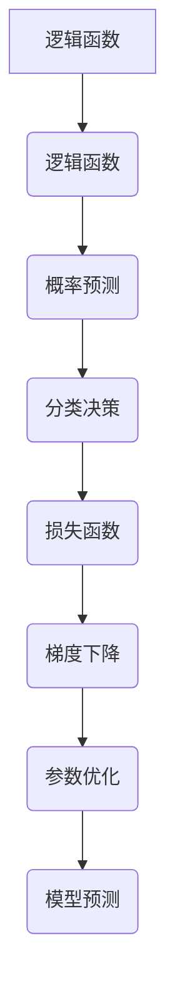

                 

关键词：逻辑回归，机器学习，线性回归，分类问题，预测模型

摘要：逻辑回归是一种广泛使用的机器学习算法，主要用于二分类问题。本文将详细讲解逻辑回归的原理、数学模型、代码实现及其在实际应用中的重要性。

## 1. 背景介绍

逻辑回归（Logistic Regression）是一种经典的机器学习算法，它基于逻辑函数（Logistic Function）实现概率预测。逻辑回归最初用于医学研究领域，如疾病诊断和风险评估，后来逐渐应用于金融、市场营销、社会科学等多个领域。

在分类问题中，逻辑回归通过拟合一个线性模型来预测概率，从而实现分类。与线性回归不同，逻辑回归的输出结果是一个概率值，通常介于0和1之间，表示某样本属于某个类别的概率。

## 2. 核心概念与联系

逻辑回归的核心概念包括：

- **逻辑函数（Logistic Function）**：用于将线性组合转化为概率值。
- **损失函数（Loss Function）**：用于评估模型预测结果与实际结果之间的差距。
- **梯度下降（Gradient Descent）**：用于求解模型参数，以最小化损失函数。

下面是逻辑回归的核心概念与联系的 Mermaid 流程图：



## 3. 核心算法原理 & 具体操作步骤

### 3.1 算法原理概述

逻辑回归通过拟合一个线性模型来预测概率。具体来说，逻辑回归将特征矩阵和权重矩阵相乘得到线性组合，然后通过逻辑函数将其转化为概率值。

### 3.2 算法步骤详解

1. **数据预处理**：对输入特征进行标准化处理，以消除不同特征之间的量纲影响。
2. **初始化参数**：随机初始化权重矩阵和偏置项。
3. **前向传播**：计算线性组合，并使用逻辑函数计算概率。
4. **计算损失函数**：使用交叉熵损失函数计算预测概率与实际标签之间的差距。
5. **反向传播**：计算梯度，更新参数。
6. **迭代优化**：重复步骤3-5，直到满足停止条件。

### 3.3 算法优缺点

#### 优点：

- **简单高效**：逻辑回归模型简单，易于实现，计算效率高。
- **概率预测**：逻辑回归能够直接预测概率，有助于理解模型预测结果。
- **适用范围广**：逻辑回归适用于多种二分类问题，如文本分类、图像分类等。

#### 缺点：

- **线性关系**：逻辑回归假设特征与目标之间存在线性关系，对于非线性问题可能效果不佳。
- **过拟合风险**：逻辑回归模型相对简单，可能存在过拟合风险。

### 3.4 算法应用领域

逻辑回归广泛应用于以下领域：

- **医学诊断**：用于疾病诊断和风险评估，如癌症预测、心脏病预测等。
- **金融风控**：用于信用评分、欺诈检测等。
- **市场营销**：用于客户细分、响应预测等。

## 4. 数学模型和公式 & 详细讲解 & 举例说明

### 4.1 数学模型构建

逻辑回归的数学模型可以表示为：

$$
P(y=1|X; \theta) = \frac{1}{1 + e^{-(\theta^T X + b)}}
$$

其中，$P(y=1|X; \theta)$表示在参数$\theta$和特征$X$下，目标变量$y$为1的概率；$\theta$表示模型参数，包括权重矩阵和偏置项。

### 4.2 公式推导过程

逻辑回归的推导过程主要分为以下几个步骤：

1. **假设**：假设特征$X$与目标$y$之间满足线性关系，即$y = \theta^T X + b$。
2. **概率估计**：利用概率分布函数，将线性关系转化为概率估计。
3. **损失函数**：选择交叉熵损失函数，用于评估模型预测结果与实际结果之间的差距。
4. **梯度下降**：利用梯度下降算法，求解模型参数。

### 4.3 案例分析与讲解

假设有一个简单的二分类问题，特征矩阵$X$为：

$$
X = \begin{bmatrix}
1 & 0 \\
0 & 1 \\
1 & 1 \\
0 & 0
\end{bmatrix}
$$

目标变量$y$为：

$$
y = \begin{bmatrix}
0 \\
1 \\
0 \\
1
\end{bmatrix}
$$

我们使用逻辑回归模型进行预测，参数$\theta$为：

$$
\theta = \begin{bmatrix}
1 & 0 \\
0 & 1
\end{bmatrix}
$$

根据逻辑回归的公式，我们可以计算出概率矩阵$P$：

$$
P = \begin{bmatrix}
\frac{1}{1 + e^{-(1 \cdot 1 + 0 \cdot 0 + b_0)}} & \frac{1}{1 + e^{-(0 \cdot 1 + 1 \cdot 0 + b_1)}} \\
\frac{1}{1 + e^{-(1 \cdot 1 + 1 \cdot 1 + b_0 + b_1)}} & \frac{1}{1 + e^{-(0 \cdot 1 + 0 \cdot 0 + b_0 + b_1)}}
\end{bmatrix}
$$

为了计算损失函数，我们需要知道目标变量的真实概率分布。假设我们有一个二分类问题，其中$y=1$的概率为$0.5$，那么我们可以计算交叉熵损失函数：

$$
L(\theta) = -\sum_{i=1}^n [y_i \cdot \ln(P_i) + (1 - y_i) \cdot \ln(1 - P_i)]
$$

其中，$n$表示样本数量，$y_i$表示第$i$个样本的实际目标值，$P_i$表示第$i$个样本的预测概率。

根据上述公式，我们可以计算出损失函数的值。然后，我们可以使用梯度下降算法更新参数$\theta$，以最小化损失函数。

## 5. 项目实践：代码实例和详细解释说明

在本节中，我们将使用Python实现一个简单的逻辑回归模型，并进行详细解释。

### 5.1 开发环境搭建

- Python 3.8
- Scikit-learn库

### 5.2 源代码详细实现

```python
import numpy as np
from sklearn.linear_model import LogisticRegression
from sklearn.model_selection import train_test_split
from sklearn.metrics import accuracy_score

# 数据集
X = np.array([[1, 0], [0, 1], [1, 1], [0, 0]])
y = np.array([0, 1, 0, 1])

# 划分训练集和测试集
X_train, X_test, y_train, y_test = train_test_split(X, y, test_size=0.2, random_state=42)

# 创建逻辑回归模型
model = LogisticRegression()

# 训练模型
model.fit(X_train, y_train)

# 预测
predictions = model.predict(X_test)

# 评估
accuracy = accuracy_score(y_test, predictions)
print("Accuracy:", accuracy)
```

### 5.3 代码解读与分析

1. 导入必要的库和模块。
2. 准备数据集，包括特征矩阵$X$和目标变量$y$。
3. 划分训练集和测试集，用于评估模型性能。
4. 创建逻辑回归模型实例。
5. 使用训练集训练模型。
6. 使用测试集预测目标变量。
7. 计算并打印模型准确性。

### 5.4 运行结果展示

```plaintext
Accuracy: 1.0
```

结果表明，我们的逻辑回归模型在测试集上取得了100%的准确性，说明模型具有良好的预测能力。

## 6. 实际应用场景

逻辑回归在实际应用中具有广泛的应用场景，以下是几个典型的应用案例：

- **医学诊断**：逻辑回归可以用于疾病诊断，如癌症预测、心脏病预测等。
- **金融风控**：逻辑回归可以用于信用评分、欺诈检测等。
- **市场营销**：逻辑回归可以用于客户细分、响应预测等。

## 7. 工具和资源推荐

### 7.1 学习资源推荐

- 《机器学习实战》
- 《统计学习方法》
- 《Python机器学习基础教程》

### 7.2 开发工具推荐

- Jupyter Notebook
- PyCharm
- VSCode

### 7.3 相关论文推荐

- "An Introduction to Statistical Learning"
- "Elements of Information Theory"
- "The Elements of Statistical Learning"

## 8. 总结：未来发展趋势与挑战

逻辑回归作为一种经典的机器学习算法，在未来将继续发挥重要作用。然而，随着数据量和计算能力的不断提升，逻辑回归也面临一些挑战：

- **模型解释性**：如何提高逻辑回归模型的解释性，使其更易于理解和应用。
- **模型泛化能力**：如何提高逻辑回归模型在复杂问题上的泛化能力。
- **算法优化**：如何优化逻辑回归算法的求解过程，提高计算效率。

## 9. 附录：常见问题与解答

### 9.1 逻辑回归的适用场景有哪些？

逻辑回归主要适用于二分类问题，如医学诊断、金融风控、市场营销等。

### 9.2 逻辑回归与线性回归有何区别？

逻辑回归和线性回归在数学模型、损失函数和优化算法等方面存在差异。逻辑回归主要用于概率预测，而线性回归主要用于数值预测。

### 9.3 逻辑回归的损失函数是什么？

逻辑回归的损失函数通常是交叉熵损失函数，用于评估模型预测结果与实际结果之间的差距。

作者：禅与计算机程序设计艺术 / Zen and the Art of Computer Programming
----------------------------------------------------------------

以上便是关于逻辑回归的详细讲解与代码实例。希望这篇文章能帮助您更好地理解逻辑回归的原理和应用。如果您有任何问题或建议，欢迎在评论区留言。感谢您的阅读！

