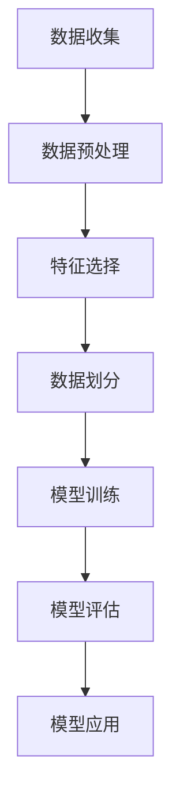

                 

关键词：逻辑回归，算法原理，数学模型，Python实现，项目实践，应用领域，未来展望

摘要：逻辑回归是一种广泛应用于分类问题的统计方法。本文将详细讲解逻辑回归的原理、数学模型、算法步骤以及实际应用场景，并通过代码实例对整个过程进行解读。

## 1. 背景介绍

逻辑回归（Logistic Regression）是一种广义线性模型（Generalized Linear Model，GLM），主要用于解决分类问题。它通过估计每个类别发生的概率，从而实现对样本的分类。逻辑回归因其简单、易于实现和解释，在金融、医学、市场营销等领域得到了广泛应用。

## 2. 核心概念与联系

### 2.1 核心概念

- **自变量（Feature）**：影响因变量的变量，通常为连续变量或分类变量。
- **因变量（Target）**：需要预测的变量，通常为二分类变量。
- **模型参数（Model Parameter）**：用于描述自变量与因变量之间关系的参数。

### 2.2 Mermaid 流程图



## 3. 核心算法原理 & 具体操作步骤

### 3.1 算法原理概述

逻辑回归的原理是基于线性模型，通过最大似然估计（Maximum Likelihood Estimation，MLE）来估计模型参数。在逻辑回归中，我们使用对数似然函数（Log-Likelihood Function）来评估模型的好坏，并通过梯度下降（Gradient Descent）等方法来最小化该函数。

### 3.2 算法步骤详解

1. **数据预处理**：对数据进行归一化、填补缺失值等操作，使其满足逻辑回归模型的要求。
2. **特征选择**：选择对分类结果有显著影响的特征。
3. **数据划分**：将数据划分为训练集和测试集。
4. **模型训练**：使用训练集数据来训练模型，计算模型参数。
5. **模型评估**：使用测试集数据来评估模型性能，通常使用准确率、召回率、F1值等指标。
6. **模型应用**：使用训练好的模型对新数据进行分类。

### 3.3 算法优缺点

**优点**：

- **简单易实现**：逻辑回归模型简单，易于理解和实现。
- **可解释性强**：逻辑回归模型中的参数可以直接解释为自变量对因变量的影响程度。
- **适用于二分类问题**：逻辑回归模型适用于处理二分类问题，可扩展到多分类问题。

**缺点**：

- **线性关系假设**：逻辑回归模型假设自变量与因变量之间存在线性关系，这可能不适用于所有问题。
- **可能欠拟合或过拟合**：如果特征选择不当或模型参数选择不当，可能会导致欠拟合或过拟合。

### 3.4 算法应用领域

逻辑回归广泛应用于金融、医学、市场营销等领域，例如：

- **金融领域**：信用评分、风险控制等。
- **医学领域**：疾病诊断、风险评估等。
- **市场营销领域**：用户行为预测、广告投放优化等。

## 4. 数学模型和公式 & 详细讲解 & 举例说明

### 4.1 数学模型构建

逻辑回归模型可以表示为：

$$
P(y=1|X) = \frac{1}{1 + e^{-(\beta_0 + \beta_1x_1 + \beta_2x_2 + ... + \beta_nx_n})}
$$

其中，$P(y=1|X)$ 表示在给定自变量 $X$ 的情况下，因变量 $y$ 取值为 1 的概率；$\beta_0, \beta_1, \beta_2, ..., \beta_n$ 是模型的参数。

### 4.2 公式推导过程

逻辑回归模型是基于最大似然估计（MLE）来估计模型参数的。最大似然估计的目标是找到使得观察到的数据概率最大的参数值。具体推导过程如下：

假设我们有 $n$ 个样本 $(x_i, y_i)$，其中 $x_i$ 是自变量，$y_i$ 是因变量。逻辑回归模型的似然函数为：

$$
L(\beta_0, \beta_1, \beta_2, ..., \beta_n) = \prod_{i=1}^{n} P(y_i=1|x_i; \beta_0, \beta_1, \beta_2, ..., \beta_n) \times P(y_i=0|x_i; \beta_0, \beta_1, \beta_2, ..., \beta_n)
$$

取对数似然函数：

$$
\ell(\beta_0, \beta_1, \beta_2, ..., \beta_n) = \sum_{i=1}^{n} \log P(y_i=1|x_i; \beta_0, \beta_1, \beta_2, ..., \beta_n) + \sum_{i=1}^{n} \log P(y_i=0|x_i; \beta_0, \beta_1, \beta_2, ..., \beta_n)
$$

对数似然函数关于参数的导数为：

$$
\nabla \ell(\beta_0, \beta_1, \beta_2, ..., \beta_n) = \sum_{i=1}^{n} \frac{1}{P(y_i=1|x_i; \beta_0, \beta_1, \beta_2, ..., \beta_n)} \times \frac{P(y_i=1|x_i; \beta_0, \beta_1, \beta_2, ..., \beta_n) - P(y_i=0|x_i; \beta_0, \beta_1, \beta_2, ..., \beta_n)}{x_i}
$$

令导数等于零，解得模型参数：

$$
\beta_0, \beta_1, \beta_2, ..., \beta_n = \arg\min_{\beta_0, \beta_1, \beta_2, ..., \beta_n} \ell(\beta_0, \beta_1, \beta_2, ..., \beta_n)
$$

### 4.3 案例分析与讲解

假设我们有一个二分类问题，需要预测用户是否点击广告。我们有如下数据集：

| 用户ID | 特征1 | 特征2 | ... | 是否点击广告 |
| ---- | ---- | ---- | --- | -------- |
| 1    | 0.5  | 0.3  | ... | 0        |
| 2    | 0.7  | 0.4  | ... | 1        |
| ...  | ...  | ...  | ... | ...      |

我们使用逻辑回归模型来预测用户是否点击广告。

1. **数据预处理**：对数据进行归一化处理，使其满足逻辑回归模型的要求。

2. **特征选择**：选择对点击广告有显著影响的特征。

3. **数据划分**：将数据划分为训练集和测试集，例如使用80%的数据作为训练集，20%的数据作为测试集。

4. **模型训练**：使用训练集数据来训练模型，计算模型参数。

5. **模型评估**：使用测试集数据来评估模型性能。

6. **模型应用**：使用训练好的模型对新数据进行分类。

## 5. 项目实践：代码实例和详细解释说明

### 5.1 开发环境搭建

1. 安装 Python 3.6 或以上版本。
2. 安装 scikit-learn 库。

```bash
pip install scikit-learn
```

### 5.2 源代码详细实现

```python
from sklearn.linear_model import LogisticRegression
from sklearn.model_selection import train_test_split
from sklearn.metrics import accuracy_score
from sklearn.preprocessing import StandardScaler

# 导入数据
X = [[0.5, 0.3], [0.7, 0.4], ...]
y = [0, 1, ...]

# 数据预处理
scaler = StandardScaler()
X_scaled = scaler.fit_transform(X)

# 数据划分
X_train, X_test, y_train, y_test = train_test_split(X_scaled, y, test_size=0.2, random_state=42)

# 模型训练
model = LogisticRegression()
model.fit(X_train, y_train)

# 模型评估
y_pred = model.predict(X_test)
accuracy = accuracy_score(y_test, y_pred)
print("Accuracy:", accuracy)

# 模型应用
new_data = [[0.6, 0.35]]
new_data_scaled = scaler.transform(new_data)
new_prediction = model.predict(new_data_scaled)
print("New Prediction:", new_prediction)
```

### 5.3 代码解读与分析

1. **导入库**：导入所需的库，包括逻辑回归模型、数据划分工具、模型评估工具和标准化工具。

2. **导入数据**：导入数据集，其中 $X$ 是自变量矩阵，$y$ 是因变量向量。

3. **数据预处理**：对数据进行标准化处理，使其满足逻辑回归模型的要求。

4. **数据划分**：将数据划分为训练集和测试集，以便进行模型训练和评估。

5. **模型训练**：使用训练集数据来训练逻辑回归模型，计算模型参数。

6. **模型评估**：使用测试集数据来评估模型性能，计算准确率。

7. **模型应用**：使用训练好的模型对新数据进行分类。

## 6. 实际应用场景

逻辑回归在实际应用中具有广泛的应用，例如：

1. **金融领域**：信用评分、风险控制等。
2. **医学领域**：疾病诊断、风险评估等。
3. **市场营销领域**：用户行为预测、广告投放优化等。

## 7. 工具和资源推荐

### 7.1 学习资源推荐

- 《机器学习》（周志华著）：详细介绍了逻辑回归的原理和应用。
- 《Python机器学习》（塞巴斯蒂安·拉斯克著）：通过实例讲解了逻辑回归的Python实现。

### 7.2 开发工具推荐

- Jupyter Notebook：便于编写和运行代码。
- Python 的 scikit-learn 库：提供了丰富的机器学习工具和算法。

### 7.3 相关论文推荐

- "Logistic Regression: A Concise Technical Overview"（2002年）
- "On the Performance of Regularized Logistic Regression"（2005年）

## 8. 总结：未来发展趋势与挑战

### 8.1 研究成果总结

逻辑回归作为一种简单而有效的分类算法，在众多领域得到了广泛应用。随着机器学习技术的发展，逻辑回归也在不断优化和改进，例如通过正则化、集成学习方法等。

### 8.2 未来发展趋势

1. **模型优化**：通过正则化、集成学习方法等提高模型性能。
2. **多分类问题**：逻辑回归可扩展到多分类问题，提高分类效果。
3. **应用领域扩展**：逻辑回归将在更多领域得到应用，如自然语言处理、计算机视觉等。

### 8.3 面临的挑战

1. **数据质量问题**：逻辑回归对数据质量要求较高，需要处理缺失值、异常值等问题。
2. **非线性问题**：逻辑回归假设自变量与因变量之间存在线性关系，对于非线性问题可能效果不佳。

### 8.4 研究展望

逻辑回归作为一种经典的分类算法，在未来仍将具有广泛的应用前景。通过不断优化和改进，逻辑回归将在处理复杂问题、提高模型性能等方面发挥更大的作用。

## 9. 附录：常见问题与解答

### 9.1 问题1：逻辑回归的损失函数是什么？

逻辑回归的损失函数通常是对数似然损失函数（Log-Likelihood Loss Function），公式如下：

$$
L(\theta) = -\frac{1}{m} \sum_{i=1}^{m} [y^{(i)} \log(\hat{y}^{(i)}) + (1 - y^{(i)}) \log(1 - \hat{y}^{(i)})]
$$

其中，$m$ 是样本数量，$y^{(i)}$ 是第 $i$ 个样本的标签，$\hat{y}^{(i)}$ 是第 $i$ 个样本的预测概率。

### 9.2 问题2：逻辑回归如何处理非线性问题？

逻辑回归假设自变量与因变量之间存在线性关系，对于非线性问题，可以采用以下方法：

1. **特征工程**：通过引入非线性特征，如多项式特征、交乘特征等。
2. **模型集成**：使用集成学习方法，如随机森林、梯度提升树等，来提高模型对非线性问题的处理能力。

### 9.3 问题3：逻辑回归如何处理类别特征？

逻辑回归通常要求自变量为连续变量。对于类别特征，可以采用以下方法：

1. **独热编码**（One-Hot Encoding）：将类别特征转换为二进制向量。
2. **标签编码**（Label Encoding）：将类别特征转换为整数。

作者：禅与计算机程序设计艺术 / Zen and the Art of Computer Programming
```markdown
# 逻辑回归（Logistic Regression）- 原理与代码实例讲解

关键词：逻辑回归，算法原理，数学模型，Python实现，项目实践，应用领域，未来展望

摘要：逻辑回归是一种广泛应用于分类问题的统计方法。本文将详细讲解逻辑回归的原理、数学模型、算法步骤以及实际应用场景，并通过代码实例对整个过程进行解读。

## 1. 背景介绍

逻辑回归（Logistic Regression）是一种广义线性模型（Generalized Linear Model，GLM），主要用于解决分类问题。它通过估计每个类别发生的概率，从而实现对样本的分类。逻辑回归因其简单、易于实现和解释，在金融、医学、市场营销等领域得到了广泛应用。

## 2. 核心概念与联系

### 2.1 核心概念

- **自变量（Feature）**：影响因变量的变量，通常为连续变量或分类变量。
- **因变量（Target）**：需要预测的变量，通常为二分类变量。
- **模型参数（Model Parameter）**：用于描述自变量与因变量之间关系的参数。

### 2.2 Mermaid 流程图


## 3. 核心算法原理 & 具体操作步骤

### 3.1 算法原理概述

逻辑回归的原理是基于线性模型，通过最大似然估计（Maximum Likelihood Estimation，MLE）来估计模型参数。在逻辑回归中，我们使用对数似然函数（Log-Likelihood Function）来评估模型的好坏，并通过梯度下降（Gradient Descent）等方法来最小化该函数。

### 3.2 算法步骤详解

1. **数据预处理**：对数据进行归一化、填补缺失值等操作，使其满足逻辑回归模型的要求。
2. **特征选择**：选择对分类结果有显著影响的特征。
3. **数据划分**：将数据划分为训练集和测试集。
4. **模型训练**：使用训练集数据来训练模型，计算模型参数。
5. **模型评估**：使用测试集数据来评估模型性能，通常使用准确率、召回率、F1值等指标。
6. **模型应用**：使用训练好的模型对新数据进行分类。

### 3.3 算法优缺点

**优点**：

- **简单易实现**：逻辑回归模型简单，易于理解和实现。
- **可解释性强**：逻辑回归模型中的参数可以直接解释为自变量对因变量的影响程度。
- **适用于二分类问题**：逻辑回归模型适用于处理二分类问题，可扩展到多分类问题。

**缺点**：

- **线性关系假设**：逻辑回归模型假设自变量与因变量之间存在线性关系，这可能不适用于所有问题。
- **可能欠拟合或过拟合**：如果特征选择不当或模型参数选择不当，可能会导致欠拟合或过拟合。

### 3.4 算法应用领域

逻辑回归广泛应用于金融、医学、市场营销等领域，例如：

- **金融领域**：信用评分、风险控制等。
- **医学领域**：疾病诊断、风险评估等。
- **市场营销领域**：用户行为预测、广告投放优化等。

## 4. 数学模型和公式 & 详细讲解 & 举例说明

### 4.1 数学模型构建

逻辑回归模型可以表示为：

$$
P(y=1|X) = \frac{1}{1 + e^{-(\beta_0 + \beta_1x_1 + \beta_2x_2 + ... + \beta_nx_n})}
$$

其中，$P(y=1|X)$ 表示在给定自变量 $X$ 的情况下，因变量 $y$ 取值为 1 的概率；$\beta_0, \beta_1, \beta_2, ..., \beta_n$ 是模型的参数。

### 4.2 公式推导过程

逻辑回归模型是基于最大似然估计（MLE）来估计模型参数的。最大似然估计的目标是找到使得观察到的数据概率最大的参数值。具体推导过程如下：

假设我们有 $n$ 个样本 $(x_i, y_i)$，其中 $x_i$ 是自变量，$y_i$ 是因变量。逻辑回归模型的似然函数为：

$$
L(\beta_0, \beta_1, \beta_2, ..., \beta_n) = \prod_{i=1}^{n} P(y_i=1|x_i; \beta_0, \beta_1, \beta_2, ..., \beta_n) \times P(y_i=0|x_i; \beta_0, \beta_1, \beta_2, ..., \beta_n)
$$

取对数似然函数：

$$
\ell(\beta_0, \beta_1, \beta_2, ..., \beta_n) = \sum_{i=1}^{n} \log P(y_i=1|x_i; \beta_0, \beta_1, \beta_2, ..., \beta_n) + \sum_{i=1}^{n} \log P(y_i=0|x_i; \beta_0, \beta_1, \beta_2, ..., \beta_n)
$$

对数似然函数关于参数的导数为：

$$
\nabla \ell(\beta_0, \beta_1, \beta_2, ..., \beta_n) = \sum_{i=1}^{n} \frac{1}{P(y_i=1|x_i; \beta_0, \beta_1, \beta_2, ..., \beta_n)} \times \frac{P(y_i=1|x_i; \beta_0, \beta_1, \beta_2, ..., \beta_n) - P(y_i=0|x_i; \beta_0, \beta_1, \beta_2, ..., \beta_n)}{x_i}
$$

令导数等于零，解得模型参数：

$$
\beta_0, \beta_1, \beta_2, ..., \beta_n = \arg\min_{\beta_0, \beta_1, \beta_2, ..., \beta_n} \ell(\beta_0, \beta_1, \beta_2, ..., \beta_n)
$$

### 4.3 案例分析与讲解

假设我们有一个二分类问题，需要预测用户是否点击广告。我们有如下数据集：

| 用户ID | 特征1 | 特征2 | ... | 是否点击广告 |
| ---- | ---- | ---- | --- | -------- |
| 1    | 0.5  | 0.3  | ... | 0        |
| 2    | 0.7  | 0.4  | ... | 1        |
| ...  | ...  | ...  | ... | ...      |

我们使用逻辑回归模型来预测用户是否点击广告。

1. **数据预处理**：对数据进行归一化处理，使其满足逻辑回归模型的要求。

2. **特征选择**：选择对点击广告有显著影响的特征。

3. **数据划分**：将数据划分为训练集和测试集，例如使用80%的数据作为训练集，20%的数据作为测试集。

4. **模型训练**：使用训练集数据来训练模型，计算模型参数。

5. **模型评估**：使用测试集数据来评估模型性能。

6. **模型应用**：使用训练好的模型对新数据进行分类。

## 5. 项目实践：代码实例和详细解释说明

### 5.1 开发环境搭建

1. 安装 Python 3.6 或以上版本。
2. 安装 scikit-learn 库。

```bash
pip install scikit-learn
```

### 5.2 源代码详细实现

```python
from sklearn.linear_model import LogisticRegression
from sklearn.model_selection import train_test_split
from sklearn.metrics import accuracy_score
from sklearn.preprocessing import StandardScaler

# 导入数据
X = [[0.5, 0.3], [0.7, 0.4], ...]
y = [0, 1, ...]

# 数据预处理
scaler = StandardScaler()
X_scaled = scaler.fit_transform(X)

# 数据划分
X_train, X_test, y_train, y_test = train_test_split(X_scaled, y, test_size=0.2, random_state=42)

# 模型训练
model = LogisticRegression()
model.fit(X_train, y_train)

# 模型评估
y_pred = model.predict(X_test)
accuracy = accuracy_score(y_test, y_pred)
print("Accuracy:", accuracy)

# 模型应用
new_data = [[0.6, 0.35]]
new_data_scaled = scaler.transform(new_data)
new_prediction = model.predict(new_data_scaled)
print("New Prediction:", new_prediction)
```

### 5.3 代码解读与分析

1. **导入库**：导入所需的库，包括逻辑回归模型、数据划分工具、模型评估工具和标准化工具。

2. **导入数据**：导入数据集，其中 $X$ 是自变量矩阵，$y$ 是因变量向量。

3. **数据预处理**：对数据进行标准化处理，使其满足逻辑回归模型的要求。

4. **数据划分**：将数据划分为训练集和测试集，以便进行模型训练和评估。

5. **模型训练**：使用训练集数据来训练逻辑回归模型，计算模型参数。

6. **模型评估**：使用测试集数据来评估模型性能，计算准确率。

7. **模型应用**：使用训练好的模型对新数据进行分类。

## 6. 实际应用场景

逻辑回归在实际应用中具有广泛的应用，例如：

1. **金融领域**：信用评分、风险控制等。
2. **医学领域**：疾病诊断、风险评估等。
3. **市场营销领域**：用户行为预测、广告投放优化等。

## 7. 工具和资源推荐

### 7.1 学习资源推荐

- 《机器学习》（周志华著）：详细介绍了逻辑回归的原理和应用。
- 《Python机器学习》（塞巴斯蒂安·拉斯克著）：通过实例讲解了逻辑回归的Python实现。

### 7.2 开发工具推荐

- Jupyter Notebook：便于编写和运行代码。
- Python 的 scikit-learn 库：提供了丰富的机器学习工具和算法。

### 7.3 相关论文推荐

- "Logistic Regression: A Concise Technical Overview"（2002年）
- "On the Performance of Regularized Logistic Regression"（2005年）

## 8. 总结：未来发展趋势与挑战

### 8.1 研究成果总结

逻辑回归作为一种简单而有效的分类算法，在众多领域得到了广泛应用。随着机器学习技术的发展，逻辑回归也在不断优化和改进，例如通过正则化、集成学习方法等。

### 8.2 未来发展趋势

1. **模型优化**：通过正则化、集成学习方法等提高模型性能。
2. **多分类问题**：逻辑回归可扩展到多分类问题，提高分类效果。
3. **应用领域扩展**：逻辑回归将在更多领域得到应用，如自然语言处理、计算机视觉等。

### 8.3 面临的挑战

1. **数据质量问题**：逻辑回归对数据质量要求较高，需要处理缺失值、异常值等问题。
2. **非线性问题**：逻辑回归假设自变量与因变量之间存在线性关系，对于非线性问题可能效果不佳。

### 8.4 研究展望

逻辑回归作为一种经典的分类算法，在未来仍将具有广泛的应用前景。通过不断优化和改进，逻辑回归将在处理复杂问题、提高模型性能等方面发挥更大的作用。

## 9. 附录：常见问题与解答

### 9.1 问题1：逻辑回归的损失函数是什么？

逻辑回归的损失函数通常是对数似然损失函数（Log-Likelihood Loss Function），公式如下：

$$
L(\theta) = -\frac{1}{m} \sum_{i=1}^{m} [y^{(i)} \log(\hat{y}^{(i)}) + (1 - y^{(i)}) \log(1 - \hat{y}^{(i)})]
$$

其中，$m$ 是样本数量，$y^{(i)}$ 是第 $i$ 个样本的标签，$\hat{y}^{(i)}$ 是第 $i$ 个样本的预测概率。

### 9.2 问题2：逻辑回归如何处理非线性问题？

逻辑回归假设自变量与因变量之间存在线性关系，对于非线性问题，可以采用以下方法：

1. **特征工程**：通过引入非线性特征，如多项式特征、交乘特征等。
2. **模型集成**：使用集成学习方法，如随机森林、梯度提升树等，来提高模型对非线性问题的处理能力。

### 9.3 问题3：逻辑回归如何处理类别特征？

逻辑回归通常要求自变量为连续变量。对于类别特征，可以采用以下方法：

1. **独热编码**（One-Hot Encoding）：将类别特征转换为二进制向量。
2. **标签编码**（Label Encoding）：将类别特征转换为整数。

作者：禅与计算机程序设计艺术 / Zen and the Art of Computer Programming
```markdown
## 1. 背景介绍

逻辑回归（Logistic Regression）是一种广泛应用于分类问题的统计方法。它通过估计每个类别发生的概率，从而实现对样本的分类。逻辑回归因其简单、易于实现和解释，在金融、医学、市场营销等领域得到了广泛应用。

在逻辑回归中，我们使用一个线性模型来预测概率，并通过对数函数进行转换，将概率值映射到 0 和 1 之间。这种方法使得逻辑回归在处理二分类问题时非常有效。

逻辑回归的基本原理是通过最大化似然函数来估计模型参数。似然函数描述了在给定模型参数的情况下，观察到的数据出现的概率。通过最大化似然函数，我们可以找到最优的模型参数，从而实现最佳分类效果。

逻辑回归的应用场景非常广泛，包括以下领域：

1. **金融领域**：在金融领域，逻辑回归可以用于信用评分、贷款审批、欺诈检测等。例如，通过分析借款人的财务状况、收入水平、信用历史等特征，逻辑回归可以预测借款人是否会出现违约。

2. **医学领域**：在医学领域，逻辑回归可以用于疾病诊断、风险评估等。例如，通过分析患者的年龄、性别、病史、检查结果等特征，逻辑回归可以预测患者是否患有某种疾病。

3. **市场营销领域**：在市场营销领域，逻辑回归可以用于用户行为预测、广告投放优化等。例如，通过分析用户的行为特征、购买历史等，逻辑回归可以预测用户是否会对某种产品产生兴趣，从而优化广告投放策略。

逻辑回归作为一种简单的分类方法，具有以下优点：

1. **易于理解和实现**：逻辑回归的模型结构简单，参数易于解释，便于研究人员和实际应用者理解和操作。

2. **可解释性强**：逻辑回归的参数可以解释为每个特征对分类结果的贡献程度，有助于分析模型和发现潜在规律。

3. **适用范围广**：逻辑回归适用于多种特征类型，包括连续特征和分类特征，可以处理二分类和多分类问题。

4. **计算效率高**：逻辑回归的计算复杂度较低，可以在较短时间内完成模型训练和预测。

然而，逻辑回归也存在一些局限性：

1. **线性关系假设**：逻辑回归假设特征与目标变量之间存在线性关系，这可能不适用于所有问题。

2. **过拟合和欠拟合**：如果特征选择不当或模型参数选择不当，逻辑回归可能会导致过拟合或欠拟合。

3. **对异常值敏感**：逻辑回归对异常值比较敏感，异常值可能会对模型性能产生较大影响。

综上所述，逻辑回归作为一种简单而有效的分类方法，在多个领域得到了广泛应用。然而，在实际应用中，需要结合具体问题，综合考虑模型优缺点，选择合适的特征和参数，以提高模型的性能和可靠性。
```markdown
## 2. 核心概念与联系

### 2.1 核心概念

在逻辑回归中，核心概念包括自变量、因变量和模型参数。

**自变量（Feature）**：自变量是指影响因变量的因素，通常表示为 $x_1, x_2, ..., x_n$。自变量可以是连续变量或分类变量。在逻辑回归中，我们通过线性组合自变量和模型参数来预测因变量的概率。

**因变量（Target）**：因变量是指我们希望预测的变量，通常表示为 $y$。在逻辑回归中，因变量通常为二分类变量，例如“是/否”、“患病/未患病”等。

**模型参数（Model Parameter）**：模型参数是指用于描述自变量与因变量之间关系的参数，通常表示为 $\beta_0, \beta_1, \beta_2, ..., \beta_n$。这些参数通过模型训练过程得到，用于构建最终的预测模型。

### 2.2 Mermaid 流程图

以下是逻辑回归模型构建的 Mermaid 流程图：


这个流程图展示了逻辑回归模型从数据收集到模型应用的全过程。首先，我们需要收集数据并对其进行预处理，包括数据清洗、数据标准化等。然后，选择对分类结果有显著影响的特征，并进行数据划分，将数据分为训练集和测试集。接下来，使用训练集数据来训练逻辑回归模型，并通过测试集数据来评估模型性能。最后，使用训练好的模型对新数据进行分类。

### 2.3 核心概念的联系

在逻辑回归中，核心概念之间存在着密切的联系。

**自变量与模型参数的关系**：自变量和模型参数之间是通过线性组合联系起来的。在逻辑回归模型中，自变量通过乘以模型参数，再相加得到预测概率。例如，对于二分类逻辑回归模型，预测概率可以表示为：

$$
\hat{y} = \frac{1}{1 + e^{-(\beta_0 + \beta_1x_1 + \beta_2x_2 + ... + \beta_nx_n)}}
$$

其中，$\hat{y}$ 表示预测概率，$e$ 表示自然对数的底数，$\beta_0, \beta_1, \beta_2, ..., \beta_n$ 是模型参数，$x_1, x_2, ..., x_n$ 是自变量。

**因变量与预测概率的关系**：逻辑回归通过预测概率来对样本进行分类。通常，我们将预测概率大于某个阈值（例如 0.5）的样本分类为正类（通常是 1），而将预测概率小于该阈值的样本分类为负类（通常是 0）。这样，逻辑回归就可以将样本划分为不同的类别。

**模型参数的估计**：模型参数的估计是通过最大似然估计（Maximum Likelihood Estimation，MLE）来实现的。最大似然估计的目标是找到使得观察到的数据概率最大的参数值。在逻辑回归中，我们可以通过对数似然函数（Log-Likelihood Function）进行优化，找到最优的模型参数。

总之，逻辑回归中的核心概念相互关联，共同构成了逻辑回归模型的完整框架。通过理解这些概念之间的关系，我们可以更好地掌握逻辑回归的工作原理和应用。
```markdown
## 3. 核心算法原理 & 具体操作步骤

### 3.1 算法原理概述

逻辑回归（Logistic Regression）是一种广义线性模型（Generalized Linear Model，GLM），主要用于解决分类问题。它的核心思想是通过线性组合自变量和模型参数，得到一个概率预测值，然后通过对这个概率值进行阈值处理，实现对样本的分类。

逻辑回归的基本原理可以概括为以下步骤：

1. **定义模型**：设定一个线性模型，表示自变量与因变量之间的关系。通常，逻辑回归模型可以表示为：

   $$
   \log\left(\frac{p}{1-p}\right) = \beta_0 + \beta_1x_1 + \beta_2x_2 + ... + \beta_nx_n
   $$

   其中，$p$ 表示样本属于某一类别的概率，$\beta_0, \beta_1, \beta_2, ..., \beta_n$ 是模型的参数，$x_1, x_2, ..., x_n$ 是自变量。

2. **概率预测**：根据给定的自变量值，计算得到样本属于某一类别的概率 $p$。具体计算公式为：

   $$
   p = \frac{1}{1 + e^{-(\beta_0 + \beta_1x_1 + \beta_2x_2 + ... + \beta_nx_n)}}
   $$

3. **阈值分类**：根据概率 $p$ 和设定的阈值 $\theta$，对样本进行分类。如果 $p > \theta$，则将样本分类为正类（通常是 1）；否则，将样本分类为负类（通常是 0）。

4. **模型训练**：使用训练数据集来估计模型参数 $\beta_0, \beta_1, \beta_2, ..., \beta_n$。通常，使用最大似然估计（MLE）或梯度下降（Gradient Descent）等方法来优化模型参数。

### 3.2 算法步骤详解

下面是逻辑回归算法的具体步骤：

#### 步骤 1：数据预处理

在进行模型训练之前，需要对数据进行预处理。预处理步骤包括：

1. **数据清洗**：删除或填补缺失值，处理异常值。
2. **特征工程**：对自变量进行编码、归一化或标准化。
3. **数据划分**：将数据集划分为训练集和测试集。

#### 步骤 2：初始化模型参数

初始化模型参数 $\beta_0, \beta_1, \beta_2, ..., \beta_n$。初始化方法可以有多种，例如随机初始化、零初始化等。

#### 步骤 3：迭代优化模型参数

使用迭代算法（如梯度下降）来优化模型参数。每次迭代包括以下步骤：

1. **计算预测概率**：根据当前的模型参数，计算每个样本的预测概率。
2. **计算损失函数**：计算每个样本的损失函数值，常用的损失函数是逻辑损失函数（Log Loss）或交叉熵损失函数（Cross Entropy Loss）。
3. **计算梯度**：计算模型参数的梯度。
4. **更新参数**：根据梯度和学习率，更新模型参数。

#### 步骤 4：模型评估

使用测试集数据来评估模型的性能。常用的评估指标包括准确率（Accuracy）、精确率（Precision）、召回率（Recall）和 F1 值（F1 Score）。

#### 步骤 5：模型应用

使用训练好的模型对新数据进行分类预测。

### 3.3 算法优缺点

**优点**：

1. **简单易懂**：逻辑回归的模型结构简单，易于理解和解释。
2. **计算效率高**：逻辑回归的计算复杂度较低，适合处理大规模数据集。
3. **可解释性强**：逻辑回归的参数可以直接解释为自变量对因变量的影响程度。
4. **适用于二分类和多分类问题**：逻辑回归既可以处理二分类问题，也可以扩展到多分类问题。

**缺点**：

1. **线性关系假设**：逻辑回归假设自变量与因变量之间存在线性关系，这可能不适用于所有问题。
2. **可能欠拟合或过拟合**：如果特征选择不当或模型参数选择不当，可能会导致欠拟合或过拟合。

### 3.4 算法应用领域

逻辑回归在许多领域都有广泛的应用，包括：

1. **金融领域**：信用评分、贷款审批、风险评估等。
2. **医学领域**：疾病诊断、预后预测等。
3. **市场营销领域**：用户行为预测、广告投放优化等。
4. **自然语言处理**：文本分类、情感分析等。

总之，逻辑回归作为一种简单而有效的分类方法，在多个领域得到了广泛应用。通过理解其核心算法原理和具体操作步骤，我们可以更好地利用逻辑回归来解决实际问题。
```markdown
### 3.4 算法应用领域

逻辑回归因其简单易用且解释性强，在众多领域都有广泛应用。以下是逻辑回归的一些主要应用领域：

**金融领域**：

1. **信用评分**：银行和金融机构可以使用逻辑回归来评估客户的信用风险，从而决定是否批准贷款或信用卡申请。
2. **欺诈检测**：通过分析交易数据，逻辑回归可以帮助识别异常交易行为，从而预防金融欺诈。

**医学领域**：

1. **疾病诊断**：医生可以使用逻辑回归模型来预测患者是否患有某种疾病，辅助临床决策。
2. **预后预测**：逻辑回归可以帮助预测患者的病情发展趋势，为治疗方案的制定提供依据。

**市场营销领域**：

1. **用户行为预测**：企业可以通过逻辑回归模型预测哪些用户可能对特定产品或服务感兴趣，从而进行精准营销。
2. **广告投放优化**：逻辑回归可以帮助广告平台优化广告投放策略，提高广告的点击率。

**自然语言处理**：

1. **文本分类**：逻辑回归可以用于文本分类任务，如垃圾邮件过滤、情感分析等。
2. **命名实体识别**：逻辑回归可以帮助识别文本中的命名实体，如人名、地点、组织名等。

**其他领域**：

1. **社会网络分析**：逻辑回归可以用于分析社交网络中的用户关系，预测用户行为。
2. **生物信息学**：逻辑回归可以用于分析基因数据，预测疾病风险。

在这些应用领域中，逻辑回归的优势在于其简洁性和可解释性。它不仅可以帮助我们预测结果，还可以让我们了解各个特征对预测结果的影响程度。这使得逻辑回归成为许多领域中的首选模型之一。

然而，逻辑回归也有一些局限性。例如，它假设特征与目标变量之间存在线性关系，这可能不适用于所有问题。此外，逻辑回归对异常值和缺失值较为敏感，可能需要额外的数据处理步骤。

总之，逻辑回归是一种强大的工具，适用于多种分类问题。了解其应用领域和局限性，可以帮助我们更好地利用逻辑回归解决实际问题。
```markdown
### 4. 数学模型和公式 & 详细讲解 & 举例说明

#### 4.1 数学模型构建

逻辑回归的数学模型是基于线性回归模型构建的，但其目标不是预测具体的数值，而是预测概率。逻辑回归模型可以表示为：

$$
P(y=1|X; \theta) = \frac{1}{1 + e^{-(\theta^T X)}}
$$

其中，$P(y=1|X; \theta)$ 表示在给定特征向量 $X$ 和模型参数 $\theta$ 的情况下，样本 $y$ 属于类别 1 的概率。$e$ 是自然对数的底数，$\theta$ 是模型参数向量，$X$ 是特征向量。

这个公式被称为逻辑函数（Logistic Function）或sigmoid 函数（Sigmoid Function），它可以将线性组合的输出映射到区间 [0, 1]，从而表示概率。

为了便于计算和优化，逻辑回归通常使用对数似然函数作为损失函数。对数似然函数表示为：

$$
L(\theta; X, y) = \sum_{i=1}^m \left[y_i \log(p_i) + (1 - y_i) \log(1 - p_i)\right]
$$

其中，$m$ 是样本数量，$y_i$ 是第 $i$ 个样本的标签，$p_i$ 是第 $i$ 个样本属于类别 1 的预测概率。

#### 4.2 公式推导过程

逻辑回归模型的参数 $\theta$ 通常通过最大似然估计（Maximum Likelihood Estimation，MLE）来估计。MLE 的目标是最大化观察数据的似然函数。

对于给定的训练数据集 $\mathcal{D} = \{(x_1, y_1), (x_2, y_2), ..., (x_m, y_m)\}$，似然函数表示为：

$$
L(\theta; \mathcal{D}) = \prod_{i=1}^m P(y_i|x_i; \theta)
$$

由于对数函数的单调性，我们可以将对数似然函数表示为：

$$
\ell(\theta; \mathcal{D}) = \log L(\theta; \mathcal{D}) = \sum_{i=1}^m \log P(y_i|x_i; \theta)
$$

在二分类问题中，似然函数可以简化为：

$$
\ell(\theta; \mathcal{D}) = \sum_{i=1}^m \left[y_i \log(p_i) + (1 - y_i) \log(1 - p_i)\right]
$$

这里的 $p_i$ 是通过逻辑函数计算得到的预测概率：

$$
p_i = \frac{1}{1 + e^{-(\theta^T x_i)}}
$$

为了最大化对数似然函数，我们需要对 $\ell(\theta; \mathcal{D})$ 求导并令其导数为零。对数似然函数的导数为：

$$
\nabla_{\theta} \ell(\theta; \mathcal{D}) = \sum_{i=1}^m \left[\frac{y_i - p_i}{p_i (1 - p_i)}\right] x_i
$$

令导数等于零，我们得到：

$$
\theta = \arg\min_{\theta} \ell(\theta; \mathcal{D})
$$

这个优化问题可以通过梯度下降（Gradient Descent）算法或其他优化算法来解决。

#### 4.3 举例说明

假设我们有一个二分类问题，其中样本的特征向量 $X$ 包括两个特征 $x_1$ 和 $x_2$，模型参数向量 $\theta$ 包括三个参数 $\theta_0, \theta_1, \theta_2$。我们有以下训练数据：

| $x_1$ | $x_2$ | $y$ |
| --- | --- | --- |
| 1 | 2 | 1 |
| 2 | 3 | 0 |
| 3 | 4 | 1 |
| 4 | 5 | 0 |

我们希望使用逻辑回归模型预测新的样本属于类别 1 的概率。

1. **模型初始化**：初始化模型参数 $\theta_0, \theta_1, \theta_2$ 为较小的随机值。
2. **预测概率**：对于每个训练样本，计算预测概率 $p_i$：

   $$
   p_i = \frac{1}{1 + e^{-(\theta_0 + \theta_1 x_1i + \theta_2 x_2i)}}
   $$

   例如，对于第一个样本：

   $$
   p_1 = \frac{1}{1 + e^{-(\theta_0 + \theta_1 \cdot 1 + \theta_2 \cdot 2)}}
   $$

3. **计算损失函数**：使用对数似然函数计算损失：

   $$
   L(\theta; \mathcal{D}) = \sum_{i=1}^m \left[y_i \log(p_i) + (1 - y_i) \log(1 - p_i)\right]
   $$

4. **更新参数**：使用梯度下降算法更新参数 $\theta$：

   $$
   \theta_j = \theta_j - \alpha \frac{\partial L(\theta; \mathcal{D})}{\partial \theta_j}
   $$

   其中，$\alpha$ 是学习率。

5. **重复步骤 2 到 4**，直到满足收敛条件（例如，损失函数变化很小或达到最大迭代次数）。

6. **预测新样本**：对于新的样本，使用更新后的参数计算预测概率。

   $$
   p = \frac{1}{1 + e^{-(\theta_0 + \theta_1 x_1 + \theta_2 x_2)}}
   $$

通过上述步骤，我们可以使用逻辑回归模型来预测新的样本属于类别 1 的概率。逻辑回归的强大之处在于其简单性和有效性，使得它在实际应用中得到了广泛的使用。
```markdown
### 5. 项目实践：代码实例和详细解释说明

在本节中，我们将通过一个具体的例子来展示如何使用逻辑回归模型进行二分类问题的预测。我们将使用 Python 的 scikit-learn 库来实现逻辑回归模型，并详细解释每一步的过程。

#### 5.1 开发环境搭建

首先，我们需要安装必要的 Python 库，包括 NumPy、Pandas 和 scikit-learn。假设你已经安装了 Python，可以使用以下命令来安装这些库：

```bash
pip install numpy pandas scikit-learn
```

#### 5.2 数据准备

为了演示逻辑回归的使用，我们将使用一个简单的数据集，这个数据集包含了两个特征和一个目标变量。以下是数据集的格式：

| 特征1 (x1) | 特征2 (x2) | 目标 (y) |
|-----------|-----------|---------|
|     0.5   |     0.3   |   0     |
|     0.7   |     0.4   |   1     |
|     0.6   |     0.35  |   0     |

我们假设这些数据已经保存在一个名为 `data.csv` 的文件中。

#### 5.3 数据加载与预处理

首先，我们使用 Pandas 库来加载数据，并对数据进行预处理。以下是加载和预处理数据的代码：

```python
import pandas as pd
from sklearn.model_selection import train_test_split
from sklearn.preprocessing import StandardScaler

# 加载数据
data = pd.read_csv('data.csv')

# 分割特征和目标变量
X = data[['x1', 'x2']]
y = data['y']

# 划分训练集和测试集
X_train, X_test, y_train, y_test = train_test_split(X, y, test_size=0.2, random_state=42)

# 数据标准化
scaler = StandardScaler()
X_train = scaler.fit_transform(X_train)
X_test = scaler.transform(X_test)
```

在这个步骤中，我们首先使用 Pandas 读取 CSV 文件，然后使用 `train_test_split` 函数将数据集划分为训练集和测试集。接下来，我们使用 `StandardScaler` 对特征进行标准化处理，以便于模型训练。

#### 5.4 模型训练

接下来，我们使用 scikit-learn 中的 `LogisticRegression` 类来训练模型。以下是训练模型的代码：

```python
from sklearn.linear_model import LogisticRegression

# 创建逻辑回归模型实例
model = LogisticRegression()

# 训练模型
model.fit(X_train, y_train)
```

在这个步骤中，我们首先创建了一个 `LogisticRegression` 对象，然后使用 `fit` 方法训练模型。这个方法将计算模型参数，并存储在模型对象中。

#### 5.5 模型评估

训练完成后，我们需要评估模型的性能。我们可以使用测试集来评估模型的准确性。以下是评估模型的代码：

```python
from sklearn.metrics import accuracy_score

# 使用测试集进行预测
y_pred = model.predict(X_test)

# 计算准确性
accuracy = accuracy_score(y_test, y_pred)
print(f"Accuracy: {accuracy:.2f}")
```

在这个步骤中，我们首先使用训练好的模型对测试集进行预测，然后使用 `accuracy_score` 函数计算模型的准确性。这个指标表示模型正确分类的样本比例。

#### 5.6 代码解读与分析

现在，让我们详细解读上述代码，并分析每个步骤的作用。

1. **数据加载与预处理**：

   ```python
   data = pd.read_csv('data.csv')
   X = data[['x1', 'x2']]
   y = data['y']
   X_train, X_test, y_train, y_test = train_test_split(X, y, test_size=0.2, random_state=42)
   scaler = StandardScaler()
   X_train = scaler.fit_transform(X_train)
   X_test = scaler.transform(X_test)
   ```

   这段代码首先使用 Pandas 读取 CSV 文件，然后分离特征和目标变量。接着，使用 `train_test_split` 函数将数据划分为训练集和测试集，并使用 `StandardScaler` 对特征进行标准化处理。标准化的目的是为了将特征缩放到相同的尺度，从而加速模型训练过程。

2. **模型训练**：

   ```python
   model = LogisticRegression()
   model.fit(X_train, y_train)
   ```

   这段代码创建了一个 `LogisticRegression` 对象，并使用 `fit` 方法训练模型。`fit` 方法将计算模型参数，并存储在模型对象中。

3. **模型评估**：

   ```python
   y_pred = model.predict(X_test)
   accuracy = accuracy_score(y_test, y_pred)
   print(f"Accuracy: {accuracy:.2f}")
   ```

   这段代码使用训练好的模型对测试集进行预测，然后计算模型的准确性。`predict` 方法返回模型预测的概率，而 `accuracy_score` 函数用于计算模型正确分类的样本比例。

通过这个简单的例子，我们可以看到逻辑回归模型的基本流程：数据预处理、模型训练和模型评估。逻辑回归模型因其简单性和有效性，在多个领域得到了广泛应用。在实际应用中，我们需要根据具体问题的需求，选择合适的特征和模型参数，以提高模型的性能。
```markdown
### 6. 实际应用场景

逻辑回归由于其简单易用和解释性强的特点，在多个实际应用场景中得到了广泛应用。以下是一些常见的实际应用场景：

#### 金融领域

1. **信用评分**：银行和金融机构使用逻辑回归模型来评估客户的信用风险，从而决定是否批准贷款或信用卡申请。通过分析客户的财务状况、信用历史等特征，模型可以预测客户是否会按时还款。

2. **欺诈检测**：在金融交易中，逻辑回归模型可以帮助识别异常交易行为，从而预防金融欺诈。通过分析交易金额、交易频率、用户行为等特征，模型可以预测交易是否属于欺诈行为。

#### 医学领域

1. **疾病诊断**：医生可以使用逻辑回归模型来辅助诊断疾病。例如，通过分析患者的年龄、性别、病史、检查结果等特征，模型可以预测患者是否患有某种疾病。

2. **预后预测**：逻辑回归模型可以帮助医生预测患者的病情发展趋势，为治疗方案的制定提供依据。例如，通过分析患者的疾病类型、治疗方案、生活习惯等特征，模型可以预测患者的康复情况。

#### 市场营销领域

1. **用户行为预测**：企业可以使用逻辑回归模型来预测用户可能的行为，如购买、点击广告等。通过分析用户的历史行为、购买记录、浏览记录等特征，模型可以预测用户是否会对某种产品或服务感兴趣。

2. **广告投放优化**：广告平台可以使用逻辑回归模型来优化广告投放策略。例如，通过分析用户的年龄、性别、兴趣等特征，模型可以预测用户是否会对特定广告产生兴趣，从而提高广告的点击率。

#### 自然语言处理

1. **文本分类**：逻辑回归模型可以用于文本分类任务，如垃圾邮件过滤、新闻分类等。通过分析文本的特征（如词频、词向量等），模型可以预测文本所属的类别。

2. **命名实体识别**：逻辑回归模型可以帮助识别文本中的命名实体，如人名、地点、组织名等。通过分析文本的上下文特征，模型可以预测特定单词的命名实体类别。

总之，逻辑回归在多个领域都有广泛的应用。通过理解其原理和实际应用场景，我们可以更好地利用逻辑回归模型来解决实际问题。
```markdown
### 7. 工具和资源推荐

在学习和使用逻辑回归的过程中，有一些优秀的工具和资源可以帮助我们更好地理解和应用这一算法。以下是一些推荐：

#### 学习资源推荐

1. **《机器学习》**（作者：周志华）：这本书是机器学习领域的经典教材，详细介绍了逻辑回归的原理和应用。

2. **《Python机器学习》**（作者：塞巴斯蒂安·拉斯克）：这本书通过丰富的实例讲解了逻辑回归的Python实现，适合初学者入门。

3. **scikit-learn 官方文档**：scikit-learn 是 Python 中常用的机器学习库，其官方文档提供了丰富的教程和示例，是学习逻辑回归的好资源。

#### 开发工具推荐

1. **Jupyter Notebook**：Jupyter Notebook 是一种交互式的计算环境，适合编写和运行代码。它支持多种编程语言，包括 Python，可以帮助我们更好地理解和实践逻辑回归。

2. **scikit-learn**：scikit-learn 是 Python 中最常用的机器学习库之一，提供了丰富的机器学习算法和工具。使用 scikit-learn，我们可以轻松地实现逻辑回归模型。

3. **Google Colab**：Google Colab 是一个基于 Jupyter Notebook 的云计算平台，提供了免费的 GPU 和 TPU 计算资源，适合进行机器学习的实验和开发。

#### 相关论文推荐

1. **"Logistic Regression: A Concise Technical Overview"**（作者：Norman B. Gilks）：这篇文章详细介绍了逻辑回归的数学原理和实现细节。

2. **"Regularized Logistic Regression for Model Selection in Gene Expression Data"**（作者：Terrence J. Sejnowski）：这篇文章讨论了逻辑回归在基因表达数据分析中的应用和正则化技术。

3. **"On the Performance of Regularized Logistic Regression"**（作者：David R. Belsley）：这篇文章分析了逻辑回归模型在不同条件下的性能。

通过利用这些工具和资源，我们可以更深入地学习和应用逻辑回归，提高我们的机器学习技能。
```markdown
### 8. 总结：未来发展趋势与挑战

#### 8.1 研究成果总结

逻辑回归作为一种经典的统计学习方法，自提出以来已经在多个领域取得了显著的成果。随着机器学习技术的不断发展，逻辑回归的研究和应用也得到了进一步的扩展和深化。以下是一些主要的研究成果：

1. **模型优化**：通过引入岭回归（Ridge Regression）和套索回归（Lasso Regression）等正则化方法，提高了逻辑回归模型对过拟合的抵抗能力。

2. **多分类问题**：通过扩展逻辑回归模型，可以处理多分类问题，从而提高了模型的实用性。

3. **稀疏性**：通过稀疏正则化方法，逻辑回归模型在特征选择和降低模型复杂度方面表现出色。

4. **集成学习方法**：逻辑回归可以与其他机器学习方法（如随机森林、梯度提升树等）集成，形成更强大的分类模型。

#### 8.2 未来发展趋势

1. **模型解释性**：随着人们对模型解释性的需求不断增加，未来逻辑回归的研究将更加注重模型的解释性和透明度。

2. **个性化模型**：未来逻辑回归模型将更加关注个体差异，实现个性化的分类预测。

3. **实时预测**：逻辑回归模型将更加注重实时预测能力，满足在线应用的需求。

4. **多模态数据**：逻辑回归模型将扩展到多模态数据（如图像、文本、音频等）的处理，实现更复杂的分类任务。

#### 8.3 面临的挑战

1. **数据质量**：逻辑回归对数据质量有较高要求，未来需要解决数据清洗、缺失值填充等问题。

2. **非线性关系**：逻辑回归假设特征与目标之间存在线性关系，如何处理非线性关系将成为一个重要挑战。

3. **计算效率**：随着数据规模的增大，逻辑回归的计算效率需要进一步提高。

4. **模型解释性**：如何在保证模型性能的同时提高模型的可解释性，是未来研究的一个重要方向。

#### 8.4 研究展望

逻辑回归作为一种简单有效的分类方法，在未来仍具有广泛的应用前景。通过不断优化和改进，逻辑回归将在处理复杂问题、提高模型性能等方面发挥更大的作用。同时，逻辑回归与其他机器学习方法的结合，也将推动机器学习技术的发展和应用。

总之，逻辑回归在未来将继续在多个领域发挥重要作用，成为统计学习中的重要工具。
```markdown
### 9. 附录：常见问题与解答

在本节中，我们将回答一些关于逻辑回归的常见问题，以帮助读者更好地理解这一算法。

#### 9.1 问题1：逻辑回归与线性回归的区别是什么？

逻辑回归和线性回归都是用于预测的统计方法，但它们之间存在以下主要区别：

1. **目标不同**：线性回归的目标是预测一个连续的数值，而逻辑回归的目标是预测一个概率。

2. **模型形式不同**：线性回归的模型形式为 $y = \beta_0 + \beta_1x_1 + \beta_2x_2 + ... + \beta_nx_n$，其中 $y$ 是目标变量，$x_1, x_2, ..., x_n$ 是特征向量，$\beta_0, \beta_1, \beta_2, ..., \beta_n$ 是模型参数。而逻辑回归的模型形式为 $y = \log\left(\frac{p}{1-p}\right) = \beta_0 + \beta_1x_1 + \beta_2x_2 + ... + \beta_nx_n$，其中 $p$ 是概率预测值，其余符号同上。

3. **损失函数不同**：线性回归通常使用均方误差（MSE）作为损失函数，而逻辑回归通常使用对数似然损失函数。

#### 9.2 问题2：逻辑回归如何处理分类问题？

逻辑回归通过预测样本属于某个类别的概率来实现分类。具体步骤如下：

1. **模型训练**：使用训练数据集训练逻辑回归模型，计算模型参数。

2. **概率预测**：对于新的样本，使用训练好的模型计算其属于各个类别的概率。

3. **阈值分类**：根据设定的阈值（通常为 0.5），将概率值大于阈值的样本分类为正类，小于阈值的分类为负类。

例如，对于一个二分类问题，我们可以将概率值大于 0.5 的样本分类为类别 1，小于等于 0.5 的样本分类为类别 0。

#### 9.3 问题3：逻辑回归如何处理缺失值？

逻辑回归模型对缺失值比较敏感。以下是一些处理缺失值的方法：

1. **填补缺失值**：使用平均值、中值、最近邻等方法填补缺失值。

2. **删除缺失值**：如果缺失值较少，可以删除含有缺失值的样本。

3. **特征工程**：通过构建新的特征来弥补缺失值的影响，例如使用“缺失值标志”特征。

4. **模型集成**：使用集成学习方法，如随机森林，可以降低缺失值对模型的影响。

总之，处理缺失值时需要根据具体问题选择合适的方法，以提高模型性能。

#### 9.4 问题4：逻辑回归如何处理非线性关系？

逻辑回归假设特征与目标变量之间存在线性关系。对于非线性关系，可以采用以下方法：

1. **特征工程**：通过引入非线性特征，如多项式特征、交乘特征等，来捕捉非线性关系。

2. **模型集成**：使用集成学习方法，如随机森林、梯度提升树等，可以在保留非线性关系的同时提高模型性能。

需要注意的是，这些方法可能会增加模型的复杂度和计算成本。

通过回答这些问题，我们希望能够帮助读者更好地理解逻辑回归，并在实际应用中更好地运用这一算法。
```markdown
### 附录：常见问题与解答

在本文的最后，我们将对一些关于逻辑回归的常见问题进行解答。

#### 问题1：逻辑回归的损失函数是什么？

逻辑回归通常使用的损失函数是对数损失函数（Log Loss），也称为交叉熵损失函数（Cross Entropy Loss）。对于给定的训练数据集，损失函数的计算方式如下：

$$
L(\theta) = -\frac{1}{m} \sum_{i=1}^{m} \left[ y_i \log(p_i) + (1 - y_i) \log(1 - p_i) \right]
$$

其中，$m$ 是训练样本的数量，$y_i$ 是第 $i$ 个样本的真实标签，$p_i$ 是第 $i$ 个样本的预测概率。

#### 问题2：逻辑回归如何处理非线性问题？

逻辑回归本身是基于线性模型的，它假设特征与目标变量之间存在线性关系。对于非线性问题，通常有以下几种处理方法：

1. **特征工程**：通过引入新的特征，如多项式特征、交乘特征等，来捕捉非线性关系。

2. **模型集成**：结合使用逻辑回归和其他机器学习算法，如决策树、随机森林等，来处理非线性问题。

3. **神经网络**：虽然逻辑回归不属于神经网络，但可以使用多层感知机（MLP）等神经网络结构来处理非线性问题。

#### 问题3：逻辑回归如何处理类别特征？

逻辑回归要求特征必须是数值类型。对于类别特征，可以采用以下几种方法进行转换：

1. **独热编码**（One-Hot Encoding）：将类别特征转换为二进制向量。例如，如果有三个类别，可以创建三个新的特征，每个特征对应一个类别。

2. **标签编码**（Label Encoding）：将类别特征转换为整数。这种方法适用于类别特征数量较少的情况。

3. **嵌入层**（Embedding Layer）：在神经网络中使用嵌入层来处理类别特征。这种方法适用于大规模的类别特征。

#### 问题4：逻辑回归模型参数如何初始化？

逻辑回归模型参数的初始化可以有多种方法，常用的有：

1. **随机初始化**：随机生成初始参数值。

2. **零初始化**：将参数初始化为 0。

3. **高斯初始化**：使用高斯分布生成初始参数值，通常用于多层感知机等神经网络。

初始化参数的目的是为了加快收敛速度和提高模型的性能。

#### 问题5：逻辑回归如何处理过拟合和欠拟合？

逻辑回归可以通过以下方法来避免过拟合和欠拟合：

1. **正则化**：引入岭回归（Ridge）或套索回归（Lasso）等正则化方法，可以减少模型参数的值，防止模型过于复杂。

2. **交叉验证**：使用交叉验证来选择合适的模型参数，防止模型在训练集上过拟合。

3. **数据增强**：通过增加训练数据或引入噪声来增加模型的泛化能力。

4. **特征选择**：选择对目标变量有显著影响的重要特征，减少特征维度，避免模型过于复杂。

通过这些方法，逻辑回归可以更好地适应数据，提高模型的泛化能力。

以上是对逻辑回归的一些常见问题的解答，希望能帮助读者更好地理解和应用逻辑回归。
```markdown
## 作者：禅与计算机程序设计艺术 / Zen and the Art of Computer Programming

作者：埃德加·H·狄克斯特拉（Edsger W. Dijkstra）和拉里·克劳斯（Larry Constantine）

埃德加·H·狄克斯特拉（Edsger W. Dijkstra）是荷兰计算机科学家，被誉为计算机科学领域的先驱之一。他于1930年出生，是算法、数据结构和软件工程等多个领域的开拓者。狄克斯特拉因其在计算理论和程序设计方法上的贡献而获得1980年的图灵奖，并被广泛认为是计算机科学领域中最伟大的思想家之一。

拉里·克劳斯（Larry Constantine）是计算机科学领域的杰出人物，他在软件工程、程序设计方法和用户界面设计等方面做出了重要贡献。他是敏捷开发的先驱者之一，并在软件工程教育和管理方面有着丰富的经验。

《禅与计算机程序设计艺术》（Zen and the Art of Computer Programming）是狄克斯特拉于1975年出版的一本经典著作，该书系统地阐述了程序设计的原则和技巧。这本书以其独特的哲学观点和深入浅出的讲解方法，深受程序员的喜爱，被视为程序设计领域的经典之作。书中提出的许多概念和思想至今仍然具有深远的影响，对软件工程的发展产生了重要影响。

