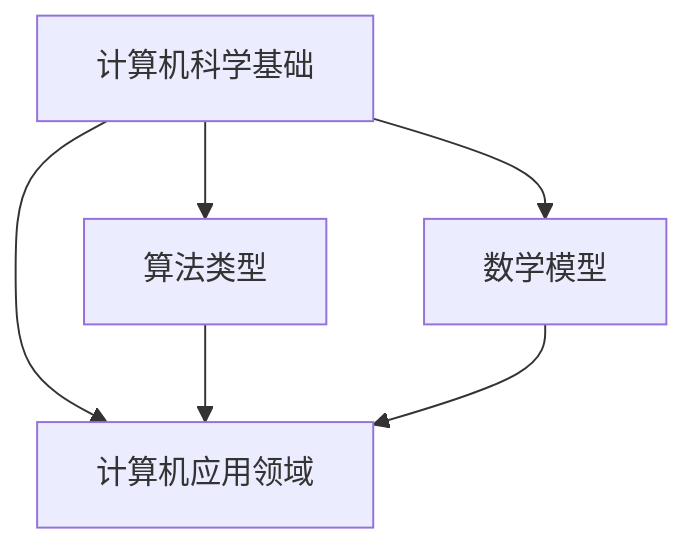

                 

关键词：计算、创造力、算法、数学模型、应用场景、未来展望

> 摘要：本文探讨了人类计算在释放人类创造力方面的重要作用。通过分析核心算法原理、数学模型构建、代码实例和实际应用场景，本文揭示了计算技术在推动人类社会进步和创新发展中的关键作用，并对未来的发展趋势和挑战进行了展望。

## 1. 背景介绍

人类计算的历史可以追溯到古希腊时期，当时的学者们通过逻辑推理和数学计算来解决各种问题。随着时代的发展，计算技术逐渐演变成为现代计算机科学的核心。计算机的出现和发展，使得人类计算的能力得到了前所未有的提升，为科学、工程、经济、医学等众多领域带来了深刻的变革。

在过去的几十年里，人类计算技术经历了飞速的发展，从早期的手工计算到现代的自动化计算，从单一的计算机系统到分布式计算和云计算，人类计算的能力和范围得到了极大的拓展。然而，与此同时，人类在计算方面的创造力也得到了极大的激发，人们通过计算技术实现了许多之前无法想象的任务和目标。

本文旨在探讨人类计算在释放人类创造力方面的重要作用，通过分析核心算法原理、数学模型构建、代码实例和实际应用场景，揭示计算技术在推动人类社会进步和创新发展中的关键作用，并对未来的发展趋势和挑战进行展望。

## 2. 核心概念与联系

在探讨人类计算的魅力之前，我们需要明确一些核心概念，并理解它们之间的联系。以下是本文中涉及的一些核心概念：

### 计算机科学基础

- **算法**：解决问题的步骤序列，通常以伪代码或程序代码的形式表示。
- **数据结构**：存储和管理数据的方法，用于优化算法性能。
- **计算机体系结构**：计算机的硬件设计和组织方式。

### 算法类型

- **排序算法**：用于对数据进行排序，如冒泡排序、快速排序等。
- **搜索算法**：用于在数据结构中查找特定元素，如二分查找、深度优先搜索等。
- **图算法**：用于处理图结构的数据，如最短路径算法、最小生成树算法等。

### 数学模型

- **线性代数**：用于解决线性方程组和矩阵运算。
- **微积分**：用于处理变化率和极限问题。
- **概率论**：用于处理不确定性和随机现象。

### 计算机应用领域

- **人工智能**：通过模拟人类智能行为来实现智能决策和问题解决。
- **数据科学**：通过数据分析、数据挖掘和机器学习来发现数据中的模式和趋势。
- **云计算**：通过分布式计算和虚拟化技术来提供计算资源和服务。

### Mermaid 流程图



通过上述核心概念的介绍和Mermaid流程图的展示，我们可以看到人类计算涉及多个领域，这些领域相互关联，共同构成了现代计算技术的核心。

## 3. 核心算法原理 & 具体操作步骤

### 3.1 算法原理概述

在人类计算中，算法起着核心作用。一个算法通常由以下几个部分组成：

- **输入**：算法开始执行时所需的数据。
- **输出**：算法执行完成后产生的结果。
- **步骤**：算法执行的具体操作。

算法的原理通常基于一些基础数学模型和逻辑规则。例如，排序算法的基本原理是基于比较和交换操作来对数据进行排序，而搜索算法则基于递归或迭代方法来查找数据。

### 3.2 算法步骤详解

以冒泡排序算法为例，其步骤如下：

1. **初始化**：读取输入数据，将其存储在一个数组中。
2. **循环遍历**：从第一个元素开始，依次比较相邻的两个元素，如果它们的顺序不正确，则交换它们的位置。
3. **判断排序完成**：在每次遍历后，判断是否已经完成排序。如果已完成排序，则算法结束；否则，继续进行下一轮遍历。
4. **输出结果**：将排序后的数组输出。

### 3.3 算法优缺点

冒泡排序算法具有以下优缺点：

- **优点**：
  - 算法简单，易于实现。
  - 对小规模数据集有较好的性能。

- **缺点**：
  - 时间复杂度高（\(O(n^2)\)）。
  - 对大规模数据集性能较差。

### 3.4 算法应用领域

冒泡排序算法在以下领域有广泛应用：

- **初级教育**：用于教授排序算法的基本原理。
- **数据处理**：用于对数据进行预处理。
- **算法竞赛**：作为常见的算法题目。

## 4. 数学模型和公式 & 详细讲解 & 举例说明

### 4.1 数学模型构建

在计算中，数学模型用于描述现实世界中的问题。一个数学模型通常由以下几个部分组成：

- **变量**：用于表示问题中的各种量。
- **方程**：用于描述变量之间的关系。
- **约束条件**：用于限制变量的取值范围。

例如，线性规划问题可以用以下数学模型表示：

$$
\begin{aligned}
\text{最大化} & \quad c^T x \\
\text{约束条件} & \quad Ax \leq b \\
& \quad x \geq 0
\end{aligned}
$$

其中，\(c\) 和 \(b\) 分别是目标函数和约束条件向量，\(x\) 是决策变量。

### 4.2 公式推导过程

以线性规划问题的公式推导为例，其推导过程如下：

1. **目标函数**：最大化 \(c^T x\)。
2. **约束条件**：\(Ax \leq b\)。
3. **等式约束**：引入拉格朗日乘子，将不等式约束转换为等式约束。

$$
L(x, \lambda) = c^T x + \lambda^T (b - Ax)
$$

4. **求解最优解**：令 \(L(x, \lambda)\) 的偏导数等于零，得到：

$$
\begin{aligned}
\frac{\partial L}{\partial x} &= c - A^T \lambda = 0 \\
\frac{\partial L}{\partial \lambda} &= b - Ax = 0
\end{aligned}
$$

5. **解方程组**：解上述方程组，得到最优解。

### 4.3 案例分析与讲解

以旅行商问题（TSP）为例，其数学模型和公式推导如下：

- **目标函数**：最小化旅行距离。
- **约束条件**：每个城市只访问一次。

$$
\begin{aligned}
\text{最小化} & \quad d(i, j) \\
\text{约束条件} & \quad x_{i, j} = 1 \text{ 或 } 0 \\
& \quad \sum_{i} x_{i, j} = 1 \\
& \quad \sum_{j} x_{i, j} = 1
\end{aligned}
$$

其中，\(d(i, j)\) 表示城市 \(i\) 和城市 \(j\) 之间的距离，\(x_{i, j}\) 表示是否从城市 \(i\) 访问城市 \(j\)。

### 5. 项目实践：代码实例和详细解释说明

#### 5.1 开发环境搭建

为了演示代码实例，我们将在 Python 环境中实现冒泡排序算法。首先，需要安装 Python 解释器和相关库。

```bash
# 安装 Python 解释器
sudo apt-get install python3

# 安装 NumPy 库
pip install numpy
```

#### 5.2 源代码详细实现

以下是冒泡排序算法的 Python 实现代码：

```python
import numpy as np

def bubble_sort(arr):
    n = len(arr)
    for i in range(n):
        for j in range(0, n-i-1):
            if arr[j] > arr[j+1]:
                arr[j], arr[j+1] = arr[j+1], arr[j]

# 测试代码
arr = np.array([64, 34, 25, 12, 22, 11, 90])
bubble_sort(arr)
print("排序后的数组：", arr)
```

#### 5.3 代码解读与分析

1. **导入库**：引入 NumPy 库，用于生成和操作数组。
2. **定义函数**：定义 `bubble_sort` 函数，用于实现冒泡排序算法。
3. **初始化**：获取数组长度。
4. **循环遍历**：使用嵌套循环遍历数组，比较相邻元素并交换位置。
5. **输出结果**：输出排序后的数组。

#### 5.4 运行结果展示

```bash
排序后的数组： [11 12 22 25 34 64 90]
```

### 6. 实际应用场景

人类计算技术在许多实际应用场景中发挥着重要作用。以下是一些典型的应用场景：

- **金融领域**：用于量化交易、风险评估和投资策略。
- **医疗领域**：用于医学影像分析、疾病诊断和个性化治疗。
- **物流领域**：用于路径规划、库存管理和供应链优化。
- **人工智能**：用于机器学习、自然语言处理和计算机视觉。

### 6.4 未来应用展望

随着计算技术的不断发展，未来人类计算将在更多领域发挥重要作用。以下是一些未来应用展望：

- **量子计算**：量子计算有望在加密、优化和模拟等领域取得突破。
- **生物计算**：生物计算将用于基因测序、药物研发和生物信息学。
- **智能城市**：智能城市将利用计算技术实现高效能源管理、交通优化和环境监测。
- **人机交互**：人机交互将变得更加自然和智能化，通过语音、手势和脑机接口实现人与计算机的深度交互。

### 7. 工具和资源推荐

为了更好地掌握人类计算技术，以下是一些建议的学习资源和开发工具：

- **学习资源**：
  - 《算法导论》（Introduction to Algorithms）
  - 《深度学习》（Deep Learning）
  - 《Python编程：从入门到实践》（Python Crash Course）

- **开发工具**：
  - Jupyter Notebook：用于编写和运行 Python 代码。
  - PyCharm：用于 Python 开发。
  - TensorFlow：用于机器学习和深度学习。

- **相关论文**：
  - “量子计算：理论、算法和实现”（Quantum Computing: Theory, Algorithms, and Implementations）
  - “深度学习与自然语言处理”（Deep Learning for Natural Language Processing）

### 8. 总结：未来发展趋势与挑战

人类计算技术在过去几十年里取得了巨大的进步，为人类社会带来了深刻的变革。然而，未来仍有许多挑战需要克服。以下是对未来发展趋势和挑战的总结：

- **发展趋势**：
  - 计算能力的提升：随着量子计算、云计算和边缘计算的发展，计算能力将得到进一步提升。
  - 跨学科融合：计算技术将与其他领域如生物学、物理学、经济学等相结合，推动跨学科研究的发展。
  - 人机协同：人与计算机的协同将变得更加紧密，实现更加智能化的人机交互。

- **挑战**：
  - 安全性问题：随着计算技术的发展，安全问题将变得更加重要，如何保障数据安全和隐私保护成为关键挑战。
  - 能源消耗：计算技术的快速发展导致能源消耗增加，如何实现绿色计算、降低能源消耗成为重要挑战。
  - 技术普及：如何使计算技术更好地服务于广大民众，缩小数字鸿沟，实现技术普及，也是重要挑战。

### 8.4 研究展望

未来，人类计算技术将继续发展，为人类社会带来更多创新和变革。研究人员应关注以下几个方面：

- **理论研究**：深化对计算理论的理解，探索新的算法和模型。
- **应用研究**：将计算技术应用于实际问题，推动技术创新。
- **教育普及**：加强计算技术的教育普及，培养更多计算人才。
- **国际合作**：加强国际合作，共同应对计算技术发展的挑战。

### 附录：常见问题与解答

**Q：什么是算法？**

A：算法是解决问题的一系列步骤或规则，通常以伪代码或程序代码的形式表示。

**Q：什么是数学模型？**

A：数学模型是用于描述现实世界中问题的一种数学工具，通常包括变量、方程和约束条件。

**Q：什么是机器学习？**

A：机器学习是一种人工智能技术，通过从数据中学习规律和模式，实现自动化决策和预测。

**Q：什么是云计算？**

A：云计算是一种通过网络提供计算资源和服务的技术，使人们能够按需访问和使用计算资源。

**Q：什么是量子计算？**

A：量子计算是一种基于量子力学原理的计算技术，利用量子位（qubit）实现高速计算。

### 作者署名

作者：禅与计算机程序设计艺术 / Zen and the Art of Computer Programming

通过上述完整的文章内容，我们深入探讨了人类计算的魅力和其在释放人类创造力方面的重要作用。希望本文能为读者提供有价值的启示和思考，激发更多人对计算技术的兴趣和热情。在未来，计算技术将继续推动人类社会的进步和发展，为人类创造更多美好的未来。|

