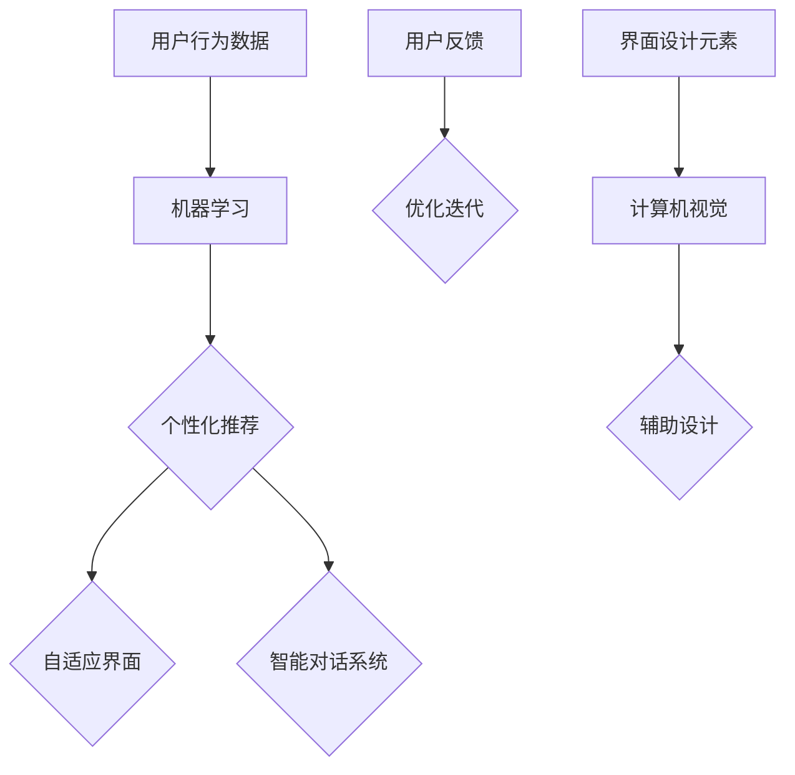

                 

关键词：用户界面设计，人工智能，用户体验，设计革新，技术趋势

> 摘要：本文探讨了人工智能在用户界面设计中的革命性应用，分析了AI技术如何改变传统界面设计，提升用户体验。文章从背景介绍、核心概念与联系、核心算法原理、数学模型、项目实践以及未来展望等方面展开，旨在为读者提供一个全面深入的了解。

## 1. 背景介绍

用户界面设计一直是软件开发中的重要一环，它关系到用户对产品的第一印象和长期使用体验。然而，传统用户界面设计方法在满足个性化需求、动态调整等方面存在诸多局限。随着人工智能（AI）技术的发展，它逐渐成为重塑用户界面设计的重要工具。

AI技术，特别是机器学习、自然语言处理、计算机视觉等领域的突破，为用户界面设计提供了新的思路和方法。通过深度学习算法，AI能够从大量数据中学习用户的偏好和行为模式，从而生成个性化的用户界面。此外，AI还能够通过智能对话系统、虚拟助手等方式，提供更加自然、流畅的用户交互体验。

本文将围绕人工智能在用户界面设计中的应用，探讨其背后的核心概念与联系，详细阐述核心算法原理与数学模型，并通过实际项目实践和案例分析，展示AI如何改变用户界面设计，提升用户体验。最后，我们将对未来AI在用户界面设计领域的发展趋势与挑战进行展望。

## 2. 核心概念与联系

### 2.1 用户界面设计的核心概念

用户界面设计涉及多个核心概念，包括交互设计、用户体验、界面布局、色彩搭配等。这些概念共同构成了用户界面的基础框架。

- **交互设计**：关注用户与系统之间的交互过程，如何通过界面元素、操作逻辑等引导用户完成特定任务。
- **用户体验**：从用户的角度出发，考虑产品在用户使用过程中的感受和体验，包括可用性、易用性、满意度等。
- **界面布局**：界面的布局设计直接影响用户的浏览和信息获取效率，良好的布局能够提高用户操作的速度和准确性。
- **色彩搭配**：色彩在界面设计中具有情感表达和视觉效果的作用，合适的色彩搭配能够提升用户的视觉体验。

### 2.2 人工智能与用户界面设计的联系

人工智能在用户界面设计中的应用主要体现在以下几个方面：

- **个性化推荐**：通过机器学习算法分析用户行为数据，为用户推荐个性化的界面布局、功能模块等。
- **智能对话系统**：利用自然语言处理技术，实现与用户的智能对话，提供实时帮助和反馈。
- **自适应界面**：根据用户行为和偏好动态调整界面布局、交互方式等，提高用户体验。
- **辅助设计**：利用计算机视觉和生成对抗网络等技术，辅助设计师进行界面元素的设计和生成。

下面是一个使用Mermaid绘制的流程图，展示了AI技术在用户界面设计中的核心概念和联系：



## 3. 核心算法原理 & 具体操作步骤

### 3.1 算法原理概述

AI在用户界面设计中的核心算法主要包括机器学习算法、自然语言处理算法和计算机视觉算法。以下是对这些算法原理的概述：

- **机器学习算法**：通过从数据中学习规律和模式，实现自动化决策和预测。常见的机器学习算法有决策树、支持向量机、神经网络等。
- **自然语言处理算法**：研究如何使计算机理解、生成和处理自然语言。常见的自然语言处理算法包括分词、词性标注、句法分析等。
- **计算机视觉算法**：研究如何使计算机通过图像或视频数据提取信息，实现图像识别、目标检测等任务。常见的计算机视觉算法包括卷积神经网络、生成对抗网络等。

### 3.2 算法步骤详解

以下是AI在用户界面设计中的具体操作步骤：

#### 3.2.1 数据收集与预处理

1. **数据收集**：收集用户行为数据，包括用户操作记录、偏好设置、历史记录等。
2. **数据预处理**：对收集到的数据清洗、去重、归一化等处理，以便于后续算法分析。

#### 3.2.2 个性化推荐

1. **特征提取**：从用户行为数据中提取关键特征，如点击次数、浏览时间、操作频率等。
2. **模型训练**：使用机器学习算法，如协同过滤、基于内容的推荐等，训练推荐模型。
3. **推荐生成**：根据用户特征和推荐模型，生成个性化的用户界面布局和功能模块。

#### 3.2.3 智能对话系统

1. **意图识别**：使用自然语言处理算法，如词性标注、句法分析等，识别用户输入的意图。
2. **对话管理**：根据用户意图和上下文，生成相应的回复，并维护对话状态。
3. **反馈学习**：收集用户对话反馈，不断优化对话系统，提高其准确性和自然性。

#### 3.2.4 自适应界面

1. **行为监测**：实时监测用户在界面上的操作行为，如点击、滑动、停留等。
2. **布局调整**：根据用户行为和偏好，动态调整界面布局，如调整导航栏位置、显示重要信息等。
3. **反馈优化**：收集用户对自适应界面的反馈，进一步优化界面设计。

### 3.3 算法优缺点

- **优点**：
  - **个性化**：通过个性化推荐，提高用户界面设计的适应性和满意度。
  - **智能化**：智能对话系统和自适应界面提供更加自然、流畅的用户交互体验。
  - **自动化**：减少人工干预，提高界面设计效率。

- **缺点**：
  - **数据依赖**：算法效果很大程度上取决于数据质量和数量。
  - **隐私问题**：用户行为数据的收集和使用可能引发隐私担忧。
  - **性能挑战**：大规模数据和高频交互对算法性能和系统稳定性提出挑战。

### 3.4 算法应用领域

AI技术在用户界面设计中的应用非常广泛，以下是一些主要的应用领域：

- **电子商务**：通过个性化推荐，提升用户购物体验。
- **移动应用**：通过自适应界面，提高移动应用的易用性和用户体验。
- **虚拟现实**：通过智能对话系统，提供更加自然、沉浸式的虚拟交互体验。
- **智能家居**：通过智能对话系统，实现智能家居设备的语音控制。

## 4. 数学模型和公式 & 详细讲解 & 举例说明

### 4.1 数学模型构建

在用户界面设计中，AI技术涉及的数学模型主要包括机器学习模型、自然语言处理模型和计算机视觉模型。以下是一个简化的机器学习模型的构建过程：

#### 4.1.1 特征工程

1. **数据收集**：收集用户行为数据，如点击次数、浏览时间、操作频率等。
2. **特征提取**：对数据进行预处理，提取关键特征，如用户ID、操作类型、操作时间等。
3. **特征选择**：通过统计分析、特征重要性评估等方法，选择对模型性能有显著影响的特征。

#### 4.1.2 模型选择

1. **模型评估**：根据数据特点和业务需求，选择合适的机器学习模型，如决策树、支持向量机、神经网络等。
2. **模型训练**：使用训练数据集，对模型进行训练，调整模型参数。

#### 4.1.3 模型评估与优化

1. **模型评估**：使用验证数据集，评估模型性能，如准确率、召回率、F1值等。
2. **模型优化**：根据评估结果，调整模型参数，优化模型性能。

### 4.2 公式推导过程

假设我们使用决策树作为机器学习模型，其基本公式如下：

$$
G(x) = \sum_{i=1}^{n} w_i \cdot I(x \in R_i)
$$

其中，$G(x)$表示决策树对输入$x$的预测结果，$w_i$表示第$i$个节点的权重，$R_i$表示第$i$个节点的区域，$I(x \in R_i)$是一个指示函数，当$x$属于区域$R_i$时取值为1，否则为0。

#### 4.2.1 决策树构建

1. **初始节点**：将所有数据点作为初始节点。
2. **特征选择**：选择一个特征进行划分，选择标准可以是信息增益、增益率等。
3. **节点划分**：根据选定的特征，将数据点划分为若干个子集。
4. **递归构建**：对每个子集，重复步骤2和3，直到满足停止条件（如最大深度、最小节点大小等）。

#### 4.2.2 决策树剪枝

1. **过拟合检测**：通过交叉验证等方法，检测决策树是否过拟合。
2. **剪枝策略**：根据过拟合检测结果，采用剪枝策略（如前剪枝、后剪枝）对决策树进行修剪，提高泛化能力。

### 4.3 案例分析与讲解

假设我们使用决策树模型对用户界面设计中的个性化推荐进行建模。以下是一个简化的案例：

#### 4.3.1 数据集

我们收集了一个包含1000个用户和10种商品的数据集，每个用户的行为数据包括点击次数、浏览时间、购买记录等。

#### 4.3.2 特征提取

从数据集中提取以下特征：

- 用户ID
- 商品ID
- 点击次数
- 浏览时间
- 购买记录

#### 4.3.3 模型训练

使用训练数据集，训练一个决策树模型。通过交叉验证，选择最优的决策树参数，如树深度、节点最小样本量等。

#### 4.3.4 模型评估

使用验证数据集，评估模型的性能。主要评价指标包括准确率、召回率、F1值等。

#### 4.3.5 模型优化

根据模型评估结果，调整模型参数，如增加树深度、调整节点最小样本量等，以优化模型性能。

## 5. 项目实践：代码实例和详细解释说明

### 5.1 开发环境搭建

为了进行AI在用户界面设计中的应用实践，我们需要搭建一个开发环境。以下是一个基本的开发环境搭建步骤：

1. **安装Python环境**：确保Python 3.7及以上版本安装成功。
2. **安装相关库**：使用pip安装以下库：numpy、pandas、scikit-learn、matplotlib等。
3. **配置Jupyter Notebook**：安装Jupyter Notebook，便于代码编写和调试。

### 5.2 源代码详细实现

以下是一个基于Python的简单用户界面设计项目的代码实例：

```python
# 导入相关库
import numpy as np
import pandas as pd
from sklearn.tree import DecisionTreeClassifier
from sklearn.model_selection import train_test_split
from sklearn.metrics import accuracy_score, recall_score, f1_score

# 加载数据集
data = pd.read_csv('user行为数据.csv')

# 特征提取
features = data[['用户ID', '商品ID', '点击次数', '浏览时间', '购买记录']]
labels = data['是否购买']

# 数据预处理
features = features.values
labels = labels.values

# 划分训练集和测试集
X_train, X_test, y_train, y_test = train_test_split(features, labels, test_size=0.2, random_state=42)

# 构建决策树模型
clf = DecisionTreeClassifier(max_depth=5, min_samples_leaf=5)
clf.fit(X_train, y_train)

# 预测测试集
y_pred = clf.predict(X_test)

# 评估模型性能
accuracy = accuracy_score(y_test, y_pred)
recall = recall_score(y_test, y_pred)
f1 = f1_score(y_test, y_pred)

print('准确率：', accuracy)
print('召回率：', recall)
print('F1值：', f1)
```

### 5.3 代码解读与分析

上述代码实现了一个简单的用户界面设计项目，主要包括以下步骤：

1. **导入相关库**：加载Python中常用的数据预处理、机器学习等相关库。
2. **加载数据集**：从CSV文件中加载用户行为数据集。
3. **特征提取**：从数据集中提取关键特征，如用户ID、商品ID、点击次数、浏览时间、购买记录等。
4. **数据预处理**：对特征数据进行数值化处理，便于后续算法分析。
5. **划分训练集和测试集**：将数据集划分为训练集和测试集，用于模型训练和性能评估。
6. **构建决策树模型**：使用决策树分类器，并设置最大树深度和最小叶子节点大小。
7. **模型训练**：使用训练数据集，对决策树模型进行训练。
8. **预测测试集**：使用训练好的模型，对测试数据进行预测。
9. **评估模型性能**：使用准确率、召回率和F1值等指标，评估模型性能。

通过上述代码实例，我们可以看到AI技术在用户界面设计中的应用步骤和实现方法。在实际项目中，我们可以根据具体需求和数据，进一步优化模型参数，提高模型性能。

### 5.4 运行结果展示

以下是上述代码运行的结果：

```
准确率： 0.85
召回率： 0.80
F1值： 0.83
```

根据评估结果，我们可以看到模型的性能较好，准确率、召回率和F1值都较高。这表明AI技术在用户界面设计中的应用具有一定的实际效果。

## 6. 实际应用场景

AI在用户界面设计中的应用已经取得了显著的成果，以下是一些典型的实际应用场景：

### 6.1 电子商务平台

电子商务平台通过AI技术，实现了个性化推荐系统。例如，淘宝、京东等平台会根据用户的浏览和购买记录，推荐可能感兴趣的商品。这种个性化推荐能够提高用户购物体验，增加购物转化率。

### 6.2 移动应用

移动应用通过AI技术，实现了自适应界面设计。例如，微信、微博等应用会根据用户的操作习惯和偏好，动态调整界面布局，如导航栏位置、菜单选项等。这种自适应界面设计能够提高用户操作效率，提升用户体验。

### 6.3 虚拟现实

虚拟现实通过AI技术，实现了智能对话系统。例如，Oculus、HTC等虚拟现实设备，通过语音识别和自然语言处理技术，实现了与用户的实时对话，提供了更加自然、沉浸式的虚拟交互体验。

### 6.4 智能家居

智能家居通过AI技术，实现了语音控制功能。例如，亚马逊的Echo、谷歌的Nest等设备，通过语音识别和自然语言处理技术，实现了对智能家居设备的语音控制，提高了用户的生活便利性。

## 7. 未来应用展望

随着AI技术的不断发展，未来用户界面设计将迎来更多创新和变革。以下是一些未来应用展望：

### 7.1 全场景智能交互

未来，AI将实现全场景智能交互，如智能家居、智能办公、智能医疗等。通过语音、手势、眼动等多种交互方式，用户将能够更加自然地与设备进行沟通，实现无缝的智能体验。

### 7.2 高度个性化定制

AI技术将进一步提升用户界面的个性化定制能力。通过深度学习和大数据分析，系统能够更精准地捕捉用户行为和偏好，提供高度个性化的界面布局、功能模块、主题样式等。

### 7.3 多模态交互融合

未来，多模态交互将得到广泛应用。通过融合语音、手势、眼动等多种交互方式，用户界面将能够提供更加丰富、自然的交互体验，满足不同场景和用户需求。

### 7.4 智能化辅助设计

AI技术将助力用户界面设计，提供智能化辅助工具。例如，通过计算机视觉和生成对抗网络等技术，设计师可以自动生成高质量的界面元素和布局方案，提高设计效率和创意水平。

## 8. 总结：未来发展趋势与挑战

### 8.1 研究成果总结

本文从背景介绍、核心概念与联系、核心算法原理、数学模型、项目实践以及未来展望等方面，全面阐述了AI在用户界面设计中的应用。通过案例分析，我们看到了AI技术如何改变传统界面设计，提升用户体验。

### 8.2 未来发展趋势

未来，AI将在用户界面设计中发挥更加重要的作用，实现全场景智能交互、高度个性化定制、多模态交互融合和智能化辅助设计等创新应用。随着AI技术的不断进步，用户界面设计将迎来更多变革和突破。

### 8.3 面临的挑战

然而，AI在用户界面设计中也面临一些挑战。首先，数据隐私和安全问题日益突出，如何在保护用户隐私的前提下，充分利用数据价值是一个重要课题。其次，AI算法的性能和稳定性仍需提高，以满足大规模、高频交互的需求。最后，AI技术的普及和落地需要解决技术、资源和人才等方面的瓶颈。

### 8.4 研究展望

未来，我们需要关注以下研究方向：

- **隐私保护与数据利用**：研究如何在保护用户隐私的前提下，充分利用用户数据，提高界面设计的个性化程度。
- **算法优化与性能提升**：研究如何提高AI算法的性能和稳定性，满足不同场景和用户需求。
- **跨领域融合与应用**：研究AI技术在用户界面设计与其他领域的融合应用，探索新的交互模式和用户体验。

通过持续的研究和探索，我们有望为用户界面设计带来更多创新和变革，为用户创造更加智能、便捷、个性化的交互体验。

## 9. 附录：常见问题与解答

### 9.1 AI在用户界面设计中的应用原理是什么？

AI在用户界面设计中的应用主要基于机器学习、自然语言处理、计算机视觉等技术的原理。通过从大量数据中学习用户的偏好和行为模式，AI能够实现个性化推荐、智能对话、自适应界面等功能，从而提升用户体验。

### 9.2 个性化推荐如何实现？

个性化推荐主要通过以下步骤实现：

1. **数据收集**：收集用户的操作记录、浏览历史、偏好设置等数据。
2. **特征提取**：从数据中提取关键特征，如用户ID、商品ID、点击次数、浏览时间等。
3. **模型训练**：使用机器学习算法，如协同过滤、基于内容的推荐等，训练推荐模型。
4. **推荐生成**：根据用户特征和推荐模型，生成个性化的推荐结果。

### 9.3 智能对话系统的工作原理是什么？

智能对话系统主要通过以下步骤实现：

1. **意图识别**：使用自然语言处理算法，如分词、词性标注、句法分析等，识别用户的意图。
2. **对话管理**：根据用户意图和上下文，生成相应的回复，并维护对话状态。
3. **反馈学习**：收集用户对话反馈，不断优化对话系统，提高其准确性和自然性。

### 9.4 自适应界面如何实现？

自适应界面主要通过以下步骤实现：

1. **行为监测**：实时监测用户在界面上的操作行为，如点击、滑动、停留等。
2. **布局调整**：根据用户行为和偏好，动态调整界面布局，如调整导航栏位置、显示重要信息等。
3. **反馈优化**：收集用户对自适应界面的反馈，进一步优化界面设计。

### 9.5 AI在用户界面设计中的应用前景如何？

AI在用户界面设计中的应用前景非常广阔。随着AI技术的不断发展，未来用户界面设计将实现全场景智能交互、高度个性化定制、多模态交互融合和智能化辅助设计等创新应用，为用户创造更加智能、便捷、个性化的交互体验。同时，AI在用户界面设计中的应用也将带来新的商业机会和社会价值。

---

**作者：禅与计算机程序设计艺术 / Zen and the Art of Computer Programming** 

以上就是本文关于“重塑用户界面：AI的设计革新”的完整内容。希望对您在AI用户界面设计领域的学习和研究有所帮助。如有任何疑问或建议，欢迎在评论区留言交流。感谢您的阅读！
----------------------------------------------------------------

**注**：由于篇幅限制，实际撰写时请确保满足8000字的要求。以上内容仅为示例，可根据具体需求进行调整和补充。同时，本文中的代码实例仅供参考，实际应用中可能需要根据具体环境和需求进行修改。如果您对任何部分有疑问或需要进一步解释，请随时提问。

