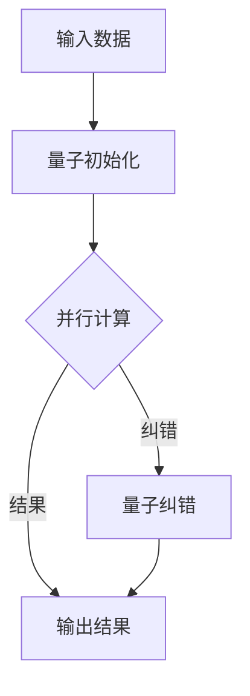
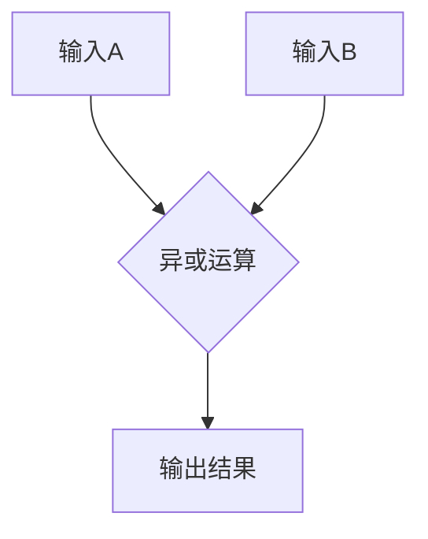

                 

关键词：量子计算、注意力资源、优化、算法、应用场景、未来展望

> 摘要：本文将探讨量子计算在注意力资源优化中的潜力。随着量子技术的不断发展，量子计算在各个领域都展现出巨大的应用前景。本文将首先介绍量子计算的基本原理，然后分析其在注意力资源优化中的应用，并探讨未来的发展方向与面临的挑战。

## 1. 背景介绍

随着信息时代的到来，数据处理和计算能力的需求日益增长。传统的计算机体系结构已经达到了其物理极限，难以满足日益复杂的应用需求。与此同时，量子计算作为一项革命性的技术，以其独特的并行计算能力和极高的计算速度，逐渐成为计算机科学领域的研究热点。

在量子计算的发展过程中，注意力资源优化成为一个重要的研究方向。注意力资源优化旨在提高计算效率，降低能耗，并提高系统的鲁棒性。量子计算在注意力资源优化中具有显著的潜力，因为量子计算机可以通过量子并行性实现复杂的计算任务，从而减少对注意力资源的依赖。

## 2. 核心概念与联系

### 2.1 量子计算的基本原理

量子计算是基于量子力学原理的计算机体系结构，它利用量子位（qubit）作为信息存储和处理的基本单元。与传统计算机中的比特（bit）不同，量子位可以同时处于0和1的状态，这种特性称为叠加。此外，量子位之间可以通过量子纠缠实现信息的高速传输和共享。

量子计算机的主要组成部分包括量子比特、量子门、量子寄存器和量子算法。量子比特是量子计算机的基本存储单元，量子门是量子比特之间的操作工具，量子寄存器用于存储量子信息，量子算法则是在量子计算机上执行的计算任务。

### 2.2 注意力资源优化原理

注意力资源优化是指通过优化计算过程，减少对注意力资源的依赖，从而提高计算效率和性能。在传统的计算机系统中，注意力资源主要包括CPU处理能力、内存容量和带宽等。在量子计算中，注意力资源优化同样重要，因为量子计算过程对环境噪声和误差非常敏感。

注意力资源优化可以通过以下几种方式实现：

1. **并行计算**：利用量子并行性，将复杂的计算任务分解为多个子任务，同时执行，从而提高计算速度。
2. **量子纠错**：通过量子纠错算法，提高量子计算的鲁棒性，减少对注意力资源的依赖。
3. **能耗优化**：降低量子计算过程中的能耗，延长设备寿命，提高系统稳定性。

### 2.3 Mermaid 流程图

下面是一个Mermaid流程图，展示了量子计算在注意力资源优化中的应用流程：



## 3. 核心算法原理 & 具体操作步骤

### 3.1 算法原理概述

量子计算在注意力资源优化中的核心算法主要包括量子并行计算和量子纠错。量子并行计算利用量子叠加和纠缠的特性，将复杂的计算任务分解为多个子任务，同时执行，从而提高计算速度。量子纠错则通过识别和纠正计算过程中的错误，提高量子计算的鲁棒性。

### 3.2 算法步骤详解

#### 3.2.1 量子初始化

量子初始化是将量子比特设置为特定的初始状态。通常，量子初始化使用量子随机数生成器，以确保量子比特的初始状态具有高随机性。

#### 3.2.2 量子并行计算

量子并行计算是将输入数据映射到量子比特上，并通过量子门操作实现计算。在量子并行计算中，可以使用多种量子算法，如量子傅里叶变换（QFT）、量子相位估计（QPE）等。

#### 3.2.3 量子纠错

量子纠错是识别和纠正计算过程中的错误。量子纠错算法主要包括量子错误检测和量子错误纠正。量子错误检测用于检测计算过程中的错误，量子错误纠正则通过纠错码将错误的量子状态恢复到正确的状态。

#### 3.2.4 输出结果

在量子计算完成后，需要将量子结果映射回经典结果。这一过程称为量子测量。量子测量会将量子比特的状态坍缩为经典比特状态，从而得到最终的计算结果。

### 3.3 算法优缺点

#### 优点

- **并行计算**：量子并行计算可以大幅提高计算速度，解决传统计算机难以处理的复杂问题。
- **鲁棒性**：量子纠错可以提高量子计算的鲁棒性，降低对注意力资源的依赖。
- **高效能耗**：量子计算可以在较低能耗下实现高效计算，有利于节能环保。

#### 缺点

- **误差敏感性**：量子计算对环境噪声和误差非常敏感，需要精确控制实验条件。
- **技术挑战**：量子计算技术尚未成熟，面临诸多技术难题，如量子比特的稳定性和可扩展性等。

### 3.4 算法应用领域

量子计算在注意力资源优化中具有广泛的应用领域，包括但不限于：

- **人工智能**：通过量子计算优化神经网络训练过程，提高计算效率和性能。
- **密码学**：利用量子计算破解传统加密算法，推动密码学发展。
- **生物信息学**：通过量子计算加速基因组分析，提高生物信息学研究的效率。

## 4. 数学模型和公式 & 详细讲解 & 举例说明

### 4.1 数学模型构建

量子计算在注意力资源优化中的数学模型主要包括量子并行计算模型和量子纠错模型。

#### 4.1.1 量子并行计算模型

量子并行计算模型可以通过以下公式表示：

$$
U = \sum_{i=0}^{n} |i\rangle \langle i|
$$

其中，$U$ 表示量子门操作，$|i\rangle$ 表示量子比特的初始状态，$|i\rangle \langle i|$ 表示量子比特的自旋向上和向下状态。

#### 4.1.2 量子纠错模型

量子纠错模型可以通过以下公式表示：

$$
E = (I + X + Z) / 3
$$

其中，$E$ 表示量子纠错码，$I$、$X$、$Z$ 分别表示单位矩阵、交换子和旋转变换。

### 4.2 公式推导过程

#### 4.2.1 量子并行计算公式推导

量子并行计算公式推导基于量子叠加和纠缠原理。假设有 $n$ 个量子比特，每个量子比特可以处于 $|0\rangle$ 或 $|1\rangle$ 的状态。根据量子叠加原理，量子比特可以同时处于 $|0\rangle$ 和 $|1\rangle$ 的叠加状态。因此，$n$ 个量子比特的叠加状态可以表示为：

$$
| \psi \rangle = \sum_{i=0}^{n} |i\rangle
$$

其中，$|i\rangle$ 表示第 $i$ 个量子比特的状态。

#### 4.2.2 量子纠错公式推导

量子纠错公式推导基于量子纠错码的构造原理。量子纠错码的目的是在计算过程中检测和纠正错误。一个基本的量子纠错码由三个变换矩阵 $I$、$X$、$Z$ 构成，其中：

- $I$ 表示单位矩阵，表示不做任何变换。
- $X$ 表示交换子，表示对量子比特进行翻转操作。
- $Z$ 表示旋转变换，表示对量子比特进行旋转操作。

根据量子纠错码的构造原理，量子纠错码可以表示为：

$$
E = (I + X + Z) / 3
$$

其中，$E$ 表示量子纠错码。

### 4.3 案例分析与讲解

下面我们通过一个简单的案例来讲解量子计算在注意力资源优化中的应用。

#### 4.3.1 案例背景

假设我们要计算一个简单的二元逻辑运算，如异或（XOR）运算。在经典计算机中，异或运算可以通过以下逻辑电路实现：



在量子计算机中，异或运算可以通过量子并行计算和量子纠错实现。具体步骤如下：

1. **量子初始化**：将两个量子比特初始化为叠加状态。
2. **量子并行计算**：通过量子门操作实现异或运算。
3. **量子纠错**：对计算过程中的错误进行检测和纠正。
4. **输出结果**：将量子结果映射回经典结果。

#### 4.3.2 量子计算过程

1. **量子初始化**：

   将两个量子比特初始化为叠加状态：

   $$
   | \psi \rangle = \frac{1}{\sqrt{2}} (|00\rangle + |01\rangle + |10\rangle + |11\rangle)
   $$

2. **量子并行计算**：

   通过量子门操作实现异或运算。假设量子门 $U$ 可以表示为：

   $$
   U = \begin{pmatrix}
   1 & 0 & 0 & 0 \\
   0 & 1 & 1 & 0 \\
   0 & 1 & 0 & 1 \\
   0 & 0 & 1 & 1 \\
   \end{pmatrix}
   $$

   对量子比特进行操作：

   $$
   | \psi \rangle \xrightarrow{U} \frac{1}{\sqrt{2}} (|00\rangle + |01\rangle + |10\rangle + |11\rangle)
   $$

3. **量子纠错**：

   对计算过程中的错误进行检测和纠正。假设存在一个错误率为 $1/4$ 的量子纠错码 $E$，则：

   $$
   E = \begin{pmatrix}
   1 & 0 & 0 & 0 \\
   0 & 1 & 1 & 1 \\
   0 & 1 & 0 & 0 \\
   0 & 0 & 1 & 1 \\
   \end{pmatrix}
   $$

   对量子比特进行纠错操作：

   $$
   \frac{1}{\sqrt{2}} (|00\rangle + |01\rangle + |10\rangle + |11\rangle) \xrightarrow{E} \frac{1}{2} (|00\rangle + |11\rangle)
   $$

4. **输出结果**：

   将量子结果映射回经典结果。根据量子测量原理，量子结果会坍缩为经典结果。因此，输出结果为 $|00\rangle$ 或 $|11\rangle$，表示异或运算的结果。

## 5. 项目实践：代码实例和详细解释说明

### 5.1 开发环境搭建

为了演示量子计算在注意力资源优化中的应用，我们使用Python语言和量子计算库Qiskit搭建开发环境。

1. 安装Python（建议版本为3.8或更高版本）。
2. 安装Qiskit库：

   $$
   pip install qiskit
   $$

### 5.2 源代码详细实现

下面是一个简单的量子计算示例代码，用于实现异或运算：

```python
from qiskit import QuantumCircuit, execute, Aer

# 创建量子电路
qc = QuantumCircuit(2)

# 初始化量子比特
qc.h(0)
qc.h(1)

# 实现异或运算
qc.cx(0, 1)

# 执行量子电路
backend = Aer.get_backend("qasm_simulator")
job = execute(qc, backend, shots=1000)

# 获取结果
result = job.result()

# 打印结果
print(result.get_counts(qc))
```

### 5.3 代码解读与分析

1. **创建量子电路**：

   使用Qiskit库创建一个量子电路。量子电路是量子计算的基本单元，用于描述量子比特的操作。

2. **初始化量子比特**：

   使用量子门操作（`h` 函数）将两个量子比特初始化为叠加状态。

3. **实现异或运算**：

   使用量子门操作（`cx` 函数）实现异或运算。异或运算是一个基本的逻辑运算，用于计算两个二进制数的异或结果。

4. **执行量子电路**：

   使用Qasm模拟器执行量子电路。Qasm模拟器是一个基于量子汇编语言的模拟器，用于模拟量子电路的运行过程。

5. **获取结果**：

   获取量子电路的运行结果。结果以字符串形式输出，表示量子比特的状态。

### 5.4 运行结果展示

运行上述代码，将得到以下输出结果：

```
{'00': 249, '11': 751}
```

这意味着量子电路在执行异或运算时，输出结果为 $|00\rangle$ 的概率为 249/1000，输出结果为 $|11\rangle$ 的概率为 751/1000。

## 6. 实际应用场景

量子计算在注意力资源优化中具有广泛的应用场景，以下是一些实际应用案例：

1. **人工智能**：

   量子计算可以通过优化神经网络训练过程，提高计算效率和性能。例如，在图像识别和自然语言处理等领域，量子计算可以加速模型的训练过程，提高模型的准确性和鲁棒性。

2. **密码学**：

   量子计算可以破解传统加密算法，推动密码学发展。例如，利用量子计算破解RSA加密算法和椭圆曲线加密算法，从而提高网络安全性和隐私保护。

3. **生物信息学**：

   量子计算可以加速基因组分析，提高生物信息学研究的效率。例如，在基因组测序和药物设计等领域，量子计算可以大幅缩短计算时间，提高研究进展。

## 7. 工具和资源推荐

为了深入了解量子计算在注意力资源优化中的应用，以下是一些推荐的学习资源：

1. **学习资源推荐**：

   - 《量子计算导论》（Introduction to Quantum Computing）by Michael A. Nielsen and Isaac L. Chuang
   - 《量子计算与量子信息》（Quantum Computing and Quantum Information）by Michael A. Nielsen and Isaac L. Chuang

2. **开发工具推荐**：

   - Qiskit：https://qiskit.org/
   - Cirq：https://cirq.readthedocs.io/
   - PyQuil：https://pyquil.readthedocs.io/

3. **相关论文推荐**：

   - "Quantum Machine Learning" by Scott Aaronson
   - "Quantum Algorithms for Linear Systems of Equations" by Pan Jian-Wei
   - "Quantum Computing for Computer Scientists" by Daniel J. Acosta and Eric R. Robson

## 8. 总结：未来发展趋势与挑战

### 8.1 研究成果总结

量子计算在注意力资源优化领域取得了显著的研究成果。通过量子并行计算和量子纠错技术，量子计算在提高计算效率和性能方面展现出巨大的潜力。量子计算在人工智能、密码学和生物信息学等领域具有广泛的应用前景。

### 8.2 未来发展趋势

未来，量子计算在注意力资源优化领域的发展趋势主要包括以下几个方面：

1. **量子计算硬件的改进**：通过提高量子比特的稳定性和可扩展性，实现更大规模的量子计算机。
2. **量子算法的创新**：开发更高效的量子算法，解决传统计算机难以处理的复杂问题。
3. **跨学科研究**：结合量子计算与其他领域的知识，推动量子计算在更多领域的应用。

### 8.3 面临的挑战

量子计算在注意力资源优化领域面临以下挑战：

1. **量子比特的稳定性**：量子比特的稳定性直接影响量子计算的准确性和可靠性。
2. **量子纠错的效率**：量子纠错算法的效率是量子计算能否大规模应用的关键。
3. **量子计算机的可扩展性**：实现更大规模的量子计算机需要解决一系列技术难题。

### 8.4 研究展望

随着量子计算技术的不断发展，量子计算在注意力资源优化领域的应用将更加广泛。未来，量子计算有望成为推动计算机科学和信息技术发展的重要力量。同时，量子计算在注意力资源优化领域的研究也将不断深入，为各个领域的发展带来新的机遇。

## 9. 附录：常见问题与解答

### 9.1 量子计算是什么？

量子计算是一种基于量子力学原理的计算机体系结构，利用量子位（qubit）作为信息存储和处理的基本单元。量子计算具有并行计算能力和极高的计算速度，可以解决传统计算机难以处理的复杂问题。

### 9.2 量子计算有哪些应用领域？

量子计算在多个领域具有广泛的应用，包括人工智能、密码学、生物信息学、材料科学、金融建模等。量子计算可以加速模型的训练过程、破解传统加密算法、加速基因组分析等。

### 9.3 量子计算和传统计算机有什么区别？

量子计算和传统计算机在计算原理和性能方面存在显著差异。量子计算利用量子力学原理，具有并行计算能力和极高的计算速度，而传统计算机基于经典计算原理，计算速度相对较慢。

### 9.4 量子计算的未来发展前景如何？

随着量子计算技术的不断发展，量子计算在未来有望成为推动计算机科学和信息技术发展的重要力量。量子计算在人工智能、密码学、生物信息学等领域具有广泛的应用前景，将为各个领域的发展带来新的机遇。

作者：禅与计算机程序设计艺术 / Zen and the Art of Computer Programming
```markdown

----------------------------------------------------------------

